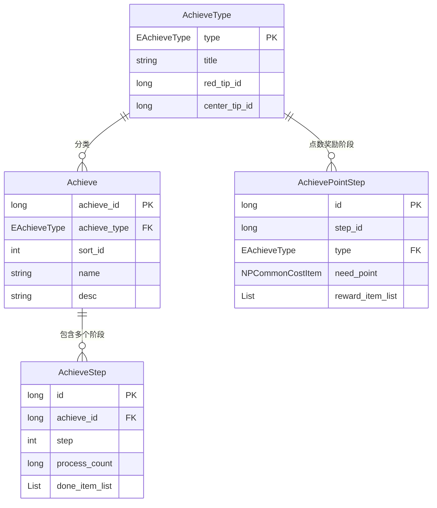
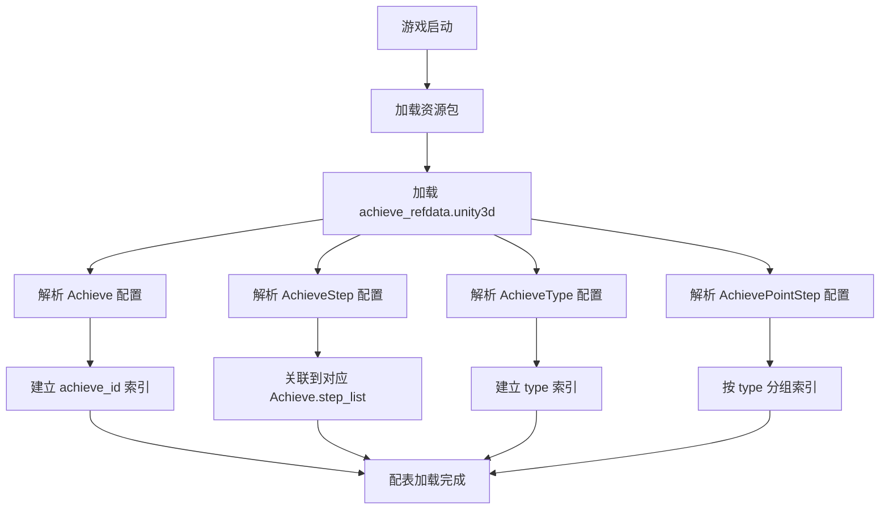

# 成就系统 - 数据配表

## 概述

成就系统 (Achieve) 是游戏中的里程碑玩法，玩家完成特定目标可获得成就和奖励。系统支持多种成就类型、多阶段奖励、成就点累计兑换等功能。

---

## 配表结构关系图



---

## 一、成就配置 (Achieve)

### 完整字段列表

| 字段名 | 类型 | 必填 | 说明 |
|-------|------|------|------|
| achieve_id | long | 是 | 唯一识别ID |
| achieve_type | EAchieveType | 是 | 成就类型枚举 |
| sort_id | int | 是 | 排序ID |
| icon | NPGTextureIndex | 是 | 图标索引 |
| name | string | 是 | 名称(多语言Key) |
| desc | string | 是 | 描述(多语言Key) |
| desc_args | List\<string\> | 否 | 描述参数列表 |
| process_num_format | EValueFormatType | 否 | 进度值格式化显示方式 |
| process_cur_count | _NPPlayerVariableSerializeInfo | 否 | 计数器高级公式 |
| go_to | _NPPlayerEffectSerializeInfo | 否 | 跳转效果配置 |
| add_msg_type_list | List\<string\> | 否 | 监听消息类型列表 |
| step_list | List\<AchieveStepRefObj\> | 是 | 阶段列表 |

### 数据结构 (C#)

```csharp
[System.Serializable]
public class AchieveRefObj : _IALBasicRefObj
{
    public long _refId { get { return achieve_id; } }
    public long achieve_id;           // 唯一识别ID
    public EAchieveType achieve_type; // 类型
    public int sort_id;               // 排序id
    public NPGTextureIndex icon;      // 图标
    public string name;               // 名称
    public string desc;               // 描述
    public List<string> desc_args;    // 描述参数
    public EValueFormatType process_num_format;         // 进度值格式化显示方式
    public _NPPlayerVariableSerializeInfo process_cur_count; // 计数器的高级公式
    public _NPPlayerEffectSerializeInfo go_to;          // 跳转效果
    public List<string> add_msg_type_list;              // 监听消息列表
    public List<AchieveStepRefObj> step_list { get; set; } // 阶段列表

    // 获取阶段数据
    public AchieveStepRefObj getActivityStep(int _stepId);
    public void addStepRef(AchieveStepRefObj _stepRef);
}
```

### 配置示例

```json
{
    "achieve_id": 10001,
    "achieve_type": 4,
    "sort_id": 1,
    "icon": "icon_achieve_hero",
    "name": "achieve_hero_collect",
    "desc": "achieve_hero_collect_desc",
    "process_num_format": 0,
    "step_list": [
        { "step": 1, "process_count": 5 },
        { "step": 2, "process_count": 15 },
        { "step": 3, "process_count": 30 },
        { "step": 4, "process_count": 50 }
    ]
}
```

---

## 二、成就阶段配置 (AchieveStep)

### 完整字段列表

| 字段名 | 类型 | 必填 | 说明 |
|-------|------|------|------|
| id | long | 是 | 唯一识别ID |
| achieve_id | long | 是 | 所属成就ID |
| step | int | 是 | 阶段序号(从1开始) |
| process_count | long | 是 | 进度条计数目标值 |
| done_item_list | List\<NPCommonCostItem\> | 是 | 完成奖励物品列表 |
| name | string | 是 | 阶段名称(多语言Key) |
| name_args | List\<string\> | 否 | 名称参数列表 |

### 数据结构 (C#)

```csharp
[System.Serializable]
public class AchieveStepRefObj : _IALBasicRefObj
{
    public long _refId { get { return id; } }
    public long id;                   // 唯一识别ID
    public long achieve_id;           // 所属成就ID
    public int step;                  // 活动阶段，静态表配置从1开始
    public long process_count;        // 进度条计数目标值
    public List<NPCommonCostItem> done_item_list; // 完成成就奖励物品列表
    public string name;               // 阶段名称
    public List<string> name_args;    // 名称参数

    public string getName { get => TextTranslate.instance.getLanguage(name, name_args); }
}
```

### 配置示例

```json
{
    "id": 10001001,
    "achieve_id": 10001,
    "step": 1,
    "process_count": 5,
    "done_item_list": [
        { "itemId": 1001, "count": 1000 },
        { "itemId": 2001, "count": 10 }
    ],
    "name": "achieve_step_1"
}
```

---

## 三、成就类型配置 (AchieveType)

### 完整字段列表

| 字段名 | 类型 | 必填 | 说明 |
|-------|------|------|------|
| type | EAchieveType | 是 | 成就类型枚举 |
| icon | NPGTextureIndex | 是 | 类型图标 |
| title | string | 是 | 类型标题(多语言Key) |
| need_reorder | bool | 否 | 步骤列表是否需重排序 |
| center_tip_id | long | 否 | 完成成就时提示ID |
| red_tip_id | long | 否 | 红点ID |
| is_show_in_achieve_wnd | bool | 否 | 是否在成就窗口显示 |

### 数据结构 (C#)

```csharp
[System.Serializable]
public class AchieveTypeRefObj : _IALBasicRefObj
{
    public long _refId { get { return (long)type; } }
    public EAchieveType type;         // 成就类型
    public NPGTextureIndex icon;      // 图标
    public string title;              // 标题
    public bool need_reorder;         // 步骤列表是否需要重新排序
    public long center_tip_id;        // 完成成就时提示id
    public long red_tip_id;           // 红点id
    public bool is_show_in_achieve_wnd; // 是否在成就窗口显示
}
```

---

## 四、成就点阶段配置 (AchievePointStep)

### 完整字段列表

| 字段名 | 类型 | 必填 | 说明 |
|-------|------|------|------|
| id | long | 是 | 唯一ID |
| step_id | long | 是 | 阶段ID |
| type | EAchieveType | 是 | 成就类型 |
| need_point | NPCommonCostItem | 是 | 需要的成就点数 |
| reward_item_list | List\<NPCommonCostItem\> | 是 | 奖励物品列表 |

### 数据结构 (C#)

```csharp
[System.Serializable]
public class AchievePointStepRefObj : _IALBasicRefObj
{
    public long _refId { get { return id; } }
    public long id;                       // 唯一id
    public long step_id;                  // 阶段id
    public EAchieveType type;             // 成就类型
    public NPCommonCostItem need_point;   // 需要的成就点数
    public List<NPCommonCostItem> reward_item_list; // 奖励物品列表
}
```

### 配置示例

```json
{
    "id": 4001,
    "step_id": 1,
    "type": 4,
    "need_point": { "itemId": 9001, "count": 100 },
    "reward_item_list": [
        { "itemId": 1001, "count": 5000 }
    ]
}
```

---

## 五、成就类型枚举 (EAchieveType)

### 完整枚举定义

```csharp
public enum EAchieveType
{
    NONE = 0,           // 无
    VILLAGE = 1,        // 城市建设
    FAMILY = 2,         // 缘分相遇
    PROGRESS = 3,       // 前进道路
    TREASURE = 4,       // 宝物收藏
    LIFESTYLE = 5,      // 异世生活
    EARNING_GOAL = 6,   // 赚速目标
    TREASURE_HUNT = 7,  // 太空寻宝
    MARS = 8            // 火星成就
}
```

### 类型说明表

| 枚举值 | 数值 | 说明 | 典型成就 |
|--------|------|------|----------|
| NONE | 0 | 无 | - |
| VILLAGE | 1 | 城市建设 | 建筑升级、城市繁荣度 |
| FAMILY | 2 | 缘分相遇 | 伴侣、子女相关 |
| PROGRESS | 3 | 前进道路 | 等级、战力成长 |
| TREASURE | 4 | 宝物收藏 | 英雄收集、道具收集 |
| LIFESTYLE | 5 | 异世生活 | 日常活动、社交 |
| EARNING_GOAL | 6 | 赚速目标 | 收益、金币相关 |
| TREASURE_HUNT | 7 | 太空寻宝 | 寻宝玩法 |
| MARS | 8 | 火星成就 | 火星玩法 |

---

## 六、配表加载流程



---

## 七、配表路径

| 配置类型 | 客户端路径 | 资源文件 |
|----------|------------|----------|
| 成就配置 | `game_client/Assets/Scripts/ResScripts/NPSO/GSO/Achieve/` | `refdata/achieve_refdata.unity3d` |
| 服务端配置 | `game_server/Config/achieve/` | Excel/JSON |

---

## 八、配置访问示例

### 客户端访问代码

```csharp
// 获取成就配置
AchieveRefObj achieveRef = GRefdataCoreMgr.instance.achieveMap.getRef(achieveId);

// 获取类型下的所有成就
List<AchieveRefObj> achieveList = new List<AchieveRefObj>();
GRefdataCoreMgr.instance.achieveMap.dealAllRef((AchieveRefObj _tempRef) =>
{
    if (_tempRef.achieve_type == EAchieveType.TREASURE)
        achieveList.Add(_tempRef);
});

// 获取成就类型配置
AchieveTypeRefObj typeRef = GRefdataCoreMgr.instance.achieveTypeMap.getRef((long)EAchieveType.TREASURE);

// 获取成就点阶段配置
AchievePointStepRefObj pointStepRef = GRefdataCoreMgr.instance.achievePointStepList.refList[i];
```

---

*文档更新时间: 2026-04-11*
