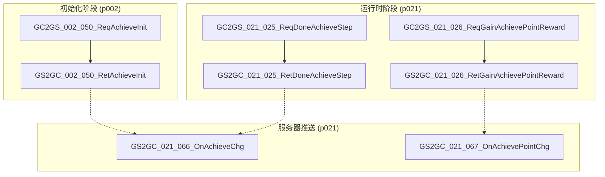
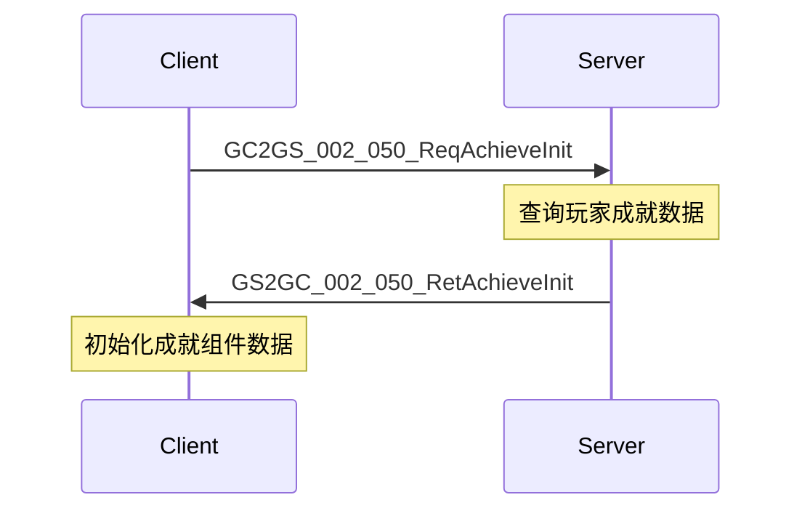
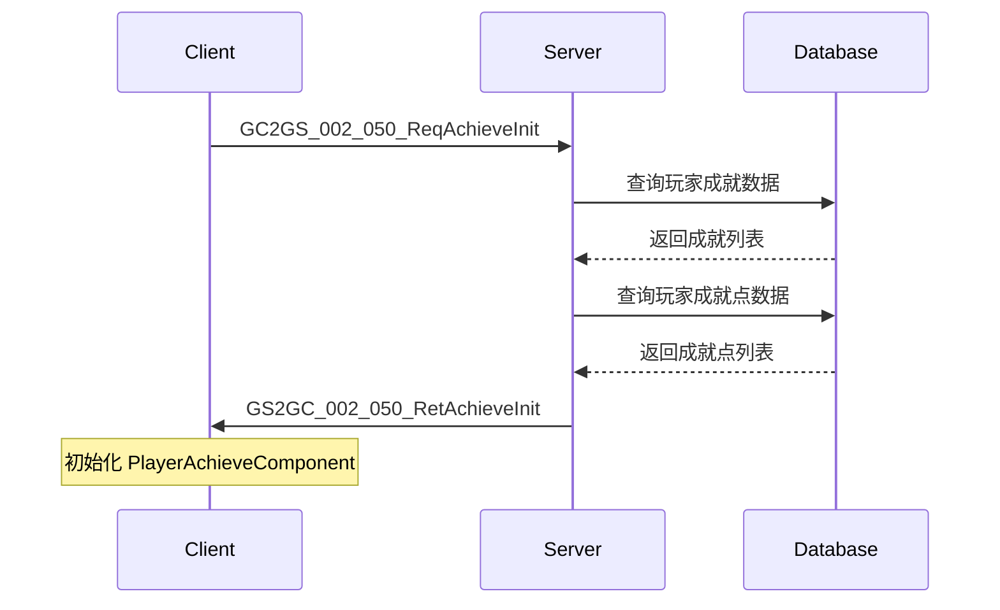
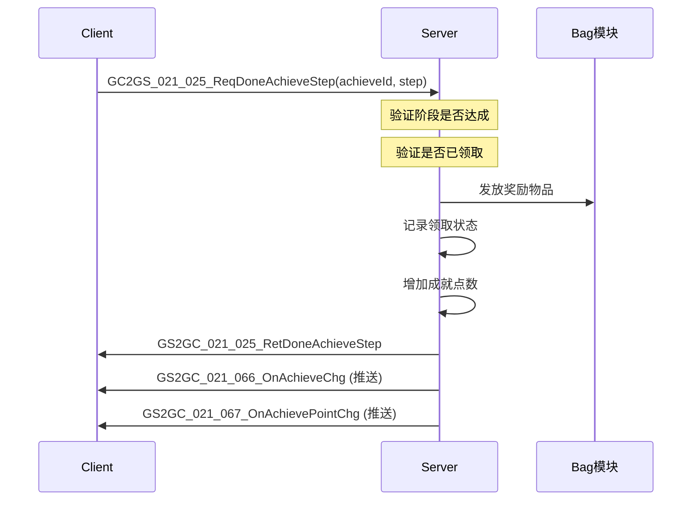
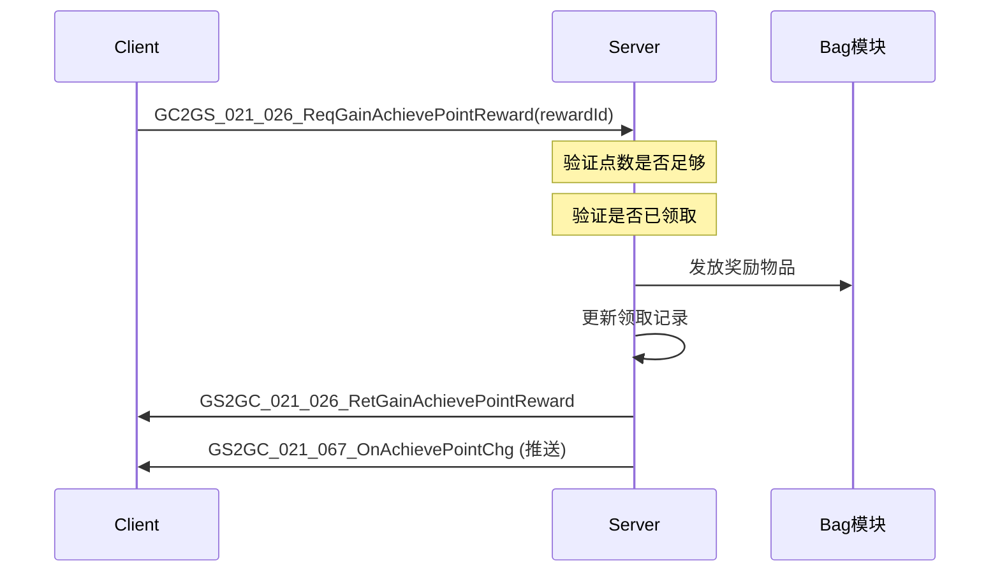

# 成就系统 - 协议文档

## 概述

成就系统通过 `p002_InitOp` 和 `p021_PlayerInfoOp` 两个协议模块进行通信。初始化阶段使用 p002，运行时操作使用 p021。

---

## 协议架构图



---

## 一、初始化协议

### GC2GS_002_050_ReqAchieveInit

**说明**：请求成就初始化数据

**协议号**：`p002_050`

**方向**：Client → Server

**请求参数**：无

**返回**：`GS2GC_002_050_RetAchieveInit`

---

### GS2GC_002_050_RetAchieveInit

**说明**：返回成就初始化数据

**协议号**：`p002_050`

**方向**：Server → Client

**完整字段列表**：

| 字段名 | 类型 | 说明 |
|-------|------|------|
| achievePointList | List\<Achieve_AchievePointInfo\> | 成就点列表 |
| achieveList | List\<Achieve_Info\> | 成就列表 |

**数据结构 (C#)**：

```csharp
public class GS2GC_002_050_RetAchieveInit : _IALProtocolStructure
{
    private List<Common.AchieveObj.Achieve_AchievePointInfo> achievePointList;
    private List<Common.AchieveObj.Achieve_Info> achieveList;

    public byte getMainOrder() { return (byte)2; }
    public byte getSubOrder() { return (byte)50; }

    public List<Common.AchieveObj.Achieve_AchievePointInfo> getAchievePointList();
    public List<Common.AchieveObj.Achieve_Info> getAchieveList();
}
```

**时序图**：



---

## 二、领取奖励协议

### GC2GS_021_025_ReqDoneAchieveStep

**说明**：请求领取成就阶段奖励

**协议号**：`p021_025`

**方向**：Client → Server

**完整字段列表**：

| 字段名 | 类型 | 必填 | 说明 |
|-------|------|------|------|
| achieveId | long | 是 | 成就ID |
| step | int | 是 | 阶段序号 |

**数据结构 (C#)**：

```csharp
public class GC2GS_021_025_ReqDoneAchieveStep : _IALProtocolStructure
{
    private long achieveId;
    private int step;

    public byte getMainOrder() { return (byte)21; }
    public byte getSubOrder() { return (byte)25; }

    public long getAchieveId();
    public int getStep();
}
```

**请求示例**：

```csharp
// 领取成就ID=10001的第2阶段奖励
var req = new GC2GS_021_025_ReqDoneAchieveStep();
req.setAchieveId(10001);
req.setStep(2);
```

**返回**：`GS2GC_021_025_RetDoneAchieveStep`

---

### GS2GC_021_025_RetDoneAchieveStep

**说明**：返回领取成就阶段奖励结果

**协议号**：`p021_025`

**方向**：Server → Client

**字段列表**：无额外字段，成功即返回

---

### GC2GS_021_026_ReqGainAchievePointReward

**说明**：请求领取成就点奖励

**协议号**：`p021_026`

**方向**：Client → Server

**完整字段列表**：

| 字段名 | 类型 | 必填 | 说明 |
|-------|------|------|------|
| achievePointRewardId | long | 是 | 成就点奖励配置ID |

**数据结构 (C#)**：

```csharp
public class GC2GS_021_026_ReqGainAchievePointReward : _IALProtocolStructure
{
    private long achievePointRewardId;

    public byte getMainOrder() { return (byte)21; }
    public byte getSubOrder() { return (byte)26; }

    public long getAchievePointRewardId();
}
```

**返回**：`GS2GC_021_026_RetGainAchievePointReward`

---

### GS2GC_021_026_RetGainAchievePointReward

**说明**：返回领取成就点奖励结果

**协议号**：`p021_026`

**方向**：Server → Client

**字段列表**：无额外字段，成功即返回

---

## 三、服务器推送协议

### GS2GC_021_066_OnAchieveChg

**说明**：推送成就信息变化

**协议号**：`p021_066`

**方向**：Server → Client (推送)

**完整字段列表**：

| 字段名 | 类型 | 说明 |
|-------|------|------|
| achieve | Achieve_Info | 成就数据 |

**数据结构 (C#)**：

```csharp
/// <summary>
/// 成就变更推送
/// </summary>
public class GS2GC_021_066_OnAchieveChg : _IALProtocolStructure
{
    private Common.AchieveObj.Achieve_Info achieve;

    public byte getMainOrder() { return (byte)21; }
    public byte getSubOrder() { return (byte)66; }

    public Common.AchieveObj.Achieve_Info getAchieve();
}
```

**触发时机**：
- 成就进度更新时
- 领取成就阶段奖励后
- 成就阶段变更时

---

### GS2GC_021_067_OnAchievePointChg

**说明**：推送成就点变化

**协议号**：`p021_067`

**方向**：Server → Client (推送)

**完整字段列表**：

| 字段名 | 类型 | 说明 |
|-------|------|------|
| achievePointInfo | Achieve_AchievePointInfo | 成就点信息 |

**数据结构 (C#)**：

```csharp
/// <summary>
/// 成就点变更推送
/// </summary>
public class GS2GC_021_067_OnAchievePointChg : _IALProtocolStructure
{
    private Common.AchieveObj.Achieve_AchievePointInfo achievePointInfo;

    public byte getMainOrder() { return (byte)21; }
    public byte getSubOrder() { return (byte)67; }

    public Common.AchieveObj.Achieve_AchievePointInfo getAchievePointInfo();
}
```

**触发时机**：
- 领取成就阶段奖励后（成就点增加）
- 领取成就点奖励后

---

## 四、数据结构详解

### Achieve_Info

**说明**：成就数据

**完整字段列表**：

| 字段名 | 类型 | 说明 |
|-------|------|------|
| achieveId | long | 成就ID |
| counter | long | 成就步骤计数 |
| hadDrawStepList | List\<int\> | 已领取成就步骤列表 |

**数据结构 (C#)**：

```csharp
/// <summary>
/// 成就数据
/// </summary>
public class Achieve_Info : _IALProtocolStructure
{
    private long achieveId;             // 成就ID
    private long counter;               // 成就步骤计数
    private List<int> hadDrawStepList;  // 已领取成就步骤列表

    public long getAchieveId();
    public long getCounter();
    public List<int> getHadDrawStepList();
    public void addHadDrawStepList(int _hadDrawStepList);
}
```

---

### Achieve_AchievePointInfo

**说明**：成就点数据

**完整字段列表**：

| 字段名 | 类型 | 说明 |
|-------|------|------|
| type | int | 成就点ID (EAchieveType) |
| count | long | 数量 |
| hadDrawMaxStep | int | 已领取最大成就步骤 |

**数据结构 (C#)**：

```csharp
/// <summary>
/// 成就点数据
/// </summary>
public class Achieve_AchievePointInfo : _IALProtocolStructure
{
    private int type;              // 成就点ID EAchieveType
    private long count;            // 数量
    private int hadDrawMaxStep;    // 已领取最大成就步骤

    public int getType();
    public long getCount();
    public int getHadDrawMaxStep();
}
```

---

### Common_AchieveInfo

**说明**：通用成就信息（部分协议使用）

**完整字段列表**：

| 字段名 | 类型 | 说明 |
|-------|------|------|
| achieveId | long | 成就ID |
| curStep | int | 当前阶段 |
| curServerDoneState | bool | 当前服务端完成状态 |
| curCounter | long | 当前计数 |

**数据结构 (C#)**：

```csharp
public class Common_AchieveInfo : _IALProtocolStructure
{
    private long achieveId;
    private int curStep;
    private bool curServerDoneState;
    private long curCounter;

    public long getAchieveId();
    public int getCurStep();
    public bool getCurServerDoneState();
    public long getCurCounter();
}
```

---

## 五、协议交互流程图

### 5.1 初始化流程



### 5.2 领取成就奖励流程



### 5.3 领取成就点奖励流程



---

## 六、错误码定义

| 错误码 | 错误信息 | 触发场景 |
|--------|----------|----------|
| 50001 | 成就不存在 | 成就ID无效 |
| 50002 | 阶段未达到 | 进度未达标 |
| 50003 | 奖励已领取 | 重复领取 |
| 50004 | 成就点不足 | 点数不够 |
| 50005 | 点数奖励已领取 | 重复领取 |
| 50006 | 成就类型无效 | 类型参数错误 |

---

## 七、协议使用示例

### 客户端发送请求

```csharp
// 请求初始化
NPGSClientListener.sendMsgByLog(GSWriter_002_InitOp.make_002_050_ReqAchieveInit());

// 请求领取成就奖励
NPGSClientListener.sendRequestByLog(
    NPGSWriter_021_PlayerInfoOp.make_025_ReqDoneAchieveStep(achieveId, step),
    new CommonErrCodeRequestCallbackProtocolDealer<GS2GC_021_025_RetDoneAchieveStep>((msg) =>
    {
        Debug.Log("领取成功");
    }));

// 请求领取成就点奖励
NPGSClientListener.sendRequestByLog(
    NPGSWriter_021_PlayerInfoOp.make_026_ReqGainAchievePointReward(achievePointRewardId),
    new CommonErrCodeRequestCallbackProtocolDealer<GS2GC_021_026_RetGainAchievePointReward>((msg) =>
    {
        Debug.Log("领取成功");
    }));
```

### 服务端处理示例

```java
// 处理领取成就奖励请求
public void handleReqDoneAchieveStep(long playerId, GC2GS_021_025_ReqDoneAchieveStep req) {
    long achieveId = req.getAchieveId();
    int step = req.getStep();

    // 验证并发放奖励
    Result result = achieveService.takeAchieveStepReward(playerId, achieveId, step);
    if (result.isSuccess()) {
        // 推送变化
        pushAchieveChg(playerId, achieveId);
        pushAchievePointChg(playerId, achieveId);
    }

    // 返回结果
    sendMsg(playerId, new GS2GC_021_025_RetDoneAchieveStep());
}
```

---

*文档更新时间: 2026-04-11*
