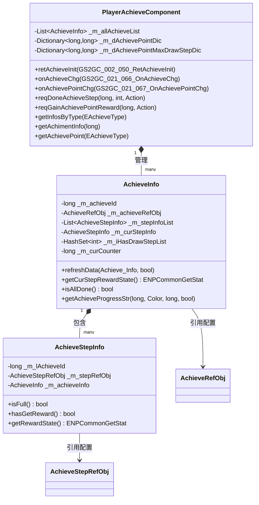
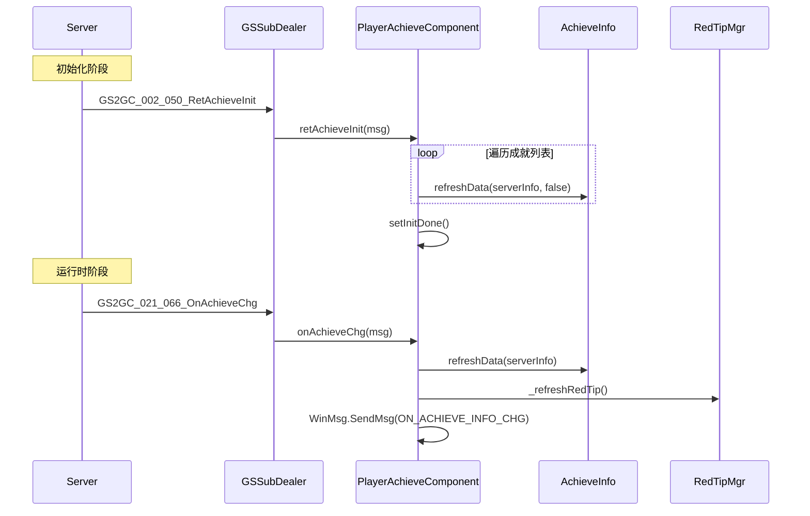
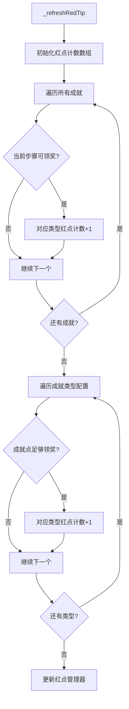

# 成就系统 - 客户端开发

## 概述

成就系统客户端负责成就数据的展示、领奖交互、红点提示等功能。采用组件化架构，与服务器通过协议同步数据。

---

## 组件架构图



---

## 一、文件结构

```
GameComponent/Achieve/
├── PlayerAchieveComponent.cs    # 成就组件（核心管理器）
├── AchieveInfo.cs               # 成就信息类
└── AchieveStepInfo.cs           # 成就阶段信息类

GameWndGui/GGui/Achieve/
├── GGUIWndAchieveGrid.cs        # 成就列表网格
├── GGUIWndAchieveGridItem.cs    # 成就列表项
├── GGUIWndAchievePage.cs        # 成就页面
├── GGUIWndAchieveStep.cs        # 成就步骤组件
├── GGUIWndAchieveStepGrid.cs    # 成就步骤网格
├── GGUIWndAchieveStepGridItem.cs # 成就步骤项
├── GGUIWndAchieveTypeTabContainer.cs      # 类型标签容器
├── GGUIWndAchieveTypeTabContainerItem.cs  # 类型标签项
├── GGUIWndAchievePointProgress.cs         # 成就点进度条
└── Common/
    └── GGUIWndCommonAchieve.cs  # 通用成就窗口

NPGSClientListener/SubDealer/
├── p002_InitOp/
│   └── GSSubDealer_002_050_RetAchieveInit.cs  # 初始化消息处理
└── p021_PlayerInfo/
    ├── GSSubDealer_021_066_OnAchieveChg.cs     # 成就变化处理
    └── GSSubDealer_021_067_OnAchievePointChg.cs # 成就点变化处理
```

---

## 二、核心组件详解

### 2.1 PlayerAchieveComponent

成就组件，继承自 `_ANPBasicPlayerComponent`，管理玩家所有成就数据。

**完整字段列表**：

| 字段名 | 类型 | 说明 |
|-------|------|------|
| _m_allAchieveList | List\<AchieveInfo\> | 成就列表 |
| _m_dAchievePointDic | Dictionary\<long, long\> | 不同类型的成就点数 |
| _m_dAchievePointMaxDrawStepDic | Dictionary\<long, long\> | 已领取奖励的最大阶段 |

**核心代码**：

```csharp
public class PlayerAchieveComponent : _ANPBasicPlayerComponent
{
    [NotNull] private List<AchieveInfo> _m_allAchieveList;
    [NotNull] private Dictionary<long, long> _m_dAchievePointDic;
    [NotNull] private Dictionary<long, long> _m_dAchievePointMaxDrawStepDic;

    public override bool isMustInit { get { return true; } }
    public override ENPPlayerCompType compType { get { return ENPPlayerCompType.ACHIEVE; } }
    public override bool canPreInit { get { return true; } }

    public List<AchieveInfo> achieveInfoList { get { return _m_allAchieveList; } }
}
```

**主要方法**：

| 方法名 | 参数 | 返回值 | 说明 |
|--------|------|--------|------|
| getInfosByType | EAchieveType _type | List\<AchieveInfo\> | 根据类型获取成就列表 |
| getAchimentInfo | long _achieveId | AchieveInfo | 获取指定成就信息 |
| getAchievePoint | EAchieveType _type | long | 获取对应类型的成就点数 |
| hadGetAchievePoint | long _type, long _stepId | bool | 是否已领取成就点奖励 |
| getCurAchievePointRef | EAchieveType _type | AchievePointStepRefObj | 获取当前进行中的阶段配置 |
| achievePointStepGetStat | AchievePointStepRefObj | ENPCommonGetStat | 获取成就点阶段领取状态 |
| reqDoneAchieveStep | long, int, Action | void | 请求领取成就奖励 |
| reqGainAchievePointReward | long, Action | void | 请求领取成就点奖励 |

---

### 2.2 AchieveInfo

成就信息类，管理单个成就的数据和状态。

**完整字段列表**：

| 字段名 | 类型 | 说明 |
|-------|------|------|
| _m_achieveId | long | 成就ID |
| _m_achieveRefObj | AchieveRefObj | 成就配表数据 |
| _m_stepInfoList | List\<AchieveStepInfo\> | 步骤列表 |
| _m_curStepInfo | AchieveStepInfo | 当前步骤 |
| _m_iHasDrawStepList | HashSet\<int\> | 已领取奖励步骤列表 |
| _m_curCounter | long | 当前计数 |
| _m_isLastFull | bool | 上次刷新是否已满 |
| _m_bIsInitLastFullTag | bool | 是否初始化了LastFull标记 |

**核心代码**：

```csharp
public class AchieveInfo
{
    private long _m_achieveId;
    private AchieveRefObj _m_achieveRefObj;
    private List<AchieveStepInfo> _m_stepInfoList;
    private AchieveStepInfo _m_curStepInfo;
    private HashSet<int> _m_iHasDrawStepList;
    private long _m_curCounter;

    // 属性
    public long achieveId { get; }
    public AchieveRefObj achieveRefObj { get; }
    public List<AchieveStepInfo> stepInfoList { get; }
    public AchieveStepInfo curStepInfo { get; }
    public int step { get; }
    public long curStepCount { get; }
    public HashSet<int> hasDrawStepList { get; }
    public EAchieveType achieveType { get; }

    /// <summary>
    /// 刷新服务端信息
    /// </summary>
    public void refreshData(Achieve_Info _info, bool isPopTip = true)
    {
        if (null == _info || _info.getAchieveId() != _m_achieveId)
            return;

        _m_curCounter = _info.getCounter();
        _m_iHasDrawStepList = new HashSet<int>(_info.getHadDrawStepList());
        _m_curStepInfo = _getCurStep();
        _setAchieveIsFull(isPopTip);
    }

    /// <summary>
    /// 获取当前步骤领奖状态
    /// </summary>
    public ENPCommonGetStat getCurStepRewardState()
    {
        if (_m_curStepInfo != null)
            return _m_curStepInfo.getRewardState();
        return ENPCommonGetStat.CAN_NOT_GET;
    }

    /// <summary>
    /// 是否成就步骤已经全部完成
    /// </summary>
    public bool isAllDone()
    {
        foreach (AchieveStepInfo achieveStepInfo in _m_stepInfoList)
        {
            if (achieveStepInfo.getRewardState() != ENPCommonGetStat.HAS_GET)
                return false;
        }
        return true;
    }
}
```

---

### 2.3 AchieveStepInfo

成就步骤信息类，管理单个成就阶段的数据和状态。

**完整字段列表**：

| 字段名 | 类型 | 说明 |
|-------|------|------|
| _m_lAchieveId | long | 成就ID |
| _m_stepRefObj | AchieveStepRefObj | 成就步骤配置 |
| _m_achieveInfo | AchieveInfo | 成就信息 |

**核心代码**：

```csharp
public class AchieveStepInfo
{
    private long _m_lAchieveId;
    private AchieveStepRefObj _m_stepRefObj;
    private AchieveInfo _m_achieveInfo;

    public long achieveId { get; }
    public AchieveInfo achieveInfo { get; }
    public AchieveStepRefObj stepRefObj { get; }
    public int step { get; }

    /// <summary>
    /// 是否已经达到成就计数
    /// </summary>
    public bool isFull()
    {
        if (_m_achieveInfo == null || _m_stepRefObj == null)
            return false;
        return _m_achieveInfo.curStepCount >= _m_stepRefObj.process_count;
    }

    /// <summary>
    /// 是否已经领取奖励
    /// </summary>
    public bool hasGetReward()
    {
        if (_m_achieveInfo == null || _m_achieveInfo.hasDrawStepList == null)
            return false;
        return _m_achieveInfo.hasDrawStepList.Contains(_m_stepRefObj.step);
    }

    /// <summary>
    /// 当前可领取状态
    /// </summary>
    public ENPCommonGetStat getRewardState()
    {
        if (hasGetReward())
            return ENPCommonGetStat.HAS_GET;
        if (isFull())
            return ENPCommonGetStat.CAN_GET;
        return ENPCommonGetStat.CAN_NOT_GET;
    }
}
```

---

## 三、数据同步流程



---

## 四、协议对接实现

### 4.1 初始化数据处理

```csharp
/// <summary>
/// 初始化成就信息
/// </summary>
public void retAchieveInit(GS2GC_002_050_RetAchieveInit _msg)
{
    AchieveInfo achieveInfo = null;
    Achieve_Info serverInfo = null;

    // 处理成就列表
    for (int i = 0; i < _msg.getAchieveList().Count; i++)
    {
        serverInfo = _msg.getAchieveList()[i];
        achieveInfo = getAchimentInfo(serverInfo.getAchieveId());
        if (null == achieveInfo)
        {
            ALLog.Error($"成就id：{serverInfo.getAchieveId()}找不到对应的配表信息");
            continue;
        }
        achieveInfo.refreshData(serverInfo, false);
    }

    // 处理成就点列表
    Achieve_AchievePointInfo achievePointInfo = null;
    for (int i = 0; i < _msg.getAchievePointList().Count; i++)
    {
        achievePointInfo = _msg.getAchievePointList()[i];
        _m_dAchievePointDic[achievePointInfo.getType()] = achievePointInfo.getCount();
        _m_dAchievePointMaxDrawStepDic[achievePointInfo.getType()] = achievePointInfo.getHadDrawMaxStep();
    }

    setInitDone();
}
```

### 4.2 成就变化处理

```csharp
/// <summary>
/// 成就信息变化
/// </summary>
public void onAchieveChg(GS2GC_021_066_OnAchieveChg _msg)
{
    Achieve_Info serverInfo = _msg.getAchieve();
    if (null == serverInfo)
        return;

    AchieveInfo achieveInfo = getAchimentInfo(serverInfo.getAchieveId());
    if (null == achieveInfo)
    {
        ALLog.Error($"成就id：{serverInfo.getAchieveId()}找不到对应的配表信息");
        return;
    }

    achieveInfo.refreshData(serverInfo);

    // 刷新红点
    _refreshRedTip();

    // 发送消息通知UI更新
    WinMsg.SendMsg(WinMsgType.ON_ACHIEVE_INFO_CHG, achieveInfo);
}
```

### 4.3 成就点变化处理

```csharp
/// <summary>
/// 成就点变化
/// </summary>
public void onAchievePointChg(GS2GC_021_067_OnAchievePointChg _msg)
{
    if (_msg == null || _msg.getAchievePointInfo() == null)
        return;

    _m_dAchievePointDic[_msg.getAchievePointInfo().getType()] = _msg.getAchievePointInfo().getCount();
    _m_dAchievePointMaxDrawStepDic[_msg.getAchievePointInfo().getType()] = _msg.getAchievePointInfo().getHadDrawMaxStep();

    // 刷新红点
    _refreshRedTip();

    WinMsg.SendMsg(WinMsgType.ON_ACHIEVE_POINT_CHG, _msg.getAchievePointInfo().getType());
}
```

---

## 五、请求发送实现

### 5.1 请求初始化

```csharp
/// <summary>
/// 请求成就列表初始化信息
/// </summary>
public void reqAchieveInit()
{
    NPGSClientListener.sendMsgByLog(GSWriter_002_InitOp.make_002_050_ReqAchieveInit());
}
```

### 5.2 请求领取成就奖励

```csharp
/// <summary>
/// 请求领取成就奖励
/// </summary>
/// <param name="_achieveId">成就ID</param>
/// <param name="_step">阶段</param>
/// <param name="_doneAction">完成回调</param>
public void reqDoneAchieveStep(long _achieveId, int _step, Action _doneAction)
{
    NPGSClientListener.sendRequestByLog(
        NPGSWriter_021_PlayerInfoOp.make_025_ReqDoneAchieveStep(_achieveId, _step),
        new CommonErrCodeRequestCallbackProtocolDealer<GS2GC_021_025_RetDoneAchieveStep>((info) =>
        {
            _doneAction?.Invoke();
        }));
}
```

### 5.3 请求领取成就点奖励

```csharp
/// <summary>
/// 请求领取成就点数奖励
/// </summary>
/// <param name="_achieveStepRewardId">成就点奖励ID</param>
/// <param name="_callback">完成回调</param>
public void reqGainAchievePointReward(long _achieveStepRewardId, Action _callback)
{
    NPGSClientListener.sendRequestByLog(
        NPGSWriter_021_PlayerInfoOp.make_026_ReqGainAchievePointReward(_achieveStepRewardId),
        new CommonErrCodeRequestCallbackProtocolDealer<GS2GC_021_026_RetGainAchievePointReward>((_msg) =>
        {
            _callback?.Invoke();
        }));
}
```

---

## 六、红点刷新机制



**红点刷新代码**：

```csharp
// 刷新红点
private void _refreshRedTip()
{
    long[] redCountList = new long[ALCommon.getEnumCount(typeof(EAchieveType))];
    long count = 0;

    // 成就是否可领取奖励
    for (int i = 0; i < _m_allAchieveList.Count; i++)
    {
        if (_m_allAchieveList[i] == null)
            continue;
        if (_m_allAchieveList[i].getCurStepRewardState() == ENPCommonGetStat.CAN_GET)
            redCountList[(int)_m_allAchieveList[i].achieveType]++;
    }

    // 成就点数是否有可领取奖励
    GRefdataCoreMgr.instance.achieveTypeMap.dealAllRef((_refObj) =>
    {
        AchievePointStepRefObj achievePointStepRef = getCurAchievePointRef(_refObj.type);
        if (achievePointStepRef != null && GCommon.isItemEnough(achievePointStepRef.need_point, false))
            redCountList[(int)_refObj.type]++;

        if (_refObj.red_tip_id > 0)
            RedTipMgr.instance.setCountByRefRedTipId(_refObj.red_tip_id, redCountList[(int)_refObj.type]);
    });
}
```

---

## 七、UI层使用示例

### 7.1 获取成就数据

```csharp
// 获取成就组件
PlayerAchieveComponent achieveComp = NPPlayerMgr.instance.player.getComp<PlayerAchieveComponent>();

// 获取所有成就
List<AchieveInfo> allAchieves = achieveComp.achieveInfoList;

// 获取指定类型成就
List<AchieveInfo> treasureAchieves = achieveComp.getInfosByType(EAchieveType.TREASURE);

// 获取单个成就
AchieveInfo achieve = achieveComp.getAchimentInfo(10001);

// 获取成就点数
long point = achieveComp.getAchievePoint(EAchieveType.TREASURE);
```

### 7.2 领取奖励交互

```csharp
// 领取成就奖励
public void OnClickReceiveReward(AchieveInfo achieve, int step)
{
    PlayerAchieveComponent achieveComp = NPPlayerMgr.instance.player.getComp<PlayerAchieveComponent>();
    achieveComp.reqDoneAchieveStep(achieve.achieveId, step, () =>
    {
        // 领取成功，刷新UI
        RefreshAchieveItem(achieve);
    });
}

// 领取成就点奖励
public void OnClickReceivePointReward(AchievePointStepRefObj stepRef)
{
    PlayerAchieveComponent achieveComp = NPPlayerMgr.instance.player.getComp<PlayerAchieveComponent>();
    achieveComp.reqGainAchievePointReward(stepRef.id, () =>
    {
        // 领取成功，刷新UI
        RefreshPointProgress();
    });
}
```

### 7.3 监听成就变化

```csharp
// 注册消息监听
void OnEnable()
{
    WinMsg.RegisterMsg(WinMsgType.ON_ACHIEVE_INFO_CHG, OnAchieveInfoChg);
    WinMsg.RegisterMsg(WinMsgType.ON_ACHIEVE_POINT_CHG, OnAchievePointChg);
}

void OnDisable()
{
    WinMsg.UnregisterMsgAct(WinMsgType.ON_ACHIEVE_INFO_CHG, OnAchieveInfoChg);
    WinMsg.UnregisterMsgAct(WinMsgType.ON_ACHIEVE_POINT_CHG, OnAchievePointChg);
}

void OnAchieveInfoChg(AchieveInfo achieve)
{
    // 刷新对应成就UI
    RefreshAchieveItem(achieve);
}

void OnAchievePointChg(int type)
{
    // 刷新成就点进度UI
    RefreshPointProgress((EAchieveType)type);
}
```

---

## 八、注意事项

1. **初始化时机**：成就可以提前初始化 (`canPreInit = true`)，但需要在所有组件初始化完成后设置 `isLastFull` 标记
2. **进度更新**：成就进度由服务端推送，客户端只负责展示
3. **阶段奖励**：阶段奖励需要手动领取，领取后自动增加成就点
4. **红点逻辑**：成就可领奖 + 成就点可领奖都会触发红点
5. **消息监听**：每个成就可以配置监听特定消息类型，用于客户端判断是否达成

---

*文档更新时间: 2026-04-11*
