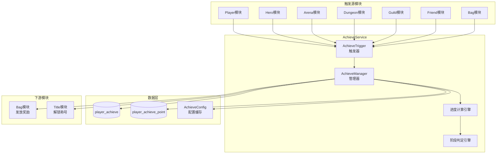
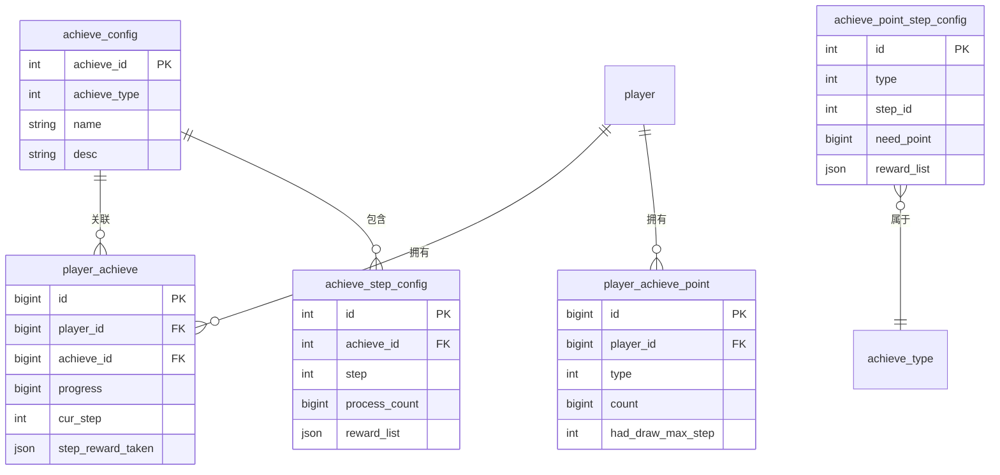

# 成就系统 - 服务端开发

## 概述

成就服务端负责成就进度的计算、存储、奖励发放和数据同步。采用事件驱动架构，通过触发器机制响应游戏内各种行为。

---

## 服务架构图



---

## 一、模块结构

```
GameServer/
├── AchieveModule/
│   ├── AchieveService.java        # 成就服务主类
│   ├── AchieveManager.java        # 成就管理器
│   ├── AchieveTrigger.java        # 成就触发器
│   ├── AchieveDao.java            # 数据访问层
│   └── entity/
│       ├── PlayerAchieve.java     # 玩家成就实体
│       └── PlayerAchievePoint.java # 玩家成就点实体
```

---

## 二、数据存储设计

### 2.1 成就数据表 (player_achieve)

```sql
CREATE TABLE player_achieve (
    id BIGINT PRIMARY KEY AUTO_INCREMENT,
    player_id BIGINT NOT NULL COMMENT '玩家ID',
    achieve_id BIGINT NOT NULL COMMENT '成就ID',
    progress BIGINT NOT NULL DEFAULT 0 COMMENT '进度',
    cur_step INT NOT NULL DEFAULT 0 COMMENT '当前阶段',
    step_reward_taken JSON COMMENT '已领取阶段奖励列表',
    create_time DATETIME DEFAULT CURRENT_TIMESTAMP,
    update_time DATETIME DEFAULT CURRENT_TIMESTAMP ON UPDATE CURRENT_TIMESTAMP,
    INDEX idx_player_id (player_id),
    UNIQUE KEY uk_player_achieve (player_id, achieve_id)
) ENGINE=InnoDB DEFAULT CHARSET=utf8mb4 COMMENT='玩家成就表';
```

**完整字段说明**：

| 字段名 | 类型 | 说明 | 约束 |
|-------|------|------|------|
| id | bigint | 自增主键 | PRIMARY KEY |
| player_id | bigint | 玩家ID | NOT NULL, INDEX |
| achieve_id | bigint | 成就ID | NOT NULL |
| progress | bigint | 当前进度 | DEFAULT 0 |
| cur_step | int | 当前阶段 | DEFAULT 0 |
| step_reward_taken | json | 已领取阶段列表 | - |
| create_time | datetime | 创建时间 | - |
| update_time | datetime | 更新时间 | - |

### 2.2 成就点表 (player_achieve_point)

```sql
CREATE TABLE player_achieve_point (
    id BIGINT PRIMARY KEY AUTO_INCREMENT,
    player_id BIGINT NOT NULL COMMENT '玩家ID',
    type INT NOT NULL COMMENT '成就类型',
    count BIGINT NOT NULL DEFAULT 0 COMMENT '点数累计',
    had_draw_max_step INT NOT NULL DEFAULT 0 COMMENT '已领取最大阶段',
    create_time DATETIME DEFAULT CURRENT_TIMESTAMP,
    update_time DATETIME DEFAULT CURRENT_TIMESTAMP ON UPDATE CURRENT_TIMESTAMP,
    INDEX idx_player_id (player_id),
    UNIQUE KEY uk_player_type (player_id, type)
) ENGINE=InnoDB DEFAULT CHARSET=utf8mb4 COMMENT='玩家成就点表';
```

**完整字段说明**：

| 字段名 | 类型 | 说明 | 约束 |
|-------|------|------|------|
| id | bigint | 自增主键 | PRIMARY KEY |
| player_id | bigint | 玩家ID | NOT NULL, INDEX |
| type | int | 成就类型 | NOT NULL |
| count | bigint | 点数累计 | DEFAULT 0 |
| had_draw_max_step | int | 已领取最大阶段 | DEFAULT 0 |
| create_time | datetime | 创建时间 | - |
| update_time | datetime | 更新时间 | - |

---

## 三、ER图



---

## 四、核心逻辑实现

### 4.1 成就进度更新

```java
/**
 * 更新成就进度
 * @param playerId 玩家ID
 * @param achieveId 成就ID
 * @param addValue 增量值
 * @param isAccumulate 是否累加型
 */
public void updateProgress(long playerId, long achieveId, long addValue, boolean isAccumulate) {
    // 获取玩家成就数据
    PlayerAchieve achieve = achieveDao.selectByPlayerAndId(playerId, achieveId);
    AchieveConfig config = achieveConfigDao.getById(achieveId);

    if (config == null) {
        return;
    }

    if (achieve == null) {
        achieve = new PlayerAchieve();
        achieve.setPlayerId(playerId);
        achieve.setAchieveId(achieveId);
        achieve.setProgress(0);
        achieve.setCurStep(0);
        achieve.setStepRewardTaken(new ArrayList<>());
    }

    // 检查是否已完成最高阶段
    if (achieve.getCurStep() >= config.getStepList().size()) {
        return; // 已完成，跳过
    }

    // 更新进度
    long newProgress;
    if (isAccumulate) {
        newProgress = achieve.getProgress() + addValue;
    } else {
        newProgress = Math.max(achieve.getProgress(), addValue);
    }
    achieve.setProgress(newProgress);

    // 检查阶段变化
    int newStep = calculateCurrentStep(config, newProgress);
    if (newStep > achieve.getCurStep()) {
        achieve.setCurStep(newStep);
        // 推送红点
        pushRedDot(playerId, config.getAchieveType());
    }

    achieveDao.saveOrUpdate(achieve);

    // 推送通知
    pushAchieveChg(playerId, achieve);
}

/**
 * 计算当前阶段
 */
private int calculateCurrentStep(AchieveConfig config, long progress) {
    int step = 0;
    for (AchieveStepConfig stepConfig : config.getStepList()) {
        if (progress >= stepConfig.getProcessCount()) {
            step = stepConfig.getStep();
        } else {
            break;
        }
    }
    return step;
}
```

### 4.2 领取成就阶段奖励

```java
/**
 * 领取成就阶段奖励
 * @param playerId 玩家ID
 * @param achieveId 成就ID
 * @param step 阶段
 */
public Result takeAchieveStepReward(long playerId, long achieveId, int step) {
    // 获取玩家成就数据
    PlayerAchieve achieve = achieveDao.selectByPlayerAndId(playerId, achieveId);
    if (achieve == null) {
        return Result.error(50001, "成就不存在");
    }

    // 检查阶段是否达到
    if (achieve.getCurStep() < step) {
        return Result.error(50002, "阶段未达到");
    }

    // 检查是否已领取
    if (achieve.getStepRewardTaken().contains(step)) {
        return Result.error(50003, "奖励已领取");
    }

    // 获取阶段配置
    AchieveStepConfig stepConfig = achieveStepConfigDao.getByAchieveAndStep(achieveId, step);
    if (stepConfig == null) {
        return Result.error(50001, "配置不存在");
    }

    // 发放奖励
    bagService.giveItems(playerId, stepConfig.getDoneItemList());

    // 记录领取
    achieve.getStepRewardTaken().add(step);
    achieveDao.updateById(achieve);

    // 增加成就点数
    AchieveConfig achieveConfig = achieveConfigDao.getById(achieveId);
    addAchievePoint(playerId, achieveConfig.getAchieveType(), stepConfig.getPoint());

    return Result.success();
}
```

### 4.3 成就点数管理

```java
/**
 * 增加成就点数
 */
private void addAchievePoint(long playerId, int achieveType, int point) {
    PlayerAchievePoint achievePoint = achievePointDao.selectByPlayerAndType(playerId, achieveType);

    if (achievePoint == null) {
        achievePoint = new PlayerAchievePoint();
        achievePoint.setPlayerId(playerId);
        achievePoint.setType(achieveType);
        achievePoint.setCount(0L);
        achievePoint.setHadDrawMaxStep(0);
    }

    // 累加点数
    achievePoint.setCount(achievePoint.getCount() + point);
    achievePointDao.saveOrUpdate(achievePoint);

    // 推送更新
    pushAchievePointChg(playerId, achievePoint);
}

/**
 * 领取成就点奖励
 */
public Result takeAchievePointReward(long playerId, int achieveType, int step) {
    PlayerAchievePoint achievePoint = achievePointDao.selectByPlayerAndType(playerId, achieveType);
    if (achievePoint == null) {
        return Result.error(50004, "成就点不足");
    }

    // 获取阶段配置
    AchievePointStepConfig stepConfig = achievePointStepConfigDao.getByTypeAndStep(achieveType, step);

    // 检查点数是否足够
    if (achievePoint.getCount() < stepConfig.getNeedPoint()) {
        return Result.error(50004, "成就点不足");
    }

    // 检查是否已领取
    if (achievePoint.getHadDrawMaxStep() >= step) {
        return Result.error(50005, "奖励已领取");
    }

    // 发放奖励
    bagService.giveItems(playerId, stepConfig.getRewardItemList());

    // 更新领取记录
    achievePoint.setHadDrawMaxStep(step);
    achievePointDao.updateById(achievePoint);

    return Result.success();
}
```

---

## 五、触发器机制

### 5.1 成就事件类型

```java
/**
 * 成就事件类型
 */
public enum AchieveEventType {
    LEVEL_UP(1, "升级", false),           // 取大型
    HERO_GET(2, "获得英雄", false),        // 取大型
    HERO_STAR_UP(3, "英雄升星", false),    // 取大型
    ARENA_WIN(4, "竞技场胜利", true),      // 累加型
    DUNGEON_PASS(5, "副本通关", true),     // 累加型
    FRIEND_ADD(6, "添加好友", true),        // 累加型
    GUILD_JOIN(7, "加入公会", false),      // 取大型
    ITEM_COLLECT(8, "道具收集", false);    // 取大型

    private final int code;
    private final String desc;
    private final boolean accumulate; // true=累加型, false=取大型
}
```

### 5.2 触发器实现

```java
/**
 * 成就触发器
 */
@Component
public class AchieveTrigger {

    @Autowired
    private AchieveService achieveService;

    /**
     * 玩家升级
     */
    @EventListener
    public void onPlayerLevelUp(PlayerLevelUpEvent event) {
        achieveService.updateProgressByType(
            event.getPlayerId(),
            AchieveEventType.LEVEL_UP,
            event.getNewLevel()
        );
    }

    /**
     * 获得英雄
     */
    @EventListener
    public void onHeroGet(HeroGetEvent event) {
        achieveService.updateProgressByType(
            event.getPlayerId(),
            AchieveEventType.HERO_GET,
            event.getTotalHeroCount()
        );
    }

    /**
     * 竞技场胜利
     */
    @EventListener
    public void onArenaWin(ArenaWinEvent event) {
        achieveService.updateProgressByType(
            event.getPlayerId(),
            AchieveEventType.ARENA_WIN,
            1  // 每次加1
        );
    }

    /**
     * 副本通关
     */
    @EventListener
    public void onDungeonPass(DungeonPassEvent event) {
        achieveService.updateProgressByType(
            event.getPlayerId(),
            AchieveEventType.DUNGEON_PASS,
            1
        );
    }
}
```

### 5.3 批量更新进度

```java
/**
 * 根据事件类型更新所有相关成就进度
 */
public void updateProgressByType(long playerId, AchieveEventType eventType, long value) {
    // 获取该事件类型相关的所有成就配置
    List<AchieveConfig> relatedAchieves = achieveConfigDao.getByEventType(eventType);

    for (AchieveConfig config : relatedAchieves) {
        boolean isAccumulate = eventType.isAccumulate();
        updateProgress(playerId, config.getAchieveId(), value, isAccumulate);
    }
}
```

---

## 六、数据推送实现

### 6.1 推送成就变化

```java
/**
 * 推送成就变化
 */
private void pushAchieveChg(long playerId, PlayerAchieve achieve) {
    Achieve_Info achieveInfo = new Achieve_Info();
    achieveInfo.setAchieveId(achieve.getAchieveId());
    achieveInfo.setCounter(achieve.getProgress());
    achieveInfo.setHadDrawStepList(achieve.getStepRewardTaken());

    GS2GC_021_066_OnAchieveChg msg = new GS2GC_021_066_OnAchieveChg();
    msg.setAchieve(achieveInfo);

    messageService.sendToPlayer(playerId, msg);
}
```

### 6.2 推送成就点变化

```java
/**
 * 推送成就点变化
 */
private void pushAchievePointChg(long playerId, PlayerAchievePoint achievePoint) {
    Achieve_AchievePointInfo pointInfo = new Achieve_AchievePointInfo();
    pointInfo.setType(achievePoint.getType());
    pointInfo.setCount(achievePoint.getCount());
    pointInfo.setHadDrawMaxStep(achievePoint.getHadDrawMaxStep());

    GS2GC_021_067_OnAchievePointChg msg = new GS2GC_021_067_OnAchievePointChg();
    msg.setAchievePointInfo(pointInfo);

    messageService.sendToPlayer(playerId, msg);
}
```

---

## 七、初始化数据处理

```java
/**
 * 处理成就初始化请求
 */
public void handleAchieveInit(long playerId) {
    // 查询玩家所有成就数据
    List<PlayerAchieve> achieveList = achieveDao.selectByPlayerId(playerId);

    // 查询玩家所有成就点数据
    List<PlayerAchievePoint> pointList = achievePointDao.selectByPlayerId(playerId);

    // 构建返回消息
    GS2GC_002_050_RetAchieveInit msg = new GS2GC_002_050_RetAchieveInit();

    // 设置成就列表
    for (PlayerAchieve achieve : achieveList) {
        Achieve_Info info = new Achieve_Info();
        info.setAchieveId(achieve.getAchieveId());
        info.setCounter(achieve.getProgress());
        info.setHadDrawStepList(achieve.getStepRewardTaken());
        msg.addAchieveList(info);
    }

    // 设置成就点列表
    for (PlayerAchievePoint point : pointList) {
        Achieve_AchievePointInfo info = new Achieve_AchievePointInfo();
        info.setType(point.getType());
        info.setCount(point.getCount());
        info.setHadDrawMaxStep(point.getHadDrawMaxStep());
        msg.addAchievePointList(info);
    }

    messageService.sendToPlayer(playerId, msg);
}
```

---

## 八、性能优化建议

### 8.1 缓存策略

```java
// 使用Redis缓存玩家成就数据
@Cacheable(value = "player_achieve", key = "#playerId + ':' + #achieveId")
public PlayerAchieve getPlayerAchieve(long playerId, long achieveId) {
    return achieveDao.selectByPlayerAndId(playerId, achieveId);
}

// 批量获取时使用本地缓存
private LoadingCache<Long, Map<Long, PlayerAchieve>> achieveCache = CacheBuilder.newBuilder()
    .maximumSize(10000)
    .expireAfterAccess(30, TimeUnit.MINUTES)
    .build(new CacheLoader<Long, Map<Long, PlayerAchieve>>() {
        @Override
        public Map<Long, PlayerAchieve> load(Long playerId) {
            List<PlayerAchieve> list = achieveDao.selectByPlayerId(playerId);
            return list.stream().collect(Collectors.toMap(PlayerAchieve::getAchieveId, a -> a));
        }
    });
```

### 8.2 批量更新优化

```java
/**
 * 批量更新成就进度（减少数据库写入）
 */
public void batchUpdateProgress(long playerId, Map<Long, Long> progressMap) {
    List<PlayerAchieve> updateList = new ArrayList<>();

    for (Map.Entry<Long, Long> entry : progressMap.entrySet()) {
        long achieveId = entry.getKey();
        long addValue = entry.getValue();

        PlayerAchieve achieve = getOrCreateAchieve(playerId, achieveId);
        // 更新逻辑...
        updateList.add(achieve);
    }

    // 批量保存
    achieveDao.batchUpdate(updateList);
}
```

---

## 九、注意事项

1. **触发器注册**：确保各模块正确发布成就相关事件
2. **进度类型**：区分累加型和取大型成就的更新方式
3. **奖励发放**：奖励发放失败需要回滚成就点数
4. **数据一致性**：成就点数与成就奖励领取需保证事务一致性
5. **红点推送**：阶段变化时及时推送红点通知

---

*文档更新时间: 2026-04-11*
