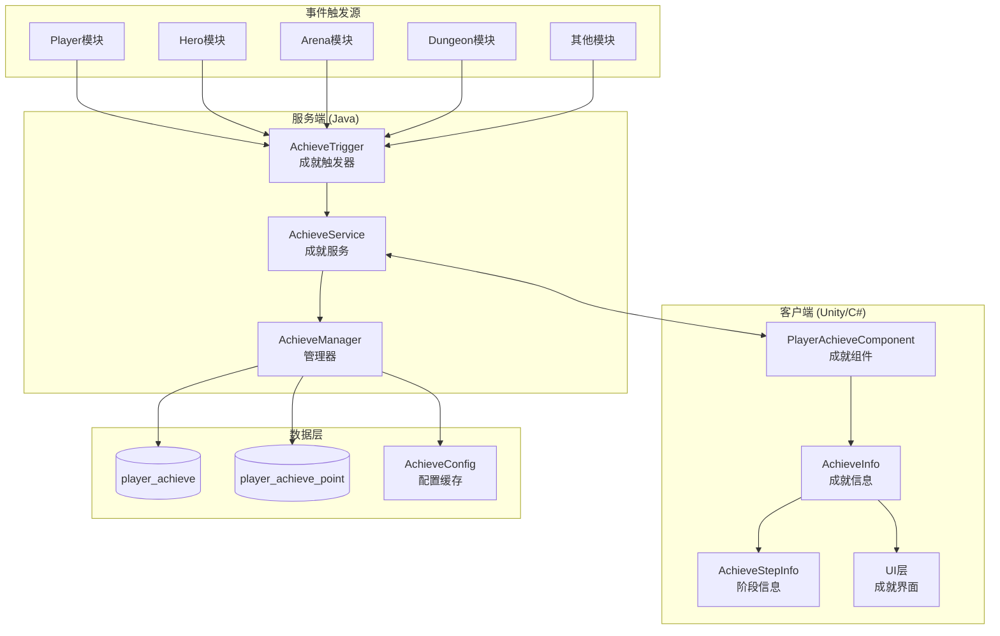
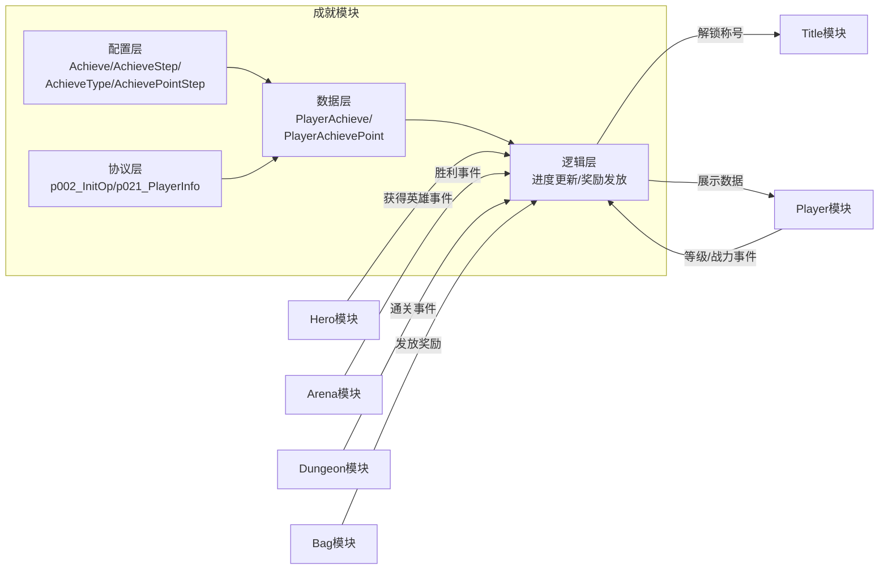
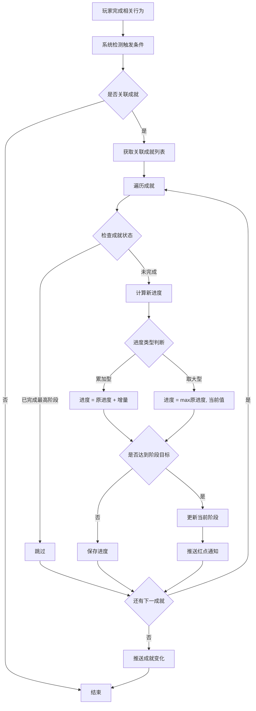
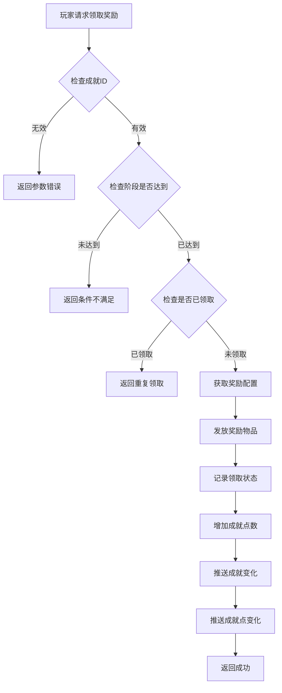
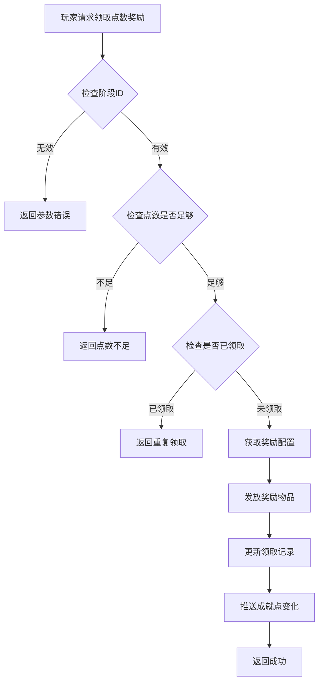
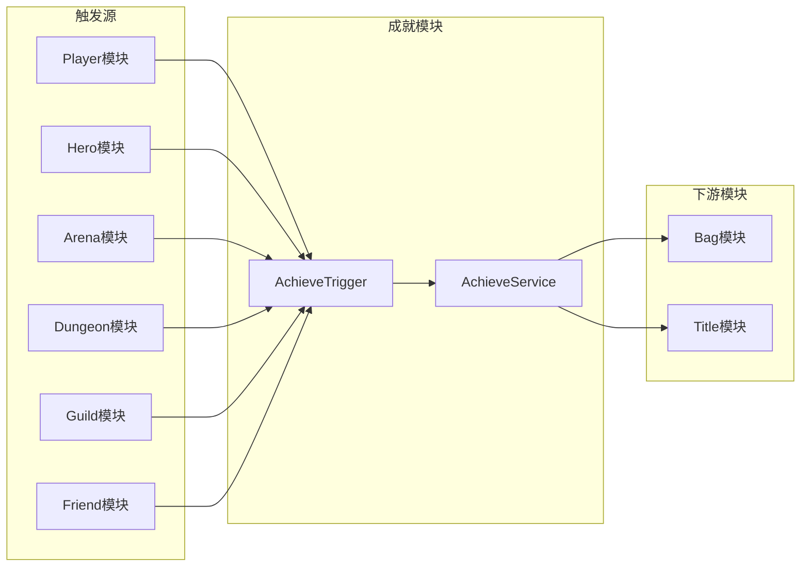
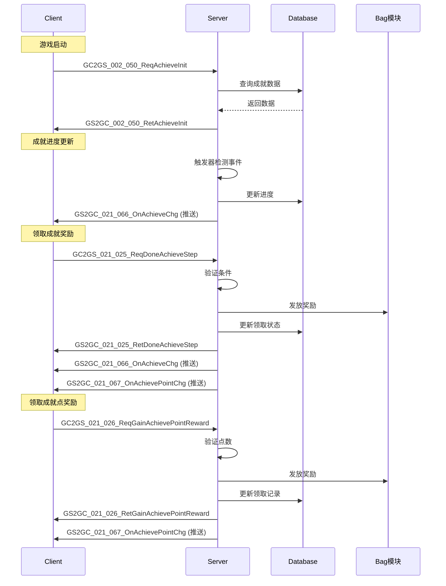

# 成就模块完整说明

## 一、模块概述

### 1.1 业务背景

成就系统是游戏中的里程碑玩法，为玩家提供长期目标和追求。通过完成特定目标获得成就和奖励，增强玩家的成就感和游戏粘性。成就系统覆盖游戏各个模块，记录玩家的游戏历程和里程碑。

### 1.2 目标用户

- **所有游戏玩家**：每个玩家都可以参与成就系统
- **收集型玩家**：追求完成所有成就的玩家
- **竞争型玩家**：通过成就点数展示实力的玩家

### 1.3 核心价值

1. **目标导向**：为玩家提供明确的长期目标
2. **成就感**：通过成就完成获得成就感和满足感
3. **社交展示**：成就和称号可展示给其他玩家
4. **奖励激励**：完成成就获得丰厚奖励

---

## 二、系统架构

### 2.1 整体架构图



### 2.2 模块关系图



---

## 三、功能清单

### 3.1 成就管理功能

| 功能名称 | 功能描述 | 用户价值 |
|---------|---------|---------|
| 成就列表 | 查看所有成就及其完成状态 | 了解成就进度 |
| 成就分类 | 按类型筛选成就 | 快速找到目标成就 |
| 成就进度 | 显示当前进度和目标值 | 明确完成条件 |
| 阶段奖励 | 每个成就多个阶段的奖励 | 分阶段激励 |

### 3.2 成就类型功能

| 类型 | 枚举值 | 功能描述 | 用户价值 |
|------|--------|----------|----------|
| VILLAGE | 1 | 城市建设成就 | 追踪建设进度 |
| FAMILY | 2 | 缘分相遇成就 | 社交互动激励 |
| PROGRESS | 3 | 前进道路成就 | 成长记录 |
| TREASURE | 4 | 宝物收藏成就 | 收集动力 |
| LIFESTYLE | 5 | 异世生活成就 | 日常激励 |
| EARNING_GOAL | 6 | 赚速目标成就 | 收益追求 |
| TREASURE_HUNT | 7 | 太空寻宝成就 | 玩法挑战 |
| MARS | 8 | 火星成就 | 特殊玩法 |

### 3.3 成就点功能

| 功能名称 | 功能描述 | 用户价值 |
|---------|---------|---------|
| 点数累计 | 完成成就获得成就点 | 量化成就价值 |
| 点数奖励 | 累计点数兑换奖励 | 额外奖励激励 |
| 阶段奖励 | 不同点数阶段的奖励 | 持续追求动力 |

---

## 四、业务流程详解

### 4.1 成就进度更新流程



**详细步骤说明**：

1. **触发检测**
   - 玩家完成相关游戏行为
   - 系统自动检测是否关联成就
   - 如关联则获取成就配置

2. **进度更新**
   - 获取当前进度值
   - 累加型：进度 = 原进度 + 增量
   - 取大型：进度 = max(原进度, 当前值)
   - 检查是否达到阶段目标

3. **阶段判定**
   - 查询成就阶段配置
   - 判断是否进入新阶段
   - 触发红点通知

### 4.2 领取成就奖励流程



**详细步骤说明**：

1. **条件校验**
   - 验证成就是否存在
   - 验证阶段是否已达到
   - 验证奖励是否已领取

2. **奖励发放**
   - 获取阶段奖励配置
   - 发放奖励到玩家背包
   - 记录领取状态

3. **点数更新**
   - 根据成就类型增加点数
   - 检查点数阶段奖励
   - 推送更新通知

### 4.3 成就点奖励领取流程



---

## 五、关键规则

### 5.1 成就规则

1. **成就分类**
   - 按类型分为8大类
   - 每种类型有独立的成就点累计
   - 类型可配置红点提示

2. **阶段规则**
   - 每个成就可有多个阶段
   - 每个阶段有独立目标和奖励
   - 阶段需依次完成

3. **进度规则**
   - 部分成就进度可累加（如副本通关次数）
   - 部分成就进度取最大值（如等级、战力）
   - 进度达到目标自动完成阶段

### 5.2 成就点规则

1. **点数获取**
   - 完成成就阶段获得点数
   - 不同类型成就点数独立累计
   - 点数永久累计

2. **点数奖励**
   - 累计点数达到阈值可领奖
   - 奖励需手动领取
   - 每个阶段奖励只能领取一次

### 5.3 奖励规则

1. **领取条件**
   - 必须达到对应阶段
   - 每个阶段奖励限领一次

2. **奖励内容**
   - 货币、道具、称号等
   - 根据成就难度配置

---

## 六、用户故事

### 6.1 新手玩家故事

> 作为一名新手玩家，我进入游戏后查看了成就系统。发现有很多成长类成就可以完成，比如"达到10级"、"获得5个英雄"等。我按照成就目标来规划我的游戏进度，每完成一个阶段就能领取奖励，感觉非常有成就感。

### 6.2 收集型玩家故事

> 作为一名收集型玩家，我特别关注收集类成就。看着"英雄收集"成就从"收集10个英雄"到"收集50个英雄"的阶段，我努力收集各种英雄。完成高阶段成就后获得稀有称号，让我非常有满足感。

### 6.3 竞技玩家故事

> 作为一名竞技玩家，我专注于战斗类成就。竞技场胜利次数、副本通关速度等成就都是我的目标。我的成就点数在全服排名靠前，展示了我的实力。

---

## 七、完整示例

### 7.1 成就进度示例

**成就配置**：

```json
{
    "achieve_id": 10001,
    "achieve_type": 4,
    "name": "英雄收集",
    "step_list": [
        { "step": 1, "process_count": 5,  "done_item_list": [{"itemId": 1001, "count": 1000}] },
        { "step": 2, "process_count": 15, "done_item_list": [{"itemId": 2001, "count": 100}] },
        { "step": 3, "process_count": 30, "done_item_list": [{"itemId": 3001, "count": 50}] },
        { "step": 4, "process_count": 50, "done_item_list": [{"itemId": 9999, "count": 1}] }
    ]
}
```

**玩家数据**：

```json
{
    "achieveId": 10001,
    "counter": 18,
    "hadDrawStepList": [1, 2]
}
```

**状态说明**：
- 当前拥有英雄: 18个
- 当前进度: 18/30 (阶段2已完成, 阶段3进行中)
- 已领取奖励: 阶段1、阶段2
- 可领取奖励: 无 (阶段3未达成)

### 7.2 领取奖励示例

**操作前状态**：

```json
{
    "achieveId": 20001,
    "name": "竞技场胜利",
    "counter": 105,
    "curStep": 3,
    "hadDrawStepList": [1, 2]
}
```

**操作**：领取阶段3奖励

**操作后状态**：

```json
{
    "achieveId": 20001,
    "counter": 105,
    "curStep": 3,
    "hadDrawStepList": [1, 2, 3]
}
```

**获得奖励**：钻石×200、竞技场门票×5

**成就点增加**：25点 (战斗类)

### 7.3 成就点奖励示例

**配置**：

```json
{
    "achievePointStep": [
        { "step_id": 1, "type": 4, "need_point": 100,  "reward_item_list": [{"itemId": 1001, "count": 5000}] },
        { "step_id": 2, "type": 4, "need_point": 500,  "reward_item_list": [{"itemId": 2001, "count": 300}] },
        { "step_id": 3, "type": 4, "need_point": 1000, "reward_item_list": [{"itemId": 3001, "count": 10}] }
    ]
}
```

**玩家数据**：

```json
{
    "type": 4,
    "count": 520,
    "hadDrawMaxStep": 1
}
```

**状态说明**：
- 累计成就点: 520点
- 已领取: 阶段1
- 可领取: 阶段2

---

## 八、模块依赖关系

### 8.1 依赖模块

| 模块名称 | 依赖方式 | 依赖说明 |
|----------|----------|----------|
| Player | 数据读取 | 获取玩家等级、战力等数据 |
| Hero | 数据读取 | 获取英雄收集数据 |
| Bag | 功能调用 | 发放奖励物品 |
| Arena | 事件触发 | 竞技场胜利触发成就 |
| Dungeon | 事件触发 | 副本通关触发成就 |
| Guild | 事件触发 | 公会相关触发成就 |
| Friend | 事件触发 | 好友相关触发成就 |

### 8.2 被依赖情况

| 模块名称 | 依赖方式 | 依赖说明 |
|----------|----------|----------|
| Title | 数据读取 | 成就解锁称号 |
| Player | 展示数据 | 成就点数展示 |

### 8.3 接口依赖图



---

## 九、协议交互完整流程



---

*文档更新时间: 2026-04-11*
