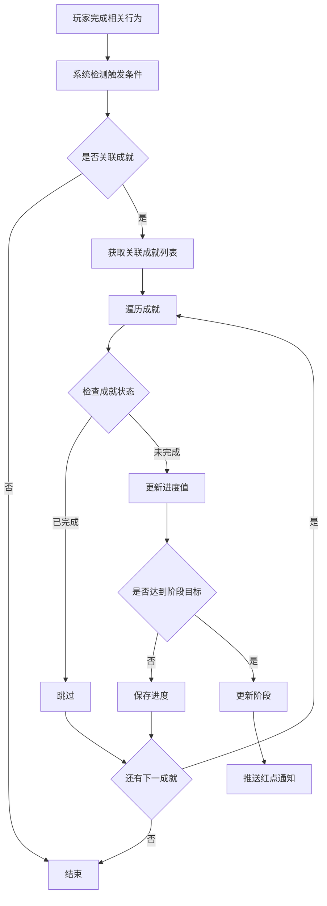
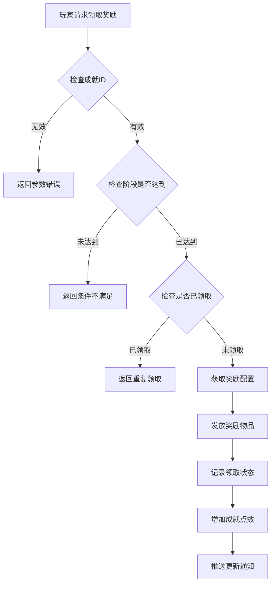
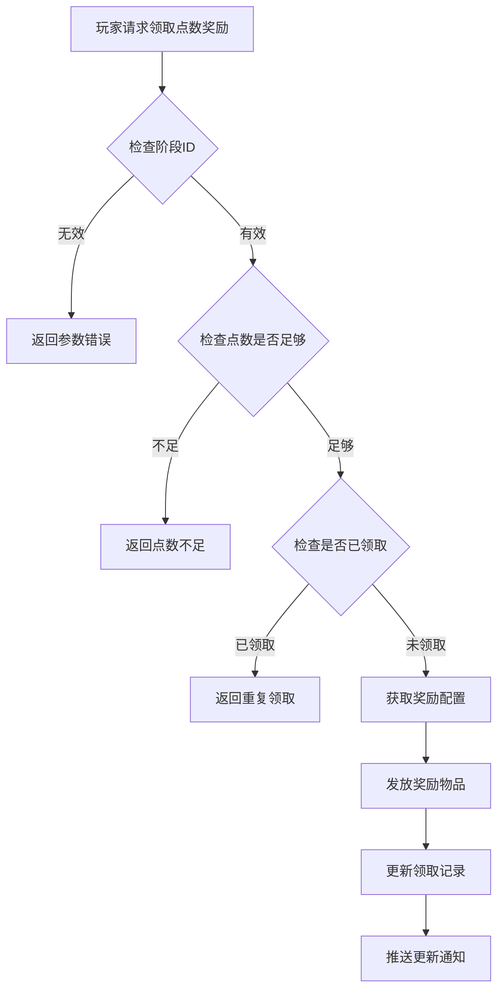

# 成就模块完整说明

## 一、模块概述

### 1.1 业务背景

成就系统是游戏中的里程碑玩法，为玩家提供长期目标和追求。通过完成特定目标获得成就和奖励，增强玩家的成就感和游戏粘性。成就系统覆盖游戏各个模块，记录玩家的游戏历程和里程碑。

### 1.2 目标用户

- **所有游戏玩家**：每个玩家都可以参与成就系统
- **收集型玩家**：追求完成所有成就的玩家
- **竞争型玩家**：通过成就点数展示实力的玩家

### 1.3 核心价值

1. **目标导向**：为玩家提供明确的长期目标
2. **成就感**：通过成就完成获得成就感和满足感
3. **社交展示**：成就和称号可展示给其他玩家
4. **奖励激励**：完成成就获得丰厚奖励

---

## 二、功能清单

### 2.1 成就管理功能

| 功能名称 | 功能描述 | 用户价值 |
|---------|---------|---------|
| 成就列表 | 查看所有成就及其完成状态 | 了解成就进度 |
| 成就分类 | 按类型筛选成就 | 快速找到目标成就 |
| 成就进度 | 显示当前进度和目标值 | 明确完成条件 |
| 阶段奖励 | 每个成就多个阶段的奖励 | 分阶段激励 |

### 2.2 成就类型功能

| 功能名称 | 功能描述 | 用户价值 |
|---------|---------|---------|
| 成长类成就 | 等级、战力等成长目标 | 追踪成长进度 |
| 战斗类成就 | 副本、竞技场等战斗目标 | 战斗记录 |
| 社交类成就 | 好友、公会等社交目标 | 社交互动激励 |
| 收集类成就 | 英雄、道具等收集目标 | 收集动力 |
| 特殊类成就 | 特殊条件和隐藏成就 | 惊喜和挑战 |

### 2.3 成就点功能

| 功能名称 | 功能描述 | 用户价值 |
|---------|---------|---------|
| 点数累计 | 完成成就获得成就点 | 量化成就价值 |
| 点数奖励 | 累计点数兑换奖励 | 额外奖励激励 |
| 阶段奖励 | 不同点数阶段的奖励 | 持续追求动力 |

---

## 三、业务流程详解

### 3.1 成就进度更新流程



**详细步骤说明**：

1. **触发检测**
   - 玩家完成相关游戏行为
   - 系统自动检测是否关联成就
   - 如关联则获取成就配置

2. **进度更新**
   - 获取当前进度值
   - 累加或设置新的进度
   - 检查是否达到阶段目标

3. **阶段判定**
   - 查询成就阶段配置
   - 判断是否进入新阶段
   - 触发红点通知

### 3.2 领取成就奖励流程



**详细步骤说明**：

1. **条件校验**
   - 验证成就是否存在
   - 验证阶段是否已达到
   - 验证奖励是否已领取

2. **奖励发放**
   - 获取阶段奖励配置
   - 发放奖励到玩家背包
   - 记录领取状态

3. **点数更新**
   - 根据成就类型增加点数
   - 检查点数阶段奖励
   - 推送更新通知

### 3.3 成就点奖励领取流程



---

## 四、关键规则

### 4.1 成就规则

1. **成就分类**
   - 成长类：等级、战力、英雄数量等
   - 战斗类：副本通关、竞技场胜利等
   - 社交类：好友数量、公会贡献等
   - 收集类：英雄收集、道具收集等
   - 特殊类：隐藏成就、限时成就等

2. **阶段规则**
   - 每个成就可有多个阶段
   - 每个阶段有独立目标和奖励
   - 阶段需依次完成

3. **进度规则**
   - 部分成就进度可累加
   - 部分成就进度取最大值
   - 进度达到目标自动完成

### 4.2 成就点规则

1. **点数获取**
   - 完成成就阶段获得点数
   - 不同类型成就点数不同
   - 点数永久累计

2. **点数奖励**
   - 累计点数达到阈值可领奖
   - 奖励需手动领取
   - 每个阶段奖励只能领取一次

### 4.3 奖励规则

1. **领取条件**
   - 必须达到对应阶段
   - 每个阶段奖励限领一次

2. **奖励内容**
   - 货币、道具、称号等
   - 根据成就难度配置

---

## 五、用户故事

### 5.1 新手玩家故事

> 作为一名新手玩家，我进入游戏后查看了成就系统。发现有很多成长类成就可以完成，比如"达到10级"、"获得5个英雄"等。我按照成就目标来规划我的游戏进度，每完成一个阶段就能领取奖励，感觉非常有成就感。

### 5.2 收集型玩家故事

> 作为一名收集型玩家，我特别关注收集类成就。看着"英雄收集"成就从"收集10个英雄"到"收集50个英雄"的阶段，我努力收集各种英雄。完成高阶段成就后获得稀有称号，让我非常有满足感。

### 5.3 竞技玩家故事

> 作为一名竞技玩家，我专注于战斗类成就。竞技场胜利次数、副本通关速度等成就都是我的目标。我的成就点数在全服排名靠前，展示了我的实力。

---

## 六、示例

### 6.1 成就进度示例

**成就配置**：
```
成就ID: 10001
成就名称: 英雄收集
类型: 收集类 (4)
阶段配置:
  - 阶段1: 目标5个, 奖励银两×1000, 成就点×10
  - 阶段2: 目标15个, 奖励钻石×100, 成就点×20
  - 阶段3: 目标30个, 奖励英雄碎片×50, 成就点×30
  - 阶段4: 目标50个, 奖励稀有称号, 成就点×50
```

**玩家数据**：
```
当前拥有英雄: 18个
当前进度: 18/30 (阶段2已完成, 阶段3进行中)
已领取奖励: 阶段1、阶段2
累计成就点: 30
```

### 6.2 领取奖励示例

**操作前状态**：
```
成就: 竞技场胜利 (ID: 20001)
当前进度: 105/100 (阶段3)
已领取: 阶段1、阶段2
```

**操作**：领取阶段3奖励

**操作后状态**：
```
已领取: 阶段1、阶段2、阶段3
获得奖励: 钻石×200、竞技场门票×5
成就点增加: 25点
```

### 6.3 成就点奖励示例

**配置**：
```
成就点阶段奖励:
  - 阶段1: 需要100点, 奖励银两×5000
  - 阶段2: 需要500点, 奖励钻石×300
  - 阶段3: 需要1000点, 奖励稀有英雄碎片×10
```

**玩家数据**：
```
累计成就点: 520点
已领取: 阶段1
可领取: 阶段2
```

---

*文档生成时间: 2026-04-07*
