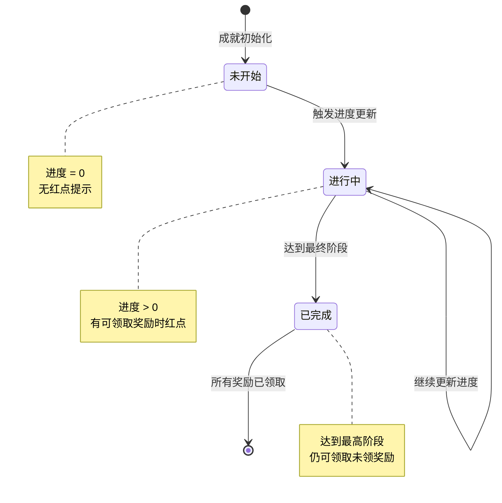
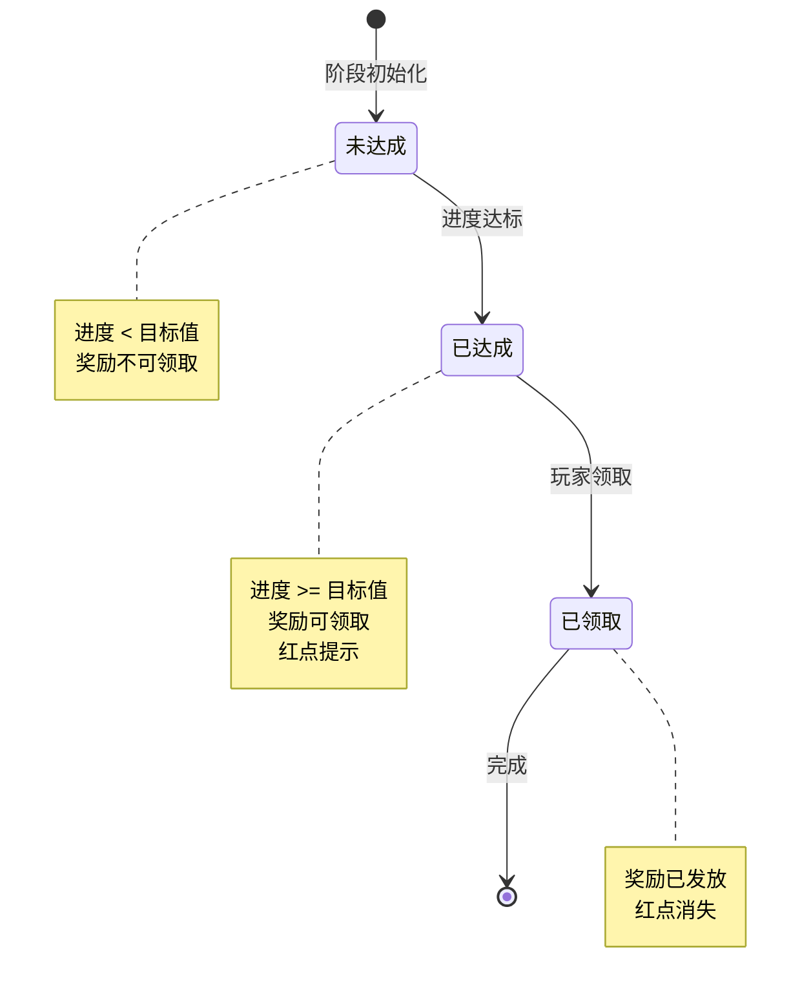
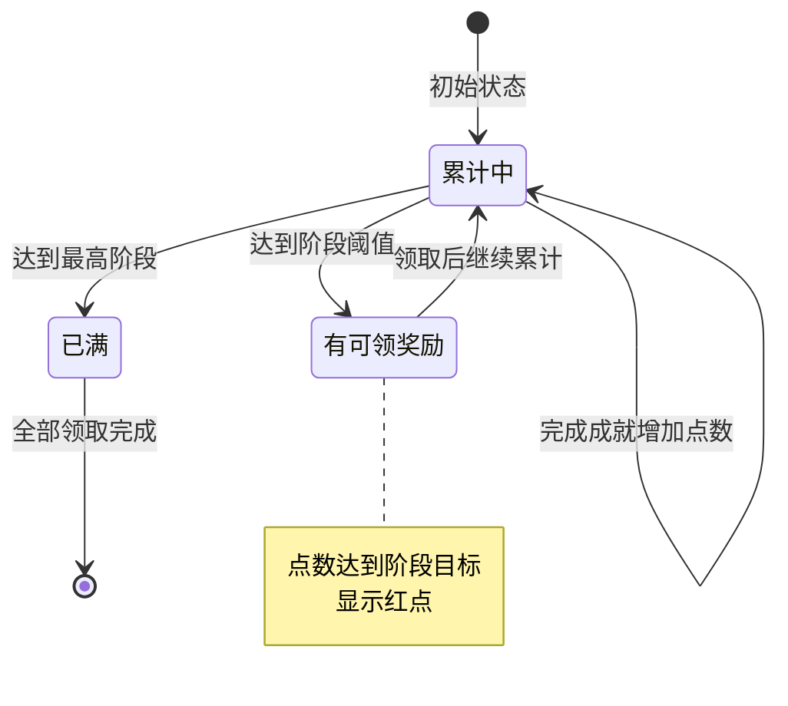
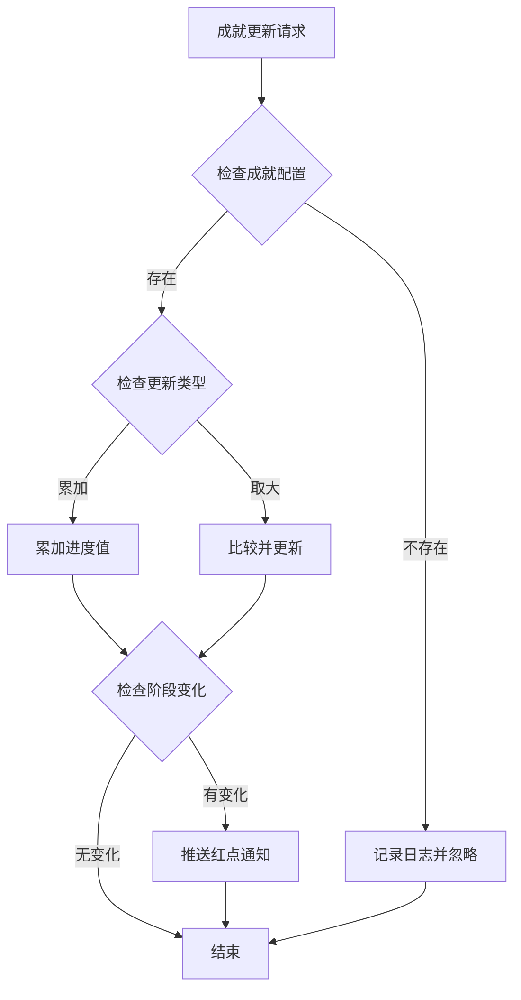
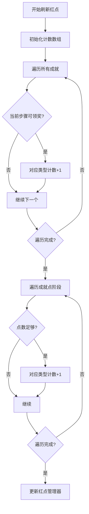

# 成就模块实现细节

## 一、计算公式

### 1.1 成就进度计算公式

```
累加型: 进度值 = 原进度 + 增量值
取大型: 进度值 = max(原进度, 当前值)
```

**参数说明**：

| 类型 | 说明 | 适用场景 |
|------|------|----------|
| 累加型 | 进度累加 | 副本通关次数、竞技场胜利次数 |
| 取大型 | 取最大值 | 等级、战力、英雄数量 |

**示例计算**：

```
累加型示例: 竞技场胜利
原进度: 50次
新增: 1次
新进度: 50 + 1 = 51次

取大型示例: 玩家等级
原进度: 30级
当前等级: 35级
新进度: max(30, 35) = 35级
```

### 1.2 成就阶段计算公式

```
当前阶段 = max(满足条件的阶段)
满足条件 = 进度值 >= 阶段目标值
```

**示例计算**：

```
成就配置阶段:
  - 阶段1: 目标10
  - 阶段2: 目标30
  - 阶段3: 目标60
  - 阶段4: 目标100

玩家进度: 75
满足阶段: 1, 2, 3
当前阶段: 3
```

### 1.3 成就点数计算公式

```
获得点数 = 阶段配置点数
累计点数 = 原累计点数 + 获得点数
```

**点数阶段判定**：

```
可领取阶段 = 累计点数 >= 阶段需要点数 且 未领取
```

---

## 二、状态机定义

### 2.1 成就状态机



### 2.2 成就阶段状态机



### 2.3 成就点状态机



---

## 三、数据约束

### 3.1 成就数据约束

| 字段名 | 数据类型 | 取值范围 | 必填 | 唯一性 | 说明 |
|--------|----------|----------|------|--------|------|
| player_id | bigint | > 0 | 是 | 否 | 玩家ID |
| achieve_id | long | > 0 | 是 | 是 | 成就ID |
| progress | long | >= 0 | 是 | 否 | 当前进度 |
| cur_step | int | >= 0 | 是 | 否 | 当前阶段 |
| step_reward_taken | json | - | 是 | 否 | 已领取阶段列表 |

### 3.2 成就点数据约束

| 字段名 | 数据类型 | 取值范围 | 必填 | 说明 |
|--------|----------|----------|------|------|
| player_id | bigint | > 0 | 是 | 玩家ID |
| type | int | 1-8 | 是 | 成就类型 |
| count | long | >= 0 | 是 | 点数累计 |
| had_draw_max_step | long | >= 0 | 是 | 已领取最大阶段 |

### 3.3 成就配置约束

| 字段名 | 数据类型 | 取值范围 | 必填 | 说明 |
|--------|----------|----------|------|------|
| achieve_id | int | > 0 | 是 | 成就ID |
| achieve_type | int | 1-8 | 是 | 成就类型 |
| step_list | array | 非空 | 是 | 阶段列表 |

### 3.4 成就阶段配置约束

| 字段名 | 数据类型 | 取值范围 | 必填 | 说明 |
|--------|----------|----------|------|------|
| id | long | > 0 | 是 | 唯一ID |
| achieve_id | long | > 0 | 是 | 所属成就ID |
| step | int | >= 1 | 是 | 阶段序号 |
| process_count | long | > 0 | 是 | 目标进度值 |
| done_item_list | array | - | 是 | 奖励列表 |

---

## 四、错误处理策略

### 4.1 成就模块错误码

| 错误码 | 错误信息 | 处理策略 | 用户提示 |
|--------|----------|----------|----------|
| 50001 | 成就不存在 | 检查成就ID有效性 | "成就数据异常" |
| 50002 | 阶段未达到 | 检查进度是否达标 | "尚未达到领取条件" |
| 50003 | 奖励已领取 | 检查领取记录 | "奖励已领取" |
| 50004 | 成就点不足 | 检查点数余额 | "成就点数不足" |
| 50005 | 点数奖励已领取 | 检查领取记录 | "该奖励已领取" |
| 50006 | 成就类型无效 | 检查类型参数 | "参数错误" |

### 4.2 成就更新错误处理流程



### 4.3 奖励领取错误处理

| 错误场景 | 处理策略 | 后续操作 |
|----------|----------|----------|
| 成就不存在 | 返回错误码 | 刷新成就列表 |
| 阶段未达成 | 返回错误码 | 显示进度 |
| 奖励已领取 | 返回错误码 | 刷新状态 |
| 背包已满 | 发送邮件 | 提示查看邮件 |

---

## 五、关键代码示例

### 5.1 成就进度更新（C#）

```csharp
/// <summary>
/// 更新成就进度
/// </summary>
/// <param name="playerId">玩家ID</param>
/// <param name="achieveType">成就类型</param>
/// <param name="addValue">增量值</param>
/// <param name="isAccumulate">是否累加型</param>
public void UpdateAchieveProgress(long playerId, int achieveType, long addValue, bool isAccumulate = true)
{
    // 获取该类型相关的所有成就
    List<AchieveConfig> relatedAchieves = achieveConfigDao.getByType(achieveType);

    foreach (var config in relatedAchieves)
    {
        PlayerAchieve achieve = achieveDao.selectByPlayerAndId(playerId, config.achieve_id);
        if (achieve == null)
        {
            achieve = new PlayerAchieve {
                player_id = playerId,
                achieve_id = config.achieve_id,
                progress = 0,
                cur_step = 0,
                step_reward_taken = new List<int>()
            };
        }

        // 检查是否已完成最高阶段
        if (achieve.cur_step >= config.step_list.Count)
        {
            continue; // 已完成，跳过
        }

        // 更新进度
        if (isAccumulate)
        {
            achieve.progress += addValue;
        }
        else
        {
            achieve.progress = Math.Max(achieve.progress, addValue);
        }

        // 检查阶段变化
        int newStep = calculateCurrentStep(config, achieve.progress);
        if (newStep > achieve.cur_step)
        {
            achieve.cur_step = newStep;
            // 推送红点
            pushRedDot(playerId, config.achieve_id);
        }

        achieveDao.saveOrUpdate(achieve);
        pushAchieveChg(playerId, achieve);
    }
}

/// <summary>
/// 计算当前阶段
/// </summary>
private int calculateCurrentStep(AchieveConfig config, long progress)
{
    int step = 0;
    foreach (var stepConfig in config.step_list)
    {
        if (progress >= stepConfig.target_value)
        {
            step = stepConfig.step;
        }
        else
        {
            break;
        }
    }
    return step;
}
```

### 5.2 领取成就奖励（C#）

```csharp
/// <summary>
/// 领取成就阶段奖励
/// </summary>
public Result TakeAchieveStepReward(long playerId, long achieveId, int step)
{
    // 获取玩家成就数据
    PlayerAchieve achieve = achieveDao.selectByPlayerAndId(playerId, achieveId);
    if (achieve == null)
    {
        return Result.Error(50001, "成就不存在");
    }

    // 检查阶段是否达到
    if (achieve.cur_step < step)
    {
        return Result.Error(50002, "阶段未达到");
    }

    // 检查是否已领取
    if (achieve.step_reward_taken.Contains(step))
    {
        return Result.Error(50003, "奖励已领取");
    }

    // 获取阶段配置
    AchieveStepConfig stepConfig = achieveStepConfigDao.getByAchieveAndStep(achieveId, step);

    // 发放奖励
    bagService.addItems(playerId, stepConfig.reward_list);

    // 记录领取
    achieve.step_reward_taken.Add(step);
    achieveDao.updateById(achieve);

    // 增加成就点数
    AchieveConfig achieveConfig = achieveConfigDao.getById(achieveId);
    addAchievePoint(playerId, achieveConfig.achieve_type, stepConfig.point);

    return Result.Success();
}
```

### 5.3 成就点数管理（C#）

```csharp
/// <summary>
/// 增加成就点数
/// </summary>
private void addAchievePoint(long playerId, int achieveType, int point)
{
    PlayerAchievePoint achievePoint = achievePointDao.selectByPlayerAndType(playerId, achieveType);
    if (achievePoint == null)
    {
        achievePoint = new PlayerAchievePoint {
            player_id = playerId,
            type = achieveType,
            count = 0,
            had_draw_max_step = 0
        };
    }

    // 累加点数
    achievePoint.count += point;
    achievePointDao.saveOrUpdate(achievePoint);

    // 推送更新
    pushAchievePointChg(playerId, achievePoint);
}

/// <summary>
/// 领取成就点奖励
/// </summary>
public Result TakeAchievePointReward(long playerId, int achieveType, int step)
{
    PlayerAchievePoint achievePoint = achievePointDao.selectByPlayerAndType(playerId, achieveType);
    if (achievePoint == null)
    {
        return Result.Error(50004, "成就点不足");
    }

    // 获取阶段配置
    AchievePointStepConfig stepConfig = achievePointStepConfigDao.getByTypeAndStep(achieveType, step);

    // 检查点数是否足够
    if (achievePoint.count < stepConfig.need_point)
    {
        return Result.Error(50004, "成就点不足");
    }

    // 检查是否已领取
    if (achievePoint.had_draw_max_step >= step)
    {
        return Result.Error(50005, "奖励已领取");
    }

    // 发放奖励
    bagService.addItems(playerId, stepConfig.reward_list);

    // 更新领取记录
    achievePoint.had_draw_max_step = step;
    achievePointDao.updateById(achievePoint);

    return Result.Success();
}
```

### 5.4 成就触发器（C#）

```csharp
/// <summary>
/// 成就事件类型
/// </summary>
public enum AchieveEventType
{
    LEVEL_UP = 1,           // 升级
    HERO_GET = 2,           // 获得英雄
    HERO_STAR_UP = 3,       // 英雄升星
    ARENA_WIN = 4,          // 竞技场胜利
    DUNGEON_PASS = 5,       // 副本通关
    FRIEND_ADD = 6,         // 添加好友
    GUILD_JOIN = 7,         // 加入公会
    ITEM_COLLECT = 8        // 道具收集
}

/// <summary>
/// 成就触发器
/// </summary>
public class AchieveTrigger
{
    private AchieveService _achieveService;

    /// <summary>
    /// 玩家升级
    /// </summary>
    public void OnPlayerLevelUp(long playerId, int newLevel)
    {
        _achieveService.UpdateAchieveProgress(
            playerId,
            (int)AchieveEventType.LEVEL_UP,
            newLevel,
            false  // 取大型
        );
    }

    /// <summary>
    /// 获得英雄
    /// </summary>
    public void OnHeroGet(long playerId, int totalHeroCount)
    {
        _achieveService.UpdateAchieveProgress(
            playerId,
            (int)AchieveEventType.HERO_GET,
            totalHeroCount,
            false
        );
    }

    /// <summary>
    /// 竞技场胜利
    /// </summary>
    public void OnArenaWin(long playerId)
    {
        _achieveService.UpdateAchieveProgress(
            playerId,
            (int)AchieveEventType.ARENA_WIN,
            1,
            true  // 累加型
        );
    }

    /// <summary>
    /// 副本通关
    /// </summary>
    public void OnDungeonPass(long playerId)
    {
        _achieveService.UpdateAchieveProgress(
            playerId,
            (int)AchieveEventType.DUNGEON_PASS,
            1,
            true
        );
    }
}
```

---

## 六、客户端状态判断

### 6.1 领取状态枚举

```csharp
public enum ENPCommonGetStat
{
    NONE = 0,        // 无状态
    CAN_NOT_GET = 1, // 不可领取
    CAN_GET = 2,     // 可领取
    HAS_GET = 3      // 已领取
}
```

### 6.2 状态判断逻辑

```csharp
/// <summary>
/// 获取奖励领取状态
/// </summary>
public ENPCommonGetStat getRewardState()
{
    // 已领取
    if (hasGetReward())
        return ENPCommonGetStat.HAS_GET;

    // 可领取
    if (isFull())
        return ENPCommonGetStat.CAN_GET;

    // 不可领取
    return ENPCommonGetStat.CAN_NOT_GET;
}

/// <summary>
/// 是否已达到目标
/// </summary>
public bool isFull()
{
    return _m_achieveInfo.curStepCount >= _m_stepRefObj.process_count;
}

/// <summary>
/// 是否已领取
/// </summary>
public bool hasGetReward()
{
    return _m_achieveInfo.hasDrawStepList.Contains(_m_stepRefObj.step);
}
```

---

## 七、配置数据访问

### 7.1 配置访问示例

```csharp
// 获取成就配置
AchieveRefObj achieveRef = GRefdataCoreMgr.instance.achieveMap.getRef(achieveId);

// 获取成就类型配置
AchieveTypeRefObj typeRef = GRefdataCoreMgr.instance.achieveTypeMap.getRef((long)EAchieveType.TREASURE);

// 获取成就点阶段配置列表
List<AchievePointStepRefObj> pointStepList = GRefdataCoreMgr.instance.achievePointStepList.refList;

// 遍历所有成就配置
GRefdataCoreMgr.instance.achieveMap.dealAllRef((AchieveRefObj _tempRef) =>
{
    // 处理每个成就配置
});
```

### 7.2 配置资源路径

```csharp
// 成就配置资源路径
public static string assetPath { get { return "refdata/achieve_refdata.unity3d"; } }

// 各配置对象名称
public static string achieveObjName { get { return "achieve"; } }
public static string achieveStepObjName { get { return "achieve_step"; } }
public static string achieveTypeObjName { get { return "achieve_type"; } }
public static string achievePointStepObjName { get { return "achieve_point_step"; } }
```

---

## 八、红点逻辑实现

### 8.1 红点刷新流程



### 8.2 红点代码实现

```csharp
/// <summary>
/// 刷新红点
/// </summary>
private void _refreshRedTip()
{
    // 初始化各类型红点计数
    long[] redCountList = new long[ALCommon.getEnumCount(typeof(EAchieveType))];

    // 统计成就可领取数量
    for (int i = 0; i < _m_allAchieveList.Count; i++)
    {
        if (_m_allAchieveList[i] == null)
            continue;

        // 当前步骤可领取奖励
        if (_m_allAchieveList[i].getCurStepRewardState() == ENPCommonGetStat.CAN_GET)
            redCountList[(int)_m_allAchieveList[i].achieveType]++;
    }

    // 统计成就点可领取数量
    GRefdataCoreMgr.instance.achieveTypeMap.dealAllRef((_refObj) =>
    {
        AchievePointStepRefObj achievePointStepRef = getCurAchievePointRef(_refObj.type);
        if (achievePointStepRef != null && GCommon.isItemEnough(achievePointStepRef.need_point, false))
            redCountList[(int)_refObj.type]++;

        // 更新红点
        if (_refObj.red_tip_id > 0)
            RedTipMgr.instance.setCountByRefRedTipId(_refObj.red_tip_id, redCountList[(int)_refObj.type]);
    });
}
```

---

## 九、消息监听机制

### 9.1 消息注册

```csharp
/// <summary>
/// 监听客户端目标数变动
/// </summary>
private void _addRegister()
{
    if (null == _m_achieveRefObj || null == _m_achieveRefObj.add_msg_type_list)
        return;

    WinMsgType temp = 0;
    for (int i = 0; i < _m_achieveRefObj.add_msg_type_list.Count; i++)
    {
        bool isParse = ALCommon.TryEnumParse(typeof(WinMsgType),
            _m_achieveRefObj.add_msg_type_list[i], out temp);
        if (!isParse || temp == WinMsgType.NONE)
            continue;

        WinMsg.RegisterMsgAct(temp, _setAchieveIsFull);
    }
}

/// <summary>
/// 移除监听
/// </summary>
private void _removeRegister()
{
    if (_m_achieveRefObj != null && null != _m_achieveRefObj.add_msg_type_list)
    {
        WinMsgType temp = 0;
        for (int i = 0; i < _m_achieveRefObj.add_msg_type_list.Count; i++)
        {
            bool isParse = ALCommon.TryEnumParse(typeof(WinMsgType),
                _m_achieveRefObj.add_msg_type_list[i], out temp);
            if (!isParse || temp == WinMsgType.NONE)
                continue;

            WinMsg.UnregisterMsgAct(temp, _setAchieveIsFull);
        }
    }
}
```

### 9.2 成就达成提示

```csharp
/// <summary>
/// 设置成就是否完成（触发达成提示）
/// </summary>
private void _setAchieveIsFull(bool isPopTip)
{
    if (null == _m_achieveRefObj || _m_curStepInfo == null)
        return;

    bool isFullLast = _m_isLastFull;
    _m_isLastFull = _m_curStepInfo.isFull();

    // 设置红点
    AchieveTypeRefObj achieveTypeRefObj =
        GRefdataCoreMgr.instance.achieveTypeMap.getRef((long)_m_achieveRefObj.achieve_type);
    if (!isFullLast && _m_isLastFull && null != achieveTypeRefObj && achieveTypeRefObj.red_tip_id > 0)
        RedTipMgr.instance.addCountByRefRedTipId(achieveTypeRefObj.red_tip_id, 1);

    // 不发出消息或系统未解锁就跳过
    if (!isPopTip || !GCommon.isFuncUnlock(ENPFunctionType.ACHIEVE))
        return;

    // 成就达成后弹出提示
    if (!isFullLast && _m_isLastFull && _m_bIsInitLastFullTag)
    {
        AchieveTypeRefObj typeRefObj =
            GRefdataCoreMgr.instance.achieveTypeMap.getRef((long)_m_achieveRefObj.achieve_type);
        if (null == typeRefObj || typeRefObj.center_tip_id <= 0)
            return;

        string txtString = TextTranslate.instance.getLanguage(
            TransKeyConst.common_strDotStr,
            _m_curStepInfo.step,
            _m_curStepInfo.stepRefObj.getName);
        NPGUIAddSceneCenterTip.instance.showIconTextTip(
            _m_achieveRefObj.icon,
            txtString,
            typeRefObj.center_tip_id);
    }
}
```

---

## 十、性能优化建议

### 10.1 数据缓存

- 使用字典索引成就数据，避免遍历查找
- 配置数据启动时一次性加载
- 玩家成就数据按需加载，使用后缓存

### 10.2 批量操作

- 成就进度更新支持批量处理
- 减少数据库写入次数
- 推送消息合并发送

### 10.3 红点计算

- 只在数据变化时刷新红点
- 避免每帧计算红点状态
- 使用增量更新而非全量刷新

---

*文档更新时间: 2026-04-11*
