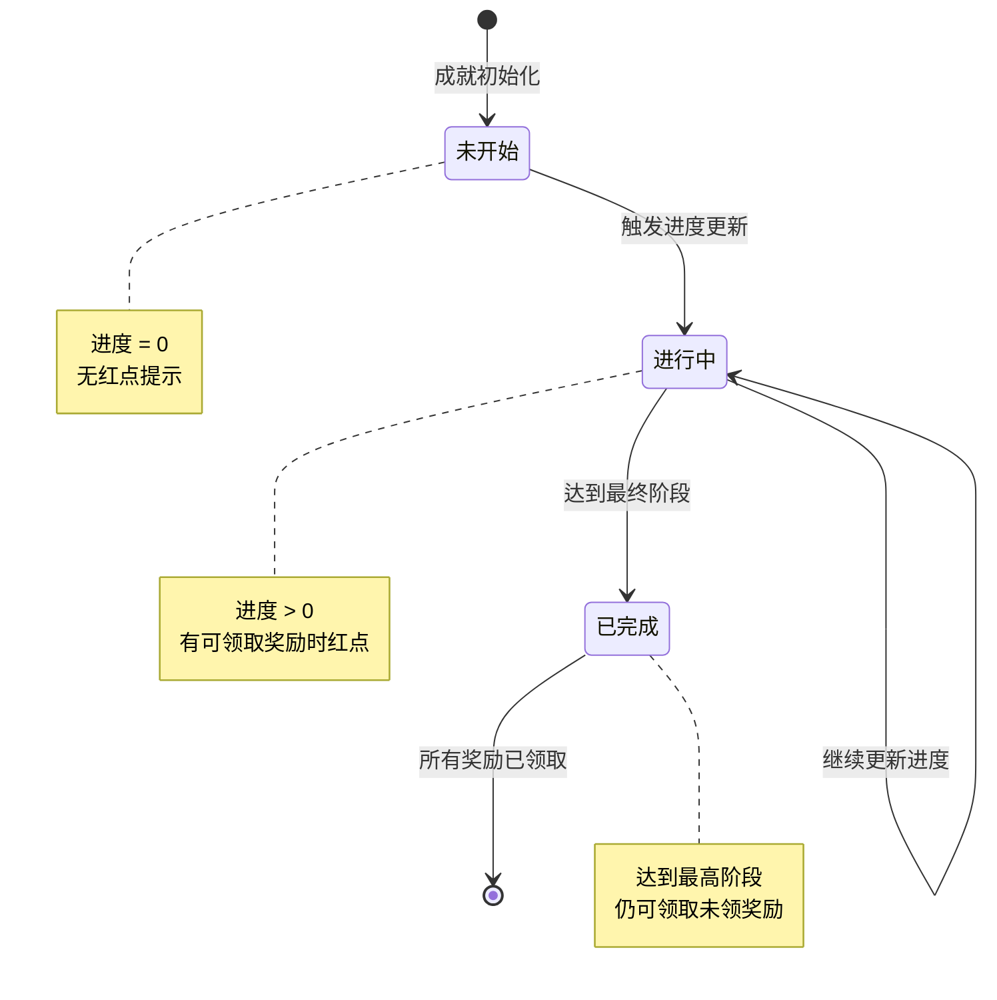
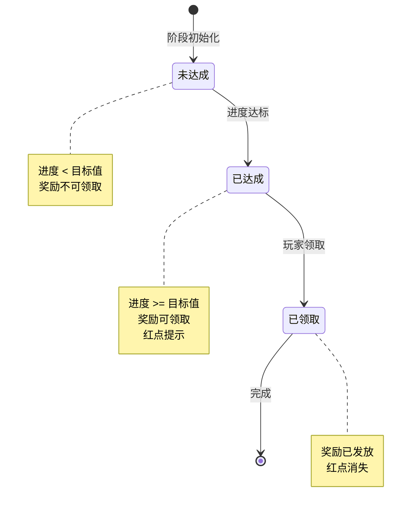
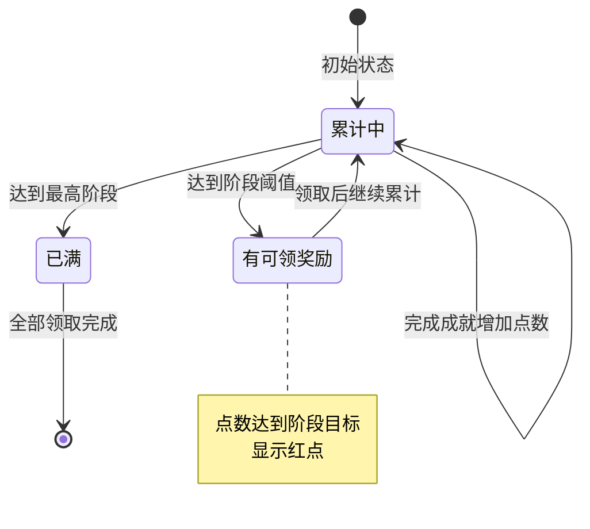
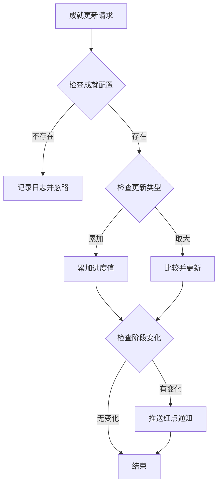
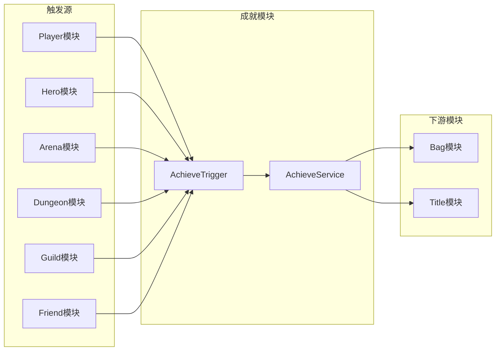

# 成就模块实现细节

## 一、计算公式

### 1.1 成就进度计算公式

```
进度值 = 原进度 + 增量值 (累加型)
进度值 = max(原进度, 当前值) (取大型)
```

**参数说明**：
- `累加型`：适用于可重复计算的行为，如副本通关次数
- `取大型`：适用于状态类目标，如等级、战力等

**示例计算**：
```
累加型: 竞技场胜利
原进度: 50次
新增: 1次
新进度: 50 + 1 = 51次

取大型: 玩家等级
原进度: 30级
当前等级: 35级
新进度: max(30, 35) = 35级
```

### 1.2 成就阶段计算公式

```
当前阶段 = max(满足条件的阶段)
满足条件 = 进度值 >= 阶段目标值
```

**示例计算**：
```
成就配置阶段:
  - 阶段1: 目标10
  - 阶段2: 目标30
  - 阶段3: 目标60
  - 阶段4: 目标100

玩家进度: 75
满足阶段: 1, 2, 3
当前阶段: 3
```

### 1.3 成就点数计算公式

```
获得点数 = 阶段配置点数
累计点数 = 原累计点数 + 获得点数
```

**点数阶段判定**：
```
可领取阶段 = 累计点数 >= 阶段需要点数 且 未领取
```

---

## 二、状态机定义

### 2.1 成就状态机



### 2.2 成就阶段状态机



### 2.3 成就点状态机



---

## 三、数据约束

### 3.1 成就数据约束

| 字段名 | 数据类型 | 取值范围 | 必填 | 唯一性 | 说明 |
|--------|----------|----------|------|--------|------|
| player_id | bigint | > 0 | 是 | 否 | 玩家ID |
| achieve_id | long | > 0 | 是 | 是 | 成就ID |
| progress | long | >= 0 | 是 | 否 | 当前进度 |
| cur_step | int | >= 0 | 是 | 否 | 当前阶段 |
| step_reward_taken | json | - | 是 | 否 | 已领取阶段列表 |

### 3.2 成就点数据约束

| 字段名 | 数据类型 | 取值范围 | 必填 | 说明 |
|--------|----------|----------|------|------|
| player_id | bigint | > 0 | 是 | 玩家ID |
| type | int | 1-5 | 是 | 成就类型 |
| count | long | >= 0 | 是 | 点数累计 |
| had_draw_max_step | long | >= 0 | 是 | 已领取最大阶段 |

### 3.3 成就配置约束

| 字段名 | 数据类型 | 取值范围 | 必填 | 说明 |
|--------|----------|----------|------|------|
| achieve_id | int | > 0 | 是 | 成就ID |
| achieve_type | int | 1-5 | 是 | 成就类型 |
| target_value | long | > 0 | 是 | 最终目标值 |
| step_list | array | 非空 | 是 | 阶段列表 |

---

## 四、错误处理策略

### 4.1 成就模块错误码

| 错误码 | 错误信息 | 处理策略 | 用户提示 |
|--------|----------|----------|----------|
| 50001 | 成就不存在 | 检查成就ID有效性 | "成就数据异常" |
| 50002 | 阶段未达到 | 检查进度是否达标 | "尚未达到领取条件" |
| 50003 | 奖励已领取 | 检查领取记录 | "奖励已领取" |
| 50004 | 成就点不足 | 检查点数余额 | "成就点数不足" |
| 50005 | 点数奖励已领取 | 检查领取记录 | "该奖励已领取" |
| 50006 | 成就类型无效 | 检查类型参数 | "参数错误" |

### 4.2 成就更新错误处理流程



### 4.3 奖励领取错误处理

| 错误场景 | 处理策略 | 后续操作 |
|----------|----------|----------|
| 成就不存在 | 返回错误码 | 刷新成就列表 |
| 阶段未达成 | 返回错误码 | 显示进度 |
| 奖励已领取 | 返回错误码 | 刷新状态 |
| 背包已满 | 发送邮件 | 提示查看邮件 |

---

## 五、关键代码示例

### 5.1 成就进度更新伪代码

```csharp
public void UpdateAchieveProgress(long playerId, int achieveType, long addValue, bool isAccumulate = true)
{
    // 获取该类型相关的所有成就
    List<AchieveConfig> relatedAchieves = achieveConfigDao.getByType(achieveType);

    foreach (var config in relatedAchieves)
    {
        PlayerAchieve achieve = achieveDao.selectByPlayerAndId(playerId, config.achieve_id);
        if (achieve == null)
        {
            achieve = new PlayerAchieve {
                player_id = playerId,
                achieve_id = config.achieve_id,
                progress = 0,
                cur_step = 0,
                step_reward_taken = new List<int>()
            };
        }

        // 检查是否已完成最高阶段
        if (achieve.cur_step >= config.step_list.Count)
        {
            continue; // 已完成，跳过
        }

        // 更新进度
        if (isAccumulate)
        {
            achieve.progress += addValue;
        }
        else
        {
            achieve.progress = Math.Max(achieve.progress, addValue);
        }

        // 检查阶段变化
        int newStep = calculateCurrentStep(config, achieve.progress);
        if (newStep > achieve.cur_step)
        {
            achieve.cur_step = newStep;
            // 推送红点
            pushRedDot(playerId, config.achieve_id);
        }

        achieveDao.saveOrUpdate(achieve);
        pushAchieveChg(playerId, achieve);
    }
}

private int calculateCurrentStep(AchieveConfig config, long progress)
{
    int step = 0;
    foreach (var stepConfig in config.step_list)
    {
        if (progress >= stepConfig.target_value)
        {
            step = stepConfig.step;
        }
        else
        {
            break;
        }
    }
    return step;
}
```

### 5.2 领取成就奖励伪代码

```csharp
public Result TakeAchieveStepReward(long playerId, long achieveId, int step)
{
    // 获取玩家成就数据
    PlayerAchieve achieve = achieveDao.selectByPlayerAndId(playerId, achieveId);
    if (achieve == null)
    {
        return Result.Error(50001, "成就不存在");
    }

    // 检查阶段是否达到
    if (achieve.cur_step < step)
    {
        return Result.Error(50002, "阶段未达到");
    }

    // 检查是否已领取
    if (achieve.step_reward_taken.Contains(step))
    {
        return Result.Error(50003, "奖励已领取");
    }

    // 获取阶段配置
    AchieveStepConfig stepConfig = achieveStepConfigDao.getByAchieveAndStep(achieveId, step);

    // 发放奖励
    bagService.addItems(playerId, stepConfig.reward_list);

    // 记录领取
    achieve.step_reward_taken.Add(step);
    achieveDao.updateById(achieve);

    // 增加成就点数
    AchieveConfig achieveConfig = achieveConfigDao.getById(achieveId);
    addAchievePoint(playerId, achieveConfig.achieve_type, stepConfig.point);

    return Result.Success();
}
```

### 5.3 成就点数更新伪代码

```csharp
private void addAchievePoint(long playerId, int achieveType, int point)
{
    PlayerAchievePoint achievePoint = achievePointDao.selectByPlayerAndType(playerId, achieveType);
    if (achievePoint == null)
    {
        achievePoint = new PlayerAchievePoint {
            player_id = playerId,
            type = achieveType,
            count = 0,
            had_draw_max_step = 0
        };
    }

    // 累加点数
    achievePoint.count += point;
    achievePointDao.saveOrUpdate(achievePoint);

    // 推送更新
    pushAchievePointChg(playerId, achievePoint);
}

public Result TakeAchievePointReward(long playerId, int achieveType, int step)
{
    PlayerAchievePoint achievePoint = achievePointDao.selectByPlayerAndType(playerId, achieveType);
    if (achievePoint == null)
    {
        return Result.Error(50004, "成就点不足");
    }

    // 获取阶段配置
    AchievePointStepConfig stepConfig = achievePointStepConfigDao.getByTypeAndStep(achieveType, step);

    // 检查点数是否足够
    if (achievePoint.count < stepConfig.need_point)
    {
        return Result.Error(50004, "成就点不足");
    }

    // 检查是否已领取
    if (achievePoint.had_draw_max_step >= step)
    {
        return Result.Error(50005, "奖励已领取");
    }

    // 发放奖励
    bagService.addItems(playerId, stepConfig.reward_list);

    // 更新领取记录
    achievePoint.had_draw_max_step = step;
    achievePointDao.updateById(achievePoint);

    return Result.Success();
}
```

### 5.4 成就触发器伪代码

```csharp
// 成就事件类型
public enum AchieveEventType
{
    LEVEL_UP = 1,           // 升级
    HERO_GET = 2,           // 获得英雄
    HERO_STAR_UP = 3,       // 英雄升星
    ARENA_WIN = 4,          // 竞技场胜利
    DUNGEON_PASS = 5,       // 副本通关
    FRIEND_ADD = 6,         // 添加好友
    GUILD_JOIN = 7,         // 加入公会
    ITEM_COLLECT = 8        // 道具收集
}

// 成就触发器
public class AchieveTrigger
{
    public void OnPlayerLevelUp(long playerId, int newLevel)
    {
        achieveService.UpdateAchieveProgress(
            playerId,
            (int)AchieveEventType.LEVEL_UP,
            newLevel,
            false  // 取大型
        );
    }

    public void OnHeroGet(long playerId, int totalHeroCount)
    {
        achieveService.UpdateAchieveProgress(
            playerId,
            (int)AchieveEventType.HERO_GET,
            totalHeroCount,
            false
        );
    }

    public void OnArenaWin(long playerId)
    {
        achieveService.UpdateAchieveProgress(
            playerId,
            (int)AchieveEventType.ARENA_WIN,
            1,
            true  // 累加型
        );
    }
}
```

---

## 六、跨模块依赖

### 6.1 依赖模块

| 模块名称 | 依赖方式 | 依赖说明 |
|----------|----------|----------|
| Player | 数据读取 | 获取玩家等级、战力等数据 |
| Hero | 数据读取 | 获取英雄收集数据 |
| Bag | 功能调用 | 发放奖励物品 |
| Arena | 事件触发 | 竞技场胜利触发成就 |
| Dungeon | 事件触发 | 副本通关触发成就 |
| Guild | 事件触发 | 公会相关触发成就 |
| Friend | 事件触发 | 好友相关触发成就 |

### 6.2 被依赖情况

| 模块名称 | 依赖方式 | 依赖说明 |
|----------|----------|----------|
| Title | 数据读取 | 成就解锁称号 |
| Player | 展示数据 | 成就点数展示 |

### 6.3 接口依赖图



---

*文档生成时间: 2026-04-07*
