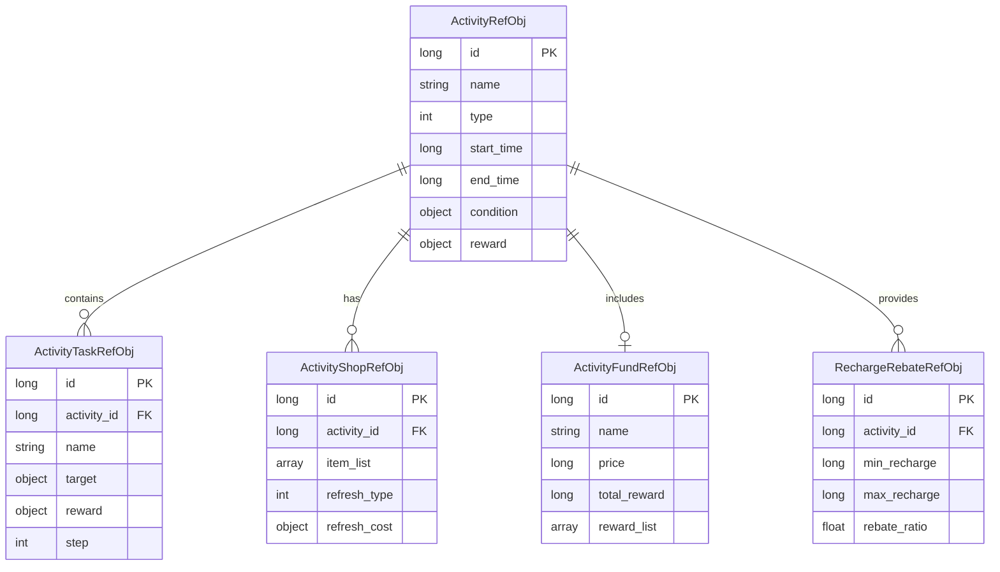
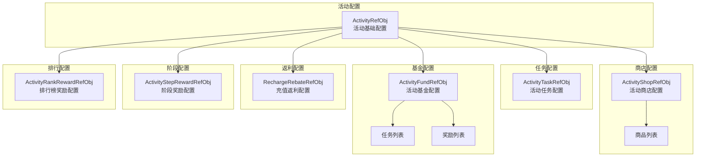

# 活动模块数据配表文档

## 配表说明

活动模块相关的配置数据主要存储在以下配表中：



---

## 一、活动基础配表

### ActivityRefObj - 活动配置
**文件**: `activity_ref.json`

#### 完整字段列表

| 字段名 | 类型 | 必填 | 默认值 | 说明 | 示例值 |
|--------|------|------|--------|------|--------|
| id | long | 是 | - | 活动配置ID（主键） | 10001 |
| name | string | 是 | - | 活动名称 | "春节狂欢" |
| type | int | 是 | - | 活动类型（见枚举表） | 1 |
| start_time | long | 是 | - | 开始时间戳（秒） | 1706745600 |
| end_time | long | 是 | - | 结束时间戳（秒） | 1707350399 |
| show_time | long | 否 | 0 | 展示时间戳（结束后展示） | 1707436799 |
| condition | object | 是 | {} | 参与条件配置 | {"min_level": 10} |
| reward | object | 否 | {} | 基础奖励配置 | {"diamond": 100} |
| icon | string | 否 | "" | 活动图标资源路径 | "ui/activity/spring_festival" |
| desc | string | 否 | "" | 活动描述文本 | "春节限时活动..." |
| max_participation | int | 否 | 0 | 最大参与次数（0=无限制） | 0 |
| daily_limit | int | 否 | 0 | 每日参与限制（0=无限制） | 3 |
| is_cross_server | bool | 否 | false | 是否跨服活动 | false |
| priority | int | 否 | 0 | 显示优先级（越大越靠前） | 100 |
| status | int | 否 | 1 | 配置状态（0=禁用，1=启用） | 1 |

#### 条件配置结构 (condition)

```json
{
  "min_level": 10,           // 最低等级
  "max_level": 999,          // 最高等级
  "min_vip": 0,              // 最低VIP等级
  "quest_complete": [1001],  // 需完成的任务ID列表
  "items": [                 // 需要的物品
    {"id": 2001, "count": 1}
  ]
}
```

#### 奖励配置结构 (reward)

```json
{
  "diamond": 100,            // 钻石数量
  "gold": 1000,              // 金币数量
  "items": [                 // 物品列表
    {"id": 3001, "count": 5}
  ],
  "heroes": [                // 英雄列表
    {"id": 4001, "count": 1}
  ]
}
```

#### 活动类型枚举

| 类型ID | 类型名称 | 说明 | 特殊字段 |
|--------|----------|------|----------|
| 1 | 限时活动 | 特定时间段开放的活动 | - |
| 2 | 累计充值活动 | 累计充值达到目标 | `recharge_targets` |
| 3 | 消费返利活动 | 消费获得返利 | `consume_ratio` |
| 4 | 七日目标活动 | 新玩家七日成长 | `day_goals` |
| 5 | 收益目标活动 | 累计收益达成 | `earnings_targets` |
| 6 | 排行榜活动 | 根据排名发奖 | `rank_rewards` |

---

## 二、活动任务配表

### ActivityTaskRefObj - 活动任务配置
**文件**: `activity_task_ref.json`

#### 完整字段列表

| 字段名 | 类型 | 必填 | 默认值 | 说明 | 示例值 |
|--------|------|------|--------|------|--------|
| id | long | 是 | - | 任务ID（主键） | 20001 |
| activity_id | long | 是 | - | 所属活动ID | 10001 |
| name | string | 是 | - | 任务名称 | "登录游戏" |
| desc | string | 否 | "" | 任务描述 | "累计登录游戏" |
| type | int | 是 | - | 任务类型（见枚举表） | 1 |
| target | object | 是 | {} | 任务目标配置 | {"type": "login", "count": 1} |
| reward | object | 是 | {} | 任务奖励 | {"diamond": 50} |
| step | int | 是 | - | 任务步骤/阶段 | 1 |
| pre_task | long | 否 | 0 | 前置任务ID（0=无前置） | 0 |
| auto_complete | bool | 否 | false | 是否自动完成 | true |
| show_progress | bool | 否 | true | 是否显示进度 | true |
| sort_order | int | 否 | 0 | 排序顺序 | 1 |

#### 任务目标结构 (target)

```json
{
  "type": "login",           // 目标类型
  "count": 1,                // 目标数量
  "params": {}               // 额外参数
}
```

#### 任务类型枚举

| 类型ID | 类型名称 | 说明 | target示例 |
|--------|----------|------|------------|
| 1 | 登录任务 | 登录游戏 | `{"type": "login", "count": 1}` |
| 2 | 战斗任务 | 完成战斗次数 | `{"type": "battle", "count": 10}` |
| 3 | 消费任务 | 消费钻石/金币 | `{"type": "consume", "count": 1000}` |
| 4 | 充值任务 | 充值金额 | `{"type": "recharge", "count": 100}` |
| 5 | 收集任务 | 收集指定物品 | `{"type": "collect", "item_id": 3001, "count": 5}` |
| 6 | 通关任务 | 通关指定关卡 | `{"type": "clear_stage", "stage_id": 1001}` |

---

## 三、活动商店配表

### ActivityShopRefObj - 活动商店配置
**文件**: `activity_shop_ref.json`

#### 完整字段列表

| 字段名 | 类型 | 必填 | 默认值 | 说明 | 示例值 |
|--------|------|------|--------|------|--------|
| id | long | 是 | - | 商店ID（主键） | 30001 |
| activity_id | long | 是 | - | 所属活动ID | 10001 |
| name | string | 是 | - | 商店名称 | "春节兑换商店" |
| currency_type | int | 是 | - | 货币类型 | 100 |
| item_list | array | 是 | [] | 商品列表 | [...] |
| refresh_type | int | 否 | 0 | 刷新类型（见枚举表） | 1 |
| refresh_cost | object | 否 | {} | 刷新消耗 | {"diamond": 50} |
| free_refresh | int | 否 | 0 | 免费刷新次数 | 1 |
| max_refresh | int | 否 | 0 | 最大刷新次数（0=无限制） | 5 |
| auto_add_items | bool | 否 | false | 是否自动添加商品 | false |

#### 商品结构 (item_list)

```json
[
  {
    "id": 1,                    // 商品槽位ID
    "item_id": 3001,            // 物品ID
    "item_count": 5,            // 物品数量
    "price": 100,               // 价格
    "buy_limit": 2,             // 购买限制（0=无限制）
    "discount": 0.9,            // 折扣（0-1，0表示不打折）
    "lock_condition": {},       // 解锁条件
    "sort_order": 1             // 排序
  }
]
```

#### 刷新类型枚举

| 类型ID | 类型名称 | 说明 |
|--------|----------|------|
| 0 | 不刷新 | 商品固定不变 |
| 1 | 每日刷新 | 每日0点自动刷新 |
| 2 | 手动刷新 | 玩家手动刷新 |
| 3 | 定时刷新 | 固定间隔刷新 |

---

## 四、活动基金配表

### ActivityFundRefObj - 活动基金配置
**文件**: `activity_fund_ref.json`

#### 完整字段列表

| 字段名 | 类型 | 必填 | 默认值 | 说明 | 示例值 |
|--------|------|------|--------|------|--------|
| id | long | 是 | - | 基金ID（主键） | 40001 |
| activity_id | long | 是 | - | 所属活动ID | 10001 |
| name | string | 是 | - | 基金名称 | "成长基金" |
| desc | string | 否 | "" | 基金描述 | "购买后完成任务可获得丰厚奖励" |
| price | long | 是 | - | 购买价格（人民币分） | 6800 |
| price_diamond | long | 否 | 0 | 钻石价格（0=不可用钻石购买） | 0 |
| total_reward | long | 是 | - | 总奖励价值描述 | 50000 |
| reward_list | array | 是 | [] | 奖励列表 | [...] |
| task_list | array | 是 | [] | 任务列表 | [...] |
| duration | int | 否 | 30 | 基金有效期（天） | 30 |
| max_buy | int | 否 | 1 | 最大购买次数 | 1 |
| icon | string | 否 | "" | 基金图标 | "ui/fund/growth" |

#### 奖励列表结构 (reward_list)

```json
[
  {
    "step": 1,                  // 阶段
    "condition": {              // 解锁条件
      "task_complete": 3        // 完成3个任务
    },
    "reward": {                 // 奖励内容
      "diamond": 100,
      "items": [{"id": 3001, "count": 5}]
    }
  }
]
```

#### 任务列表结构 (task_list)

```json
[
  {
    "id": 1,                    // 任务ID
    "type": "daily_login",      // 任务类型
    "target": {"count": 1},     // 任务目标
    "reward": {                 // 任务奖励
      "fund_point": 10          // 基金积分
    }
  }
]
```

---

## 五、充值返利配表

### RechargeRebateRefObj - 充值返利配置
**文件**: `recharge_rebate_ref.json`

#### 完整字段列表

| 字段名 | 类型 | 必填 | 默认值 | 说明 | 示例值 |
|--------|------|------|--------|------|--------|
| id | long | 是 | - | 配置ID（主键） | 50001 |
| activity_id | long | 是 | - | 所属活动ID | 10001 |
| name | string | 是 | - | 返利档位名称 | "充值返利档位1" |
| min_recharge | long | 是 | - | 最低充值金额（分） | 1000 |
| max_recharge | long | 是 | - | 最高充值金额（分） | 10000 |
| rebate_ratio | float | 是 | - | 返利比例（0-1） | 0.2 |
| max_rebate | long | 否 | 0 | 最大返利金额（0=无限制） | 1000 |
| reward_type | int | 否 | 1 | 奖励类型（1=钻石，2=道具） | 1 |
| extra_reward | object | 否 | {} | 额外奖励 | {"items": [...]} |
| auto_send | bool | 否 | false | 是否自动发放 | false |

#### 充值返利计算示例

```
充值金额: 100元（10000分）
返利比例: 20%
返利钻石: 10000 × 0.2 × 10 = 200钻石
```

---

## 六、阶段奖励配表

### ActivityStepRewardRefObj - 阶段奖励配置
**文件**: `activity_step_reward_ref.json`

#### 完整字段列表

| 字段名 | 类型 | 必填 | 默认值 | 说明 | 示例值 |
|--------|------|------|--------|------|--------|
| id | long | 是 | - | 配置ID（主键） | 60001 |
| activity_id | long | 是 | - | 所属活动ID | 10001 |
| step | int | 是 | - | 阶段序号 | 1 |
| name | string | 是 | - | 阶段名称 | "第一阶段" |
| target_value | long | 是 | - | 目标值 | 10 |
| reward | object | 是 | {} | 阶段奖励 | {"diamond": 100} |
| pre_step | int | 否 | 0 | 前置阶段（0=无前置） | 0 |
| auto_reward | bool | 否 | false | 是否自动发放 | false |
| show_effect | bool | 否 | true | 是否显示特效 | true |

---

## 七、排行榜奖励配表

### ActivityRankRewardRefObj - 排行榜奖励配置
**文件**: `activity_rank_reward_ref.json`

#### 完整字段列表

| 字段名 | 类型 | 必填 | 默认值 | 说明 | 示例值 |
|--------|------|------|--------|------|--------|
| id | long | 是 | - | 配置ID（主键） | 70001 |
| activity_id | long | 是 | - | 所属活动ID | 10001 |
| min_rank | int | 是 | - | 最低排名 | 1 |
| max_rank | int | 是 | - | 最高排名 | 1 |
| name | string | 是 | - | 档位名称 | "冠军" |
| reward | object | 是 | {} | 奖励内容 | {"diamond": 1000} |
| mail_title | string | 否 | "" | 邮件标题 | "排行榜奖励" |
| mail_content | string | 否 | "" | 邮件内容 | "恭喜您获得..." |

---

## 八、配表加载方式

### 8.1 基础加载方式

```csharp
// 获取活动配置
ActivityRefObj activityRef = GRefdataCoreMgr.instance.activityRefCore.getRef(activityId);
if (activityRef == null)
{
    Debug.LogError($"活动配置不存在: {activityId}");
    return;
}

// 获取活动任务配置
ActivityTaskRefObj taskRef = GRefdataCoreMgr.instance.activityTaskRefCore.getRef(taskId);
if (taskRef != null)
{
    Debug.Log($"任务名称: {taskRef.name}, 目标: {taskRef.target}");
}

// 获取活动商店配置
ActivityShopRefObj shopRef = GRefdataCoreMgr.instance.activityShopRefCore.getRef(shopId);
```

### 8.2 批量加载方式

```csharp
// 获取所有活动配置
List<ActivityRefObj> allActivities = GRefdataCoreMgr.instance.activityRefCore.getAll();

// 筛选进行中的活动
long currentTime = DateTimeOffset.UtcNow.ToUnixTimeSeconds();
List<ActivityRefObj> activeActivities = allActivities
    .Where(a => a.start_time <= currentTime && currentTime < a.end_time && a.status == 1)
    .OrderByDescending(a => a.priority)
    .ToList();

// 获取指定活动的所有任务
List<ActivityTaskRefObj> activityTasks = GRefdataCoreMgr.instance.activityTaskRefCore
    .getAll()
    .Where(t => t.activity_id == activityId)
    .OrderBy(t => t.step)
    .ToList();
```

### 8.3 配置验证示例

```csharp
public bool ValidateActivityConfig(ActivityRefObj config)
{
    if (config.id <= 0)
    {
        Debug.LogError("活动ID无效");
        return false;
    }
    
    if (string.IsNullOrEmpty(config.name))
    {
        Debug.LogError("活动名称不能为空");
        return false;
    }
    
    if (config.end_time <= config.start_time)
    {
        Debug.LogError("结束时间必须大于开始时间");
        return false;
    }
    
    if (config.type < 1 || config.type > 6)
    {
        Debug.LogError("活动类型无效");
        return false;
    }
    
    return true;
}
```

---

## 九、配置关系图



---

*文档生成时间: 2026-04-11*
*最后更新: 2026-04-11*
