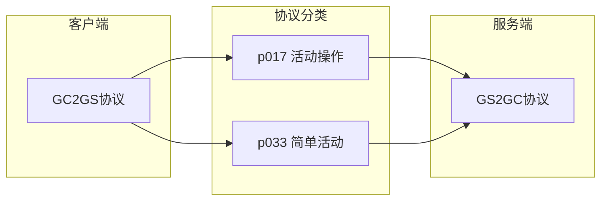
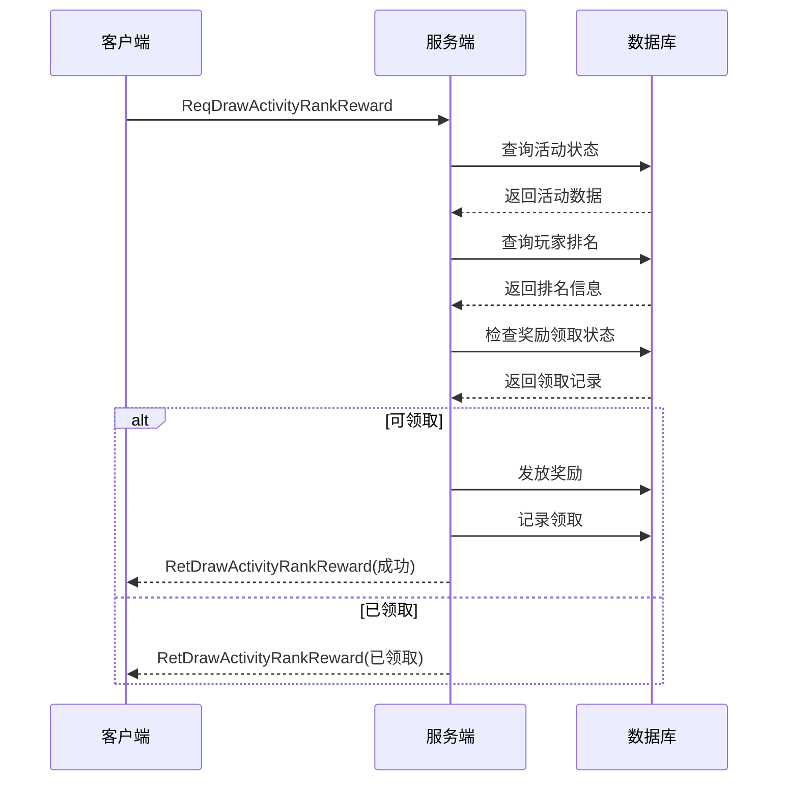
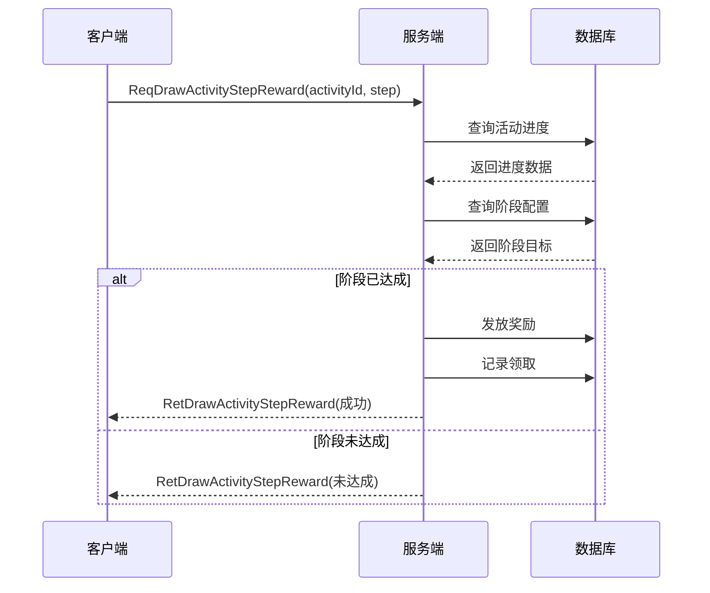
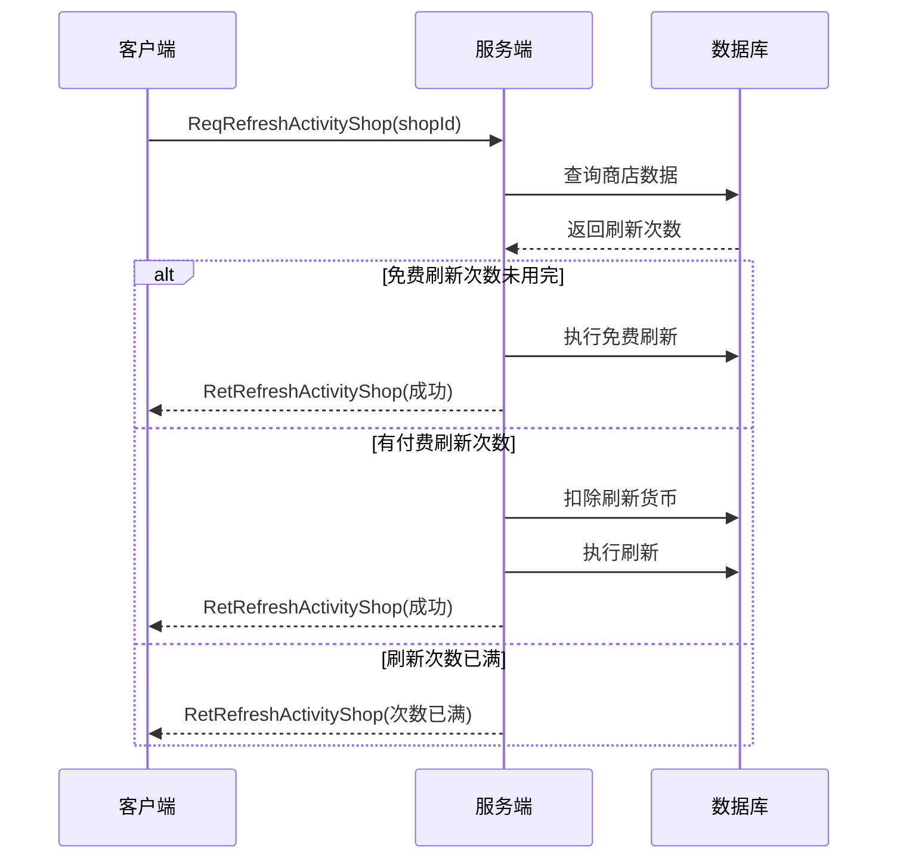
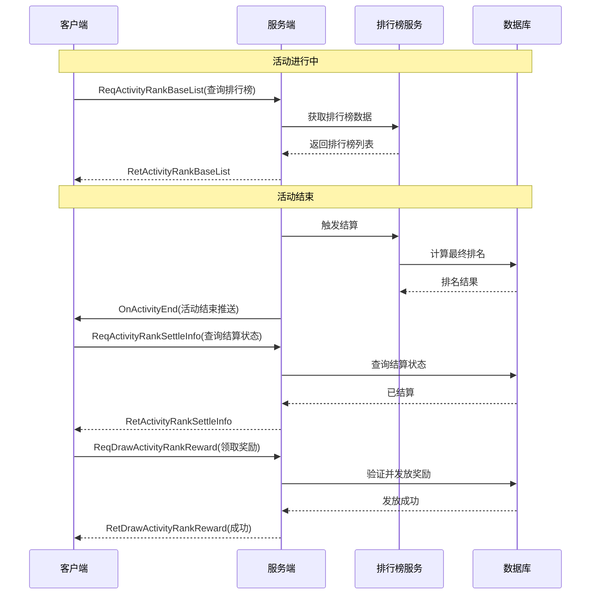
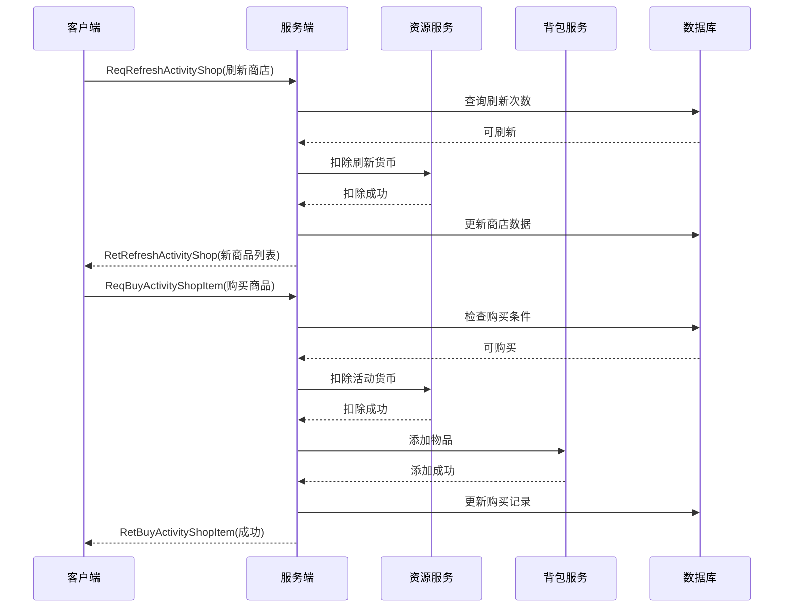
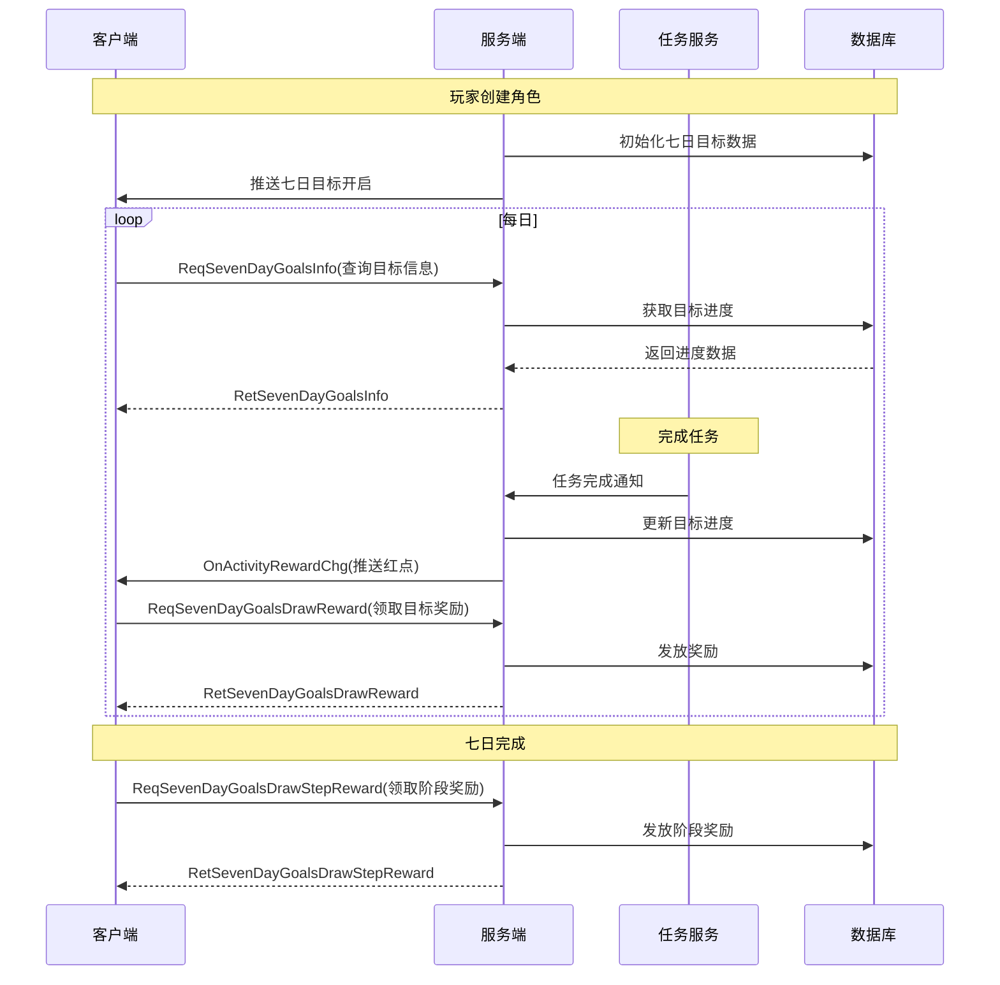

# 活动模块协议文档

## 协议模块编号: p017, p033



---

## 一、活动操作协议 (p017)

### 1.1 排行榜活动协议

#### GC2GS_017_001_ReqDrawActivityRankReward - 领取排行奖励

**请求参数**:

| 字段名 | 类型 | 必填 | 说明 | 示例值 |
|--------|------|------|------|--------|
| activityId | long | 是 | 活动ID | 10001 |
| rankType | int | 是 | 排行类型（1=总榜，2=好友榜） | 1 |

**返回参数**:

| 字段名 | 类型 | 说明 |
|--------|------|------|
| errorCode | int | 错误码（0=成功） |
| rewardList | array | 获得的奖励列表 |
| rankInfo | RankInfo | 排名信息 |

**协议流程**:



---

#### GC2GS_017_002_ReqActivityRankSettleInfo - 获取排行结算信息

**请求参数**:

| 字段名 | 类型 | 必填 | 说明 | 示例值 |
|--------|------|------|------|--------|
| activityId | long | 是 | 活动ID | 10001 |

**返回参数**:

| 字段名 | 类型 | 说明 |
|--------|------|------|
| errorCode | int | 错误码 |
| settleStatus | int | 结算状态（0=未结算，1=结算中，2=已结算） |
| myRank | int | 我的排名 |
| rewardStatus | int | 奖励状态（0=未领取，1=已领取） |

---

#### GC2GS_017_003_ReqActivityRankBaseList - 获取排行榜列表

**请求参数**:

| 字段名 | 类型 | 必填 | 说明 | 示例值 |
|--------|------|------|------|--------|
| activityId | long | 是 | 活动ID | 10001 |
| rankType | int | 是 | 排行类型 | 1 |
| page | int | 是 | 页码（从1开始） | 1 |
| pageSize | int | 否 | 每页数量（默认20） | 20 |

**返回参数**:

| 字段名 | 类型 | 说明 |
|--------|------|------|
| errorCode | int | 错误码 |
| totalPage | int | 总页数 |
| currentPage | int | 当前页码 |
| rankList | array | 排行榜列表 |
| myRankInfo | RankInfo | 我的排名信息 |

**RankInfo 结构**:

| 字段名 | 类型 | 说明 |
|--------|------|------|
| rank | int | 排名 |
| playerId | long | 玩家ID |
| playerName | string | 玩家名称 |
| score | long | 分数 |
| updateTime | long | 更新时间 |

---

### 1.2 阶段奖励活动协议

#### GC2GS_017_011_ReqDrawActivityStepReward - 领取阶段奖励

**请求参数**:

| 字段名 | 类型 | 必填 | 说明 | 示例值 |
|--------|------|------|------|--------|
| activityId | long | 是 | 活动ID | 10001 |
| step | int | 是 | 阶段序号 | 1 |

**返回参数**:

| 字段名 | 类型 | 说明 |
|--------|------|------|
| errorCode | int | 错误码 |
| rewardList | array | 获得的奖励列表 |
| stepInfo | StepInfo | 阶段信息 |

**协议流程**:



---

#### GC2GS_017_013_ReqAKeyDrawActivityStepReward - 一键领取阶段奖励

**请求参数**:

| 字段名 | 类型 | 必填 | 说明 | 示例值 |
|--------|------|------|------|--------|
| activityId | long | 是 | 活动ID | 10001 |

**返回参数**:

| 字段名 | 类型 | 说明 |
|--------|------|------|
| errorCode | int | 错误码 |
| rewardList | array | 所有获得的奖励列表 |
| rewardedSteps | array | 已领取的阶段列表 |

---

### 1.3 活动商店协议

#### GC2GS_017_014_ReqRefreshActivityShop - 刷新活动商店

**请求参数**:

| 字段名 | 类型 | 必填 | 说明 | 示例值 |
|--------|------|------|------|--------|
| shopId | long | 是 | 商店ID | 30001 |

**返回参数**:

| 字段名 | 类型 | 说明 |
|--------|------|------|
| errorCode | int | 错误码 |
| refreshNum | int | 已刷新次数 |
| goodsList | array | 新商品列表 |

**协议流程**:



---

#### GC2GS_017_015_ReqBuyActivityShopItem - 购买活动商店物品

**请求参数**:

| 字段名 | 类型 | 必填 | 说明 | 示例值 |
|--------|------|------|------|--------|
| shopId | long | 是 | 商店ID | 30001 |
| itemId | long | 是 | 商品槽位ID | 1 |
| count | long | 是 | 购买数量 | 1 |

**返回参数**:

| 字段名 | 类型 | 说明 |
|--------|------|------|
| errorCode | int | 错误码 |
| boughtCount | int | 已购买数量 |
| remainCount | int | 剩余可购买数量 |

---

### 1.4 活动基金协议

#### GC2GS_017_018_ReqActivityFundDrawStepReward - 领取基金阶段奖励

**请求参数**:

| 字段名 | 类型 | 必填 | 说明 | 示例值 |
|--------|------|------|------|--------|
| fundId | long | 是 | 基金ID | 40001 |
| step | int | 是 | 阶段序号 | 1 |

**返回参数**:

| 字段名 | 类型 | 说明 |
|--------|------|------|
| errorCode | int | 错误码 |
| rewardList | array | 获得的奖励列表 |

---

#### GC2GS_017_019_ReqActivityFundTaskInfo - 获取基金任务信息

**请求参数**:

| 字段名 | 类型 | 必填 | 说明 | 示例值 |
|--------|------|------|------|--------|
| fundId | long | 是 | 基金ID | 40001 |

**返回参数**:

| 字段名 | 类型 | 说明 |
|--------|------|------|
| errorCode | int | 错误码 |
| taskList | array | 任务列表 |
| completedCount | int | 已完成任务数 |
| totalReward | int | 总奖励价值 |

---

## 二、简单活动协议 (p033)

### 2.1 收益目标活动协议

#### GC2GS_033_001_ReqEarningsGoalInfo - 获取收益目标信息

**请求参数**: 无

**返回参数**:

| 字段名 | 类型 | 说明 |
|--------|------|------|
| errorCode | int | 错误码 |
| goalList | array | 目标列表 |
| totalEarnings | long | 累计收益 |

**GoalInfo 结构**:

| 字段名 | 类型 | 说明 |
|--------|------|------|
| goalId | long | 目标ID |
| targetValue | long | 目标值 |
| currentValue | long | 当前进度 |
| rewardStatus | int | 奖励状态（0=未达成，1=可领取，2=已领取） |

---

#### GC2GS_033_002_ReqEarningsGoalDrawReward - 领取收益目标奖励

**请求参数**:

| 字段名 | 类型 | 必填 | 说明 | 示例值 |
|--------|------|------|------|--------|
| goalId | long | 是 | 目标ID | 50001 |

**返回参数**:

| 字段名 | 类型 | 说明 |
|--------|------|------|
| errorCode | int | 错误码 |
| rewardList | array | 获得的奖励列表 |

---

#### GC2GS_033_003_ReqEarningsGoalDrawHonorReward - 领取荣誉奖励

**请求参数**:

| 字段名 | 类型 | 必填 | 说明 | 示例值 |
|--------|------|------|------|--------|
| goalId | long | 是 | 目标ID | 50001 |

**返回参数**:

| 字段名 | 类型 | 说明 |
|--------|------|------|
| errorCode | int | 错误码 |
| honorReward | object | 荣誉奖励内容 |

---

### 2.2 七日目标活动协议

#### GC2GS_033_004_ReqSevenDayGoalsInfo - 获取七日目标信息

**请求参数**: 无

**返回参数**:

| 字段名 | 类型 | 说明 |
|--------|------|------|
| errorCode | int | 错误码 |
| currentDay | int | 当前第几天（1-7） |
| dayGoalsList | array | 每日目标列表 |
| stepRewardList | array | 阶段奖励列表 |

**DayGoalsInfo 结构**:

| 字段名 | 类型 | 说明 |
|--------|------|------|
| day | int | 第几天 |
| goalList | array | 该天的目标列表 |
| completeCount | int | 已完成数量 |
| totalCount | int | 总数量 |

---

#### GC2GS_033_005_ReqSevenDayGoalsDrawReward - 领取七日目标奖励

**请求参数**:

| 字段名 | 类型 | 必填 | 说明 | 示例值 |
|--------|------|------|------|--------|
| day | int | 是 | 天数 | 1 |
| goalId | long | 是 | 目标ID | 60001 |

**返回参数**:

| 字段名 | 类型 | 说明 |
|--------|------|------|
| errorCode | int | 错误码 |
| rewardList | array | 获得的奖励列表 |

---

#### GC2GS_033_006_ReqSevenDayGoalsDrawStepReward - 领取阶段奖励

**请求参数**:

| 字段名 | 类型 | 必填 | 说明 | 示例值 |
|--------|------|------|------|--------|
| step | int | 是 | 阶段 | 1 |

**返回参数**:

| 字段名 | 类型 | 说明 |
|--------|------|------|
| errorCode | int | 错误码 |
| rewardList | array | 获得的奖励列表 |

---

### 2.3 充值返利活动协议

#### GC2GS_033_007_ReqRechargeRebateInfo - 获取充值返利信息

**请求参数**:

| 字段名 | 类型 | 必填 | 说明 | 示例值 |
|--------|------|------|------|--------|
| activityId | long | 是 | 活动ID | 10001 |

**返回参数**:

| 字段名 | 类型 | 说明 |
|--------|------|------|
| errorCode | int | 错误码 |
| totalRecharge | long | 累计充值金额 |
| totalRebate | long | 累计返利金额 |
| rebateList | array | 返利档位列表 |
| drawStatus | int | 领取状态 |

**RebateInfo 结构**:

| 字段名 | 类型 | 说明 |
|--------|------|------|
| minRecharge | long | 最低充值金额 |
| maxRecharge | long | 最高充值金额 |
| rebateRatio | float | 返利比例 |
| currentRecharge | long | 当前充值金额 |
| canDraw | bool | 是否可领取 |
| hasDrawn | bool | 是否已领取 |

---

#### GC2GS_033_008_ReqRechargeRebateDrawReward - 领取充值返利奖励

**请求参数**:

| 字段名 | 类型 | 必填 | 说明 | 示例值 |
|--------|------|------|------|--------|
| activityId | long | 是 | 活动ID | 10001 |

**返回参数**:

| 字段名 | 类型 | 说明 |
|--------|------|------|
| errorCode | int | 错误码 |
| rewardList | array | 获得的奖励列表 |
| totalRebate | long | 返利总价值 |

---

## 三、推送协议

### 3.1 活动状态推送

#### GS2GC_017_050_OnActivityStart - 活动开始推送

**推送参数**:

| 字段名 | 类型 | 说明 |
|--------|------|------|
| activityId | long | 活动ID |
| activityName | string | 活动名称 |
| activityType | int | 活动类型 |
| endTime | long | 结束时间 |

---

#### GS2GC_017_051_OnActivityEnd - 活动结束推送

**推送参数**:

| 字段名 | 类型 | 说明 |
|--------|------|------|
| activityId | long | 活动ID |
| activityName | string | 活动名称 |

---

#### GS2GC_017_052_OnActivityRewardChg - 活动奖励变化推送

**推送参数**:

| 字段名 | 类型 | 说明 |
|--------|------|------|
| activityId | long | 活动ID |
| rewardList | array | 奖励列表 |

---

#### GS2GC_017_053_OnActivityRankChg - 活动排行变化推送

**推送参数**:

| 字段名 | 类型 | 说明 |
|--------|------|------|
| activityId | long | 活动ID |
| myRank | int | 我的排名 |
| myScore | long | 我的分数 |

---

### 3.2 商店状态推送

#### GS2GC_017_054_OnActivityShopRefresh - 商店刷新推送

**推送参数**:

| 字段名 | 类型 | 说明 |
|--------|------|------|
| shopId | long | 商店ID |
| goodsList | array | 新商品列表 |

---

## 四、协议完整流程图

### 4.1 排行榜活动完整流程



### 4.2 活动商店完整流程



### 4.3 七日目标完整流程



---

## 五、错误码定义

| 错误码 | 错误信息 | 说明 |
|--------|----------|------|
| 0 | 成功 | 操作成功 |
| 60001 | 活动不存在 | 活动ID无效或已删除 |
| 60002 | 活动未开始 | 当前时间未到活动开始时间 |
| 60003 | 活动已结束 | 活动已结束或已关闭 |
| 60004 | 参与条件不满足 | 等级/VIP等条件不满足 |
| 60005 | 奖励已领取 | 该奖励已领取过 |
| 60006 | 阶段未达成 | 当前阶段目标未达成 |
| 60007 | 货币不足 | 活动货币不足 |
| 60008 | 商品已售罄 | 购买次数已用完 |
| 60009 | 排名未结算 | 排行榜正在结算中 |
| 60010 | 未购买基金 | 需要先购买基金 |
| 60011 | 刷新次数已满 | 商店刷新次数已用完 |
| 60012 | 参数错误 | 请求参数不合法 |

---

## 六、协议使用示例

### 6.1 C# 客户端示例

```csharp
// 领取排行奖励
public void DrawActivityRankReward(long activityId, int rankType)
{
    GC2GS_017_001_ReqDrawActivityRankReward req = new GC2GS_017_001_ReqDrawActivityRankReward();
    req.activityId = activityId;
    req.rankType = rankType;
    
    NetworkManager.instance.SendMessage(req, (ret) => {
        var response = ret as GS2GC_017_001_RetDrawActivityRankReward;
        if (response.errorCode == 0)
        {
            // 发放奖励
            BagManager.instance.AddRewards(response.rewardList);
            UIManager.instance.ShowToast("领取成功！");
        }
        else
        {
            UIManager.instance.ShowToast(GetErrorMsg(response.errorCode));
        }
    });
}

// 刷新商店
public void RefreshActivityShop(long shopId)
{
    GC2GS_017_014_ReqRefreshActivityShop req = new GC2GS_017_014_ReqRefreshActivityShop();
    req.shopId = shopId;
    
    NetworkManager.instance.SendMessage(req, (ret) => {
        var response = ret as GS2GC_017_014_RetRefreshActivityShop;
        if (response.errorCode == 0)
        {
            // 更新商店数据
            ActivityShopManager.instance.UpdateShopData(shopId, response.goodsList);
            UIManager.instance.ShowToast("刷新成功！");
        }
        else if (response.errorCode == 60011)
        {
            UIManager.instance.ShowToast("刷新次数已用完");
        }
        else
        {
            UIManager.instance.ShowToast(GetErrorMsg(response.errorCode));
        }
    });
}
```

### 6.2 服务端处理示例

```csharp
// 处理领取排行奖励
public void OnDrawActivityRankReward(ClientSession session, GC2GS_017_001_ReqDrawActivityRankReward req)
{
    long playerId = session.playerId;
    
    // 1. 检查活动是否存在
    ActivityConfig config = activityConfigDao.getById(req.activityId);
    if (config == null)
    {
        SendErrorResponse(session, 60001, "活动不存在");
        return;
    }
    
    // 2. 检查活动状态
    if (config.status != ActivityStatus.SETTLED)
    {
        SendErrorResponse(session, 60009, "排名未结算");
        return;
    }
    
    // 3. 获取玩家排名
    int rank = rankService.GetPlayerRank(req.activityId, playerId, req.rankType);
    
    // 4. 检查是否已领取
    PlayerActivityData playerData = activityDao.getByPlayerAndId(playerId, req.activityId);
    if (playerData.rankRewardDrawn)
    {
        SendErrorResponse(session, 60005, "奖励已领取");
        return;
    }
    
    // 5. 发放奖励
    List<RewardInfo> rewards = GetRankRewards(config, rank);
    bagService.AddRewards(playerId, rewards);
    
    // 6. 更新领取状态
    playerData.rankRewardDrawn = true;
    activityDao.update(playerData);
    
    // 7. 返回成功
    GS2GC_017_001_RetDrawActivityRankReward response = new GS2GC_017_001_RetDrawActivityRankReward();
    response.errorCode = 0;
    response.rewardList = rewards;
    response.rankInfo = new RankInfo { rank = rank };
    
    session.Send(response);
}
```

---

## 七、协议测试用例

### 7.1 排行榜奖励领取测试

```csharp
[Test]
public void TestDrawActivityRankReward()
{
    // 准备数据
    long activityId = 10001;
    long playerId = 100001;
    int rankType = 1;
    
    // 模拟活动结束并结算
    activityService.SetActivityStatus(activityId, ActivityStatus.SETTLED);
    rankService.SetPlayerRank(activityId, playerId, rankType, 5);
    
    // 发送请求
    var response = SendRequest<GC2GS_017_001_ReqDrawActivityRankReward>(
        new { activityId, rankType }
    );
    
    // 验证结果
    Assert.AreEqual(0, response.errorCode);
    Assert.AreEqual(5, response.rankInfo.rank);
    Assert.Greater(response.rewardList.Count, 0);
    
    // 验证不可重复领取
    var response2 = SendRequest<GC2GS_017_001_ReqDrawActivityRankReward>(
        new { activityId, rankType }
    );
    Assert.AreEqual(60005, response2.errorCode);
}
```

---

*文档生成时间: 2026-04-11*
*最后更新: 2026-04-11*
