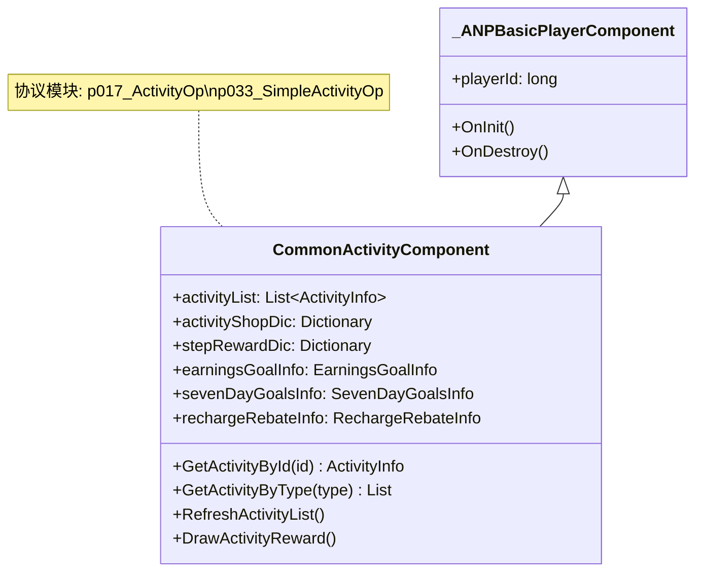
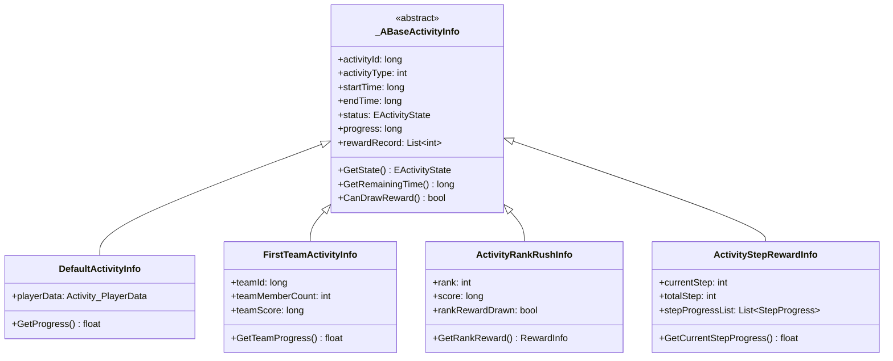
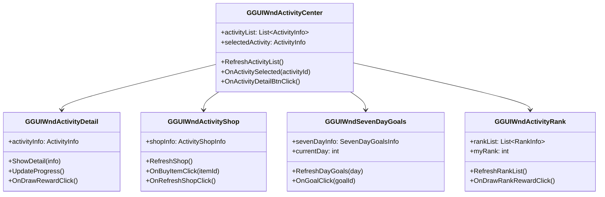
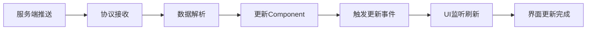
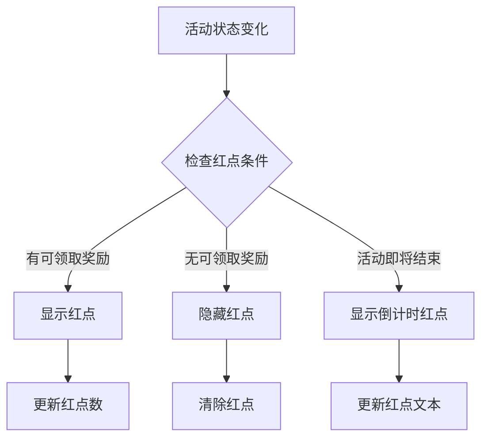

# 活动模块客户端开发文档

## 一、组件数据层

### 1.1 核心组件类

#### CommonActivityComponent
**路径**: `GameComponent/CommonActivity/CommonActivityComponent.cs`

**继承关系**:



**完整属性列表**:

| 属性名 | 类型 | 访问级别 | 说明 |
|--------|------|----------|------|
| activityList | List\<ActivityInfo\> | public | 活动列表 |
| activityShopDic | Dictionary\<long, ActivityShopInfo\> | public | 活动商店字典 |
| stepRewardDic | Dictionary\<long, StepRewardInfo\> | public | 阶段奖励字典 |
| earningsGoalInfo | EarningsGoalInfo | public | 收益目标信息 |
| sevenDayGoalsInfo | SevenDayGoalsInfo | public | 七日目标信息 |
| rechargeRebateInfo | RechargeRebateInfo | public | 充值返利信息 |
| onActivityUpdate | Action\<long\> | public | 活动更新事件 |
| onShopUpdate | Action\<long\> | public | 商店更新事件 |

**核心方法**:

```csharp
public class CommonActivityComponent : _ANPBasicPlayerComponent
{
    // 获取指定活动
    public ActivityInfo GetActivityById(long activityId)
    {
        return activityList.FirstOrDefault(a => a.activityId == activityId);
    }
    
    // 获取指定类型的活动列表
    public List<ActivityInfo> GetActivityByType(int type)
    {
        return activityList.Where(a => a.activityType == type).ToList();
    }
    
    // 刷新活动列表
    public void RefreshActivityList()
    {
        GC2GS_017_001_ReqActivityList req = new GC2GS_017_001_ReqActivityList();
        NetworkManager.instance.SendMessage(req, OnActivityListResponse);
    }
    
    // 领取活动奖励
    public void DrawActivityReward(long activityId, Action<bool> callback)
    {
        ActivityInfo activity = GetActivityById(activityId);
        if (activity == null)
        {
            callback?.Invoke(false);
            return;
        }
        
        GC2GS_017_011_ReqDrawActivityStepReward req = new GC2GS_017_011_ReqDrawActivityStepReward();
        req.activityId = activityId;
        req.step = activity.currentStep;
        
        NetworkManager.instance.SendMessage(req, (ret) => {
            var response = ret as GS2GC_017_011_RetDrawActivityStepReward;
            if (response.errorCode == 0)
            {
                BagManager.instance.AddRewards(response.rewardList);
                callback?.Invoke(true);
            }
            else
            {
                UIManager.instance.ShowToast(GetErrorMsg(response.errorCode));
                callback?.Invoke(false);
            }
        });
    }
}
```

---

### 1.2 活动信息类

#### ActivityInfo (基类)
**路径**: `GameComponent/CommonActivity/Base/_ABaseActivityInfo.cs`



**完整属性列表**:

| 属性名 | 类型 | 说明 |
|--------|------|------|
| activityId | long | 活动ID |
| activityType | int | 活动类型 |
| activityName | string | 活动名称 |
| startTime | long | 开始时间戳 |
| endTime | long | 结束时间戳 |
| status | EActivityState | 活动状态 |
| progress | long | 当前进度 |
| rewardRecord | List\<int\> | 已领取奖励记录 |
| config | ActivityRefObj | 活动配置引用 |

**核心方法**:

```csharp
public abstract class _ABaseActivityInfo
{
    // 获取活动状态
    public EActivityState GetState()
    {
        long currentTime = DateTimeOffset.UtcNow.ToUnixTimeSeconds();
        
        if (currentTime < startTime)
            return EActivityState.NotStart;
        else if (currentTime < endTime)
            return EActivityState.InProgress;
        else
            return EActivityState.Ended;
    }
    
    // 获取剩余时间
    public long GetRemainingTime()
    {
        long currentTime = DateTimeOffset.UtcNow.ToUnixTimeSeconds();
        return Math.Max(0, endTime - currentTime);
    }
    
    // 是否可以领取奖励
    public abstract bool CanDrawReward();
    
    // 获取进度百分比
    public abstract float GetProgressPercent();
}

public class ActivityStepRewardInfo : _ABaseActivityInfo
{
    public int currentStep;
    public int totalStep;
    public List<StepProgress> stepProgressList;
    
    public override bool CanDrawReward()
    {
        // 检查是否有可领取的阶段
        for (int i = 0; i < stepProgressList.Count; i++)
        {
            if (stepProgressList[i].isComplete && !rewardRecord.Contains(i))
            {
                return true;
            }
        }
        return false;
    }
    
    public override float GetProgressPercent()
    {
        return (float)currentStep / totalStep;
    }
    
    public float GetCurrentStepProgress()
    {
        if (currentStep >= totalStep)
            return 1.0f;
        
        var currentStepData = stepProgressList[currentStep];
        return (float)currentStepData.currentValue / currentStepData.targetValue;
    }
}
```

---

### 1.3 活动类型枚举

**路径**: `ClientProtocol/Common/ActivityEnum/EActivityState.cs`

```csharp
public enum EActivityState
{
    None = 0,           // 无状态
    NotStart = 1,       // 未开始
    InProgress = 2,     // 进行中
    Ended = 3,          // 已结束
    Rewarded = 4        // 已领奖
}

public enum EActivityType
{
    TimeLimited = 1,        // 限时活动
    RechargeAccumulate = 2, // 累计充值
    ConsumeRebate = 3,      // 消费返利
    SevenDayGoals = 4,      // 七日目标
    EarningsGoal = 5,       // 收益目标
    RankActivity = 6        // 排行榜活动
}

public enum EShopRefreshType
{
    None = 0,       // 不刷新
    Daily = 1,      // 每日刷新
    Manual = 2,     // 手动刷新
    Scheduled = 3   // 定时刷新
}
```

---

## 二、UI组件层

### 2.1 UI组件架构



---

### 2.2 活动中心界面

**类名**: `GGUIWndActivityCenter`
**路径**: `GameWndGui/GGui/Activity/GGUIWndActivityCenter.cs`

```csharp
public class GGUIWndActivityCenter : GGUIWndBase
{
    [SerializeField] private Transform activityListContainer;
    [SerializeField] private GameObject activityItemPrefab;
    [SerializeField] private Text activityCountText;
    
    private List<ActivityInfo> activityList;
    private ActivityInfo selectedActivity;
    
    protected override void OnInit()
    {
        base.OnInit();
        
        // 注册事件
        NPPlayer.instance.commonActivityComponent.onActivityUpdate += OnActivityUpdate;
        
        // 刷新活动列表
        RefreshActivityList();
    }
    
    protected override void OnDestroy()
    {
        base.OnDestroy();
        
        // 注销事件
        NPPlayer.instance.commonActivityComponent.onActivityUpdate -= OnActivityUpdate;
    }
    
    // 刷新活动列表
    public void RefreshActivityList()
    {
        activityList = NPPlayer.instance.commonActivityComponent.activityList
            .Where(a => a.GetState() == EActivityState.InProgress)
            .OrderByDescending(a => a.config.priority)
            .ToList();
        
        // 清空容器
        foreach (Transform child in activityListContainer)
        {
            Destroy(child.gameObject);
        }
        
        // 创建活动项
        foreach (var activity in activityList)
        {
            GameObject item = Instantiate(activityItemPrefab, activityListContainer);
            GGUIActivityItem activityItem = item.GetComponent<GGUIActivityItem>();
            activityItem.SetData(activity, OnActivitySelected);
        }
        
        // 更新计数
        activityCountText.text = $"活动数量: {activityList.Count}";
        
        // 默认选中第一个
        if (activityList.Count > 0)
        {
            OnActivitySelected(activityList[0].activityId);
        }
    }
    
    // 活动选中回调
    private void OnActivitySelected(long activityId)
    {
        selectedActivity = activityList.FirstOrDefault(a => a.activityId == activityId);
        if (selectedActivity != null)
        {
            // 打开活动详情界面
            GGUIWndActivityDetail detailWnd = UIManager.instance.OpenWnd<GGUIWndActivityDetail>();
            detailWnd.ShowDetail(selectedActivity);
        }
    }
    
    // 活动更新事件
    private void OnActivityUpdate(long activityId)
    {
        // 刷新指定活动
        RefreshActivityList();
    }
}
```

---

### 2.3 活动商店界面

**类名**: `GGUIWndActivityShop`
**路径**: `GameWndGui/GGui/Activity/GGUIWndActivityShop.cs`

```csharp
public class GGUIWndActivityShop : GGUIWndBase
{
    [SerializeField] private Transform goodsContainer;
    [SerializeField] private GameObject goodsItemPrefab;
    [SerializeField] private Button refreshBtn;
    [SerializeField] private Text refreshCountText;
    [SerializeField] private Text currencyText;
    
    private long shopId;
    private ActivityShopInfo shopInfo;
    
    public void SetShopId(long shopId)
    {
        this.shopId = shopId;
        RefreshShop();
    }
    
    // 刷新商店
    public void RefreshShop()
    {
        shopInfo = NPPlayer.instance.commonActivityComponent.activityShopDic.GetValueOrDefault(shopId);
        if (shopInfo == null) return;
        
        // 更新商品列表
        UpdateGoodsList();
        
        // 更新刷新次数
        ActivityShopRefObj shopConfig = GRefdataCoreMgr.instance.activityShopRefCore.getRef(shopId);
        int remainRefresh = shopConfig.max_refresh - shopInfo.refreshNum;
        refreshCountText.text = $"剩余刷新: {remainRefresh}";
        
        // 更新货币
        long currency = ResourceManager.instance.GetResource(shopConfig.currency_type);
        currencyText.text = $"货币: {currency}";
    }
    
    // 更新商品列表
    private void UpdateGoodsList()
    {
        // 清空容器
        foreach (Transform child in goodsContainer)
        {
            Destroy(child.gameObject);
        }
        
        // 创建商品项
        foreach (var goods in shopInfo.goodsList)
        {
            GameObject item = Instantiate(goodsItemPrefab, goodsContainer);
            GGUIActivityGoodsItem goodsItem = item.GetComponent<GGUIActivityGoodsItem>();
            goodsItem.SetData(goods, OnBuyItemClick);
        }
    }
    
    // 购买商品
    private void OnBuyItemClick(long itemId, int count)
    {
        GC2GS_017_015_ReqBuyActivityShopItem req = new GC2GS_017_015_ReqBuyActivityShopItem();
        req.shopId = shopId;
        req.itemId = itemId;
        req.count = count;
        
        NetworkManager.instance.SendMessage(req, (ret) => {
            var response = ret as GS2GC_017_015_RetBuyActivityShopItem;
            if (response.errorCode == 0)
            {
                UIManager.instance.ShowToast("购买成功");
                RefreshShop();
            }
            else
            {
                UIManager.instance.ShowToast(GetErrorMsg(response.errorCode));
            }
        });
    }
    
    // 刷新商店按钮
    public void OnRefreshBtnClick()
    {
        GC2GS_017_014_ReqRefreshActivityShop req = new GC2GS_017_014_ReqRefreshActivityShop();
        req.shopId = shopId;
        
        NetworkManager.instance.SendMessage(req, (ret) => {
            var response = ret as GS2GC_017_014_RetRefreshActivityShop;
            if (response.errorCode == 0)
            {
                UIManager.instance.ShowToast("刷新成功");
                RefreshShop();
            }
            else if (response.errorCode == 60011)
            {
                UIManager.instance.ShowToast("刷新次数已用完");
            }
            else
            {
                UIManager.instance.ShowToast(GetErrorMsg(response.errorCode));
            }
        });
    }
}
```

---

### 2.4 七日目标界面

**类名**: `GGUIWndSevenDayGoals`
**路径**: `GameWndGui/GGui/Activity/GGUIWndSevenDayGoals.cs`

```csharp
public class GGUIWndSevenDayGoals : GGUIWndBase
{
    [SerializeField] private Transform dayTabContainer;
    [SerializeField] private Transform goalContainer;
    [SerializeField] private GameObject dayTabPrefab;
    [SerializeField] private GameObject goalItemPrefab;
    [SerializeField] private Button stepRewardBtn;
    
    private SevenDayGoalsInfo sevenDayInfo;
    private int currentDay;
    
    protected override void OnInit()
    {
        base.OnInit();
        RefreshSevenDayGoals();
    }
    
    // 刷新七日目标
    public void RefreshSevenDayGoals()
    {
        sevenDayInfo = NPPlayer.instance.commonActivityComponent.sevenDayGoalsInfo;
        if (sevenDayInfo == null) return;
        
        currentDay = sevenDayInfo.currentDay;
        
        // 创建日期标签
        CreateDayTabs();
        
        // 显示当前天的目标
        ShowDayGoals(currentDay);
        
        // 更新阶段奖励按钮
        UpdateStepRewardButton();
    }
    
    // 创建日期标签
    private void CreateDayTabs()
    {
        foreach (Transform child in dayTabContainer)
        {
            Destroy(child.gameObject);
        }
        
        for (int day = 1; day <= 7; day++)
        {
            GameObject tab = Instantiate(dayTabPrefab, dayTabContainer);
            GGUIDayTab dayTab = tab.GetComponent<GGUIDayTab>();
            dayTab.SetData(day, day == currentDay, OnDayTabClick);
        }
    }
    
    // 显示指定天的目标
    private void ShowDayGoals(int day)
    {
        foreach (Transform child in goalContainer)
        {
            Destroy(child.gameObject);
        }
        
        var dayGoals = sevenDayInfo.dayGoalsList.FirstOrDefault(d => d.day == day);
        if (dayGoals == null) return;
        
        foreach (var goal in dayGoals.goalList)
        {
            GameObject item = Instantiate(goalItemPrefab, goalContainer);
            GGUISevenDayGoalItem goalItem = item.GetComponent<GGUISevenDayGoalItem>();
            goalItem.SetData(goal, OnGoalDrawReward);
        }
    }
    
    // 日期标签点击
    private void OnDayTabClick(int day)
    {
        currentDay = day;
        ShowDayGoals(day);
    }
    
    // 领取目标奖励
    private void OnGoalDrawReward(int day, long goalId)
    {
        GC2GS_033_005_ReqSevenDayGoalsDrawReward req = new GC2GS_033_005_ReqSevenDayGoalsDrawReward();
        req.day = day;
        req.goalId = goalId;
        
        NetworkManager.instance.SendMessage(req, (ret) => {
            var response = ret as GS2GC_033_005_RetSevenDayGoalsDrawReward;
            if (response.errorCode == 0)
            {
                BagManager.instance.AddRewards(response.rewardList);
                UIManager.instance.ShowToast("领取成功");
                RefreshSevenDayGoals();
            }
            else
            {
                UIManager.instance.ShowToast(GetErrorMsg(response.errorCode));
            }
        });
    }
}
```

---

## 三、数据绑定与刷新

### 3.1 数据绑定流程



### 3.2 数据更新管理器

```csharp
public class ActivityDataManager : MonoBehaviour
{
    private static ActivityDataManager _instance;
    public static ActivityDataManager instance
    {
        get
        {
            if (_instance == null)
            {
                GameObject go = new GameObject("ActivityDataManager");
                _instance = go.AddComponent<ActivityDataManager>();
                DontDestroyOnLoad(go);
            }
            return _instance;
        }
    }
    
    // 活动数据缓存
    private Dictionary<long, ActivityInfo> activityCache = new Dictionary<long, ActivityInfo>();
    
    // 更新事件
    public event Action<long> onActivityDataUpdate;
    public event Action<long> onShopDataUpdate;
    
    // 初始化
    public void Init()
    {
        // 注册协议监听
        NetworkManager.instance.RegisterHandler<GS2GC_017_050_OnActivityStart>(OnActivityStart);
        NetworkManager.instance.RegisterHandler<GS2GC_017_051_OnActivityEnd>(OnActivityEnd);
        NetworkManager.instance.RegisterHandler<GS2GC_017_052_OnActivityRewardChg>(OnActivityRewardChg);
        NetworkManager.instance.RegisterHandler<GS2GC_017_053_OnActivityRankChg>(OnActivityRankChg);
        NetworkManager.instance.RegisterHandler<GS2GC_017_054_OnActivityShopRefresh>(OnActivityShopRefresh);
    }
    
    // 活动开始推送
    private void OnActivityStart(GS2GC_017_050_OnActivityStart msg)
    {
        // 添加到缓存
        ActivityInfo info = CreateActivityInfo(msg);
        activityCache[msg.activityId] = info;
        
        // 触发更新事件
        onActivityDataUpdate?.Invoke(msg.activityId);
        
        // 显示提示
        UIManager.instance.ShowToast($"新活动开启: {msg.activityName}");
    }
    
    // 活动结束推送
    private void OnActivityEnd(GS2GC_017_051_OnActivityEnd msg)
    {
        // 从缓存移除
        activityCache.Remove(msg.activityId);
        
        // 触发更新事件
        onActivityDataUpdate?.Invoke(msg.activityId);
    }
    
    // 活动奖励变化推送
    private void OnActivityRewardChg(GS2GC_017_052_OnActivityRewardChg msg)
    {
        if (activityCache.TryGetValue(msg.activityId, out ActivityInfo info))
        {
            // 更新奖励信息
            UpdateActivityReward(info, msg.rewardList);
            
            // 触发更新事件
            onActivityDataUpdate?.Invoke(msg.activityId);
        }
    }
    
    // 商店刷新推送
    private void OnActivityShopRefresh(GS2GC_017_054_OnActivityShopRefresh msg)
    {
        // 更新商店数据
        ActivityShopInfo shopInfo = NPPlayer.instance.commonActivityComponent.activityShopDic.GetValueOrDefault(msg.shopId);
        if (shopInfo != null)
        {
            shopInfo.goodsList = msg.goodsList;
        }
        
        // 触发更新事件
        onShopDataUpdate?.Invoke(msg.shopId);
    }
    
    // 定时检查活动状态
    private void Update()
    {
        long currentTime = DateTimeOffset.UtcNow.ToUnixTimeSeconds();
        
        foreach (var kvp in activityCache)
        {
            ActivityInfo info = kvp.Value;
            
            // 检查活动是否即将结束
            if (info.endTime - currentTime < 3600 && info.endTime - currentTime > 0)
            {
                // 显示倒计时提示
                ShowActivityEndCountdown(info);
            }
        }
    }
}
```

---

## 四、红点系统

### 4.1 红点逻辑



### 4.2 红点管理

```csharp
public class ActivityRedDotManager
{
    // 计算活动红点数
    public int GetActivityRedDotCount()
    {
        int count = 0;
        
        var activityList = NPPlayer.instance.commonActivityComponent.activityList;
        foreach (var activity in activityList)
        {
            if (activity.CanDrawReward())
            {
                count++;
            }
        }
        
        return count;
    }
    
    // 计算商店红点数
    public int GetShopRedDotCount()
    {
        int count = 0;
        
        var shopDic = NPPlayer.instance.commonActivityComponent.activityShopDic;
        foreach (var kvp in shopDic)
        {
            // 检查是否有可购买的推荐商品
            count += GetRecommendedItemCount(kvp.Value);
        }
        
        return count;
    }
    
    // 计算七日目标红点数
    public int GetSevenDayGoalsRedDotCount()
    {
        var info = NPPlayer.instance.commonActivityComponent.sevenDayGoalsInfo;
        if (info == null) return 0;
        
        int count = 0;
        var currentDayGoals = info.dayGoalsList.FirstOrDefault(d => d.day == info.currentDay);
        
        if (currentDayGoals != null)
        {
            foreach (var goal in currentDayGoals.goalList)
            {
                if (goal.status == GoalStatus.CanDraw)
                {
                    count++;
                }
            }
        }
        
        // 检查阶段奖励
        foreach (var stepReward in info.stepRewardList)
        {
            if (stepReward.status == StepRewardStatus.CanDraw)
            {
                count++;
            }
        }
        
        return count;
    }
    
    // 更新所有红点
    public void UpdateAllRedDots()
    {
        int activityCount = GetActivityRedDotCount();
        int shopCount = GetShopRedDotCount();
        int sevenDayCount = GetSevenDayGoalsRedDotCount();
        
        RedDotManager.instance.SetRedDot("Activity_Center", activityCount + shopCount + sevenDayCount);
        RedDotManager.instance.SetRedDot("Activity_SevenDay", sevenDayCount);
    }
}
```

---

## 五、工具类与辅助方法

### 5.1 活动工具类

```csharp
public static class ActivityHelper
{
    // 获取活动状态文本
    public static string GetActivityStateText(EActivityState state)
    {
        switch (state)
        {
            case EActivityState.NotStart:
                return "未开始";
            case EActivityState.InProgress:
                return "进行中";
            case EActivityState.Ended:
                return "已结束";
            case EActivityState.Rewarded:
                return "已领奖";
            default:
                return "未知";
        }
    }
    
    // 格式化剩余时间
    public static string FormatRemainingTime(long seconds)
    {
        if (seconds <= 0) return "已结束";
        
        int days = (int)(seconds / 86400);
        int hours = (int)((seconds % 86400) / 3600);
        int minutes = (int)((seconds % 3600) / 60);
        int secs = (int)(seconds % 60);
        
        if (days > 0)
            return $"{days}天{hours}小时";
        else if (hours > 0)
            return $"{hours}小时{minutes}分钟";
        else if (minutes > 0)
            return $"{minutes}分钟{secs}秒";
        else
            return $"{secs}秒";
    }
    
    // 获取活动图标
    public static string GetActivityIcon(int activityType)
    {
        switch (activityType)
        {
            case 1: return "ui/activity/icon_time_limited";
            case 2: return "ui/activity/icon_recharge";
            case 3: return "ui/activity/icon_consume";
            case 4: return "ui/activity/icon_seven_day";
            case 5: return "ui/activity/icon_earnings";
            case 6: return "ui/activity/icon_rank";
            default: return "ui/activity/icon_default";
        }
    }
    
    // 检查活动参与条件
    public static bool CheckActivityCondition(ActivityRefObj config)
    {
        if (config == null) return false;
        
        PlayerInfo player = NPPlayer.instance.playerInfo;
        
        // 检查等级
        if (player.level < config.condition.min_level)
            return false;
        
        // 检查VIP
        if (player.vipLevel < config.condition.min_vip)
            return false;
        
        return true;
    }
    
    // 获取奖励预览
    public static List<RewardInfo> GetRewardPreview(ActivityRefObj config, int step)
    {
        List<RewardInfo> rewards = new List<RewardInfo>();
        
        // 获取基础奖励
        if (config.reward != null)
        {
            rewards.AddRange(ParseReward(config.reward));
        }
        
        // 获取阶段奖励
        var stepConfig = GRefdataCoreMgr.instance.activityStepRewardRefCore
            .getAll()
            .FirstOrDefault(s => s.activity_id == config.id && s.step == step);
        
        if (stepConfig != null)
        {
            rewards.AddRange(ParseReward(stepConfig.reward));
        }
        
        return rewards;
    }
    
    private static List<RewardInfo> ParseReward(object rewardObj)
    {
        List<RewardInfo> rewards = new List<RewardInfo>();
        // 解析奖励对象的逻辑
        return rewards;
    }
}
```

---

## 六、最佳实践

### 6.1 性能优化

```csharp
// 1. 使用对象池管理活动项
public class ActivityItemPool : MonoBehaviour
{
    private Queue<GGUIActivityItem> pool = new Queue<GGUIActivityItem>();
    
    public GGUIActivityItem Get()
    {
        if (pool.Count > 0)
        {
            return pool.Dequeue();
        }
        return Instantiate(activityItemPrefab).GetComponent<GGUIActivityItem>();
    }
    
    public void Return(GGUIActivityItem item)
    {
        item.gameObject.SetActive(false);
        pool.Enqueue(item);
    }
}

// 2. 使用脏标记避免频繁刷新
public class ActivityListUI : MonoBehaviour
{
    private bool isDirty = false;
    
    void Update()
    {
        if (isDirty)
        {
            RefreshActivityList();
            isDirty = false;
        }
    }
    
    public void MarkDirty()
    {
        isDirty = true;
    }
}

// 3. 分页加载大型列表
public class ActivityRankUI : MonoBehaviour
{
    private int currentPage = 1;
    private int pageSize = 20;
    
    public void LoadNextPage()
    {
        currentPage++;
        RequestRankList(currentPage);
    }
}
```

### 6.2 内存管理

```csharp
// 及时清理不用的资源
public class ActivityResourceManager : IDisposable
{
    private Dictionary<string, Sprite> iconCache = new Dictionary<string, Sprite>();
    
    public Sprite GetActivityIcon(string iconPath)
    {
        if (iconCache.TryGetValue(iconPath, out Sprite sprite))
        {
            return sprite;
        }
        
        // 异步加载图标
        Addressables.LoadAssetAsync<Sprite>(iconPath).Completed += (handle) => {
            iconCache[iconPath] = handle.Result;
        };
        
        return null;
    }
    
    public void Dispose()
    {
        foreach (var sprite in iconCache.Values)
        {
            Addressables.Release(sprite);
        }
        iconCache.Clear();
    }
}
```

---

*文档生成时间: 2026-04-11*
*最后更新: 2026-04-11*
