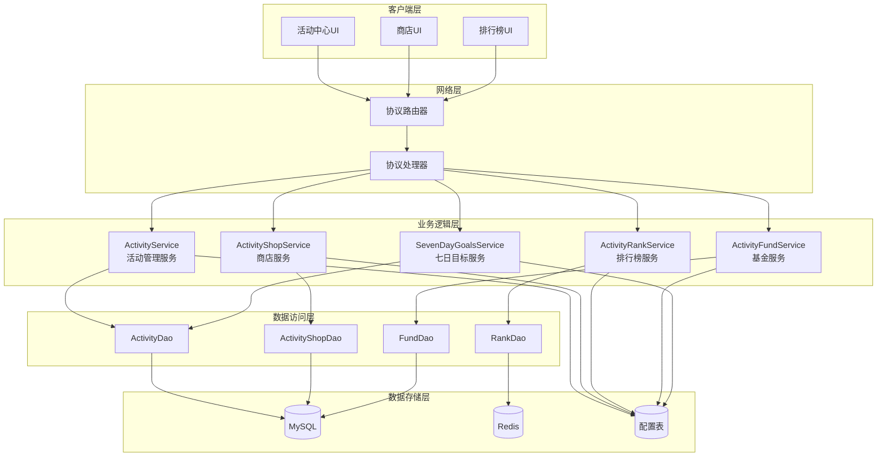
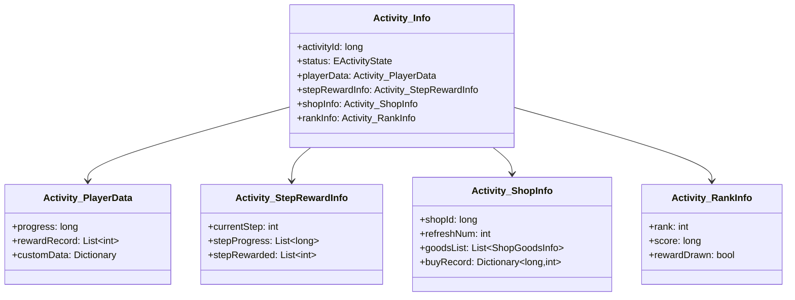
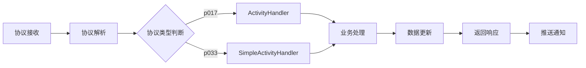
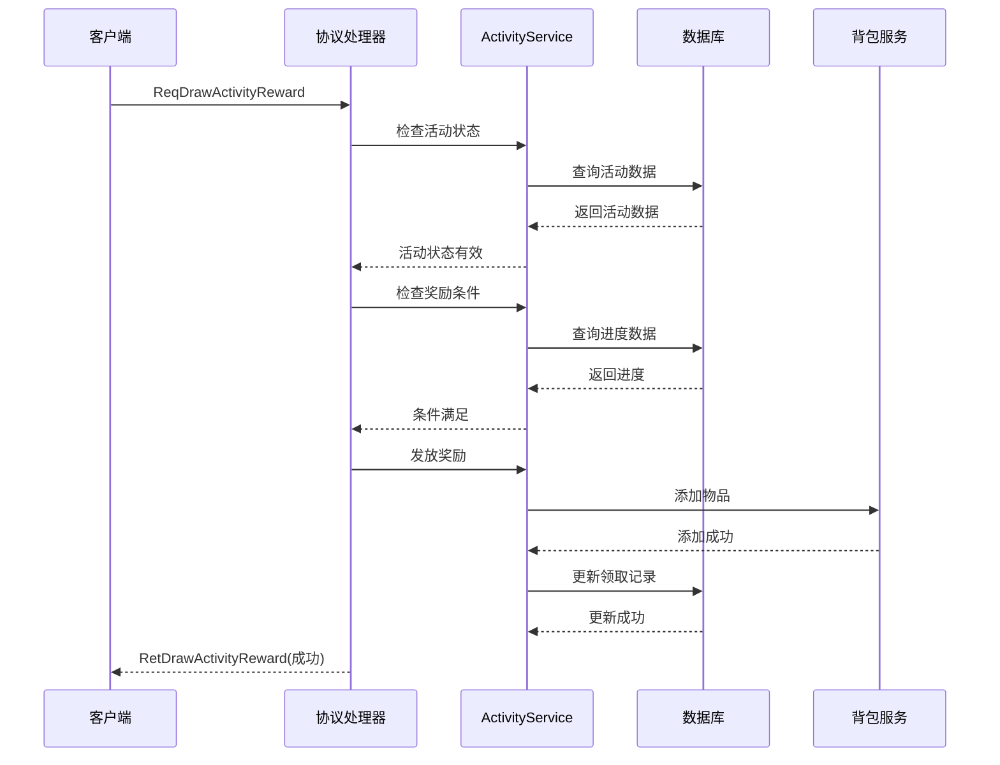
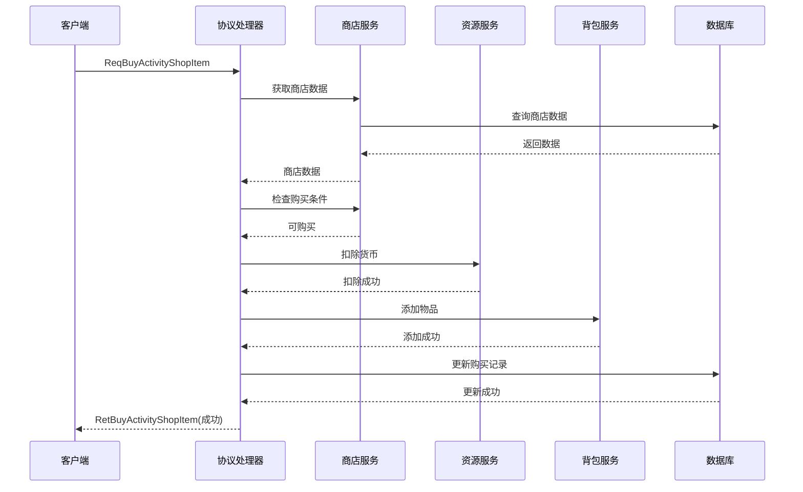
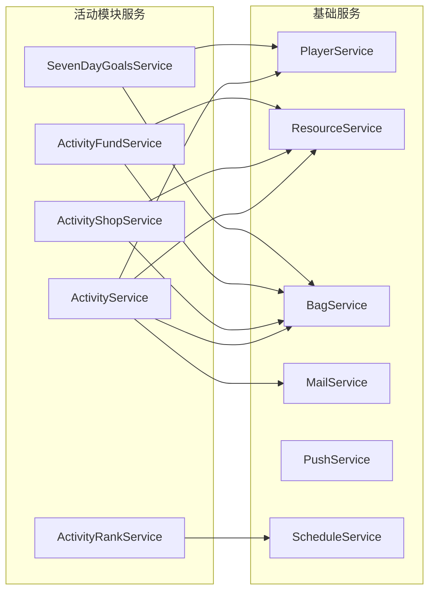

# 活动模块服务端开发文档

## 一、模块架构

### 1.1 模块概述

活动模块（Activity Module）负责管理游戏中各类活动，包括：
- 限时活动管理
- 排行榜活动
- 阶段奖励活动
- 活动商店系统
- 活动基金系统
- 七日目标系统
- 充值返利活动

### 1.2 模块架构图



### 1.3 协议模块编号

协议模块编号: `p017`, `p033`

```csharp
public class ActivityModule : BaseModule
{
    public const byte ACTIVITY_MODULE_ORDER = 17;
    public const byte SIMPLE_ACTIVITY_ORDER = 33;
    
    public override void Register()
    {
        // 注册p017协议
        ProtocolRouter.Register(ACTIVITY_MODULE_ORDER, this);
        
        // 注册p033协议
        ProtocolRouter.Register(SIMPLE_ACTIVITY_ORDER, this);
    }
}
```

---

## 二、核心数据结构

### 2.1 活动信息 (Activity_Info)

**路径**: `ClientProtocol/Common/ActivityObj/Activity_Info.cs`



**完整字段列表**:

| 字段名 | 类型 | 必填 | 说明 | 序列化顺序 |
|--------|------|------|------|------------|
| activityId | long | 是 | 活动ID | 1 |
| status | EActivityState | 是 | 活动状态 | 2 |
| playerData | Activity_PlayerData | 是 | 玩家数据 | 3 |
| stepRewardInfo | Activity_StepRewardInfo | 否 | 阶段奖励信息 | 4 |
| shopInfo | Activity_ShopInfo | 否 | 商店信息 | 5 |
| rankInfo | Activity_RankInfo | 否 | 排行信息 | 6 |

**序列化实现**:

```csharp
public class Activity_Info : ISerializable
{
    public long activityId;
    public EActivityState status;
    public Activity_PlayerData playerData;
    public Activity_StepRewardInfo stepRewardInfo;
    public Activity_ShopInfo shopInfo;
    public Activity_RankInfo rankInfo;
    
    public void Serialize(IWriter writer)
    {
        writer.WriteLong(activityId);
        writer.WriteInt((int)status);
        playerData.Serialize(writer);
        
        if (stepRewardInfo != null)
        {
            writer.WriteBool(true);
            stepRewardInfo.Serialize(writer);
        }
        else
        {
            writer.WriteBool(false);
        }
        
        if (shopInfo != null)
        {
            writer.WriteBool(true);
            shopInfo.Serialize(writer);
        }
        else
        {
            writer.WriteBool(false);
        }
        
        if (rankInfo != null)
        {
            writer.WriteBool(true);
            rankInfo.Serialize(writer);
        }
        else
        {
            writer.WriteBool(false);
        }
    }
    
    public void Deserialize(IReader reader)
    {
        activityId = reader.ReadLong();
        status = (EActivityState)reader.ReadInt();
        playerData = new Activity_PlayerData();
        playerData.Deserialize(reader);
        
        if (reader.ReadBool())
        {
            stepRewardInfo = new Activity_StepRewardInfo();
            stepRewardInfo.Deserialize(reader);
        }
        
        if (reader.ReadBool())
        {
            shopInfo = new Activity_ShopInfo();
            shopInfo.Deserialize(reader);
        }
        
        if (reader.ReadBool())
        {
            rankInfo = new Activity_RankInfo();
            rankInfo.Deserialize(reader);
        }
    }
}
```

---

### 2.2 活动状态枚举 (EActivityState)

**路径**: `ClientProtocol/Common/ActivityEnum/EActivityState.cs`

```csharp
public enum EActivityState
{
    None = 0,           // 无状态
    NotStart = 1,       // 未开始
    InProgress = 2,     // 进行中
    Ended = 3,          // 已结束
    Rewarded = 4,       // 已领奖
    Settled = 5         // 已结算
}

public enum EActivityType
{
    TimeLimited = 1,        // 限时活动
    RechargeAccumulate = 2, // 累计充值
    ConsumeRebate = 3,      // 消费返利
    SevenDayGoals = 4,      // 七日目标
    EarningsGoal = 5,       // 收益目标
    RankActivity = 6        // 排行榜活动
}

public enum EShopRefreshType
{
    None = 0,       // 不刷新
    Daily = 1,      // 每日刷新
    Manual = 2,     // 手动刷新
    Scheduled = 3   // 定时刷新
}
```

---

### 2.3 活动商店信息 (Activity_ShopInfo)

**路径**: `ClientProtocol/Common/ActivityObj/Activity_ShopInfo.cs`

```csharp
public class Activity_ShopInfo : ISerializable
{
    public long shopId;                            // 商店ID
    public int refreshNum;                         // 刷新次数
    public List<ShopGoodsInfo> goodsList;          // 商品列表
    public Dictionary<long, int> buyRecord;        // 购买记录
    
    public void Serialize(IWriter writer)
    {
        writer.WriteLong(shopId);
        writer.WriteInt(refreshNum);
        writer.WriteInt(goodsList.Count);
        foreach (var goods in goodsList)
        {
            goods.Serialize(writer);
        }
        writer.WriteInt(buyRecord.Count);
        foreach (var kvp in buyRecord)
        {
            writer.WriteLong(kvp.Key);
            writer.WriteInt(kvp.Value);
        }
    }
}

public class ShopGoodsInfo : ISerializable
{
    public long itemId;           // 商品槽位ID
    public long itemId;           // 物品ID
    public int itemCount;         // 物品数量
    public int price;             // 价格
    public int boughtCount;       // 已购买数量
    public int buyLimit;          // 购买限制
}
```

---

## 三、协议处理

### 3.1 协议处理器架构



### 3.2 协议注册与路由

```csharp
public class ActivityModule : BaseModule
{
    private ActivityHandler activityHandler;
    private SimpleActivityHandler simpleActivityHandler;
    
    public override void Init()
    {
        activityHandler = new ActivityHandler();
        simpleActivityHandler = new SimpleActivityHandler();
        
        // 注册p017协议处理器
        RegisterHandler<GC2GS_017_001_ReqDrawActivityRankReward>(activityHandler.OnDrawActivityRankReward);
        RegisterHandler<GC2GS_017_002_ReqActivityRankSettleInfo>(activityHandler.OnActivityRankSettleInfo);
        RegisterHandler<GC2GS_017_003_ReqActivityRankBaseList>(activityHandler.OnActivityRankBaseList);
        RegisterHandler<GC2GS_017_011_ReqDrawActivityStepReward>(activityHandler.OnDrawActivityStepReward);
        RegisterHandler<GC2GS_017_013_ReqAKeyDrawActivityStepReward>(activityHandler.OnAKeyDrawActivityStepReward);
        RegisterHandler<GC2GS_017_014_ReqRefreshActivityShop>(activityHandler.OnRefreshActivityShop);
        RegisterHandler<GC2GS_017_015_ReqBuyActivityShopItem>(activityHandler.OnBuyActivityShopItem);
        RegisterHandler<GC2GS_017_018_ReqActivityFundDrawStepReward>(activityHandler.OnActivityFundDrawStepReward);
        RegisterHandler<GC2GS_017_019_ReqActivityFundTaskInfo>(activityHandler.OnActivityFundTaskInfo);
        
        // 注册p033协议处理器
        RegisterHandler<GC2GS_033_001_ReqEarningsGoalInfo>(simpleActivityHandler.OnEarningsGoalInfo);
        RegisterHandler<GC2GS_033_002_ReqEarningsGoalDrawReward>(simpleActivityHandler.OnEarningsGoalDrawReward);
        RegisterHandler<GC2GS_033_003_ReqEarningsGoalDrawHonorReward>(simpleActivityHandler.OnEarningsGoalDrawHonorReward);
        RegisterHandler<GC2GS_033_004_ReqSevenDayGoalsInfo>(simpleActivityHandler.OnSevenDayGoalsInfo);
        RegisterHandler<GC2GS_033_005_ReqSevenDayGoalsDrawReward>(simpleActivityHandler.OnSevenDayGoalsDrawReward);
        RegisterHandler<GC2GS_033_006_ReqSevenDayGoalsDrawStepReward>(simpleActivityHandler.OnSevenDayGoalsDrawStepReward);
        RegisterHandler<GC2GS_033_007_ReqRechargeRebateInfo>(simpleActivityHandler.OnRechargeRebateInfo);
        RegisterHandler<GC2GS_033_008_ReqRechargeRebateDrawReward>(simpleActivityHandler.OnRechargeRebateDrawReward);
    }
}
```

### 3.3 协议处理示例

```csharp
public class ActivityHandler
{
    private ActivityService activityService;
    private ActivityShopService shopService;
    private ActivityRankService rankService;
    
    // 领取排行奖励
    public void OnDrawActivityRankReward(ClientSession session, GC2GS_017_001_ReqDrawActivityRankReward req)
    {
        long playerId = session.playerId;
        
        // 1. 检查活动是否存在
        ActivityRefObj config = RefdataManager.instance.GetActivityConfig(req.activityId);
        if (config == null)
        {
            SendErrorResponse(session, 60001, "活动不存在");
            return;
        }
        
        // 2. 检查活动类型
        if (config.type != (int)EActivityType.RankActivity)
        {
            SendErrorResponse(session, 60001, "非排行榜活动");
            return;
        }
        
        // 3. 检查活动状态
        PlayerActivityData playerData = activityService.GetPlayerActivityData(playerId, req.activityId);
        if (playerData.status != EActivityState.Settled)
        {
            SendErrorResponse(session, 60009, "排名未结算");
            return;
        }
        
        // 4. 检查是否已领取
        if (playerData.rankRewardDrawn)
        {
            SendErrorResponse(session, 60005, "奖励已领取");
            return;
        }
        
        // 5. 获取玩家排名
        int rank = rankService.GetPlayerRank(req.activityId, playerId, req.rankType);
        if (rank <= 0)
        {
            SendErrorResponse(session, 60001, "排名数据异常");
            return;
        }
        
        // 6. 获取排名奖励
        List<RewardInfo> rewards = rankService.GetRankRewards(config, rank);
        
        // 7. 发放奖励
        BagService.AddRewards(playerId, rewards, "活动排行奖励");
        
        // 8. 更新领取状态
        playerData.rankRewardDrawn = true;
        activityService.UpdatePlayerActivityData(playerData);
        
        // 9. 返回成功响应
        GS2GC_017_001_RetDrawActivityRankReward response = new GS2GC_017_001_RetDrawActivityRankReward();
        response.errorCode = 0;
        response.rewardList = rewards;
        response.rankInfo = new RankInfo
        {
            rank = rank,
            playerId = playerId,
            playerName = PlayerService.GetPlayerName(playerId),
            score = rankService.GetPlayerScore(req.activityId, playerId)
        };
        
        session.Send(response);
        
        // 10. 记录日志
        Logger.Info($"玩家{playerId}领取活动{req.activityId}排行奖励, 排名:{rank}");
    }
    
    // 购买活动商店物品
    public void OnBuyActivityShopItem(ClientSession session, GC2GS_017_015_ReqBuyActivityShopItem req)
    {
        long playerId = session.playerId;
        
        // 1. 获取商店配置
        ActivityShopRefObj shopConfig = RefdataManager.instance.GetActivityShopConfig(req.shopId);
        if (shopConfig == null)
        {
            SendErrorResponse(session, 60001, "商店不存在");
            return;
        }
        
        // 2. 检查活动是否有效
        if (!activityService.IsActivityActive(shopConfig.activity_id))
        {
            SendErrorResponse(session, 60003, "活动已结束");
            return;
        }
        
        // 3. 获取商品配置
        var goodsConfig = shopConfig.item_list.FirstOrDefault(g => g.id == req.itemId);
        if (goodsConfig == null)
        {
            SendErrorResponse(session, 60001, "商品不存在");
            return;
        }
        
        // 4. 获取玩家商店数据
        PlayerActivityShop shopData = shopService.GetPlayerShopData(playerId, req.shopId);
        
        // 5. 检查购买次数
        int boughtCount = shopData.buyRecord.GetValueOrDefault(req.itemId, 0);
        if (goodsConfig.buy_limit > 0 && boughtCount + req.count > goodsConfig.buy_limit)
        {
            SendErrorResponse(session, 60008, "商品已售罄");
            return;
        }
        
        // 6. 检查货币
        long totalCost = goodsConfig.price * req.count;
        if (!ResourceService.HasEnoughResource(playerId, shopConfig.currency_type, totalCost))
        {
            SendErrorResponse(session, 60007, "货币不足");
            return;
        }
        
        // 7. 执行购买事务
        using (var transaction = TransactionManager.Begin())
        {
            try
            {
                // 扣除货币
                ResourceService.CostResource(playerId, shopConfig.currency_type, totalCost, "活动商店购买");
                
                // 发放商品
                List<RewardInfo> rewards = new List<RewardInfo>
                {
                    new RewardInfo { itemId = goodsConfig.item_id, count = goodsConfig.item_count * req.count }
                };
                BagService.AddRewards(playerId, rewards, "活动商店购买");
                
                // 更新购买记录
                shopData.buyRecord[req.itemId] = boughtCount + req.count;
                shopService.UpdatePlayerShopData(shopData);
                
                transaction.Commit();
                
                // 返回成功响应
                GS2GC_017_015_RetBuyActivityShopItem response = new GS2GC_017_015_RetBuyActivityShopItem();
                response.errorCode = 0;
                response.boughtCount = boughtCount + req.count;
                response.remainCount = goodsConfig.buy_limit > 0 ? goodsConfig.buy_limit - boughtCount - req.count : -1;
                
                session.Send(response);
            }
            catch (Exception ex)
            {
                transaction.Rollback();
                Logger.Error($"购买商店物品失败: {ex.Message}");
                SendErrorResponse(session, 60000, "购买失败");
            }
        }
    }
}
```

---

## 四、核心逻辑流程

### 4.1 领取活动奖励流程



### 4.2 活动商店购买流程



---

## 五、数据库设计

### 5.1 活动数据表 (player_activity)

```sql
CREATE TABLE `player_activity` (
    `id` BIGINT(20) NOT NULL AUTO_INCREMENT COMMENT '主键',
    `player_id` BIGINT(20) NOT NULL COMMENT '玩家ID',
    `activity_id` BIGINT(20) NOT NULL COMMENT '活动ID',
    `activity_type` INT(11) NOT NULL COMMENT '活动类型',
    `status` INT(11) NOT NULL DEFAULT '0' COMMENT '活动状态',
    `progress` BIGINT(20) NOT NULL DEFAULT '0' COMMENT '当前进度',
    `reward_record` TEXT COMMENT '奖励领取记录(JSON)',
    `custom_data` TEXT COMMENT '自定义数据(JSON)',
    `create_time` DATETIME NOT NULL DEFAULT CURRENT_TIMESTAMP COMMENT '创建时间',
    `update_time` DATETIME NOT NULL DEFAULT CURRENT_TIMESTAMP ON UPDATE CURRENT_TIMESTAMP COMMENT '更新时间',
    PRIMARY KEY (`id`),
    UNIQUE KEY `idx_player_activity` (`player_id`, `activity_id`),
    KEY `idx_activity_id` (`activity_id`),
    KEY `idx_status` (`status`)
) ENGINE=InnoDB DEFAULT CHARSET=utf8mb4 COMMENT='玩家活动数据表';
```

**字段说明**:

| 字段名 | 类型 | 说明 | 示例值 |
|--------|------|------|--------|
| id | BIGINT | 主键 | 1 |
| player_id | BIGINT | 玩家ID | 100001 |
| activity_id | BIGINT | 活动ID | 10001 |
| activity_type | INT | 活动类型 | 1 |
| status | INT | 活动状态 | 2 |
| progress | BIGINT | 当前进度 | 100 |
| reward_record | TEXT | 奖励领取记录(JSON) | [1, 2, 3] |
| custom_data | TEXT | 自定义数据(JSON) | {"score": 5000} |
| create_time | DATETIME | 创建时间 | 2026-04-11 10:00:00 |
| update_time | DATETIME | 更新时间 | 2026-04-11 11:30:00 |

### 5.2 活动商店数据表 (player_activity_shop)

```sql
CREATE TABLE `player_activity_shop` (
    `id` BIGINT(20) NOT NULL AUTO_INCREMENT COMMENT '主键',
    `player_id` BIGINT(20) NOT NULL COMMENT '玩家ID',
    `shop_id` BIGINT(20) NOT NULL COMMENT '商店ID',
    `refresh_num` INT(11) NOT NULL DEFAULT '0' COMMENT '刷新次数',
    `buy_record` TEXT COMMENT '购买记录(JSON)',
    `goods_data` TEXT COMMENT '商品数据(JSON)',
    `create_time` DATETIME NOT NULL DEFAULT CURRENT_TIMESTAMP COMMENT '创建时间',
    `update_time` DATETIME NOT NULL DEFAULT CURRENT_TIMESTAMP ON UPDATE CURRENT_TIMESTAMP COMMENT '更新时间',
    PRIMARY KEY (`id`),
    UNIQUE KEY `idx_player_shop` (`player_id`, `shop_id`),
    KEY `idx_shop_id` (`shop_id`)
) ENGINE=InnoDB DEFAULT CHARSET=utf8mb4 COMMENT='玩家活动商店数据表';
```

**购买记录JSON结构**:

```json
{
  "1001": 2,    // 商品槽位ID: 购买次数
  "1002": 1,
  "1003": 5
}
```

### 5.3 排行榜数据表 (activity_rank)

```sql
CREATE TABLE `activity_rank` (
    `id` BIGINT(20) NOT NULL AUTO_INCREMENT COMMENT '主键',
    `activity_id` BIGINT(20) NOT NULL COMMENT '活动ID',
    `rank_type` INT(11) NOT NULL DEFAULT '1' COMMENT '排行类型',
    `player_id` BIGINT(20) NOT NULL COMMENT '玩家ID',
    `player_name` VARCHAR(64) NOT NULL COMMENT '玩家名称',
    `score` BIGINT(20) NOT NULL DEFAULT '0' COMMENT '分数',
    `update_time` DATETIME NOT NULL DEFAULT CURRENT_TIMESTAMP ON UPDATE CURRENT_TIMESTAMP COMMENT '更新时间',
    PRIMARY KEY (`id`),
    UNIQUE KEY `idx_activity_player` (`activity_id`, `rank_type`, `player_id`),
    KEY `idx_activity_score` (`activity_id`, `rank_type`, `score` DESC)
) ENGINE=InnoDB DEFAULT CHARSET=utf8mb4 COMMENT='活动排行榜数据表';
```

### 5.4 活动基金数据表 (player_activity_fund)

```sql
CREATE TABLE `player_activity_fund` (
    `id` BIGINT(20) NOT NULL AUTO_INCREMENT COMMENT '主键',
    `player_id` BIGINT(20) NOT NULL COMMENT '玩家ID',
    `fund_id` BIGINT(20) NOT NULL COMMENT '基金ID',
    `buy_time` DATETIME NOT NULL COMMENT '购买时间',
    `task_progress` TEXT COMMENT '任务进度(JSON)',
    `step_reward_record` TEXT COMMENT '阶段奖励领取记录(JSON)',
    `status` INT(11) NOT NULL DEFAULT '1' COMMENT '状态(1=进行中,2=已完成)',
    `create_time` DATETIME NOT NULL DEFAULT CURRENT_TIMESTAMP COMMENT '创建时间',
    `update_time` DATETIME NOT NULL DEFAULT CURRENT_TIMESTAMP ON UPDATE CURRENT_TIMESTAMP COMMENT '更新时间',
    PRIMARY KEY (`id`),
    UNIQUE KEY `idx_player_fund` (`player_id`, `fund_id`),
    KEY `idx_fund_id` (`fund_id`)
) ENGINE=InnoDB DEFAULT CHARSET=utf8mb4 COMMENT='玩家活动基金数据表';
```

### 5.5 七日目标数据表 (player_seven_day_goals)

```sql
CREATE TABLE `player_seven_day_goals` (
    `id` BIGINT(20) NOT NULL AUTO_INCREMENT COMMENT '主键',
    `player_id` BIGINT(20) NOT NULL COMMENT '玩家ID',
    `start_time` DATETIME NOT NULL COMMENT '开始时间',
    `current_day` INT(11) NOT NULL DEFAULT '1' COMMENT '当前第几天',
    `goal_progress` TEXT COMMENT '目标进度(JSON)',
    `goal_reward_record` TEXT COMMENT '目标奖励领取记录(JSON)',
    `step_reward_record` TEXT COMMENT '阶段奖励领取记录(JSON)',
    `create_time` DATETIME NOT NULL DEFAULT CURRENT_TIMESTAMP COMMENT '创建时间',
    `update_time` DATETIME NOT NULL DEFAULT CURRENT_TIMESTAMP ON UPDATE CURRENT_TIMESTAMP COMMENT '更新时间',
    PRIMARY KEY (`id`),
    UNIQUE KEY `idx_player` (`player_id`)
) ENGINE=InnoDB DEFAULT CHARSET=utf8mb4 COMMENT='玩家七日目标数据表';
```

---

## 六、服务配置

### 6.1 服务依赖注入

```csharp
public class ActivityModuleServiceProvider : ModuleServiceProvider
{
    public override void RegisterServices(IServiceCollection services)
    {
        // 注册服务
        services.AddSingleton<ActivityService>();
        services.AddSingleton<ActivityShopService>();
        services.AddSingleton<ActivityRankService>();
        services.AddSingleton<ActivityFundService>();
        services.AddSingleton<SevenDayGoalsService>();
        
        // 注册DAO
        services.AddSingleton<ActivityDao>();
        services.AddSingleton<ActivityShopDao>();
        services.AddSingleton<ActivityRankDao>();
        services.AddSingleton<ActivityFundDao>();
        services.AddSingleton<SevenDayGoalsDao>();
        
        // 注册处理器
        services.AddSingleton<ActivityHandler>();
        services.AddSingleton<SimpleActivityHandler>();
    }
}
```

### 6.2 服务配置文件

```json
{
  "Activity": {
    "MaxActiveActivities": 50,
    "ActivityCheckInterval": 60000,
    "RankSettleDelay": 300,
    "ShopRefreshTime": "00:00:00",
    "SevenDayGoalsDuration": 7,
    "CacheExpireTime": 300,
    "EnableActivityLog": true
  },
  "Rank": {
    "RedisKeyPrefix": "activity:rank:",
    "MaxRankListSize": 1000,
    "UpdateInterval": 5000
  },
  "Shop": {
    "MaxRefreshCount": 10,
    "DefaultFreeRefresh": 1,
    "RefreshCostDiamond": 50
  }
}
```

### 6.3 服务依赖关系



---

## 七、定时任务

### 7.1 定时任务配置

```csharp
public class ActivityScheduleTask
{
    private ScheduleService scheduleService;
    private ActivityService activityService;
    private ActivityRankService rankService;
    
    public void Register()
    {
        // 每分钟检查活动状态
        scheduleService.RegisterCronTask("ActivityStatusCheck", "0 * * * * ?", OnActivityStatusCheck);
        
        // 每日0点刷新商店
        scheduleService.RegisterCronTask("ActivityShopRefresh", "0 0 0 * * ?", OnActivityShopRefresh);
        
        // 每小时检查排行榜结算
        scheduleService.RegisterCronTask("ActivityRankSettle", "0 0 * * * ?", OnActivityRankSettle);
        
        // 每日0点更新七日目标
        scheduleService.RegisterCronTask("SevenDayGoalsUpdate", "0 0 0 * * ?", OnSevenDayGoalsUpdate);
    }
    
    // 活动状态检查
    private void OnActivityStatusCheck()
    {
        // 获取所有进行中的活动
        var activeActivities = activityService.GetActiveActivities();
        
        foreach (var activity in activeActivities)
        {
            // 检查活动是否结束
            if (activity.endTime <= DateTimeOffset.UtcNow.ToUnixTimeSeconds())
            {
                // 触发活动结束逻辑
                activityService.OnActivityEnd(activity.id);
            }
        }
    }
    
    // 商店刷新
    private void OnActivityShopRefresh()
    {
        // 获取所有每日刷新的商店
        var dailyShops = RefdataManager.instance.GetAllActivityShopConfigs()
            .Where(s => s.refresh_type == (int)EShopRefreshType.Daily);
        
        foreach (var shop in dailyShops)
        {
            // 重置所有玩家的商店数据
            shopService.ResetPlayerShopData(shop.id);
        }
        
        Logger.Info("活动商店每日刷新完成");
    }
    
    // 排行榜结算
    private void OnActivityRankSettle()
    {
        // 获取需要结算的活动
        var settleActivities = activityService.GetActivitiesNeedSettle();
        
        foreach (var activity in settleActivities)
        {
            // 执行排行榜结算
            rankService.SettleActivityRank(activity.id);
        }
    }
    
    // 七日目标更新
    private void OnSevenDayGoalsUpdate()
    {
        // 更新所有玩家的七日目标天数
        sevenDayGoalsService.UpdateAllPlayersDay();
    }
}
```

---

## 八、错误处理与日志

### 8.1 错误码定义

```csharp
public enum ActivityErrorCode
{
    Success = 0,
    ActivityNotFound = 60001,
    ActivityNotStart = 60002,
    ActivityEnded = 60003,
    ConditionNotMet = 60004,
    RewardAlreadyDrawn = 60005,
    StepNotReached = 60006,
    CurrencyNotEnough = 60007,
    GoodsSoldOut = 60008,
    RankNotSettled = 60009,
    FundNotBought = 60010,
    RefreshLimitReached = 60011,
    InvalidParameter = 60012
}
```

### 8.2 日志记录

```csharp
public class ActivityLogger
{
    // 活动操作日志
    public static void LogActivityOperation(long playerId, long activityId, string operation, bool success)
    {
        Logger.Info($"[Activity] Player:{playerId} Activity:{activityId} Operation:{operation} Success:{success}");
    }
    
    // 奖励发放日志
    public static void LogRewardSend(long playerId, long activityId, List<RewardInfo> rewards, string reason)
    {
        string rewardStr = string.Join(",", rewards.Select(r => $"{r.itemId}x{r.count}"));
        Logger.Info($"[ActivityReward] Player:{playerId} Activity:{activityId} Rewards:{rewardStr} Reason:{reason}");
    }
    
    // 商店购买日志
    public static void LogShopBuy(long playerId, long shopId, long itemId, int count, int cost)
    {
        Logger.Info($"[ActivityShop] Player:{playerId} Shop:{shopId} Item:{itemId} Count:{count} Cost:{cost}");
    }
    
    // 错误日志
    public static void LogError(long playerId, string operation, int errorCode, string errorMsg)
    {
        Logger.Error($"[ActivityError] Player:{playerId} Operation:{operation} ErrorCode:{errorCode} Msg:{errorMsg}");
    }
}
```

---

*文档生成时间: 2026-04-11*
*最后更新: 2026-04-11*
