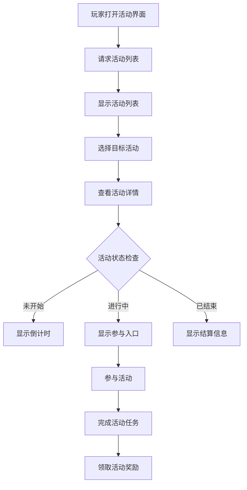
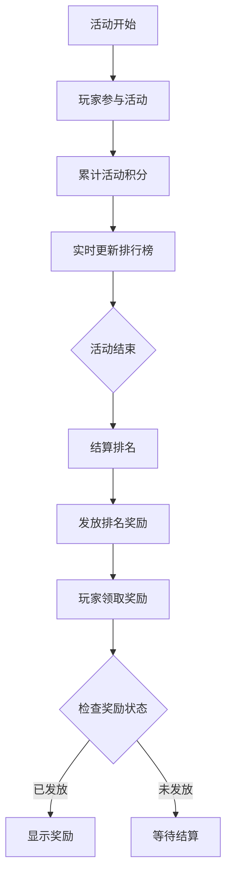
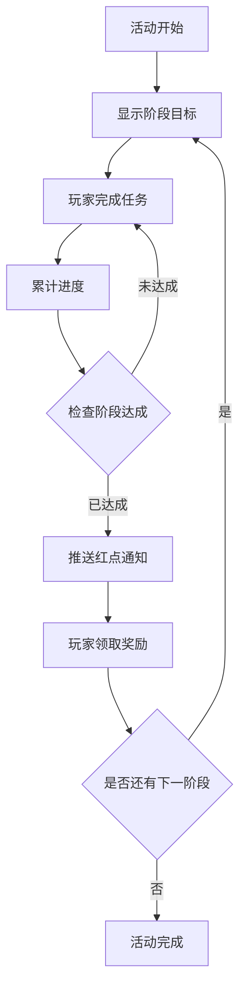
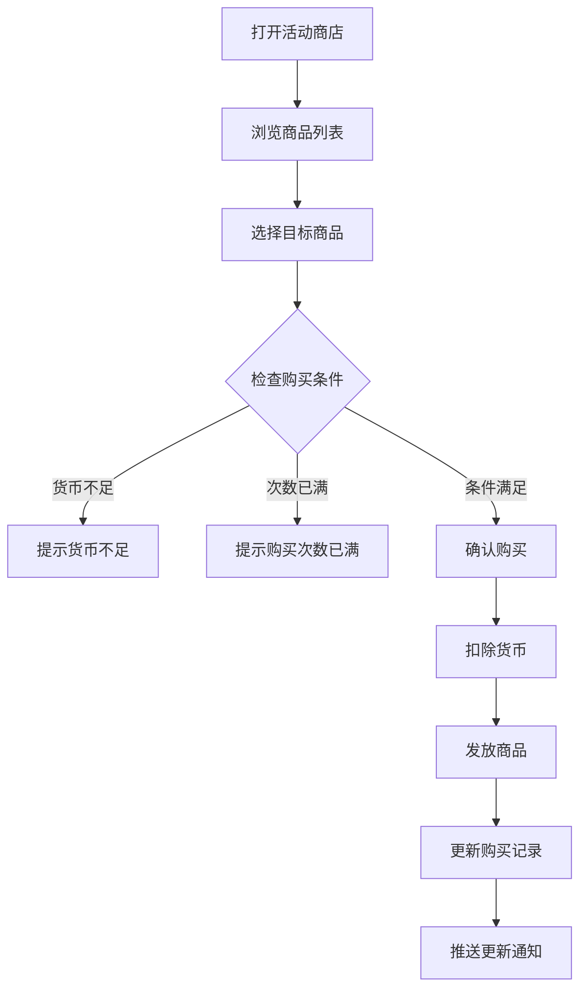
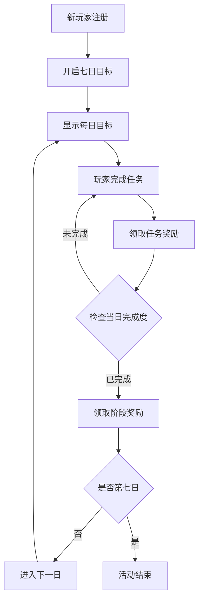

# 活动模块完整说明

## 一、模块概述

### 1.1 业务背景

活动模块是游戏运营的核心系统，负责管理各类限时活动、排行榜活动、阶段奖励活动等。通过丰富的活动形式，提升玩家活跃度和留存率，同时为玩家提供额外奖励获取途径。

### 1.2 目标用户

- **所有游戏玩家**：参与各类活动获取奖励
- **活跃玩家**：完成活动任务获得更多收益
- **付费玩家**：参与充值返利、基金等活动
- **运营人员**：配置和监控活动数据

### 1.3 核心价值

1. **活跃促进**：通过限时活动提升玩家活跃度
2. **收益提升**：活动奖励激励玩家持续游戏
3. **付费转化**：基金、充值返利等活动促进付费
4. **社交互动**：组队活动增强社交体验

---

## 二、功能清单

### 2.1 活动管理功能

| 功能名称 | 功能描述 | 用户价值 |
|---------|---------|---------|
| 活动列表 | 查看当前进行中的所有活动 | 了解活动信息 |
| 活动详情 | 查看活动详细规则和奖励 | 明确活动目标 |
| 活动状态 | 显示活动进行状态 | 把握活动时间 |
| 活动提醒 | 活动开始/结束提醒 | 不错过活动 |

### 2.2 活动类型功能

| 功能名称 | 功能描述 | 用户价值 |
|---------|---------|---------|
| 限时活动 | 特定时间段开放的活动 | 紧迫感刺激参与 |
| 排行榜活动 | 根据排名发放奖励 | 竞争激励 |
| 阶段奖励 | 达成阶段目标领取奖励 | 分阶段激励 |
| 七日目标 | 新玩家七日成长目标 | 引导新玩家成长 |
| 收益目标 | 累计收益达成奖励 | 持续游戏激励 |

### 2.3 活动商店功能

| 功能名称 | 功能描述 | 用户价值 |
|---------|---------|---------|
| 商品浏览 | 查看商店可购买商品 | 了解兑换内容 |
| 商品购买 | 消耗活动货币购买商品 | 获取所需物品 |
| 商店刷新 | 刷新商品列表 | 获取新商品 |
| 购买记录 | 查看已购买商品 | 购买历史 |

### 2.4 活动基金功能

| 功能名称 | 功能描述 | 用户价值 |
|---------|---------|---------|
| 基金购买 | 购买活动基金 | 投资回报 |
| 任务完成 | 完成基金任务 | 获取返利 |
| 阶段奖励 | 根据任务进度领奖 | 高性价比奖励 |

### 2.5 充值返利功能

| 功能名称 | 功能描述 | 用户价值 |
|---------|---------|---------|
| 返利信息 | 查看充值返利规则 | 了解返利内容 |
| 返利领取 | 领取充值返利奖励 | 获取额外奖励 |

---

## 三、业务流程详解

### 3.1 活动参与流程



**详细步骤说明**：

1. **活动浏览**
   - 打开活动中心界面
   - 加载当前活动列表
   - 显示活动状态和剩余时间

2. **活动详情**
   - 点击活动查看详情
   - 显示活动规则和奖励
   - 显示当前进度

3. **参与活动**
   - 检查参与条件
   - 进入活动玩法
   - 完成活动任务

### 3.2 排行榜活动流程



**详细步骤说明**：

1. **积分累计**
   - 完成活动任务获得积分
   - 实时更新排行榜数据
   - 显示当前排名

2. **结算流程**
   - 活动结束时锁定数据
   - 计算最终排名
   - 发放排名奖励

### 3.3 阶段奖励流程



### 3.4 活动商店购买流程



### 3.5 七日目标流程



---

## 四、关键规则

### 4.1 活动时间规则

1. **时间配置**
   - 开始时间：活动正式开始时间
   - 结束时间：活动正式结束时间
   - 展示时间：活动结束后的展示时间

2. **状态判定**
   - 未开始：当前时间 < 开始时间
   - 进行中：开始时间 <= 当前时间 < 结束时间
   - 已结束：当前时间 >= 结束时间

### 4.2 活动参与规则

1. **条件限制**
   - 等级限制：最低参与等级
   - VIP限制：部分活动需达到VIP等级
   - 次数限制：每日参与次数上限

2. **跨服活动**
   - 需要跨服服务器支持
   - 数据跨服同步

### 4.3 奖励规则

1. **奖励发放**
   - 即时发放：完成任务立即获得
   - 手动领取：需玩家主动领取
   - 邮件发放：活动结束统一发放

2. **奖励限制**
   - 每个奖励限领一次
   - 部分奖励有有效期

### 4.4 活动商店规则

1. **货币规则**
   - 活动专用货币
   - 货币在活动结束时清空

2. **购买规则**
   - 每个商品有购买次数限制
   - 刷新会重置购买次数

---

## 五、用户故事

### 5.1 新玩家故事

> 作为一名新玩家，我进入游戏后看到了七日目标活动。每天都有明确的任务目标，完成任务可以获得丰厚奖励。我按照引导完成了第一天的所有任务，领取了阶段奖励，感觉游戏对新玩家非常友好。

### 5.2 活跃玩家故事

> 作为一名活跃玩家，我每天都关注活动中心。本周有一个排行榜活动，我努力完成任务提升排名。活动结束时，我获得了前十名的奖励，包含稀有英雄碎片，非常有成就感。

### 5.3 付费玩家故事

> 作为一名付费玩家，我购买了活动基金。完成基金任务可以获得数倍返还，性价比很高。充值返利活动也让我额外获得了不少钻石，非常划算。

---

## 六、示例

### 6.1 活动信息示例

**活动配置**：
```
活动ID: 10001
活动名称: 春节狂欢
类型: 阶段奖励活动
开始时间: 2026-02-01 00:00:00
结束时间: 2026-02-07 23:59:59
参与条件: 等级 >= 10
```

**阶段目标**：
```
阶段1: 登录1天, 奖励银两×1000
阶段2: 登录3天, 奖励钻石×100
阶段3: 登录5天, 奖励稀有英雄碎片×10
阶段4: 登录7天, 奖励限定称号
```

### 6.2 排行榜活动示例

**活动数据**：
```
活动名称: 战力冲刺
排名规则: 按战力降序排列
奖励配置:
  - 第1名: 传说英雄×1, 钻石×1000
  - 第2-3名: 史诗英雄×1, 钻石×500
  - 第4-10名: 精英英雄×1, 钻石×200
  - 第11-50名: 钻石×100
  - 第51-100名: 钻石×50
```

**玩家数据**：
```
当前排名: 15名
当前战力: 58,000
距离下一奖励: 差5名
```

### 6.3 活动商店示例

**商店配置**：
```
商店ID: 20001
货币类型: 活动积分
刷新次数: 每日1次免费

商品列表:
  - 稀有英雄碎片×5, 价格: 100积分, 限购: 2
  - 钻石×100, 价格: 50积分, 限购: 5
  - 体力药水×1, 价格: 20积分, 限购: 10
```

**玩家数据**：
```
当前积分: 350
今日已购: 钻石×100 (1次)
商店状态: 可继续购买
```

---

*文档生成时间: 2026-04-07*
