# 活动模块完整说明

## 一、模块概述

### 1.1 业务背景

活动模块是游戏运营的核心系统，负责管理各类限时活动、排行榜活动、阶段奖励活动等。通过丰富的活动形式，提升玩家活跃度和留存率，同时为玩家提供额外奖励获取途径。

### 1.2 目标用户

- **所有游戏玩家**：参与各类活动获取奖励
- **活跃玩家**：完成活动任务获得更多收益
- **付费玩家**：参与充值返利、基金等活动
- **运营人员**：配置和监控活动数据

### 1.3 核心价值

1. **活跃促进**：通过限时活动提升玩家活跃度
2. **收益提升**：活动奖励激励玩家持续游戏
3. **付费转化**：基金、充值返利等活动促进付费
4. **社交互动**：组队活动增强社交体验

### 1.4 系统架构图

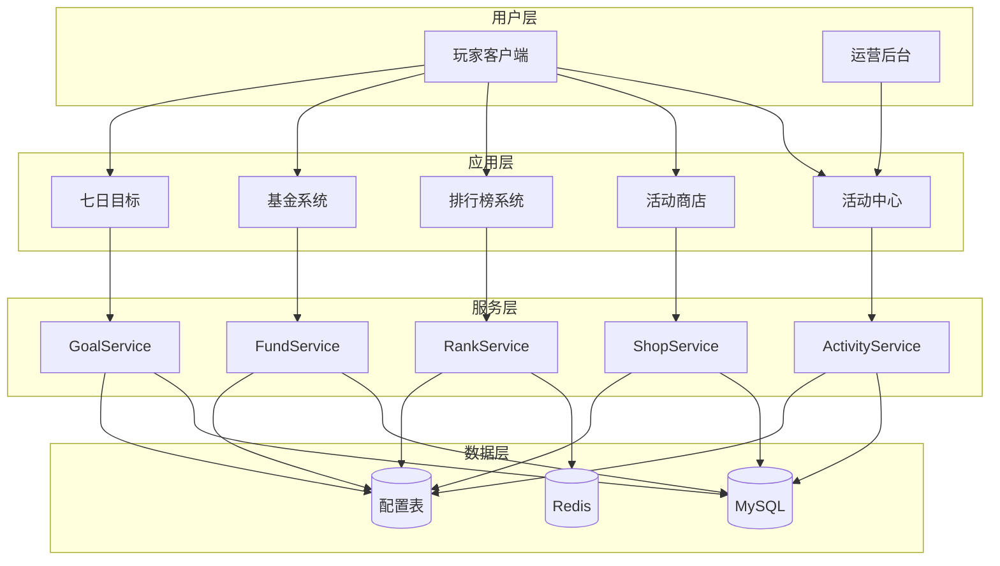

---

## 二、功能清单

### 2.1 活动管理功能

| 功能名称 | 功能描述 | 用户价值 | 优先级 |
|---------|---------|---------|--------|
| 活动列表 | 查看当前进行中的所有活动 | 了解活动信息 | P0 |
| 活动详情 | 查看活动详细规则和奖励 | 明确活动目标 | P0 |
| 活动状态 | 显示活动进行状态 | 把握活动时间 | P0 |
| 活动提醒 | 活动开始/结束提醒 | 不错过活动 | P1 |
| 活动筛选 | 按类型筛选活动 | 快速找到目标活动 | P2 |
| 活动搜索 | 搜索活动名称 | 快速定位活动 | P2 |

### 2.2 活动类型功能

| 功能名称 | 功能描述 | 用户价值 | 活动类型ID |
|---------|---------|---------|-----------|
| 限时活动 | 特定时间段开放的活动 | 紧迫感刺激参与 | 1 |
| 累计充值活动 | 累计充值达目标领奖 | 付费激励 | 2 |
| 消费返利活动 | 消费获得返利 | 消费激励 | 3 |
| 七日目标活动 | 新玩家七日成长目标 | 引导新玩家成长 | 4 |
| 收益目标活动 | 累计收益达成奖励 | 持续游戏激励 | 5 |
| 排行榜活动 | 根据排名发放奖励 | 竞争激励 | 6 |

### 2.3 活动商店功能

| 功能名称 | 功能描述 | 用户价值 | 实现状态 |
|---------|---------|---------|---------|
| 商品浏览 | 查看商店可购买商品 | 了解兑换内容 | ✅ |
| 商品购买 | 消耗活动货币购买商品 | 获取所需物品 | ✅ |
| 商店刷新 | 刷新商品列表 | 获取新商品 | ✅ |
| 购买记录 | 查看已购买商品 | 购买历史 | ✅ |
| 商品推荐 | 推荐高性价比商品 | 快速决策 | P2 |
| 一键购买 | 一键购买所需商品 | 提升效率 | P2 |

### 2.4 活动基金功能

| 功能名称 | 功能描述 | 用户价值 | 实现状态 |
|---------|---------|---------|---------|
| 基金购买 | 购买活动基金 | 投资回报 | ✅ |
| 任务完成 | 完成基金任务 | 获取返利 | ✅ |
| 阶段奖励 | 根据任务进度领奖 | 高性价比奖励 | ✅ |
| 进度查看 | 查看基金完成进度 | 了解收益情况 | ✅ |

### 2.5 充值返利功能

| 功能名称 | 功能描述 | 用户价值 | 实现状态 |
|---------|---------|---------|---------|
| 返利信息 | 查看充值返利规则 | 了解返利内容 | ✅ |
| 返利领取 | 领取充值返利奖励 | 获取额外奖励 | ✅ |
| 返利计算 | 显示返利金额计算 | 透明化奖励 | P2 |

---

## 三、业务流程详解

### 3.1 活动参与完整流程

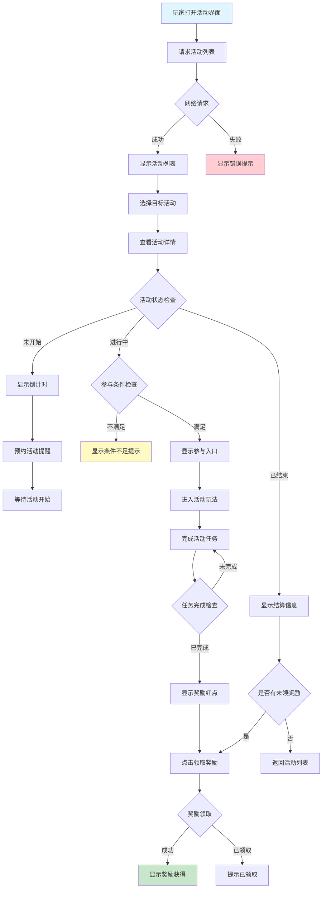

**详细步骤说明**：

1. **活动浏览**
   - 打开活动中心界面
   - 加载当前活动列表
   - 显示活动状态和剩余时间
   - 按优先级和类型排序展示

2. **活动详情**
   - 点击活动查看详情
   - 显示活动规则和奖励
   - 显示当前进度
   - 显示参与按钮

3. **参与活动**
   - 检查参与条件
   - 进入活动玩法
   - 完成活动任务
   - 实时更新进度

4. **领取奖励**
   - 完成任务后显示红点
   - 点击领取按钮
   - 发放奖励物品
   - 显示奖励获得动画

### 3.2 排行榜活动完整流程

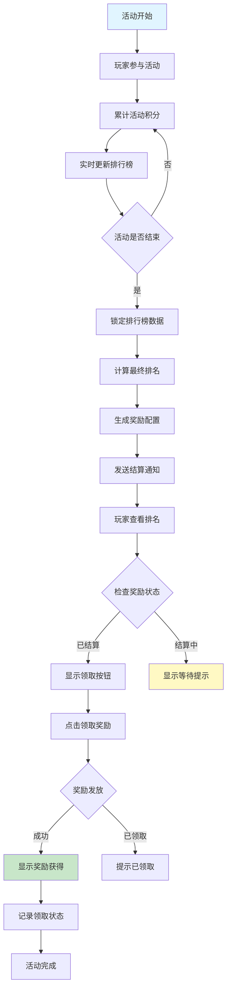

**详细步骤说明**：

1. **积分累计**
   - 完成活动任务获得积分
   - 实时更新排行榜数据
   - 显示当前排名
   - 显示排名变化

2. **结算流程**
   - 活动结束时锁定数据
   - 计算最终排名
   - 匹配奖励档位
   - 发送结算通知

3. **奖励领取**
   - 玩家查看最终排名
   - 点击领取按钮
   - 发放排名奖励
   - 记录领取状态

### 3.3 阶段奖励完整流程

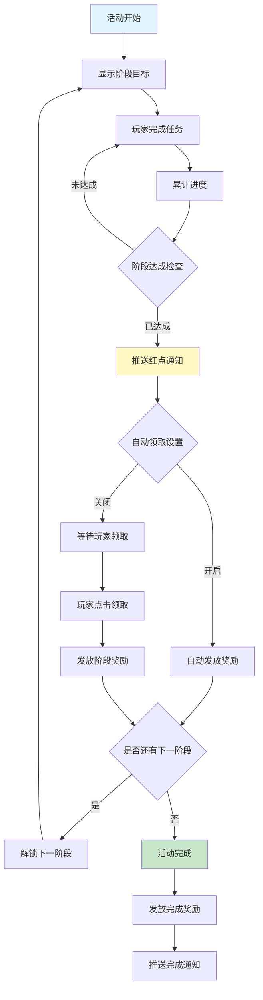

### 3.4 活动商店购买完整流程

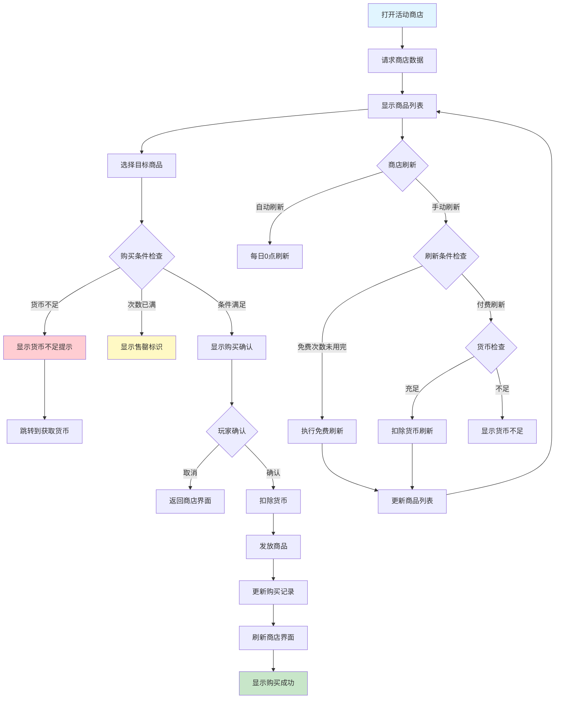

### 3.5 七日目标完整流程

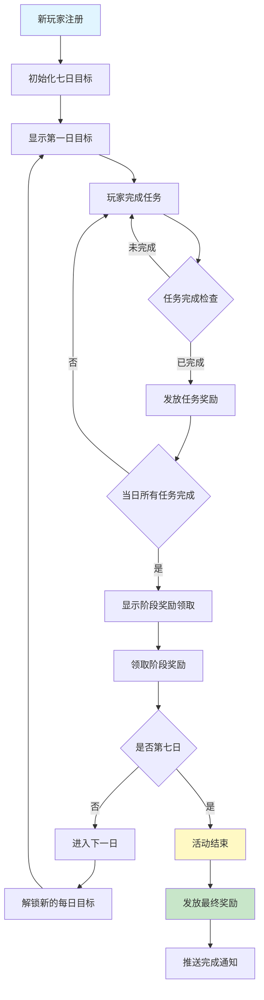

**每日任务类型**：

| 天数 | 任务类型 | 任务描述 | 奖励 |
|------|----------|----------|------|
| Day1 | 登录、战斗 | 累计登录1次，完成1场战斗 | 钻石×100 |
| Day2 | 升级、招募 | 角色达到5级，招募1个英雄 | 金币×1000 |
| Day3 | 副本、装备 | 通关5个副本，装备3件装备 | 装备箱×1 |
| Day4 | 社交、公会 | 添加1个好友，加入公会 | 公会币×50 |
| Day5 | 竞技、排名 | 参与3场竞技场，进入前100名 | 钻石×200 |
| Day6 | 消费、充值 | 消费100钻石或充值任意金额 | 返利券×1 |
| Day7 | 综合目标 | 完成所有前置目标 | 限定称号 |

---

## 四、关键规则

### 4.1 活动时间规则

#### 时间配置

| 时间类型 | 说明 | 示例 |
|----------|------|------|
| 开始时间 | 活动正式开始时间 | 2026-04-01 00:00:00 |
| 结束时间 | 活动正式结束时间 | 2026-04-07 23:59:59 |
| 展示时间 | 活动结束后的展示时间 | 2026-04-08 23:59:59 |
| 预热时间 | 活动开始前的预热时间 | 2026-03-31 00:00:00 |

#### 状态判定规则

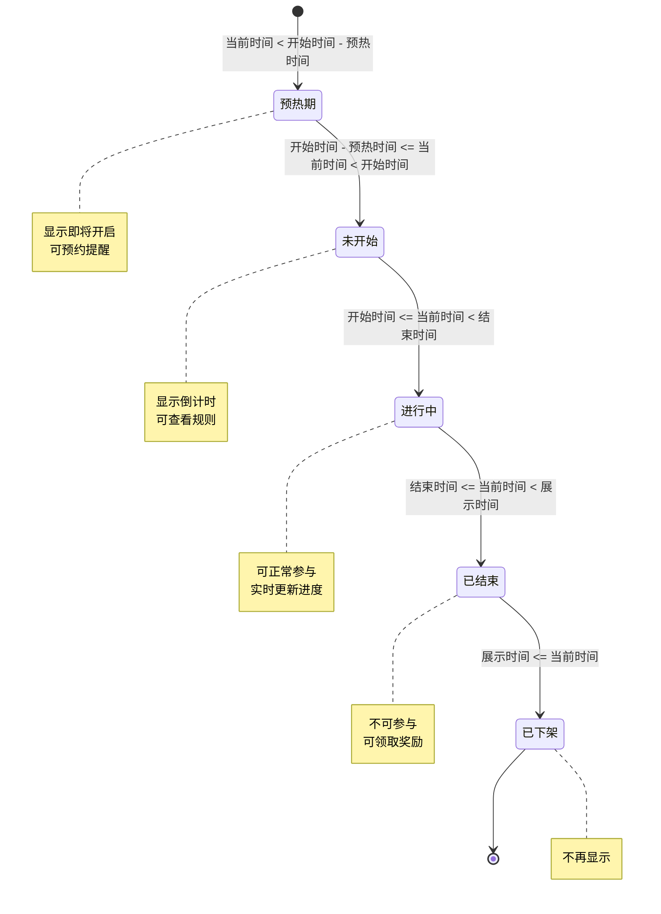

### 4.2 活动参与规则

#### 条件限制

| 条件类型 | 说明 | 检查方式 |
|----------|------|----------|
| 等级限制 | 最低参与等级 | 实时检查玩家等级 |
| VIP限制 | 部分活动需达到VIP等级 | 实时检查VIP等级 |
| 次数限制 | 每日参与次数上限 | 重置每日计数器 |
| 任务前置 | 需完成特定任务 | 检查任务完成状态 |
| 物品要求 | 需要特定物品 | 检查背包物品数量 |

#### 跨服活动规则

```csharp
public bool CheckCrossServerCondition(long playerId, ActivityConfig config)
{
    // 检查是否跨服活动
    if (!config.is_cross_server)
    {
        return true;
    }
    
    // 检查服务器状态
    if (!CrossServerManager.IsServerConnected())
    {
        return false;
    }
    
    // 检查玩家跨服资格
    PlayerCrossServerData crossData = CrossServerManager.GetPlayerCrossData(playerId);
    if (crossData == null || crossData.isBanned)
    {
        return false;
    }
    
    return true;
}
```

### 4.3 奖励规则

#### 奖励发放方式

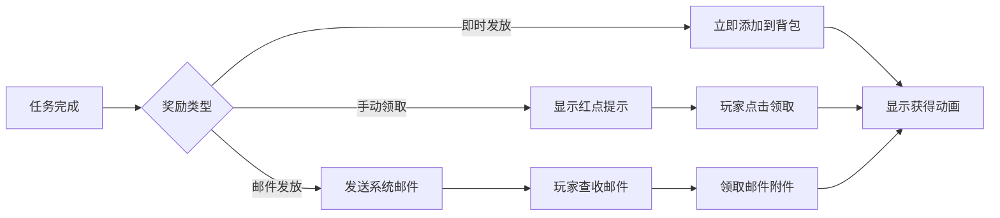

#### 奖励限制规则

| 限制类型 | 说明 | 示例 |
|----------|------|------|
| 领取次数 | 每个奖励限领一次 | 排名奖励只能领一次 |
| 有效期 | 部分奖励有有效期 | 活动道具7天后过期 |
| 叠加上限 | 道具叠加上限限制 | 某道具最多99个 |
| 容量限制 | 背包容量限制 | 背包满时转邮件 |

### 4.4 活动商店规则

#### 货币规则

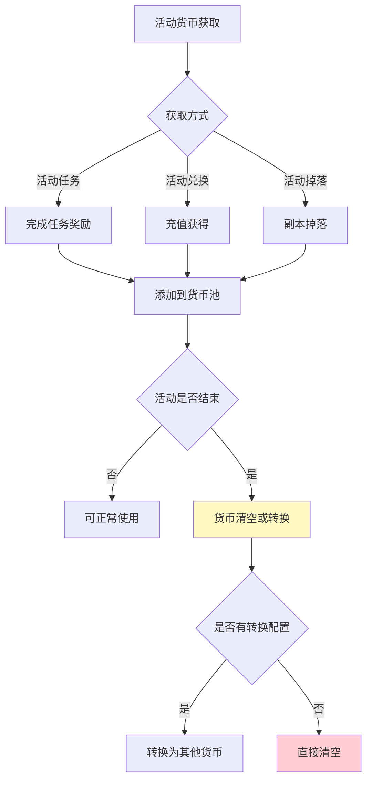

#### 购买规则

| 规则类型 | 说明 | 实现方式 |
|----------|------|----------|
| 购买次数限制 | 每个商品有购买次数上限 | 记录购买计数 |
| 刷新重置 | 刷新会重置购买次数 | 清空购买记录 |
| 折扣限制 | 折扣有生效时间 | 检查折扣时间 |
| 库存限制 | 部分商品有总库存 | 全服库存计数 |

---

## 五、数据模型

### 5.1 核心数据模型

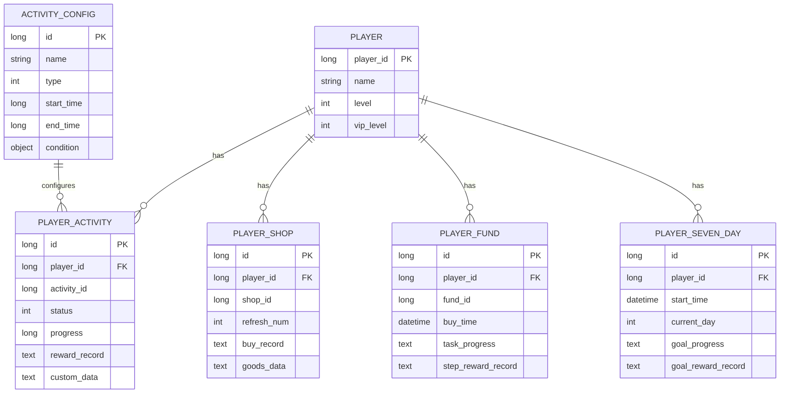

### 5.2 数据流转图

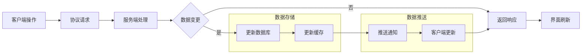

---

## 六、性能优化

### 6.1 缓存策略

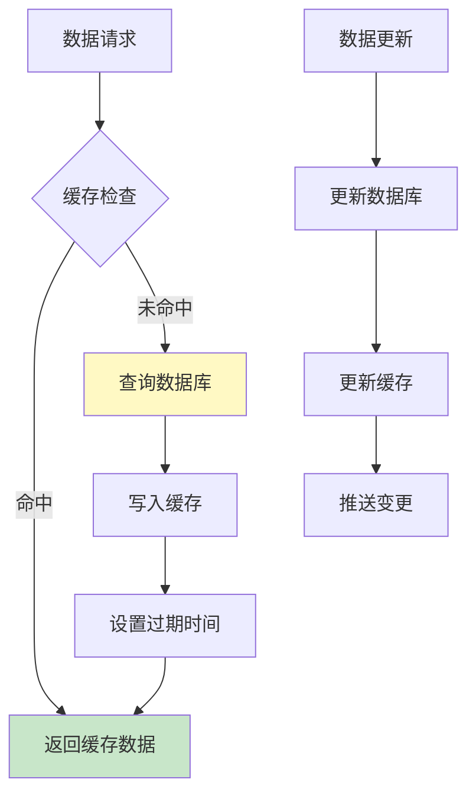

#### 缓存配置

```csharp
public class ActivityCacheConfig
{
    // 活动列表缓存时间（秒）
    public int ActivityListCacheTime = 300;
    
    // 活动详情缓存时间（秒）
    public int ActivityDetailCacheTime = 600;
    
    // 排行榜缓存时间（秒）
    public int RankListCacheTime = 60;
    
    // 商店数据缓存时间（秒）
    public int ShopDataCacheTime = 180;
    
    // 缓存最大数量
    public int MaxCacheCount = 10000;
}
```

### 6.2 数据库优化

#### 索引设计

```sql
-- 活动数据表索引
CREATE INDEX idx_player_activity ON player_activity(player_id, activity_id);
CREATE INDEX idx_activity_status ON player_activity(activity_id, status);

-- 排行榜表索引
CREATE INDEX idx_rank_score ON activity_rank(activity_id, rank_type, score DESC);

-- 商店数据表索引
CREATE INDEX idx_player_shop ON player_activity_shop(player_id, shop_id);
```

#### 分表策略

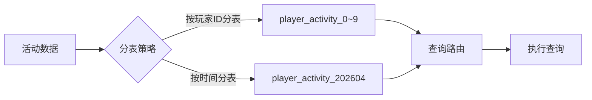

### 6.3 并发控制

```csharp
public class ActivityConcurrencyManager
{
    private static readonly object lockObj = new object();
    private static readonly ConcurrentDictionary<long, SemaphoreSlim> playerLocks = 
        new ConcurrentDictionary<long, SemaphoreSlim>();
    
    // 获取玩家锁
    public static async Task<bool> AcquirePlayerLock(long playerId, int timeoutMs = 5000)
    {
        var semaphore = playerLocks.GetOrAdd(playerId, _ => new SemaphoreSlim(1, 1));
        return await semaphore.WaitAsync(timeoutMs);
    }
    
    // 释放玩家锁
    public static void ReleasePlayerLock(long playerId)
    {
        if (playerLocks.TryGetValue(playerId, out var semaphore))
        {
            semaphore.Release();
        }
    }
    
    // 使用锁执行操作
    public static async Task<T> ExecuteWithLock<T>(long playerId, Func<Task<T>> action)
    {
        if (!await AcquirePlayerLock(playerId))
        {
            throw new Exception("获取玩家锁超时");
        }
        
        try
        {
            return await action();
        }
        finally
        {
            ReleasePlayerLock(playerId);
        }
    }
}
```

---

## 七、监控与告警

### 7.1 监控指标

| 指标名称 | 说明 | 阈值 | 告警级别 |
|----------|------|------|----------|
| 活动参与人数 | 当前活动参与玩家数 | <1000 | Warning |
| 奖励发放失败率 | 奖励发放失败的比例 | >1% | Error |
| 排行榜结算时间 | 排行榜结算耗时 | >10s | Warning |
| 商店购买QPS | 商店购买请求频率 | >1000/s | Info |
| 活动接口响应时间 | 接口平均响应时间 | >500ms | Warning |

### 7.2 监控面板

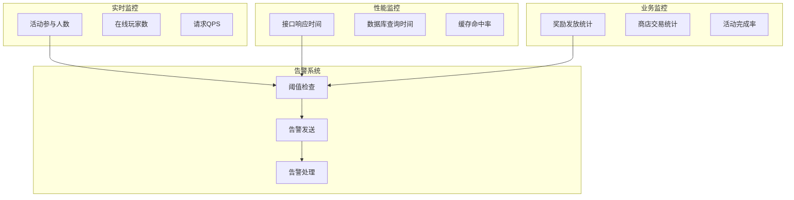

---

## 八、用户故事

### 8.1 新玩家故事

> 作为一名新玩家，我进入游戏后看到了七日目标活动。每天都有明确的任务目标，完成任务可以获得丰厚奖励。我按照引导完成了第一天的所有任务，领取了阶段奖励，感觉游戏对新玩家非常友好。

**关键点**：
- 引导清晰，目标明确
- 奖励丰厚，反馈及时
- 循序渐进，降低门槛

### 8.2 活跃玩家故事

> 作为一名活跃玩家，我每天都关注活动中心。本周有一个排行榜活动，我努力完成任务提升排名。活动结束时，我获得了前十名的奖励，包含稀有英雄碎片，非常有成就感。

**关键点**：
- 竞争机制激励参与
- 排名实时更新
- 奖励差异明显

### 8.3 付费玩家故事

> 作为一名付费玩家，我购买了活动基金。完成基金任务可以获得数倍返还，性价比很高。充值返利活动也让我额外获得了不少钻石，非常划算。

**关键点**：
- 高性价比，激励付费
- 任务简单易完成
- 返利透明可见

---

## 九、示例

### 9.1 活动信息示例

**活动配置**：
```
活动ID: 10001
活动名称: 春节狂欢
类型: 阶段奖励活动
开始时间: 2026-02-01 00:00:00
结束时间: 2026-02-07 23:59:59
参与条件: 等级 >= 10
```

**阶段目标**：
```
阶段1: 登录1天, 奖励银两×1000
阶段2: 登录3天, 奖励钻石×100
阶段3: 登录5天, 奖励稀有英雄碎片×10
阶段4: 登录7天, 奖励限定称号
```

**玩家进度**：
```
当前进度: 登录4天
当前阶段: 阶段2（已完成）
可领取奖励: 阶段2奖励
下一目标: 阶段3（登录5天）
```

### 9.2 排行榜活动示例

**活动数据**：
```
活动名称: 战力冲刺
排名规则: 按战力降序排列
奖励配置:
  - 第1名: 传说英雄×1, 钻石×1000
  - 第2-3名: 史诗英雄×1, 钻石×500
  - 第4-10名: 精英英雄×1, 钻石×200
  - 第11-50名: 钻石×100
  - 第51-100名: 钻石×50
```

**玩家数据**：
```
当前排名: 15名
当前战力: 58,000
距离下一奖励: 差5名
预计奖励: 钻石×100
```

### 9.3 活动商店示例

**商店配置**：
```
商店ID: 20001
货币类型: 活动积分
刷新次数: 每日1次免费

商品列表:
  - 稀有英雄碎片×5, 价格: 100积分, 限购: 2
  - 钻石×100, 价格: 50积分, 限购: 5
  - 体力药水×1, 价格: 20积分, 限购: 10
```

**玩家数据**：
```
当前积分: 350
今日已购: 钻石×100 (1次)
商店状态: 可继续购买
```

---

## 十、扩展性设计

### 10.1 新活动类型扩展

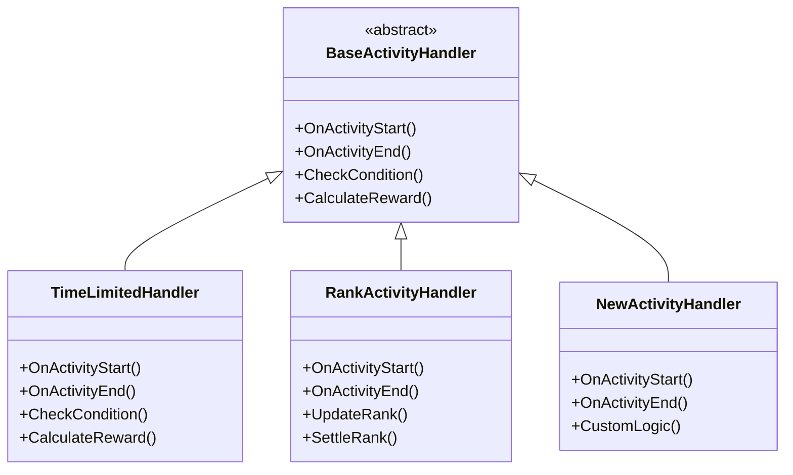

### 10.2 配置扩展

```json
{
  "activity_type": 7,
  "activity_name": "新活动类型",
  "handler_class": "NewActivityHandler",
  "custom_fields": {
    "field1": "value1",
    "field2": "value2"
  }
}
```

---

*文档生成时间: 2026-04-11*
*最后更新: 2026-04-11*
