# 活动模块实现细节

## 一、计算公式

### 1.1 活动状态计算公式

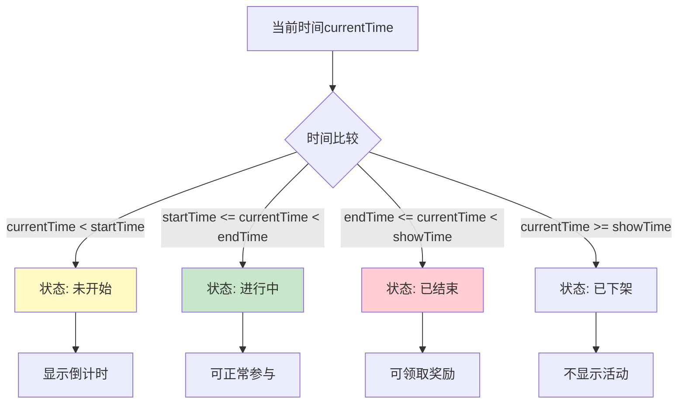

**状态计算伪代码**:

```csharp
public ActivityState CalculateActivityState(ActivityConfig config, long currentTime)
{
    // 检查预热期
    if (currentTime < config.start_time - config.warm_up_time)
    {
        return ActivityState.Hidden;
    }
    
    // 检查预热展示
    if (currentTime < config.start_time)
    {
        return ActivityState.WarmUp;
    }
    
    // 检查进行中
    if (currentTime < config.end_time)
    {
        return ActivityState.InProgress;
    }
    
    // 检查展示期
    if (currentTime < config.show_time)
    {
        return ActivityState.Ended;
    }
    
    return ActivityState.Removed;
}

// 剩余时间计算
public long CalculateRemainingTime(ActivityConfig config, long currentTime)
{
    if (currentTime >= config.end_time)
    {
        return 0;
    }
    
    return config.end_time - currentTime;
}

// 格式化时间显示
public string FormatRemainingTime(long seconds)
{
    if (seconds <= 0)
    {
        return "已结束";
    }
    
    int days = (int)(seconds / 86400);
    int hours = (int)((seconds % 86400) / 3600);
    int minutes = (int)((seconds % 3600) / 60);
    int secs = (int)(seconds % 60);
    
    if (days > 0)
    {
        return $"{days}天{hours}小时";
    }
    else if (hours > 0)
    {
        return $"{hours}小时{minutes}分钟";
    }
    else if (minutes > 0)
    {
        return $"{minutes}分钟{secs}秒";
    }
    else
    {
        return $"{secs}秒";
    }
}
```

### 1.2 排行榜排名计算公式

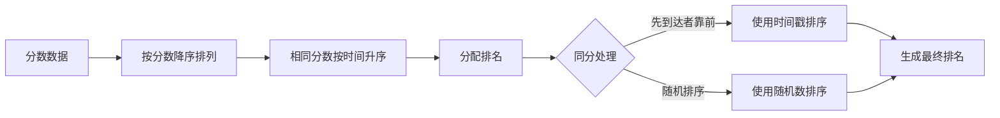

**排名计算伪代码**:

```csharp
public class RankCalculator
{
    // 计算排名
    public List<RankInfo> CalculateRank(List<RankData> dataList)
    {
        // 按分数降序、时间升序排序
        var sortedList = dataList
            .OrderByDescending(d => d.score)
            .ThenBy(d => d.updateTime)
            .ToList();
        
        // 分配排名
        for (int i = 0; i < sortedList.Count; i++)
        {
            sortedList[i].rank = i + 1;
        }
        
        // 处理同分情况
        AdjustSameScoreRank(sortedList);
        
        return sortedList;
    }
    
    // 调整同分排名
    private void AdjustSameScoreRank(List<RankInfo> rankList)
    {
        for (int i = 1; i < rankList.Count; i++)
        {
            if (rankList[i].score == rankList[i - 1].score)
            {
                rankList[i].rank = rankList[i - 1].rank;
            }
        }
    }
    
    // 获取奖励档位
    public RankRewardConfig GetRankRewardConfig(ActivityConfig config, int rank)
    {
        foreach (var reward in config.rank_rewards)
        {
            if (rank >= reward.min_rank && rank <= reward.max_rank)
            {
                return reward;
            }
        }
        return null;
    }
    
    // 计算排名百分比
    public float CalculateRankPercent(int rank, int totalCount)
    {
        if (totalCount <= 0)
        {
            return 0f;
        }
        
        return (float)rank / totalCount * 100f;
    }
}
```

### 1.3 阶段进度计算公式

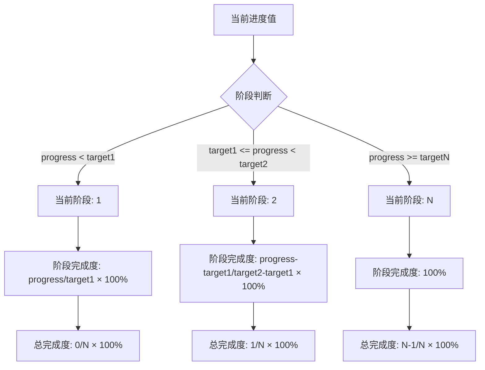

**阶段进度计算伪代码**:

```csharp
public class StepProgressCalculator
{
    // 阶段配置
    public class StepConfig
    {
        public int step;
        public long targetValue;
        public RewardInfo reward;
    }
    
    // 计算当前阶段
    public int CalculateCurrentStep(long progress, List<StepConfig> stepConfigs)
    {
        // 按阶段排序
        var sortedSteps = stepConfigs.OrderBy(s => s.step).ToList();
        
        int currentStep = 0;
        foreach (var step in sortedSteps)
        {
            if (progress >= step.targetValue)
            {
                currentStep = step.step;
            }
            else
            {
                break;
            }
        }
        
        return currentStep;
    }
    
    // 计算阶段完成度
    public float CalculateStepProgress(long progress, StepConfig currentStep, StepConfig nextStep)
    {
        if (currentStep == null)
        {
            return 0f;
        }
        
        if (nextStep == null)
        {
            return progress >= currentStep.targetValue ? 100f : 
                (float)progress / currentStep.targetValue * 100f;
        }
        
        long range = nextStep.targetValue - currentStep.targetValue;
        long current = progress - currentStep.targetValue;
        
        return Math.Min(100f, (float)current / range * 100f);
    }
    
    // 计算总完成度
    public float CalculateTotalProgress(int currentStep, int totalSteps)
    {
        if (totalSteps <= 0)
        {
            return 0f;
        }
        
        return (float)currentStep / totalSteps * 100f;
    }
    
    // 获取可领取的阶段列表
    public List<int> GetDrawableSteps(long progress, List<int> rewardedSteps, List<StepConfig> stepConfigs)
    {
        var drawableSteps = new List<int>();
        
        foreach (var step in stepConfigs)
        {
            // 已达成且未领取
            if (progress >= step.targetValue && !rewardedSteps.Contains(step.step))
            {
                drawableSteps.Add(step.step);
            }
        }
        
        return drawableSteps;
    }
}
```

**示例计算**:

```
阶段配置:
  - 阶段1: 目标10
  - 阶段2: 目标30
  - 阶段3: 目标60

当前进度: 45
当前阶段: 2
阶段完成度: (45-30)/(60-30) × 100% = 50%
总完成度: 2/3 × 100% = 66.7%
可领取阶段: [1, 2] (假设阶段1未领取)
```

### 1.4 返利计算公式

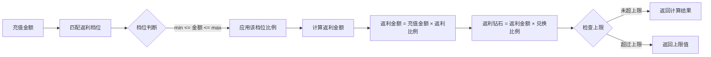

**返利计算伪代码**:

```csharp
public class RebateCalculator
{
    // 返利配置
    public class RebateConfig
    {
        public long minRecharge;
        public long maxRecharge;
        public float rebateRatio;
        public long maxRebate;
        public int rewardType; // 1=钻石, 2=道具
    }
    
    // 计算返利
    public RebateResult CalculateRebate(long rechargeAmount, List<RebateConfig> configs)
    {
        // 匹配返利档位
        RebateConfig matchedConfig = null;
        foreach (var config in configs)
        {
            if (rechargeAmount >= config.minRecharge && rechargeAmount <= config.maxRecharge)
            {
                matchedConfig = config;
                break;
            }
        }
        
        if (matchedConfig == null)
        {
            return new RebateResult { success = false };
        }
        
        // 计算返利金额
        long rebateAmount = (long)(rechargeAmount * matchedConfig.rebateRatio);
        
        // 检查上限
        if (matchedConfig.maxRebate > 0 && rebateAmount > matchedConfig.maxRebate)
        {
            rebateAmount = matchedConfig.maxRebate;
        }
        
        // 计算返利钻石（假设1元=10钻石）
        int rebateDiamond = (int)(rebateAmount * 10);
        
        return new RebateResult
        {
            success = true,
            rebateAmount = rebateAmount,
            rebateDiamond = rebateDiamond,
            config = matchedConfig
        };
    }
    
    // 计算累计返利
    public long CalculateTotalRebate(long playerId, long activityId)
    {
        // 获取玩家累计充值金额
        long totalRecharge = GetTotalRecharge(playerId, activityId);
        
        // 获取所有返利档位
        var configs = GetRebateConfigs(activityId);
        
        // 计算总返利
        long totalRebate = 0;
        foreach (var config in configs)
        {
            if (totalRecharge >= config.minRecharge)
            {
                long amount = Math.Min(totalRecharge, config.maxRecharge) - config.minRecharge + 1;
                totalRebate += (long)(amount * config.rebateRatio);
            }
        }
        
        return totalRebate;
    }
}
```

**示例计算**:

```
充值金额: 100元（10000分）
返利比例: 20%
返利钻石: 10000 × 0.2 × 10 = 200钻石

档位配置:
  - 档位1: 100-500元, 返利10%
  - 档位2: 501-1000元, 返利15%
  - 档位3: 1001元以上, 返利20%

累计充值1500元:
  - 档位1: (500-100+1) × 10% = 40.1元
  - 档位2: (1000-501+1) × 15% = 75元
  - 档位3: (1500-1001+1) × 20% = 100元
  - 总返利: 40.1 + 75 + 100 = 215.1元 = 2151钻石
```

---

## 二、状态机定义

### 2.1 活动状态机

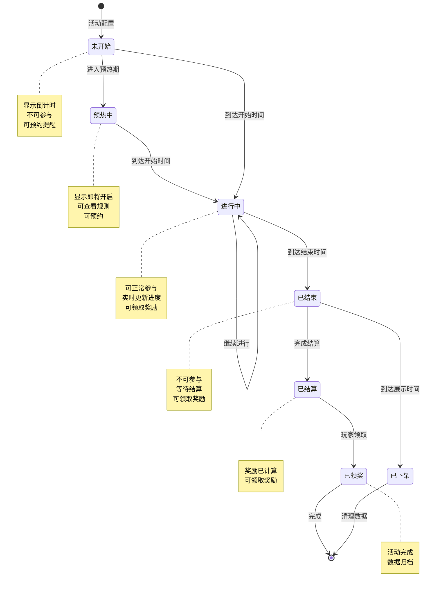

**状态转换代码**:

```csharp
public class ActivityStateMachine
{
    private ActivityState currentState;
    private ActivityConfig config;
    private long playerId;
    
    // 状态转换方法
    public bool Transition(ActivityEvent evt)
    {
        switch (currentState)
        {
            case ActivityState.NotStart:
                if (evt == ActivityEvent.EnterWarmUp)
                {
                    currentState = ActivityState.WarmUp;
                    OnEnterWarmUp();
                    return true;
                }
                if (evt == ActivityEvent.Start)
                {
                    currentState = ActivityState.InProgress;
                    OnStart();
                    return true;
                }
                break;
                
            case ActivityState.WarmUp:
                if (evt == ActivityEvent.Start)
                {
                    currentState = ActivityState.InProgress;
                    OnStart();
                    return true;
                }
                break;
                
            case ActivityState.InProgress:
                if (evt == ActivityEvent.End)
                {
                    currentState = ActivityState.Ended;
                    OnEnd();
                    return true;
                }
                break;
                
            case ActivityState.Ended:
                if (evt == ActivityEvent.Settle)
                {
                    currentState = ActivityState.Settled;
                    OnSettle();
                    return true;
                }
                if (evt == ActivityEvent.Expire)
                {
                    currentState = ActivityState.Removed;
                    OnRemove();
                    return true;
                }
                break;
                
            case ActivityState.Settled:
                if (evt == ActivityEvent.DrawReward)
                {
                    currentState = ActivityState.Rewarded;
                    OnReward();
                    return true;
                }
                break;
        }
        
        return false;
    }
    
    // 状态进入回调
    private void OnStart()
    {
        // 推送活动开始通知
        PushService.PushActivityStart(playerId, config.id);
        
        // 初始化玩家活动数据
        ActivityService.InitPlayerActivityData(playerId, config.id);
        
        // 触发活动开始事件
        EventManager.TriggerEvent(new ActivityStartEvent { activityId = config.id });
    }
    
    private void OnEnd()
    {
        // 锁定活动数据
        ActivityService.LockActivityData(playerId, config.id);
        
        // 触发活动结束事件
        EventManager.TriggerEvent(new ActivityEndEvent { activityId = config.id });
    }
    
    private void OnSettle()
    {
        // 计算排名奖励
        RankService.SettleActivityRank(config.id);
        
        // 推送结算通知
        PushService.PushActivitySettle(playerId, config.id);
    }
}
```

### 2.2 阶段任务状态机

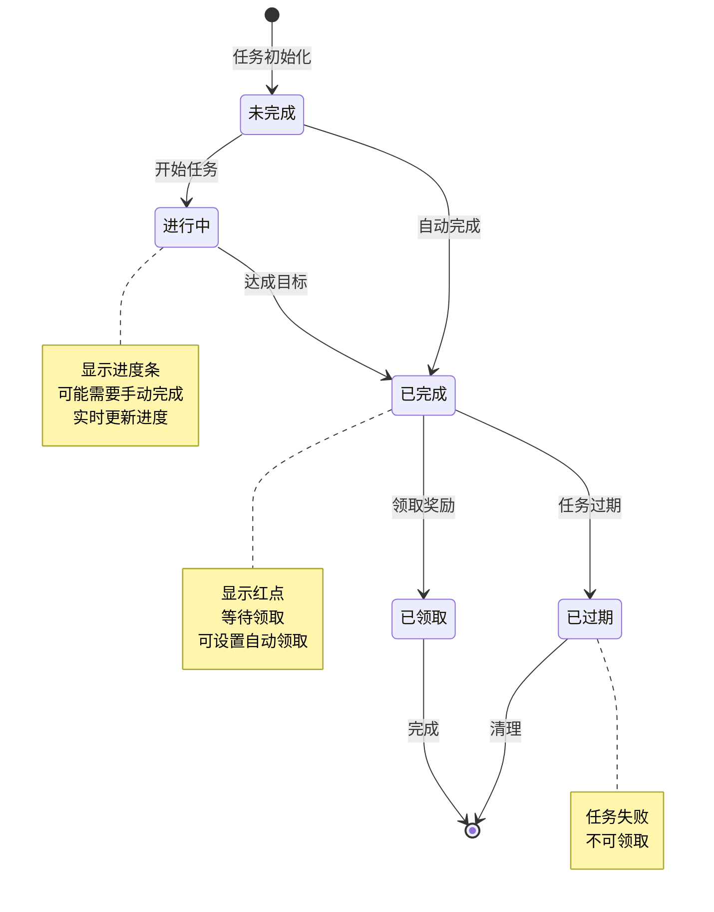

### 2.3 活动商店商品状态机

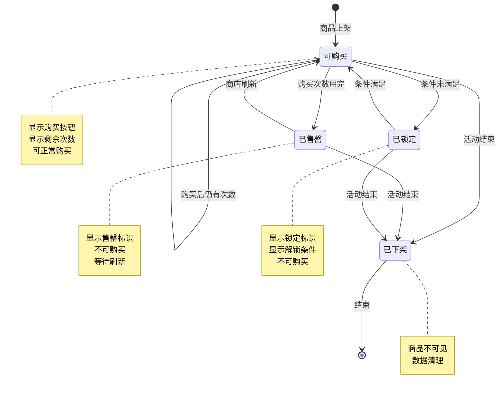

### 2.4 七日目标状态机

```mermaid
stateDiagram-v2
    [*] --> Day1: 开始活动
    
    Day1 --> Day2: 第一日完成
    Day2 --> Day3: 第二日完成
    Day3 --> Day4: 第三日完成
    Day4 --> Day5: 第四日完成
    Day5 --> Day6: 第五日完成
    Day6 --> Day7: 第六日完成
    Day7 --> 已完成: 第七日完成
    
    已完成 --> [*]: 活动结束
    
    Day1 --> Day1: 继续完成
    Day2 --> Day2: 继续完成
    Day3 --> Day3: 继续完成
    Day4 --> Day4: 继续完成
    Day5 --> Day5: 继续完成
    Day6 --> Day6: 继续完成
    Day7 --> Day7: 继续完成
    
    note right of DayN
        每日0点刷新
        未完成可继续完成
        显示当日进度
    end note
    
    note right of 已完成
        所有目标达成
        可领取最终奖励
    end note
```

---

## 三、数据约束

### 3.1 活动数据约束

| 字段名 | 数据类型 | 取值范围 | 必填 | 默认值 | 说明 |
|--------|----------|----------|------|--------|------|
| id | BIGINT | > 0 | 是 | - | 主键，自增 |
| player_id | BIGINT | > 0 | 是 | - | 玩家ID，外键 |
| activity_id | BIGINT | > 0 | 是 | - | 活动ID |
| activity_type | INT | 1-6 | 是 | - | 活动类型 |
| status | INT | 0-5 | 是 | 0 | 状态枚举值 |
| progress | BIGINT | >= 0 | 是 | 0 | 当前进度值 |
| reward_record | TEXT | - | 是 | "[]" | JSON数组格式 |
| custom_data | TEXT | - | 否 | "{}" | JSON对象格式 |
| create_time | DATETIME | - | 是 | NOW() | 创建时间 |
| update_time | DATETIME | - | 是 | NOW() | 更新时间 |

**约束规则**:

```sql
-- 主键约束
PRIMARY KEY (id)

-- 唯一约束
UNIQUE KEY uk_player_activity (player_id, activity_id)

-- 外键约束
FOREIGN KEY fk_player (player_id) REFERENCES player(id) ON DELETE CASCADE

-- 检查约束
CHECK (status >= 0 AND status <= 5)
CHECK (progress >= 0)
CHECK (create_time <= update_time)
```

### 3.2 活动商店数据约束

| 字段名 | 数据类型 | 取值范围 | 必填 | 默认值 | 说明 |
|--------|----------|----------|------|--------|------|
| id | BIGINT | > 0 | 是 | - | 主键 |
| player_id | BIGINT | > 0 | 是 | - | 玩家ID |
| shop_id | BIGINT | > 0 | 是 | - | 商店ID |
| refresh_num | INT | >= 0 | 是 | 0 | 刷新次数 |
| buy_record | TEXT | - | 是 | "{}" | JSON对象格式 |
| goods_data | TEXT | - | 是 | "[]" | JSON数组格式 |
| create_time | DATETIME | - | 是 | NOW() | 创建时间 |
| update_time | DATETIME | - | 是 | NOW() | 更新时间 |

**JSON数据格式示例**:

```json
// buy_record格式
{
  "1001": 2,    // 商品槽位ID: 已购买次数
  "1002": 1,
  "1003": 5
}

// goods_data格式
[
  {
    "slotId": 1001,
    "itemId": 3001,
    "itemCount": 5,
    "price": 100,
    "buyLimit": 2
  },
  {
    "slotId": 1002,
    "itemId": 3002,
    "itemCount": 10,
    "price": 50,
    "buyLimit": 5
  }
]
```

### 3.3 排行榜数据约束

| 字段名 | 数据类型 | 取值范围 | 必填 | 默认值 | 说明 |
|--------|----------|----------|------|--------|------|
| id | BIGINT | > 0 | 是 | - | 主键 |
| activity_id | BIGINT | > 0 | 是 | - | 活动ID |
| rank_type | INT | 1-3 | 是 | 1 | 排行类型 |
| player_id | BIGINT | > 0 | 是 | - | 玩家ID |
| player_name | VARCHAR(64) | 非空 | 是 | - | 玩家名称 |
| score | BIGINT | >= 0 | 是 | 0 | 分数 |
| update_time | DATETIME | - | 是 | NOW() | 更新时间 |

**Redis存储格式**:

```
Key: activity:rank:{activityId}:{rankType}
Type: Sorted Set (ZSET)
Score: 分数值
Member: 玩家ID

示例:
activity:rank:10001:1
  - 100001: 50000
  - 100002: 48000
  - 100003: 45000
```

### 3.4 活动配置约束

| 字段名 | 数据类型 | 取值范围 | 必填 | 默认值 | 说明 |
|--------|----------|----------|------|--------|------|
| id | long | > 0 | 是 | - | 活动配置ID |
| type | int | 1-6 | 是 | - | 活动类型 |
| start_time | long | > 0 | 是 | - | 开始时间戳 |
| end_time | long | > start_time | 是 | - | 结束时间戳 |
| status | int | 0-1 | 是 | 1 | 配置状态 |
| priority | int | >= 0 | 否 | 0 | 显示优先级 |

**配置验证规则**:

```csharp
public class ActivityConfigValidator
{
    public List<string> Validate(ActivityConfig config)
    {
        var errors = new List<string>();
        
        // ID验证
        if (config.id <= 0)
        {
            errors.Add("活动ID必须大于0");
        }
        
        // 名称验证
        if (string.IsNullOrEmpty(config.name))
        {
            errors.Add("活动名称不能为空");
        }
        else if (config.name.Length > 64)
        {
            errors.Add("活动名称长度不能超过64");
        }
        
        // 类型验证
        if (config.type < 1 || config.type > 6)
        {
            errors.Add("活动类型无效，必须为1-6");
        }
        
        // 时间验证
        if (config.end_time <= config.start_time)
        {
            errors.Add("结束时间必须大于开始时间");
        }
        
        // 展示时间验证
        if (config.show_time > 0 && config.show_time < config.end_time)
        {
            errors.Add("展示时间必须大于等于结束时间");
        }
        
        // 条件验证
        if (config.condition != null)
        {
            var conditionErrors = ValidateCondition(config.condition);
            errors.AddRange(conditionErrors);
        }
        
        // 奖励验证
        if (config.reward != null)
        {
            var rewardErrors = ValidateReward(config.reward);
            errors.AddRange(rewardErrors);
        }
        
        return errors;
    }
    
    private List<string> ValidateCondition(ActivityCondition condition)
    {
        var errors = new List<string>();
        
        if (condition.min_level < 0 || condition.min_level > 999)
        {
            errors.Add("等级条件无效");
        }
        
        if (condition.min_vip < 0 || condition.min_vip > 15)
        {
            errors.Add("VIP条件无效");
        }
        
        return errors;
    }
}
```

---

## 四、错误处理策略

### 4.1 活动模块错误码

| 错误码 | 错误信息 | 处理策略 | 用户提示 | 日志级别 |
|--------|----------|----------|----------|----------|
| 0 | 成功 | - | - | INFO |
| 60001 | 活动不存在 | 检查活动ID有效性 | "活动不存在" | ERROR |
| 60002 | 活动未开始 | 检查活动时间 | "活动尚未开始" | WARN |
| 60003 | 活动已结束 | 检查活动时间 | "活动已结束" | WARN |
| 60004 | 参与条件不满足 | 检查等级、VIP等 | "参与条件不足" | INFO |
| 60005 | 奖励已领取 | 检查领取记录 | "奖励已领取" | INFO |
| 60006 | 阶段未达成 | 检查阶段进度 | "尚未达成目标" | INFO |
| 60007 | 货币不足 | 检查货币余额 | "货币不足" | INFO |
| 60008 | 商品已售罄 | 检查购买次数 | "商品已售罄" | INFO |
| 60009 | 排名未结算 | 检查结算状态 | "排名正在结算中" | WARN |
| 60010 | 未购买基金 | 检查基金购买记录 | "请先购买基金" | INFO |
| 60011 | 刷新次数已满 | 检查刷新次数 | "刷新次数已用完" | INFO |
| 60012 | 参数错误 | 检查请求参数 | "参数错误" | ERROR |

### 4.2 错误处理流程

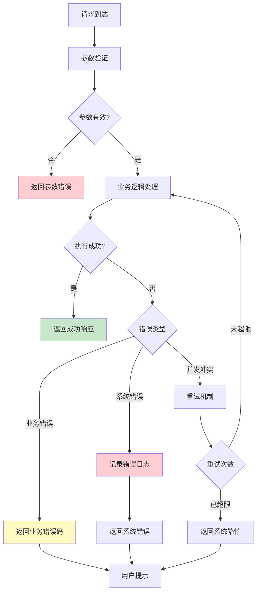

**错误处理代码示例**:

```csharp
public class ActivityErrorHandler
{
    // 统一错误处理
    public ErrorResponse HandleError(Exception ex, long playerId, string operation)
    {
        // 记录错误日志
        Logger.Error($"活动操作失败 - 玩家:{playerId} 操作:{operation} 错误:{ex.Message}", ex);
        
        // 错误分类
        if (ex is ActivityException activityEx)
        {
            // 业务错误
            return new ErrorResponse
            {
                errorCode = activityEx.ErrorCode,
                errorMsg = activityEx.Message,
                userMsg = GetUserMessage(activityEx.ErrorCode)
            };
        }
        else if (ex is DbUpdateException)
        {
            // 数据库错误
            return new ErrorResponse
            {
                errorCode = 60000,
                errorMsg = "数据库操作失败",
                userMsg = "系统繁忙，请稍后重试"
            };
        }
        else
        {
            // 未知错误
            return new ErrorResponse
            {
                errorCode = 60000,
                errorMsg = ex.Message,
                userMsg = "系统错误，请稍后重试"
            };
        }
    }
    
    // 获取用户提示消息
    private string GetUserMessage(int errorCode)
    {
        var messages = new Dictionary<int, string>
        {
            { 60001, "活动不存在" },
            { 60002, "活动尚未开始" },
            { 60003, "活动已结束" },
            { 60004, "参与条件不足" },
            { 60005, "奖励已领取" },
            { 60006, "尚未达成目标" },
            { 60007, "货币不足" },
            { 60008, "商品已售罄" },
            { 60009, "排名正在结算中" },
            { 60010, "请先购买基金" },
            { 60011, "刷新次数已用完" },
            { 60012, "参数错误" }
        };
        
        return messages.GetValueOrDefault(errorCode, "操作失败");
    }
}

// 自定义异常类
public class ActivityException : Exception
{
    public int ErrorCode { get; set; }
    
    public ActivityException(int errorCode, string message) : base(message)
    {
        ErrorCode = errorCode;
    }
}
```

### 4.3 活动参与错误处理流程

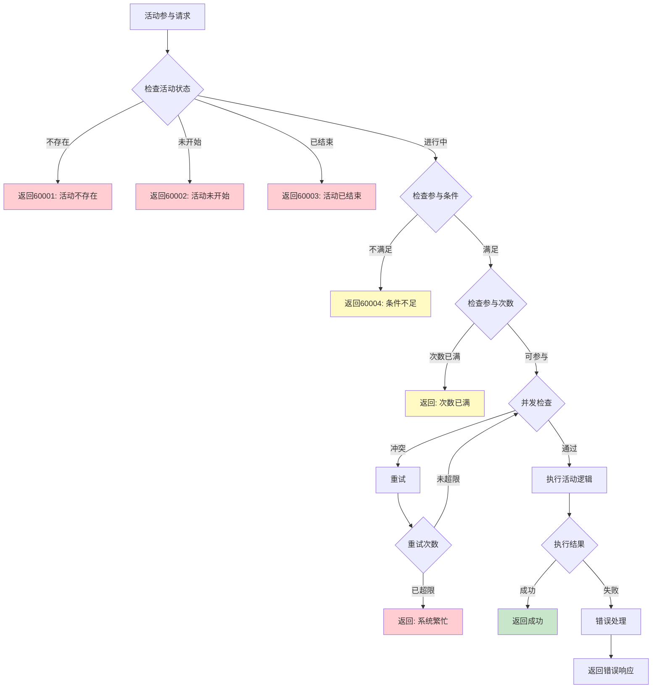

### 4.4 排行榜结算错误处理

| 错误场景 | 处理策略 | 后续操作 | 日志级别 |
|----------|----------|----------|----------|
| 结算进行中 | 返回等待状态 | 定时轮询检查 | INFO |
| 结算失败 | 记录错误日志 | 人工干预+重试 | ERROR |
| 奖励发放失败 | 转邮件发送 | 通知玩家+记录 | ERROR |
| 排名数据异常 | 使用备份数据 | 数据修复 | ERROR |
| 超时未完成 | 强制中断 | 补偿机制 | WARN |

**结算错误处理代码**:

```csharp
public class RankSettleHandler
{
    public async Task<SettleResult> SettleActivityRank(long activityId)
    {
        try
        {
            // 1. 检查结算状态
            var settleStatus = await CheckSettleStatus(activityId);
            if (settleStatus == SettleStatus.InProgress)
            {
                return SettleResult.Waiting;
            }
            
            // 2. 锁定排行榜数据
            await LockRankData(activityId);
            
            // 3. 计算排名
            var rankList = await CalculateRankList(activityId);
            
            // 4. 发放奖励
            await DistributeRewards(activityId, rankList);
            
            // 5. 更新结算状态
            await UpdateSettleStatus(activityId, SettleStatus.Completed);
            
            return SettleResult.Success;
        }
        catch (Exception ex)
        {
            // 记录错误
            Logger.Error($"排行榜结算失败 - 活动:{activityId}", ex);
            
            // 发送告警
            await SendAlert(activityId, ex);
            
            // 回滚状态
            await UpdateSettleStatus(activityId, SettleStatus.Failed);
            
            return SettleResult.Failed;
        }
    }
    
    private async Task DistributeRewards(long activityId, List<RankInfo> rankList)
    {
        var failedList = new List<RankInfo>();
        
        foreach (var rankInfo in rankList)
        {
            try
            {
                // 发放奖励
                await SendRankReward(rankInfo);
            }
            catch (Exception ex)
            {
                Logger.Error($"发放排名奖励失败 - 玩家:{rankInfo.playerId} 排名:{rankInfo.rank}", ex);
                
                // 转邮件发送
                await SendRewardMail(rankInfo);
                
                failedList.Add(rankInfo);
            }
        }
        
        if (failedList.Count > 0)
        {
            // 记录失败列表
            await RecordFailedList(activityId, failedList);
        }
    }
}
```

---

## 五、关键代码示例

### 5.1 活动状态检查完整代码

```csharp
public class ActivityStatusChecker
{
    private readonly ActivityDao activityDao;
    private readonly RefdataManager refdataManager;
    private readonly PlayerService playerService;
    
    /// <summary>
    /// 检查活动是否可用
    /// </summary>
    public async Task<Result> CheckActivityAvailable(long playerId, long activityId)
    {
        // 1. 获取活动配置
        ActivityRefObj config = refdataManager.GetActivityConfig(activityId);
        if (config == null)
        {
            return Result.Error(60001, "活动不存在");
        }
        
        // 2. 检查配置状态
        if (config.status != 1)
        {
            return Result.Error(60001, "活动未启用");
        }
        
        // 3. 检查时间状态
        long currentTime = DateTimeOffset.UtcNow.ToUnixTimeSeconds();
        
        if (currentTime < config.start_time)
        {
            return Result.Error(60002, "活动未开始");
        }
        
        if (currentTime >= config.end_time)
        {
            return Result.Error(60003, "活动已结束");
        }
        
        // 4. 检查参与条件
        Result conditionResult = await CheckActivityCondition(playerId, config);
        if (!conditionResult.isSuccess())
        {
            return conditionResult;
        }
        
        // 5. 检查参与次数
        if (config.daily_limit > 0)
        {
            int todayCount = await activityDao.GetTodayParticipateCount(playerId, activityId);
            if (todayCount >= config.daily_limit)
            {
                return Result.Error(60004, "今日参与次数已达上限");
            }
        }
        
        return Result.Success();
    }
    
    /// <summary>
    /// 检查活动参与条件
    /// </summary>
    private async Task<Result> CheckActivityCondition(long playerId, ActivityRefObj config)
    {
        // 获取玩家信息
        PlayerInfo player = await playerService.GetPlayerInfo(playerId);
        if (player == null)
        {
            return Result.Error(60000, "玩家不存在");
        }
        
        // 检查等级条件
        if (config.condition.min_level > 0 && player.level < config.condition.min_level)
        {
            return Result.Error(60004, $"等级不足，需要{config.condition.min_level}级");
        }
        
        // 检查VIP条件
        if (config.condition.min_vip > 0 && player.vipLevel < config.condition.min_vip)
        {
            return Result.Error(60004, $"VIP等级不足，需要VIP{config.condition.min_vip}");
        }
        
        // 检查任务条件
        if (config.condition.quest_complete != null && config.condition.quest_complete.Count > 0)
        {
            foreach (long questId in config.condition.quest_complete)
            {
                bool completed = await playerService.IsQuestCompleted(playerId, questId);
                if (!completed)
                {
                    return Result.Error(60004, "前置任务未完成");
                }
            }
        }
        
        // 检查物品条件
        if (config.condition.items != null && config.condition.items.Count > 0)
        {
            foreach (var item in config.condition.items)
            {
                int count = await playerService.GetItemCount(playerId, item.id);
                if (count < item.count)
                {
                    return Result.Error(60004, "所需物品不足");
                }
            }
        }
        
        return Result.Success();
    }
}
```

### 5.2 阶段奖励领取完整代码

```csharp
public class ActivityStepRewardHandler
{
    private readonly ActivityDao activityDao;
    private readonly BagService bagService;
    private readonly RefdataManager refdataManager;
    
    /// <summary>
    /// 领取阶段奖励
    /// </summary>
    public async Task<RewardResult> TakeActivityStepReward(long playerId, long activityId, int step)
    {
        // 1. 获取活动配置
        ActivityRefObj activityConfig = refdataManager.GetActivityConfig(activityId);
        if (activityConfig == null)
        {
            throw new ActivityException(60001, "活动不存在");
        }
        
        // 2. 获取阶段配置
        ActivityStepRewardRefObj stepConfig = refdataManager.GetActivityStepConfig(activityId, step);
        if (stepConfig == null)
        {
            throw new ActivityException(60001, "阶段配置不存在");
        }
        
        // 3. 获取玩家活动数据
        PlayerActivityData activityData = await activityDao.GetPlayerActivityData(playerId, activityId);
        if (activityData == null)
        {
            activityData = await InitializePlayerActivityData(playerId, activityId);
        }
        
        // 4. 检查阶段是否达成
        if (activityData.progress < stepConfig.target_value)
        {
            throw new ActivityException(60006, "阶段未达成");
        }
        
        // 5. 检查是否已领取
        if (activityData.rewardedSteps.Contains(step))
        {
            throw new ActivityException(60005, "奖励已领取");
        }
        
        // 6. 发放奖励
        List<RewardInfo> rewards = ParseRewards(stepConfig.reward);
        await bagService.AddRewards(playerId, rewards, $"活动阶段奖励-{activityConfig.name}-阶段{step}");
        
        // 7. 记录领取
        activityData.rewardedSteps.Add(step);
        await activityDao.UpdatePlayerActivityData(activityData);
        
        // 8. 返回结果
        return new RewardResult
        {
            success = true,
            rewards = rewards,
            step = step,
            nextStep = GetNextStep(activityData.progress, activityConfig)
        };
    }
    
    /// <summary>
    /// 一键领取所有可领取的阶段奖励
    /// </summary>
    public async Task<RewardResult> TakeAllStepRewards(long playerId, long activityId)
    {
        // 获取活动数据
        PlayerActivityData activityData = await activityDao.GetPlayerActivityData(playerId, activityId);
        if (activityData == null)
        {
            throw new ActivityException(60001, "活动数据不存在");
        }
        
        // 获取所有阶段配置
        List<ActivityStepRewardRefObj> allSteps = refdataManager.GetActivityStepConfigs(activityId);
        
        // 筛选可领取的阶段
        var drawableSteps = allSteps
            .Where(s => activityData.progress >= s.target_value && !activityData.rewardedSteps.Contains(s.step))
            .OrderBy(s => s.step)
            .ToList();
        
        if (drawableSteps.Count == 0)
        {
            throw new ActivityException(60005, "没有可领取的奖励");
        }
        
        // 批量发放奖励
        List<RewardInfo> totalRewards = new List<RewardInfo>();
        List<int> rewardedSteps = new List<int>();
        
        foreach (var stepConfig in drawableSteps)
        {
            List<RewardInfo> stepRewards = ParseRewards(stepConfig.reward);
            totalRewards.AddRange(stepRewards);
            rewardedSteps.Add(stepConfig.step);
            activityData.rewardedSteps.Add(stepConfig.step);
        }
        
        // 一次性发放所有奖励
        await bagService.AddRewards(playerId, totalRewards, $"活动一键领取-{activityId}");
        
        // 更新领取记录
        await activityDao.UpdatePlayerActivityData(activityData);
        
        return new RewardResult
        {
            success = true,
            rewards = totalRewards,
            rewardedSteps = rewardedSteps
        };
    }
    
    /// <summary>
    /// 初始化玩家活动数据
    /// </summary>
    private async Task<PlayerActivityData> InitializePlayerActivityData(long playerId, long activityId)
    {
        var data = new PlayerActivityData
        {
            playerId = playerId,
            activityId = activityId,
            status = EActivityState.InProgress,
            progress = 0,
            rewardedSteps = new List<int>(),
            customData = new Dictionary<string, object>(),
            createTime = DateTime.Now,
            updateTime = DateTime.Now
        };
        
        await activityDao.InsertPlayerActivityData(data);
        
        return data;
    }
}
```

### 5.3 排行榜结算完整代码

```csharp
public class ActivityRankSettler
{
    private readonly RankService rankService;
    private readonly MailService mailService;
    private readonly ActivityDao activityDao;
    private readonly RefdataManager refdataManager;
    
    /// <summary>
    /// 结算活动排行榜
    /// </summary>
    public async Task<SettleResult> SettleActivityRank(long activityId)
    {
        Logger.Info($"开始结算排行榜 - 活动:{activityId}");
        
        try
        {
            // 1. 更新结算状态为进行中
            await activityDao.UpdateActivityStatus(activityId, EActivityState.Settling);
            
            // 2. 获取排行榜数据
            List<RankData> rankList = await rankService.GetRankList(activityId);
            if (rankList.Count == 0)
            {
                Logger.Warn($"排行榜数据为空 - 活动:{activityId}");
            }
            
            // 3. 计算排名
            List<RankInfo> rankedList = CalculateFinalRank(rankList);
            
            // 4. 匹配奖励档位
            var rewardMap = MatchRankRewards(activityId, rankedList);
            
            // 5. 发放奖励
            await DistributeRewards(activityId, rewardMap);
            
            // 6. 更新结算状态为已完成
            await activityDao.UpdateActivityStatus(activityId, EActivityState.Settled);
            
            Logger.Info($"排行榜结算完成 - 活动:{activityId} 玩家数:{rankedList.Count}");
            
            return new SettleResult
            {
                success = true,
                playerCount = rankedList.Count,
                settleTime = DateTime.Now
            };
        }
        catch (Exception ex)
        {
            Logger.Error($"排行榜结算失败 - 活动:{activityId}", ex);
            
            // 回滚状态
            await activityDao.UpdateActivityStatus(activityId, EActivityState.Ended);
            
            throw;
        }
    }
    
    /// <summary>
    /// 计算最终排名
    /// </summary>
    private List<RankInfo> CalculateFinalRank(List<RankData> rankList)
    {
        // 按分数降序、时间升序排序
        var sorted = rankList
            .OrderByDescending(r => r.score)
            .ThenBy(r => r.updateTime)
            .ToList();
        
        // 分配排名
        var result = new List<RankInfo>();
        for (int i = 0; i < sorted.Count; i++)
        {
            var rankInfo = new RankInfo
            {
                rank = i + 1,
                playerId = sorted[i].playerId,
                playerName = sorted[i].playerName,
                score = sorted[i].score,
                updateTime = sorted[i].updateTime
            };
            
            // 处理同分排名
            if (i > 0 && sorted[i].score == sorted[i - 1].score)
            {
                rankInfo.rank = result[i - 1].rank;
            }
            
            result.Add(rankInfo);
        }
        
        return result;
    }
    
    /// <summary>
    /// 匹配排名奖励
    /// </summary>
    private Dictionary<long, RankRewardInfo> MatchRankRewards(long activityId, List<RankInfo> rankList)
    {
        var rewardMap = new Dictionary<long, RankRewardInfo>();
        
        // 获取奖励配置
        List<ActivityRankRewardRefObj> rewardConfigs = refdataManager.GetActivityRankRewardConfigs(activityId);
        
        foreach (var rankInfo in rankList)
        {
            // 匹配奖励档位
            ActivityRankRewardRefObj matchedConfig = null;
            foreach (var config in rewardConfigs)
            {
                if (rankInfo.rank >= config.min_rank && rankInfo.rank <= config.max_rank)
                {
                    matchedConfig = config;
                    break;
                }
            }
            
            if (matchedConfig != null)
            {
                rewardMap[rankInfo.playerId] = new RankRewardInfo
                {
                    rank = rankInfo.rank,
                    config = matchedConfig,
                    rewards = ParseRewards(matchedConfig.reward)
                };
            }
        }
        
        return rewardMap;
    }
    
    /// <summary>
    /// 发放奖励
    /// </summary>
    private async Task DistributeRewards(long activityId, Dictionary<long, RankRewardInfo> rewardMap)
    {
        var tasks = new List<Task>();
        
        foreach (var kvp in rewardMap)
        {
            long playerId = kvp.Key;
            RankRewardInfo rewardInfo = kvp.Value;
            
            // 并发发放奖励
            tasks.Add(Task.Run(async () =>
            {
                try
                {
                    // 发送邮件
                    await mailService.SendSystemMail(
                        playerId,
                        rewardInfo.config.mail_title,
                        string.Format(rewardInfo.config.mail_content, rewardInfo.rank),
                        rewardInfo.rewards
                    );
                    
                    Logger.Info($"发送排名奖励邮件 - 玩家:{playerId} 排名:{rewardInfo.rank}");
                }
                catch (Exception ex)
                {
                    Logger.Error($"发送排名奖励邮件失败 - 玩家:{playerId} 排名:{rewardInfo.rank}", ex);
                }
            }));
        }
        
        await Task.WhenAll(tasks);
    }
}
```

### 5.4 活动商店购买完整代码

```csharp
public class ActivityShopHandler
{
    private readonly ActivityShopDao shopDao;
    private readonly ResourceService resourceService;
    private readonly BagService bagService;
    private readonly RefdataManager refdataManager;
    
    /// <summary>
    /// 购买活动商店物品
    /// </summary>
    public async Task<BuyResult> BuyActivityShopItem(long playerId, long shopId, long slotId, int count)
    {
        // 1. 获取商店配置
        ActivityShopRefObj shopConfig = refdataManager.GetActivityShopConfig(shopId);
        if (shopConfig == null)
        {
            throw new ActivityException(60001, "商店不存在");
        }
        
        // 2. 检查活动是否有效
        ActivityRefObj activityConfig = refdataManager.GetActivityConfig(shopConfig.activity_id);
        if (activityConfig == null || !IsActivityActive(activityConfig))
        {
            throw new ActivityException(60003, "活动已结束");
        }
        
        // 3. 获取商品配置
        var goodsConfig = shopConfig.item_list.FirstOrDefault(g => g.id == slotId);
        if (goodsConfig == null)
        {
            throw new ActivityException(60001, "商品不存在");
        }
        
        // 4. 获取玩家商店数据
        PlayerActivityShop shopData = await shopDao.GetPlayerShopData(playerId, shopId);
        if (shopData == null)
        {
            shopData = await InitializeShopData(playerId, shopId, shopConfig);
        }
        
        // 5. 检查购买次数
        int boughtCount = shopData.buyRecord.GetValueOrDefault(slotId, 0);
        if (goodsConfig.buy_limit > 0 && boughtCount + count > goodsConfig.buy_limit)
        {
            throw new ActivityException(60008, "商品已售罄");
        }
        
        // 6. 计算总价
        long totalCost = goodsConfig.price * count;
        
        // 7. 检查货币
        bool hasEnough = await resourceService.CheckResource(playerId, shopConfig.currency_type, totalCost);
        if (!hasEnough)
        {
            throw new ActivityException(60007, "货币不足");
        }
        
        // 8. 执行购买事务
        using (var transaction = await BeginTransaction())
        {
            try
            {
                // 扣除货币
                await resourceService.CostResource(
                    playerId,
                    shopConfig.currency_type,
                    totalCost,
                    $"活动商店购买-{shopConfig.name}"
                );
                
                // 发放商品
                List<RewardInfo> rewards = new List<RewardInfo>
                {
                    new RewardInfo
                    {
                        itemId = goodsConfig.item_id,
                        count = goodsConfig.item_count * count
                    }
                };
                await bagService.AddRewards(playerId, rewards, "活动商店购买");
                
                // 更新购买记录
                shopData.buyRecord[slotId] = boughtCount + count;
                shopData.updateTime = DateTime.Now;
                await shopDao.UpdatePlayerShopData(shopData);
                
                transaction.Commit();
                
                // 记录日志
                ActivityLogger.LogShopBuy(playerId, shopId, slotId, count, totalCost);
                
                return new BuyResult
                {
                    success = true,
                    boughtCount = boughtCount + count,
                    remainCount = goodsConfig.buy_limit > 0 ? 
                        goodsConfig.buy_limit - boughtCount - count : -1,
                    rewards = rewards
                };
            }
            catch (Exception ex)
            {
                transaction.Rollback();
                Logger.Error($"购买商店物品失败 - 玩家:{playerId} 商店:{shopId} 商品:{slotId}", ex);
                throw;
            }
        }
    }
    
    /// <summary>
    /// 刷新活动商店
    /// </summary>
    public async Task<RefreshResult> RefreshActivityShop(long playerId, long shopId)
    {
        // 1. 获取商店配置
        ActivityShopRefObj shopConfig = refdataManager.GetActivityShopConfig(shopId);
        if (shopConfig == null)
        {
            throw new ActivityException(60001, "商店不存在");
        }
        
        // 2. 检查是否支持刷新
        if (shopConfig.refresh_type == (int)EShopRefreshType.None)
        {
            throw new ActivityException(60012, "该商店不支持刷新");
        }
        
        // 3. 获取商店数据
        PlayerActivityShop shopData = await shopDao.GetPlayerShopData(playerId, shopId);
        if (shopData == null)
        {
            shopData = await InitializeShopData(playerId, shopId, shopConfig);
        }
        
        // 4. 检查刷新次数
        int freeRefresh = shopConfig.free_refresh;
        int usedFreeRefresh = shopData.refreshNum < freeRefresh ? shopData.refreshNum : freeRefresh;
        
        if (shopData.refreshNum >= shopConfig.max_refresh && shopConfig.max_refresh > 0)
        {
            throw new ActivityException(60011, "刷新次数已满");
        }
        
        // 5. 计算刷新成本
        long refreshCost = 0;
        if (shopData.refreshNum >= freeRefresh)
        {
            // 需要付费刷新
            refreshCost = shopConfig.refresh_cost.diamond;
            
            bool hasEnough = await resourceService.CheckResource(playerId, ResourceType.Diamond, refreshCost);
            if (!hasEnough)
            {
                throw new ActivityException(60007, "钻石不足");
            }
        }
        
        // 6. 执行刷新
        using (var transaction = await BeginTransaction())
        {
            try
            {
                // 扣除刷新成本
                if (refreshCost > 0)
                {
                    await resourceService.CostResource(playerId, ResourceType.Diamond, refreshCost, "商店刷新");
                }
                
                // 生成新商品列表
                List<ShopGoodsInfo> newGoods = GenerateNewGoods(shopConfig);
                
                // 更新商店数据
                shopData.goodsData = newGoods;
                shopData.buyRecord = new Dictionary<long, int>();
                shopData.refreshNum++;
                shopData.updateTime = DateTime.Now;
                
                await shopDao.UpdatePlayerShopData(shopData);
                
                transaction.Commit();
                
                return new RefreshResult
                {
                    success = true,
                    goodsList = newGoods,
                    refreshNum = shopData.refreshNum,
                    cost = refreshCost
                };
            }
            catch (Exception ex)
            {
                transaction.Rollback();
                Logger.Error($"刷新商店失败 - 玩家:{playerId} 商店:{shopId}", ex);
                throw;
            }
        }
    }
    
    /// <summary>
    /// 生成新商品列表
    /// </summary>
    private List<ShopGoodsInfo> GenerateNewGoods(ActivityShopRefObj shopConfig)
    {
        // 随机生成商品逻辑
        var random = new Random();
        var goodsList = new List<ShopGoodsInfo>();
        
        foreach (var goods in shopConfig.item_list)
        {
            // 随机决定是否出现
            if (random.NextDouble() < 0.7) // 70%概率出现
            {
                goodsList.Add(new ShopGoodsInfo
                {
                    slotId = goods.id,
                    itemId = goods.item_id,
                    itemCount = goods.item_count,
                    price = goods.price,
                    buyLimit = goods.buy_limit,
                    boughtCount = 0
                });
            }
        }
        
        return goodsList;
    }
}
```

### 5.5 七日目标处理完整代码

```csharp
public class SevenDayGoalsHandler
{
    private readonly SevenDayGoalsDao goalsDao;
    private readonly PlayerService playerService;
    private readonly BagService bagService;
    private readonly RefdataManager refdataManager;
    
    /// <summary>
    /// 更新七日目标进度
    /// </summary>
    public async Task UpdateSevenDayGoalProgress(long playerId, int goalType, long value)
    {
        // 1. 获取玩家七日目标数据
        SevenDayGoalsData goalsData = await goalsDao.GetPlayerSevenDayGoals(playerId);
        if (goalsData == null)
        {
            // 玩家没有七日目标数据，可能不是新玩家
            return;
        }
        
        // 2. 检查活动是否结束
        if (goalsData.currentDay > 7)
        {
            return;
        }
        
        // 3. 获取当日目标配置
        List<SevenDayGoalConfig> dayGoals = refdataManager.GetSevenDayGoalsByDay(goalsData.currentDay);
        
        // 4. 更新匹配的目标进度
        bool hasUpdate = false;
        foreach (var goalConfig in dayGoals)
        {
            if (goalConfig.goal_type == goalType)
            {
                // 更新进度
                if (!goalsData.goalProgress.ContainsKey(goalConfig.goal_id))
                {
                    goalsData.goalProgress[goalConfig.goal_id] = 0;
                }
                
                goalsData.goalProgress[goalConfig.goal_id] += value;
                hasUpdate = true;
                
                // 检查是否完成
                if (goalsData.goalProgress[goalConfig.goal_id] >= goalConfig.target_value &&
                    !goalsData.completedGoals.Contains(goalConfig.goal_id))
                {
                    goalsData.completedGoals.Add(goalConfig.goal_id);
                    
                    // 推送红点
                    await PushRedDot(playerId, "seven_day_goals");
                }
            }
        }
        
        // 5. 保存数据
        if (hasUpdate)
        {
            goalsData.updateTime = DateTime.Now;
            await goalsDao.UpdatePlayerSevenDayGoals(goalsData);
        }
    }
    
    /// <summary>
    /// 领取七日目标奖励
    /// </summary>
    public async Task<RewardResult> DrawSevenDayGoalReward(long playerId, int day, long goalId)
    {
        // 1. 获取数据
        SevenDayGoalsData goalsData = await goalsDao.GetPlayerSevenDayGoals(playerId);
        if (goalsData == null)
        {
            throw new ActivityException(60001, "七日目标数据不存在");
        }
        
        // 2. 检查天数
        if (day != goalsData.currentDay)
        {
            throw new ActivityException(60012, "天数不匹配");
        }
        
        // 3. 获取目标配置
        SevenDayGoalConfig goalConfig = refdataManager.GetSevenDayGoalConfig(goalId);
        if (goalConfig == null)
        {
            throw new ActivityException(60001, "目标配置不存在");
        }
        
        // 4. 检查是否完成
        if (!goalsData.completedGoals.Contains(goalId))
        {
            throw new ActivityException(60006, "目标未完成");
        }
        
        // 5. 检查是否已领取
        if (goalsData.goalRewardRecord.Contains(goalId))
        {
            throw new ActivityException(60005, "奖励已领取");
        }
        
        // 6. 发放奖励
        List<RewardInfo> rewards = ParseRewards(goalConfig.reward);
        await bagService.AddRewards(playerId, rewards, $"七日目标-Day{day}");
        
        // 7. 记录领取
        goalsData.goalRewardRecord.Add(goalId);
        await goalsDao.UpdatePlayerSevenDayGoals(goalsData);
        
        return new RewardResult
        {
            success = true,
            rewards = rewards
        };
    }
    
    /// <summary>
    /// 更新七日目标天数（每日0点调用）
    /// </summary>
    public async Task UpdateAllPlayersDay()
    {
        // 获取所有进行中的玩家
        var activePlayers = await goalsDao.GetActivePlayers();
        
        foreach (var playerId in activePlayers)
        {
            try
            {
                var goalsData = await goalsDao.GetPlayerSevenDayGoals(playerId);
                if (goalsData == null || goalsData.currentDay > 7)
                {
                    continue;
                }
                
                // 更新天数
                goalsData.currentDay++;
                goalsData.updateTime = DateTime.Now;
                
                await goalsDao.UpdatePlayerSevenDayGoals(goalsData);
                
                Logger.Info($"更新七日目标天数 - 玩家:{playerId} 天数:{goalsData.currentDay}");
            }
            catch (Exception ex)
            {
                Logger.Error($"更新七日目标天数失败 - 玩家:{playerId}", ex);
            }
        }
    }
}
```

---

## 六、跨模块依赖

### 6.1 依赖模块

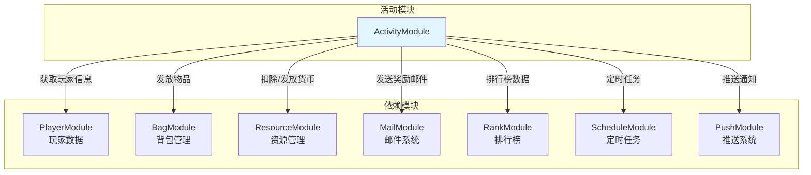

**依赖关系表**:

| 模块名称 | 依赖方式 | 依赖说明 | 耦合度 |
|----------|----------|----------|--------|
| Player | 数据读取 | 获取玩家等级、VIP等数据 | 低 |
| Bag | 功能调用 | 发放奖励物品 | 中 |
| Resource | 功能调用 | 扣除/发放货币 | 中 |
| Mail | 功能调用 | 发送奖励邮件 | 低 |
| Rank | 功能调用 | 排行榜数据处理 | 高 |
| Schedule | 功能调用 | 定时任务调度 | 低 |
| Push | 功能调用 | 推送通知消息 | 低 |

### 6.2 被依赖情况

| 模块名称 | 依赖方式 | 依赖说明 | 耦合度 |
|----------|----------|----------|--------|
| ActivityTeam | 数据关联 | 组队活动关联活动数据 | 中 |
| Quest | 数据关联 | 活动任务关联任务系统 | 中 |
| Pay | 事件监听 | 充值事件触发活动奖励 | 低 |

### 6.3 接口依赖图

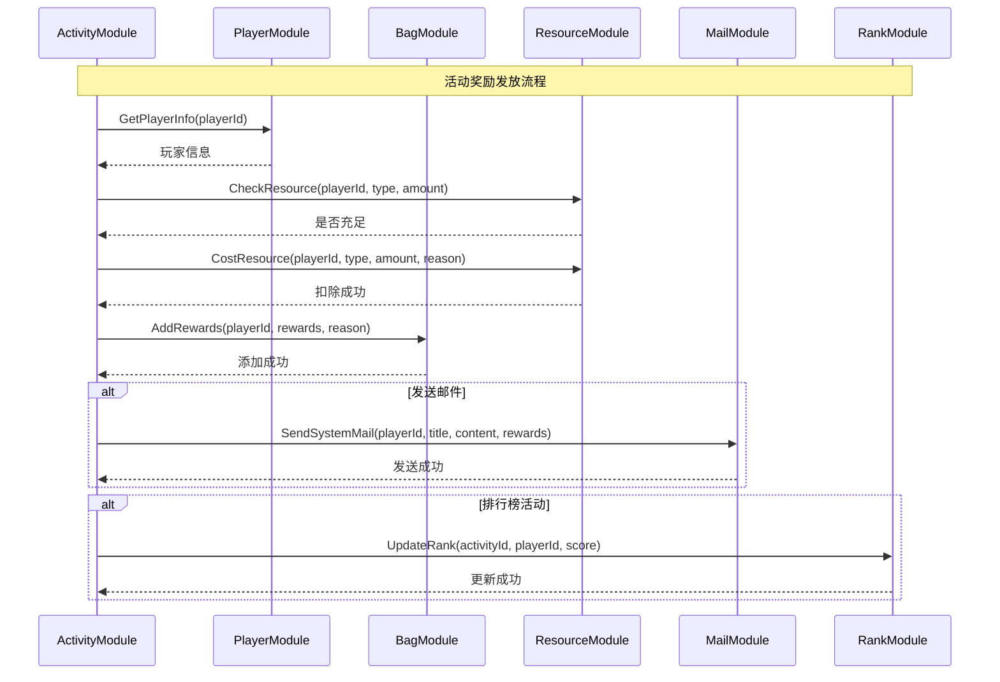

---

## 七、测试用例

### 7.1 单元测试示例

```csharp
[TestFixture]
public class ActivityServiceTests
{
    private ActivityService activityService;
    private Mock<ActivityDao> mockActivityDao;
    private Mock<RefdataManager> mockRefdataManager;
    
    [SetUp]
    public void Setup()
    {
        mockActivityDao = new Mock<ActivityDao>();
        mockRefdataManager = new Mock<RefdataManager>();
        activityService = new ActivityService(mockActivityDao.Object, mockRefdataManager.Object);
    }
    
    [Test]
    public async Task TestGetActivityState_NotStart()
    {
        // Arrange
        var config = new ActivityRefObj
        {
            id = 10001,
            start_time = DateTimeOffset.UtcNow.AddHours(1).ToUnixTimeSeconds(),
            end_time = DateTimeOffset.UtcNow.AddHours(25).ToUnixTimeSeconds()
        };
        
        long currentTime = DateTimeOffset.UtcNow.ToUnixTimeSeconds();
        
        // Act
        var state = activityService.CalculateActivityState(config, currentTime);
        
        // Assert
        Assert.AreEqual(EActivityState.NotStart, state);
    }
    
    [Test]
    public async Task TestGetActivityState_InProgress()
    {
        // Arrange
        var config = new ActivityRefObj
        {
            id = 10001,
            start_time = DateTimeOffset.UtcNow.AddHours(-1).ToUnixTimeSeconds(),
            end_time = DateTimeOffset.UtcNow.AddHours(23).ToUnixTimeSeconds()
        };
        
        long currentTime = DateTimeOffset.UtcNow.ToUnixTimeSeconds();
        
        // Act
        var state = activityService.CalculateActivityState(config, currentTime);
        
        // Assert
        Assert.AreEqual(EActivityState.InProgress, state);
    }
    
    [Test]
    public async Task TestTakeStepReward_Success()
    {
        // Arrange
        long playerId = 100001;
        long activityId = 10001;
        int step = 1;
        
        var activityData = new PlayerActivityData
        {
            playerId = playerId,
            activityId = activityId,
            progress = 100,
            rewardedSteps = new List<int>()
        };
        
        var stepConfig = new ActivityStepRewardRefObj
        {
            activity_id = activityId,
            step = step,
            target_value = 10,
            reward = new RewardInfo { diamond = 100 }
        };
        
        mockActivityDao.Setup(d => d.GetPlayerActivityData(playerId, activityId))
            .ReturnsAsync(activityData);
        
        mockRefdataManager.Setup(r => r.GetActivityStepConfig(activityId, step))
            .Returns(stepConfig);
        
        // Act
        var result = await activityService.TakeActivityStepReward(playerId, activityId, step);
        
        // Assert
        Assert.IsTrue(result.success);
        Assert.AreEqual(1, result.rewardedSteps.Count);
        Assert.Contains(step, result.rewardedSteps);
    }
    
    [Test]
    public void TestTakeStepReward_AlreadyRewarded()
    {
        // Arrange
        long playerId = 100001;
        long activityId = 10001;
        int step = 1;
        
        var activityData = new PlayerActivityData
        {
            playerId = playerId,
            activityId = activityId,
            progress = 100,
            rewardedSteps = new List<int> { 1 }
        };
        
        mockActivityDao.Setup(d => d.GetPlayerActivityData(playerId, activityId))
            .ReturnsAsync(activityData);
        
        // Act & Assert
        Assert.ThrowsAsync<ActivityException>(
            async () => await activityService.TakeActivityStepReward(playerId, activityId, step)
        );
    }
}
```

---

*文档生成时间: 2026-04-11*
*最后更新: 2026-04-11*
