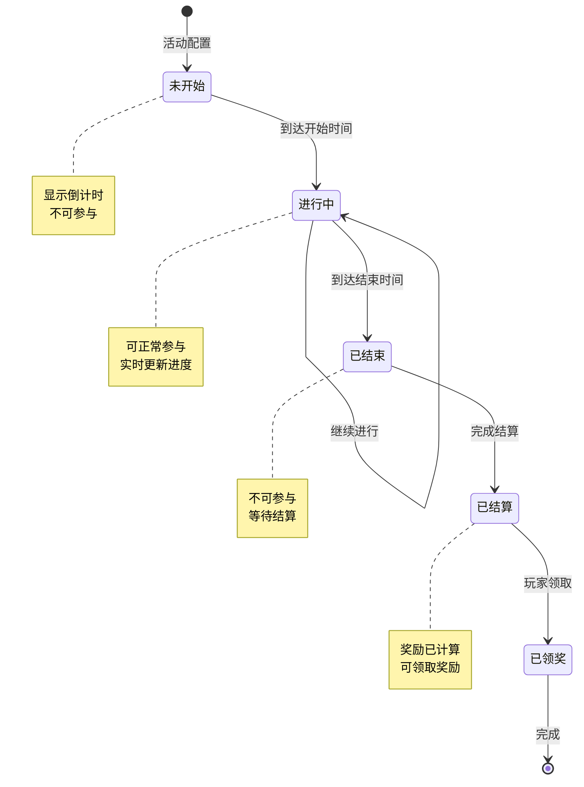
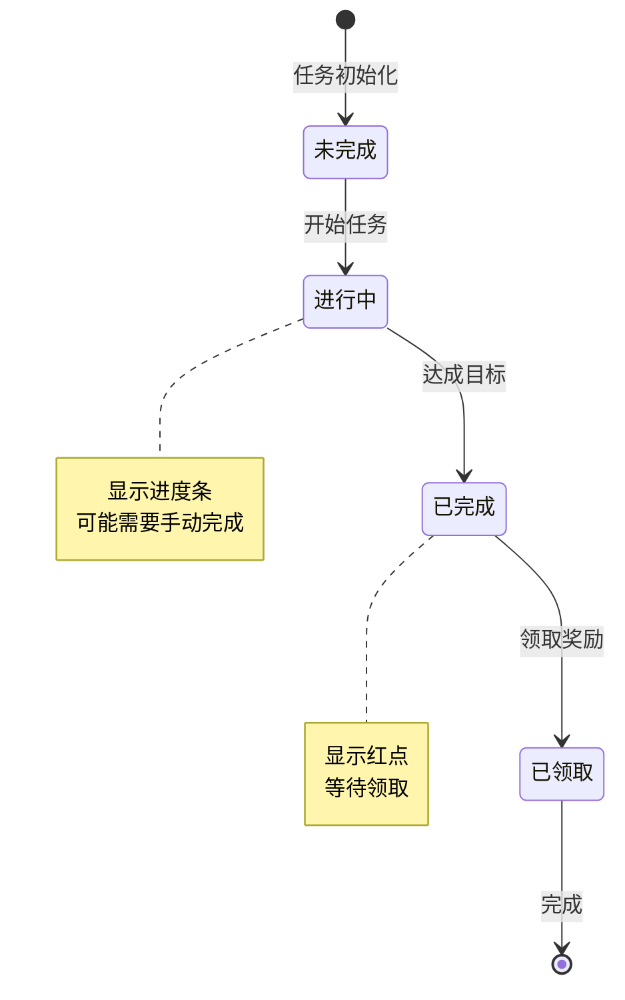
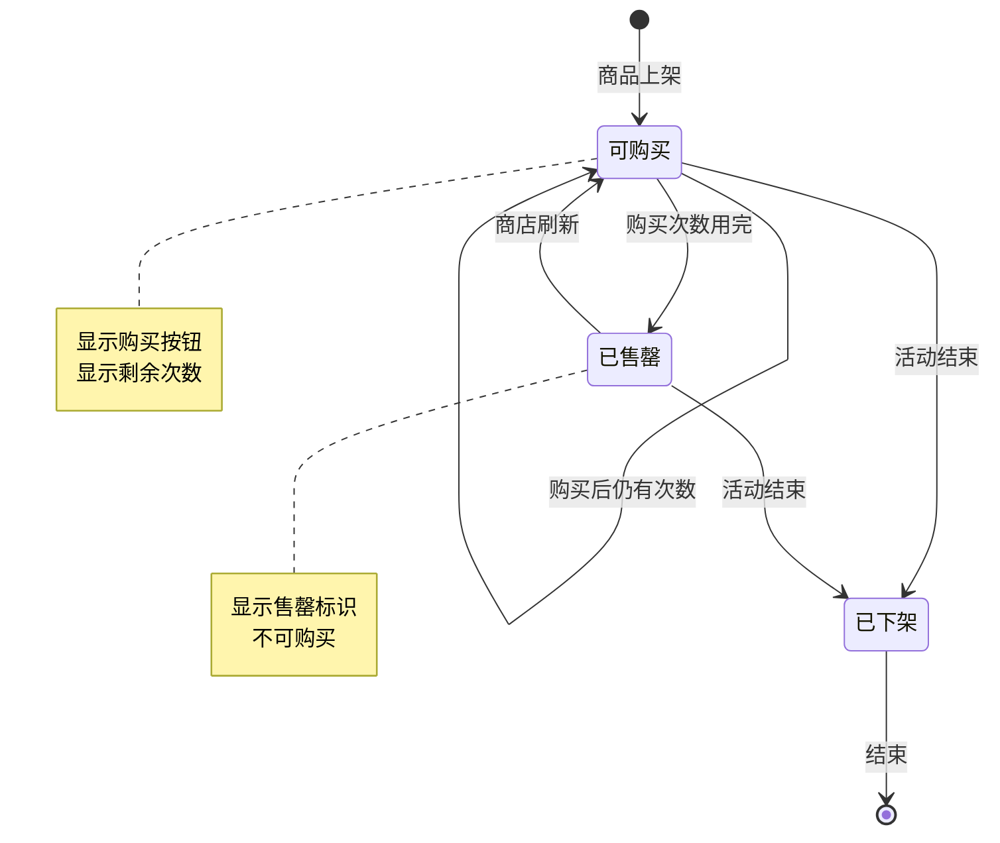
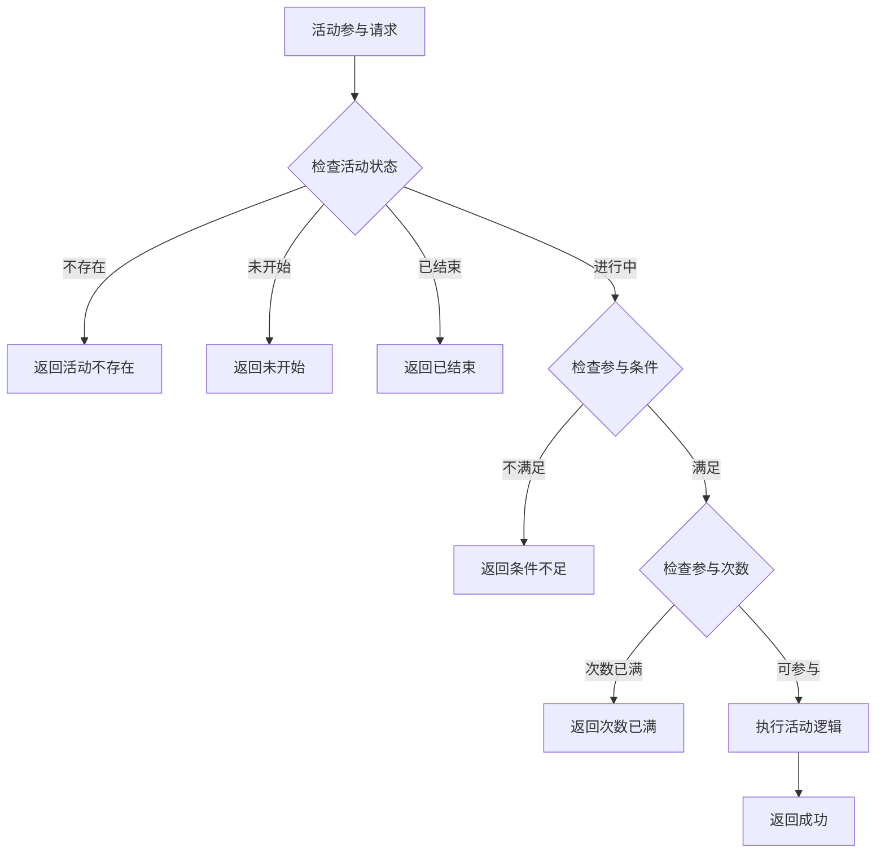
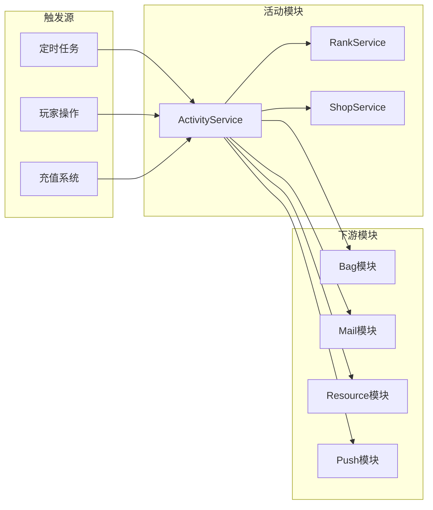

# 活动模块实现细节

## 一、计算公式

### 1.1 活动状态计算公式

```
活动状态 = {
    未开始: 当前时间 < 开始时间
    进行中: 开始时间 <= 当前时间 < 结束时间
    已结束: 当前时间 >= 结束时间
    已领奖: 已完成领取
}
```

**剩余时间计算**：
```
剩余时间 = 结束时间 - 当前时间
剩余秒数 = max(0, 剩余时间)
```

### 1.2 排行榜排名计算公式

```
排名 = 根据分数降序排列后的位置
同分处理 = 先达到者排名靠前
```

**奖励档位判定**：
```
奖励档位 = 满足条件的最低排名区间
例如: 排名15, 奖励区间 11-50, 获得11-50名奖励
```

### 1.3 阶段进度计算公式

```
当前阶段 = max(满足条件的阶段)
阶段完成度 = 当前进度 / 阶段目标值 × 100%
总完成度 = 已完成阶段数 / 总阶段数 × 100%
```

**示例计算**：
```
阶段配置:
  - 阶段1: 目标10
  - 阶段2: 目标30
  - 阶段3: 目标60

当前进度: 45
当前阶段: 2
阶段完成度: (45-30)/(60-30) × 100% = 50%
总完成度: 2/3 × 100% = 66.7%
```

### 1.4 返利计算公式

```
返利金额 = 充值金额 × 返利比例
返利钻石 = 返利金额 × 钻石兑换比例
```

**示例计算**：
```
充值金额: 100元
返利比例: 20%
返利钻石: 100 × 20% × 10 = 200钻石
```

---

## 二、状态机定义

### 2.1 活动状态机



### 2.2 阶段任务状态机



### 2.3 活动商店商品状态机



### 2.4 七日目标状态机

```mermaid
stateDiagram-v2
    [*] --> Day1: 开始活动
    Day1 --> Day2: 第一日完成
    Day2 --> Day3: 第二日完成
    Day3 --> Day4: 第三日完成
    Day4 --> Day5: 第四日完成
    Day5 --> Day6: 第五日完成
    Day6 --> Day7: 第六日完成
    Day7 --> 已完成: 第七日完成
    已完成 --> [*]: 活动结束

    note right of DayN
        每日0点刷新
        未完成可继续完成
    end note
```

---

## 三、数据约束

### 3.1 活动数据约束

| 字段名 | 数据类型 | 取值范围 | 必填 | 说明 |
|--------|----------|----------|------|------|
| id | BIGINT | > 0 | 是 | 主键 |
| player_id | BIGINT | > 0 | 是 | 玩家ID |
| activity_id | BIGINT | > 0 | 是 | 活动ID |
| status | INT | 0-4 | 是 | 状态 |
| progress | TEXT | - | 是 | 进度数据（JSON） |
| reward_record | TEXT | - | 是 | 奖励记录（JSON） |
| create_time | DATETIME | - | 是 | 创建时间 |

### 3.2 活动商店数据约束

| 字段名 | 数据类型 | 取值范围 | 必填 | 说明 |
|--------|----------|----------|------|------|
| id | BIGINT | > 0 | 是 | 主键 |
| player_id | BIGINT | > 0 | 是 | 玩家ID |
| shop_id | BIGINT | > 0 | 是 | 商店ID |
| refresh_num | INT | >= 0 | 是 | 刷新次数 |
| buy_record | TEXT | - | 是 | 购买记录（JSON） |

### 3.3 排行榜数据约束

| 字段名 | 数据类型 | 取值范围 | 必填 | 说明 |
|--------|----------|----------|------|------|
| rank | INT | >= 1 | 是 | 排名 |
| player_id | BIGINT | > 0 | 是 | 玩家ID |
| score | BIGINT | >= 0 | 是 | 分数 |
| update_time | DATETIME | - | 是 | 更新时间 |

### 3.4 活动配置约束

| 字段名 | 数据类型 | 取值范围 | 必填 | 说明 |
|--------|----------|----------|------|------|
| id | long | > 0 | 是 | 活动配置ID |
| type | int | 1-6 | 是 | 活动类型 |
| start_time | long | > 0 | 是 | 开始时间戳 |
| end_time | long | > start_time | 是 | 结束时间戳 |

---

## 四、错误处理策略

### 4.1 活动模块错误码

| 错误码 | 错误信息 | 处理策略 | 用户提示 |
|--------|----------|----------|----------|
| 60001 | 活动不存在 | 检查活动ID有效性 | "活动不存在" |
| 60002 | 活动未开始 | 检查活动时间 | "活动尚未开始" |
| 60003 | 活动已结束 | 检查活动时间 | "活动已结束" |
| 60004 | 参与条件不满足 | 检查等级、VIP等 | "参与条件不足" |
| 60005 | 奖励已领取 | 检查领取记录 | "奖励已领取" |
| 60006 | 阶段未达成 | 检查阶段进度 | "尚未达成目标" |
| 60007 | 货币不足 | 检查货币余额 | "货币不足" |
| 60008 | 商品已售罄 | 检查购买次数 | "商品已售罄" |
| 60009 | 排名未结算 | 检查结算状态 | "排名正在结算中" |

### 4.2 活动参与错误处理流程



### 4.3 排行榜结算错误处理

| 错误场景 | 处理策略 | 后续操作 |
|----------|----------|----------|
| 结算进行中 | 返回等待 | 定时轮询 |
| 结算失败 | 记录日志 | 人工干预 |
| 奖励发放失败 | 转邮件发送 | 通知玩家 |

---

## 五、关键代码示例

### 5.1 活动状态检查伪代码

```csharp
public ActivityState GetActivityState(ActivityConfig config, long currentTime)
{
    if (currentTime < config.start_time)
    {
        return ActivityState.NOT_START;
    }
    else if (currentTime < config.end_time)
    {
        return ActivityState.IN_PROGRESS;
    }
    else
    {
        return ActivityState.ENDED;
    }
}

public Result CheckActivityAvailable(long playerId, long activityId)
{
    ActivityConfig config = activityConfigDao.getById(activityId);
    if (config == null)
    {
        return Result.Error(60001, "活动不存在");
    }

    ActivityState state = GetActivityState(config, DateTime.Now.Ticks);
    if (state == ActivityState.NOT_START)
    {
        return Result.Error(60002, "活动未开始");
    }
    if (state == ActivityState.ENDED)
    {
        return Result.Error(60003, "活动已结束");
    }

    // 检查参与条件
    PlayerInfo player = playerService.GetPlayer(playerId);
    if (player.level < config.min_level)
    {
        return Result.Error(60004, "等级不足");
    }

    return Result.Success();
}
```

### 5.2 阶段奖励领取伪代码

```csharp
public Result TakeActivityStepReward(long playerId, long activityId, int step)
{
    // 检查活动有效性
    Result checkResult = CheckActivityAvailable(playerId, activityId);
    if (!checkResult.isSuccess())
    {
        return checkResult;
    }

    // 获取玩家活动数据
    PlayerActivity activityData = activityDao.selectByPlayerAndId(playerId, activityId);
    if (activityData == null)
    {
        return Result.Error(60001, "活动数据不存在");
    }

    // 获取阶段配置
    ActivityStepConfig stepConfig = activityStepConfigDao.getByActivityAndStep(activityId, step);
    if (stepConfig == null)
    {
        return Result.Error(60001, "阶段配置不存在");
    }

    // 检查阶段是否达成
    if (activityData.progress < stepConfig.target_value)
    {
        return Result.Error(60006, "阶段未达成");
    }

    // 检查是否已领取
    if (activityData.reward_record.Contains(step))
    {
        return Result.Error(60005, "奖励已领取");
    }

    // 发放奖励
    bagService.addItems(playerId, stepConfig.reward_list);

    // 记录领取
    activityData.reward_record.Add(step);
    activityDao.updateById(activityData);

    return Result.Success();
}
```

### 5.3 排行榜结算伪代码

```csharp
public void SettleActivityRank(long activityId)
{
    ActivityConfig config = activityConfigDao.getById(activityId);

    // 获取排行榜数据
    List<RankData> rankList = rankService.GetRankList(activityId);

    // 按排名发放奖励
    for (int i = 0; i < rankList.Count; i++)
    {
        RankData data = rankList[i];
        int rank = i + 1;

        // 获取对应排名的奖励配置
        RankRewardConfig rewardConfig = GetRankRewardConfig(config, rank);
        if (rewardConfig == null) continue;

        // 发放奖励（转邮件）
        mailService.SendSystemMail(
            data.player_id,
            "排行榜奖励",
            $"恭喜您在活动中获得第{rank}名！",
            rewardConfig.reward_list
        );
    }

    // 更新活动状态为已结算
    activityService.UpdateActivityStatus(activityId, ActivityStatus.SETTLED);
}

private RankRewardConfig GetRankRewardConfig(ActivityConfig config, int rank)
{
    foreach (var reward in config.rank_rewards)
    {
        if (rank >= reward.min_rank && rank <= reward.max_rank)
        {
            return reward;
        }
    }
    return null;
}
```

### 5.4 活动商店购买伪代码

```csharp
public Result BuyActivityShopItem(long playerId, long shopId, long itemId, int count)
{
    // 获取商店数据
    PlayerActivityShop shopData = shopDao.selectByPlayerAndId(playerId, shopId);
    if (shopData == null)
    {
        shopData = InitShopData(playerId, shopId);
    }

    // 获取商品配置
    ShopItemConfig itemConfig = shopItemConfigDao.getById(itemId);
    if (itemConfig == null)
    {
        return Result.Error(60001, "商品不存在");
    }

    // 检查购买次数
    int boughtCount = shopData.buy_record.GetValueOrDefault(itemId, 0);
    if (boughtCount + count > itemConfig.buy_limit)
    {
        return Result.Error(60008, "商品已售罄");
    }

    // 检查货币
    long totalCost = itemConfig.price * count;
    if (!resourceService.CheckResource(playerId, itemConfig.currency_type, totalCost))
    {
        return Result.Error(60007, "货币不足");
    }

    // 扣除货币
    resourceService.CostResource(playerId, itemConfig.currency_type, totalCost, "活动商店购买");

    // 发放商品
    bagService.addItems(playerId, itemConfig.reward_list, count);

    // 更新购买记录
    shopData.buy_record[itemId] = boughtCount + count;
    shopDao.updateById(shopData);

    return Result.Success();
}
```

### 5.5 七日目标处理伪代码

```csharp
public void UpdateSevenDayGoal(long playerId, int goalType, long value)
{
    SevenDayGoalsData goalsData = sevenDayGoalsDao.selectByPlayerId(playerId);
    if (goalsData == null)
    {
        goalsData = InitSevenDayGoals(playerId);
    }

    // 计算当前是第几天
    int currentDay = CalculateDay(goalsData.start_time, DateTime.Now);

    // 获取当日目标配置
    List<SevenDayGoalConfig> dayGoals = sevenDayGoalConfigDao.getByDay(currentDay);

    foreach (var goalConfig in dayGoals)
    {
        if (goalConfig.goal_type == goalType)
        {
            // 更新目标进度
            if (!goalsData.goal_progress.ContainsKey(goalConfig.goal_id))
            {
                goalsData.goal_progress[goalConfig.goal_id] = 0;
            }
            goalsData.goal_progress[goalConfig.goal_id] += value;

            // 检查是否达成
            if (goalsData.goal_progress[goalConfig.goal_id] >= goalConfig.target_value &&
                !goalsData.completed_goals.Contains(goalConfig.goal_id))
            {
                goalsData.completed_goals.Add(goalConfig.goal_id);
                // 推送红点
                pushRedDot(playerId, "seven_day_goals");
            }
        }
    }

    sevenDayGoalsDao.updateById(goalsData);
}
```

---

## 六、跨模块依赖

### 6.1 依赖模块

| 模块名称 | 依赖方式 | 依赖说明 |
|----------|----------|----------|
| Player | 数据读取 | 获取玩家等级、VIP等数据 |
| Bag | 功能调用 | 发放奖励物品 |
| Resource | 功能调用 | 扣除/发放货币 |
| Mail | 功能调用 | 发送奖励邮件 |
| Rank | 功能调用 | 排行榜数据处理 |
| Schedule | 功能调用 | 定时任务调度 |

### 6.2 被依赖情况

| 模块名称 | 依赖方式 | 依赖说明 |
|----------|----------|----------|
| ActivityTeam | 数据关联 | 组队活动关联 |
| Quest | 数据关联 | 活动任务关联 |

### 6.3 接口依赖图



---

*文档生成时间: 2026-04-07*
