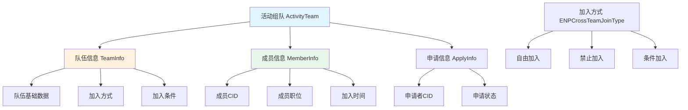
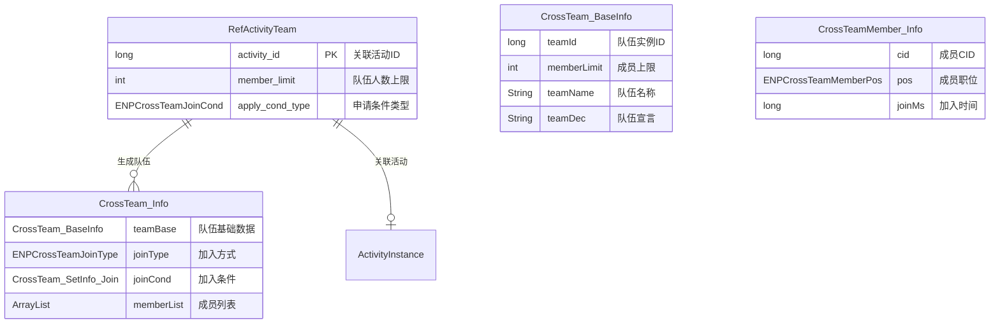
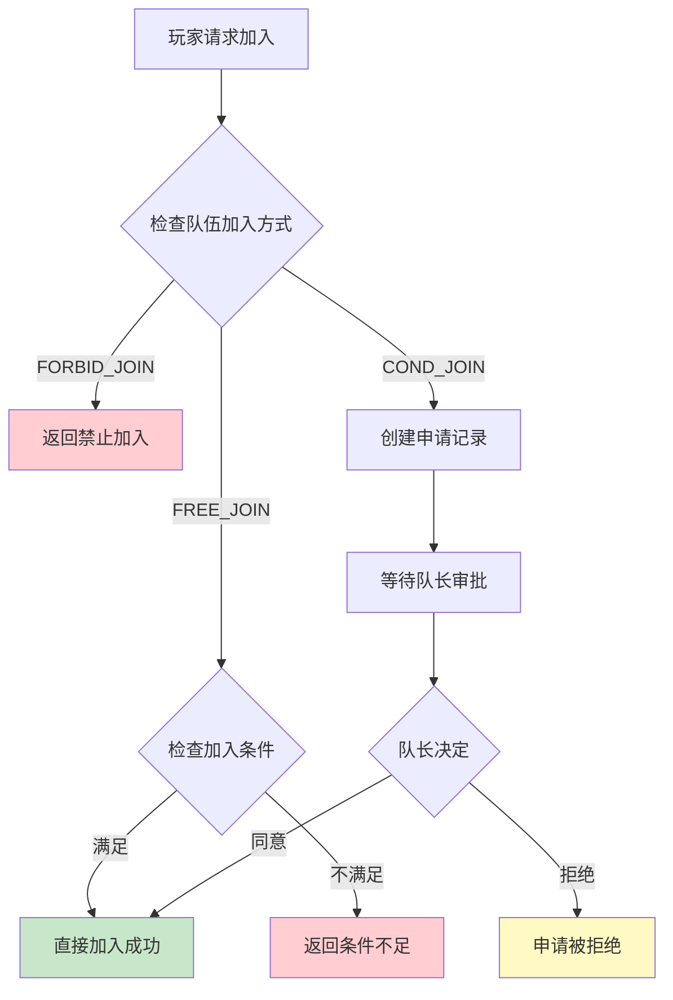
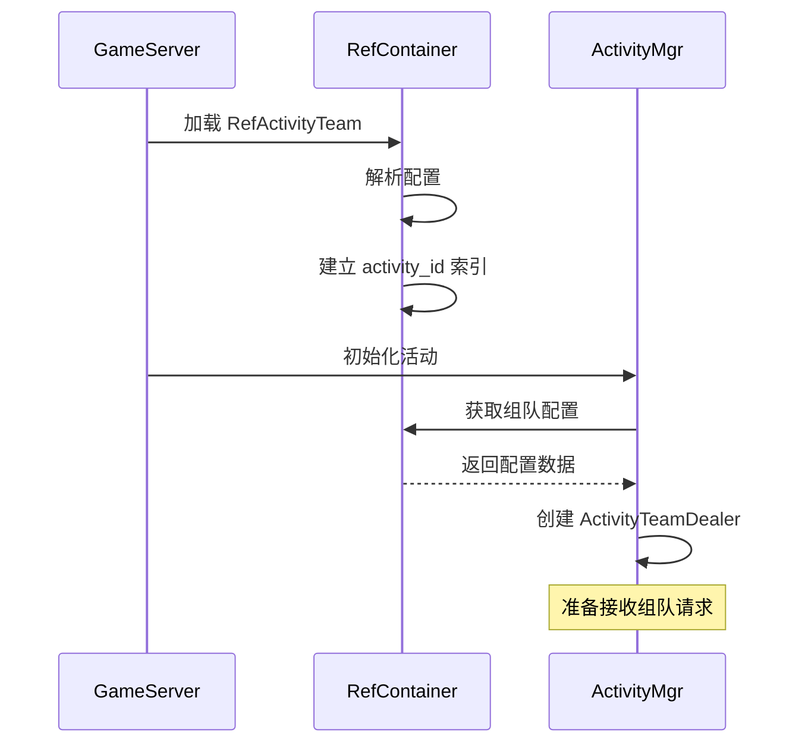

# ActivityTeamOp 模块 - 数据配表文档

## 模块概述

**模块编号**: p012
**模块名称**: ActivityTeamOp (组队活动操作)
**主要功能**: 提供活动组队相关功能，包括队伍创建、加入、退出、踢人、申请审批等

---

## 核心概念



---

## 配表文件列表

| 配表名称 | 文件路径 | 说明 |
|---------|---------|------|
| RefActivityTeam | game_server/GameRes/src/NPGameRes/Refs/Activity/RefActivityTeam.java | 组队活动配置 |

---

## 配表关系图



---

## 1. 组队活动配置 (RefActivityTeam)

**配表名**: `activity_team`

### 完整字段列表

| 字段名 | 类型 | 必填 | 默认值 | 说明 | 约束条件 |
|--------|------|------|--------|------|----------|
| activity_id | long | 是 | - | 关联活动ID（主键） | 唯一，> 0，关联有效活动配置 |
| member_limit | int | 是 | - | 队伍人数上限 | 2 - 50 |
| apply_cond_type | ENPCrossTeamJoinCond | 否 | NONE | 申请条件类型 | 枚举值有效 |

### 字段详细说明

#### activity_id（关联活动ID）

关联的活动配置ID，用于确定队伍属于哪个活动。

```java
// 获取配置
RefActivityTeam ref = RefActivityTeam.getMgr().getRef(activityId);
if (ref != null) {
    int memberLimit = ref.member_limit;
}
```

#### member_limit（队伍人数上限）

队伍最大成员数量，包括队长在内。

**取值建议**：
- 小型活动：2-5人
- 中型活动：5-20人
- 大型活动：20-50人

#### apply_cond_type（申请条件类型）

队伍加入条件的类型，与 CrossTeam_SetInfo_Join 配合使用。

| 枚举值 | 数值 | 说明 | 使用场景 |
|--------|------|------|----------|
| NONE | 0 | 无条件 | 自由加入模式 |
| MIN_POWER | 1 | 最小战力 | 需要玩家达到指定战力 |
| MIN_MARS_POWER | 2 | 最小火星战力 | 需要玩家达到指定火星战力 |

### 配置示例

```json
[
    {
        "activity_id": 10001,
        "member_limit": 5,
        "apply_cond_type": 1
    },
    {
        "activity_id": 10002,
        "member_limit": 10,
        "apply_cond_type": 0
    },
    {
        "activity_id": 10003,
        "member_limit": 20,
        "apply_cond_type": 2
    }
]
```

### 配置读取代码

**服务端**:

```java
// 获取组队活动配置
RefActivityTeam ref = RefActivityTeam.getMgr().getRef(activityId);
if (ref == null) {
    return CommErr.REF_NOT_FOUND;
}

// 获取成员上限
int memberLimit = ref.member_limit;

// 获取申请条件类型
ENPCrossTeamJoinCond condType = ref.apply_cond_type;

// 验证申请条件
if (joinCond.getCond() != ref.apply_cond_type) {
    return CommErr.REF_ERROR;
}
```

**客户端**:

```csharp
// 获取组队活动配置
GSOActivityTeamRefSet GetActivityTeamRef(long activityId)
{
    var refSet = GRefdataCoreMgr.instance.activityTeamRefSet;
    if (refSet == null) return null;

    foreach (var refObj in refSet.refList)
    {
        if (refObj.activity_id == activityId)
            return refObj;
    }
    return null;
}

// 使用示例
var teamRef = GetActivityTeamRef(10001);
if (teamRef != null)
{
    int memberLimit = teamRef.member_limit;
    ENPCrossTeamJoinCond condType = teamRef.apply_cond_type;
    Debug.Log($"队伍上限: {memberLimit}, 条件类型: {condType}");
}
```

---

## 2. 加入条件类型枚举 (ENPCrossTeamJoinCond)

### 枚举定义

```java
public enum ENPCrossTeamJoinCond {
    NONE,           // 0 - 无条件
    MIN_POWER,      // 1 - 最小战力
    MIN_MARS_POWER, // 2 - 最小火星战力
}
```

### 客户端枚举定义

```csharp
/// <summary>
/// 队伍加入条件枚举
/// </summary>
public enum ENPCrossTeamJoinCond
{
    /// <summary>无条件</summary>
    NONE = 0,

    /// <summary>最小战力</summary>
    MIN_POWER = 1,

    /// <summary>最小火星战力</summary>
    MIN_MARS_POWER = 2,
}
```

---

## 3. 加入方式枚举 (ENPCrossTeamJoinType)

### 枚举定义

```java
public enum ENPCrossTeamJoinType {
    NONE,        // 0 - 无效
    FREE_JOIN,   // 1 - 自由加入
    FORBID_JOIN, // 2 - 禁止加入
    COND_JOIN,   // 3 - 条件加入
}
```

### 客户端枚举定义

```csharp
/// <summary>
/// 队伍加入方式枚举
/// </summary>
public enum ENPCrossTeamJoinType
{
    /// <summary>无效</summary>
    NONE = 0,

    /// <summary>自由加入（无需审批）</summary>
    FREE_JOIN = 1,

    /// <summary>禁止加入（仅邀请）</summary>
    FORBID_JOIN = 2,

    /// <summary>条件加入（需审批）</summary>
    COND_JOIN = 3,
}
```

### 加入方式流程图



---

## 4. 成员职位枚举 (ENPCrossTeamMemberPos)

### 枚举定义

```java
public enum ENPCrossTeamMemberPos {
    NONE,   // 0 - 无职位（普通成员）
    LEADER, // 1 - 队长
}
```

### 客户端枚举定义

```csharp
/// <summary>
/// 队伍成员职位枚举
/// </summary>
public enum ENPCrossTeamMemberPos
{
    /// <summary>无职位（普通成员）</summary>
    NONE = 0,

    /// <summary>队长</summary>
    LEADER = 1,
}
```

---

## 数据结构定义

### CrossTeam_SetInfo_Join（加入条件）

| 字段名 | 类型 | 说明 |
|--------|------|------|
| cond | ENPCrossTeamJoinCond | 条件类型 |
| value | long | 条件值（如战力值） |

```csharp
// 客户端使用
CrossTeam_SetInfo_Join joinCond = new CrossTeam_SetInfo_Join();
joinCond.setCond(ENPCrossTeamJoinCond.MIN_POWER);
joinCond.setValue(50000); // 设置最小战力为50000
```

### CrossTeam_BaseInfo（队伍基础数据）

| 字段名 | 类型 | 说明 |
|--------|------|------|
| teamId | long | 队伍实例ID |
| memberLimit | int | 成员上限 |
| teamName | String | 队伍名称 |
| teamDec | String | 队伍宣言 |

### CrossTeam_Info（队伍完整数据）

| 字段名 | 类型 | 说明 |
|--------|------|------|
| teamBase | CrossTeam_BaseInfo | 队伍基础数据 |
| joinType | ENPCrossTeamJoinType | 加入方式 |
| joinCond | CrossTeam_SetInfo_Join | 加入条件 |
| memberList | ArrayList&lt;CrossTeamMember_Info&gt; | 成员列表 |

### CrossTeamMember_Info（成员数据）

| 字段名 | 类型 | 说明 |
|--------|------|------|
| cid | long | 成员CID |
| pos | ENPCrossTeamMemberPos | 成员职位 |
| joinMs | long | 加入时间（毫秒时间戳） |

---

## 数据校验规则

### 队伍配置校验

| 字段名 | 校验规则 | 异常处理 |
|--------|----------|----------|
| activity_id | 必须关联有效活动 | 加载时校验 |
| member_limit | 范围 2-50 | 强制限制范围 |
| apply_cond_type | 枚举值有效 | 默认为 NONE |

### 创建队伍参数校验

| 字段名 | 校验规则 | 错误码 |
|--------|----------|--------|
| teamName | 长度 1-20，无敏感词 | 70010 |
| teamDec | 长度 0-100，无敏感词 | 70010 |
| joinType | 枚举值有效 | REF_ERROR |
| joinCond.cond | 必须与配置一致 | REF_ERROR |

---

## 配置加载流程



---

## 配置文件位置

```
game_server/GameRes/src/NPGameRes/Refs/Activity/
└── RefActivityTeam.java          # 组队活动配置

game_server/ServerProtocol/src/Common/CrossTeamEnum/
├── ENPCrossTeamJoinType.java     # 加入方式枚举
├── ENPCrossTeamJoinCond.java     # 加入条件枚举
└── ENPCrossTeamMemberPos.java    # 成员职位枚举

game_server/ServerProtocol/src/Common/CrossTeamObj/
├── CrossTeam_Info.java           # 队伍数据
├── CrossTeam_BaseInfo.java       # 队伍基础数据
├── CrossTeam_SetInfo_Join.java   # 加入条件
└── CrossTeamMember_Info.java     # 成员数据

game_client/Assets/Scripts/ResScripts/NPSO/GSO/Activity/
└── GSOActivityTeamRefSet.cs      # 客户端配置对象
```

---

*文档生成时间: 2026-04-12*
*文档版本: v2.0.0*
