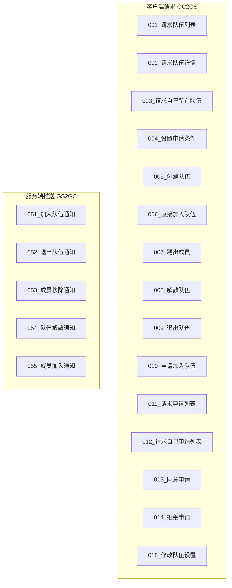
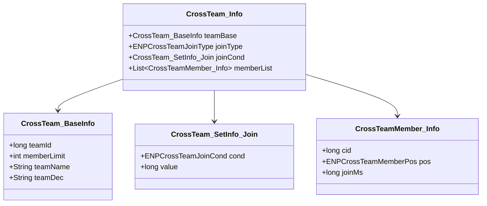
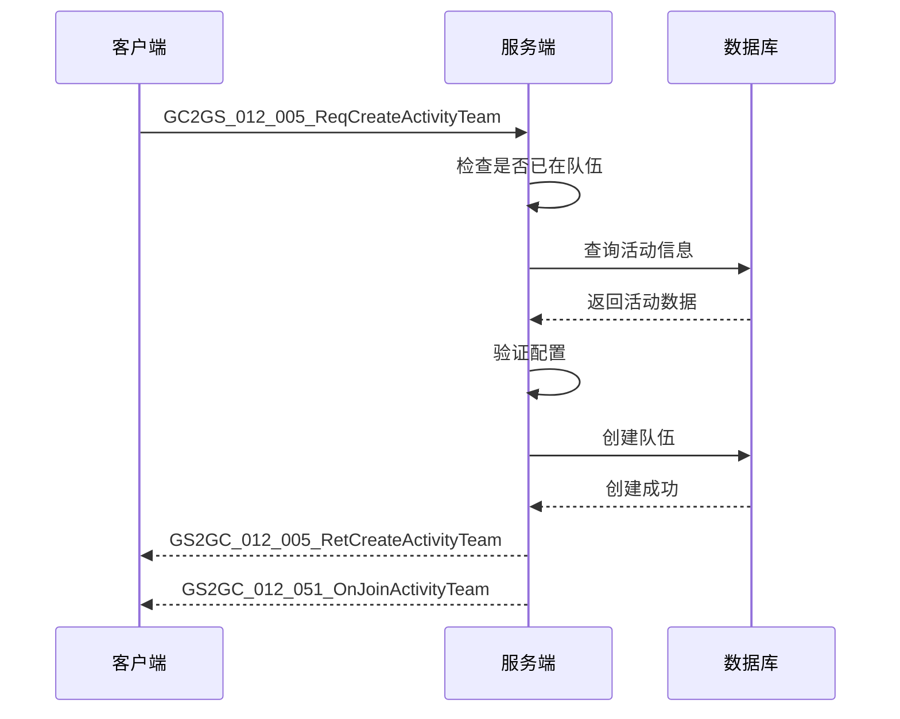
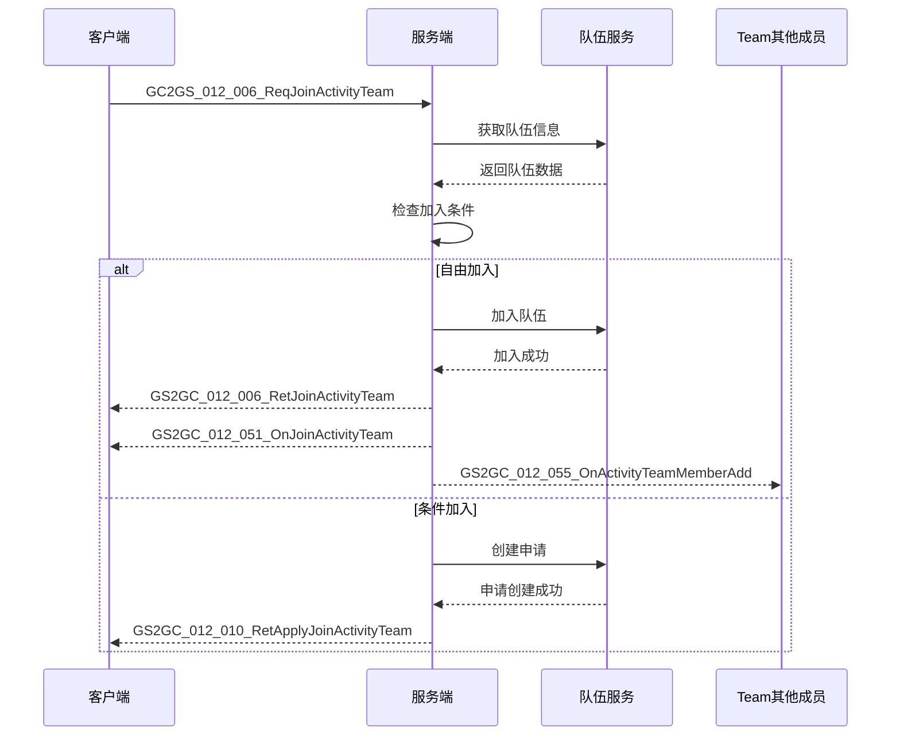
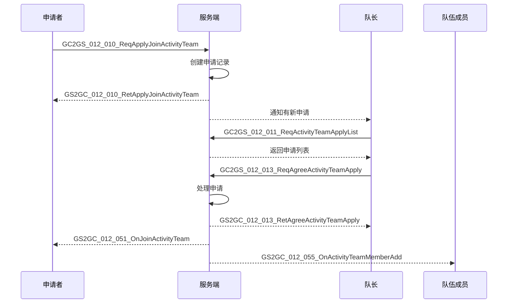

# ActivityTeamOp 模块 - 协议文档

## 协议编号

模块编号：p012 (ActivityTeamOp)

---

## 协议结构图

---

## 客户端请求协议 (GC2GS)

### GC2GS_012_001_ReqActivityTeamList

**说明**：请求活动队伍列表

**协议路径**：`GC2GS/p012_ActivityTeamOp/GC2GS_012_001_ReqActivityTeamList.java`

**请求参数**：

| 字段名 | 类型 | 必填 | 说明 |
|-------|------|------|------|
| instanceId | long | 是 | 活动实例ID |
| page | int | 是 | 页码（从1开始） |

**返回**：GS2GC_012_001_RetActivityTeamList

**返回参数**：

| 字段名 | 类型 | 说明 |
|-------|------|------|
| teamList | ArrayList&lt;CrossTeam_Info&gt; | 队伍列表 |
| totalPage | int | 总页数 |

**错误码**：

| 错误码 | 说明 |
|-------|------|
| 70001 | 活动不存在 |

---

### GC2GS_012_002_ReqActivityTeam

**说明**：请求队伍详情

**协议路径**：`GC2GS/p012_ActivityTeamOp/GC2GS_012_002_ReqActivityTeam.java`

**请求参数**：

| 字段名 | 类型 | 必填 | 说明 |
|-------|------|------|------|
| teamId | long | 是 | 队伍ID |

**返回**：GS2GC_012_002_RetActivityTeam

**返回参数**：

| 字段名 | 类型 | 说明 |
|-------|------|------|
| team | CrossTeam_Info | 队伍信息 |

**错误码**：

| 错误码 | 说明 |
|-------|------|
| 70001 | 队伍不存在 |

---

### GC2GS_012_003_ReqSelfActivityTeam

**说明**：请求自己所在队伍

**协议路径**：`GC2GS/p012_ActivityTeamOp/GC2GS_012_003_ReqSelfActivityTeam.java`

**请求参数**：

| 字段名 | 类型 | 必填 | 说明 |
|-------|------|------|------|
| instanceId | long | 是 | 活动实例ID |

**返回**：GS2GC_012_003_RetSelfActivityTeam

**返回参数**：

| 字段名 | 类型 | 说明 |
|-------|------|------|
| team | CrossTeam_Info | 队伍信息（不在队伍时为null） |

---

### GC2GS_012_004_ReqSetActivityTeamApplyCond

**说明**：设置队伍申请条件

**协议路径**：`GC2GS/p012_ActivityTeamOp/GC2GS_012_004_ReqSetActivityTeamApplyCond.java`

**请求参数**：

| 字段名 | 类型 | 必填 | 说明 |
|-------|------|------|------|
| teamId | long | 是 | 队伍ID |
| applyCond | CrossTeam_SetInfo_Join | 是 | 申请条件 |

**返回**：GS2GC_012_004_RetSetActivityTeamApplyCond

**错误码**：

| 错误码 | 说明 |
|-------|------|
| 70001 | 队伍不存在 |
| 70004 | 无权限操作（非队长） |

---

### GC2GS_012_005_ReqCreateActivityTeam

**说明**：创建队伍

**协议路径**：`GC2GS/p012_ActivityTeamOp/GC2GS_012_005_ReqCreateActivityTeam.java`

**请求参数**：

| 字段名 | 类型 | 必填 | 说明 |
|-------|------|------|------|
| instanceId | long | 是 | 活动实例ID |
| joinType | ENPCrossTeamJoinType | 是 | 加入方式 |
| joinCond | CrossTeam_SetInfo_Join | 是 | 加入条件 |
| teamName | String | 是 | 队伍名称（1-20字符） |
| teamDec | String | 否 | 队伍宣言（0-100字符） |

**返回**：GS2GC_012_005_RetCreateActivityTeam

**错误码**：

| 错误码 | 说明 |
|-------|------|
| 70001 | 活动不存在 |
| 70002 | 已在队伍中 |
| 70010 | 队伍名称不合法 |

---

### GC2GS_012_006_ReqJoinActivityTeam

**说明**：直接加入队伍（自由加入模式）

**协议路径**：`GC2GS/p012_ActivityTeamOp/GC2GS_012_006_ReqJoinActivityTeam.java`

**请求参数**：

| 字段名 | 类型 | 必填 | 说明 |
|-------|------|------|------|
| teamId | long | 是 | 队伍ID |

**返回**：GS2GC_012_006_RetJoinActivityTeam

**错误码**：

| 错误码 | 说明 |
|-------|------|
| 70001 | 队伍不存在 |
| 70002 | 已在队伍中 |
| 70003 | 队伍已满 |
| 70005 | 不满足加入条件 |
| 70011 | 此队伍不支持自由加入 |

---

### GC2GS_012_007_ReqKickActivityTeamPlayer

**说明**：踢出队伍成员

**协议路径**：`GC2GS/p012_ActivityTeamOp/GC2GS_012_007_ReqKickActivityTeamPlayer.java`

**请求参数**：

| 字段名 | 类型 | 必填 | 说明 |
|-------|------|------|------|
| teamId | long | 是 | 队伍ID |
| kickCid | long | 是 | 被踢出玩家CID |

**返回**：GS2GC_012_007_RetKickActivityTeamPlayer

**错误码**：

| 错误码 | 说明 |
|-------|------|
| 70001 | 队伍不存在 |
| 70004 | 无权限操作（非队长） |
| 70008 | 成员不存在 |
| 70009 | 不能踢出自己 |

---

### GC2GS_012_008_ReqDissolveActivityTeam

**说明**：解散队伍

**协议路径**：`GC2GS/p012_ActivityTeamOp/GC2GS_012_008_ReqDissolveActivityTeam.java`

**请求参数**：

| 字段名 | 类型 | 必填 | 说明 |
|-------|------|------|------|
| teamId | long | 是 | 队伍ID |

**返回**：GS2GC_012_008_RetDissolveActivityTeam

**错误码**：

| 错误码 | 说明 |
|-------|------|
| 70001 | 队伍不存在 |
| 70004 | 无权限操作（非队长） |

---

### GC2GS_012_009_ReqQuitActivityTeam

**说明**：退出队伍

**协议路径**：`GC2GS/p012_ActivityTeamOp/GC2GS_012_009_ReqQuitActivityTeam.java`

**请求参数**：

| 字段名 | 类型 | 必填 | 说明 |
|-------|------|------|------|
| teamId | long | 是 | 队伍ID |

**返回**：GS2GC_012_009_RetQuitActivityTeam

**错误码**：

| 错误码 | 说明 |
|-------|------|
| 70001 | 队伍不存在 |
| 70002 | 不在队伍中 |

---

### GC2GS_012_010_ReqApplyJoinActivityTeam

**说明**：申请加入队伍（条件加入模式）

**协议路径**：`GC2GS/p012_ActivityTeamOp/GC2GS_012_010_ReqApplyJoinActivityTeam.java`

**请求参数**：

| 字段名 | 类型 | 必填 | 说明 |
|-------|------|------|------|
| teamId | long | 是 | 队伍ID |

**返回**：GS2GC_012_010_RetApplyJoinActivityTeam

**错误码**：

| 错误码 | 说明 |
|-------|------|
| 70001 | 队伍不存在 |
| 70002 | 已在队伍中 |
| 70003 | 队伍已满 |
| 70005 | 不满足加入条件 |
| 70006 | 已有待处理申请 |
| 70012 | 此队伍不支持申请加入 |

---

### GC2GS_012_011_ReqActivityTeamApplyList

**说明**：请求队伍申请列表

**协议路径**：`GC2GS/p012_ActivityTeamOp/GC2GS_012_011_ReqActivityTeamApplyList.java`

**请求参数**：

| 字段名 | 类型 | 必填 | 说明 |
|-------|------|------|------|
| teamId | long | 是 | 队伍ID |

**返回**：GS2GC_012_011_RetActivityTeamApplyList

**返回参数**：

| 字段名 | 类型 | 说明 |
|-------|------|------|
| applyList | ArrayList&lt;TeamApplyInfo&gt; | 申请列表 |

**错误码**：

| 错误码 | 说明 |
|-------|------|
| 70001 | 队伍不存在 |
| 70004 | 无权限操作（非队长） |

---

### GC2GS_012_012_ReqSelfActivityTeamApplyList

**说明**：请求自己的申请列表

**协议路径**：`GC2GS/p012_ActivityTeamOp/GC2GS_012_012_ReqSelfActivityTeamApplyList.java`

**请求参数**：

| 字段名 | 类型 | 必填 | 说明 |
|-------|------|------|------|
| instanceId | long | 是 | 活动实例ID |

**返回**：GS2GC_012_012_RetSelfActivityTeamApplyList

**返回参数**：

| 字段名 | 类型 | 说明 |
|-------|------|------|
| applyList | ArrayList&lt;TeamApplyInfo&gt; | 申请列表 |

---

### GC2GS_012_013_ReqAgreeActivityTeamApply

**说明**：同意加入申请

**协议路径**：`GC2GS/p012_ActivityTeamOp/GC2GS_012_013_ReqAgreeActivityTeamApply.java`

**请求参数**：

| 字段名 | 类型 | 必填 | 说明 |
|-------|------|------|------|
| teamId | long | 是 | 队伍ID |
| applyCid | long | 是 | 申请者CID |

**返回**：GS2GC_012_013_RetAgreeActivityTeamApply

**错误码**：

| 错误码 | 说明 |
|-------|------|
| 70001 | 队伍不存在 |
| 70003 | 队伍已满 |
| 70004 | 无权限操作 |
| 70006 | 申请不存在 |
| 70007 | 申请已处理 |

---

### GC2GS_012_014_ReqRefuseActivityTeamApply

**说明**：拒绝加入申请

**协议路径**：`GC2GS/p012_ActivityTeamOp/GC2GS_012_014_ReqRefuseActivityTeamApply.java`

**请求参数**：

| 字段名 | 类型 | 必填 | 说明 |
|-------|------|------|------|
| teamId | long | 是 | 队伍ID |
| applyCid | long | 是 | 申请者CID |

**返回**：GS2GC_012_014_RetRefuseActivityTeamApply

**错误码**：

| 错误码 | 说明 |
|-------|------|
| 70001 | 队伍不存在 |
| 70004 | 无权限操作 |
| 70006 | 申请不存在 |
| 70007 | 申请已处理 |

---

### GC2GS_012_015_ReqSetActivityTeamSetting

**说明**：修改队伍设置

**协议路径**：`GC2GS/p012_ActivityTeamOp/GC2GS_012_015_ReqSetActivityTeamSetting.java`

**请求参数**：

| 字段名 | 类型 | 必填 | 说明 |
|-------|------|------|------|
| teamId | long | 是 | 队伍ID |
| teamName | String | 是 | 队伍名称 |
| teamDec | String | 否 | 队伍宣言 |
| joinType | ENPCrossTeamJoinType | 是 | 加入方式 |
| applyCond | CrossTeam_SetInfo_Join | 是 | 申请条件 |

**返回**：GS2GC_012_015_RetSetActivityTeamSetting

**错误码**：

| 错误码 | 说明 |
|-------|------|
| 70001 | 队伍不存在 |
| 70004 | 无权限操作 |
| 70010 | 队伍名称不合法 |

---

## 服务端推送协议 (GS2GC)

### GS2GC_012_051_OnJoinActivityTeam

**说明**：通知加入队伍

**协议路径**：`GS2GC/p012_ActivityTeamOp/GS2GC_012_051_OnJoinActivityTeam.java`

**参数**：

| 字段名 | 类型 | 说明 |
|-------|------|------|
| teamId | long | 队伍ID |
| team | CrossTeam_Info | 队伍信息 |

**触发时机**：玩家成功加入队伍时

---

### GS2GC_012_052_OnQuitActivityTeam

**说明**：通知退出队伍

**协议路径**：`GS2GC/p012_ActivityTeamOp/GS2GC_012_052_OnQuitActivityTeam.java`

**参数**：

| 字段名 | 类型 | 说明 |
|-------|------|------|
| teamId | long | 队伍ID |

**触发时机**：玩家主动退出队伍时

---

### GS2GC_012_053_OnActivityTeamMemberRemove

**说明**：通知成员被移除

**协议路径**：`GS2GC/p012_ActivityTeamOp/GS2GC_012_053_OnActivityTeamMemberRemove.java`

**参数**：

| 字段名 | 类型 | 说明 |
|-------|------|------|
| teamId | long | 队伍ID |
| cid | long | 被移除成员CID |

**触发时机**：队长踢出成员时

---

### GS2GC_012_054_OnActivityTeamDissolve

**说明**：通知队伍解散

**协议路径**：`GS2GC/p012_ActivityTeamOp/GS2GC_012_054_OnActivityTeamDissolve.java`

**参数**：

| 字段名 | 类型 | 说明 |
|-------|------|------|
| teamId | long | 队伍ID |

**触发时机**：队长解散队伍或最后成员退出时

---

### GS2GC_012_055_OnActivityTeamMemberAdd

**说明**：通知新成员加入

**协议路径**：`GS2GC/p012_ActivityTeamOp/GS2GC_012_055_OnActivityTeamMemberAdd.java`

**参数**：

| 字段名 | 类型 | 说明 |
|-------|------|------|
| teamId | long | 队伍ID |
| member | CrossTeamMember_Info | 新成员信息 |

**触发时机**：新成员加入队伍时（广播给其他成员）

---

## 数据结构定义

### CrossTeam_Info（队伍完整数据）

---

## 协议交互流程

### 创建队伍流程

### 加入队伍流程

### 申请审批流程

---

## 协议路径

- 服务端协议：`game_server/ServerProtocol/src/GC2GS/p012_ActivityTeamOp/`（请求）、`game_server/ServerProtocol/src/GS2GC/p012_ActivityTeamOp/`（响应）
- 客户端协议：`game_client/Assets/Scripts/ClientProtocol/GC2GS/p012_ActivityTeamOp/`、`game_client/Assets/Scripts/ClientProtocol/GS2GC/p012_ActivityTeamOp/`
- 公共对象：`game_server/ServerProtocol/src/Common/CrossTeamObj/`、`game_server/ServerProtocol/src/Common/CrossTeamEnum/`

---

*文档生成时间: 2026-04-12*
*文档版本: v2.0.0*
