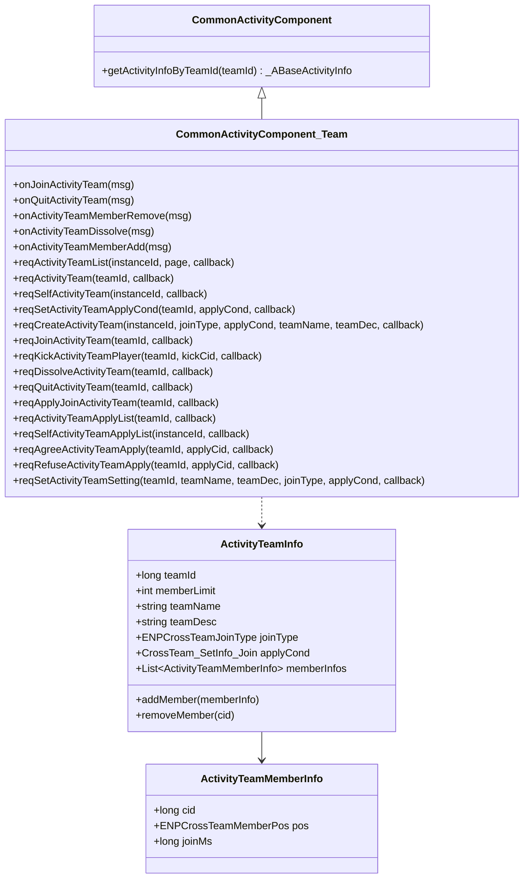
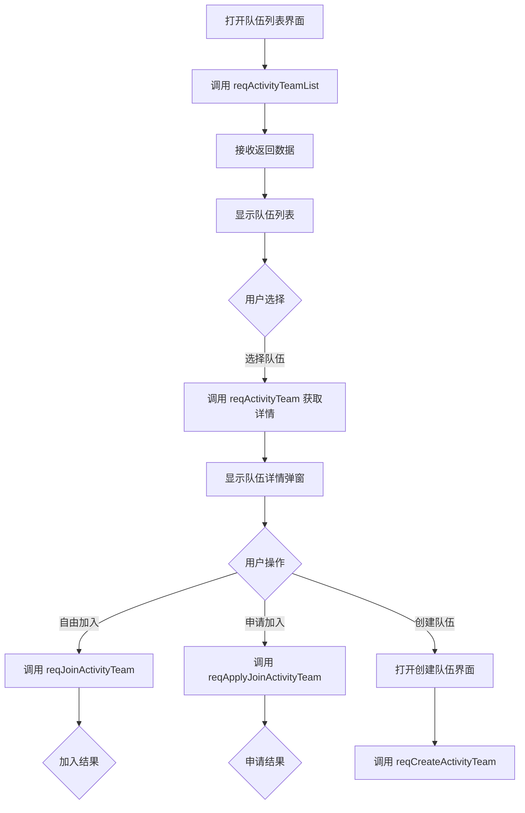
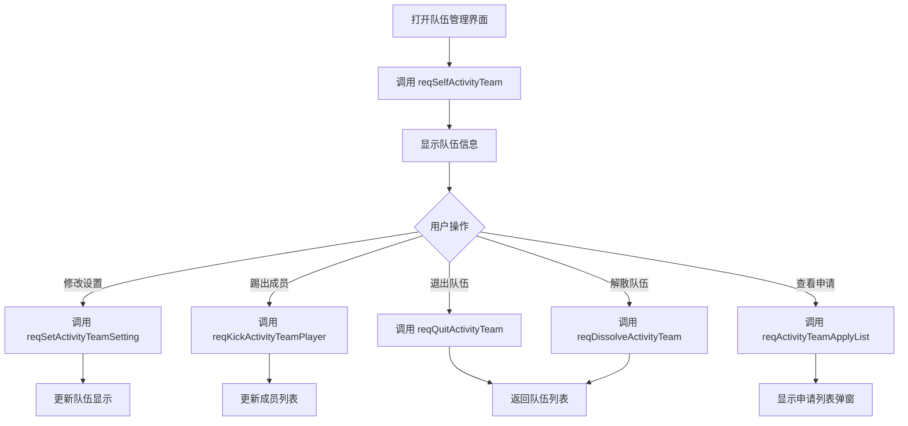

# ActivityTeamOp 模块 - 客户端开发文档

## 客户端架构

### 目录结构

```
game_client/Assets/Scripts/
├── ClientProtocol/
│   ├── GC2GS/p012_ActivityTeamOp/          # 请求协议
│   │   ├── GC2GS_012_001_ReqActivityTeamList.cs
│   │   ├── GC2GS_012_002_ReqActivityTeam.cs
│   │   ├── GC2GS_012_003_ReqSelfActivityTeam.cs
│   │   ├── GC2GS_012_004_ReqSetActivityTeamApplyCond.cs
│   │   ├── GC2GS_012_005_ReqCreateActivityTeam.cs
│   │   ├── GC2GS_012_006_ReqJoinActivityTeam.cs
│   │   ├── GC2GS_012_007_ReqKickActivityTeamPlayer.cs
│   │   ├── GC2GS_012_008_ReqDissolveActivityTeam.cs
│   │   ├── GC2GS_012_009_ReqQuitActivityTeam.cs
│   │   ├── GC2GS_012_010_ReqApplyJoinActivityTeam.cs
│   │   ├── GC2GS_012_011_ReqActivityTeamApplyList.cs
│   │   ├── GC2GS_012_012_ReqSelfActivityTeamApplyList.cs
│   │   ├── GC2GS_012_013_ReqAgreeActivityTeamApply.cs
│   │   ├── GC2GS_012_014_ReqRefuseActivityTeamApply.cs
│   │   └── GC2GS_012_015_ReqSetActivityTeamSetting.cs
│   └── GS2GC/p012_ActivityTeamOp/          # 推送协议
│       ├── GS2GC_012_051_OnJoinActivityTeam.cs
│       ├── GS2GC_012_052_OnQuitActivityTeam.cs
│       ├── GS2GC_012_053_OnActivityTeamMemberRemove.cs
│       ├── GS2GC_012_054_OnActivityTeamDissolve.cs
│       └── GS2GC_012_055_OnActivityTeamMemberAdd.cs
├── LogicScripts/
│   ├── GameComponent/CommonActivity/
│   │   ├── CommonActivityComponent_Team.cs # 组队组件
│   │   └── Base/
│   │       ├── ActivityTeamInfo.cs         # 队伍信息类
│   │       ├── ActivityTeamMemberInfo.cs   # 成员信息类
│   │       └── _ABaseTeamActivityInfo.cs   # 组队活动基类
│   └── NPGSClientListener/
│       ├── MainDealer/
│       │   └── GSMainDealer_012_ActivityTeamOp.cs
│       └── SubDealer/p012_ActivityTeamOp/
│           ├── GSSubDealer_012_051_OnJoinActivityTeam.cs
│           ├── GSSubDealer_012_052_OnQuitActivityTeam.cs
│           ├── GSSubDealer_012_053_OnActivityTeamMemberRemove.cs
│           ├── GSSubDealer_012_054_OnActivityTeamDissolve.cs
│           └── GSSubDealer_012_055_OnActivityTeamMemberAdd.cs
└── ResScripts/NPSO/GSO/Activity/
    └── GSOActivityTeamRefSet.cs            # 配置对象
```

---

## 核心组件

### CommonActivityComponent_Team

**文件位置**: `GameComponent/CommonActivity/CommonActivityComponent_Team.cs`

组队功能通过 CommonActivity 组件的扩展方法实现。

### 类图



---

## API 接口

### C2S 请求接口

#### 获取队伍列表

```csharp
/// <summary>
/// 请求活动队伍列表
/// </summary>
/// <param name="_instanceId">活动实例ID</param>
/// <param name="_page">页码（从1开始）</param>
/// <param name="_callback">回调函数</param>
public void reqActivityTeamList(long _instanceId, int _page,
    Action<GS2GC_012_001_RetActivityTeamList> _callback)
```

#### 获取队伍详情

```csharp
/// <summary>
/// 请求活动队伍信息
/// </summary>
/// <param name="_teamId">队伍ID</param>
/// <param name="_callback">回调函数</param>
public void reqActivityTeam(long _teamId,
    Action<GS2GC_012_002_RetActivityTeam> _callback)
```

#### 获取自己所在队伍

```csharp
/// <summary>
/// 请求玩家自身队伍数据
/// </summary>
/// <param name="_instanceId">活动实例ID</param>
/// <param name="_callback">回调函数</param>
public void reqSelfActivityTeam(long _instanceId,
    Action<GS2GC_012_003_RetSelfActivityTeam> _callback)
```

#### 创建队伍

```csharp
/// <summary>
/// 创建活动队伍
/// </summary>
/// <param name="_instanceId">活动实例ID</param>
/// <param name="_joinType">加入方式</param>
/// <param name="_applyCond">申请条件</param>
/// <param name="_teamName">队伍名称</param>
/// <param name="_teamDec">队伍宣言</param>
/// <param name="_callback">回调函数</param>
public void reqCreateActivityTeam(long _instanceId,
    ENPCrossTeamJoinType _joinType,
    CrossTeam_SetInfo_Join _applyCond,
    string _teamName, string _teamDec,
    Action<GS2GC_012_005_RetCreateActivityTeam> _callback)
```

#### 加入队伍

```csharp
/// <summary>
/// 请求加入活动队伍（自由加入模式）
/// </summary>
/// <param name="_teamId">队伍ID</param>
/// <param name="_callback">回调函数</param>
public void reqJoinActivityTeam(long _teamId,
    Action<GS2GC_012_006_RetJoinActivityTeam> _callback)

/// <summary>
/// 请求申请加入活动队伍（条件加入模式）
/// </summary>
/// <param name="_teamId">队伍ID</param>
/// <param name="_callback">回调函数</param>
public void reqApplyJoinActivityTeam(long _teamId,
    Action<GS2GC_012_010_RetApplyJoinActivityTeam> _callback)
```

#### 踢出成员

```csharp
/// <summary>
/// 请求踢出活动队伍成员
/// </summary>
/// <param name="_teamId">队伍ID</param>
/// <param name="_kickCid">被踢出玩家CID</param>
/// <param name="_callback">回调函数</param>
public void reqKickActivityTeamPlayer(long _teamId, long _kickCid,
    Action<GS2GC_012_007_RetKickActivityTeamPlayer> _callback)
```

#### 解散队伍

```csharp
/// <summary>
/// 请求解散活动队伍
/// </summary>
/// <param name="_teamId">队伍ID</param>
/// <param name="_callback">回调函数</param>
public void reqDissolveActivityTeam(long _teamId,
    Action<GS2GC_012_008_RetDissolveActivityTeam> _callback)
```

#### 退出队伍

```csharp
/// <summary>
/// 请求退出活动队伍
/// </summary>
/// <param name="_teamId">队伍ID</param>
/// <param name="_callback">回调函数</param>
public void reqQuitActivityTeam(long _teamId,
    Action<GS2GC_012_009_RetQuitActivityTeam> _callback)
```

#### 申请管理

```csharp
/// <summary>
/// 请求队伍申请列表
/// </summary>
/// <param name="_teamId">队伍ID</param>
/// <param name="_callback">回调函数</param>
public void reqActivityTeamApplyList(long _teamId,
    Action<GS2GC_012_011_RetActivityTeamApplyList> _callback)

/// <summary>
/// 请求玩家发起的队伍申请列表
/// </summary>
/// <param name="_instanceId">活动实例ID</param>
/// <param name="_callback">回调函数</param>
public void reqSelfActivityTeamApplyList(long _instanceId,
    Action<GS2GC_012_012_RetSelfActivityTeamApplyList> _callback)

/// <summary>
/// 同意玩家组队申请
/// </summary>
/// <param name="_teamId">队伍ID</param>
/// <param name="_applyCid">申请者CID</param>
/// <param name="_callback">回调函数</param>
public void reqAgreeActivityTeamApply(long _teamId, long _applyCid,
    Action<GS2GC_012_013_RetAgreeActivityTeamApply> _callback)

/// <summary>
/// 拒绝玩家组队申请
/// </summary>
/// <param name="_teamId">队伍ID</param>
/// <param name="_applyCid">申请者CID</param>
/// <param name="_callback">回调函数</param>
public void reqRefuseActivityTeamApply(long _teamId, long _applyCid,
    Action<GS2GC_012_014_RetRefuseActivityTeamApply> _callback)
```

#### 修改队伍设置

```csharp
/// <summary>
/// 修改队伍设置
/// </summary>
/// <param name="_teamId">队伍ID</param>
/// <param name="_teamName">队伍名称</param>
/// <param name="_teamDec">队伍宣言</param>
/// <param name="_joinType">加入方式</param>
/// <param name="_applyCond">申请条件</param>
/// <param name="_callback">回调函数</param>
public void reqSetActivityTeamSetting(long _teamId, string _teamName,
    string _teamDec, ENPCrossTeamJoinType _joinType,
    CrossTeam_SetInfo_Join _applyCond,
    Action<GS2GC_012_015_RetSetActivityTeamSetting> _callback)
```

---

### S2C 监听接口

```csharp
/// <summary>
/// 加入队伍通知
/// </summary>
public void onJoinActivityTeam(GS2GC_012_051_OnJoinActivityTeam _msg)

/// <summary>
/// 退出队伍通知
/// </summary>
public void onQuitActivityTeam(GS2GC_012_052_OnQuitActivityTeam _msg)

/// <summary>
/// 成员移除通知
/// </summary>
public void onActivityTeamMemberRemove(GS2GC_012_053_OnActivityTeamMemberRemove _msg)

/// <summary>
/// 队伍解散通知
/// </summary>
public void onActivityTeamDissolve(GS2GC_012_054_OnActivityTeamDissolve _msg)

/// <summary>
/// 成员加入通知
/// </summary>
public void onActivityTeamMemberAdd(GS2GC_012_055_OnActivityTeamMemberAdd _msg)
```

---

## 使用示例

### 创建队伍

```csharp
// 创建组队活动队伍
public void CreateTeam(long activityInstanceId)
{
    // 创建加入条件
    var joinCond = new CrossTeam_SetInfo_Join();
    joinCond.setCond(ENPCrossTeamJoinCond.MIN_POWER);  // 最小战力条件
    joinCond.setValue(50000);  // 设置战力值为50000

    // 发送创建队伍请求
    CommonActivityComponent.Instance.reqCreateActivityTeam(
        activityInstanceId,
        ENPCrossTeamJoinType.COND_JOIN,  // 条件加入（需审批）
        joinCond,
        "无敌战队",       // 队伍名称
        "欢迎强力玩家加入！",  // 队伍宣言
        (msg) =>
        {
            if (msg != null && msg.getErrCode() == 0)
            {
                Debug.Log("队伍创建成功！");
            }
            else
            {
                Debug.Log($"队伍创建失败，错误码: {msg?.getErrCode()}");
            }
        }
    );
}
```

### 自由加入队伍

```csharp
// 自由加入队伍
public void JoinTeamFree(long teamId)
{
    CommonActivityComponent.Instance.reqJoinActivityTeam(teamId, (msg) =>
    {
        if (msg != null && msg.getErrCode() == 0)
        {
            Debug.Log("加入队伍成功！");
        }
        else
        {
            Debug.Log($"加入失败，错误码: {msg?.getErrCode()}");
        }
    });
}
```

### 申请加入队伍

```csharp
// 申请加入队伍（需审批）
public void ApplyJoinTeam(long teamId)
{
    CommonActivityComponent.Instance.reqApplyJoinActivityTeam(teamId, (msg) =>
    {
        if (msg != null && msg.getErrCode() == 0)
        {
            Debug.Log("申请已发送，等待队长审批");
        }
        else
        {
            Debug.Log($"申请失败，错误码: {msg?.getErrCode()}");
        }
    });
}
```

### 踢出成员

```csharp
// 队长踢出成员
public void KickMember(long teamId, long kickCid)
{
    CommonActivityComponent.Instance.reqKickActivityTeamPlayer(teamId, kickCid, (msg) =>
    {
        if (msg != null && msg.getErrCode() == 0)
        {
            Debug.Log($"已将玩家 {kickCid} 移出队伍");
        }
        else
        {
            Debug.Log($"踢出失败，错误码: {msg?.getErrCode()}");
        }
    });
}
```

### 退出队伍

```csharp
// 退出队伍
public void QuitTeam(long teamId)
{
    CommonActivityComponent.Instance.reqQuitActivityTeam(teamId, (msg) =>
    {
        if (msg != null && msg.getErrCode() == 0)
        {
            Debug.Log("已退出队伍");
        }
        else
        {
            Debug.Log($"退出失败，错误码: {msg?.getErrCode()}");
        }
    });
}
```

### 解散队伍

```csharp
// 队长解散队伍
public void DissolveTeam(long teamId)
{
    CommonActivityComponent.Instance.reqDissolveActivityTeam(teamId, (msg) =>
    {
        if (msg != null && msg.getErrCode() == 0)
        {
            Debug.Log("队伍已解散");
        }
        else
        {
            Debug.Log($"解散失败，错误码: {msg?.getErrCode()}");
        }
    });
}
```

### 审批申请

```csharp
// 队长审批申请
public void ApproveApply(long teamId, long applyCid, bool agree)
{
    if (agree)
    {
        // 同意申请
        CommonActivityComponent.Instance.reqAgreeActivityTeamApply(teamId, applyCid, (msg) =>
        {
            if (msg != null && msg.getErrCode() == 0)
            {
                Debug.Log("已同意申请");
            }
            else
            {
                Debug.Log($"操作失败，错误码: {msg?.getErrCode()}");
            }
        });
    }
    else
    {
        // 拒绝申请
        CommonActivityComponent.Instance.reqRefuseActivityTeamApply(teamId, applyCid, (msg) =>
        {
            if (msg != null && msg.getErrCode() == 0)
            {
                Debug.Log("已拒绝申请");
            }
            else
            {
                Debug.Log($"操作失败，错误码: {msg?.getErrCode()}");
            }
        });
    }
}
```

### 修改队伍设置

```csharp
// 修改队伍设置
public void UpdateTeamSetting(long teamId)
{
    var newJoinCond = new CrossTeam_SetInfo_Join();
    newJoinCond.setCond(ENPCrossTeamJoinCond.NONE);  // 无条件
    newJoinCond.setValue(0);

    CommonActivityComponent.Instance.reqSetActivityTeamSetting(
        teamId,
        "新的队伍名称",     // 新队伍名称
        "新的队伍宣言",     // 新队伍宣言
        ENPCrossTeamJoinType.FREE_JOIN,  // 改为自由加入
        newJoinCond,
        (msg) =>
        {
            if (msg != null && msg.getErrCode() == 0)
            {
                Debug.Log("队伍设置已更新");
            }
            else
            {
                Debug.Log($"更新失败，错误码: {msg?.getErrCode()}");
            }
        }
    );
}
```

---

## 数据模型

### ActivityTeamInfo（队伍信息）

```csharp
public class ActivityTeamInfo
{
    /// <summary>队伍ID</summary>
    public long teamId { get; }

    /// <summary>队伍成员上限</summary>
    public int memberLimit { get; }

    /// <summary>队伍名称</summary>
    public string teamName { get; }

    /// <summary>队伍宣言</summary>
    public string teamDesc { get; }

    /// <summary>加入方式</summary>
    public ENPCrossTeamJoinType joinType { get; }

    /// <summary>申请条件</summary>
    public CrossTeam_SetInfo_Join applyCond { get; }

    /// <summary>成员列表</summary>
    public List<ActivityTeamMemberInfo> memberInfos { get; }

    /// <summary>添加成员</summary>
    public void addMember(CrossTeamMember_Info _teamMemberInfo)

    /// <summary>移除成员</summary>
    public void removeMember(long _cid)
}
```

### ActivityTeamMemberInfo（成员信息）

```csharp
public class ActivityTeamMemberInfo
{
    /// <summary>成员CID</summary>
    public long cid { get; }

    /// <summary>成员职位</summary>
    public ENPCrossTeamMemberPos pos { get; }

    /// <summary>加入时间（毫秒）</summary>
    public long joinMs { get; }
}
```

---

## 错误处理

### 常见错误码

| 错误码 | 说明 | 处理建议 |
|--------|------|----------|
| 70001 | 队伍不存在 | 刷新队伍列表 |
| 70002 | 已在队伍中/不在队伍中 | 刷新当前状态 |
| 70003 | 队伍已满 | 提示用户选择其他队伍 |
| 70004 | 无权限操作 | 检查是否为队长 |
| 70005 | 不满足加入条件 | 显示具体条件要求 |
| 70006 | 申请不存在 | 刷新申请列表 |
| 70007 | 申请已处理 | 刷新申请列表 |
| 70008 | 成员不存在 | 刷新队伍成员列表 |
| 70009 | 不能踢出自己 | 提示队长不能踢出自己 |
| 70010 | 队伍名称不合法 | 检查名称长度和敏感词 |

### 错误处理示例

```csharp
public void HandleErrorCode(int errCode)
{
    string message = errCode switch
    {
        70001 => "队伍不存在",
        70002 => "已在队伍中",
        70003 => "队伍已满",
        70004 => "无权限操作",
        70005 => "不满足加入条件",
        70006 => "申请不存在",
        70007 => "申请已处理",
        70008 => "成员不存在",
        70009 => "不能踢出自己",
        70010 => "队伍名称不合法",
        _ => $"未知错误: {errCode}"
    };

    UIManager.Instance.ShowToast(message);
}
```

---

## UI集成流程

### 队伍列表界面



### 队伍管理界面



---

*文档生成时间: 2026-04-12*
*文档版本: v2.0.0*
