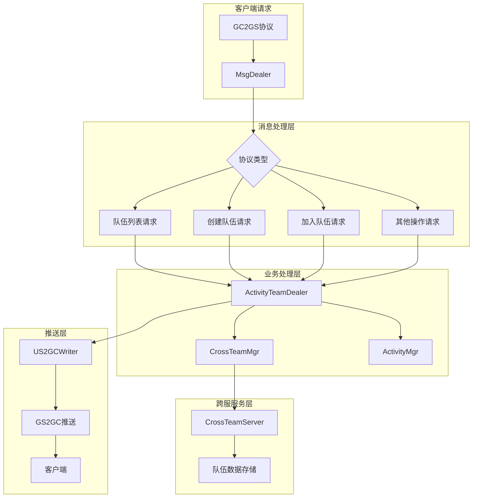
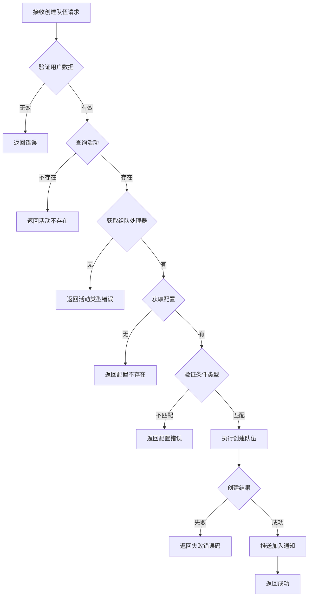
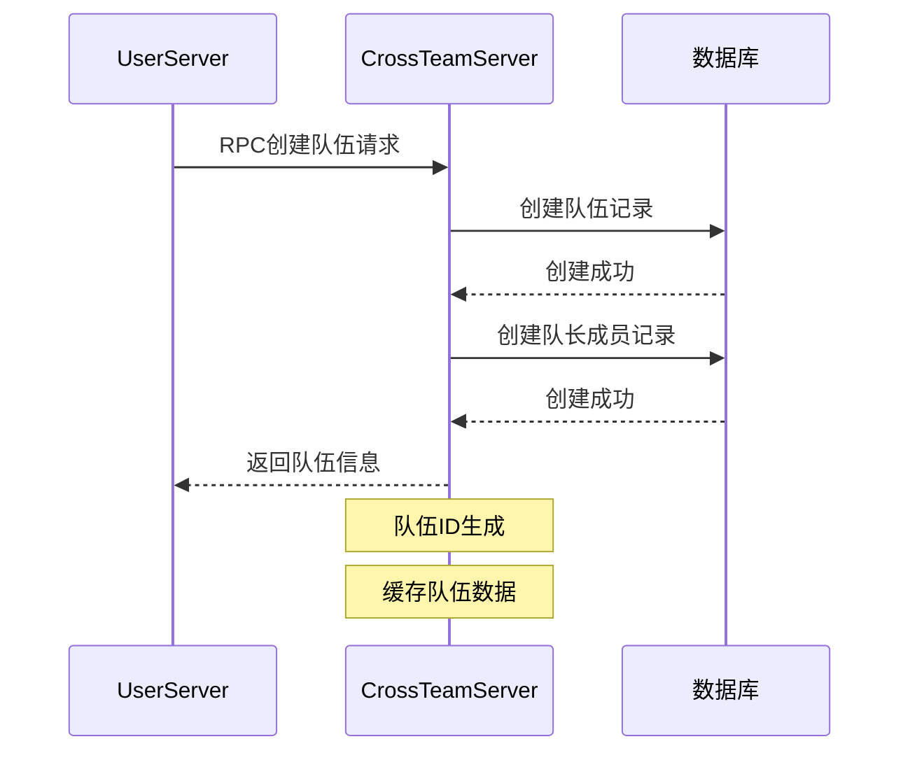
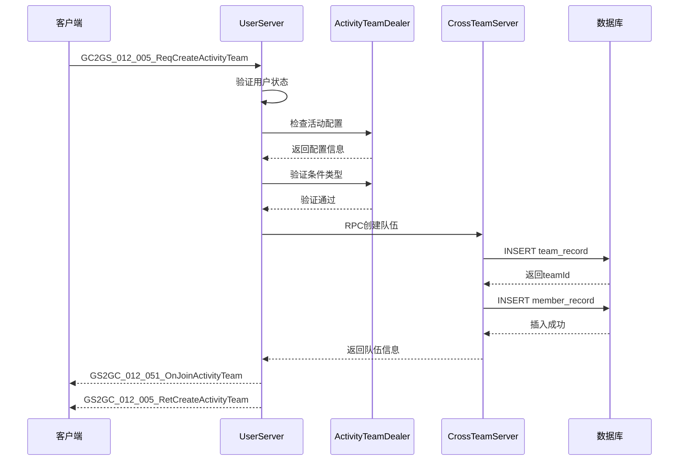
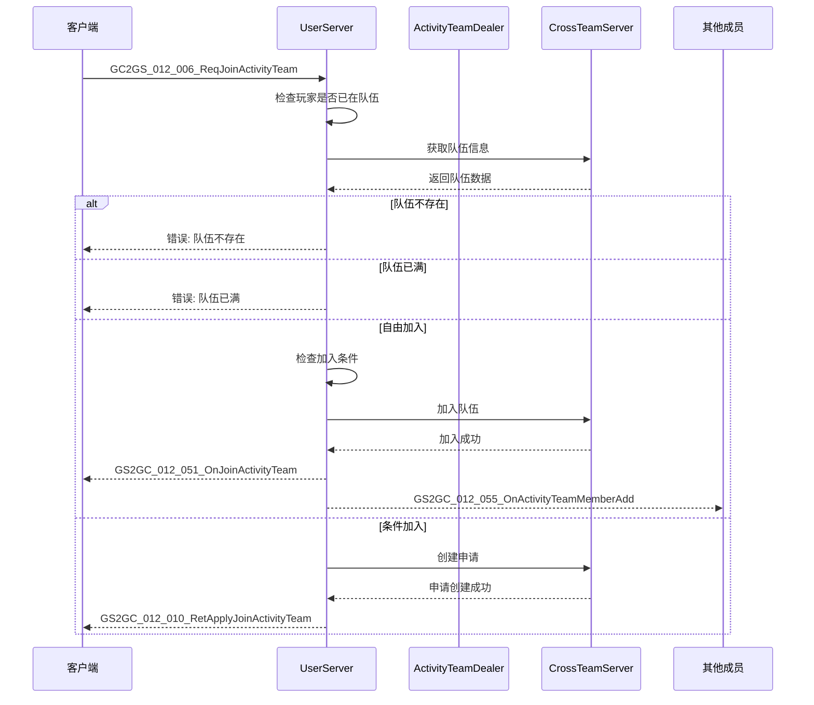
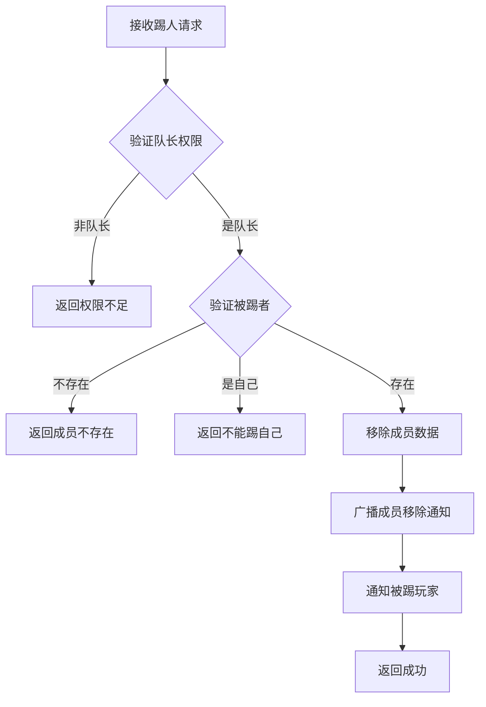

# ActivityTeamOp 模块 - 服务端开发文档

## 模块架构

### 目录结构

```
game_server/UserServer/src/NPUSServer/
├── NPUserMsgDispather/p012_ActivityTeamOp/
│   ├── MsgDealer_GC2GS_012_001_ReqActivityTeamList.java
│   ├── MsgDealer_GC2GS_012_002_ReqActivityTeam.java
│   ├── MsgDealer_GC2GS_012_003_ReqSelfActivityTeam.java
│   ├── MsgDealer_GC2GS_012_004_ReqSetActivityTeamApplyCond.java
│   ├── MsgDealer_GC2GS_012_005_ReqCreateActivityTeam.java
│   ├── MsgDealer_GC2GS_012_006_ReqJoinActivityTeam.java
│   ├── MsgDealer_GC2GS_012_007_ReqKickActivityTeamPlayer.java
│   ├── MsgDealer_GC2GS_012_008_ReqDissolveActivityTeam.java
│   ├── MsgDealer_GC2GS_012_009_ReqQuitActivityTeam.java
│   ├── MsgDealer_GC2GS_012_010_ReqApplyJoinActivityTeam.java
│   ├── MsgDealer_GC2GS_012_011_ReqActivityTeamApplyList.java
│   ├── MsgDealer_GC2GS_012_012_ReqSelfActivityTeamApplyList.java
│   ├── MsgDealer_GC2GS_012_013_ReqAgreeActivityTeamApply.java
│   ├── MsgDealer_GC2GS_012_014_ReqRefuseActivityTeamApply.java
│   ├── MsgDealer_GC2GS_012_015_ReqSetActivityTeamSetting.java
│   └── Write/
│       └── US2GCWriter_012_ActivityTeamOp.java
├── CommonActivityMgr/
│   └── Core/
│       ├── Team/
│       │   └── ActivityTeamDealer.java       # 组队业务处理器
│       └── _AActivityBase.java               # 活动基类
└── NPUSUserMgr/
    └── PlayerChatRoomDealer/
        └── PlayerChatRoomActivityTeamDealer.java
```

---

## 架构图



---

## 消息处理器

### 处理器列表

| 处理器 | 功能 | 关键逻辑 |
|--------|------|----------|
| MsgDealer_GC2GS_012_001 | 队伍列表查询 | 分页查询、筛选条件 |
| MsgDealer_GC2GS_012_002 | 队伍详情查询 | 权限验证、数据组装 |
| MsgDealer_GC2GS_012_003 | 自己所在队伍查询 | 玩家状态查询 |
| MsgDealer_GC2GS_012_004 | 设置申请条件 | 队长权限验证 |
| MsgDealer_GC2GS_012_005 | 创建队伍 | 活动验证、配置验证 |
| MsgDealer_GC2GS_012_006 | 加入队伍 | 条件检查、容量检查 |
| MsgDealer_GC2GS_012_007 | 踢出成员 | 队长权限、成员验证 |
| MsgDealer_GC2GS_012_008 | 解散队伍 | 队长权限、通知广播 |
| MsgDealer_GC2GS_012_009 | 退出队伍 | 队长转移、解散检查 |
| MsgDealer_GC2GS_012_010 | 申请加入 | 申请创建、条件检查 |
| MsgDealer_GC2GS_012_011 | 申请列表查询 | 队长权限验证 |
| MsgDealer_GC2GS_012_012 | 自己申请列表查询 | 玩家申请状态 |
| MsgDealer_GC2GS_012_013 | 同意申请 | 容量检查、状态更新 |
| MsgDealer_GC2GS_012_014 | 拒绝申请 | 状态更新、通知 |
| MsgDealer_GC2GS_012_015 | 修改队伍设置 | 队长权限、数据验证 |

---

## 关键处理器实现

### 创建队伍处理器

**文件**: `MsgDealer_GC2GS_012_005_ReqCreateActivityTeam.java`

```java
@Override
protected void _dealMessage(_ANPUSUserBasicMsgItem _commiter,
    GC2GS_012_005_ReqCreateActivityTeam _msg)
{
    NPUSUserData userData = _commiter.getUserData();
    if (null == userData)
        return;

    // 1. 检查对应的组队活动
    _AActivityBase activity = userData.getUSServer()
        .getCommActivityMgr().lookupActivity(_msg.getInstanceId());
    if (null == activity)
    {
        _commiter.commitFailRes(ActivityErr.ACTIVITY_NOT_FOUND.getCode());
        return;
    }

    // 2. 检查活动的组队接口
    ActivityTeamDealer dealer = activity.getTeamDealer();
    if (null == dealer)
    {
        _commiter.commitFailRes(ActivityErr.ACTIVITY_TYPE_ERROR.getCode());
        return;
    }

    // 3. 检查活动是否接入GameLogic
    ActivityGameLogicDealer gameLogicDealer = activity.getGameLogicDealer();
    if (null == gameLogicDealer)
    {
        _commiter.commitFailRes(CommErr.OBJ_ERR.getCode());
        return;
    }

    // 4. 检查设置数据
    RefActivityTeam ref = dealer.getRef();
    if (null == ref)
    {
        _commiter.commitFailRes(CommErr.REF_NOT_FOUND.getCode());
        return;
    }

    // 5. 验证申请条件类型是否匹配
    if (_msg.getJoinCond().getCond() != ref.apply_cond_type)
    {
        _commiter.commitFailRes(CommErr.REF_ERROR.getCode());
        return;
    }

    // 6. 执行创建队伍
    dealer.createTeam(
        userData.getCid(),
        dealer.getMemberLimit(),
        _msg.getJoinType(),
        _msg.getJoinCond(),
        _msg.getTeamName(),
        _msg.getTeamDec(),
        (_result, _team) ->
        {
            if (!_result.isSucc())
            {
                _commiter.commitFailRes(_result.getCode());
                return;
            }

            // 7. 推送数据给客户端
            userData.sendMsgToGC(
                US2GCWriter_012_ActivityTeamOp.make_051_OnJoinActivityTeam(_team));

            // 8. 返回结果
            _commiter.commitSucRes(
                US2GCWriter_012_ActivityTeamOp.make_005_RetCreateActivityTeam());
        });
}
```

### 流程图



---

## ActivityTeamDealer（组队业务处理器）

### 类定义

```java
public class ActivityTeamDealer
{
    // 关联的活动
    private _AActivityBase activity;

    // 组队配置
    private RefActivityTeam ref;

    /**
     * 获取成员上限
     */
    public int getMemberLimit() { return ref.member_limit; }

    /**
     * 获取配置
     */
    public RefActivityTeam getRef() { return ref; }

    /**
     * 创建队伍
     */
    public void createTeam(long _leaderCid, int _memberLimit,
        ENPCrossTeamJoinType _joinType, CrossTeam_SetInfo_Join _joinCond,
        String _teamName, String _teamDec,
        BiConsumer<CommResult, CrossTeam_Info> _callback)

    /**
     * 加入队伍
     */
    public void joinTeam(long _teamId, long _cid,
        BiConsumer<CommResult, CrossTeam_Info> _callback)

    /**
     * 退出队伍
     */
    public void quitTeam(long _teamId, long _cid,
        BiConsumer<CommResult, Boolean> _callback)

    /**
     * 踢出成员
     */
    public void kickMember(long _teamId, long _leaderCid, long _kickCid,
        BiConsumer<CommResult, Boolean> _callback)

    /**
     * 解散队伍
     */
    public void dissolveTeam(long _teamId, long _leaderCid,
        BiConsumer<CommResult, Boolean> _callback)
}
```

---

## 跨服队伍支持

### CrossTeamServer 集成

```
game_server/CrossTeamServer/
└── CrossTeamServer/
    ├── CrossTeam/
    │   ├── CrossTeamMgr.java           # 队伍管理器
    │   ├── CrossTeamMemberMgr.java     # 成员管理器
    │   └── CrossTeamMemberInfo.java    # 成员信息
    └── RPCDispatcher/Team/
        ├── CTSJoinTeam_Handler.java    # 加入队伍RPC
        ├── CTSQuitTeam_Handler.java    # 退出队伍RPC
        ├── CTSKickTeamPlayer_Handler.java # 踢人RPC
        └── CTSAgreeTeamApply_Handler.java # 同意申请RPC
```

### 跨服调用流程



---

## 数据存储

### 存储策略

| 数据类型 | 存储位置 | 存储时机 | 过期策略 |
|----------|----------|----------|----------|
| 队伍信息 | CrossTeamServer | 创建/修改时 | 活动结束时删除 |
| 成员信息 | CrossTeamServer | 加入/退出时 | 队伍解散时删除 |
| 申请信息 | CrossTeamServer | 申请时 | 处理/过期时删除 |

### 队伍数据结构

```java
// 队伍基础数据
public class CrossTeam_BaseInfo {
    private long teamId;        // 队伍实例ID
    private int memberLimit;    // 成员上限
    private String teamName;    // 队伍名称
    private String teamDec;     // 队伍宣言
}

// 队伍完整数据
public class CrossTeam_Info {
    private CrossTeam_BaseInfo teamBase;    // 基础数据
    private ENPCrossTeamJoinType joinType;  // 加入方式
    private CrossTeam_SetInfo_Join joinCond;// 加入条件
    private ArrayList<CrossTeamMember_Info> memberList; // 成员列表
}

// 成员数据
public class CrossTeamMember_Info {
    private long cid;                       // 成员CID
    private ENPCrossTeamMemberPos pos;      // 职位
    private long joinMs;                    // 加入时间
}
```

---

## 业务逻辑

### 创建队伍流程



### 加入队伍流程



### 踢人流程



---

## 扩展开发

### 添加新的队伍操作

**步骤1**: 定义协议文件

```java
// GC2GS/p012_ActivityTeamOp/GC2GS_012_016_ReqNewOperation.java
public class GC2GS_012_016_ReqNewOperation implements _IALProtocolStructure {
    private long teamId;
    // 新操作所需字段...
}
```

**步骤2**: 创建消息处理器

```java
public class MsgDealer_GC2GS_012_016_ReqNewOperation
    extends NPUserMsgDealer<GC2GS_012_016_ReqNewOperation>
{
    @Override
    protected void _dealMessage(_ANPUSUserBasicMsgItem _commiter,
        GC2GS_012_016_ReqNewOperation _msg)
    {
        // 实现业务逻辑
    }
}
```

**步骤3**: 注册到分发器

```java
// 在协议分发器中注册
msgDispather.register(GC2GS_012_016_ReqNewOperation.class,
    new MsgDealer_GC2GS_012_016_ReqNewOperation());
```

**步骤4**: 实现业务逻辑

```java
// 在 ActivityTeamDealer 中添加方法
public void newOperation(long _teamId, long _cid,
    BiConsumer<CommResult, Boolean> _callback)
{
    // 实现具体业务逻辑
}
```

---

## 服务端推送

### US2GCWriter 工具类

```java
public class US2GCWriter_012_ActivityTeamOp
{
    /**
     * 构造加入队伍通知
     */
    public static GS2GC_012_051_OnJoinActivityTeam make_051_OnJoinActivityTeam(
        CrossTeam_Info _team)

    /**
     * 构造退出队伍通知
     */
    public static GS2GC_012_052_OnQuitActivityTeam make_052_OnQuitActivityTeam(
        long _teamId)

    /**
     * 构造成员移除通知
     */
    public static GS2GC_012_053_OnActivityTeamMemberRemove make_053_OnActivityTeamMemberRemove(
        long _teamId, long _cid)

    /**
     * 构造队伍解散通知
     */
    public static GS2GC_012_054_OnActivityTeamDissolve make_054_OnActivityTeamDissolve(
        long _teamId)

    /**
     * 构造成员加入通知
     */
    public static GS2GC_012_055_OnActivityTeamMemberAdd make_055_OnActivityTeamMemberAdd(
        long _teamId, CrossTeamMember_Info _member)
}
```

### 广播示例

```java
// 广播给队伍所有成员
public void broadcastToTeam(CrossTeam_Info _team, ByteBuffer _msg)
{
    for (CrossTeamMember_Info member : _team.getMemberList())
    {
        NPUSUserData userData = getUserData(member.getCid());
        if (userData != null)
        {
            userData.sendMsgToGC(_msg);
        }
    }
}

// 使用示例
ByteBuffer msg = US2GCWriter_012_ActivityTeamOp.make_055_OnActivityTeamMemberAdd(
    teamId, newMember);
broadcastToTeam(team, msg);
```

---

## 错误码定义

| 错误码 | 常量名 | 说明 | HTTP状态码 |
|--------|--------|------|------------|
| 70001 | TEAM_NOT_FOUND | 队伍不存在 | 404 |
| 70002 | ALREADY_IN_TEAM / NOT_IN_TEAM | 已在/不在队伍中 | 400 |
| 70003 | TEAM_FULL | 队伍已满 | 400 |
| 70004 | NO_PERMISSION | 无权限操作 | 403 |
| 70005 | CONDITION_NOT_MET | 不满足加入条件 | 400 |
| 70006 | APPLY_NOT_FOUND | 申请不存在 | 404 |
| 70007 | APPLY_ALREADY_HANDLED | 申请已处理 | 400 |
| 70008 | MEMBER_NOT_FOUND | 成员不存在 | 404 |
| 70009 | CANNOT_KICK_SELF | 不能踢出自己 | 400 |
| 70010 | TEAM_NAME_INVALID | 队伍名称不合法 | 400 |
| 70011 | TEAM_NOT_SUPPORT_FREE_JOIN | 不支持自由加入 | 400 |
| 70012 | TEAM_NOT_SUPPORT_APPLY_JOIN | 不支持申请加入 | 400 |

---

*文档生成时间: 2026-04-12*
*文档版本: v2.0.0*
