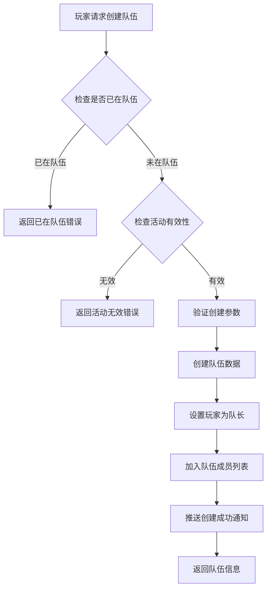
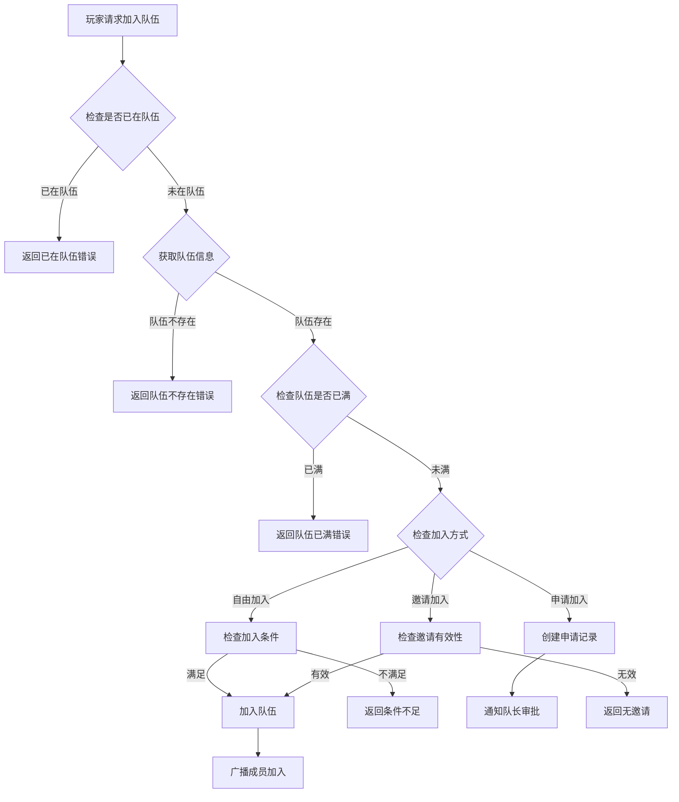
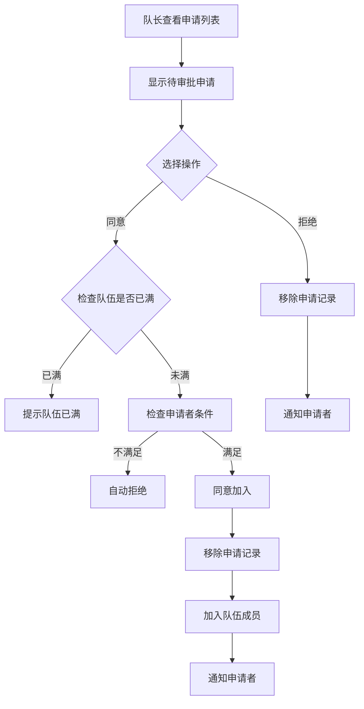
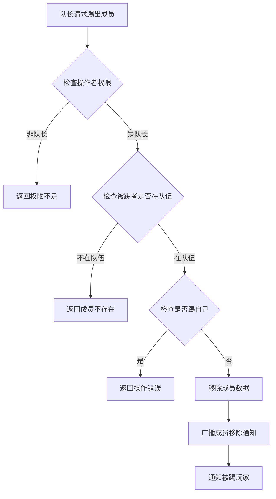
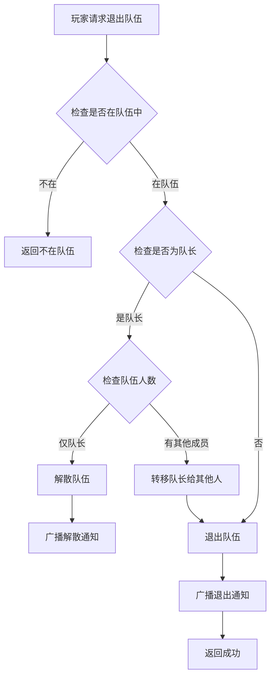

# 组队活动模块完整说明

## 一、模块概述

### 1.1 业务背景

组队活动模块为活动提供组队功能支持，允许玩家在活动中创建队伍、加入队伍、协同完成任务。通过组队玩法增强玩家社交互动，提升活动参与度和玩家粘性。

### 1.2 目标用户

- **社交型玩家**：喜欢与朋友一起游戏的玩家
- **活动参与者**：参与需要组队的活动玩家
- **公会成员**：公会组织的集体活动参与者

### 1.3 核心价值

1. **社交增强**：促进玩家间社交互动
2. **协同合作**：多人协作完成活动目标
3. **活跃提升**：组队提高活动参与意愿
4. **跨服互动**：支持跨服组队扩大社交圈

---

## 二、功能清单

### 2.1 队伍管理功能

| 功能名称 | 功能描述 | 用户价值 |
|---------|---------|---------|
| 创建队伍 | 创建新的活动队伍 | 成为队长管理队伍 |
| 解散队伍 | 队长解散队伍 | 结束队伍活动 |
| 退出队伍 | 成员退出当前队伍 | 离开不合适的队伍 |
| 队伍设置 | 修改队伍名称、宣言等 | 个性化队伍展示 |

### 2.2 成员管理功能

| 功能名称 | 功能描述 | 用户价值 |
|---------|---------|---------|
| 加入队伍 | 通过不同方式加入队伍 | 参与组队活动 |
| 踢出成员 | 队长移除队伍成员 | 管理队伍成员 |
| 申请审批 | 审核加入申请 | 控制队伍质量 |
| 成员列表 | 查看队伍所有成员 | 了解队伍情况 |

### 2.3 加入方式功能

| 功能名称 | 功能描述 | 用户价值 |
|---------|---------|---------|
| 自由加入 | 符合条件直接加入 | 快速组队 |
| 申请加入 | 需队长审批后加入 | 筛选成员 |
| 邀请加入 | 队长邀请后加入 | 定向邀请 |

### 2.4 条件设置功能

| 功能名称 | 功能描述 | 用户价值 |
|---------|---------|---------|
| 等级限制 | 设置最低/最高等级要求 | 筛选合适玩家 |
| 战力限制 | 设置最低战力要求 | 保证队伍实力 |
| 自动拒绝 | 不满足条件自动拒绝 | 提高管理效率 |

---

## 三、业务流程详解

### 3.1 创建队伍流程



**详细步骤说明**：

1. **前置校验**
   - 检查玩家是否已在队伍中
   - 检查活动是否存在且有效
   - 验证队伍名称、宣言等参数

2. **队伍创建**
   - 生成唯一队伍ID
   - 设置队伍基础信息
   - 创建者为队长

3. **数据同步**
   - 保存队伍数据
   - 推送创建通知

### 3.2 加入队伍流程



**详细步骤说明**：

1. **条件检查**
   - 验证玩家是否已在队伍
   - 验证队伍是否存在
   - 验证队伍是否已满

2. **加入处理**
   - 自由加入：检查条件直接加入
   - 申请加入：创建申请等待审批
   - 邀请加入：验证邀请后加入

3. **加入成功**
   - 更新队伍成员列表
   - 广播成员加入通知

### 3.3 申请审批流程



### 3.4 踢出成员流程



### 3.5 退出队伍流程



---

## 四、关键规则

### 4.1 队伍规则

1. **队伍人数**
   - 最小人数：1人（队长）
   - 最大人数：根据活动配置，通常为5人

2. **队伍状态**
   - 开放中：可继续加入新成员
   - 已满：无法继续加入

3. **队伍有效期**
   - 活动期间有效
   - 活动结束自动解散

### 4.2 成员规则

1. **队长权限**
   - 修改队伍设置
   - 踢出成员
   - 审批申请
   - 解散队伍

2. **成员权限**
   - 查看队伍信息
   - 退出队伍
   - 查看申请列表（如有权限）

3. **队长转移**
   - 队长退出时自动转移
   - 转移给最早加入的成员

### 4.3 加入条件规则

1. **等级条件**
   - 最低等级限制
   - 最高等级限制（可选）

2. **战力条件**
   - 最低战力限制
   - 用于筛选实力玩家

3. **其他条件**
   - VIP等级
   - 公会成员

### 4.4 申请规则

1. **申请有效期**
   - 申请创建后24小时有效
   - 超时自动失效

2. **申请数量限制**
   - 每个队伍最多100条待处理申请
   - 超出后自动拒绝新申请

---

## 五、用户故事

### 5.1 队长故事

> 作为一名活动参与者，我创建了一个队伍并设置了申请条件（等级>=30，战力>=50000）。我收到了几个申请，逐一审批后组建了一个强力队伍。活动开始后，我们配合默契，顺利完成了活动目标。

### 5.2 成员故事

> 作为一名普通玩家，我在活动界面浏览队伍列表，找到了一个适合自己的队伍。因为队伍设置的是自由加入，我直接加入了队伍。队长热情地欢迎了我，我们很快就开始了活动。

### 5.3 跨服玩家故事

> 作为一名跨服活动的参与者，我与别的服务器的玩家组队。虽然是第一次配合，但通过队伍聊天沟通战术，我们成功完成了高难度挑战，还添加了跨服好友。

---

## 六、示例

### 6.1 创建队伍示例

**输入参数**：
```
活动实例ID: 10001
队伍名称: 无敌战队
队伍宣言: 欢迎强力玩家加入！
加入方式: 申请加入
加入条件:
  - 最低等级: 30
  - 最高等级: 100
  - 最低战力: 50000
```

**创建结果**：
```
队伍ID: 900001
队伍名称: 无敌战队
队长: 玩家A (CID: 20001)
当前成员: 1人
最大成员: 5人
创建时间: 2026-04-07 10:00:00
```

### 6.2 加入队伍示例

**队伍状态**：
```
队伍ID: 900001
当前成员: 3/5人
加入方式: 申请加入
加入条件: 等级>=30, 战力>=50000
```

**申请者信息**：
```
玩家: 玩家B
等级: 45
战力: 68000
```

**处理结果**：
```
申请结果: 待审批
申请时间: 2026-04-07 10:30:00
```

### 6.3 队伍信息示例

```
队伍ID: 900001
队伍名称: 无敌战队
队伍宣言: 欢迎强力玩家加入！
队长: 玩家A
成员列表:
  1. 玩家A (队长) - 等级50 - 战力120000
  2. 玩家B - 等级45 - 战力68000
  3. 玩家C - 等级38 - 战力55000
  4. 玩家D - 等级42 - 战力72000
  5. 玩家E - 等级35 - 战力52000
队伍状态: 已满
总战力: 367000
```

---

*文档生成时间: 2026-04-07*
