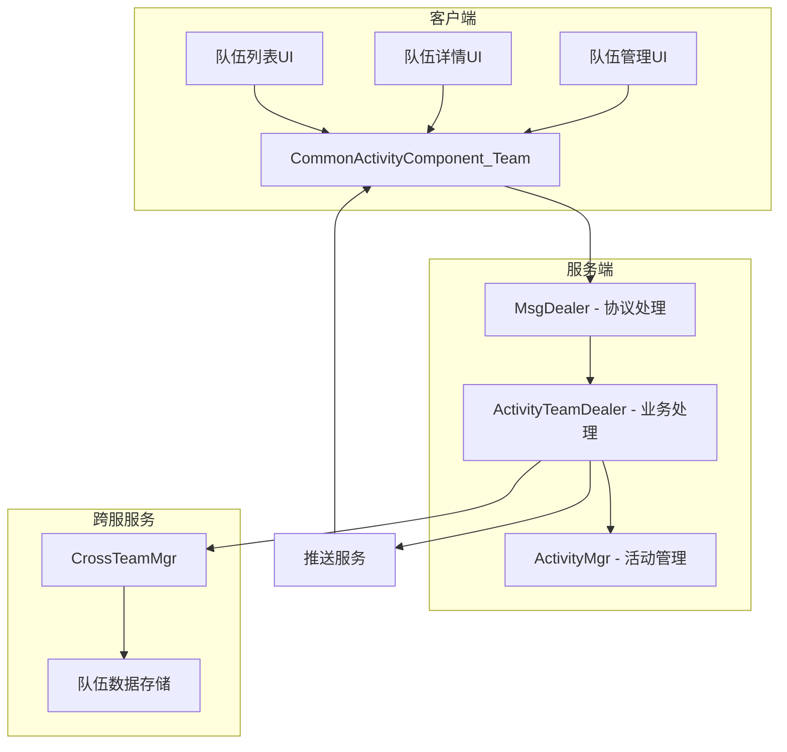
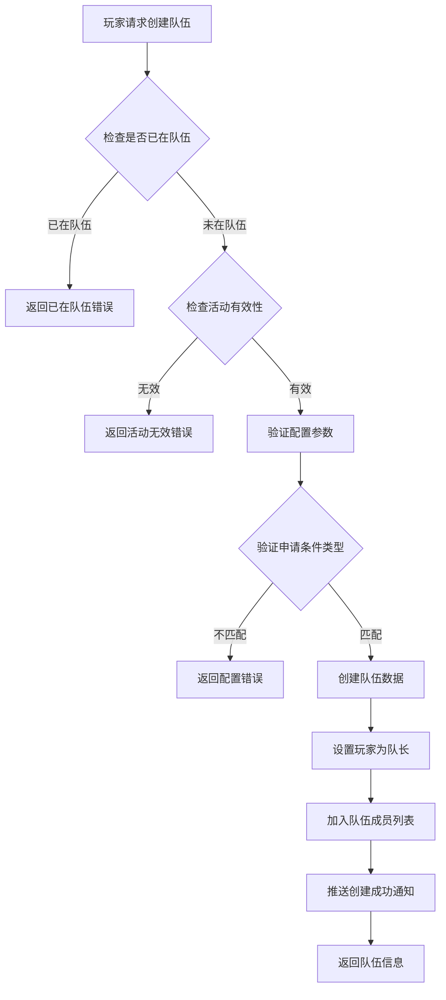
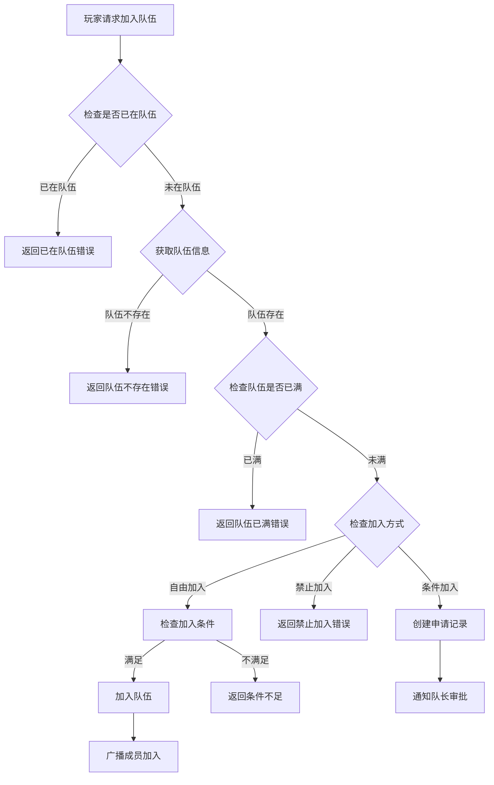
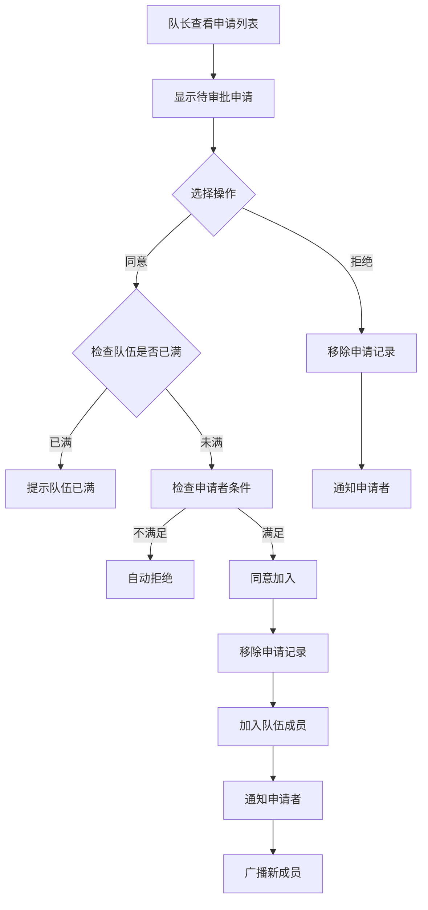
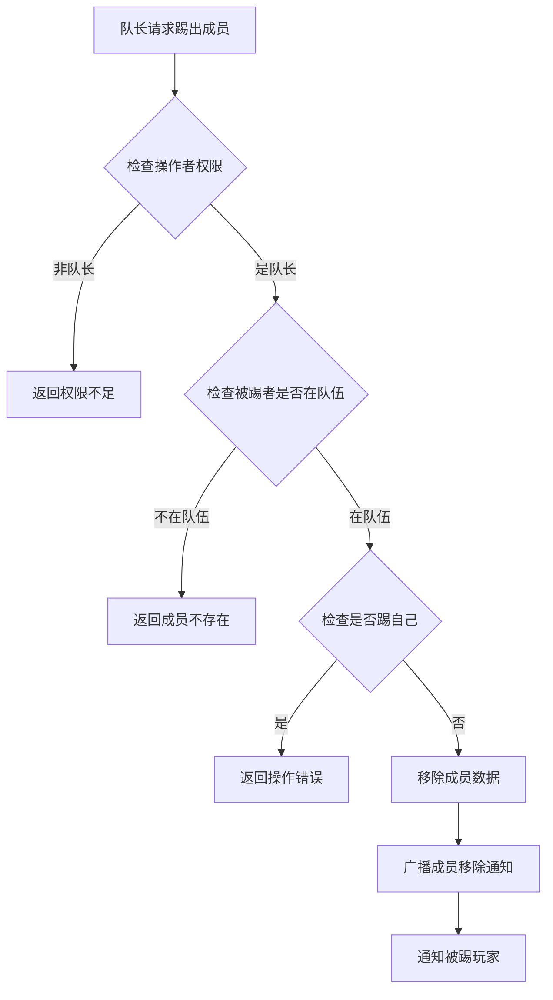
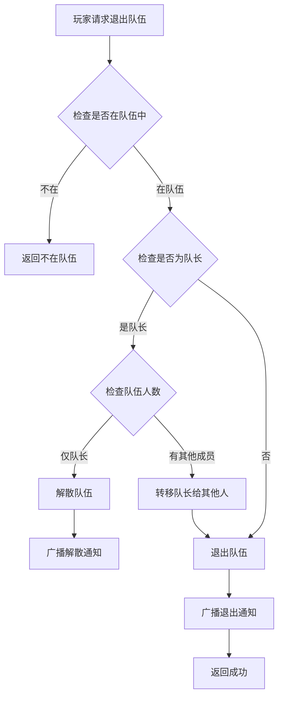

# 组队活动模块完整说明

## 一、模块概述

### 1.1 业务背景

组队活动模块为活动提供组队功能支持，允许玩家在活动中创建队伍、加入队伍、协同完成任务。通过组队玩法增强玩家社交互动，提升活动参与度和玩家粘性。

### 1.2 目标用户

- **社交型玩家**：喜欢与朋友一起游戏的玩家
- **活动参与者**：参与需要组队的活动玩家
- **公会成员**：公会组织的集体活动参与者

### 1.3 核心价值

1. **社交增强**：促进玩家间社交互动
2. **协同合作**：多人协作完成活动目标
3. **活跃提升**：组队提高活动参与意愿
4. **跨服互动**：支持跨服组队扩大社交圈

### 1.4 模块架构图



---

## 二、功能清单

### 2.1 队伍管理功能

| 功能名称 | 功能描述 | 用户价值 | API接口 |
|---------|---------|---------|---------|
| 创建队伍 | 创建新的活动队伍 | 成为队长管理队伍 | reqCreateActivityTeam |
| 解散队伍 | 队长解散队伍 | 结束队伍活动 | reqDissolveActivityTeam |
| 退出队伍 | 成员退出当前队伍 | 离开不合适的队伍 | reqQuitActivityTeam |
| 队伍设置 | 修改队伍名称、宣言等 | 个性化队伍展示 | reqSetActivityTeamSetting |

### 2.2 成员管理功能

| 功能名称 | 功能描述 | 用户价值 | API接口 |
|---------|---------|---------|---------|
| 加入队伍 | 通过不同方式加入队伍 | 参与组队活动 | reqJoinActivityTeam |
| 踢出成员 | 队长移除队伍成员 | 管理队伍成员 | reqKickActivityTeamPlayer |
| 申请审批 | 审核加入申请 | 控制队伍质量 | reqAgreeActivityTeamApply/reqRefuseActivityTeamApply |
| 成员列表 | 查看队伍所有成员 | 了解队伍情况 | reqActivityTeam |

### 2.3 加入方式功能

| 功能名称 | 功能描述 | 用户价值 | 枚举值 |
|---------|---------|---------|--------|
| 自由加入 | 符合条件直接加入 | 快速组队 | FREE_JOIN |
| 禁止加入 | 仅队长邀请可加入 | 精准控制 | FORBID_JOIN |
| 条件加入 | 需队长审批后加入 | 筛选成员 | COND_JOIN |

### 2.4 条件设置功能

| 功能名称 | 功能描述 | 用户价值 | 枚举值 |
|---------|---------|---------|--------|
| 无条件 | 无任何限制 | 开放招募 | NONE |
| 最小战力 | 设置最低战力要求 | 保证队伍实力 | MIN_POWER |
| 最小火星战力 | 设置最低火星战力 | 火星活动专用 | MIN_MARS_POWER |

---

## 三、业务流程详解

### 3.1 创建队伍流程



**详细步骤说明**：

1. **前置校验**
   - 检查玩家是否已在队伍中（错误码：70002）
   - 检查活动是否存在且有效（错误码：70001）
   - 验证队伍名称长度（1-20字符）
   - 验证队伍宣言长度（0-100字符）
   - 验证申请条件类型是否与配置匹配

2. **队伍创建**
   - 生成唯一队伍ID
   - 设置队伍基础信息（名称、宣言、人数上限）
   - 设置加入方式和条件
   - 创建者为队长（职位：LEADER）

3. **数据同步**
   - 保存队伍数据到 CrossTeamServer
   - 推送创建通知（GS2GC_012_051_OnJoinActivityTeam）
   - 返回创建成功（GS2GC_012_005_RetCreateActivityTeam）

### 3.2 加入队伍流程



**详细步骤说明**：

1. **条件检查**
   - 验证玩家是否已在队伍（错误码：70002）
   - 验证队伍是否存在（错误码：70001）
   - 验证队伍是否已满（错误码：70003）

2. **加入处理**
   - 自由加入（FREE_JOIN）：检查条件直接加入
   - 禁止加入（FORBID_JOIN）：返回错误（错误码：70011）
   - 条件加入（COND_JOIN）：创建申请等待审批

3. **加入成功**
   - 更新队伍成员列表
   - 设置成员职位（普通成员：NONE）
   - 记录加入时间
   - 广播成员加入通知（GS2GC_012_055_OnActivityTeamMemberAdd）

### 3.3 申请审批流程



**审批接口说明**：

- **同意申请**：`reqAgreeActivityTeamApply(teamId, applyCid)`
- **拒绝申请**：`reqRefuseActivityTeamApply(teamId, applyCid)`
- **申请列表**：`reqActivityTeamApplyList(teamId)`

### 3.4 踢出成员流程



### 3.5 退出队伍流程



---

## 四、关键规则

### 4.1 队伍规则

1. **队伍人数**
   - 最小人数：1人（队长）
   - 最大人数：根据活动配置 member_limit（通常为5人）

2. **队伍状态**
   - 开放中：可继续加入新成员
   - 已满：无法继续加入

3. **队伍有效期**
   - 活动期间有效
   - 活动结束自动解散

### 4.2 成员规则

1. **队长权限**
   - 修改队伍设置（名称、宣言、加入方式）
   - 踢出成员
   - 审批申请
   - 解散队伍
   - 设置加入条件

2. **成员权限**
   - 查看队伍信息
   - 退出队伍
   - 查看成员列表

3. **队长转移**
   - 队长退出时自动转移
   - 转移给最早加入的成员（按 joinMs 升序）

### 4.3 加入条件规则

1. **无条件（NONE）**
   - 无任何限制
   - 适用于自由招募

2. **最小战力（MIN_POWER）**
   - 玩家战力必须 >= value
   - value 由队长设置

3. **最小火星战力（MIN_MARS_POWER）**
   - 玩家火星战力必须 >= value
   - 适用于火星相关活动

### 4.4 申请规则

1. **申请有效期**
   - 申请创建后24小时有效
   - 超时自动失效

2. **申请数量限制**
   - 每个队伍最多100条待处理申请
   - 超出后自动拒绝新申请

3. **重复申请**
   - 玩家已有待处理申请时不能重复申请
   - 错误码：70006

---

## 五、数据结构完整列表

### 5.1 CrossTeam_Info（队伍完整数据）

| 字段名 | 类型 | 必填 | 说明 |
|--------|------|------|------|
| teamBase | CrossTeam_BaseInfo | 是 | 队伍基础数据 |
| joinType | ENPCrossTeamJoinType | 是 | 加入方式 |
| joinCond | CrossTeam_SetInfo_Join | 是 | 加入条件 |
| memberList | ArrayList&lt;CrossTeamMember_Info&gt; | 是 | 成员列表 |

### 5.2 CrossTeam_BaseInfo（队伍基础数据）

| 字段名 | 类型 | 必填 | 说明 | 约束条件 |
|--------|------|------|------|----------|
| teamId | long | 是 | 队伍实例ID | 唯一，> 0 |
| memberLimit | int | 是 | 成员上限 | 2 - 50 |
| teamName | String | 是 | 队伍名称 | 1-20字符 |
| teamDec | String | 否 | 队伍宣言 | 0-100字符 |

### 5.3 CrossTeam_SetInfo_Join（加入条件）

| 字段名 | 类型 | 必填 | 说明 |
|--------|------|------|------|
| cond | ENPCrossTeamJoinCond | 是 | 条件类型 |
| value | long | 是 | 条件值 |

### 5.4 CrossTeamMember_Info（成员数据）

| 字段名 | 类型 | 必填 | 说明 | 约束条件 |
|--------|------|------|------|----------|
| cid | long | 是 | 成员CID | > 0 |
| pos | ENPCrossTeamMemberPos | 是 | 职位 | LEADER/NONE |
| joinMs | long | 是 | 加入时间 | > 0 |

### 5.5 RefActivityTeam（配置数据）

| 字段名 | 类型 | 必填 | 说明 | 约束条件 |
|--------|------|------|------|----------|
| activity_id | long | 是 | 关联活动ID | 唯一，> 0 |
| member_limit | int | 是 | 队伍人数上限 | 2 - 50 |
| apply_cond_type | ENPCrossTeamJoinCond | 否 | 申请条件类型 | 默认NONE |

---

## 六、示例

### 6.1 创建队伍示例

**输入参数**：
```
活动实例ID: 10001
队伍名称: 无敌战队
队伍宣言: 欢迎强力玩家加入！
加入方式: COND_JOIN（条件加入）
加入条件:
  - 条件类型: MIN_POWER（最小战力）
  - 条件值: 50000
```

**创建结果**：
```
队伍ID: 900001
队伍名称: 无敌战队
队长: 玩家A (CID: 20001)
当前成员: 1人
最大成员: 5人
创建时间: 2026-04-12 10:00:00
```

### 6.2 加入队伍示例

**队伍状态**：
```
队伍ID: 900001
当前成员: 3/5人
加入方式: FREE_JOIN（自由加入）
加入条件: MIN_POWER >= 50000
```

**申请者信息**：
```
玩家: 玩家B
等级: 45
战力: 68000
```

**处理结果**：
```
加入结果: 成功
加入时间: 2026-04-12 10:30:00
职位: NONE（普通成员）
```

### 6.3 队伍信息示例

```
队伍ID: 900001
队伍名称: 无敌战队
队伍宣言: 欢迎强力玩家加入！
队长: 玩家A (LEADER)
成员列表:
  1. 玩家A (LEADER) - 加入时间: 10:00:00
  2. 玩家B (NONE) - 加入时间: 10:30:00
  3. 玩家C (NONE) - 加入时间: 10:45:00
  4. 玩家D (NONE) - 加入时间: 11:00:00
  5. 玩家E (NONE) - 加入时间: 11:15:00
队伍状态: 已满
加入方式: FREE_JOIN
加入条件: MIN_POWER >= 50000
```

---

## 七、错误码汇总

| 错误码 | 常量名 | 说明 | 解决方案 |
|--------|--------|------|----------|
| 70001 | TEAM_NOT_FOUND | 队伍不存在 | 刷新队伍列表 |
| 70002 | ALREADY_IN_TEAM | 已在队伍中 | 先退出当前队伍 |
| 70003 | TEAM_FULL | 队伍已满 | 选择其他队伍 |
| 70004 | NO_PERMISSION | 无权限操作 | 检查是否为队长 |
| 70005 | CONDITION_NOT_MET | 不满足加入条件 | 查看具体条件要求 |
| 70006 | APPLY_NOT_FOUND | 申请不存在 | 刷新申请列表 |
| 70007 | APPLY_ALREADY_HANDLED | 申请已处理 | 刷新申请列表 |
| 70008 | MEMBER_NOT_FOUND | 成员不存在 | 刷新成员列表 |
| 70009 | CANNOT_KICK_SELF | 不能踢出自己 | 选择其他成员 |
| 70010 | TEAM_NAME_INVALID | 队伍名称不合法 | 检查长度和敏感词 |
| 70011 | NOT_SUPPORT_FREE_JOIN | 不支持自由加入 | 使用申请加入 |
| 70012 | NOT_SUPPORT_APPLY_JOIN | 不支持申请加入 | 使用自由加入 |

---

*文档生成时间: 2026-04-12*
*文档版本: v2.0.0*