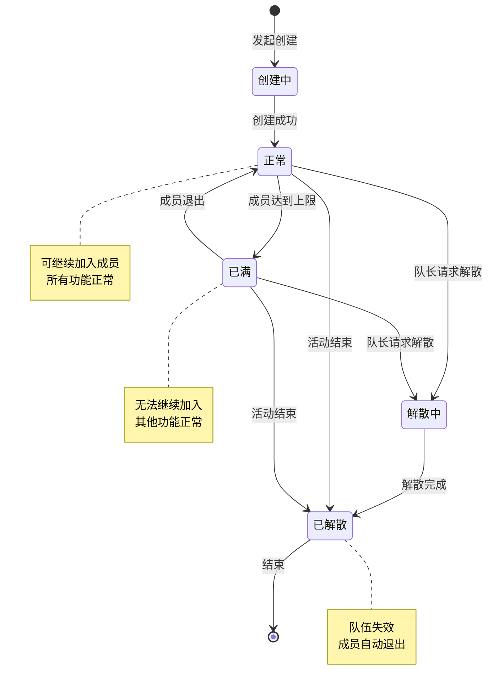
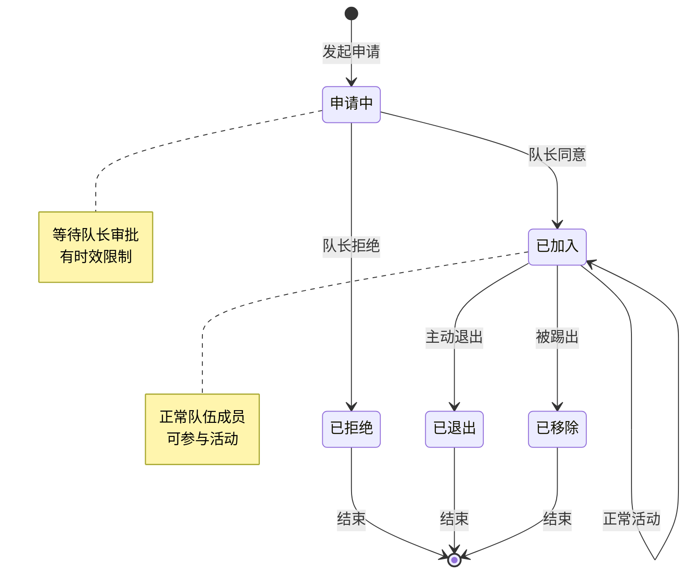
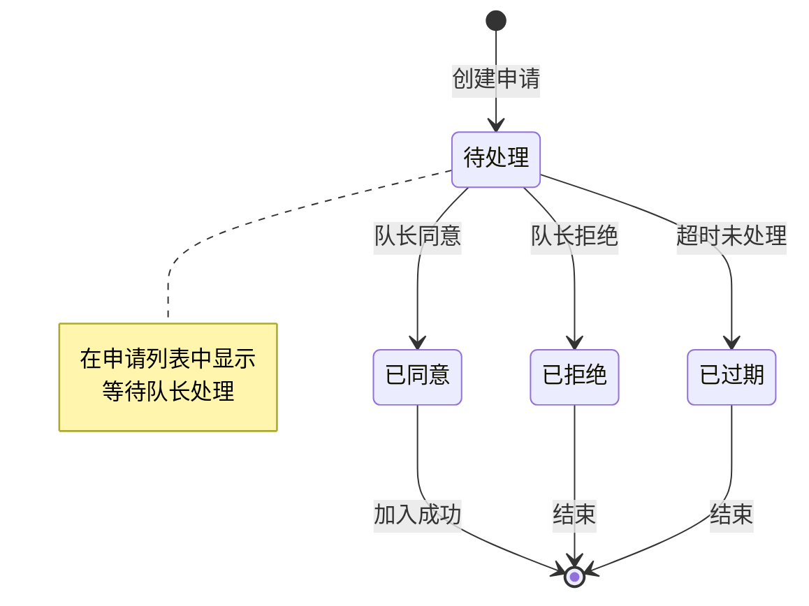
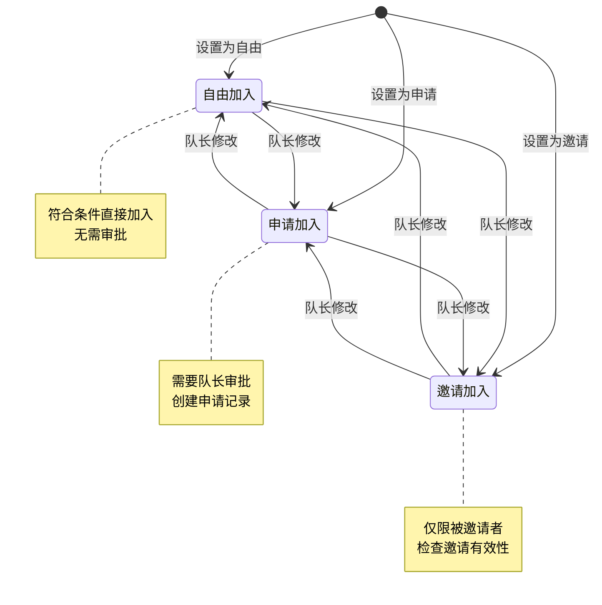
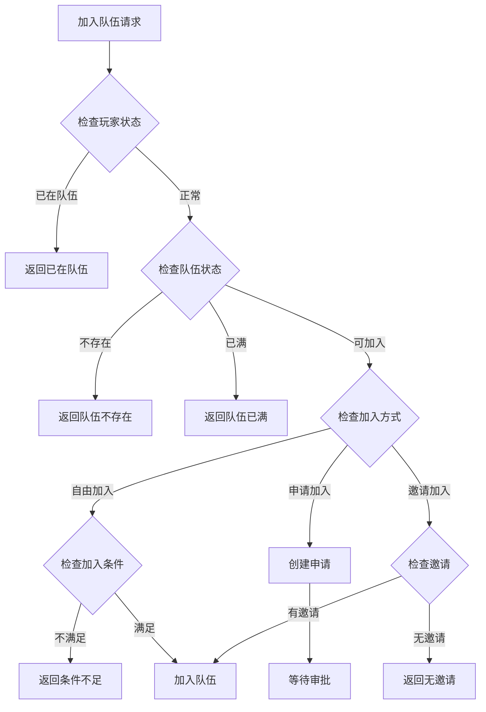
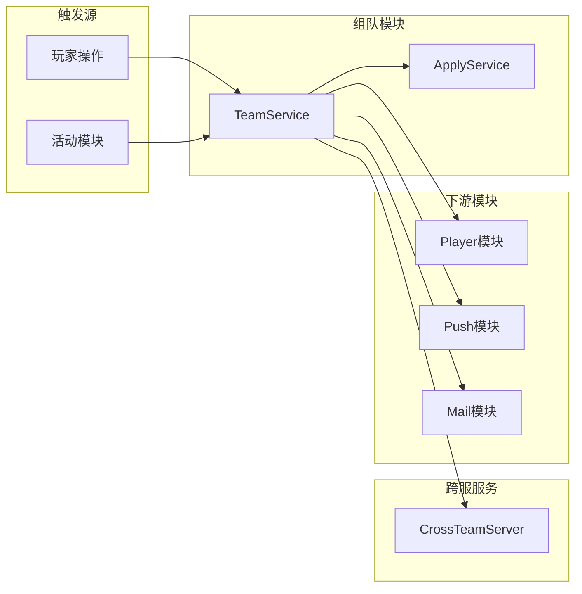

# 组队活动模块实现细节

## 一、计算公式

### 1.1 队伍战力计算公式

```
队伍总战力 = Σ(每个成员的战力值)
平均战力 = 队伍总战力 / 成员数量
```

**示例计算**：
```
成员战力: [120000, 68000, 55000, 72000, 52000]
队伍总战力: 120000 + 68000 + 55000 + 72000 + 52000 = 367000
平均战力: 367000 / 5 = 73400
```

### 1.2 队伍匹配评分公式

```
匹配评分 = |申请者战力 - 队伍平均战力| × 权重1
         + |申请者等级 - 队伍平均等级| × 权重2
```

评分越低表示越匹配队伍。

### 1.3 队长转移优先级

```
新队长 = 按加入时间排序的第一个非队长成员
如加入时间相同，按成员ID升序
```

---

## 二、状态机定义

### 2.1 队伍状态机



### 2.2 成员状态机



### 2.3 申请状态机



### 2.4 加入方式状态机



---

## 三、数据约束

### 3.1 队伍数据约束

| 字段名 | 数据类型 | 取值范围 | 必填 | 唯一性 | 说明 |
|--------|----------|----------|------|--------|------|
| teamId | long | > 0 | 是 | 是 | 队伍唯一ID |
| instanceId | long | > 0 | 是 | 否 | 活动实例ID |
| teamName | String | 1-20字符 | 是 | 否 | 队伍名称 |
| teamDec | String | 0-100字符 | 否 | 否 | 队伍宣言 |
| joinType | int | 1-3 | 是 | 否 | 加入方式 |
| leaderCid | long | > 0 | 是 | 否 | 队长CID |
| createTime | datetime | - | 是 | 否 | 创建时间 |

### 3.2 成员数据约束

| 字段名 | 数据类型 | 取值范围 | 必填 | 说明 |
|--------|----------|----------|------|------|
| teamId | long | > 0 | 是 | 所属队伍ID |
| cid | long | > 0 | 是 | 玩家CID |
| isLeader | bool | - | 是 | 是否队长 |
| joinTime | datetime | - | 是 | 加入时间 |

### 3.3 申请数据约束

| 字段名 | 数据类型 | 取值范围 | 必填 | 说明 |
|--------|----------|----------|------|------|
| applyId | long | > 0 | 是 | 申请ID |
| teamId | long | > 0 | 是 | 队伍ID |
| applyCid | long | > 0 | 是 | 申请者CID |
| status | int | 0-2 | 是 | 状态 |
| createTime | datetime | - | 是 | 申请时间 |

### 3.4 加入条件约束

| 字段名 | 数据类型 | 取值范围 | 必填 | 说明 |
|--------|----------|----------|------|------|
| minLevel | int | 1-100 | 否 | 最低等级 |
| maxLevel | int | 1-100 | 否 | 最高等级 |
| minPower | long | >= 0 | 否 | 最低战力 |

---

## 四、错误处理策略

### 4.1 组队模块错误码

| 错误码 | 错误信息 | 处理策略 | 用户提示 |
|--------|----------|----------|----------|
| 70001 | 队伍不存在 | 检查队伍ID有效性 | "队伍不存在" |
| 70002 | 已在队伍中 | 检查玩家队伍状态 | "您已在队伍中" |
| 70003 | 队伍已满 | 检查队伍人数 | "队伍已满" |
| 70004 | 无权限操作 | 检查玩家权限 | "无权限操作" |
| 70005 | 不满足加入条件 | 检查等级战力等 | "不满足加入条件" |
| 70006 | 申请不存在 | 检查申请ID | "申请不存在" |
| 70007 | 申请已处理 | 检查申请状态 | "申请已处理" |
| 70008 | 成员不存在 | 检查成员是否在队伍 | "成员不存在" |
| 70009 | 不能踢出自己 | 检查操作目标 | "不能踢出自己" |
| 70010 | 队伍名称不合法 | 检查名称长度和敏感词 | "队伍名称不合法" |

### 4.2 加入队伍错误处理流程



### 4.3 成员操作错误处理

| 错误场景 | 处理策略 | 后续操作 |
|----------|----------|----------|
| 队长退出 | 自动转移队长 | 广播队长变更 |
| 最后成员退出 | 解散队伍 | 广播解散通知 |
| 被踢玩家不在线 | 正常踢出 | 发送邮件通知 |

---

## 五、关键代码示例

### 5.1 创建队伍伪代码

```csharp
public Result CreateActivityTeam(long playerId, long instanceId,
    ENPCrossTeamJoinType joinType, CrossTeam_SetInfo_Join joinCond,
    string teamName, string teamDec)
{
    // 检查是否已在队伍
    if (teamService.IsPlayerInTeam(playerId, instanceId))
    {
        return Result.Error(70002, "已在队伍中");
    }

    // 验证活动实例
    ActivityInstance instance = activityService.GetInstance(instanceId);
    if (instance == null || !instance.isActive())
    {
        return Result.Error(70001, "活动不存在或已结束");
    }

    // 验证队伍名称
    if (string.IsNullOrEmpty(teamName) || teamName.Length > 20)
    {
        return Result.Error(70010, "队伍名称不合法");
    }

    if (sensitiveWordService.Contains(teamName) || sensitiveWordService.Contains(teamDec))
    {
        return Result.Error(70010, "包含敏感词");
    }

    // 创建队伍
    CrossTeamInfo team = new CrossTeamInfo {
        teamId = idGenerator.NextId(),
        instanceId = instanceId,
        teamName = teamName,
        teamDec = teamDec,
        joinType = joinType,
        joinCond = joinCond,
        leaderCid = playerId,
        createTime = DateTime.Now
    };

    // 添加队长为成员
    CrossTeamMemberInfo leader = new CrossTeamMemberInfo {
        teamId = team.teamId,
        cid = playerId,
        isLeader = true,
        joinTime = DateTime.Now
    };

    team.members.Add(leader);

    // 保存数据
    teamService.CreateTeam(team);

    // 推送通知
    PushTeamCreated(playerId, team);

    return Result.Success(team);
}
```

### 5.2 加入队伍伪代码

```csharp
public Result JoinActivityTeam(long playerId, long teamId)
{
    // 获取队伍信息
    CrossTeamInfo team = teamService.GetTeam(teamId);
    if (team == null)
    {
        return Result.Error(70001, "队伍不存在");
    }

    // 检查是否已在队伍
    if (teamService.IsPlayerInTeam(playerId, team.instanceId))
    {
        return Result.Error(70002, "已在队伍中");
    }

    // 检查队伍是否已满
    TeamActivityConfig config = GetTeamConfig(team.instanceId);
    if (team.members.Count >= config.maxMemberCount)
    {
        return Result.Error(70003, "队伍已满");
    }

    // 检查加入方式
    if (team.joinType != ENPCrossTeamJoinType.FREE)
    {
        return Result.Error(70005, "此队伍不支持自由加入");
    }

    // 检查加入条件
    Result condCheck = CheckJoinCondition(playerId, team.joinCond);
    if (!condCheck.isSuccess())
    {
        return condCheck;
    }

    // 加入队伍
    CrossTeamMemberInfo member = new CrossTeamMemberInfo {
        teamId = teamId,
        cid = playerId,
        isLeader = false,
        joinTime = DateTime.Now
    };

    team.members.Add(member);
    teamService.UpdateTeam(team);

    // 广播成员加入
    BroadcastMemberAdd(team, member);

    // 推送给加入者
    PushJoinSuccess(playerId, team);

    return Result.Success();
}
```

### 5.3 申请加入队伍伪代码

```csharp
public Result ApplyJoinActivityTeam(long playerId, long teamId)
{
    // 获取队伍信息
    CrossTeamInfo team = teamService.GetTeam(teamId);
    if (team == null)
    {
        return Result.Error(70001, "队伍不存在");
    }

    // 检查是否已在队伍
    if (teamService.IsPlayerInTeam(playerId, team.instanceId))
    {
        return Result.Error(70002, "已在队伍中");
    }

    // 检查加入方式
    if (team.joinType != ENPCrossTeamJoinType.APPLY)
    {
        return Result.Error(70005, "此队伍不支持申请加入");
    }

    // 检查是否已有待处理申请
    if (teamService.HasPendingApply(teamId, playerId))
    {
        return Result.Error(70006, "已有待处理申请");
    }

    // 检查加入条件
    Result condCheck = CheckJoinCondition(playerId, team.joinCond);
    if (!condCheck.isSuccess())
    {
        return condCheck;
    }

    // 创建申请
    TeamApplyInfo apply = new TeamApplyInfo {
        applyId = idGenerator.NextId(),
        teamId = teamId,
        applyCid = playerId,
        status = ApplyStatus.PENDING,
        createTime = DateTime.Now
    };

    teamService.CreateApply(apply);

    // 通知队长
    NotifyLeaderNewApply(team.leaderCid, apply);

    return Result.Success();
}
```

### 5.4 踢出成员伪代码

```csharp
public Result KickActivityTeamPlayer(long operatorId, long teamId, long kickCid)
{
    // 获取队伍信息
    CrossTeamInfo team = teamService.GetTeam(teamId);
    if (team == null)
    {
        return Result.Error(70001, "队伍不存在");
    }

    // 检查操作者权限
    if (team.leaderCid != operatorId)
    {
        return Result.Error(70004, "无权限操作");
    }

    // 不能踢自己
    if (kickCid == operatorId)
    {
        return Result.Error(70009, "不能踢出自己");
    }

    // 检查被踢者是否在队伍
    CrossTeamMemberInfo member = team.members.Find(m => m.cid == kickCid);
    if (member == null)
    {
        return Result.Error(70008, "成员不存在");
    }

    // 移除成员
    team.members.Remove(member);
    teamService.UpdateTeam(team);

    // 广播成员移除
    BroadcastMemberRemove(team, kickCid);

    // 通知被踢者
    NotifyKicked(kickCid, team);

    return Result.Success();
}
```

### 5.5 队长退出处理伪代码

```csharp
public Result QuitActivityTeam(long playerId, long teamId)
{
    CrossTeamInfo team = teamService.GetTeam(teamId);
    if (team == null)
    {
        return Result.Error(70001, "队伍不存在");
    }

    CrossTeamMemberInfo member = team.members.Find(m => m.cid == playerId);
    if (member == null)
    {
        return Result.Error(70002, "不在队伍中");
    }

    // 移除成员
    team.members.Remove(member);

    // 如果是队长
    if (member.isLeader)
    {
        if (team.members.Count > 0)
        {
            // 转移队长给最早加入的成员
            var newLeader = team.members.OrderBy(m => m.joinTime).First();
            newLeader.isLeader = true;
            team.leaderCid = newLeader.cid;

            // 广播队长变更
            BroadcastLeaderChange(team, newLeader.cid);
        }
        else
        {
            // 解散队伍
            teamService.DeleteTeam(teamId);
            BroadcastTeamDissolve(team);
            return Result.Success();
        }
    }

    teamService.UpdateTeam(team);

    // 广播退出
    BroadcastMemberQuit(team, playerId);

    return Result.Success();
}
```

---

## 六、跨模块依赖

### 6.1 依赖模块

| 模块名称 | 依赖方式 | 依赖说明 |
|----------|----------|----------|
| Activity | 数据关联 | 活动实例数据 |
| Player | 数据读取 | 玩家等级、战力等 |
| CrossTeam | 功能调用 | 跨服队伍服务 |
| Push | 功能调用 | 推送通知 |

### 6.2 被依赖情况

| 模块名称 | 依赖方式 | 依赖说明 |
|----------|----------|----------|
| Activity | 功能关联 | 活动中使用组队功能 |

### 6.3 接口依赖图



---

*文档生成时间: 2026-04-07*
