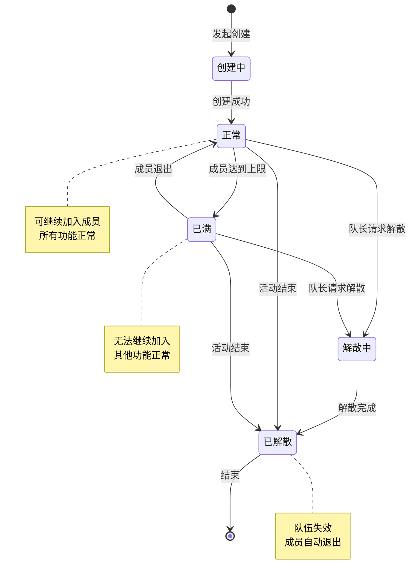
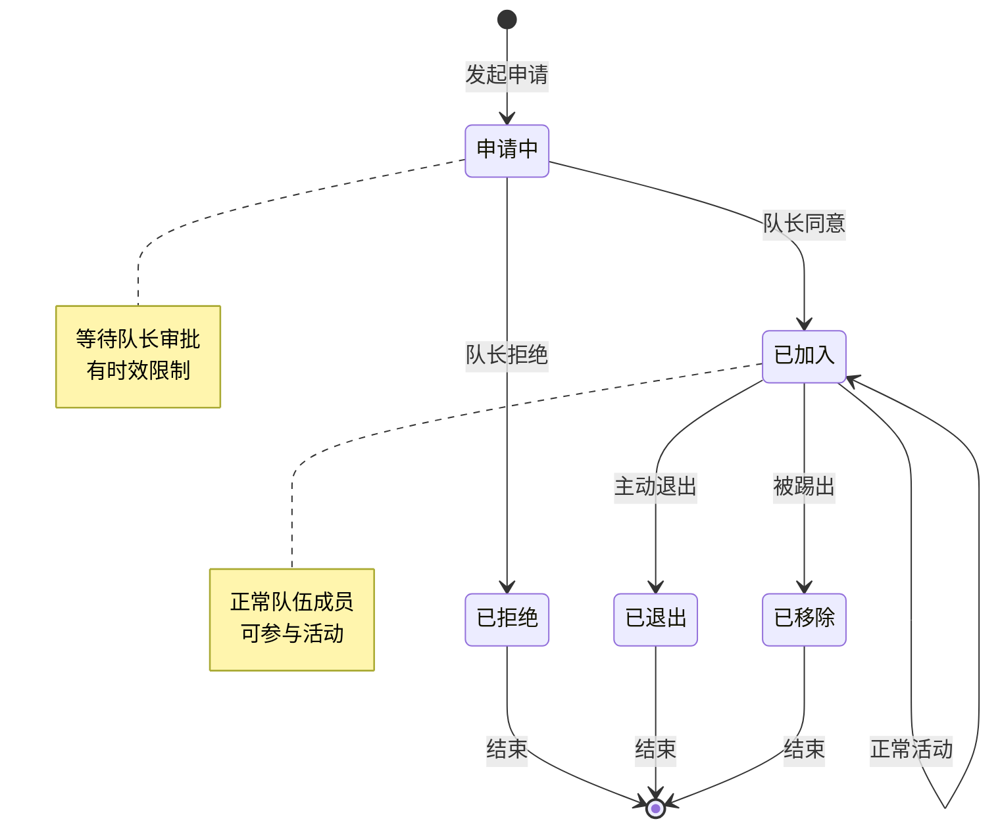
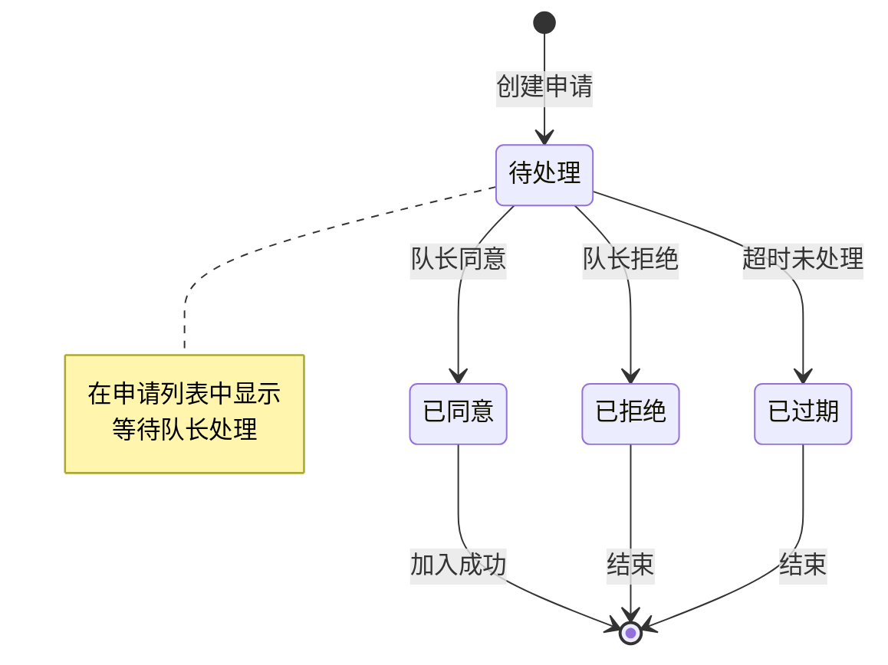
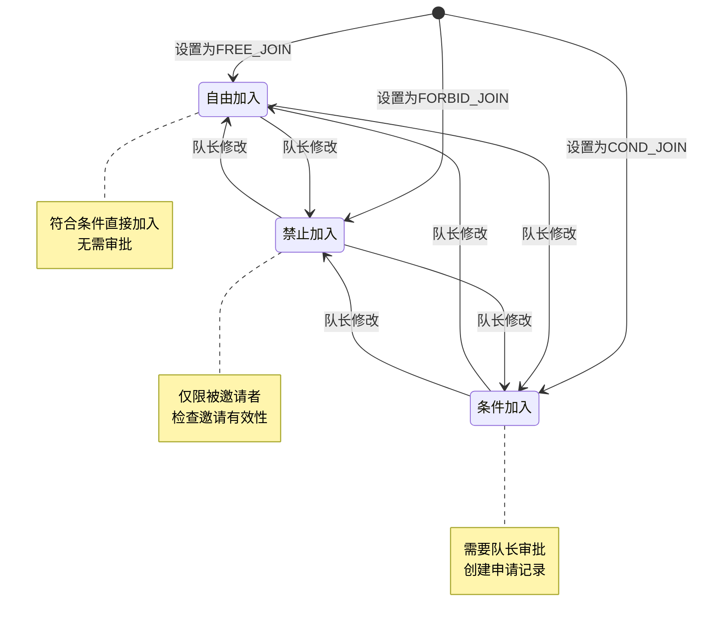
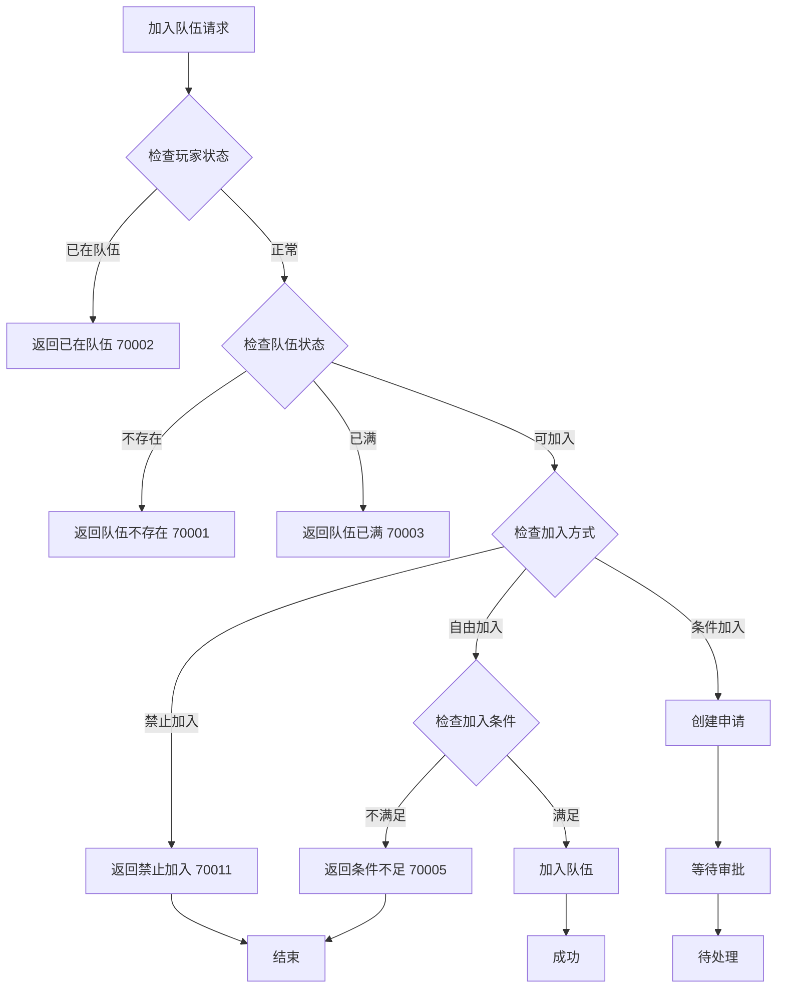
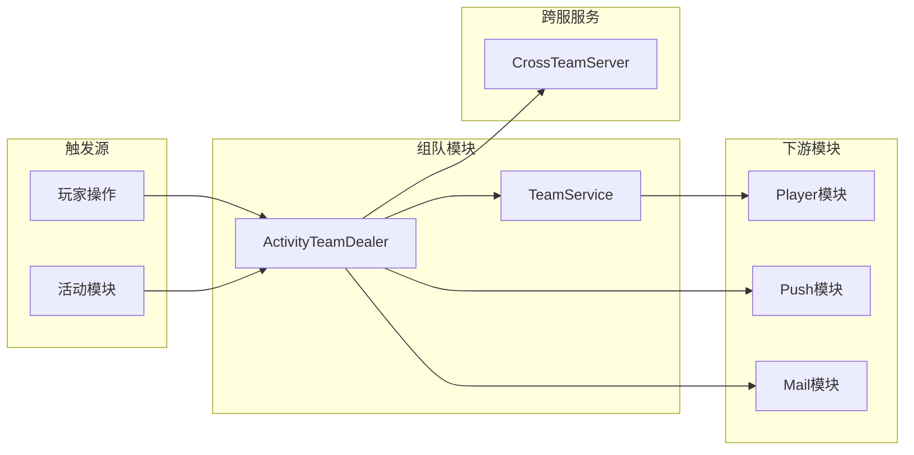

# 组队活动模块实现细节

## 一、计算公式

### 1.1 队伍战力计算公式

```
队伍总战力 = Σ(每个成员的战力值)
平均战力 = 队伍总战力 / 成员数量
```

**示例计算**：
```
成员战力: [120000, 68000, 55000, 72000, 52000]
队伍总战力: 120000 + 68000 + 55000 + 72000 + 52000 = 367000
平均战力: 367000 / 5 = 73400
```

### 1.2 队伍匹配评分公式

```
匹配评分 = |申请者战力 - 队伍平均战力| × 权重1
         + |申请者等级 - 队伍平均等级| × 权重2
```

评分越低表示越匹配队伍。

### 1.3 队长转移优先级

```
新队长 = 按加入时间排序的第一个非队长成员
如加入时间相同，按成员ID升序
```

**代码实现**：

```java
// 队长转移逻辑
public CrossTeamMember_Info selectNewLeader(CrossTeam_Info team)
{
    List<CrossTeamMember_Info> members = team.getMemberList()
        .stream()
        .filter(m -> m.getPos() != ENPCrossTeamMemberPos.LEADER)
        .sorted((a, b) -> {
            // 先按加入时间升序
            int timeCompare = Long.compare(a.getJoinMs(), b.getJoinMs());
            if (timeCompare != 0) return timeCompare;
            // 时间相同按CID升序
            return Long.compare(a.getCid(), b.getCid());
        })
        .collect(Collectors.toList());

    return members.isEmpty() ? null : members.get(0);
}
```

---

## 二、状态机定义

### 2.1 队伍状态机



### 2.2 成员状态机



### 2.3 申请状态机



### 2.4 加入方式状态机



---

## 三、数据约束

### 3.1 队伍数据约束

| 字段名 | 数据类型 | 取值范围 | 必填 | 唯一性 | 说明 |
|--------|----------|----------|------|--------|------|
| teamId | long | > 0 | 是 | 是 | 队伍唯一ID，雪花算法生成 |
| instanceId | long | > 0 | 是 | 否 | 活动实例ID |
| teamName | String | 1-20字符 | 是 | 否 | 队伍名称，需敏感词过滤 |
| teamDec | String | 0-100字符 | 否 | 否 | 队伍宣言，需敏感词过滤 |
| joinType | int | 1-3 | 是 | 否 | 加入方式枚举值 |
| leaderCid | long | > 0 | 是 | 否 | 队长CID |
| createTime | datetime | - | 是 | 否 | 创建时间 |
| memberCount | int | 1-member_limit | 是 | 否 | 当前成员数 |

### 3.2 成员数据约束

| 字段名 | 数据类型 | 取值范围 | 必填 | 说明 |
|--------|----------|----------|------|------|
| teamId | long | > 0 | 是 | 所属队伍ID |
| cid | long | > 0 | 是 | 玩家CID，唯一标识 |
| pos | int | 0-1 | 是 | 职位：0=NONE，1=LEADER |
| joinMs | long | > 0 | 是 | 加入时间戳（毫秒） |

### 3.3 申请数据约束

| 字段名 | 数据类型 | 取值范围 | 必填 | 说明 |
|--------|----------|----------|------|------|
| applyId | long | > 0 | 是 | 申请ID，雪花算法生成 |
| teamId | long | > 0 | 是 | 队伍ID |
| applyCid | long | > 0 | 是 | 申请者CID |
| status | int | 0-2 | 是 | 状态：0=待处理，1=已同意，2=已拒绝 |
| createTime | datetime | - | 是 | 申请时间 |
| expireTime | datetime | - | 是 | 过期时间（24小时后） |

### 3.4 加入条件约束

| 字段名 | 数据类型 | 取值范围 | 必填 | 说明 |
|--------|----------|----------|------|------|
| cond | int | 0-2 | 是 | 条件类型枚举 |
| value | long | >= 0 | 是 | 条件值 |

---

## 四、错误处理策略

### 4.1 组队模块错误码

| 错误码 | 错误信息 | 处理策略 | 用户提示 |
|--------|----------|----------|----------|
| 70001 | 队伍不存在 | 检查队伍ID有效性 | "队伍不存在" |
| 70002 | 已在队伍中 | 检查玩家队伍状态 | "您已在队伍中" |
| 70003 | 队伍已满 | 检查队伍人数 | "队伍已满" |
| 70004 | 无权限操作 | 检查玩家权限 | "无权限操作" |
| 70005 | 不满足加入条件 | 检查等级战力等 | "不满足加入条件" |
| 70006 | 申请不存在 | 检查申请ID | "申请不存在" |
| 70007 | 申请已处理 | 检查申请状态 | "申请已处理" |
| 70008 | 成员不存在 | 检查成员是否在队伍 | "成员不存在" |
| 70009 | 不能踢出自己 | 检查操作目标 | "不能踢出自己" |
| 70010 | 队伍名称不合法 | 检查名称长度和敏感词 | "队伍名称不合法" |

### 4.2 加入队伍错误处理流程



### 4.3 成员操作错误处理

| 错误场景 | 处理策略 | 后续操作 |
|----------|----------|----------|
| 队长退出 | 自动转移队长 | 广播队长变更通知 |
| 最后成员退出 | 解散队伍 | 广播解散通知 |
| 被踢玩家不在线 | 正常踢出 | 发送离线通知/邮件 |

---

## 五、关键代码示例

### 5.1 创建队伍伪代码

```java
public Result createActivityTeam(long playerId, long instanceId,
    ENPCrossTeamJoinType joinType, CrossTeam_SetInfo_Join joinCond,
    String teamName, String teamDec)
{
    // 1. 检查是否已在队伍
    if (teamService.isPlayerInTeam(playerId, instanceId))
    {
        return Result.Error(70002, "已在队伍中");
    }

    // 2. 验证活动实例
    _AActivityBase activity = activityService.getActivity(instanceId);
    if (activity == null || !activity.isActive())
    {
        return Result.Error(70001, "活动不存在或已结束");
    }

    // 3. 获取组队配置
    ActivityTeamDealer dealer = activity.getTeamDealer();
    if (dealer == null)
    {
        return Result.Error(70001, "活动不支持组队");
    }

    RefActivityTeam ref = dealer.getRef();
    if (ref == null)
    {
        return Result.Error(70001, "配置不存在");
    }

    // 4. 验证申请条件类型
    if (joinCond.getCond() != ref.apply_cond_type)
    {
        return Result.Error(70010, "条件类型不匹配");
    }

    // 5. 验证队伍名称
    if (teamName == null || teamName.length() < 1 || teamName.length() > 20)
    {
        return Result.Error(70010, "队伍名称长度不合法");
    }

    if (sensitiveWordService.contains(teamName) ||
        sensitiveWordService.contains(teamDec))
    {
        return Result.Error(70010, "包含敏感词");
    }

    // 6. 创建队伍
    CrossTeam_Info team = new CrossTeam_Info();
    team.getTeamBase().setTeamId(idGenerator.nextId());
    team.getTeamBase().setMemberLimit(ref.member_limit);
    team.getTeamBase().setTeamName(teamName);
    team.getTeamBase().setTeamDec(teamDec != null ? teamDec : "");
    team.setJoinType(joinType);
    team.setJoinCond(joinCond);

    // 7. 添加队长为成员
    CrossTeamMember_Info leader = new CrossTeamMember_Info();
    leader.setCid(playerId);
    leader.setPos(ENPCrossTeamMemberPos.LEADER);
    leader.setJoinMs(System.currentTimeMillis());
    team.getMemberList().add(leader);

    // 8. 保存数据
    teamService.createTeam(team);

    // 9. 推送通知
    pushTeamCreated(playerId, team);

    return Result.Success(team);
}
```

### 5.2 加入队伍伪代码

```java
public Result joinActivityTeam(long playerId, long teamId)
{
    // 1. 获取队伍信息
    CrossTeam_Info team = teamService.getTeam(teamId);
    if (team == null)
    {
        return Result.Error(70001, "队伍不存在");
    }

    // 2. 检查是否已在队伍
    if (teamService.isPlayerInTeam(playerId, team.getInstanceId()))
    {
        return Result.Error(70002, "已在队伍中");
    }

    // 3. 检查队伍是否已满
    if (team.getMemberList().size() >= team.getTeamBase().getMemberLimit())
    {
        return Result.Error(70003, "队伍已满");
    }

    // 4. 检查加入方式
    if (team.getJoinType() != ENPCrossTeamJoinType.FREE_JOIN)
    {
        return Result.Error(70011, "此队伍不支持自由加入");
    }

    // 5. 检查加入条件
    Result condCheck = checkJoinCondition(playerId, team.getJoinCond());
    if (!condCheck.isSuccess())
    {
        return condCheck;
    }

    // 6. 加入队伍
    CrossTeamMember_Info member = new CrossTeamMember_Info();
    member.setCid(playerId);
    member.setPos(ENPCrossTeamMemberPos.NONE);
    member.setJoinMs(System.currentTimeMillis());

    team.getMemberList().add(member);
    teamService.updateTeam(team);

    // 7. 广播成员加入
    broadcastMemberAdd(team, member);

    // 8. 推送给加入者
    pushJoinSuccess(playerId, team);

    return Result.Success();
}
```

### 5.3 申请加入队伍伪代码

```java
public Result applyJoinActivityTeam(long playerId, long teamId)
{
    // 1. 获取队伍信息
    CrossTeam_Info team = teamService.getTeam(teamId);
    if (team == null)
    {
        return Result.Error(70001, "队伍不存在");
    }

    // 2. 检查是否已在队伍
    if (teamService.isPlayerInTeam(playerId, team.getInstanceId()))
    {
        return Result.Error(70002, "已在队伍中");
    }

    // 3. 检查加入方式
    if (team.getJoinType() != ENPCrossTeamJoinType.COND_JOIN)
    {
        return Result.Error(70012, "此队伍不支持申请加入");
    }

    // 4. 检查是否已有待处理申请
    if (teamService.hasPendingApply(teamId, playerId))
    {
        return Result.Error(70006, "已有待处理申请");
    }

    // 5. 检查加入条件
    Result condCheck = checkJoinCondition(playerId, team.getJoinCond());
    if (!condCheck.isSuccess())
    {
        return condCheck;
    }

    // 6. 创建申请
    TeamApplyInfo apply = new TeamApplyInfo();
    apply.setApplyId(idGenerator.nextId());
    apply.setTeamId(teamId);
    apply.setApplyCid(playerId);
    apply.setStatus(ApplyStatus.PENDING);
    apply.setCreateTime(new Date());
    apply.setExpireTime(DateUtils.addHours(new Date(), 24));

    teamService.createApply(apply);

    // 7. 通知队长
    notifyLeaderNewApply(team.getLeaderCid(), apply);

    return Result.Success();
}
```

### 5.4 踢出成员伪代码

```java
public Result kickActivityTeamPlayer(long operatorId, long teamId, long kickCid)
{
    // 1. 获取队伍信息
    CrossTeam_Info team = teamService.getTeam(teamId);
    if (team == null)
    {
        return Result.Error(70001, "队伍不存在");
    }

    // 2. 检查操作者权限
    CrossTeamMember_Info operator = findMember(team, operatorId);
    if (operator == null || operator.getPos() != ENPCrossTeamMemberPos.LEADER)
    {
        return Result.Error(70004, "无权限操作");
    }

    // 3. 不能踢自己
    if (kickCid == operatorId)
    {
        return Result.Error(70009, "不能踢出自己");
    }

    // 4. 检查被踢者是否在队伍
    CrossTeamMember_Info member = findMember(team, kickCid);
    if (member == null)
    {
        return Result.Error(70008, "成员不存在");
    }

    // 5. 移除成员
    team.getMemberList().remove(member);
    teamService.updateTeam(team);

    // 6. 广播成员移除
    broadcastMemberRemove(team, kickCid);

    // 7. 通知被踢者
    notifyKicked(kickCid, team);

    return Result.Success();
}
```

### 5.5 队长退出处理伪代码

```java
public Result quitActivityTeam(long playerId, long teamId)
{
    CrossTeam_Info team = teamService.getTeam(teamId);
    if (team == null)
    {
        return Result.Error(70001, "队伍不存在");
    }

    CrossTeamMember_Info member = findMember(team, playerId);
    if (member == null)
    {
        return Result.Error(70002, "不在队伍中");
    }

    // 移除成员
    team.getMemberList().remove(member);

    // 如果是队长
    if (member.getPos() == ENPCrossTeamMemberPos.LEADER)
    {
        if (team.getMemberList().size() > 0)
        {
            // 转移队长给最早加入的成员
            CrossTeamMember_Info newLeader = selectNewLeader(team);
            newLeader.setPos(ENPCrossTeamMemberPos.LEADER);

            // 广播队长变更
            broadcastLeaderChange(team, newLeader.getCid());
        }
        else
        {
            // 解散队伍
            teamService.deleteTeam(teamId);
            broadcastTeamDissolve(team);
            return Result.Success();
        }
    }

    teamService.updateTeam(team);

    // 广播退出
    broadcastMemberQuit(team, playerId);

    return Result.Success();
}
```

---

## 六、跨模块依赖

### 6.1 依赖模块

| 模块名称 | 依赖方式 | 依赖说明 | 接口/类 |
|----------|----------|----------|---------|
| Activity | 数据关联 | 活动实例数据、配置 | _AActivityBase |
| Player | 数据读取 | 玩家等级、战力等 | NPUSUserData |
| CrossTeam | 功能调用 | 跨服队伍服务 | CrossTeamMgr |
| Push | 功能调用 | 推送通知 | US2GCWriter |

### 6.2 被依赖情况

| 模块名称 | 依赖方式 | 依赖说明 |
|----------|----------|----------|
| Activity | 功能关联 | 活动中使用组队功能 |
| FirstTeamActivity | 业务实现 | 首次组队活动实现 |

### 6.3 接口依赖图



---

## 七、性能优化

### 7.1 缓存策略

| 数据类型 | 缓存位置 | 缓存时间 | 更新策略 |
|----------|----------|----------|----------|
| 队伍信息 | CrossTeamServer内存 | 队伍存在期间 | 写穿透 |
| 成员列表 | CrossTeamServer内存 | 队伍存在期间 | 写穿透 |
| 申请列表 | CrossTeamServer内存 | 申请处理时 | 过期清理 |

### 7.2 查询优化

- 队伍列表分页查询，每页固定数量
- 申请列表按时间倒序，限制最大数量
- 成员列表使用内存缓存，避免频繁数据库查询

---

## 八、安全考虑

### 8.1 输入验证

- 队伍名称：长度1-20字符，敏感词过滤
- 队伍宣言：长度0-100字符，敏感词过滤
- 申请条件：类型必须与配置匹配

### 8.2 权限控制

- 队长权限：修改设置、踢人、解散、审批
- 成员权限：查看信息、退出队伍
- 操作验证：每次操作验证玩家身份和权限

### 8.3 并发控制

- 加入队伍：使用乐观锁防止超员
- 申请处理：使用状态机防止重复处理
- 队长转移：原子操作保证数据一致性

---

*文档生成时间: 2026-04-12*
*文档版本: v2.0.0*