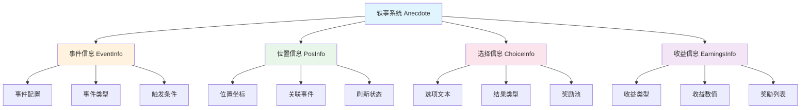
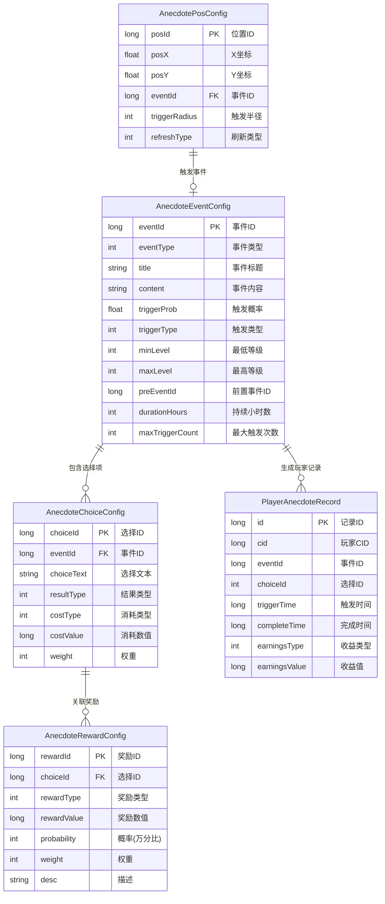
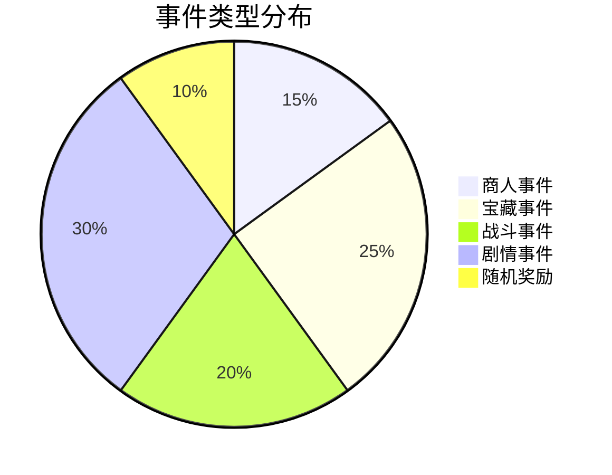
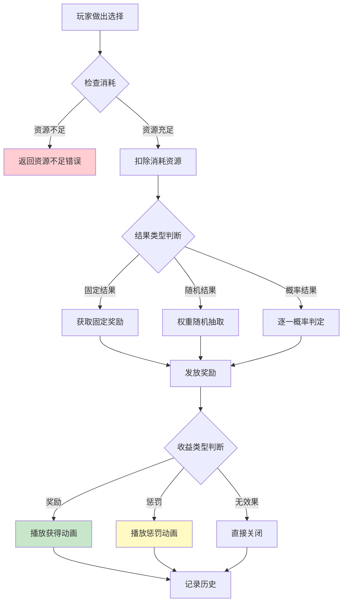
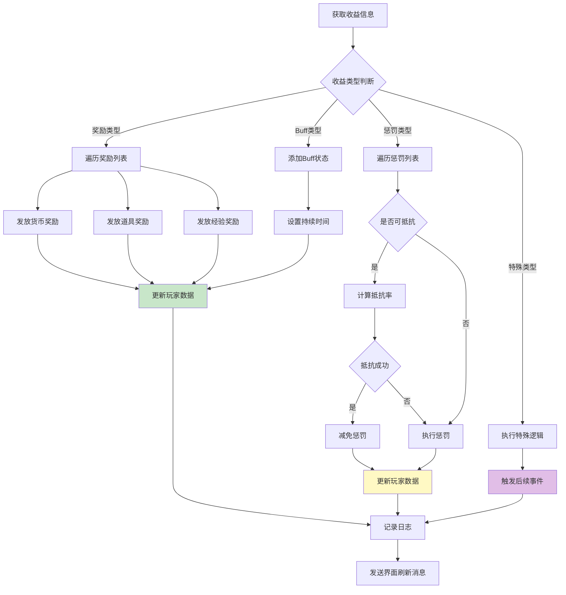
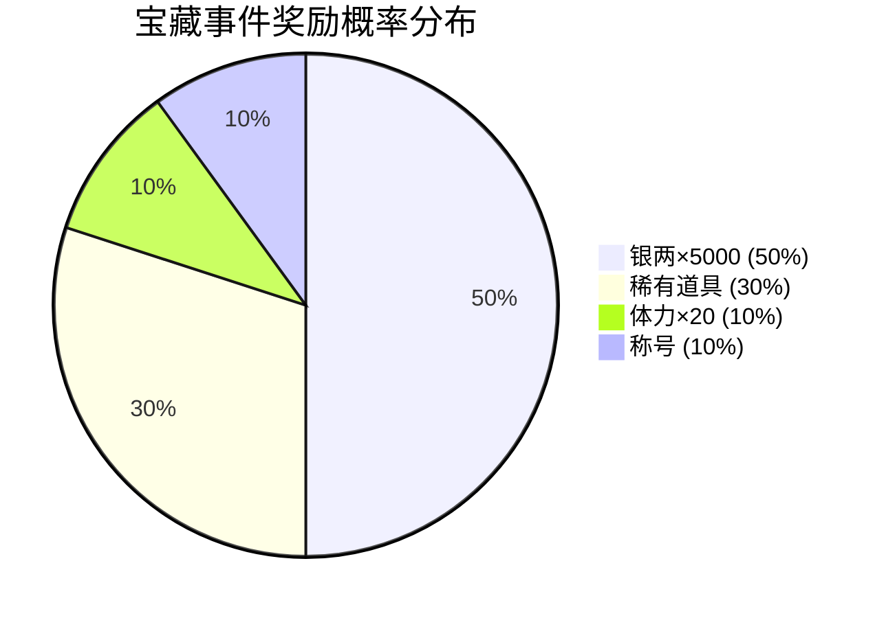
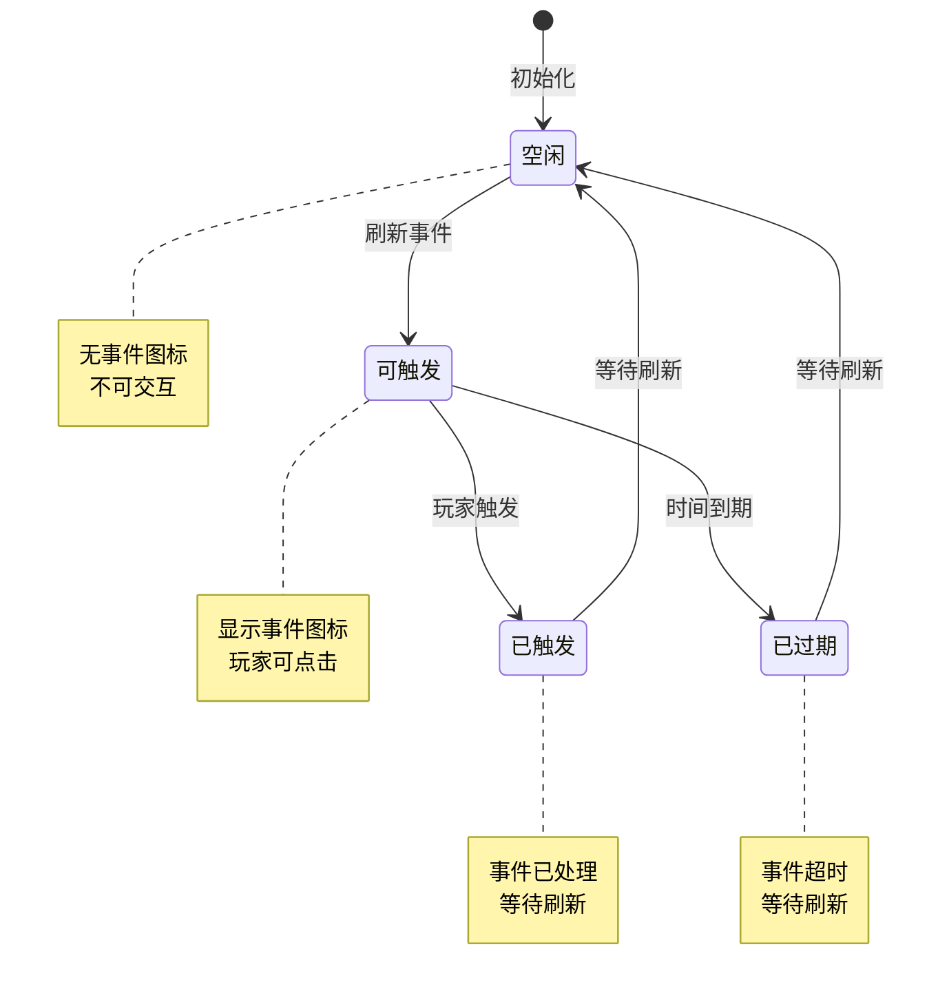
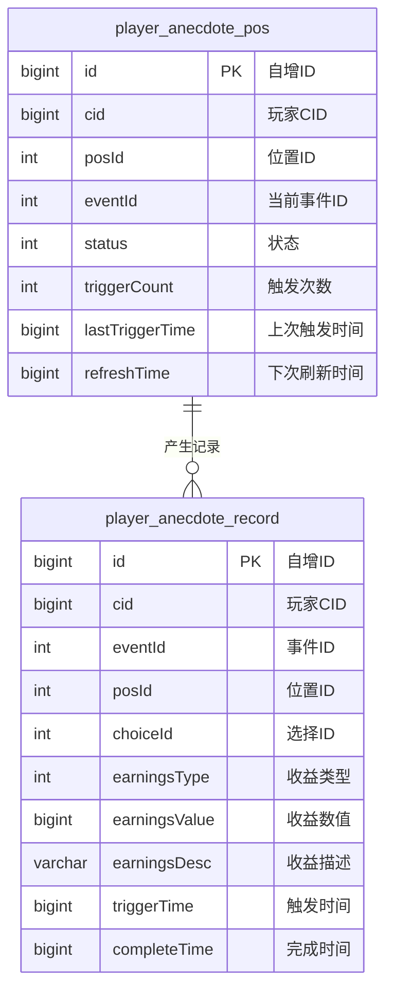
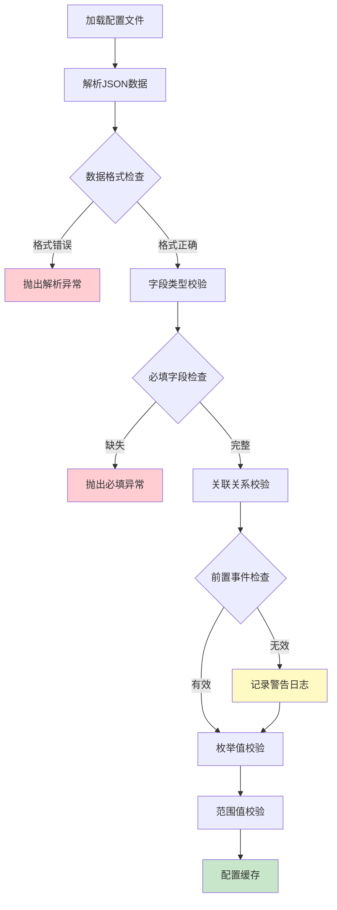

# 轶事/奇遇模块 - 数据配表

## 模块概述

**模块编号**: p039
**模块名称**: Anecdote (轶事/奇遇)
**模块类型**: 客户端独立组件
**主要功能**: 提供游戏内随机事件、奇遇系统的管理和展示

---

## 核心概念



---

## 配表文件列表

| 配表名称 | 文件路径 | 说明 |
|---------|---------|------|
| AnecdoteEventConfig | 游戏配置表/轶事事件配置 | 轶事事件基础配置 |
| AnecdoteChoiceConfig | 游戏配置表/轶事选择配置 | 选择项及结果配置 |
| AnecdoteRewardConfig | 游戏配置表/轶事奖励配置 | 奖励池配置 |
| AnecdotePosConfig | 游戏配置表/轶事位置配置 | 事件触发位置配置 |

---

## 配表关系图



---

## 1. 事件信息 (AnecdoteEventInfo)

**用途**: 存储轶事事件的基础信息

**路径**: `game_client/Assets/Scripts/LogicScripts/GameComponent/Anecdote/EventInfo/AnecdoteEventInfo.cs`

### 完整字段列表

| 字段名 | 类型 | 必填 | 默认值 | 说明 | 约束条件 |
|--------|------|------|--------|------|----------|
| eventId | int | 是 | - | 事件ID（主键） | 唯一，> 0 |
| eventType | int | 是 | 1 | 事件类型 | 1-5 枚举值 |
| title | String | 是 | "" | 事件标题 | 最大长度50 |
| content | String | 是 | "" | 事件内容描述 | 最大长度500 |
| triggerCondition | Object | 否 | null | 触发条件对象 | - |
| triggerProb | float | 是 | 0 | 触发概率 | 0.0 - 1.0 |
| triggerType | int | 是 | 1 | 触发类型 | 1-4 枚举值 |
| minLevel | int | 否 | 0 | 最低触发等级 | >= 0 |
| maxLevel | int | 否 | 999 | 最高触发等级 | >= minLevel |
| preEventId | long | 否 | 0 | 前置事件ID | 关联有效事件 |
| durationHours | int | 否 | 24 | 事件持续小时数 | > 0 |
| maxTriggerCount | int | 否 | -1 | 最大触发次数，-1表示无限 | >= -1 |
| priority | int | 否 | 0 | 显示优先级 | >= 0 |
| iconRes | String | 否 | "" | 图标资源路径 | 有效资源路径 |
| bgRes | String | 否 | "" | 背景资源路径 | 有效资源路径 |
| choiceList | List\<AnecdoteEventChoiceInfo\> | 是 | [] | 选择项列表 | 至少1个选项 |

### 事件类型枚举 (EAnecdoteEventType)

| 枚举值 | 数值 | 说明 | 触发场景 | 奖励特点 |
|--------|------|------|----------|----------|
| MERCHANT | 1 | 商人事件 | 特定位置触发 | 特殊物品购买 |
| TREASURE | 2 | 宝藏事件 | 探索时触发 | 随机奖励 |
| BATTLE | 3 | 战斗事件 | 游历/探索时触发 | 战斗胜利奖励 |
| STORY | 4 | 剧情事件 | 条件满足时触发 | 剧情/称号奖励 |
| RANDOM | 5 | 随机奖励 | 随机触发 | 纯随机奖励 |

### 触发类型枚举 (EAnecdoteTriggerType)

| 枚举值 | 数值 | 说明 | 触发机制 |
|--------|------|------|----------|
| POSITION | 1 | 位置触发 | 玩家进入特定坐标范围 |
| TIME | 2 | 时间触发 | 特定时间段自动触发 |
| CONDITION | 3 | 条件触发 | 满足特定条件时触发 |
| RANDOM | 4 | 随机触发 | 概率随机触发 |

### 触发条件结构 (triggerCondition)

```json
{
    "levelMin": 20,
    "levelMax": 100,
    "itemRequired": [
        {"itemType": 1, "itemId": 50001, "count": 1}
    ],
    "questRequired": [1001, 1002],
    "eventRequired": [2001],
    "vipLevelMin": 0,
    "timeRange": {
        "startHour": 8,
        "endHour": 22
    },
    "dayOfWeek": [1, 2, 3, 4, 5],
    "buildingLevelMin": {
        "buildingId": 1001,
        "level": 5
    }
}
```

### 事件配置示例

```json
{
    "eventId": 1001,
    "eventType": 1,
    "title": "神秘商人",
    "content": "你在路边遇到了一个神秘商人，他声称有稀有的宝物出售。",
    "triggerCondition": {
        "levelMin": 10,
        "levelMax": 100
    },
    "triggerProb": 0.1,
    "triggerType": 1,
    "minLevel": 10,
    "maxLevel": 100,
    "preEventId": 0,
    "durationHours": 24,
    "maxTriggerCount": -1,
    "priority": 10,
    "iconRes": "UI/Icon/anecdote_merchant",
    "bgRes": "UI/Bg/anecdote_bg_forest",
    "choiceList": [
        {
            "choiceId": 10011,
            "choiceText": "购买神秘宝箱",
            "resultType": 1,
            "costList": [{"costType": 2, "costValue": 50}],
            "rewardList": [
                {"rewardType": 1, "rewardValue": 50001, "count": 1, "probability": 10000}
            ]
        },
        {
            "choiceId": 10012,
            "choiceText": "离开",
            "resultType": 3,
            "costList": [],
            "rewardList": []
        }
    ]
}
```

### 事件类型分布图



---

## 2. 选择信息 (AnecdoteEventChoiceInfo)

**用途**: 存储事件的选择项信息

**路径**: `game_client/Assets/Scripts/LogicScripts/GameComponent/Anecdote/EventInfo/AnecdoteEventChoiceInfo.cs`

### 完整字段列表

| 字段名 | 类型 | 必填 | 默认值 | 说明 | 约束条件 |
|--------|------|------|--------|------|----------|
| choiceId | int | 是 | - | 选择ID（主键） | 唯一，> 0 |
| choiceText | String | 是 | "" | 选择显示文本 | 最大长度100 |
| resultType | int | 是 | 1 | 结果类型 | 1-3 枚举值 |
| costList | List\<CostInfo\> | 否 | [] | 消耗列表 | - |
| rewardList | List\<RewardInfo\> | 否 | [] | 奖励列表 | - |
| rewardInfo | AnecdoteEventRewardInfo | 否 | null | 固定奖励信息 | resultType=1时必填 |
| randomResults | List\<RandomResultInfo\> | 否 | [] | 随机结果列表 | resultType=2时必填 |
| probResults | List\<ProbResultInfo\> | 否 | [] | 概率结果列表 | resultType=3时必填 |
| desc | String | 否 | "" | 选择说明文字 | 最大长度200 |
| icon | String | 否 | "" | 选择图标 | 有效资源路径 |
| lockCondition | Object | 否 | null | 解锁条件 | - |
| isDefault | bool | 否 | false | 是否默认选项 | - |

### 结果类型枚举 (EAnecdoteResultType)

| 枚举值 | 数值 | 说明 | 结果计算方式 |
|--------|------|------|--------------|
| FIXED | 1 | 固定结果 | 直接发放固定奖励 |
| RANDOM | 2 | 随机结果 | 从奖励池按权重随机 |
| PROBABILITY | 3 | 概率结果 | 按概率逐一判定 |

### 消耗信息结构 (CostInfo)

```json
{
    "costType": 1,
    "costValue": 1000,
    "costDesc": "消耗银两×1000"
}
```

### 消耗类型枚举 (EAnecdoteCostType)

| 枚举值 | 数值 | 说明 | 用途 |
|--------|------|------|------|
| SILVER | 1 | 银两 | 通用货币消耗 |
| DIAMOND | 2 | 钻石 | 高级货币消耗 |
| STAMINA | 3 | 体力 | 体力消耗 |
| ITEM | 4 | 道具 | 特定道具消耗 |
| FOOD | 5 | 粮食 | 资源消耗 |

### 选择配置示例

```json
[
    {
        "choiceId": 10011,
        "choiceText": "购买神秘宝箱",
        "resultType": 2,
        "costList": [{"costType": 2, "costValue": 50}],
        "randomResults": [
            {
                "weight": 30,
                "earnings": {"earningsType": 1, "earningsValue": 5000, "earningsDesc": "银两×5000"}
            },
            {
                "weight": 50,
                "earnings": {"earningsType": 2, "earningsValue": 50001, "earningsDesc": "稀有道具×1"}
            },
            {
                "weight": 20,
                "earnings": {"earningsType": 3, "earningsValue": 20, "earningsDesc": "体力×20"}
            }
        ],
        "desc": "消耗钻石×50，随机获得奖励"
    },
    {
        "choiceId": 10012,
        "choiceText": "打开宝箱",
        "resultType": 3,
        "probResults": [
            {
                "probability": 5000,
                "earnings": {"earningsType": 1, "earningsValue": 5000, "earningsDesc": "银两×5000"}
            },
            {
                "probability": 3000,
                "earnings": {"earningsType": 2, "earningsValue": 50002, "earningsDesc": "稀有装备×1"}
            },
            {
                "probability": 2000,
                "earnings": {"earningsType": 4, "earningsValue": 20, "earningsDesc": "触发陷阱，损失体力×20"}
            }
        ],
        "desc": "50%获得银两，30%获得装备，20%触发陷阱"
    },
    {
        "choiceId": 10013,
        "choiceText": "离开",
        "resultType": 1,
        "rewardInfo": {"earningsType": 0, "earningsValue": 0, "earningsDesc": "无效果"},
        "desc": "不做任何操作，直接离开"
    }
]
```

### 选择结果流程图



---

## 3. 收益信息 (AnecdoteEventEarningsInfo)

**用途**: 存储选择后的收益/惩罚信息

**路径**: `game_client/Assets/Scripts/LogicScripts/GameComponent/Anecdote/EventInfo/AnecdoteEventEarningsInfo.cs`

### 完整字段列表

| 字段名 | 类型 | 必填 | 默认值 | 说明 | 约束条件 |
|--------|------|------|--------|------|----------|
| earningsType | int | 是 | 0 | 收益类型 | 0-5 枚举值 |
| earningsValue | long | 是 | 0 | 收益数值 | >= 0 |
| earningsDesc | String | 否 | "" | 收益描述 | 最大长度100 |
| rewardList | List\<RewardItem\> | 否 | [] | 奖励物品列表 | - |
| penaltyList | List\<PenaltyItem\> | 否 | [] | 惩罚项目列表 | - |
| buffList | List\<BuffInfo\> | 否 | [] | 获得的Buff列表 | - |
| titleId | long | 否 | 0 | 获得的称号ID | 关联称号配置 |
| unlockId | long | 否 | 0 | 解锁内容ID | 关联解锁配置 |
| dialogueId | long | 否 | 0 | 触发的对话ID | 关联对话配置 |
| nextEventId | long | 否 | 0 | 触发的后续事件ID | 关联事件配置 |

### 收益类型枚举 (EAnecdoteEarningsType)

| 枚举值 | 数值 | 说明 | 处理方式 |
|--------|------|------|----------|
| NONE | 0 | 无效果 | 直接结束 |
| REWARD | 1 | 获得奖励 | 发放资源/物品 |
| PENALTY | 2 | 受到惩罚 | 扣除资源/施加状态 |
| BUFF | 3 | 获得增益 | 添加临时Buff |
| DEBUFF | 4 | 受到减益 | 添加临时Debuff |
| SPECIAL | 5 | 特殊效果 | 触发特殊逻辑 |

### 奖励物品结构 (RewardItem)

```json
{
    "rewardType": 1,
    "rewardValue": 50001,
    "count": 1,
    "bindType": 1,
    "expireTime": 0
}
```

### 惩罚项目结构 (PenaltyItem)

```json
{
    "penaltyType": 1,
    "penaltyValue": 50,
    "penaltyDesc": "体力损失50点",
    "canResist": true,
    "resistRate": 2000
}
```

### 惩罚类型枚举 (EAnecdotePenaltyType)

| 枚举值 | 数值 | 说明 | 影响范围 |
|--------|------|------|----------|
| STAMINA | 1 | 体力损失 | 角色属性 |
| SILVER | 2 | 银两损失 | 货币资源 |
| FOOD | 3 | 粮食损失 | 城镇资源 |
| SOLDIER | 4 | 士兵损失 | 军事力量 |
| MORALE | 5 | 士气下降 | 军队属性 |

### 收益配置示例

```json
{
    "earningsType": 1,
    "earningsValue": 5000,
    "earningsDesc": "获得银两×5000",
    "rewardList": [
        {"rewardType": 1, "rewardValue": 50001, "count": 1, "bindType": 0, "expireTime": 0}
    ],
    "penaltyList": [],
    "buffList": [],
    "titleId": 0,
    "unlockId": 0,
    "dialogueId": 0,
    "nextEventId": 0
}
```

### 收益处理流程图



---

## 4. 奖励信息 (AnecdoteEventRewardInfo)

**用途**: 存储选择后的奖励详情

**路径**: `game_client/Assets/Scripts/LogicScripts/GameComponent/Anecdote/EventInfo/AnecdoteEventRewardInfo.cs`

### 完整字段列表

| 字段名 | 类型 | 必填 | 默认值 | 说明 | 约束条件 |
|--------|------|------|--------|------|----------|
| rewardId | long | 是 | - | 奖励ID（主键） | 唯一，> 0 |
| rewardType | int | 是 | 1 | 奖励类型 | 1-10 枚举值 |
| rewardValue | long | 是 | 0 | 奖励数值/ID | >= 0 |
| count | int | 是 | 1 | 奖励数量 | > 0 |
| probability | int | 否 | 10000 | 概率(万分比) | 0-10000 |
| weight | int | 否 | 0 | 权重 | >= 0 |
| bindType | int | 否 | 0 | 绑定类型 | 0-2 |
| expireHours | int | 否 | 0 | 过期小时数，0表示永久 | >= 0 |
| desc | String | 否 | "" | 奖励描述 | 最大长度100 |
| icon | String | 否 | "" | 奖励图标 | 有效资源路径 |
| quality | int | 否 | 1 | 品质 | 1-5 |
| isShow | bool | 否 | true | 是否显示 | - |

### 奖励类型枚举 (EAnecdoteRewardType)

| 枚举值 | 数值 | 说明 | rewardValue含义 |
|--------|------|------|-----------------|
| ITEM | 1 | 道具 | 道具ID |
| SILVER | 2 | 银两 | 银两数量 |
| DIAMOND | 3 | 钻石 | 钻石数量 |
| EXP | 4 | 经验 | 经验值 |
| STAMINA | 5 | 体力 | 体力值 |
| FOOD | 6 | 粮食 | 粮食数量 |
| SOLDIER | 7 | 士兵 | 士兵数量 |
| TITLE | 8 | 称号 | 称号ID |
| SKIN | 9 | 皮肤 | 皮肤ID |
| CHEST | 10 | 宝箱 | 宝箱ID |

### 绑定类型枚举 (EBindType)

| 枚举值 | 数值 | 说明 | 交易限制 |
|--------|------|------|----------|
| NONE | 0 | 不绑定 | 可交易 |
| PICKUP | 1 | 拾取绑定 | 不可交易 |
| EQUIP | 2 | 装备绑定 | 装备后不可交易 |

### 奖励配置示例

```json
[
    {
        "rewardId": 20001,
        "rewardType": 2,
        "rewardValue": 5000,
        "count": 1,
        "probability": 5000,
        "weight": 30,
        "desc": "银两×5000",
        "quality": 2
    },
    {
        "rewardId": 20002,
        "rewardType": 1,
        "rewardValue": 50001,
        "count": 1,
        "probability": 3000,
        "weight": 50,
        "bindType": 1,
        "desc": "稀有道具×1",
        "quality": 4
    },
    {
        "rewardId": 20003,
        "rewardType": 8,
        "rewardValue": 101,
        "count": 1,
        "probability": 1000,
        "weight": 10,
        "desc": "称号：宝藏猎人",
        "quality": 5
    }
]
```

### 奖励概率分布图



---

## 5. 位置信息 (AnecdotePosInfo)

**用途**: 存储事件触发的位置信息

**路径**: `game_client/Assets/Scripts/LogicScripts/GameComponent/Anecdote/AnecdotePosInfo.cs`

### 完整字段列表

| 字段名 | 类型 | 必填 | 默认值 | 说明 | 约束条件 |
|--------|------|------|--------|------|----------|
| posId | int | 是 | - | 位置ID（主键） | 唯一，> 0 |
| posX | float | 是 | 0 | X坐标 | 游戏地图坐标 |
| posY | float | 是 | 0 | Y坐标 | 游戏地图坐标 |
| eventId | int | 是 | 0 | 关联事件ID | 关联有效事件 |
| triggerRadius | float | 否 | 50 | 触发半径 | > 0 |
| refreshType | int | 否 | 1 | 刷新类型 | 1-4 枚举值 |
| refreshInterval | int | 否 | 24 | 刷新间隔(小时) | > 0 |
| expireTime | long | 否 | 0 | 过期时间戳 | >= 0 |
| status | int | 否 | 0 | 当前状态 | 0-3 枚举值 |
| sceneId | int | 否 | 0 | 场景ID | 关联场景配置 |
| buildingId | long | 否 | 0 | 关联建筑ID | 关联建筑配置 |

### 刷新类型枚举 (EAnecdoteRefreshType)

| 枚举值 | 数值 | 说明 | 刷新时机 |
|--------|------|------|----------|
| TIMED | 1 | 定时刷新 | 固定间隔刷新 |
| DAILY | 2 | 每日刷新 | 每日固定时间刷新 |
| WEEKLY | 3 | 每周刷新 | 每周固定时间刷新 |
| TRIGGER | 4 | 触发刷新 | 玩家触发后刷新 |

### 位置状态枚举 (EAnecdotePosStatus)

| 枚举值 | 数值 | 说明 | 可见性 |
|--------|------|------|--------|
| EMPTY | 0 | 空闲 | 不可见 |
| READY | 1 | 可触发 | 显示图标 |
| TRIGGERED | 2 | 已触发 | 隐藏 |
| EXPIRED | 3 | 已过期 | 隐藏 |

### 位置配置示例

```json
{
    "posId": 1001,
    "posX": 120.5,
    "posY": 80.3,
    "eventId": 1001,
    "triggerRadius": 50,
    "refreshType": 1,
    "refreshInterval": 24,
    "expireTime": 0,
    "status": 1,
    "sceneId": 1,
    "buildingId": 0
}
```

### 位置状态机图



---

## 数据库表结构

### player_anecdote_record（玩家轶事记录表）

```sql
CREATE TABLE IF NOT EXISTS `player_anecdote_record` (
    `id` bigint(20) NOT NULL AUTO_INCREMENT COMMENT '自增主键',
    `cid` bigint(20) NOT NULL COMMENT '玩家CID',
    `eventId` int(11) NOT NULL COMMENT '事件ID',
    `posId` int(11) NOT NULL DEFAULT '0' COMMENT '位置ID',
    `choiceId` int(11) NOT NULL COMMENT '选择ID',
    `earningsType` int(11) NOT NULL DEFAULT '0' COMMENT '收益类型',
    `earningsValue` bigint(20) NOT NULL DEFAULT '0' COMMENT '收益数值',
    `earningsDesc` varchar(200) DEFAULT '' COMMENT '收益描述',
    `triggerTime` bigint(20) NOT NULL COMMENT '触发时间(毫秒)',
    `completeTime` bigint(20) NOT NULL COMMENT '完成时间(毫秒)',
    `createTime` datetime DEFAULT CURRENT_TIMESTAMP COMMENT '创建时间',
    PRIMARY KEY (`id`),
    KEY `idx_cid` (`cid`),
    KEY `idx_eventId` (`eventId`),
    KEY `idx_triggerTime` (`triggerTime`),
    KEY `idx_cid_eventId` (`cid`, `eventId`)
) COMMENT='玩家轶事事件记录' engine=InnoDB DEFAULT CHARSET=utf8mb4;
```

### player_anecdote_pos（玩家轶事位置状态表）

```sql
CREATE TABLE IF NOT EXISTS `player_anecdote_pos` (
    `id` bigint(20) NOT NULL AUTO_INCREMENT COMMENT '自增主键',
    `cid` bigint(20) NOT NULL COMMENT '玩家CID',
    `posId` int(11) NOT NULL COMMENT '位置ID',
    `eventId` int(11) NOT NULL COMMENT '当前事件ID',
    `status` int(11) NOT NULL DEFAULT '0' COMMENT '状态',
    `triggerCount` int(11) NOT NULL DEFAULT '0' COMMENT '触发次数',
    `lastTriggerTime` bigint(20) NOT NULL DEFAULT '0' COMMENT '上次触发时间',
    `refreshTime` bigint(20) NOT NULL DEFAULT '0' COMMENT '下次刷新时间',
    `createTime` datetime DEFAULT CURRENT_TIMESTAMP COMMENT '创建时间',
    `updateTime` datetime DEFAULT CURRENT_TIMESTAMP ON UPDATE CURRENT_TIMESTAMP COMMENT '更新时间',
    PRIMARY KEY (`id`),
    UNIQUE KEY `uk_cid_posId` (`cid`, `posId`),
    KEY `idx_status` (`status`),
    KEY `idx_refreshTime` (`refreshTime`)
) COMMENT='玩家轶事位置状态' engine=InnoDB DEFAULT CHARSET=utf8mb4;
```

### 数据库表关系图



---

## 代码示例

### 服务端配置读取

```java
// 服务端获取轶事事件配置
public AnecdoteEventConfig getAnecdoteEventConfig(int eventId) {
    return AnecdoteEventConfigDao.getById(eventId);
}

// 获取事件选择配置
public List<AnecdoteChoiceConfig> getChoiceList(int eventId) {
    return AnecdoteChoiceConfigDao.getByEventId(eventId);
}

// 检查触发条件
public boolean checkTriggerCondition(long playerId, AnecdoteEventConfig config) {
    // 检查等级条件
    PlayerData playerData = playerService.getPlayerData(playerId);
    if (playerData.getLevel() < config.getMinLevel() ||
        playerData.getLevel() > config.getMaxLevel()) {
        return false;
    }

    // 检查前置事件
    if (config.getPreEventId() > 0) {
        if (!playerAnecdoteDao.hasTriggeredEvent(playerId, config.getPreEventId())) {
            return false;
        }
    }

    // 检查触发次数
    if (config.getMaxTriggerCount() > 0) {
        int triggerCount = playerAnecdoteDao.getTriggerCount(playerId, config.getEventId());
        if (triggerCount >= config.getMaxTriggerCount()) {
            return false;
        }
    }

    return true;
}
```

### 客户端配置使用

```csharp
/// <summary>
/// 获取轶事事件配置
/// </summary>
public AnecdoteEventInfo GetEventInfo(int eventId)
{
    foreach (var info in _m_eventInfoList)
    {
        if (info.eventId == eventId)
            return info;
    }
    return null;
}

/// <summary>
/// 检查事件是否可触发
/// </summary>
public bool CanTriggerEvent(AnecdoteEventInfo eventInfo)
{
    // 检查等级条件
    int playerLevel = NPPlayer.instance.level;
    if (playerLevel < eventInfo.minLevel || playerLevel > eventInfo.maxLevel)
        return false;

    // 检查前置事件
    if (eventInfo.preEventId > 0)
    {
        if (!HasTriggeredEvent(eventInfo.preEventId))
            return false;
    }

    // 检查触发次数
    if (eventInfo.maxTriggerCount > 0)
    {
        int triggerCount = GetTriggerCount(eventInfo.eventId);
        if (triggerCount >= eventInfo.maxTriggerCount)
            return false;
    }

    return true;
}

/// <summary>
/// 计算触发概率
/// </summary>
public float CalculateTriggerProbability(AnecdoteEventInfo eventInfo)
{
    float baseProb = eventInfo.triggerProb;
    float luckBonus = NPPlayer.instance.GetLuckBonus();
    float timeBonus = GetTimeBonus();

    return baseProb * luckBonus * timeBonus;
}
```

### 配置解析代码

```csharp
/// <summary>
/// 轶事事件配置解析
/// </summary>
public class AnecdoteConfigParser
{
    public static List<AnecdoteEventInfo> ParseEventConfig(string json)
    {
        var eventData = JsonUtility.FromJson<AnecdoteEventData>(json);
        var eventList = new List<AnecdoteEventInfo>();

        foreach (var item in eventData.events)
        {
            var eventInfo = new AnecdoteEventInfo();
            eventInfo.eventId = item.eventId;
            eventInfo.eventType = item.eventType;
            eventInfo.title = item.title;
            eventInfo.content = item.content;
            eventInfo.triggerProb = item.triggerProb;
            eventInfo.triggerType = item.triggerType;
            eventInfo.minLevel = item.minLevel;
            eventInfo.maxLevel = item.maxLevel;
            eventInfo.preEventId = item.preEventId;
            eventInfo.durationHours = item.durationHours;
            eventInfo.maxTriggerCount = item.maxTriggerCount;

            // 解析选择项
            eventInfo.choiceList = ParseChoiceList(item.choiceList);

            eventList.Add(eventInfo);
        }

        return eventList;
    }

    private static List<AnecdoteEventChoiceInfo> ParseChoiceList(List<ChoiceData> choiceDataList)
    {
        var choiceList = new List<AnecdoteEventChoiceInfo>();

        foreach (var choiceData in choiceDataList)
        {
            var choiceInfo = new AnecdoteEventChoiceInfo();
            choiceInfo.choiceId = choiceData.choiceId;
            choiceInfo.choiceText = choiceData.choiceText;
            choiceInfo.resultType = choiceData.resultType;

            // 解析消耗列表
            choiceInfo.costList = ParseCostList(choiceData.costList);

            // 解析奖励列表
            choiceInfo.rewardList = ParseRewardList(choiceData.rewardList);

            choiceList.Add(choiceInfo);
        }

        return choiceList;
    }
}
```

---

## 配表校验规则

### 事件配置校验

| 字段名 | 校验规则 | 异常处理 | 校验时机 |
|--------|----------|----------|----------|
| eventId | 必须唯一，范围 > 0 | 配表加载时去重 | 加载时 |
| eventType | 必须 1-5 枚举值 | 强制默认值1 | 加载时 |
| title | 非空，最大50字符 | 截断处理 | 加载时 |
| content | 非空，最大500字符 | 截断处理 | 加载时 |
| triggerProb | 范围 0.0-1.0 | 强制限制范围 | 加载时 |
| minLevel/maxLevel | minLevel <= maxLevel | 交换值 | 加载时 |
| preEventId | 必须关联有效事件 | 加载时警告 | 加载时 |
| choiceList | 至少1个选项 | 加载时报错 | 加载时 |

### 选择配置校验

| 字段名 | 校验规则 | 异常处理 | 校验时机 |
|--------|----------|----------|----------|
| choiceId | 必须唯一，范围 > 0 | 配表加载时去重 | 加载时 |
| resultType | 必须 1-3 枚举值 | 强制默认值1 | 加载时 |
| costList | 消耗类型必须有效 | 忽略无效消耗 | 加载时 |
| rewardList | 奖励类型必须有效 | 忽略无效奖励 | 加载时 |

### 配置校验流程图



---

## 配置文件位置

```
game_client/Assets/Scripts/LogicScripts/GameComponent/Anecdote/
├── AnecdotePosInfo.cs                    # 位置信息
└── EventInfo/
    ├── AnecdoteEventInfo.cs              # 事件信息
    ├── AnecdoteEventChoiceInfo.cs        # 选择信息
    ├── AnecdoteEventEarningsInfo.cs      # 收益信息
    └── AnecdoteEventRewardInfo.cs        # 奖励信息

game_client/Assets/Scripts/ClientProtocol/Common/AnecdoteObj/
├── Anecdote_EventInfo.cs                 # 协议事件信息
└── Anecdote_EventExtraData_Earnings.cs   # 协议收益数据

game_server/DBTool/source_db/UserServer/
├── player_anecdote_record.py             # 玩家记录表定义
└── player_anecdote_pos.py                # 位置状态表定义
```

---

*文档生成时间: 2026-04-12*
*文档版本: v2.0.0*
