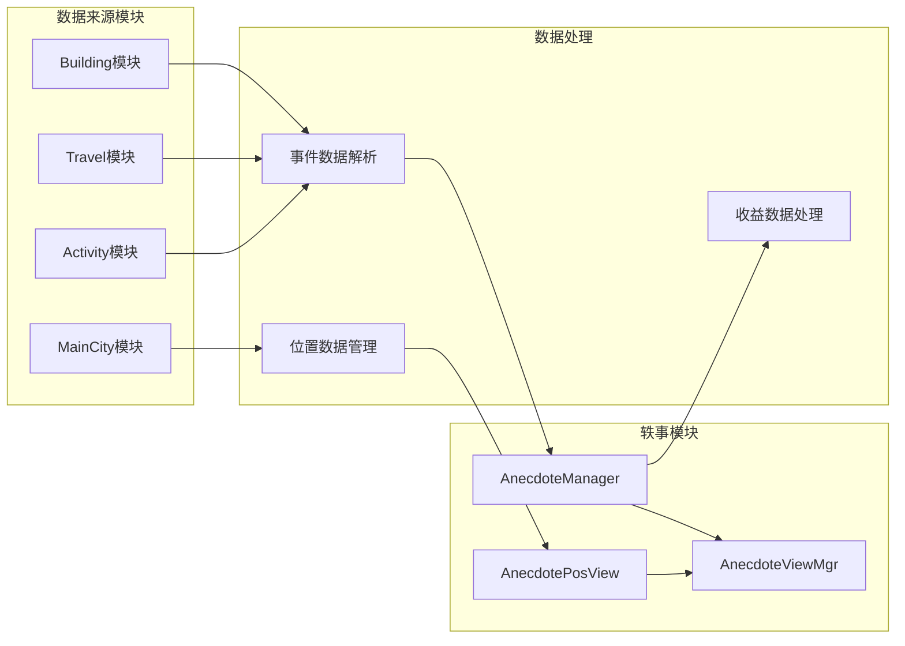
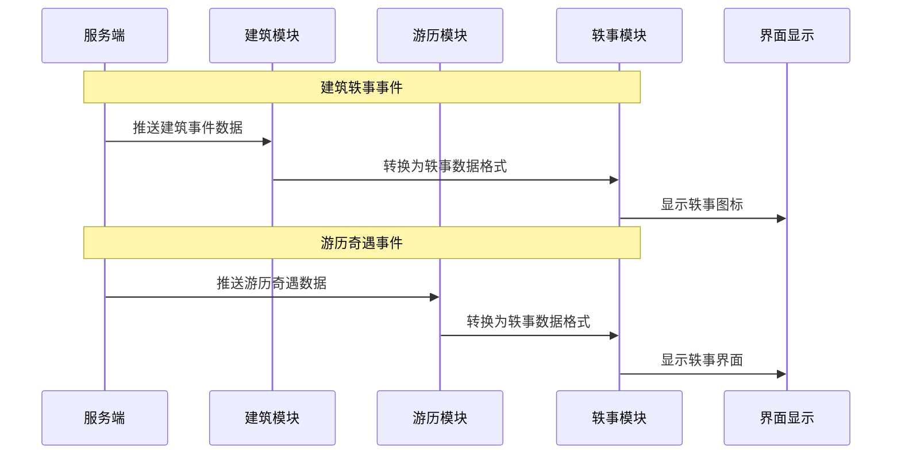
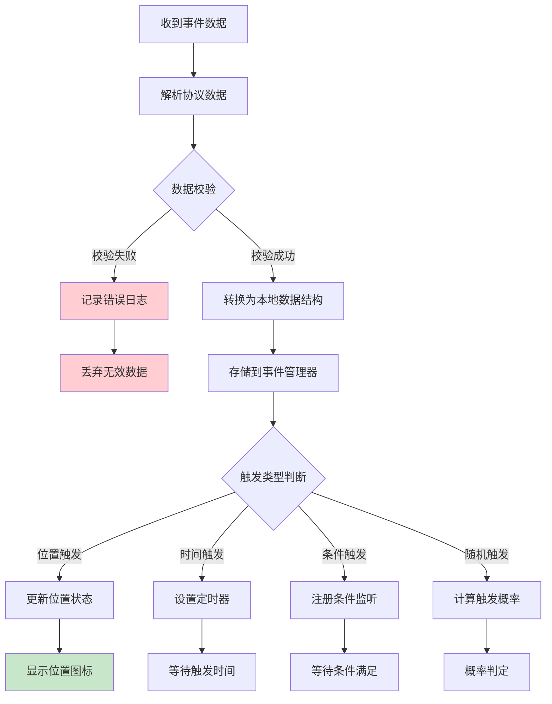
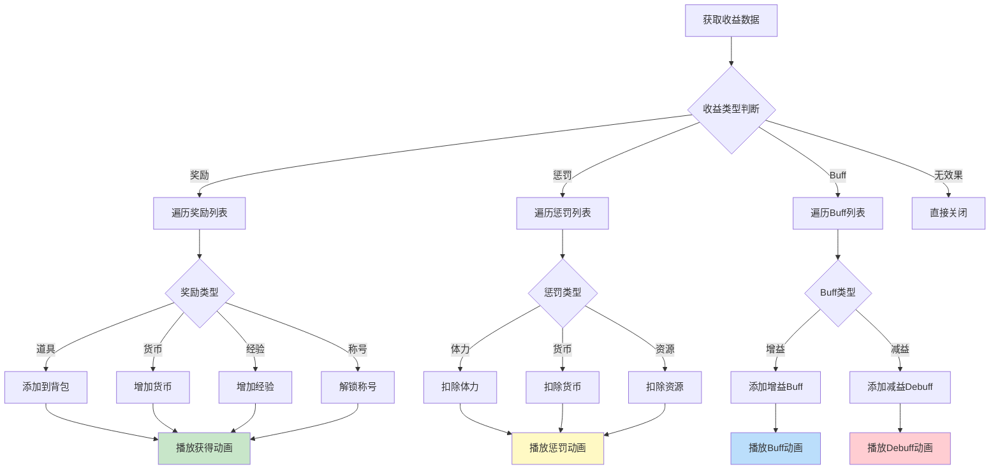

# 轶事/奇遇模块 - 协议文档

## 模块说明

本模块为客户端独立组件，不涉及独立的服务端协议通信。

事件数据和奖励数据由其他模块（如 Building、Travel 等）通过业务协议同步。轶事模块主要负责本地事件展示和交互逻辑。

---

## 一、协议总览



---

## 二、关联协议

### 数据来源

轶事事件通常由以下模块触发:

| 模块 | 触发场景 | 数据格式 | 处理方式 |
|------|----------|----------|----------|
| Building | 建筑随机事件 | BuildingEventData | 建筑界面显示轶事图标 |
| Travel | 游历奇遇 | TravelEventData | 游历中弹窗显示 |
| Activity | 活动事件 | ActivityEventData | 活动界面触发 |
| MainCity | 主城探索 | MainCityEventData | 地图位置触发 |

### 协议数据流



---

## 三、协议对象定义

### 1. Anecdote_EventInfo - 轶事事件信息

**路径**: `game_client/Assets/Scripts/ClientProtocol/Common/AnecdoteObj/Anecdote_EventInfo.cs`

**用途**: 轶事事件的核心数据结构，用于模块间传递事件信息

#### 完整字段列表

| 字段名 | 类型 | 必填 | 说明 | 约束条件 |
|--------|------|------|------|----------|
| eventId | int | 是 | 事件ID | > 0 |
| eventType | int | 是 | 事件类型 | 1-5 |
| title | string | 是 | 事件标题 | 最大50字符 |
| content | string | 是 | 事件内容 | 最大500字符 |
| triggerType | int | 否 | 触发类型 | 1-4 |
| triggerProb | float | 否 | 触发概率 | 0.0-1.0 |
| choiceList | List\<Anecdote_EventChoice\> | 是 | 选择项列表 | 至少1项 |
| triggerCondition | Anecdote_TriggerCondition | 否 | 触发条件 | - |
| posInfo | Anecdote_PosInfo | 否 | 位置信息 | 位置触发时必填 |
| durationMs | long | 否 | 持续时间(毫秒) | > 0 |
| iconRes | string | 否 | 图标资源 | 有效路径 |
| bgRes | string | 否 | 背景资源 | 有效路径 |
| priority | int | 否 | 显示优先级 | >= 0 |

#### 协议定义

```csharp
public class Anecdote_EventInfo : _IALProtocolStructure
{
    private int eventId;                                      // 事件ID
    private int eventType;                                    // 事件类型
    private string title;                                     // 事件标题
    private string content;                                   // 事件内容
    private int triggerType;                                  // 触发类型
    private float triggerProb;                                // 触发概率
    private List<Anecdote_EventChoice> choiceList;           // 选择项列表
    private Anecdote_TriggerCondition triggerCondition;       // 触发条件
    private Anecdote_PosInfo posInfo;                         // 位置信息
    private long durationMs;                                  // 持续时间
    private string iconRes;                                   // 图标资源
    private string bgRes;                                     // 背景资源
    private int priority;                                     // 显示优先级

    public int getEventId() { return eventId; }
    public int getEventType() { return eventType; }
    public string getTitle() { return title; }
    public string getContent() { return content; }
    public int getTriggerType() { return triggerType; }
    public float getTriggerProb() { return triggerProb; }
    public List<Anecdote_EventChoice> getChoiceList() { return choiceList; }
    public Anecdote_TriggerCondition getTriggerCondition() { return triggerCondition; }
    public Anecdote_PosInfo getPosInfo() { return posInfo; }
    public long getDurationMs() { return durationMs; }
    public string getIconRes() { return iconRes; }
    public string getBgRes() { return bgRes; }
    public int getPriority() { return priority; }
}
```

#### 数据示例

```json
{
    "eventId": 1001,
    "eventType": 1,
    "title": "神秘商人",
    "content": "你在路边遇到了一个神秘商人，他声称有稀有的宝物出售。",
    "triggerType": 1,
    "triggerProb": 0.1,
    "choiceList": [
        {
            "choiceId": 10011,
            "choiceText": "购买神秘宝箱",
            "costList": [{"costType": 2, "costValue": 50}],
            "resultType": 2
        },
        {
            "choiceId": 10012,
            "choiceText": "离开",
            "costList": [],
            "resultType": 1
        }
    ],
    "triggerCondition": {
        "levelMin": 10,
        "levelMax": 100
    },
    "posInfo": {
        "posId": 1001,
        "posX": 120.5,
        "posY": 80.3
    },
    "durationMs": 86400000,
    "iconRes": "UI/Icon/anecdote_merchant",
    "bgRes": "UI/Bg/anecdote_bg_forest",
    "priority": 10
}
```

---

### 2. Anecdote_EventChoice - 事件选择项

**路径**: `game_client/Assets/Scripts/ClientProtocol/Common/AnecdoteObj/Anecdote_EventChoice.cs`

**用途**: 存储事件的选择项信息

#### 完整字段列表

| 字段名 | 类型 | 必填 | 说明 | 约束条件 |
|--------|------|------|------|----------|
| choiceId | int | 是 | 选择ID | > 0 |
| choiceText | string | 是 | 选择文本 | 最大100字符 |
| resultType | int | 是 | 结果类型 | 1-3 |
| costList | List\<Anecdote_CostInfo\> | 否 | 消耗列表 | - |
| rewardList | List\<Anecdote_RewardInfo\> | 否 | 奖励列表 | - |
| desc | string | 否 | 选择说明 | 最大200字符 |
| icon | string | 否 | 选择图标 | 有效路径 |
| isLocked | bool | 否 | 是否锁定 | - |
| lockReason | string | 否 | 锁定原因 | - |

#### 协议定义

```csharp
public class Anecdote_EventChoice : _IALProtocolStructure
{
    private int choiceId;                                 // 选择ID
    private string choiceText;                            // 选择文本
    private int resultType;                               // 结果类型
    private List<Anecdote_CostInfo> costList;            // 消耗列表
    private List<Anecdote_RewardInfo> rewardList;        // 奖励列表
    private string desc;                                  // 选择说明
    private string icon;                                  // 选择图标
    private bool isLocked;                                // 是否锁定
    private string lockReason;                            // 锁定原因

    public int getChoiceId() { return choiceId; }
    public string getChoiceText() { return choiceText; }
    public int getResultType() { return resultType; }
    public List<Anecdote_CostInfo> getCostList() { return costList; }
    public List<Anecdote_RewardInfo> getRewardList() { return rewardList; }
    public string getDesc() { return desc; }
    public string getIcon() { return icon; }
    public bool getIsLocked() { return isLocked; }
    public string getLockReason() { return lockReason; }
}
```

---

### 3. Anecdote_EventExtraData_Earnings - 收益数据

**路径**: `game_client/Assets/Scripts/ClientProtocol/Common/AnecdoteObj/Anecdote_EventExtraData_Earnings.cs`

**用途**: 存储选择后的收益结果数据

#### 完整字段列表

| 字段名 | 类型 | 必填 | 说明 | 约束条件 |
|--------|------|------|------|----------|
| earningsType | int | 是 | 收益类型 | 0-5 |
| earningsValue | long | 是 | 收益数值 | >= 0 |
| earningsDesc | string | 否 | 收益描述 | 最大100字符 |
| rewardList | List\<Anecdote_RewardInfo\> | 否 | 奖励列表 | - |
| penaltyList | List\<Anecdote_PenaltyInfo\> | 否 | 惩罚列表 | - |
| buffList | List\<Anecdote_BuffInfo\> | 否 | Buff列表 | - |
| titleId | long | 否 | 称号ID | > 0 |
| unlockId | long | 否 | 解锁ID | > 0 |
| nextEventId | long | 否 | 后续事件ID | > 0 |

#### 协议定义

```csharp
public class Anecdote_EventExtraData_Earnings : _IALProtocolStructure
{
    private int earningsType;                              // 收益类型
    private long earningsValue;                            // 收益数值
    private string earningsDesc;                           // 收益描述
    private List<Anecdote_RewardInfo> rewardList;         // 奖励列表
    private List<Anecdote_PenaltyInfo> penaltyList;       // 惩罚列表
    private List<Anecdote_BuffInfo> buffList;             // Buff列表
    private long titleId;                                  // 称号ID
    private long unlockId;                                 // 解锁ID
    private long nextEventId;                              // 后续事件ID

    public int getEarningsType() { return earningsType; }
    public long getEarningsValue() { return earningsValue; }
    public string getEarningsDesc() { return earningsDesc; }
    public List<Anecdote_RewardInfo> getRewardList() { return rewardList; }
    public List<Anecdote_PenaltyInfo> getPenaltyList() { return penaltyList; }
    public List<Anecdote_BuffInfo> getBuffList() { return buffList; }
    public long getTitleId() { return titleId; }
    public long getUnlockId() { return unlockId; }
    public long getNextEventId() { return nextEventId; }
}
```

#### 数据示例

```json
{
    "earningsType": 1,
    "earningsValue": 5000,
    "earningsDesc": "获得银两×5000",
    "rewardList": [
        {
            "rewardType": 1,
            "rewardValue": 50001,
            "count": 1,
            "quality": 4
        }
    ],
    "penaltyList": [],
    "buffList": [],
    "titleId": 0,
    "unlockId": 0,
    "nextEventId": 0
}
```

---

### 4. Anecdote_TriggerCondition - 触发条件

**路径**: `game_client/Assets/Scripts/ClientProtocol/Common/AnecdoteObj/Anecdote_TriggerCondition.cs`

**用途**: 存储事件触发条件信息

#### 完整字段列表

| 字段名 | 类型 | 必填 | 说明 | 约束条件 |
|--------|------|------|------|----------|
| levelMin | int | 否 | 最低等级 | >= 0 |
| levelMax | int | 否 | 最高等级 | >= levelMin |
| itemRequired | List\<ItemInfo\> | 否 | 需求物品 | - |
| questRequired | List\<long\> | 否 | 需求任务 | - |
| eventRequired | List\<long\> | 否 | 需求前置事件 | - |
| vipLevelMin | int | 否 | 最低VIP等级 | >= 0 |
| timeRange | TimeRange | 否 | 时间范围 | - |
| dayOfWeek | List\<int\> | 否 | 星期几 | 1-7 |
| buildingLevelMin | BuildingLevel | 否 | 建筑等级要求 | - |

#### 协议定义

```csharp
public class Anecdote_TriggerCondition : _IALProtocolStructure
{
    private int levelMin;                                  // 最低等级
    private int levelMax;                                  // 最高等级
    private List<ItemInfo> itemRequired;                  // 需求物品
    private List<long> questRequired;                     // 需求任务
    private List<long> eventRequired;                     // 需求前置事件
    private int vipLevelMin;                               // 最低VIP等级
    private TimeRange timeRange;                           // 时间范围
    private List<int> dayOfWeek;                           // 星期几
    private BuildingLevel buildingLevelMin;                // 建筑等级要求

    public int getLevelMin() { return levelMin; }
    public int getLevelMax() { return levelMax; }
    public List<ItemInfo> getItemRequired() { return itemRequired; }
    public List<long> getQuestRequired() { return questRequired; }
    public List<long> getEventRequired() { return eventRequired; }
    public int getVipLevelMin() { return vipLevelMin; }
    public TimeRange getTimeRange() { return timeRange; }
    public List<int> getDayOfWeek() { return dayOfWeek; }
    public BuildingLevel getBuildingLevelMin() { return buildingLevelMin; }
}
```

---

### 5. Anecdote_PosInfo - 位置信息

**路径**: `game_client/Assets/Scripts/ClientProtocol/Common/AnecdoteObj/Anecdote_PosInfo.cs`

**用途**: 存储事件触发位置信息

#### 完整字段列表

| 字段名 | 类型 | 必填 | 说明 | 约束条件 |
|--------|------|------|------|----------|
| posId | int | 是 | 位置ID | > 0 |
| posX | float | 是 | X坐标 | 游戏坐标 |
| posY | float | 是 | Y坐标 | 游戏坐标 |
| triggerRadius | float | 否 | 触发半径 | > 0 |
| sceneId | int | 否 | 场景ID | >= 0 |
| buildingId | long | 否 | 建筑ID | >= 0 |

#### 协议定义

```csharp
public class Anecdote_PosInfo : _IALProtocolStructure
{
    private int posId;                // 位置ID
    private float posX;               // X坐标
    private float posY;               // Y坐标
    private float triggerRadius;      // 触发半径
    private int sceneId;              // 场景ID
    private long buildingId;          // 建筑ID

    public int getPosId() { return posId; }
    public float getPosX() { return posX; }
    public float getPosY() { return posY; }
    public float getTriggerRadius() { return triggerRadius; }
    public int getSceneId() { return sceneId; }
    public long getBuildingId() { return buildingId; }
}
```

---

### 6. Anecdote_CostInfo - 消耗信息

**路径**: `game_client/Assets/Scripts/ClientProtocol/Common/AnecdoteObj/Anecdote_CostInfo.cs`

**用途**: 存储选择消耗信息

#### 完整字段列表

| 字段名 | 类型 | 必填 | 说明 | 约束条件 |
|--------|------|------|------|----------|
| costType | int | 是 | 消耗类型 | 1-5 |
| costValue | long | 是 | 消耗数值 | > 0 |
| costDesc | string | 否 | 消耗描述 | 最大50字符 |

#### 协议定义

```csharp
public class Anecdote_CostInfo : _IALProtocolStructure
{
    private int costType;              // 消耗类型
    private long costValue;            // 消耗数值
    private string costDesc;           // 消耗描述

    public int getCostType() { return costType; }
    public long getCostValue() { return costValue; }
    public string getCostDesc() { return costDesc; }
}
```

---

### 7. Anecdote_RewardInfo - 奖励信息

**路径**: `game_client/Assets/Scripts/ClientProtocol/Common/AnecdoteObj/Anecdote_RewardInfo.cs`

**用途**: 存储奖励信息

#### 完整字段列表

| 字段名 | 类型 | 必填 | 说明 | 约束条件 |
|--------|------|------|------|----------|
| rewardType | int | 是 | 奖励类型 | 1-10 |
| rewardValue | long | 是 | 奖励数值/ID | >= 0 |
| count | int | 是 | 奖励数量 | > 0 |
| probability | int | 否 | 概率(万分比) | 0-10000 |
| weight | int | 否 | 权重 | >= 0 |
| bindType | int | 否 | 绑定类型 | 0-2 |
| quality | int | 否 | 品质 | 1-5 |
| desc | string | 否 | 描述 | 最大100字符 |

#### 协议定义

```csharp
public class Anecdote_RewardInfo : _IALProtocolStructure
{
    private int rewardType;            // 奖励类型
    private long rewardValue;          // 奖励数值/ID
    private int count;                 // 奖励数量
    private int probability;           // 概率(万分比)
    private int weight;                // 权重
    private int bindType;              // 绑定类型
    private int quality;               // 品质
    private string desc;               // 描述

    public int getRewardType() { return rewardType; }
    public long getRewardValue() { return rewardValue; }
    public int getCount() { return count; }
    public int getProbability() { return probability; }
    public int getWeight() { return weight; }
    public int getBindType() { return bindType; }
    public int getQuality() { return quality; }
    public string getDesc() { return desc; }
}
```

---

### 8. Anecdote_PenaltyInfo - 惩罚信息

**路径**: `game_client/Assets/Scripts/ClientProtocol/Common/AnecdoteObj/Anecdote_PenaltyInfo.cs`

**用途**: 存储惩罚信息

#### 完整字段列表

| 字段名 | 类型 | 必填 | 说明 | 约束条件 |
|--------|------|------|------|----------|
| penaltyType | int | 是 | 惩罚类型 | 1-5 |
| penaltyValue | long | 是 | 惩罚数值 | > 0 |
| penaltyDesc | string | 否 | 惩罚描述 | 最大100字符 |
| canResist | bool | 否 | 是否可抵抗 | - |
| resistRate | int | 否 | 抵抗率(万分比) | 0-10000 |

#### 协议定义

```csharp
public class Anecdote_PenaltyInfo : _IALProtocolStructure
{
    private int penaltyType;           // 惩罚类型
    private long penaltyValue;         // 惩罚数值
    private string penaltyDesc;        // 惩罚描述
    private bool canResist;            // 是否可抵抗
    private int resistRate;            // 抵抗率(万分比)

    public int getPenaltyType() { return penaltyType; }
    public long getPenaltyValue() { return penaltyValue; }
    public string getPenaltyDesc() { return penaltyDesc; }
    public bool getCanResist() { return canResist; }
    public int getResistRate() { return resistRate; }
}
```

---

### 9. Anecdote_BuffInfo - Buff信息

**路径**: `game_client/Assets/Scripts/ClientProtocol/Common/AnecdoteObj/Anecdote_BuffInfo.cs`

**用途**: 存储Buff/Debuff信息

#### 完整字段列表

| 字段名 | 类型 | 必填 | 说明 | 约束条件 |
|--------|------|------|------|----------|
| buffId | int | 是 | Buff ID | > 0 |
| buffType | int | 是 | Buff类型 | 1-2 |
| durationMs | long | 是 | 持续时间(毫秒) | > 0 |
| effectValue | long | 是 | 效果数值 | > 0 |
| effectDesc | string | 否 | 效果描述 | 最大100字符 |

#### 协议定义

```csharp
public class Anecdote_BuffInfo : _IALProtocolStructure
{
    private int buffId;               // Buff ID
    private int buffType;             // Buff类型
    private long durationMs;          // 持续时间(毫秒)
    private long effectValue;         // 效果数值
    private string effectDesc;        // 效果描述

    public int getBuffId() { return buffId; }
    public int getBuffType() { return buffType; }
    public long getDurationMs() { return durationMs; }
    public long getEffectValue() { return effectValue; }
    public string getEffectDesc() { return effectDesc; }
}
```

---

## 四、协议创建代码

### 服务端创建代码

```java
// 创建轶事事件信息
public static Anecdote_EventInfo createAnecdoteEventInfo(AnecdoteEventConfig config)
{
    Anecdote_EventInfo eventInfo = new Anecdote_EventInfo();
    eventInfo.eventId = config.getEventId();
    eventInfo.eventType = config.getEventType();
    eventInfo.title = config.getTitle();
    eventInfo.content = config.getContent();
    eventInfo.triggerType = config.getTriggerType();
    eventInfo.triggerProb = config.getTriggerProb();
    eventInfo.durationMs = config.getDurationHours() * 3600 * 1000L;
    eventInfo.iconRes = config.getIconRes();
    eventInfo.bgRes = config.getBgRes();
    eventInfo.priority = config.getPriority();

    // 创建选择列表
    eventInfo.choiceList = createChoiceList(config.getChoiceIdList());

    // 创建触发条件
    eventInfo.triggerCondition = createTriggerCondition(config.getTriggerConditionJson());

    return eventInfo;
}

// 创建选择列表
private static List<Anecdote_EventChoice> createChoiceList(List<Long> choiceIdList)
{
    List<Anecdote_EventChoice> choiceList = new ArrayList<>();
    for (Long choiceId : choiceIdList)
    {
        AnecdoteChoiceConfig choiceConfig = AnecdoteChoiceConfigDao.getById(choiceId);
        if (choiceConfig != null)
        {
            choiceList.add(createEventChoice(choiceConfig));
        }
    }
    return choiceList;
}

// 创建收益数据
public static Anecdote_EventExtraData_Earnings createEarningsData(AnecdoteEventEarningsInfo earnings)
{
    Anecdote_EventExtraData_Earnings data = new Anecdote_EventExtraData_Earnings();
    data.earningsType = earnings.getEarningsType();
    data.earningsValue = earnings.getEarningsValue();
    data.earningsDesc = earnings.getEarningsDesc();
    data.rewardList = createRewardList(earnings.getRewardList());
    data.penaltyList = createPenaltyList(earnings.getPenaltyList());
    data.buffList = createBuffList(earnings.getBuffList());
    data.titleId = earnings.getTitleId();
    data.unlockId = earnings.getUnlockId();
    data.nextEventId = earnings.getNextEventId();
    return data;
}
```

---

## 五、协议处理流程

### 事件数据处理流程图



### 收益数据处理流程图



---

## 六、协议转换工具

### Building模块数据转换

```csharp
/// <summary>
/// 将建筑事件数据转换为轶事事件数据
/// </summary>
public static Anecdote_EventInfo ConvertFromBuildingEvent(BuildingEventData buildingEvent)
{
    if (buildingEvent == null) return null;

    Anecdote_EventInfo anecdoteEvent = new Anecdote_EventInfo();
    anecdoteEvent.eventId = buildingEvent.eventId;
    anecdoteEvent.eventType = (int)EAnecdoteEventType.STORY; // 建筑事件默认为剧情类型
    anecdoteEvent.title = buildingEvent.eventTitle;
    anecdoteEvent.content = buildingEvent.eventContent;
    anecdoteEvent.triggerType = (int)EAnecdoteTriggerType.CONDITION;

    // 转换位置信息
    anecdoteEvent.posInfo = new Anecdote_PosInfo();
    anecdoteEvent.posInfo.posId = buildingEvent.posId;
    anecdoteEvent.posInfo.buildingId = buildingEvent.buildingId;

    // 转换选择列表
    anecdoteEvent.choiceList = ConvertChoiceList(buildingEvent.choiceList);

    return anecdoteEvent;
}
```

### Travel模块数据转换

```csharp
/// <summary>
/// 将游历奇遇数据转换为轶事事件数据
/// </summary>
public static Anecdote_EventInfo ConvertFromTravelEvent(TravelEventData travelEvent)
{
    if (travelEvent == null) return null;

    Anecdote_EventInfo anecdoteEvent = new Anecdote_EventInfo();
    anecdoteEvent.eventId = travelEvent.eventId;
    anecdoteEvent.eventType = (int)EAnecdoteEventType.RANDOM; // 游历事件默认为随机类型
    anecdoteEvent.title = travelEvent.eventTitle;
    anecdoteEvent.content = travelEvent.eventContent;
    anecdoteEvent.triggerType = (int)EAnecdoteTriggerType.TIME;

    // 游历事件持续时间
    anecdoteEvent.durationMs = travelEvent.durationSecs * 1000;

    // 转换选择列表
    anecdoteEvent.choiceList = ConvertChoiceList(travelEvent.choiceList);

    return anecdoteEvent;
}
```

---

## 七、协议文件路径

| 类型 | 路径 |
|------|------|
| 客户端协议对象 | `game_client/Assets/Scripts/ClientProtocol/Common/AnecdoteObj/` |
| 服务端协议定义 | `game_server/ClientProtocol/Common/AnecdoteObj/` |
| 本地数据结构 | `game_client/Assets/Scripts/LogicScripts/GameComponent/Anecdote/` |

```
game_client/Assets/Scripts/ClientProtocol/Common/AnecdoteObj/
├── Anecdote_EventInfo.cs                 # 事件信息
├── Anecdote_EventChoice.cs               # 选择项
├── Anecdote_EventExtraData_Earnings.cs   # 收益数据
├── Anecdote_TriggerCondition.cs          # 触发条件
├── Anecdote_PosInfo.cs                   # 位置信息
├── Anecdote_CostInfo.cs                  # 消耗信息
├── Anecdote_RewardInfo.cs                # 奖励信息
├── Anecdote_PenaltyInfo.cs               # 惩罚信息
└── Anecdote_BuffInfo.cs                  # Buff信息
```

---

## 八、协议测试用例

### 测试用例列表

| 用例编号 | 测试场景 | 输入数据 | 预期结果 |
|----------|----------|----------|----------|
| TC_001 | 正常事件数据解析 | 完整的Anecdote_EventInfo | 解析成功，数据正确 |
| TC_002 | 缺失必填字段 | 缺少eventId | 解析失败，返回null |
| TC_003 | 空选择列表 | choiceList为空 | 解析失败，返回null |
| TC_004 | 奖励数据解析 | 完整的Earnings数据 | 正确解析奖励列表 |
| TC_005 | 惩罚数据解析 | 包含惩罚的Earnings | 正确解析惩罚列表 |
| TC_006 | 触发条件校验 | 等级不满足 | 返回条件不满足 |
| TC_007 | 数据转换测试 | BuildingEventData | 正确转换为Anecdote格式 |

### 单元测试代码

```csharp
[Test]
public void TestAnecdoteEventInfoParse()
{
    string json = @"{
        ""eventId"": 1001,
        ""eventType"": 1,
        ""title"": ""神秘商人"",
        ""content"": ""测试内容"",
        ""triggerType"": 1,
        ""triggerProb"": 0.1,
        ""choiceList"": [
            {
                ""choiceId"": 10011,
                ""choiceText"": ""购买"",
                ""resultType"": 1
            }
        ]
    }";

    Anecdote_EventInfo eventInfo = JsonUtility.FromJson<Anecdote_EventInfo>(json);
    Assert.IsNotNull(eventInfo);
    Assert.AreEqual(1001, eventInfo.getEventId());
    Assert.AreEqual(1, eventInfo.getEventType());
    Assert.AreEqual("神秘商人", eventInfo.getTitle());
    Assert.AreEqual(1, eventInfo.getChoiceList().Count);
}

[Test]
public void TestEarningsDataParse()
{
    string json = @"{
        ""earningsType"": 1,
        ""earningsValue"": 5000,
        ""earningsDesc"": ""获得银两×5000"",
        ""rewardList"": [
            {
                ""rewardType"": 1,
                ""rewardValue"": 50001,
                ""count"": 1,
                ""quality"": 4
            }
        ]
    }";

    Anecdote_EventExtraData_Earnings earnings = JsonUtility.FromJson<Anecdote_EventExtraData_Earnings>(json);
    Assert.IsNotNull(earnings);
    Assert.AreEqual(1, earnings.getEarningsType());
    Assert.AreEqual(5000, earnings.getEarningsValue());
    Assert.AreEqual(1, earnings.getRewardList().Count);
}
```

---

*文档生成时间: 2026-04-12*
*文档版本: v2.0.0*
