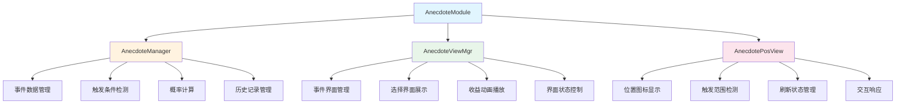
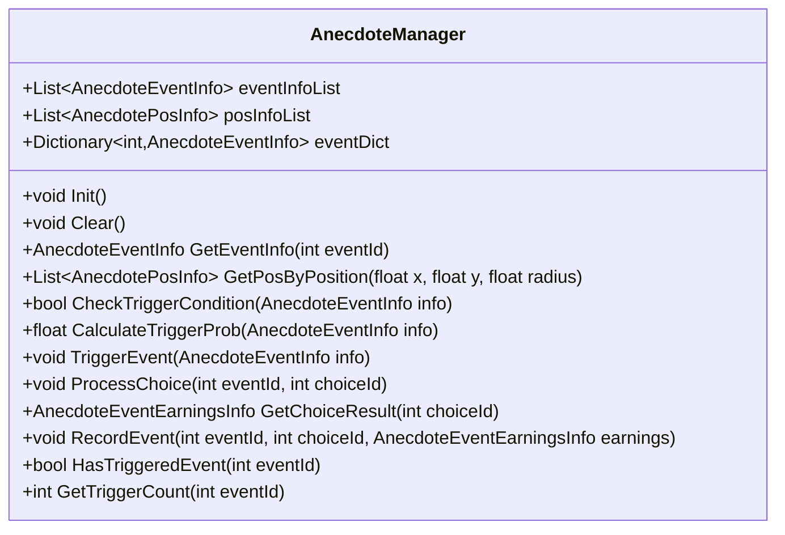
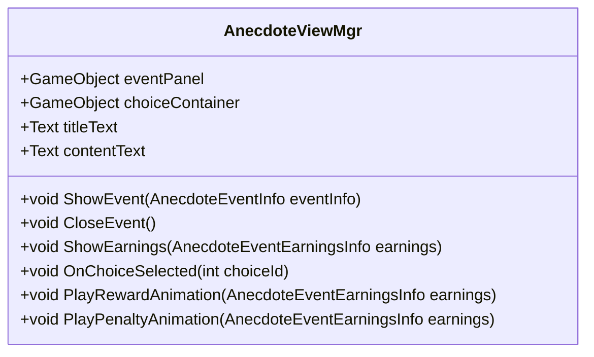
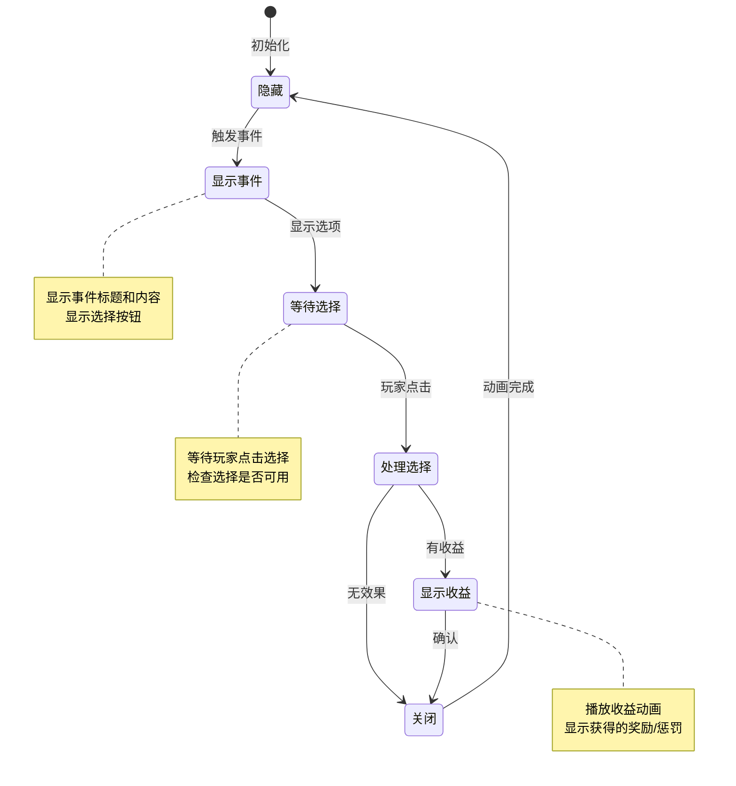

# 轶事/奇遇模块 - 客户端开发文档

## 模块概述

轶事模块是客户端独立组件，负责管理和展示游戏内的随机事件系统。模块不依赖服务端协议，通过其他模块（Building、Travel等）推送数据进行工作。

---

## 客户端组件结构



---

## 组件文件结构

```
game_client/Assets/Scripts/LogicScripts/
├── GameComponent/Anecdote/
│   ├── AnecdotePosInfo.cs                    # 位置信息数据结构
│   └── EventInfo/
│       ├── AnecdoteEventInfo.cs              # 事件信息数据结构
│       ├── AnecdoteEventChoiceInfo.cs        # 选择信息数据结构
│       ├── AnecdoteEventEarningsInfo.cs      # 收益信息数据结构
│       └── AnecdoteEventRewardInfo.cs        # 奖励信息数据结构
│
├── GameScene/UIScene/GUIScene/NewScene/AddScene/InGame/MainGUIAddScene/Building/
│   └── AnecdoteViewMgr/
│       ├── AnecdotePosView.cs                # 位置视图组件
│       ├── AnecdoteViewMgr.cs                # 主视图管理器
│       └── EventView/
│           ├── AnecdoteEventChoiceView.cs    # 选择视图组件
│           ├── AnecdoteEventEarningsView.cs  # 收益视图组件
│           └── AnecdoteEventRewardView.cs    # 奖励视图组件
│
└── ClientProtocol/Common/AnecdoteObj/
    ├── Anecdote_EventInfo.cs                 # 协议事件信息
    └── Anecdote_EventExtraData_Earnings.cs   # 协议收益数据
```

---

## 核心类说明

### 1. AnecdoteManager - 轶事管理器

**职责**: 管理轶事事件数据、处理触发逻辑、维护历史记录

**主要功能**:
- 事件数据缓存与管理
- 触发条件检测
- 触发概率计算
- 事件历史记录
- 位置状态管理



#### 核心代码

```csharp
/// <summary>
/// 轶事管理器
/// </summary>
public class AnecdoteManager : MonoBehaviour
{
    private static AnecdoteManager _instance;
    public static AnecdoteManager Instance
    {
        get
        {
            if (_instance == null)
            {
                GameObject go = new GameObject("AnecdoteManager");
                _instance = go.AddComponent<AnecdoteManager>();
                DontDestroyOnLoad(go);
            }
            return _instance;
        }
    }

    // 事件数据缓存
    private List<AnecdoteEventInfo> _m_eventInfoList = new List<AnecdoteEventInfo>();
    private Dictionary<int, AnecdoteEventInfo> _m_eventDict = new Dictionary<int, AnecdoteEventInfo>();
    private List<AnecdotePosInfo> _m_posInfoList = new List<AnecdotePosInfo>();

    // 历史记录
    private List<AnecdoteRecordInfo> _m_recordList = new List<AnecdoteRecordInfo>();

    /// <summary>
    /// 初始化管理器
    /// </summary>
    public void Init()
    {
        LoadEventConfig();
        LoadPosConfig();
        LoadHistoryRecord();
    }

    /// <summary>
    /// 加载事件配置
    /// </summary>
    private void LoadEventConfig()
    {
        // 从配置表加载事件数据
        var eventData = GRefdataCoreMgr.instance.anecdoteEventRefCore.refList;
        foreach (var data in eventData)
        {
            var eventInfo = ParseEventInfo(data);
            _m_eventInfoList.Add(eventInfo);
            _m_eventDict[eventInfo.eventId] = eventInfo;
        }
    }

    /// <summary>
    /// 获取事件信息
    /// </summary>
    public AnecdoteEventInfo GetEventInfo(int eventId)
    {
        if (_m_eventDict.TryGetValue(eventId, out var eventInfo))
        {
            return eventInfo;
        }
        return null;
    }

    /// <summary>
    /// 获取指定位置附近的事件
    /// </summary>
    public List<AnecdotePosInfo> GetPosByPosition(float x, float y, float radius)
    {
        List<AnecdotePosInfo> result = new List<AnecdotePosInfo>();
        float radiusSq = radius * radius;

        foreach (var posInfo in _m_posInfoList)
        {
            float dx = posInfo.posX - x;
            float dy = posInfo.posY - y;
            float distSq = dx * dx + dy * dy;

            if (distSq <= radiusSq)
            {
                result.Add(posInfo);
            }
        }

        return result;
    }

    /// <summary>
    /// 检查触发条件
    /// </summary>
    public bool CheckTriggerCondition(AnecdoteEventInfo eventInfo)
    {
        if (eventInfo == null) return false;

        // 检查等级条件
        var playerLevel = NPPlayer.instance.level;
        if (playerLevel < eventInfo.minLevel || playerLevel > eventInfo.maxLevel)
        {
            return false;
        }

        // 检查前置事件
        if (eventInfo.preEventId > 0 && !HasTriggeredEvent((int)eventInfo.preEventId))
        {
            return false;
        }

        // 检查触发次数
        if (eventInfo.maxTriggerCount > 0)
        {
            int triggerCount = GetTriggerCount(eventInfo.eventId);
            if (triggerCount >= eventInfo.maxTriggerCount)
            {
                return false;
            }
        }

        return true;
    }

    /// <summary>
    /// 计算触发概率
    /// </summary>
    public float CalculateTriggerProb(AnecdoteEventInfo eventInfo)
    {
        if (eventInfo == null) return 0f;

        float baseProb = eventInfo.triggerProb;

        // 玩家运气加成
        float luckBonus = NPPlayer.instance.GetLuckBonus();

        // 时间加成
        float timeBonus = GetTimeBonus(eventInfo);

        // 其他修正
        float otherBonus = GetOtherBonus(eventInfo);

        return baseProb * luckBonus * timeBonus * otherBonus;
    }

    /// <summary>
    /// 触发事件
    /// </summary>
    public void TriggerEvent(AnecdoteEventInfo eventInfo)
    {
        if (eventInfo == null) return;

        // 显示事件界面
        AnecdoteViewMgr.Instance.ShowEvent(eventInfo);

        // 记录触发
        _m_currentEvent = eventInfo;
    }

    /// <summary>
    /// 处理玩家选择
    /// </summary>
    public void ProcessChoice(int eventId, int choiceId)
    {
        var eventInfo = GetEventInfo(eventId);
        if (eventInfo == null) return;

        var choice = eventInfo.choiceList.Find(c => c.choiceId == choiceId);
        if (choice == null) return;

        // 检查消耗
        if (!CheckCost(choice.costList))
        {
            UIManager.ShowToast("资源不足");
            return;
        }

        // 扣除消耗
        DeductCost(choice.costList);

        // 计算结果
        var earnings = CalculateChoiceResult(choice);

        // 发放奖励/执行惩罚
        ProcessEarnings(earnings);

        // 记录历史
        RecordEvent(eventId, choiceId, earnings);

        // 显示结果
        AnecdoteViewMgr.Instance.ShowEarnings(earnings);
    }

    /// <summary>
    /// 计算选择结果
    /// </summary>
    private AnecdoteEventEarningsInfo CalculateChoiceResult(AnecdoteEventChoiceInfo choice)
    {
        switch (choice.resultType)
        {
            case (int)EAnecdoteResultType.FIXED:
                return choice.rewardInfo;

            case (int)EAnecdoteResultType.RANDOM:
                return CalculateRandomResult(choice.randomResults);

            case (int)EAnecdoteResultType.PROBABILITY:
                return CalculateProbResult(choice.probResults);

            default:
                return new AnecdoteEventEarningsInfo { earningsType = (int)EAnecdoteEarningsType.NONE };
        }
    }

    /// <summary>
    /// 权重随机计算
    /// </summary>
    private AnecdoteEventEarningsInfo CalculateRandomResult(List<RandomResultInfo> randomResults)
    {
        int totalWeight = 0;
        foreach (var result in randomResults)
        {
            totalWeight += result.weight;
        }

        int randomValue = Random.Range(0, totalWeight);
        int currentWeight = 0;

        foreach (var result in randomResults)
        {
            currentWeight += result.weight;
            if (randomValue < currentWeight)
            {
                return result.earnings;
            }
        }

        return new AnecdoteEventEarningsInfo { earningsType = (int)EAnecdoteEarningsType.NONE };
    }
}
```

---

### 2. AnecdoteViewMgr - 视图管理器

**职责**: 管理轶事界面显示、处理UI交互

**主要功能**:
- 事件界面显示
- 选择项渲染
- 收益动画播放
- 界面状态管理



#### 核心代码

```csharp
/// <summary>
/// 轶事视图管理器
/// </summary>
public class AnecdoteViewMgr : MonoBehaviour
{
    private static AnecdoteViewMgr _instance;
    public static AnecdoteViewMgr Instance
    {
        get { return _instance; }
    }

    [Header("UI组件")]
    public GameObject eventPanel;
    public GameObject choiceContainer;
    public Text titleText;
    public Text contentText;
    public GameObject choicePrefab;
    public GameObject rewardPanel;
    public GameObject penaltyPanel;

    // 当前事件
    private AnecdoteEventInfo _currentEvent;
    private int _selectedChoiceId;

    private void Awake()
    {
        _instance = this;
        eventPanel.SetActive(false);
    }

    /// <summary>
    /// 显示事件
    /// </summary>
    public void ShowEvent(AnecdoteEventInfo eventInfo)
    {
        if (eventInfo == null) return;

        _currentEvent = eventInfo;

        // 设置标题和内容
        titleText.text = LocalizationManager.instance.GetText(eventInfo.title);
        contentText.text = LocalizationManager.instance.GetText(eventInfo.content);

        // 清空旧选项
        foreach (Transform child in choiceContainer.transform)
        {
            Destroy(child.gameObject);
        }

        // 创建选择按钮
        foreach (var choice in eventInfo.choiceList)
        {
            GameObject choiceObj = Instantiate(choicePrefab, choiceContainer.transform);
            AnecdoteEventChoiceView choiceView = choiceObj.GetComponent<AnecdoteEventChoiceView>();
            choiceView.SetChoice(choice, OnChoiceSelected);
        }

        // 显示面板
        eventPanel.SetActive(true);

        // 播放打开动画
        PlayOpenAnimation();
    }

    /// <summary>
    /// 关闭事件界面
    /// </summary>
    public void CloseEvent()
    {
        PlayCloseAnimation(() =>
        {
            eventPanel.SetActive(false);
            _currentEvent = null;
        });
    }

    /// <summary>
    /// 选择项点击回调
    /// </summary>
    private void OnChoiceSelected(int choiceId)
    {
        _selectedChoiceId = choiceId;

        // 处理选择
        AnecdoteManager.Instance.ProcessChoice(_currentEvent.eventId, choiceId);
    }

    /// <summary>
    /// 显示收益
    /// </summary>
    public void ShowEarnings(AnecdoteEventEarningsInfo earnings)
    {
        if (earnings == null)
        {
            CloseEvent();
            return;
        }

        switch (earnings.earningsType)
        {
            case (int)EAnecdoteEarningsType.REWARD:
                PlayRewardAnimation(earnings);
                break;

            case (int)EAnecdoteEarningsType.PENALTY:
                PlayPenaltyAnimation(earnings);
                break;

            case (int)EAnecdoteEarningsType.BUFF:
                PlayBuffAnimation(earnings);
                break;

            case (int)EAnecdoteEarningsType.DEBUFF:
                PlayDebuffAnimation(earnings);
                break;

            default:
                CloseEvent();
                break;
        }
    }

    /// <summary>
    /// 播放奖励动画
    /// </summary>
    private void PlayRewardAnimation(AnecdoteEventEarningsInfo earnings)
    {
        rewardPanel.SetActive(true);
        var rewardView = rewardPanel.GetComponent<AnecdoteEventRewardView>();
        rewardView.SetRewardList(earnings.rewardList, () =>
        {
            rewardPanel.SetActive(false);
            CloseEvent();
        });
    }

    /// <summary>
    /// 播放惩罚动画
    /// </summary>
    private void PlayPenaltyAnimation(AnecdoteEventEarningsInfo earnings)
    {
        penaltyPanel.SetActive(true);
        var penaltyView = penaltyPanel.GetComponent<AnecdoteEventPenaltyView>();
        penaltyView.SetPenalty(earnings.penaltyList, () =>
        {
            penaltyPanel.SetActive(false);
            CloseEvent();
        });
    }
}
```

---

### 3. AnecdotePosView - 位置视图

**职责**: 显示轶事触发位置的图标

**主要功能**:
- 位置图标显示
- 触发范围检测
- 刷新状态管理
- 交互响应

#### 核心代码

```csharp
/// <summary>
/// 轶事位置视图
/// </summary>
public class AnecdotePosView : MonoBehaviour
{
    [Header("UI组件")]
    public Image iconImage;
    public GameObject redDot;
    public Animator animator;

    // 位置数据
    private AnecdotePosInfo _posInfo;
    private AnecdoteEventInfo _eventInfo;
    private EAnecdotePosStatus _status;

    /// <summary>
    /// 初始化位置视图
    /// </summary>
    public void Init(AnecdotePosInfo posInfo)
    {
        _posInfo = posInfo;

        // 获取关联事件
        _eventInfo = AnecdoteManager.Instance.GetEventInfo(posInfo.eventId);

        // 设置图标
        if (_eventInfo != null && !string.IsNullOrEmpty(_eventInfo.iconRes))
        {
            iconImage.sprite = ResourceManager.LoadSprite(_eventInfo.iconRes);
        }

        // 初始化状态
        UpdateStatus(EAnecdotePosStatus.READY);
    }

    /// <summary>
    /// 更新状态
    /// </summary>
    public void UpdateStatus(EAnecdotePosStatus status)
    {
        _status = status;

        switch (status)
        {
            case EAnecdotePosStatus.EMPTY:
                gameObject.SetActive(false);
                break;

            case EAnecdotePosStatus.READY:
                gameObject.SetActive(true);
                redDot.SetActive(true);
                animator.Play("Idle");
                break;

            case EAnecdotePosStatus.TRIGGERED:
            case EAnecdotePosStatus.EXPIRED:
                gameObject.SetActive(false);
                break;
        }
    }

    /// <summary>
    /// 点击处理
    /// </summary>
    private void OnClick()
    {
        if (_status != EAnecdotePosStatus.READY) return;
        if (_eventInfo == null) return;

        // 检查触发条件
        if (!AnecdoteManager.Instance.CheckTriggerCondition(_eventInfo))
        {
            UIManager.ShowToast("不满足触发条件");
            return;
        }

        // 计算触发概率
        float prob = AnecdoteManager.Instance.CalculateTriggerProb(_eventInfo);
        if (Random.value > prob)
        {
            UIManager.ShowToast("触发失败");
            return;
        }

        // 触发事件
        AnecdoteManager.Instance.TriggerEvent(_eventInfo);

        // 更新位置状态
        UpdateStatus(EAnecdotePosStatus.TRIGGERED);
    }

    /// <summary>
    /// 玩家进入触发范围
    /// </summary>
    public void OnPlayerEnterRange()
    {
        if (_status == EAnecdotePosStatus.READY)
        {
            animator.Play("Highlight");
        }
    }

    /// <summary>
    /// 玩家离开触发范围
    /// </summary>
    public void OnPlayerExitRange()
    {
        if (_status == EAnecdotePosStatus.READY)
        {
            animator.Play("Idle");
        }
    }
}
```

---

### 4. AnecdoteEventChoiceView - 选择视图

**职责**: 显示事件选择项

**主要功能**:
- 选择项渲染
- 消耗显示
- 锁定状态
- 点击响应

#### 核心代码

```csharp
/// <summary>
/// 事件选择视图
/// </summary>
public class AnecdoteEventChoiceView : MonoBehaviour
{
    [Header("UI组件")]
    public Text choiceText;
    public Text costText;
    public Text descText;
    public Image iconImage;
    public Button choiceButton;
    public GameObject lockMask;
    public Text lockReasonText;

    private AnecdoteEventChoiceInfo _choiceInfo;
    private Action<int> _onSelected;

    /// <summary>
    /// 设置选择项数据
    /// </summary>
    public void SetChoice(AnecdoteEventChoiceInfo choice, Action<int> onSelected)
    {
        _choiceInfo = choice;
        _onSelected = onSelected;

        // 设置文本
        choiceText.text = LocalizationManager.instance.GetText(choice.choiceText);
        descText.text = LocalizationManager.instance.GetText(choice.desc);

        // 设置消耗文本
        if (choice.costList != null && choice.costList.Count > 0)
        {
            costText.gameObject.SetActive(true);
            costText.text = GetCostText(choice.costList);
        }
        else
        {
            costText.gameObject.SetActive(false);
        }

        // 设置图标
        if (!string.IsNullOrEmpty(choice.icon))
        {
            iconImage.sprite = ResourceManager.LoadSprite(choice.icon);
        }

        // 检查锁定状态
        CheckLockStatus();
    }

    /// <summary>
    /// 检查锁定状态
    /// </summary>
    private void CheckLockStatus()
    {
        bool isLocked = false;
        string lockReason = "";

        // 检查资源是否足够
        if (_choiceInfo.costList != null)
        {
            foreach (var cost in _choiceInfo.costList)
            {
                if (!CheckResourceEnough(cost))
                {
                    isLocked = true;
                    lockReason = "资源不足";
                    break;
                }
            }
        }

        // 检查自定义锁定条件
        if (_choiceInfo.isLocked)
        {
            isLocked = true;
            lockReason = _choiceInfo.lockReason;
        }

        // 更新UI
        if (isLocked)
        {
            lockMask.SetActive(true);
            lockReasonText.text = lockReason;
            choiceButton.interactable = false;
        }
        else
        {
            lockMask.SetActive(false);
            choiceButton.interactable = true;
        }
    }

    /// <summary>
    /// 检查资源是否足够
    /// </summary>
    private bool CheckResourceEnough(CostInfo cost)
    {
        switch ((EAnecdoteCostType)cost.costType)
        {
            case EAnecdoteCostType.SILVER:
                return NPPlayer.instance.silver >= cost.costValue;

            case EAnecdoteCostType.DIAMOND:
                return NPPlayer.instance.diamond >= cost.costValue;

            case EAnecdoteCostType.STAMINA:
                return NPPlayer.instance.stamina >= cost.costValue;

            default:
                return true;
        }
    }

    /// <summary>
    /// 点击选择
    /// </summary>
    public void OnClick()
    {
        if (_onSelected != null && _choiceInfo != null)
        {
            _onSelected(_choiceInfo.choiceId);
        }
    }
}
```

---

### 5. AnecdoteEventEarningsView - 收益视图

**职责**: 显示收益结果

**主要功能**:
- 奖励列表显示
- 惩罚效果显示
- 动画播放
- 确认关闭

#### 核心代码

```csharp
/// <summary>
/// 事件收益视图
/// </summary>
public class AnecdoteEventEarningsView : MonoBehaviour
{
    [Header("UI组件")]
    public GameObject rewardContainer;
    public GameObject penaltyContainer;
    public Text earningsDescText;
    public GameObject rewardItemPrefab;
    public Button confirmButton;
    public Animator animator;

    private Action _onClose;

    /// <summary>
    /// 显示奖励
    /// </summary>
    public void ShowReward(AnecdoteEventEarningsInfo earnings, Action onClose)
    {
        _onClose = onClose;

        rewardContainer.SetActive(true);
        penaltyContainer.SetActive(false);

        earningsDescText.text = LocalizationManager.instance.GetText(earnings.earningsDesc);

        // 清空旧内容
        foreach (Transform child in rewardContainer.transform)
        {
            Destroy(child.gameObject);
        }

        // 创建奖励项
        if (earnings.rewardList != null)
        {
            foreach (var reward in earnings.rewardList)
            {
                CreateRewardItem(reward);
            }
        }

        // 播放动画
        animator.Play("Show");
    }

    /// <summary>
    /// 显示惩罚
    /// </summary>
    public void ShowPenalty(AnecdoteEventEarningsInfo earnings, Action onClose)
    {
        _onClose = onClose;

        rewardContainer.SetActive(false);
        penaltyContainer.SetActive(true);

        earningsDescText.text = LocalizationManager.instance.GetText(earnings.earningsDesc);

        // 清空旧内容
        foreach (Transform child in penaltyContainer.transform)
        {
            Destroy(child.gameObject);
        }

        // 创建惩罚项
        if (earnings.penaltyList != null)
        {
            foreach (var penalty in earnings.penaltyList)
            {
                CreatePenaltyItem(penalty);
            }
        }

        // 播放动画
        animator.Play("ShowPenalty");
    }

    /// <summary>
    /// 创建奖励项
    /// </summary>
    private void CreateRewardItem(AnecdoteEventRewardInfo reward)
    {
        GameObject itemObj = Instantiate(rewardItemPrefab, rewardContainer.transform);
        var itemView = itemObj.GetComponent<AnecdoteEventRewardItem>();

        itemView.SetReward(reward);
    }

    /// <summary>
    /// 创建惩罚项
    /// </summary>
    private void CreatePenaltyItem(AnecdoteEventPenaltyInfo penalty)
    {
        GameObject itemObj = Instantiate(rewardItemPrefab, penaltyContainer.transform);
        var itemView = itemObj.GetComponent<AnecdoteEventPenaltyItem>();

        itemView.SetPenalty(penalty);
    }

    /// <summary>
    /// 点击确认
    /// </summary>
    public void OnConfirmClick()
    {
        animator.Play("Hide", () =>
        {
            if (_onClose != null)
            {
                _onClose();
            }
        });
    }
}
```

---

## 使用示例

### 1. 触发轶事事件

```csharp
// 创建事件信息
var eventInfo = new AnecdoteEventInfo();
eventInfo.eventId = 1001;
eventInfo.eventType = (int)EAnecdoteEventType.MERCHANT;
eventInfo.title = "神秘商人";
eventInfo.content = "你遇到了一个神秘商人...";

// 添加选择项
eventInfo.choiceList = new List<AnecdoteEventChoiceInfo>
{
    new AnecdoteEventChoiceInfo
    {
        choiceId = 10011,
        choiceText = "购买神秘宝箱",
        resultType = (int)EAnecdoteResultType.RANDOM,
        costList = new List<CostInfo>
        {
            new CostInfo { costType = (int)EAnecdoteCostType.DIAMOND, costValue = 50 }
        }
    },
    new AnecdoteEventChoiceInfo
    {
        choiceId = 10012,
        choiceText = "离开",
        resultType = (int)EAnecdoteResultType.FIXED
    }
};

// 显示轶事界面
AnecdoteViewMgr.Instance.ShowEvent(eventInfo);
```

### 2. 处理玩家选择

```csharp
/// <summary>
/// 玩家选择回调
/// </summary>
public void OnChoiceSelected(int choiceId)
{
    // 获取当前事件
    var eventInfo = _currentEvent;
    if (eventInfo == null) return;

    // 获取选择配置
    var choice = eventInfo.choiceList.Find(c => c.choiceId == choiceId);
    if (choice == null) return;

    // 检查资源消耗
    if (choice.costList != null && choice.costList.Count > 0)
    {
        foreach (var cost in choice.costList)
        {
            if (!CheckResourceEnough(cost))
            {
                UIManager.ShowToast("资源不足");
                return;
            }
        }
    }

    // 扣除资源
    if (choice.costList != null)
    {
        foreach (var cost in choice.costList)
        {
            DeductResource(cost);
        }
    }

    // 计算结果
    var earnings = CalculateChoiceResult(choice);

    // 发放结果
    if (earnings.earningsType == (int)EAnecdoteEarningsType.REWARD)
    {
        BagManager.Instance.AddItems(earnings.rewardList);
    }
    else if (earnings.earningsType == (int)EAnecdoteEarningsType.PENALTY)
    {
        ApplyPenalty(earnings);
    }

    // 记录历史
    AnecdoteManager.Instance.RecordEvent(eventInfo.eventId, choiceId, earnings);

    // 显示收益
    AnecdoteViewMgr.Instance.ShowEarnings(earnings);
}
```

### 3. 从其他模块接收事件

```csharp
/// <summary>
/// 建筑模块推送轶事事件
/// </summary>
public void OnBuildingAnecdoteEvent(BuildingEventData buildingEvent)
{
    // 转换为轶事事件格式
    var anecdoteEvent = ConvertFromBuildingEvent(buildingEvent);
    if (anecdoteEvent == null) return;

    // 显示轶事图标
    var posView = CreatePosView(anecdoteEvent.posInfo);
    posView.Init(anecdoteEvent.posInfo);
}

/// <summary>
/// 游历模块推送奇遇事件
/// </summary>
public void OnTravelEncounterEvent(TravelEventData travelEvent)
{
    // 转换为轶事事件格式
    var anecdoteEvent = ConvertFromTravelEvent(travelEvent);
    if (anecdoteEvent == null) return;

    // 直接显示轶事界面（游历中不显示位置图标）
    AnecdoteViewMgr.Instance.ShowEvent(anecdoteEvent);
}
```

---

## 界面状态管理



---

## 性能优化

### 1. 对象池管理

```csharp
/// <summary>
/// 选择项对象池
/// </summary>
private GameObjectPool _choiceItemPool;

/// <summary>
/// 奖励项对象池
/// </summary>
private GameObjectPool _rewardItemPool;

/// <summary>
/// 初始化对象池
/// </summary>
public void InitObjectPools()
{
    _choiceItemPool = new GameObjectPool(choicePrefab, 10);
    _rewardItemPool = new GameObjectPool(rewardItemPrefab, 20);
}

/// <summary>
/// 获取选择项
/// </summary>
public GameObject GetChoiceItem()
{
    return _choiceItemPool.Get();
}

/// <summary>
/// 回收选择项
/// </summary>
public void ReturnChoiceItem(GameObject item)
{
    _choiceItemPool.Return(item);
}
```

### 2. 事件缓存

```csharp
/// <summary>
/// 事件数据缓存
/// </summary>
private Dictionary<int, AnecdoteEventInfo> _eventCache = new Dictionary<int, AnecdoteEventInfo>();

/// <summary>
/// 获取事件（带缓存）
/// </summary>
public AnecdoteEventInfo GetEventInfoCached(int eventId)
{
    if (_eventCache.TryGetValue(eventId, out var eventInfo))
    {
        return eventInfo;
    }

    eventInfo = LoadEventInfo(eventId);
    if (eventInfo != null)
    {
        _eventCache[eventId] = eventInfo;
    }

    return eventInfo;
}
```

---

*文档生成时间: 2026-04-12*
*文档版本: v2.0.0*
