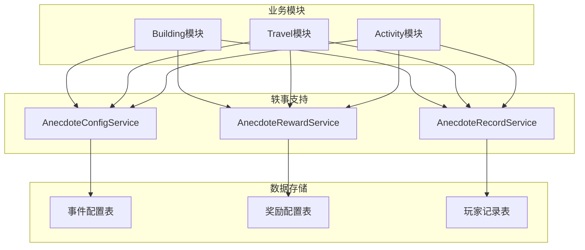
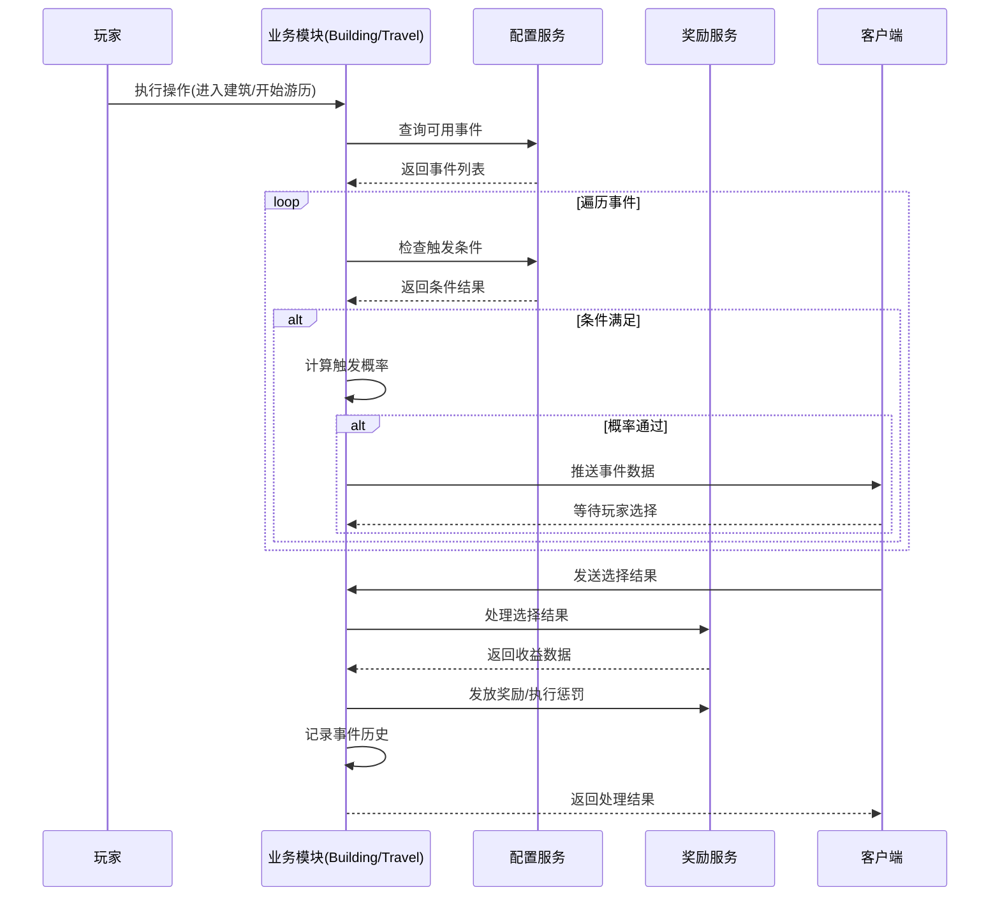
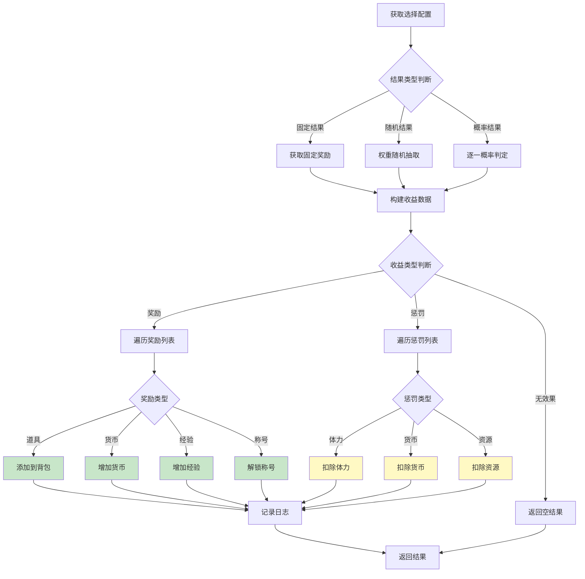
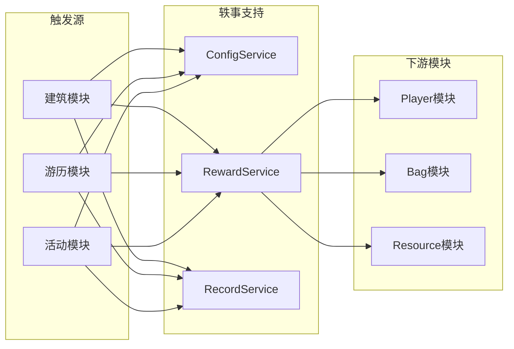

# 轶事/奇遇模块 - 服务端开发文档

## 模块说明

本模块为客户端独立组件，服务端主要提供事件配置数据和奖励发放支持，不涉及独立的协议通信。

轶事事件的数据配置和奖励处理由其他业务模块（Building、Travel、Activity等）负责。

---

## 一、服务端支持架构



---

## 二、数据配置服务

### 2.1 AnecdoteConfigService - 配置服务

**职责**: 提供轶事事件配置数据查询

```java
@Service
public class AnecdoteConfigService {

    @Autowired
    private AnecdoteEventConfigDao eventConfigDao;

    @Autowired
    private AnecdoteChoiceConfigDao choiceConfigDao;

    @Autowired
    private AnecdoteRewardConfigDao rewardConfigDao;

    /**
     * 获取事件配置
     */
    public AnecdoteEventConfig getEventConfig(int eventId) {
        return eventConfigDao.getById(eventId);
    }

    /**
     * 获取事件选择项列表
     */
    public List<AnecdoteChoiceConfig> getChoiceList(int eventId) {
        return choiceConfigDao.getByEventId(eventId);
    }

    /**
     * 获取选择配置
     */
    public AnecdoteChoiceConfig getChoiceConfig(int choiceId) {
        return choiceConfigDao.getById(choiceId);
    }

    /**
     * 获取奖励列表
     */
    public List<AnecdoteRewardConfig> getRewardList(int choiceId) {
        return rewardConfigDao.getByChoiceId(choiceId);
    }

    /**
     * 检查触发条件
     */
    public boolean checkTriggerCondition(long playerId, AnecdoteEventConfig config) {
        PlayerData playerData = playerService.getPlayerData(playerId);

        // 检查等级条件
        if (playerData.getLevel() < config.getMinLevel() ||
            playerData.getLevel() > config.getMaxLevel()) {
            return false;
        }

        // 检查前置事件
        if (config.getPreEventId() > 0) {
            if (!recordService.hasTriggeredEvent(playerId, config.getPreEventId())) {
                return false;
            }
        }

        // 检查触发次数
        if (config.getMaxTriggerCount() > 0) {
            int triggerCount = recordService.getTriggerCount(playerId, config.getEventId());
            if (triggerCount >= config.getMaxTriggerCount()) {
                return false;
            }
        }

        return true;
    }

    /**
     * 获取随机事件
     */
    public AnecdoteEventConfig getRandomEvent(int eventType, long playerId) {
        List<AnecdoteEventConfig> eventList = eventConfigDao.getByType(eventType);

        // 过滤满足条件的事件
        List<AnecdoteEventConfig> validEvents = new ArrayList<>();
        for (AnecdoteEventConfig event : eventList) {
            if (checkTriggerCondition(playerId, event)) {
                validEvents.add(event);
            }
        }

        if (validEvents.isEmpty()) {
            return null;
        }

        // 随机选择一个事件
        int randomIndex = ThreadLocalRandom.current().nextInt(validEvents.size());
        return validEvents.get(randomIndex);
    }
}
```

### 2.2 AnecdoteRewardService - 奖励服务

**职责**: 处理轶事奖励发放和惩罚执行

```java
@Service
public class AnecdoteRewardService {

    @Autowired
    private BagService bagService;

    @Autowired
    private ResourceService resourceService;

    @Autowired
    private PlayerService playerService;

    @Autowired
    private BuffService buffService;

    /**
     * 处理选择结果
     */
    public AnecdoteEventEarningsInfo processChoiceResult(long playerId, AnecdoteChoiceConfig choice) {
        AnecdoteEventEarningsInfo earnings = new AnecdoteEventEarningsInfo();

        switch (choice.getResultType()) {
            case 1: // 固定结果
                earnings = processFixedResult(choice);
                break;

            case 2: // 随机结果
                earnings = processRandomResult(choice);
                break;

            case 3: // 概率结果
                earnings = processProbResult(choice);
                break;

            default:
                earnings.setEarningsType(0);
                break;
        }

        return earnings;
    }

    /**
     * 处理固定结果
     */
    private AnecdoteEventEarningsInfo processFixedResult(AnecdoteChoiceConfig choice) {
        AnecdoteEventEarningsInfo earnings = new AnecdoteEventEarningsInfo();

        // 获取固定奖励配置
        AnecdoteRewardConfig rewardConfig = rewardConfigDao.getFixedReward(choice.getChoiceId());
        if (rewardConfig != null) {
            earnings.setEarningsType(1);
            earnings.setEarningsValue(rewardConfig.getRewardValue());
            earnings.setEarningsDesc(rewardConfig.getDesc());
            earnings.setRewardList(Collections.singletonList(convertReward(rewardConfig)));
        }

        return earnings;
    }

    /**
     * 处理随机结果（权重）
     */
    private AnecdoteEventEarningsInfo processRandomResult(AnecdoteChoiceConfig choice) {
        List<AnecdoteRewardConfig> rewardList = rewardConfigDao.getByChoiceId(choice.getChoiceId());

        // 计算总权重
        int totalWeight = 0;
        for (AnecdoteRewardConfig reward : rewardList) {
            totalWeight += reward.getWeight();
        }

        // 随机选择
        int randomValue = ThreadLocalRandom.current().nextInt(totalWeight);
        int currentWeight = 0;

        for (AnecdoteRewardConfig reward : rewardList) {
            currentWeight += reward.getWeight();
            if (randomValue < currentWeight) {
                AnecdoteEventEarningsInfo earnings = new AnecdoteEventEarningsInfo();
                earnings.setEarningsType(reward.getRewardType() == 10 ? 4 : 1); // 10为惩罚类型
                earnings.setEarningsValue(reward.getRewardValue());
                earnings.setEarningsDesc(reward.getDesc());
                earnings.setRewardList(Collections.singletonList(convertReward(reward)));
                return earnings;
            }
        }

        return new AnecdoteEventEarningsInfo();
    }

    /**
     * 处理概率结果
     */
    private AnecdoteEventEarningsInfo processProbResult(AnecdoteChoiceConfig choice) {
        List<AnecdoteRewardConfig> rewardList = rewardConfigDao.getByChoiceId(choice.getChoiceId());

        for (AnecdoteRewardConfig reward : rewardList) {
            // 按概率逐一判定
            int randomValue = ThreadLocalRandom.current().nextInt(10000);
            if (randomValue < reward.getProbability()) {
                AnecdoteEventEarningsInfo earnings = new AnecdoteEventEarningsInfo();
                earnings.setEarningsType(reward.getRewardType() == 10 ? 4 : 1);
                earnings.setEarningsValue(reward.getRewardValue());
                earnings.setEarningsDesc(reward.getDesc());
                earnings.setRewardList(Collections.singletonList(convertReward(reward)));
                return earnings;
            }
        }

        return new AnecdoteEventEarningsInfo();
    }

    /**
     * 发放奖励
     */
    public void grantReward(long playerId, AnecdoteEventEarningsInfo earnings) {
        if (earnings == null || earnings.getRewardList() == null) {
            return;
        }

        for (AnecdoteRewardInfo reward : earnings.getRewardList()) {
            grantSingleReward(playerId, reward);
        }
    }

    /**
     * 发放单个奖励
     */
    private void grantSingleReward(long playerId, AnecdoteRewardInfo reward) {
        switch (reward.getRewardType()) {
            case 1: // 道具
                bagService.addItem(playerId, reward.getRewardValue(), reward.getCount(),
                    reward.getBindType(), "轶事奖励");
                break;

            case 2: // 银两
                resourceService.addSilver(playerId, reward.getRewardValue(), "轶事奖励");
                break;

            case 3: // 钻石
                resourceService.addDiamond(playerId, reward.getRewardValue(), "轶事奖励");
                break;

            case 4: // 经验
                playerService.addExp(playerId, reward.getRewardValue(), "轶事奖励");
                break;

            case 5: // 体力
                playerService.addStamina(playerId, reward.getRewardValue(), "轶事奖励");
                break;

            case 8: // 称号
                playerService.unlockTitle(playerId, reward.getRewardValue(), "轶事奖励");
                break;

            default:
                break;
        }
    }

    /**
     * 执行惩罚
     */
    public void executePenalty(long playerId, AnecdoteEventEarningsInfo earnings) {
        if (earnings == null || earnings.getPenaltyList() == null) {
            return;
        }

        for (AnecdotePenaltyInfo penalty : earnings.getPenaltyList()) {
            executeSinglePenalty(playerId, penalty);
        }
    }

    /**
     * 执行单个惩罚
     */
    private void executeSinglePenalty(long playerId, AnecdotePenaltyInfo penalty) {
        // 检查是否可抵抗
        if (penalty.isCanResist()) {
            int resistRate = penalty.getResistRate();
            int randomValue = ThreadLocalRandom.current().nextInt(10000);
            if (randomValue < resistRate) {
                // 抵抗成功
                return;
            }
        }

        // 执行惩罚
        switch (penalty.getPenaltyType()) {
            case 1: // 体力损失
                playerService.reduceStamina(playerId, penalty.getPenaltyValue(), "轶事惩罚");
                break;

            case 2: // 银两损失
                resourceService.reduceSilver(playerId, penalty.getPenaltyValue(), "轶事惩罚");
                break;

            case 3: // 粮食损失
                resourceService.reduceFood(playerId, penalty.getPenaltyValue(), "轶事惩罚");
                break;

            default:
                break;
        }
    }
}
```

---

## 三、数据访问层

### 3.1 AnecdoteEventConfigDao - 事件配置DAO

```java
@Repository
public class AnecdoteEventConfigDao {

    @Autowired
    private JdbcTemplate jdbcTemplate;

    private Map<Integer, AnecdoteEventConfig> configCache = new ConcurrentHashMap<>();

    /**
     * 初始化加载配置
     */
    @PostConstruct
    public void init() {
        loadAllConfigs();
    }

    /**
     * 加载所有配置
     */
    private void loadAllConfigs() {
        String sql = "SELECT * FROM anecdotes_event_config WHERE status = 1";
        List<AnecdoteEventConfig> configs = jdbcTemplate.query(sql, new EventConfigRowMapper());

        configCache.clear();
        for (AnecdoteEventConfig config : configs) {
            configCache.put(config.getEventId(), config);
        }
    }

    /**
     * 根据ID获取配置
     */
    public AnecdoteEventConfig getById(int eventId) {
        return configCache.get(eventId);
    }

    /**
     * 根据类型获取配置列表
     */
    public List<AnecdoteEventConfig> getByType(int eventType) {
        List<AnecdoteEventConfig> result = new ArrayList<>();
        for (AnecdoteEventConfig config : configCache.values()) {
            if (config.getEventType() == eventType) {
                result.add(config);
            }
        }
        return result;
    }

    /**
     * 获取所有配置
     */
    public List<AnecdoteEventConfig> getAll() {
        return new ArrayList<>(configCache.values());
    }
}
```

### 3.2 AnecdoteRecordDao - 记录DAO

```java
@Repository
public class AnecdoteRecordDao {

    @Autowired
    private JdbcTemplate jdbcTemplate;

    /**
     * 检查玩家是否触发过指定事件
     */
    public boolean hasTriggeredEvent(long playerId, int eventId) {
        String sql = "SELECT COUNT(*) FROM player_anecdote_record WHERE cid = ? AND eventId = ?";
        Integer count = jdbcTemplate.queryForObject(sql, Integer.class, playerId, eventId);
        return count != null && count > 0;
    }

    /**
     * 获取事件触发次数
     */
    public int getTriggerCount(long playerId, int eventId) {
        String sql = "SELECT COUNT(*) FROM player_anecdote_record WHERE cid = ? AND eventId = ?";
        Integer count = jdbcTemplate.queryForObject(sql, Integer.class, playerId, eventId);
        return count != null ? count : 0;
    }

    /**
     * 插入记录
     */
    public void insertRecord(PlayerAnecdoteRecord record) {
        String sql = "INSERT INTO player_anecdote_record " +
            "(cid, eventId, posId, choiceId, earningsType, earningsValue, earningsDesc, triggerTime, completeTime) " +
            "VALUES (?, ?, ?, ?, ?, ?, ?, ?, ?)";

        jdbcTemplate.update(sql,
            record.getCid(),
            record.getEventId(),
            record.getPosId(),
            record.getChoiceId(),
            record.getEarningsType(),
            record.getEarningsValue(),
            record.getEarningsDesc(),
            record.getTriggerTime(),
            record.getCompleteTime());
    }

    /**
     * 获取玩家历史记录
     */
    public List<PlayerAnecdoteRecord> getPlayerRecords(long playerId, int limit) {
        String sql = "SELECT * FROM player_anecdote_record WHERE cid = ? ORDER BY triggerTime DESC LIMIT ?";
        return jdbcTemplate.query(sql, new Object[]{playerId, limit}, new RecordRowMapper());
    }
}
```

---

## 四、业务模块集成

### 4.1 Building模块集成

```java
@Service
public class BuildingAnecdoteService {

    @Autowired
    private AnecdoteConfigService configService;

    @Autowired
    private AnecdoteRewardService rewardService;

    /**
     * 触发建筑轶事事件
     */
    public void triggerBuildingAnecdote(long playerId, long buildingId) {
        // 获取建筑可用的轶事事件ID列表
        List<Integer> eventIdList = buildingConfigDao.getAnecdoteEventIds(buildingId);

        for (Integer eventId : eventIdList) {
            AnecdoteEventConfig eventConfig = configService.getEventConfig(eventId);
            if (eventConfig == null) continue;

            // 检查触发条件
            if (!configService.checkTriggerCondition(playerId, eventConfig)) {
                continue;
            }

            // 计算触发概率
            float triggerProb = calculateTriggerProbability(playerId, eventConfig);
            if (ThreadLocalRandom.current().nextFloat() > triggerProb) {
                continue;
            }

            // 触发成功，推送事件数据给客户端
            pushEventToClient(playerId, eventConfig, buildingId);
            break;
        }
    }

    /**
     * 推送事件数据给客户端
     */
    private void pushEventToClient(long playerId, AnecdoteEventConfig config, long buildingId) {
        // 构建事件数据
        Anecdote_EventInfo eventInfo = buildEventInfo(config);

        // 推送给客户端
        GameServer.pushToClient(playerId, new BuildingAnecdotePush(eventInfo, buildingId));
    }
}
```

### 4.2 Travel模块集成

```java
@Service
public class TravelAnecdoteService {

    @Autowired
    private AnecdoteConfigService configService;

    @Autowired
    private AnecdoteRewardService rewardService;

    /**
     * 游历奇遇事件判定
     */
    public void checkTravelEncounter(long playerId, int travelId) {
        // 获取游历奇遇事件类型为3（战斗事件）或4（剧情事件）
        List<AnecdoteEventConfig> eventList = configService.getEventListByTypes(Arrays.asList(3, 4));

        for (AnecdoteEventConfig eventConfig : eventList) {
            // 检查触发条件
            if (!configService.checkTriggerCondition(playerId, eventConfig)) {
                continue;
            }

            // 计算触发概率
            float triggerProb = calculateTriggerProbability(playerId, eventConfig);
            if (ThreadLocalRandom.current().nextFloat() > triggerProb) {
                continue;
            }

            // 触发成功，暂停游历并推送事件
            pauseTravelAndPushEvent(playerId, eventConfig, travelId);
            break;
        }
    }

    /**
     * 暂停游历并推送奇遇事件
     */
    private void pauseTravelAndPushEvent(long playerId, AnecdoteEventConfig config, int travelId) {
        // 暂停游历
        travelService.pauseTravel(playerId, travelId);

        // 构建事件数据
        Anecdote_EventInfo eventInfo = buildEventInfo(config);

        // 推送给客户端
        GameServer.pushToClient(playerId, new TravelEncounterPush(eventInfo, travelId));
    }

    /**
     * 处理游历奇遇选择结果
     */
    public void processTravelEncounterChoice(long playerId, int travelId, int eventId, int choiceId) {
        // 获取选择配置
        AnecdoteChoiceConfig choiceConfig = configService.getChoiceConfig(choiceId);
        if (choiceConfig == null) {
            return;
        }

        // 处理选择结果
        AnecdoteEventEarningsInfo earnings = rewardService.processChoiceResult(playerId, choiceConfig);

        // 发放奖励
        if (earnings.getEarningsType() == 1) {
            rewardService.grantReward(playerId, earnings);
        } else if (earnings.getEarningsType() == 4) {
            rewardService.executePenalty(playerId, earnings);
        }

        // 记录事件
        recordService.insertRecord(buildRecord(playerId, eventId, choiceId, earnings));

        // 继续游历
        travelService.resumeTravel(playerId, travelId);
    }
}
```

---

## 五、数据流程图

### 5.1 事件触发流程



### 5.2 奖励处理流程



---

## 六、数据库表结构

### 6.1 anecdotes_event_config（事件配置表）

```sql
CREATE TABLE IF NOT EXISTS `anecdotes_event_config` (
    `id` bigint(20) NOT NULL AUTO_INCREMENT COMMENT '自增ID',
    `eventId` int(11) NOT NULL COMMENT '事件ID',
    `eventType` int(11) NOT NULL COMMENT '事件类型(1-5)',
    `title` varchar(50) NOT NULL COMMENT '事件标题',
    `content` varchar(500) NOT NULL COMMENT '事件内容',
    `triggerType` int(11) NOT NULL COMMENT '触发类型(1-4)',
    `triggerProb` float NOT NULL DEFAULT '0' COMMENT '触发概率(0-1)',
    `minLevel` int(11) NOT NULL DEFAULT '0' COMMENT '最低等级',
    `maxLevel` int(11) NOT NULL DEFAULT '999' COMMENT '最高等级',
    `preEventId` int(11) NOT NULL DEFAULT '0' COMMENT '前置事件ID',
    `durationHours` int(11) NOT NULL DEFAULT '24' COMMENT '持续小时数',
    `maxTriggerCount` int(11) NOT NULL DEFAULT '-1' COMMENT '最大触发次数(-1无限)',
    `priority` int(11) NOT NULL DEFAULT '0' COMMENT '优先级',
    `iconRes` varchar(255) DEFAULT '' COMMENT '图标资源',
    `bgRes` varchar(255) DEFAULT '' COMMENT '背景资源',
    `status` int(11) NOT NULL DEFAULT '1' COMMENT '状态(1有效)',
    `createTime` datetime DEFAULT CURRENT_TIMESTAMP COMMENT '创建时间',
    PRIMARY KEY (`id`),
    UNIQUE KEY `uk_eventId` (`eventId`),
    KEY `idx_eventType` (`eventType`),
    KEY `idx_status` (`status`)
) COMMENT='轶事事件配置表' engine=InnoDB DEFAULT CHARSET=utf8mb4;
```

### 6.2 anecdotes_choice_config（选择配置表）

```sql
CREATE TABLE IF NOT EXISTS `anecdotes_choice_config` (
    `id` bigint(20) NOT NULL AUTO_INCREMENT COMMENT '自增ID',
    `choiceId` int(11) NOT NULL COMMENT '选择ID',
    `eventId` int(11) NOT NULL COMMENT '事件ID',
    `choiceText` varchar(100) NOT NULL COMMENT '选择文本',
    `resultType` int(11) NOT NULL COMMENT '结果类型(1-3)',
    `costList` text COMMENT '消耗列表JSON',
    `desc` varchar(200) DEFAULT '' COMMENT '选择说明',
    `icon` varchar(255) DEFAULT '' COMMENT '选择图标',
    `status` int(11) NOT NULL DEFAULT '1' COMMENT '状态',
    PRIMARY KEY (`id`),
    UNIQUE KEY `uk_choiceId` (`choiceId`),
    KEY `idx_eventId` (`eventId`)
) COMMENT='轶事选择配置表' engine=InnoDB DEFAULT CHARSET=utf8mb4;
```

### 6.3 anecdotes_reward_config（奖励配置表）

```sql
CREATE TABLE IF NOT EXISTS `anecdotes_reward_config` (
    `id` bigint(20) NOT NULL AUTO_INCREMENT COMMENT '自增ID',
    `rewardId` int(11) NOT NULL COMMENT '奖励ID',
    `choiceId` int(11) NOT NULL COMMENT '选择ID',
    `rewardType` int(11) NOT NULL COMMENT '奖励类型(1-10)',
    `rewardValue` bigint(20) NOT NULL COMMENT '奖励数值/ID',
    `count` int(11) NOT NULL DEFAULT '1' COMMENT '数量',
    `probability` int(11) NOT NULL DEFAULT '10000' COMMENT '概率(万分比)',
    `weight` int(11) NOT NULL DEFAULT '0' COMMENT '权重',
    `bindType` int(11) NOT NULL DEFAULT '0' COMMENT '绑定类型',
    `quality` int(11) NOT NULL DEFAULT '1' COMMENT '品质(1-5)',
    `desc` varchar(100) DEFAULT '' COMMENT '描述',
    `status` int(11) NOT NULL DEFAULT '1' COMMENT '状态',
    PRIMARY KEY (`id`),
    UNIQUE KEY `uk_rewardId` (`rewardId`),
    KEY `idx_choiceId` (`choiceId`)
) COMMENT='轶事奖励配置表' engine=InnoDB DEFAULT CHARSET=utf8mb4;
```

---

## 七、配置热更新

```java
@Service
public class AnecdoteConfigRefreshService {

    @Autowired
    private AnecdoteEventConfigDao eventConfigDao;

    @Autowired
    private AnecdoteChoiceConfigDao choiceConfigDao;

    @Autowired
    private AnecdoteRewardConfigDao rewardConfigDao;

    /**
     * 热更新配置
     */
    @Transactional
    public void refreshConfig() {
        log.info("开始热更新轶事配置...");

        try {
            // 重新加载事件配置
            eventConfigDao.reload();

            // 重新加载选择配置
            choiceConfigDao.reload();

            // 重新加载奖励配置
            rewardConfigDao.reload();

            log.info("轶事配置热更新完成");
        } catch (Exception e) {
            log.error("轶事配置热更新失败", e);
            throw new RuntimeException("配置热更新失败", e);
        }
    }
}
```

---

## 八、跨模块依赖

### 8.1 依赖模块

| 模块名称 | 依赖方式 | 依赖说明 |
|----------|----------|----------|
| Player | 数据读取 | 获取玩家等级、属性等 |
| Bag | 功能调用 | 发放奖励物品 |
| Resource | 功能调用 | 扣除/发放货币 |
| Building | 数据关联 | 建筑相关轶事事件 |
| Travel | 数据关联 | 游历相关奇遇事件 |

### 8.2 被依赖情况

| 模块名称 | 依赖方式 | 依赖说明 |
|----------|----------|----------|
| Building | 功能关联 | 建筑界面显示轶事 |
| Travel | 功能关联 | 游历触发奇遇 |
| Activity | 功能关联 | 活动触发轶事 |

### 8.3 接口依赖图



---

*文档生成时间: 2026-04-12*
*文档版本: v2.0.0*