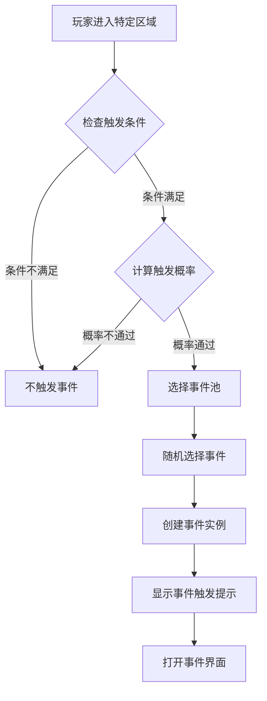
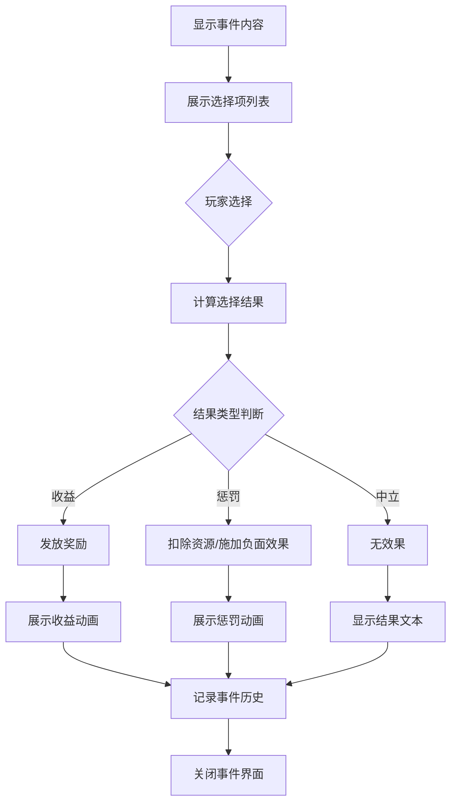
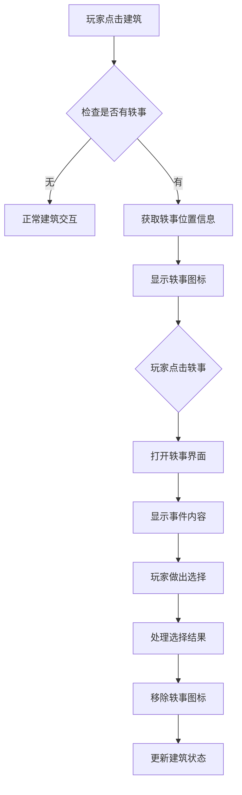
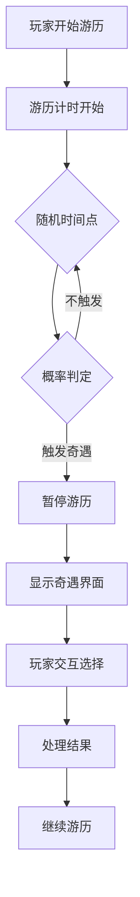

# 轶事/奇遇模块完整说明

## 一、模块概述

### 1.1 业务背景

轶事/奇遇模块是游戏中的随机事件系统，为玩家提供意外的惊喜和挑战。玩家在游戏过程中可能触发各种随机事件，通过选择获得不同的收益或惩罚，增加游戏的趣味性和不可预测性。

### 1.2 目标用户

- **探索型玩家**：喜欢发现隐藏内容的玩家
- **休闲玩家**：享受随机惊喜的玩家
- **所有游戏玩家**：在游戏各处都可能触发

### 1.3 核心价值

1. **增加趣味**：随机事件增加游戏趣味性
2. **探索奖励**：鼓励玩家探索游戏世界
3. **叙事丰富**：通过事件丰富游戏叙事
4. **决策体验**：提供选择带来不同结果

---

## 二、功能清单

### 2.1 事件触发功能

| 功能名称 | 功能描述 | 用户价值 |
|---------|---------|---------|
| 位置触发 | 在特定位置触发事件 | 探索发现惊喜 |
| 时间触发 | 在特定时间触发事件 | 定时惊喜 |
| 条件触发 | 满足条件时触发事件 | 成长奖励 |
| 随机触发 | 随机概率触发事件 | 意外惊喜 |

### 2.2 事件交互功能

| 功能名称 | 功能描述 | 用户价值 |
|---------|---------|---------|
| 事件展示 | 展示事件标题和内容 | 了解事件信息 |
| 选择交互 | 提供多个选项供玩家选择 | 决策体验 |
| 结果展示 | 展示选择的收益结果 | 获得反馈 |
| 历史记录 | 记录已触发的事件 | 回顾经历 |

### 2.3 收益类型功能

| 功能名称 | 功能描述 | 用户价值 |
|---------|---------|---------|
| 资源收益 | 获得货币、道具等资源 | 实质奖励 |
| 属性加成 | 获得临时或永久属性加成 | 实力提升 |
| 解锁内容 | 解锁新内容或功能 | 新体验 |
| 负面效果 | 可能获得惩罚效果 | 风险挑战 |

### 2.4 事件类型功能

| 功能名称 | 功能描述 | 用户价值 |
|---------|---------|---------|
| 商人事件 | 遇到神秘商人可购买物品 | 特殊购物 |
| 宝藏事件 | 发现宝藏获得奖励 | 惊喜收益 |
| 战斗事件 | 遭遇敌人进行战斗 | 战斗挑战 |
| 剧情事件 | 触发特殊剧情对话 | 故事体验 |
| 随机奖励 | 随机获得奖励 | 惊喜体验 |

---

## 三、业务流程详解

### 3.1 事件触发流程



**详细步骤说明**：

1. **条件检测**
   - 检查玩家所在位置
   - 检查触发时间条件
   - 检查前置条件（等级、任务等）

2. **概率计算**
   - 根据配置计算触发概率
   - 随机判断是否触发

3. **事件选择**
   - 从事件池中筛选符合条件的事件
   - 随机选择一个事件
   - 创建事件实例

### 3.2 事件交互流程



**详细步骤说明**：

1. **事件展示**
   - 显示事件标题
   - 显示事件描述文本
   - 展示可选的选项列表

2. **玩家选择**
   - 玩家点击选项
   - 根据选项计算结果

3. **结果处理**
   - 发放奖励或惩罚
   - 播放结果动画
   - 记录事件历史

### 3.3 建筑随机事件流程



### 3.4 游历奇遇流程



---

## 四、关键规则

### 4.1 事件触发规则

1. **位置规则**
   - 事件绑定到特定位置坐标
   - 玩家进入触发范围时检测
   - 触发后位置事件消失

2. **时间规则**
   - 部分事件有时间限制
   - 超时未处理自动选择默认选项
   - 限时事件过期消失

3. **条件规则**
   - 等级限制：达到指定等级才能触发
   - 前置事件：需完成前置事件
   - 物品条件：需持有特定物品

### 4.2 选择结果规则

1. **收益规则**
   - 固定收益：选择后获得固定奖励
   - 随机收益：在奖励池中随机抽取
   - 概率收益：有概率获得奖励

2. **惩罚规则**
   - 资源损失：扣除货币或道具
   - 负面状态：获得临时负面效果
   - 无惩罚：选择可能无任何效果

### 4.3 事件冷却规则

1. **单次触发**
   - 同一事件实例只能触发一次
   - 处理后从地图上移除

2. **周期刷新**
   - 事件位置定期刷新新事件
   - 刷新周期由配置决定

### 4.4 事件记录规则

1. **历史记录**
   - 记录已触发的事件ID
   - 记录选择和结果
   - 用于成就统计

2. **次数限制**
   - 部分事件有触发次数上限
   - 达到上限后不再触发

---

## 五、用户故事

### 5.1 探索玩家故事

> 作为一名喜欢探索的玩家，我在游戏地图上四处走动。突然在一片树林旁边发现了一个闪烁的图标，走近后触发了一个"神秘宝箱"事件。我选择了"打开宝箱"，获得了稀有道具，让我非常惊喜。

### 5.2 建筑互动玩家故事

> 作为一名经常管理建筑的玩家，我在点击农场时发现了一个轶事图标。触发后发现是"迷路的商人"事件，他愿意低价出售稀有种子。我选择了购买，之后我的农场产出变得更好了。

### 5.3 游历玩家故事

> 作为一名喜欢游历的玩家，在游历过程中触发了"山贼伏击"奇遇。我选择了"正面迎战"，经过一番战斗成功击败山贼，获得了丰厚奖励。这次奇遇让游历过程更加刺激。

---

## 六、示例

### 6.1 商人事件示例

**事件配置**：
```
事件ID: 1001
事件类型: 商人事件
标题: 神秘商人
内容: 你在路边遇到了一个神秘商人，他声称有稀有的宝物出售。
位置: 森林入口 (120, 80)
触发概率: 10%
```

**选择项**：
```
选项1: 购买神秘宝箱 (消耗: 钻石×50)
  - 结果: 获得 随机稀有道具×1

选项2: 离开
  - 结果: 无效果
```

### 6.2 宝藏事件示例

**事件配置**：
```
事件ID: 1002
事件类型: 宝藏事件
标题: 隐藏的宝藏
内容: 你发现了一个被杂草覆盖的宝箱，似乎很久没人打开过了。
位置: 废弃矿洞 (200, 150)
触发条件: 等级 >= 20
```

**选择项**：
```
选项1: 打开宝箱
  - 结果(50%): 获得 银两×5000
  - 结果(30%): 获得 稀有装备×1
  - 结果(20%): 触发陷阱，损失 体力×20

选项2: 离开
  - 结果: 无效果
```

### 6.3 剧情事件示例

**事件配置**：
```
事件ID: 1003
事件类型: 剧情事件
标题: 流浪的诗人
内容: 一位衣衫褴褛的诗人请求你的帮助，他说他想创作一首关于勇气的诗篇。
位置: 城镇广场 (50, 50)
前置事件: 无
```

**选择项**：
```
选项1: 给他银两 (消耗: 银两×1000)
  - 结果: 获得称号"诗人的资助者"

选项2: 请他为你写诗
  - 结果: 获得道具"勇气诗篇"(使用后获得经验)

选项3: 无视他
  - 结果: 无效果
```

---

*文档生成时间: 2026-04-07*
