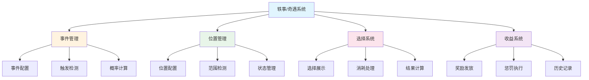
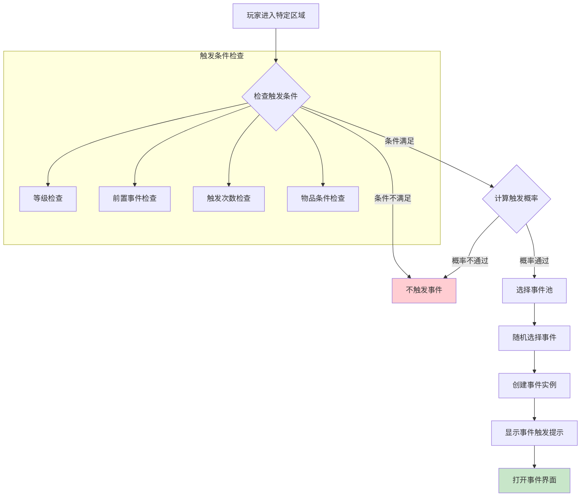
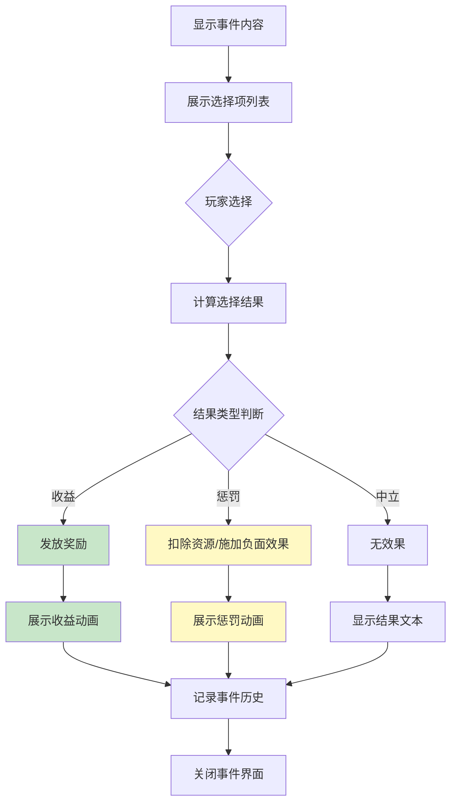
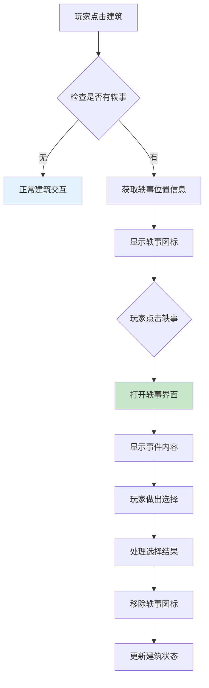
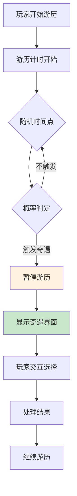
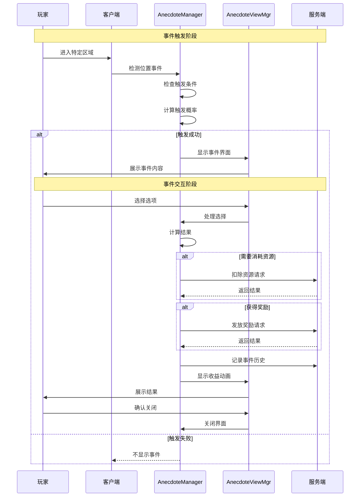
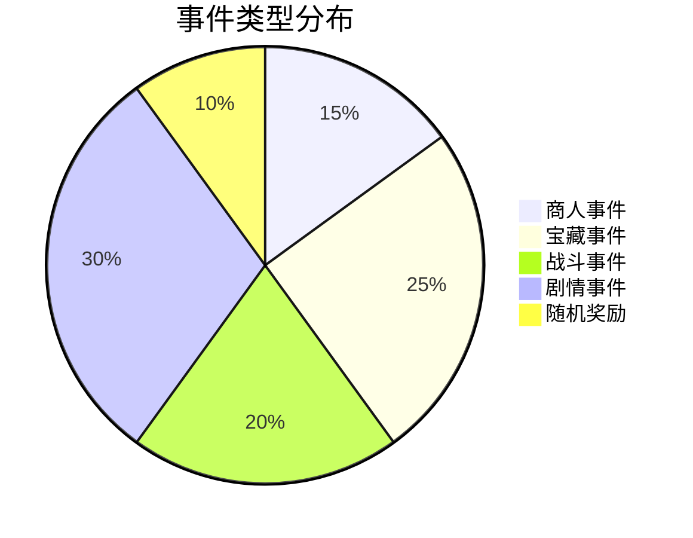
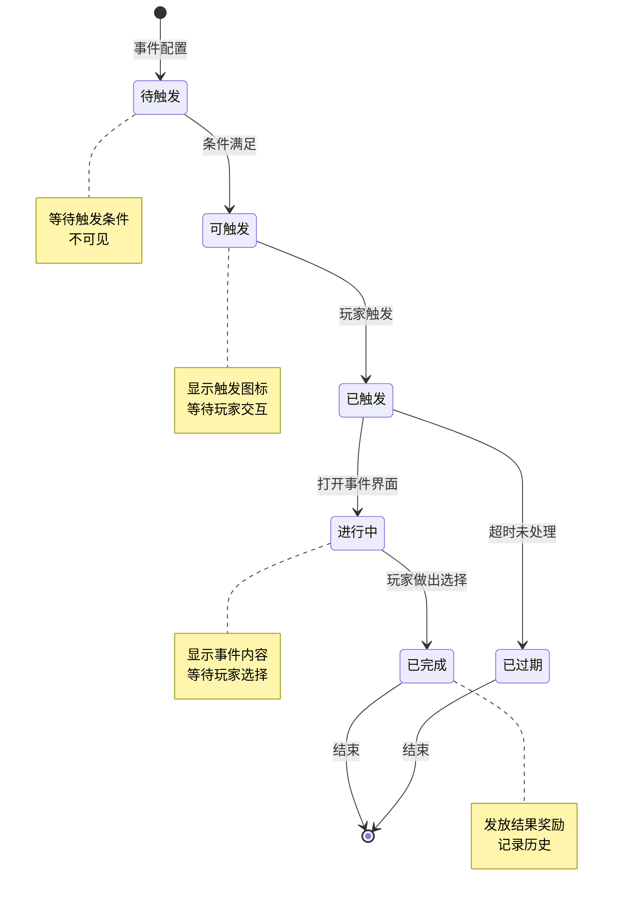
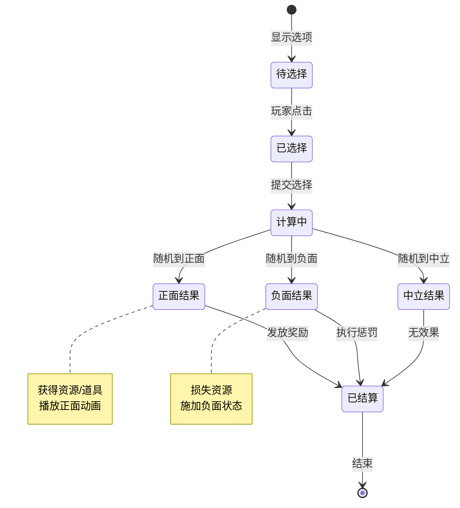

# 轶事/奇遇模块完整说明

## 一、模块概述

### 1.1 业务背景

轶事/奇遇模块是游戏中的随机事件系统，为玩家提供意外的惊喜和挑战。玩家在游戏过程中可能触发各种随机事件，通过选择获得不同的收益或惩罚，增加游戏的趣味性和不可预测性。

### 1.2 目标用户

- **探索型玩家**：喜欢发现隐藏内容的玩家
- **休闲玩家**：享受随机惊喜的玩家
- **所有游戏玩家**：在游戏各处都可能触发

### 1.3 核心价值

1. **增加趣味**：随机事件增加游戏趣味性
2. **探索奖励**：鼓励玩家探索游戏世界
3. **叙事丰富**：通过事件丰富游戏叙事
4. **决策体验**：提供选择带来不同结果

### 1.4 系统架构



---

## 二、功能清单

### 2.1 事件触发功能

| 功能名称 | 功能描述 | 用户价值 | 触发方式 |
|---------|---------|---------|---------|
| 位置触发 | 在特定位置触发事件 | 探索发现惊喜 | 进入坐标范围 |
| 时间触发 | 在特定时间触发事件 | 定时惊喜 | 定时器检测 |
| 条件触发 | 满足条件时触发事件 | 成长奖励 | 条件监听 |
| 随机触发 | 随机概率触发事件 | 意外惊喜 | 概率判定 |

### 2.2 事件交互功能

| 功能名称 | 功能描述 | 用户价值 | 交互方式 |
|---------|---------|---------|---------|
| 事件展示 | 展示事件标题和内容 | 了解事件信息 | 弹窗界面 |
| 选择交互 | 提供多个选项供玩家选择 | 决策体验 | 按钮点击 |
| 结果展示 | 展示选择的收益结果 | 获得反馈 | 动画展示 |
| 历史记录 | 记录已触发的事件 | 回顾经历 | 列表查看 |

### 2.3 收益类型功能

| 功能名称 | 功能描述 | 用户价值 | 处理方式 |
|---------|---------|---------|---------|
| 资源收益 | 获得货币、道具等资源 | 实质奖励 | 直接发放 |
| 属性加成 | 获得临时或永久属性加成 | 实力提升 | 添加Buff |
| 解锁内容 | 解锁新内容或功能 | 新体验 | 解锁标记 |
| 负面效果 | 可能获得惩罚效果 | 风险挑战 | 扣除/Debuff |

### 2.4 事件类型功能

| 功能名称 | 功能描述 | 用户价值 | 典型场景 |
|---------|---------|---------|---------|
| 商人事件 | 遇到神秘商人可购买物品 | 特殊购物 | 森林/城镇 |
| 宝藏事件 | 发现宝藏获得奖励 | 惊喜收益 | 探索区域 |
| 战斗事件 | 遭遇敌人进行战斗 | 战斗挑战 | 游历途中 |
| 剧情事件 | 触发特殊剧情对话 | 故事体验 | 条件满足 |
| 随机奖励 | 随机获得奖励 | 惊喜体验 | 任意时机 |

---

## 三、业务流程详解

### 3.1 事件触发流程



**详细步骤说明**：

1. **条件检测**
   - 检查玩家所在位置
   - 检查触发时间条件
   - 检查前置条件（等级、任务等）

2. **概率计算**
   - 根据配置计算触发概率
   - 随机判断是否触发

3. **事件选择**
   - 从事件池中筛选符合条件的事件
   - 随机选择一个事件
   - 创建事件实例

### 3.2 事件交互流程



**详细步骤说明**：

1. **事件展示**
   - 显示事件标题
   - 显示事件描述文本
   - 展示可选的选项列表

2. **玩家选择**
   - 玩家点击选项
   - 根据选项计算结果

3. **结果处理**
   - 发放奖励或惩罚
   - 播放结果动画
   - 记录事件历史

### 3.3 建筑随机事件流程



### 3.4 游历奇遇流程



### 3.5 完整时序图



---

## 四、关键规则

### 4.1 事件触发规则

#### 4.1.1 位置规则
- 事件绑定到特定位置坐标
- 玩家进入触发范围时检测
- 触发后位置事件消失

#### 4.1.2 时间规则
- 部分事件有时间限制
- 超时未处理自动选择默认选项
- 限时事件过期消失

#### 4.1.3 条件规则
- **等级限制**：达到指定等级才能触发
- **前置事件**：需完成前置事件
- **物品条件**：需持有特定物品
- **任务条件**：需完成特定任务
- **VIP条件**：需达到VIP等级

### 4.2 选择结果规则

#### 4.2.1 收益规则

| 收益类型 | 计算方式 | 说明 |
|----------|----------|------|
| 固定收益 | 直接发放 | 选择后获得固定奖励 |
| 随机收益 | 权重随机抽取 | 在奖励池中按权重随机 |
| 概率收益 | 逐一概率判定 | 有概率获得奖励 |

#### 4.2.2 惩罚规则

| 惩罚类型 | 影响范围 | 可抵抗 |
|----------|----------|--------|
| 资源损失 | 扣除货币或道具 | 部分可抵抗 |
| 负面状态 | 获得临时负面效果 | 通常可抵抗 |
| 无惩罚 | 无任何效果 | - |

### 4.3 事件冷却规则

#### 4.3.1 单次触发
- 同一事件实例只能触发一次
- 处理后从地图上移除

#### 4.3.2 周期刷新
- 事件位置定期刷新新事件
- 刷新周期由配置决定

### 4.4 事件记录规则

#### 4.4.1 历史记录
- 记录已触发的事件ID
- 记录选择和结果
- 用于成就统计

#### 4.4.2 次数限制
- 部分事件有触发次数上限
- 达到上限后不再触发

---

## 五、数据配置示例

### 5.1 商人事件配置

```json
{
    "eventId": 1001,
    "eventType": 1,
    "title": "神秘商人",
    "content": "你在路边遇到了一个神秘商人，他声称有稀有的宝物出售。",
    "triggerType": 1,
    "triggerProb": 0.1,
    "minLevel": 10,
    "maxLevel": 100,
    "preEventId": 0,
    "durationHours": 24,
    "maxTriggerCount": -1,
    "priority": 10,
    "iconRes": "UI/Icon/anecdote_merchant",
    "bgRes": "UI/Bg/anecdote_bg_forest",
    "choiceList": [
        {
            "choiceId": 10011,
            "choiceText": "购买神秘宝箱",
            "resultType": 2,
            "costList": [
                {"costType": 2, "costValue": 50, "costDesc": "消耗钻石×50"}
            ],
            "randomResults": [
                {
                    "weight": 30,
                    "earnings": {
                        "earningsType": 1,
                        "earningsValue": 5000,
                        "earningsDesc": "银两×5000",
                        "rewardList": [
                            {"rewardType": 2, "rewardValue": 5000, "count": 1, "quality": 2}
                        ]
                    }
                },
                {
                    "weight": 50,
                    "earnings": {
                        "earningsType": 1,
                        "earningsValue": 50001,
                        "earningsDesc": "稀有道具×1",
                        "rewardList": [
                            {"rewardType": 1, "rewardValue": 50001, "count": 1, "quality": 4}
                        ]
                    }
                },
                {
                    "weight": 20,
                    "earnings": {
                        "earningsType": 1,
                        "earningsValue": 20,
                        "earningsDesc": "体力×20",
                        "rewardList": [
                            {"rewardType": 5, "rewardValue": 20, "count": 1, "quality": 2}
                        ]
                    }
                }
            ],
            "desc": "消耗钻石×50，随机获得奖励"
        },
        {
            "choiceId": 10012,
            "choiceText": "离开",
            "resultType": 1,
            "rewardInfo": {
                "earningsType": 0,
                "earningsValue": 0,
                "earningsDesc": "无效果"
            },
            "desc": "不做任何操作"
        }
    ]
}
```

### 5.2 宝藏事件配置

```json
{
    "eventId": 1002,
    "eventType": 2,
    "title": "隐藏的宝藏",
    "content": "你发现了一个被杂草覆盖的宝箱，似乎很久没人打开过了。",
    "triggerType": 1,
    "triggerProb": 0.05,
    "minLevel": 20,
    "maxLevel": 100,
    "durationHours": 48,
    "choiceList": [
        {
            "choiceId": 10021,
            "choiceText": "打开宝箱",
            "resultType": 3,
            "probResults": [
                {
                    "probability": 5000,
                    "earnings": {
                        "earningsType": 1,
                        "earningsValue": 5000,
                        "earningsDesc": "银两×5000"
                    }
                },
                {
                    "probability": 3000,
                    "earnings": {
                        "earningsType": 1,
                        "earningsValue": 50002,
                        "earningsDesc": "稀有装备×1"
                    }
                },
                {
                    "probability": 2000,
                    "earnings": {
                        "earningsType": 4,
                        "earningsValue": 20,
                        "earningsDesc": "触发陷阱，损失体力×20",
                        "penaltyList": [
                            {"penaltyType": 1, "penaltyValue": 20, "penaltyDesc": "体力损失20点"}
                        ]
                    }
                }
            ],
            "desc": "50%获得银两，30%获得装备，20%触发陷阱"
        },
        {
            "choiceId": 10022,
            "choiceText": "离开",
            "resultType": 1,
            "rewardInfo": {
                "earningsType": 0,
                "earningsValue": 0,
                "earningsDesc": "无效果"
            }
        }
    ]
}
```

### 5.3 剧情事件配置

```json
{
    "eventId": 1003,
    "eventType": 4,
    "title": "流浪的诗人",
    "content": "一位衣衫褴褛的诗人请求你的帮助，他说他想创作一首关于勇气的诗篇。",
    "triggerType": 3,
    "triggerProb": 1.0,
    "minLevel": 15,
    "preEventId": 1001,
    "choiceList": [
        {
            "choiceId": 10031,
            "choiceText": "给他银两",
            "resultType": 1,
            "costList": [
                {"costType": 1, "costValue": 1000, "costDesc": "消耗银两×1000"}
            ],
            "rewardInfo": {
                "earningsType": 1,
                "earningsValue": 101,
                "earningsDesc": "获得称号「诗人的资助者」",
                "rewardList": [
                    {"rewardType": 8, "rewardValue": 101, "count": 1, "quality": 3}
                ]
            },
            "desc": "消耗银两获得称号"
        },
        {
            "choiceId": 10032,
            "choiceText": "请他为你写诗",
            "resultType": 1,
            "rewardInfo": {
                "earningsType": 1,
                "earningsValue": 50003,
                "earningsDesc": "获得道具「勇气诗篇」",
                "rewardList": [
                    {"rewardType": 1, "rewardValue": 50003, "count": 1, "quality": 3}
                ]
            },
            "desc": "获得特殊道具"
        },
        {
            "choiceId": 10033,
            "choiceText": "无视他",
            "resultType": 1,
            "rewardInfo": {
                "earningsType": 0,
                "earningsValue": 0,
                "earningsDesc": "无效果"
            }
        }
    ]
}
```

### 5.4 位置配置示例

```json
{
    "posId": 1001,
    "posX": 120.5,
    "posY": 80.3,
    "eventId": 1001,
    "triggerRadius": 50,
    "refreshType": 1,
    "refreshInterval": 24,
    "sceneId": 1,
    "buildingId": 0
}
```

---

## 六、用户故事

### 6.1 探索玩家故事

> 作为一名喜欢探索的玩家，我在游戏地图上四处走动。突然在一片树林旁边发现了一个闪烁的图标，走近后触发了一个"神秘宝箱"事件。我选择了"打开宝箱"，获得了稀有道具，让我非常惊喜。

### 6.2 建筑互动玩家故事

> 作为一名经常管理建筑的玩家，我在点击农场时发现了一个轶事图标。触发后发现是"迷路的商人"事件，他愿意低价出售稀有种子。我选择了购买，之后我的农场产出变得更好了。

### 6.3 游历玩家故事

> 作为一名喜欢游历的玩家，在游历过程中触发了"山贼伏击"奇遇。我选择了"正面迎战"，经过一番战斗成功击败山贼，获得了丰厚奖励。这次奇遇让游历过程更加刺激。

---

## 七、界面设计

### 7.1 事件界面结构

```
┌─────────────────────────────────────┐
│              [事件标题]               │
├─────────────────────────────────────┤
│                                     │
│         [背景图/动画区域]             │
│                                     │
├─────────────────────────────────────┤
│                                     │
│          [事件内容描述]              │
│                                     │
├─────────────────────────────────────┤
│                                     │
│  ┌─────────────────────────────┐   │
│  │  [选择项1] - 消耗描述        │   │
│  └─────────────────────────────┘   │
│  ┌─────────────────────────────┐   │
│  │  [选择项2] - 消耗描述        │   │
│  └─────────────────────────────┘   │
│  ┌─────────────────────────────┐   │
│  │  [选择项3] - 消耗描述        │   │
│  └─────────────────────────────┘   │
│                                     │
└─────────────────────────────────────┘
```

### 7.2 收益界面结构

```
┌─────────────────────────────────────┐
│             [获得奖励]               │
├─────────────────────────────────────┤
│                                     │
│  ┌─────┐ ┌─────┐ ┌─────┐          │
│  │奖励1│ │奖励2│ │奖励3│          │
│  │ 图标 │ │ 图标 │ │ 图标 │          │
│  │ ×10 │ │ ×1  │ │ ×5  │          │
│  └─────┘ └─────┘ └─────┘          │
│                                     │
│         [收益描述文本]              │
│                                     │
│         [确认按钮]                  │
│                                     │
└─────────────────────────────────────┘
```

### 7.3 惩罚界面结构

```
┌─────────────────────────────────────┐
│             [触发陷阱]               │
├─────────────────────────────────────┤
│                                     │
│         [惩罚动画/图标]             │
│                                     │
│         [惩罚描述文本]              │
│          "损失体力×20"              │
│                                     │
│         [确认按钮]                  │
│                                     │
└─────────────────────────────────────┘
```

---

## 八、事件类型分布



---

## 九、状态机设计

### 9.1 事件状态机



### 9.2 选择结果状态机



---

## 十、性能优化建议

### 10.1 配置缓存

```csharp
// 事件配置缓存
private Dictionary<int, AnecdoteEventInfo> _eventCache;

// 初始化时加载
public void Init()
{
    _eventCache = LoadEventConfigs();
}

// 获取配置时直接从缓存读取
public AnecdoteEventInfo GetEventInfo(int eventId)
{
    return _eventCache.TryGetValue(eventId, out var info) ? info : null;
}
```

### 10.2 对象池管理

```csharp
// 选择项对象池
private GameObjectPool _choiceItemPool;

// 奖励项对象池
private GameObjectPool _rewardItemPool;

// 使用对象池创建UI元素
public GameObject GetChoiceItem()
{
    return _choiceItemPool.Get();
}

public void ReturnChoiceItem(GameObject item)
{
    _choiceItemPool.Return(item);
}
```

### 10.3 位置检测优化

```csharp
// 使用空间分区优化位置检测
private SpatialGrid<AnecdotePosInfo> _posGrid;

public List<AnecdotePosInfo> GetPosByPosition(float x, float y, float radius)
{
    return _posGrid.Query(x, y, radius);
}
```

---

*文档生成时间: 2026-04-12*
*文档版本: v2.0.0*