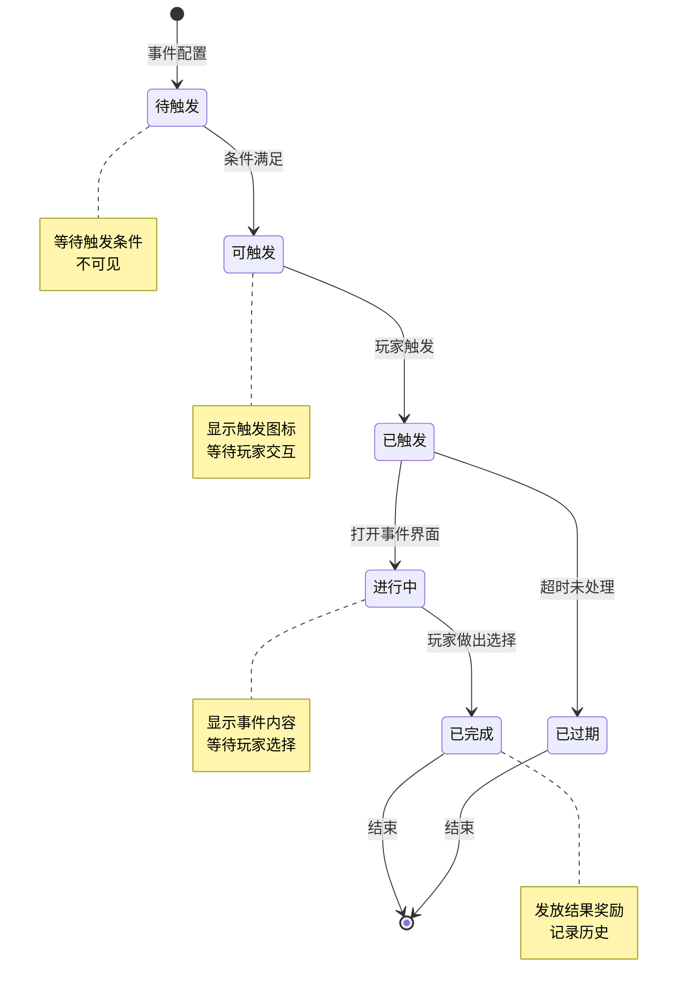
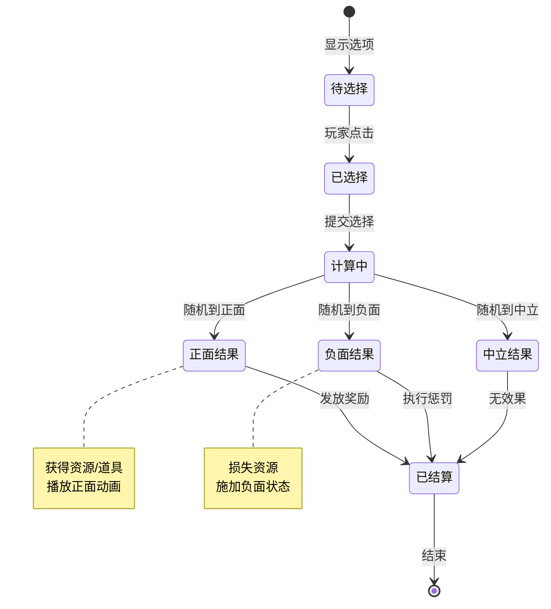
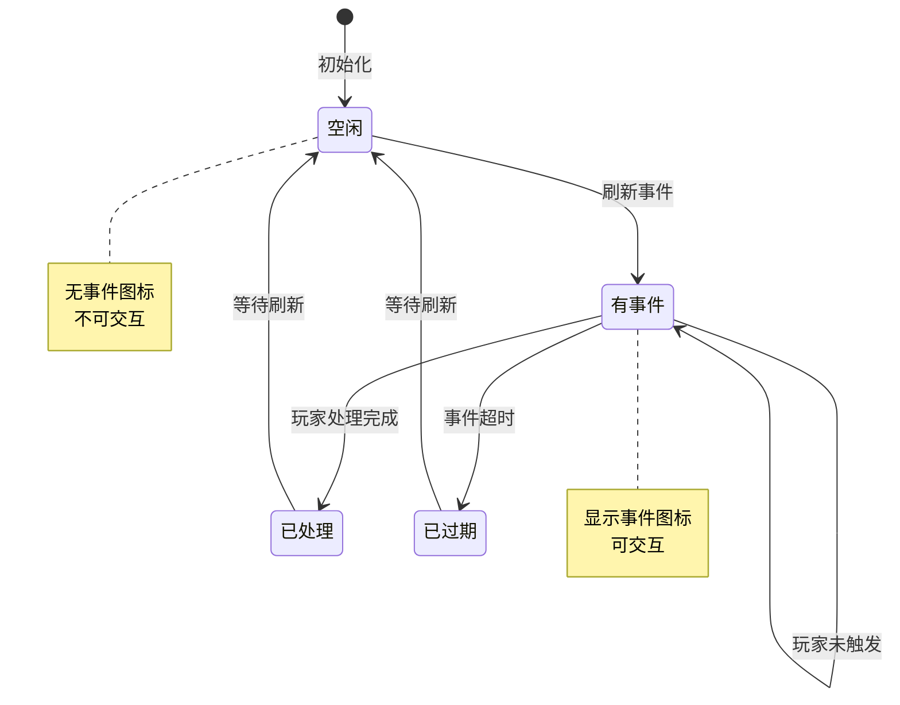
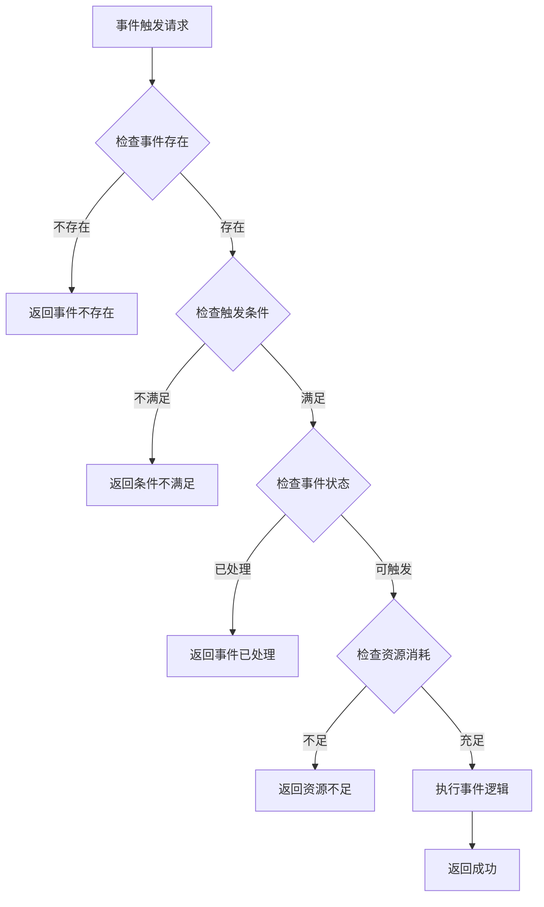
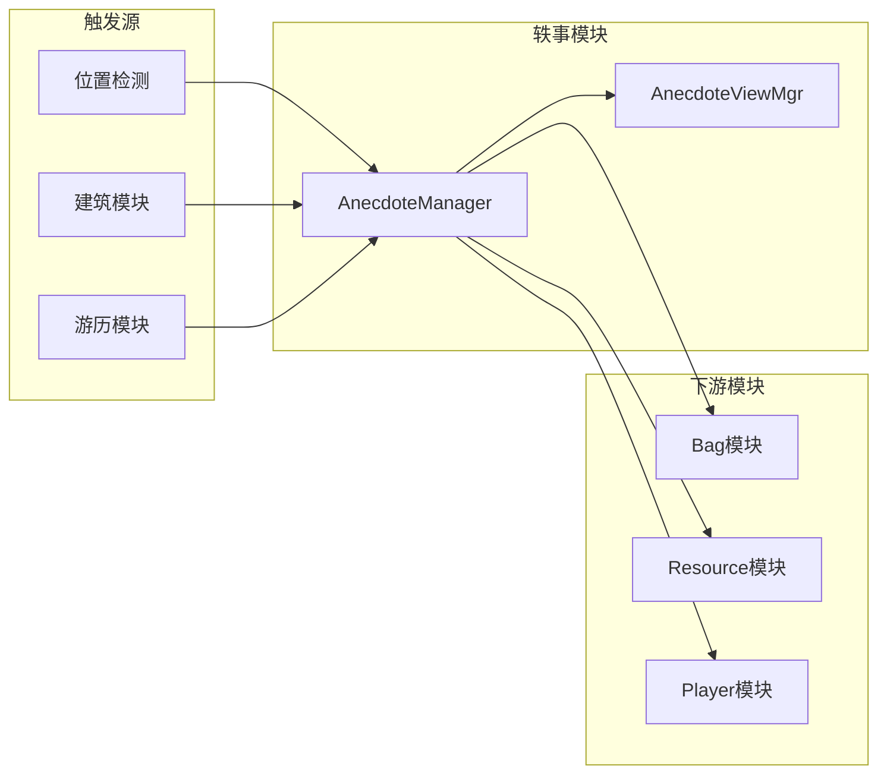

# 轶事/奇遇模块实现细节

## 一、计算公式

### 1.1 事件触发概率计算

```
实际触发概率 = 基础概率 × 玩家运气加成 × 时间加成 × 其他修正
```

**参数说明**：
- `基础概率`：配置表中的基础触发概率
- `玩家运气加成`：玩家属性带来的概率修正
- `时间加成`：特定时间段加成（如节日）
- `其他修正`：VIP、道具等加成

**示例计算**：
```
基础概率: 10%
玩家运气加成: 1.2 (20%加成)
时间加成: 1.0 (无加成)
其他修正: 1.0 (无加成)

实际触发概率 = 10% × 1.2 × 1.0 × 1.0 = 12%
```

### 1.2 奖励随机计算

```
奖励索引 = random(0, 权重总和)
遍历奖励池，累加权重直到 >= 奖励索引
返回对应的奖励
```

**示例计算**：
```
奖励池:
  - 奖励A: 权重30
  - 奖励B: 权重50
  - 奖励C: 权重20

权重总和 = 30 + 50 + 20 = 100
随机值 = 65

遍历:
  累加30 (奖励A), 小于65
  累加50 (奖励B), 等于80 >= 65
返回: 奖励B
```

### 1.3 惩罚效果计算

```
惩罚数值 = 基础惩罚值 × (1 - 玩家抗性)
实际惩罚 = max(最小值, 惩罚数值)
```

**示例计算**：
```
基础惩罚: 体力损失 50点
玩家抗性: 20%

惩罚数值 = 50 × (1 - 0.2) = 40点
实际惩罚 = 40点体力损失
```

---

## 二、状态机定义

### 2.1 事件状态机



### 2.2 选择结果状态机



### 2.3 事件位置状态机



---

## 三、数据约束

### 3.1 事件配置约束

| 字段名 | 数据类型 | 取值范围 | 必填 | 说明 |
|--------|----------|----------|------|------|
| eventId | int | > 0 | 是 | 事件ID |
| eventType | int | 1-5 | 是 | 事件类型 |
| title | String | 1-50字符 | 是 | 事件标题 |
| content | String | 1-500字符 | 是 | 事件内容 |
| triggerProb | float | 0-1 | 是 | 触发概率 |

### 3.2 事件位置约束

| 字段名 | 数据类型 | 取值范围 | 必填 | 说明 |
|--------|----------|----------|------|------|
| posId | int | > 0 | 是 | 位置ID |
| posX | float | - | 是 | X坐标 |
| posY | float | - | 是 | Y坐标 |
| eventId | int | > 0 | 是 | 关联事件ID |

### 3.3 选择项约束

| 字段名 | 数据类型 | 取值范围 | 必填 | 说明 |
|--------|----------|----------|------|------|
| choiceId | int | > 0 | 是 | 选择ID |
| choiceText | String | 1-100字符 | 是 | 选择文本 |
| resultType | int | 1-3 | 是 | 结果类型 |
| rewardInfo | object | - | 否 | 奖励信息 |

### 3.4 收益信息约束

| 字段名 | 数据类型 | 取值范围 | 必填 | 说明 |
|--------|----------|----------|------|------|
| earningsType | int | 1-5 | 是 | 收益类型 |
| earningsValue | long | >= 0 | 是 | 收益值 |
| earningsDesc | String | - | 否 | 收益描述 |

---

## 四、错误处理策略

### 4.1 轶事模块错误码

| 错误码 | 错误信息 | 处理策略 | 用户提示 |
|--------|----------|----------|----------|
| 80001 | 事件不存在 | 检查事件ID有效性 | "事件不存在" |
| 80002 | 事件已过期 | 检查事件有效期 | "事件已过期" |
| 80003 | 选择无效 | 检查选择ID | "无效的选择" |
| 80004 | 条件不满足 | 检查触发条件 | "不满足触发条件" |
| 80005 | 资源不足 | 检查消耗资源 | "资源不足" |

### 4.2 事件触发错误处理流程



### 4.3 结果处理错误处理

| 错误场景 | 处理策略 | 后续操作 |
|----------|----------|----------|
| 奖励发放失败 | 记录日志 | 转邮件发送 |
| 背包已满 | 提示玩家 | 转邮件发送 |
| 资源扣除失败 | 回滚操作 | 返回错误 |

---

## 五、关键代码示例

### 5.1 事件触发检测伪代码

```csharp
public void CheckAnecdoteTrigger(long playerId, float posX, float posY)
{
    // 获取该位置附近的事件
    List<AnecdotePosInfo> posEvents = anecdotePosDao.getByPosition(posX, posY, 50f);

    foreach (var posEvent in posEvents)
    {
        // 检查是否已触发
        if (playerAnecdoteDao.hasTriggered(playerId, posEvent.posId))
        {
            continue;
        }

        // 获取事件配置
        AnecdoteEventConfig eventConfig = anecdoteConfigDao.getById(posEvent.eventId);
        if (eventConfig == null) continue;

        // 检查触发条件
        if (!CheckTriggerCondition(playerId, eventConfig))
        {
            continue;
        }

        // 计算触发概率
        float triggerProb = CalculateTriggerProbability(playerId, eventConfig);
        if (Random.value > triggerProb)
        {
            continue; // 概率不通过
        }

        // 触发事件
        TriggerEvent(playerId, posEvent, eventConfig);
        break; // 一次只触发一个事件
    }
}

private float CalculateTriggerProbability(long playerId, AnecdoteEventConfig config)
{
    float baseProb = config.triggerProb;
    float luckBonus = playerService.GetLuckBonus(playerId);
    float timeBonus = GetTimeBonus(config);

    return baseProb * luckBonus * timeBonus;
}
```

### 5.2 事件选择处理伪代码

```csharp
public Result ProcessEventChoice(long playerId, long eventId, int choiceId)
{
    // 获取事件配置
    AnecdoteEventConfig eventConfig = anecdoteConfigDao.getById(eventId);
    if (eventConfig == null)
    {
        return Result.Error(80001, "事件不存在");
    }

    // 获取选择配置
    AnecdoteChoiceConfig choice = eventConfig.choices.Find(c => c.choiceId == choiceId);
    if (choice == null)
    {
        return Result.Error(80003, "选择无效");
    }

    // 检查资源消耗
    if (choice.costList != null && choice.costList.Count > 0)
    {
        foreach (var cost in choice.costList)
        {
            if (!resourceService.CheckResource(playerId, cost.type, cost.value))
            {
                return Result.Error(80005, "资源不足");
            }
        }
    }

    // 扣除资源
    if (choice.costList != null)
    {
        foreach (var cost in choice.costList)
        {
            resourceService.CostResource(playerId, cost.type, cost.value, "轶事选择消耗");
        }
    }

    // 计算结果
    AnecdoteEventEarningsInfo earnings = CalculateChoiceResult(choice);

    // 发放结果
    if (earnings.earningsType == EarningsType.REWARD)
    {
        bagService.addItems(playerId, earnings.rewardList);
    }
    else if (earnings.earningsType == EarningsType.PENALTY)
    {
        ApplyPenalty(playerId, earnings);
    }

    // 记录历史
    playerAnecdoteDao.RecordEvent(playerId, eventId, choiceId, earnings);

    return Result.Success(earnings);
}
```

### 5.3 奖励随机计算伪代码

```csharp
private AnecdoteEventEarningsInfo CalculateChoiceResult(AnecdoteChoiceConfig choice)
{
    if (choice.resultType == ResultType.FIXED)
    {
        // 固定结果
        return choice.fixedEarnings;
    }
    else if (choice.resultType == ResultType.RANDOM)
    {
        // 随机结果
        int totalWeight = 0;
        foreach (var result in choice.randomResults)
        {
            totalWeight += result.weight;
        }

        int randomValue = Random.Range(0, totalWeight);
        int currentWeight = 0;

        foreach (var result in choice.randomResults)
        {
            currentWeight += result.weight;
            if (randomValue < currentWeight)
            {
                return result.earnings;
            }
        }
    }
    else if (choice.resultType == ResultType.PROBABILITY)
    {
        // 概率结果
        foreach (var result in choice.probResults)
        {
            if (Random.value <= result.probability)
            {
                return result.earnings;
            }
        }
    }

    // 默认无效果
    return new AnecdoteEventEarningsInfo { earningsType = EarningsType.NONE };
}
```

### 5.4 事件刷新伪代码

```csharp
public void RefreshAnecdotePositions()
{
    // 获取所有事件位置
    List<AnecdotePosInfo> allPositions = anecdotePosDao.getAllPositions();

    foreach (var pos in allPositions)
    {
        // 检查是否需要刷新
        if (ShouldRefreshPosition(pos))
        {
            // 从事件池中选择新事件
            AnecdoteEventConfig newEvent = SelectRandomEvent(pos);

            if (newEvent != null)
            {
                pos.eventId = newEvent.eventId;
                pos.refreshTime = DateTime.Now;
                pos.expireTime = DateTime.Now.AddHours(newEvent.durationHours);
                anecdotePosDao.updatePosition(pos);
            }
        }
    }
}

private bool ShouldRefreshPosition(AnecdotePosInfo pos)
{
    // 已过期的需要刷新
    if (DateTime.Now > pos.expireTime)
    {
        return true;
    }

    // 无事件的刷新
    if (pos.eventId == 0)
    {
        return true;
    }

    return false;
}
```

### 5.5 客户端事件展示伪代码

```csharp
// 客户端代码
public class AnecdoteViewMgr : MonoBehaviour
{
    public void ShowEvent(AnecdoteEventInfo eventInfo)
    {
        // 设置事件标题和内容
        titleText.text = eventInfo.title;
        contentText.text = eventInfo.content;

        // 清空旧选项
        foreach (Transform child in choiceContainer)
        {
            Destroy(child.gameObject);
        }

        // 创建选择按钮
        foreach (var choice in eventInfo.choices)
        {
            GameObject choiceObj = Instantiate(choicePrefab, choiceContainer);
            AnecdoteEventChoiceView choiceView = choiceObj.GetComponent<AnecdoteEventChoiceView>();
            choiceView.SetChoice(choice, OnChoiceSelected);
        }

        // 显示面板
        eventPanel.SetActive(true);
    }

    private void OnChoiceSelected(int choiceId)
    {
        // 发送选择请求
        anecdoteService.ProcessChoice(currentEvent.eventId, choiceId, (result) =>
        {
            ShowEarnings(result);
        });
    }

    public void ShowEarnings(AnecdoteEventEarningsInfo earnings)
    {
        if (earnings.earningsType == EarningsType.REWARD)
        {
            // 显示获得奖励动画
            earningsView.ShowReward(earnings);
        }
        else if (earnings.earningsType == EarningsType.PENALTY)
        {
            // 显示惩罚效果
            earningsView.ShowPenalty(earnings);
        }
        else
        {
            // 无效果，直接关闭
            CloseEvent();
        }
    }
}
```

---

## 六、跨模块依赖

### 6.1 依赖模块

| 模块名称 | 依赖方式 | 依赖说明 |
|----------|----------|----------|
| Player | 数据读取 | 获取玩家等级、属性等 |
| Bag | 功能调用 | 发放奖励物品 |
| Resource | 功能调用 | 扣除/发放货币 |
| Building | 数据关联 | 建筑相关轶事事件 |
| Travel | 数据关联 | 游历相关奇遇事件 |

### 6.2 被依赖情况

| 模块名称 | 依赖方式 | 依赖说明 |
|----------|----------|----------|
| Building | 功能关联 | 建筑界面显示轶事 |
| Travel | 功能关联 | 游历触发奇遇 |

### 6.3 接口依赖图



---

*文档生成时间: 2026-04-07*
