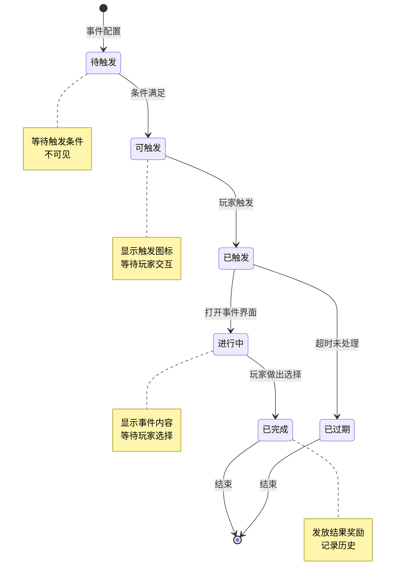
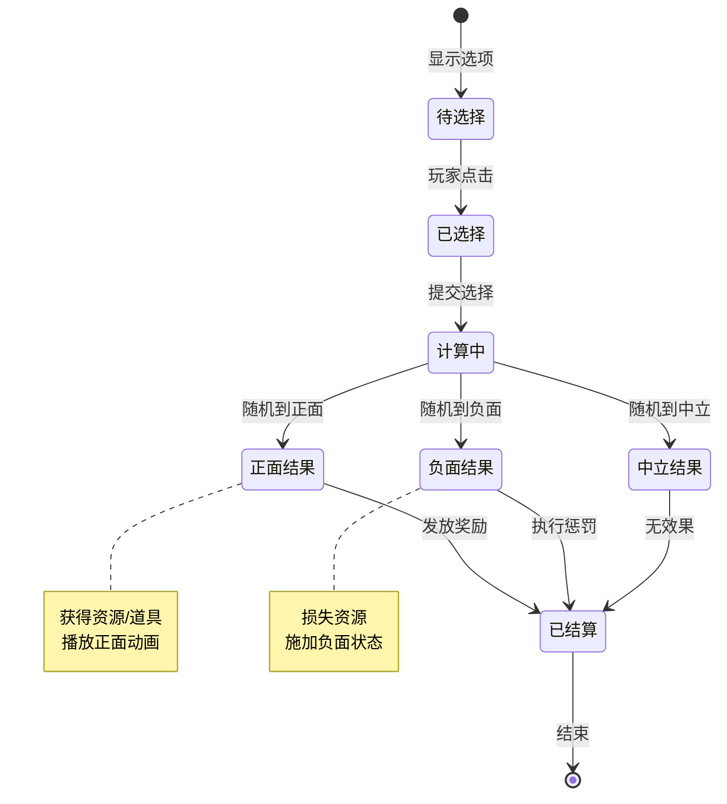
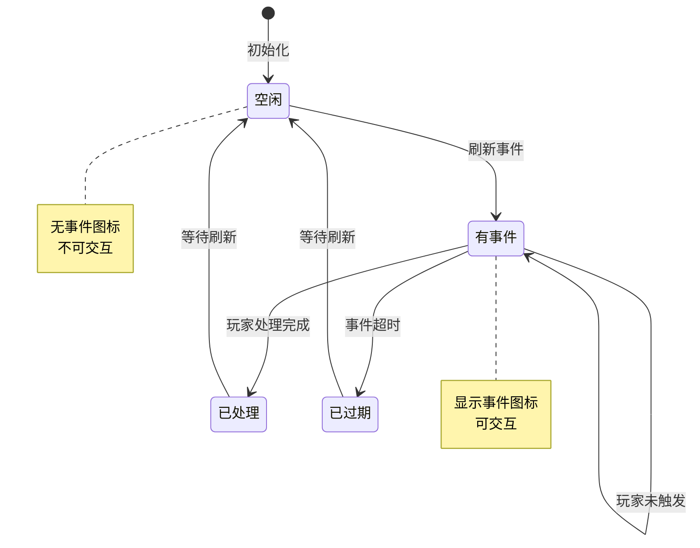
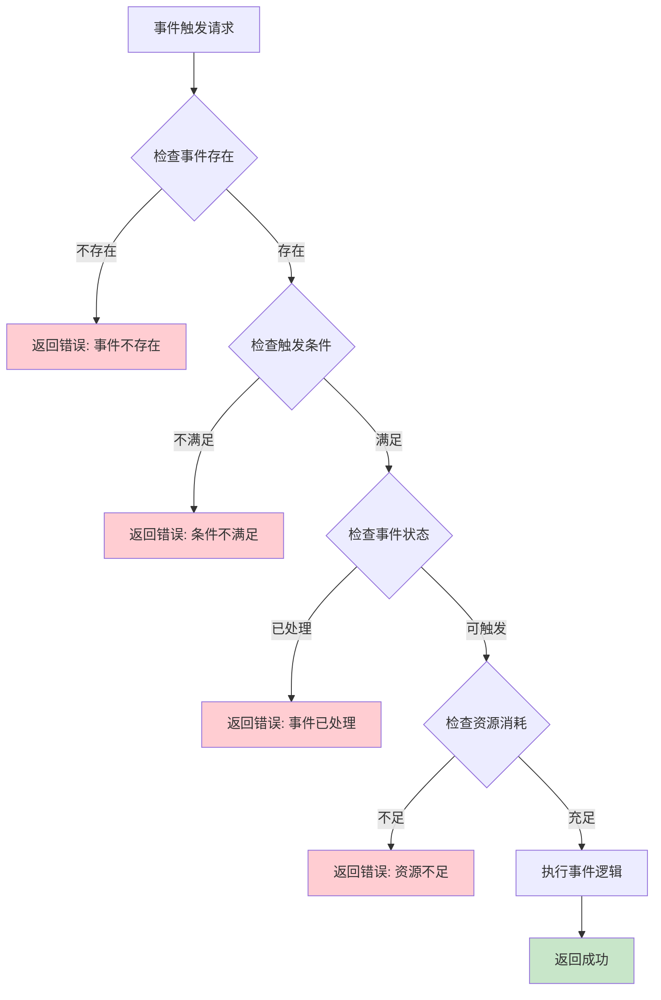
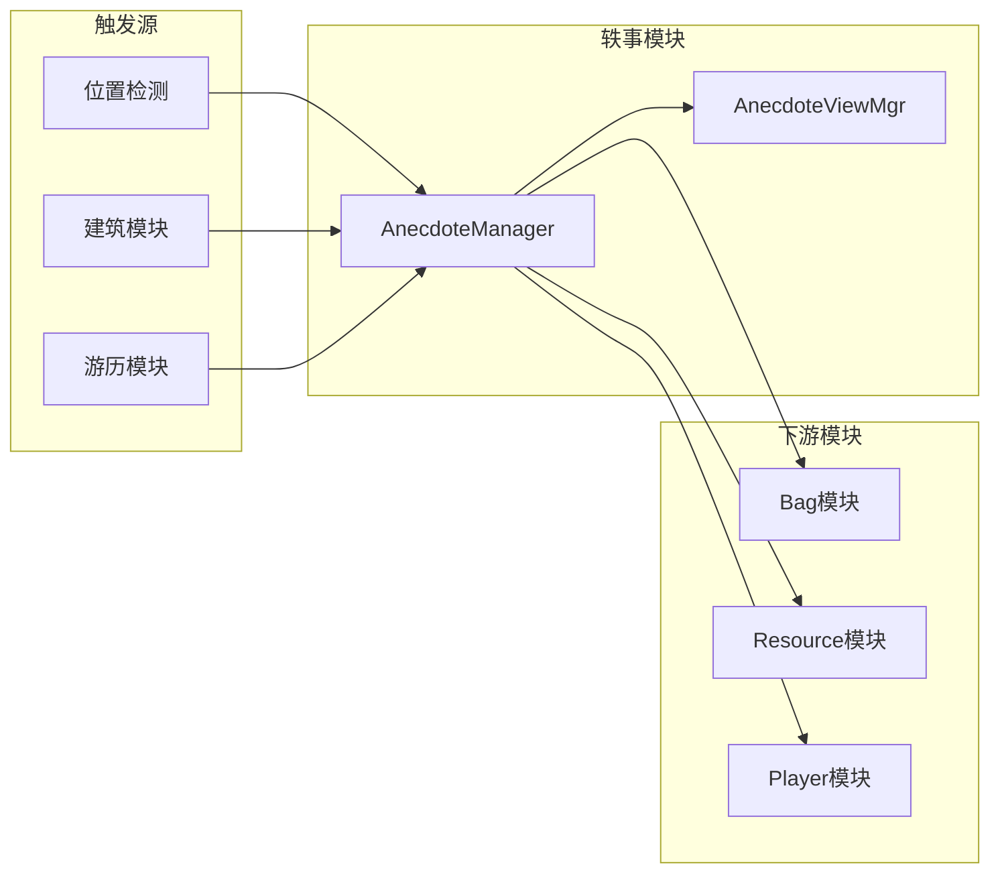

# 轶事/奇遇模块实现细节

## 一、计算公式

### 1.1 事件触发概率计算

```
实际触发概率 = 基础概率 × 玩家运气加成 × 时间加成 × 其他修正
```

**参数说明**：
- `基础概率`：配置表中的基础触发概率（0.0 - 1.0）
- `玩家运气加成`：玩家属性带来的概率修正（通常 1.0 - 2.0）
- `时间加成`：特定时间段加成（如节日，通常 1.0 - 1.5）
- `其他修正`：VIP、道具等加成（通常 1.0 - 1.5）

**示例计算**：
```
基础概率: 10%
玩家运气加成: 1.2 (20%加成)
时间加成: 1.0 (无加成)
其他修正: 1.0 (无加成)

实际触发概率 = 10% × 1.2 × 1.0 × 1.0 = 12%
```

**代码实现**：

```csharp
/// <summary>
/// 计算触发概率
/// </summary>
public float CalculateTriggerProbability(AnecdoteEventInfo eventInfo)
{
    // 基础概率
    float baseProb = eventInfo.triggerProb;

    // 玩家运气加成
    float luckBonus = CalculateLuckBonus();

    // 时间加成
    float timeBonus = CalculateTimeBonus(eventInfo);

    // 其他修正
    float otherBonus = CalculateOtherBonus(eventInfo);

    // 最终概率
    float finalProb = baseProb * luckBonus * timeBonus * otherBonus;

    // 限制最大概率
    return Mathf.Min(finalProb, 1.0f);
}

/// <summary>
/// 计算运气加成
/// </summary>
private float CalculateLuckBonus()
{
    int luckValue = NPPlayer.instance.GetAttributeValue(EAttributeType.LUCK);

    // 每10点运气增加1%概率加成
    // 假设运气值范围 0-100，则加成范围 1.0 - 2.0
    return 1.0f + (luckValue / 1000f);
}

/// <summary>
/// 计算时间加成
/// </summary>
private float CalculateTimeBonus(AnecdoteEventInfo eventInfo)
{
    // 检查是否在活动时间
    if (IsEventActivePeriod())
    {
        return 1.5f; // 活动期间加成50%
    }

    // 检查是否在特定时间段
    if (IsPrimeTime())
    {
        return 1.2f; // 黄金时间加成20%
    }

    return 1.0f;
}

/// <summary>
/// 计算其他修正
/// </summary>
private float CalculateOtherBonus(AnecdoteEventInfo eventInfo)
{
    float bonus = 1.0f;

    // VIP加成
    int vipLevel = NPPlayer.instance.vipLevel;
    if (vipLevel > 0)
    {
        bonus += vipLevel * 0.05f; // 每级VIP增加5%
    }

    // 特殊道具加成
    if (NPPlayer.instance.HasBuff(EBuffType.ANECDOTE_PROB_BOOST))
    {
        bonus += 0.2f; // 增加20%
    }

    return bonus;
}
```

### 1.2 奖励随机计算

```
奖励索引 = random(0, 权重总和)
遍历奖励池，累加权重直到 >= 奖励索引
返回对应的奖励
```

**示例计算**：
```
奖励池:
  - 奖励A: 权重30
  - 奖励B: 权重50
  - 奖励C: 权重20

权重总和 = 30 + 50 + 20 = 100
随机值 = 65

遍历:
  累加30 (奖励A), 小于65
  累加50 (奖励B), 等于80 >= 65
返回: 奖励B
```

**代码实现**：

```csharp
/// <summary>
/// 权重随机抽取
/// </summary>
public AnecdoteEventEarningsInfo WeightedRandomSelect(List<RandomResultInfo> randomResults)
{
    if (randomResults == null || randomResults.Count == 0)
    {
        return new AnecdoteEventEarningsInfo { earningsType = 0 };
    }

    // 计算总权重
    int totalWeight = 0;
    foreach (var result in randomResults)
    {
        totalWeight += result.weight;
    }

    // 随机值
    int randomValue = Random.Range(0, totalWeight);

    // 遍历查找
    int currentWeight = 0;
    foreach (var result in randomResults)
    {
        currentWeight += result.weight;
        if (randomValue < currentWeight)
        {
            return result.earnings;
        }
    }

    // 默认返回最后一个
    return randomResults[randomResults.Count - 1].earnings;
}

/// <summary>
/// 带保底机制的随机抽取
/// </summary>
public AnecdoteEventEarningsInfo WeightedRandomWithGuarantee(
    List<RandomResultInfo> randomResults,
    int guaranteeCount,
    ref int currentCount)
{
    // 检查是否触发保底
    if (guaranteeCount > 0 && currentCount >= guaranteeCount)
    {
        currentCount = 0;
        // 返回最高品质奖励
        return GetHighestQualityResult(randomResults);
    }

    // 正常随机
    var result = WeightedRandomSelect(randomResults);

    // 更新保底计数
    if (!IsHighQuality(result))
    {
        currentCount++;
    }
    else
    {
        currentCount = 0;
    }

    return result;
}
```

### 1.3 概率结果计算

```
逐一检查每个结果，按概率判定是否触发
如果触发，返回对应结果
如果都不触发，返回默认结果
```

**示例计算**：
```
概率结果列表:
  - 结果A: 概率5000 (50%)
  - 结果B: 概率3000 (30%)
  - 结果C: 概率2000 (20%)

随机值 = random(0, 10000)

判定过程:
  如果 随机值 < 5000 → 结果A
  否则如果 随机值 < 8000 (5000+3000) → 结果B
  否则 → 结果C
```

**代码实现**：

```csharp
/// <summary>
/// 概率结果计算
/// </summary>
public AnecdoteEventEarningsInfo ProbabilityResultSelect(List<ProbResultInfo> probResults)
{
    if (probResults == null || probResults.Count == 0)
    {
        return new AnecdoteEventEarningsInfo { earningsType = 0 };
    }

    foreach (var result in probResults)
    {
        int randomValue = Random.Range(0, 10000);
        if (randomValue < result.probability)
        {
            return result.earnings;
        }
    }

    // 都不触发，返回默认结果
    return new AnecdoteEventEarningsInfo { earningsType = 0 };
}

/// <summary>
/// 互斥概率结果计算（确保必有一个结果）
/// </summary>
public AnecdoteEventEarningsInfo MutuallyExclusiveSelect(List<ProbResultInfo> probResults)
{
    if (probResults == null || probResults.Count == 0)
    {
        return new AnecdoteEventEarningsInfo { earningsType = 0 };
    }

    // 计算总概率
    int totalProb = 0;
    foreach (var result in probResults)
    {
        totalProb += result.probability;
    }

    // 归一化随机
    int randomValue = Random.Range(0, totalProb);
    int currentProb = 0;

    foreach (var result in probResults)
    {
        currentProb += result.probability;
        if (randomValue < currentProb)
        {
            return result.earnings;
        }
    }

    return probResults[probResults.Count - 1].earnings;
}
```

### 1.4 惩罚效果计算

```
惩罚数值 = 基础惩罚值 × (1 - 玩家抗性)
实际惩罚 = max(最小值, 惩罚数值)
```

**示例计算**：
```
基础惩罚: 体力损失 50点
玩家抗性: 20%

惩罚数值 = 50 × (1 - 0.2) = 40点
实际惩罚 = 40点体力损失
```

**代码实现**：

```csharp
/// <summary>
/// 计算惩罚效果
/// </summary>
public int CalculatePenalty(AnecdotePenaltyInfo penalty)
{
    int baseValue = (int)penalty.penaltyValue;

    // 检查是否可抵抗
    if (!penalty.canResist)
    {
        return baseValue;
    }

    // 计算抗性
    float resistRate = GetPenaltyResistRate(penalty.penaltyType);

    // 抵抗判定
    int randomValue = Random.Range(0, 10000);
    if (randomValue < penalty.resistRate)
    {
        // 抵抗成功
        return 0;
    }

    // 计算减免后的惩罚值
    int finalValue = (int)(baseValue * (1 - resistRate));

    // 保证最小值
    return Mathf.Max(1, finalValue);
}

/// <summary>
/// 获取惩罚抗性比率
/// </summary>
private float GetPenaltyResistRate(int penaltyType)
{
    // 根据惩罚类型获取对应抗性
    switch (penaltyType)
    {
        case (int)EAnecdotePenaltyType.STAMINA:
            return NPPlayer.instance.GetAttributeValue(EAttributeType.STAMINA_RESIST) / 10000f;

        case (int)EAnecdotePenaltyType.SILVER:
            return NPPlayer.instance.GetAttributeValue(EAttributeType.SILVER_RESIST) / 10000f;

        default:
            return 0f;
    }
}
```

---

## 二、状态机定义

### 2.1 事件状态机



**状态枚举定义**：

```csharp
/// <summary>
/// 事件状态枚举
/// </summary>
public enum EAnecdoteEventState
{
    /// <summary>待触发 - 等待触发条件</summary>
    PENDING = 0,

    /// <summary>可触发 - 条件满足，显示图标</summary>
    READY = 1,

    /// <summary>已触发 - 玩家已交互</summary>
    TRIGGERED = 2,

    /// <summary>进行中 - 显示事件界面</summary>
    IN_PROGRESS = 3,

    /// <summary>已完成 - 玩家已做出选择</summary>
    COMPLETED = 4,

    /// <summary>已过期 - 超时未处理</summary>
    EXPIRED = 5
}
```

**状态管理代码**：

```csharp
/// <summary>
/// 事件状态管理器
/// </summary>
public class AnecdoteEventStateMachine
{
    private EAnecdoteEventState _currentState;
    private AnecdoteEventInfo _eventInfo;
    private long _expireTime;

    public EAnecdoteEventState CurrentState => _currentState;

    /// <summary>
    /// 初始化状态机
    /// </summary>
    public void Initialize(AnecdoteEventInfo eventInfo)
    {
        _eventInfo = eventInfo;
        _currentState = EAnecdoteEventState.PENDING;
        _expireTime = 0;
    }

    /// <summary>
    /// 更新状态
    /// </summary>
    public void Update()
    {
        switch (_currentState)
        {
            case EAnecdoteEventState.PENDING:
                UpdatePending();
                break;

            case EAnecdoteEventState.READY:
                UpdateReady();
                break;

            case EAnecdoteEventState.TRIGGERED:
                UpdateTriggered();
                break;
        }
    }

    /// <summary>
    /// 待触发状态更新
    /// </summary>
    private void UpdatePending()
    {
        // 检查触发条件是否满足
        if (CheckTriggerCondition())
        {
            TransitTo(EAnecdoteEventState.READY);
        }
    }

    /// <summary>
    /// 可触发状态更新
    /// </summary>
    private void UpdateReady()
    {
        // 检查是否过期
        if (_expireTime > 0 && TimeUtils.GetServerTimeMs() > _expireTime)
        {
            TransitTo(EAnecdoteEventState.EXPIRED);
        }
    }

    /// <summary>
    /// 已触发状态更新
    /// </summary>
    private void UpdateTriggered()
    {
        // 等待界面处理完成
    }

    /// <summary>
    /// 状态转换
    /// </summary>
    public void TransitTo(EAnecdoteEventState newState)
    {
        if (_currentState == newState) return;

        // 退出当前状态
        OnExitState(_currentState);

        // 更新状态
        _currentState = newState;

        // 进入新状态
        OnEnterState(newState);
    }

    /// <summary>
    /// 进入状态
    /// </summary>
    private void OnEnterState(EAnecdoteEventState state)
    {
        switch (state)
        {
            case EAnecdoteEventState.READY:
                // 设置过期时间
                if (_eventInfo.durationMs > 0)
                {
                    _expireTime = TimeUtils.GetServerTimeMs() + _eventInfo.durationMs;
                }
                // 显示图标
                ShowEventIcon();
                break;

            case EAnecdoteEventState.TRIGGERED:
                // 打开事件界面
                OpenEventUI();
                break;

            case EAnecdoteEventState.COMPLETED:
                // 记录历史
                RecordHistory();
                break;

            case EAnecdoteEventState.EXPIRED:
                // 处理过期逻辑
                HandleExpired();
                break;
        }
    }

    /// <summary>
    /// 退出状态
    /// </summary>
    private void OnExitState(EAnecdoteEventState state)
    {
        switch (state)
        {
            case EAnecdoteEventState.READY:
                // 隐藏图标
                HideEventIcon();
                break;
        }
    }
}
```

### 2.2 选择结果状态机



### 2.3 事件位置状态机



**位置状态管理代码**：

```csharp
/// <summary>
/// 位置状态管理器
/// </summary>
public class AnecdotePosStateMachine
{
    private EAnecdotePosStatus _currentStatus;
    private AnecdotePosInfo _posInfo;
    private long _refreshTime;

    /// <summary>
    /// 刷新位置状态
    /// </summary>
    public void Refresh()
    {
        if (_currentStatus == EAnecdotePosStatus.EMPTY)
        {
            // 刷新新事件
            var newEvent = SelectRandomEvent();
            if (newEvent != null)
            {
                _posInfo.eventId = newEvent.eventId;
                TransitTo(EAnecdotePosStatus.READY);
            }
        }
        else if (ShouldRefresh())
        {
            TransitTo(EAnecdotePosStatus.EMPTY);
        }
    }

    /// <summary>
    /// 检查是否需要刷新
    /// </summary>
    private bool ShouldRefresh()
    {
        // 已过期需要刷新
        if (TimeUtils.GetServerTimeMs() > _refreshTime)
        {
            return true;
        }

        // 已处理需要刷新
        if (_currentStatus == EAnecdotePosStatus.TRIGGERED ||
            _currentStatus == EAnecdotePosStatus.EXPIRED)
        {
            return true;
        }

        return false;
    }
}
```

---

## 三、数据约束

### 3.1 事件配置约束

| 字段名 | 数据类型 | 取值范围 | 必填 | 说明 |
|--------|----------|----------|------|------|
| eventId | int | > 0 | 是 | 事件ID |
| eventType | int | 1-5 | 是 | 事件类型 |
| title | String | 1-50字符 | 是 | 事件标题 |
| content | String | 1-500字符 | 是 | 事件内容 |
| triggerProb | float | 0-1 | 是 | 触发概率 |
| minLevel | int | >= 0 | 否 | 最低等级 |
| maxLevel | int | >= minLevel | 否 | 最高等级 |
| durationHours | int | > 0 | 否 | 持续时间 |

### 3.2 事件位置约束

| 字段名 | 数据类型 | 取值范围 | 必填 | 说明 |
|--------|----------|----------|------|------|
| posId | int | > 0 | 是 | 位置ID |
| posX | float | - | 是 | X坐标 |
| posY | float | - | 是 | Y坐标 |
| eventId | int | > 0 | 是 | 关联事件ID |
| triggerRadius | float | > 0 | 否 | 触发半径 |

### 3.3 选择项约束

| 字段名 | 数据类型 | 取值范围 | 必填 | 说明 |
|--------|----------|----------|------|------|
| choiceId | int | > 0 | 是 | 选择ID |
| choiceText | String | 1-100字符 | 是 | 选择文本 |
| resultType | int | 1-3 | 是 | 结果类型 |
| rewardInfo | object | - | 否 | 奖励信息 |

### 3.4 收益信息约束

| 字段名 | 数据类型 | 取值范围 | 必填 | 说明 |
|--------|----------|----------|------|------|
| earningsType | int | 0-5 | 是 | 收益类型 |
| earningsValue | long | >= 0 | 是 | 收益值 |
| earningsDesc | String | - | 否 | 收益描述 |

---

## 四、错误处理策略

### 4.1 轶事模块错误码

| 错误码 | 错误信息 | 处理策略 | 用户提示 |
|--------|----------|----------|----------|
| 80001 | 事件不存在 | 检查事件ID有效性 | "事件不存在" |
| 80002 | 事件已过期 | 检查事件有效期 | "事件已过期" |
| 80003 | 选择无效 | 检查选择ID | "无效的选择" |
| 80004 | 条件不满足 | 检查触发条件 | "不满足触发条件" |
| 80005 | 资源不足 | 检查消耗资源 | "资源不足" |
| 80006 | 事件已处理 | 检查事件状态 | "事件已处理" |
| 80007 | 概率判定失败 | 正常逻辑 | "运气不佳" |
| 80008 | 系统错误 | 记录日志 | "系统错误，请重试" |

### 4.2 事件触发错误处理流程



### 4.3 结果处理错误处理

| 错误场景 | 处理策略 | 后续操作 |
|----------|----------|----------|
| 奖励发放失败 | 记录日志 | 转邮件发送 |
| 背包已满 | 提示玩家 | 转邮件发送 |
| 资源扣除失败 | 回滚操作 | 返回错误 |
| 配置数据缺失 | 使用默认值 | 记录警告日志 |

**错误处理代码**：

```csharp
/// <summary>
/// 处理错误
/// </summary>
public void HandleError(int errorCode, string errorMsg)
{
    switch (errorCode)
    {
        case 80001: // 事件不存在
            UIManager.ShowToast("事件不存在");
            AnecdoteViewMgr.Instance.CloseEvent();
            break;

        case 80002: // 事件已过期
            UIManager.ShowToast("事件已过期");
            AnecdoteViewMgr.Instance.CloseEvent();
            break;

        case 80003: // 选择无效
            UIManager.ShowToast("无效的选择");
            break;

        case 80004: // 条件不满足
            UIManager.ShowToast("不满足触发条件");
            break;

        case 80005: // 资源不足
            UIManager.ShowToast("资源不足");
            OpenResourcePanel();
            break;

        default:
            UIManager.ShowToast(errorMsg);
            break;
    }
}
```

---

## 五、关键代码示例

### 5.1 事件触发检测伪代码

```csharp
/// <summary>
/// 检查轶事事件触发
/// </summary>
public void CheckAnecdoteTrigger(long playerId, float posX, float posY)
{
    // 获取该位置附近的事件
    List<AnecdotePosInfo> posEvents = GetPosByPosition(posX, posY, 50f);

    foreach (var posEvent in posEvents)
    {
        // 检查是否已触发
        if (HasTriggered(playerId, posEvent.posId))
        {
            continue;
        }

        // 获取事件配置
        AnecdoteEventInfo eventConfig = GetEventInfo(posEvent.eventId);
        if (eventConfig == null) continue;

        // 检查触发条件
        if (!CheckTriggerCondition(eventConfig))
        {
            continue;
        }

        // 计算触发概率
        float triggerProb = CalculateTriggerProbability(eventConfig);
        if (Random.value > triggerProb)
        {
            continue; // 概率不通过
        }

        // 触发事件
        TriggerEvent(eventConfig);
        break; // 一次只触发一个事件
    }
}

/// <summary>
/// 计算触发概率
/// </summary>
private float CalculateTriggerProbability(AnecdoteEventInfo config)
{
    float baseProb = config.triggerProb;
    float luckBonus = GetPlayerLuckBonus();
    float timeBonus = GetTimeBonus(config);
    float otherBonus = GetOtherBonus(config);

    return Mathf.Clamp(baseProb * luckBonus * timeBonus * otherBonus, 0f, 1f);
}
```

### 5.2 事件选择处理伪代码

```csharp
/// <summary>
/// 处理事件选择
/// </summary>
public Result ProcessEventChoice(long playerId, long eventId, int choiceId)
{
    // 获取事件配置
    AnecdoteEventInfo eventConfig = GetEventInfo(eventId);
    if (eventConfig == null)
    {
        return Result.Error(80001, "事件不存在");
    }

    // 获取选择配置
    AnecdoteEventChoiceInfo choice = eventConfig.choiceList.Find(c => c.choiceId == choiceId);
    if (choice == null)
    {
        return Result.Error(80003, "选择无效");
    }

    // 检查资源消耗
    if (choice.costList != null && choice.costList.Count > 0)
    {
        foreach (var cost in choice.costList)
        {
            if (!CheckResource(playerId, cost.costType, cost.costValue))
            {
                return Result.Error(80005, "资源不足");
            }
        }
    }

    // 扣除资源
    if (choice.costList != null)
    {
        foreach (var cost in choice.costList)
        {
            DeductResource(playerId, cost.costType, cost.costValue, "轶事选择消耗");
        }
    }

    // 计算结果
    AnecdoteEventEarningsInfo earnings = CalculateChoiceResult(choice);

    // 发放结果
    if (earnings.earningsType == (int)EAnecdoteEarningsType.REWARD)
    {
        GrantReward(playerId, earnings);
    }
    else if (earnings.earningsType == (int)EAnecdoteEarningsType.PENALTY)
    {
        ExecutePenalty(playerId, earnings);
    }

    // 记录历史
    RecordEvent(playerId, eventId, choiceId, earnings);

    return Result.Success(earnings);
}
```

### 5.3 奖励随机计算伪代码

```csharp
/// <summary>
/// 计算选择结果
/// </summary>
private AnecdoteEventEarningsInfo CalculateChoiceResult(AnecdoteEventChoiceInfo choice)
{
    switch (choice.resultType)
    {
        case (int)EAnecdoteResultType.FIXED:
            // 固定结果
            return choice.rewardInfo;

        case (int)EAnecdoteResultType.RANDOM:
            // 随机结果（权重）
            return WeightedRandomSelect(choice.randomResults);

        case (int)EAnecdoteResultType.PROBABILITY:
            // 概率结果
            return ProbabilityResultSelect(choice.probResults);

        default:
            // 默认无效果
            return new AnecdoteEventEarningsInfo { earningsType = 0 };
    }
}
```

### 5.4 事件刷新伪代码

```csharp
/// <summary>
/// 刷新轶事位置
/// </summary>
public void RefreshAnecdotePositions()
{
    // 获取所有事件位置
    List<AnecdotePosInfo> allPositions = GetAllPositions();

    foreach (var pos in allPositions)
    {
        // 检查是否需要刷新
        if (ShouldRefreshPosition(pos))
        {
            // 从事件池中选择新事件
            AnecdoteEventInfo newEvent = SelectRandomEvent(pos);

            if (newEvent != null)
            {
                pos.eventId = newEvent.eventId;
                pos.refreshTime = DateTime.Now;
                pos.expireTime = DateTime.Now.AddHours(newEvent.durationHours);
                UpdatePosition(pos);
            }
        }
    }
}

/// <summary>
/// 检查位置是否需要刷新
/// </summary>
private bool ShouldRefreshPosition(AnecdotePosInfo pos)
{
    // 已过期的需要刷新
    if (DateTime.Now > pos.expireTime)
    {
        return true;
    }

    // 无事件的刷新
    if (pos.eventId == 0)
    {
        return true;
    }

    return false;
}
```

### 5.5 客户端事件展示伪代码

```csharp
/// <summary>
/// 轶事视图管理器
/// </summary>
public class AnecdoteViewMgr : MonoBehaviour
{
    /// <summary>
    /// 显示事件
    /// </summary>
    public void ShowEvent(AnecdoteEventInfo eventInfo)
    {
        // 设置事件标题和内容
        titleText.text = LocalizationManager.instance.GetText(eventInfo.title);
        contentText.text = LocalizationManager.instance.GetText(eventInfo.content);

        // 清空旧选项
        foreach (Transform child in choiceContainer)
        {
            Destroy(child.gameObject);
        }

        // 创建选择按钮
        foreach (var choice in eventInfo.choiceList)
        {
            GameObject choiceObj = Instantiate(choicePrefab, choiceContainer);
            AnecdoteEventChoiceView choiceView = choiceObj.GetComponent<AnecdoteEventChoiceView>();
            choiceView.SetChoice(choice, OnChoiceSelected);
        }

        // 显示面板
        eventPanel.SetActive(true);
    }

    /// <summary>
    /// 选择回调
    /// </summary>
    private void OnChoiceSelected(int choiceId)
    {
        // 发送选择请求
        AnecdoteManager.Instance.ProcessChoice(_currentEvent.eventId, choiceId, (result) =>
        {
            ShowEarnings(result);
        });
    }

    /// <summary>
    /// 显示收益
    /// </summary>
    public void ShowEarnings(AnecdoteEventEarningsInfo earnings)
    {
        if (earnings.earningsType == (int)EAnecdoteEarningsType.REWARD)
        {
            // 显示获得奖励动画
            earningsView.ShowReward(earnings);
        }
        else if (earnings.earningsType == (int)EAnecdoteEarningsType.PENALTY)
        {
            // 显示惩罚效果
            earningsView.ShowPenalty(earnings);
        }
        else
        {
            // 无效果，直接关闭
            CloseEvent();
        }
    }
}
```

---

## 六、跨模块依赖

### 6.1 依赖模块

| 模块名称 | 依赖方式 | 依赖说明 |
|----------|----------|----------|
| Player | 数据读取 | 获取玩家等级、属性等 |
| Bag | 功能调用 | 发放奖励物品 |
| Resource | 功能调用 | 扣除/发放货币 |
| Building | 数据关联 | 建筑相关轶事事件 |
| Travel | 数据关联 | 游历相关奇遇事件 |

### 6.2 被依赖情况

| 模块名称 | 依赖方式 | 依赖说明 |
|----------|----------|----------|
| Building | 功能关联 | 建筑界面显示轶事 |
| Travel | 功能关联 | 游历触发奇遇 |

### 6.3 接口依赖图



---

## 七、性能优化建议

### 7.1 配置缓存

```csharp
// 使用字典缓存事件配置
private Dictionary<int, AnecdoteEventInfo> _eventCache;

// 初始化时预加载
public void PreloadConfigs()
{
    _eventCache = new Dictionary<int, AnecdoteEventInfo>();
    var configs = LoadAllEventConfigs();
    foreach (var config in configs)
    {
        _eventCache[config.eventId] = config;
    }
}
```

### 7.2 对象池

```csharp
// UI对象池
private GameObjectPool _choiceItemPool;
private GameObjectPool _rewardItemPool;

// 获取对象
public GameObject GetChoiceItem()
{
    return _choiceItemPool.Get();
}

// 回收对象
public void ReturnChoiceItem(GameObject item)
{
    _choiceItemPool.Return(item);
}
```

### 7.3 空间分区

```csharp
// 使用空间网格优化位置检测
private SpatialGrid<AnecdotePosInfo> _posGrid;

// 查询附近事件
public List<AnecdotePosInfo> GetNearbyEvents(float x, float y, float radius)
{
    return _posGrid.Query(x, y, radius);
}
```

---

*文档生成时间: 2026-04-12*
*文档版本: v2.0.0*