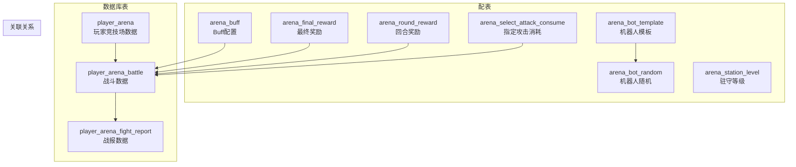
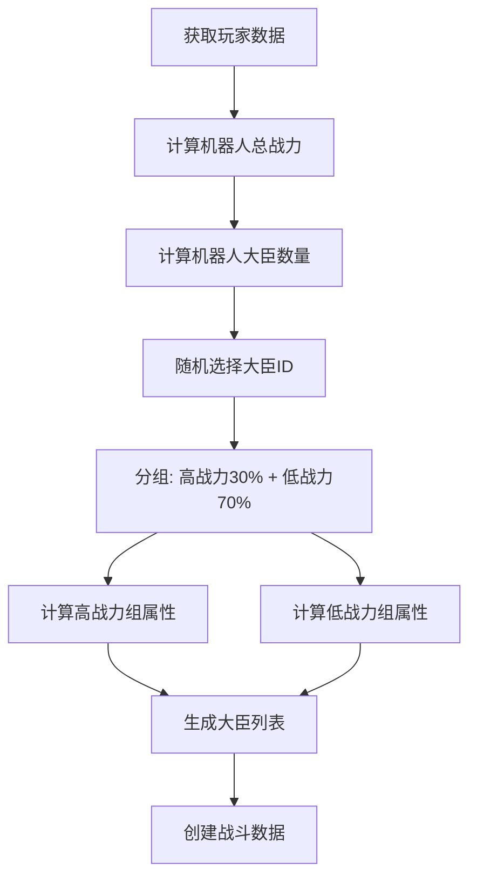
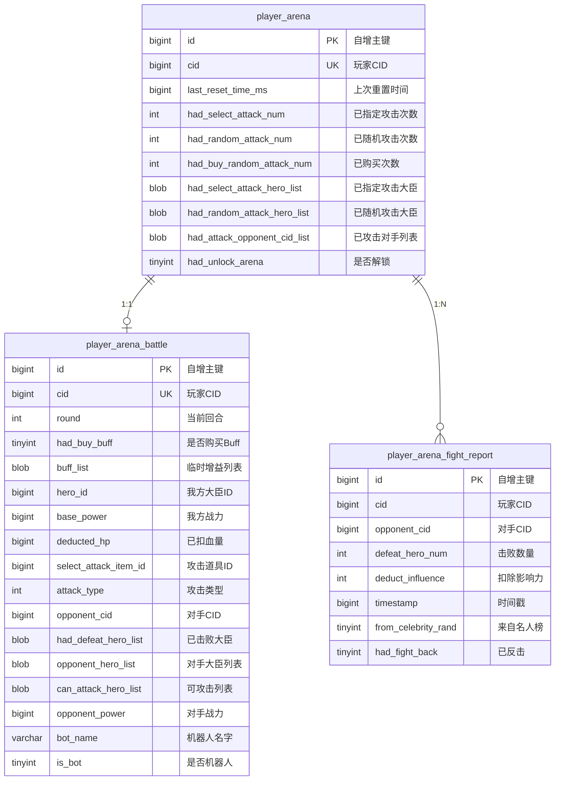
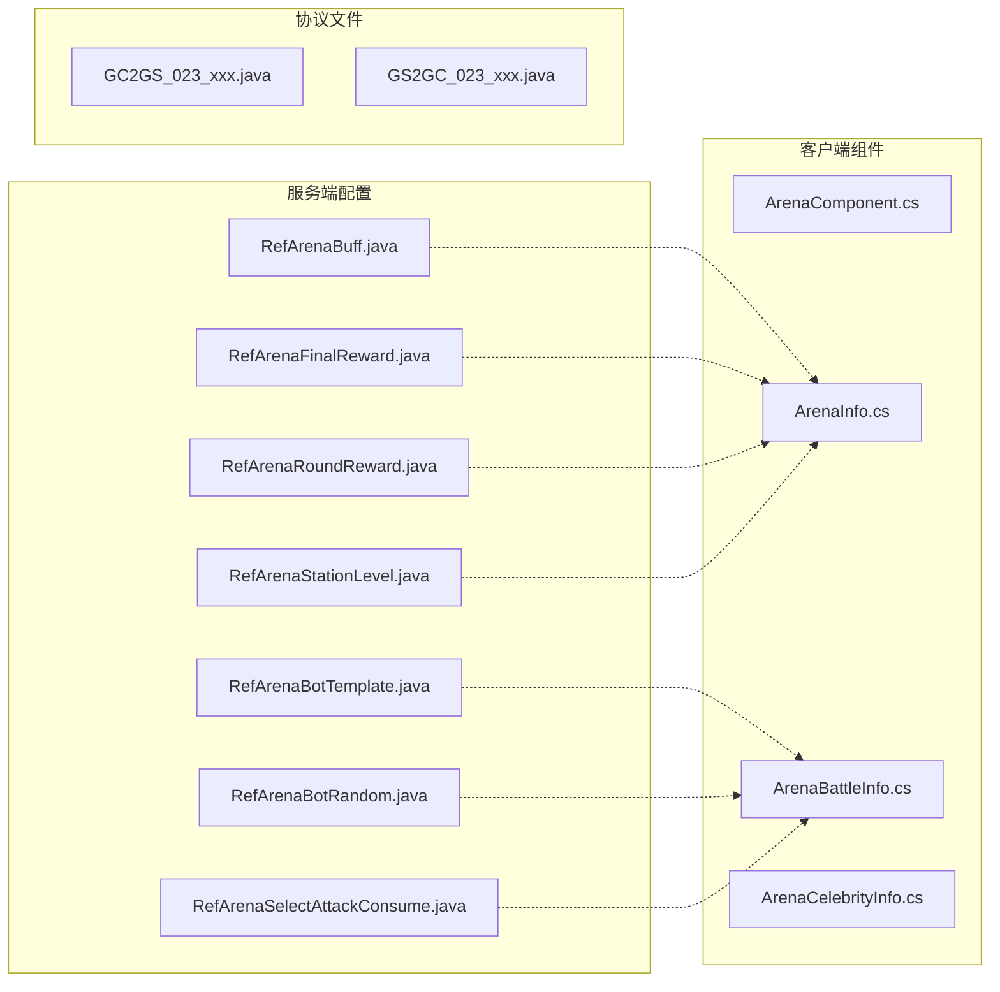
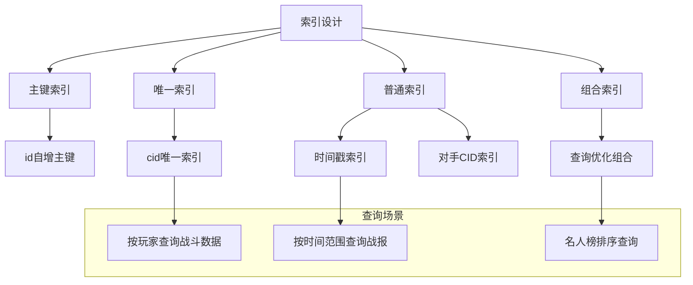
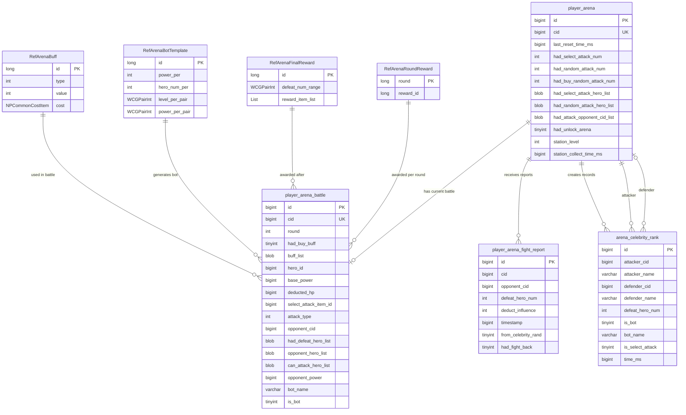
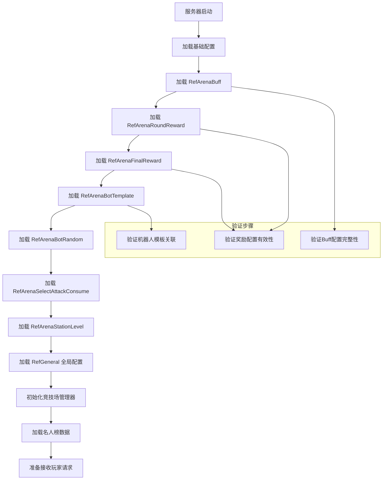

# 竞技场系统 - 数据配表

## 概述

竞技场系统 (ArenaOp, p023) 是游戏中的PVP玩法，玩家可以挑战其他玩家提升排名，获取奖励。本模块涉及7张配表和3张数据库表。

---

## 配表总览



---

## 配表文件列表

| 配表名称 | 表名 | 文件位置 | 用途 |
|---------|------|----------|------|
| 竞技场Buff配置 | arena_buff | RefArenaBuff.java | 定义战斗中可购买的Buff |
| 竞技场最终奖励 | arena_final_reward | RefArenaFinalReward.java | 根据击败数量发放奖励 |
| 竞技场回合奖励 | arena_round_reward | RefArenaRoundReward.java | 每回合击败奖励 |
| 竞技场机器人模板 | arena_bot_template | RefArenaBotTemplate.java | 机器人战力配置模板 |
| 竞技场机器人随机配置 | arena_bot_random | RefArenaBotRandom.java | 按排名决定机器人概率 |
| 竞技场指定攻击消耗 | arena_select_attack_consume | RefArenaSelectAttackConsume.java | 指定攻击道具及倍率 |
| 竞技场驻守等级 | arena_station_level | RefArenaStationLevel.java | 驻守升级及收益配置 |

---

## 1. 竞技场Buff配置 (arena_buff)

**文件位置**: `game_server/GameRes/src/NPGameRes/Refs/Arena/RefArenaBuff.java`

### 完整字段列表

| 字段名 | 类型 | 必填 | 默认值 | 取值范围 | 说明 |
|-------|------|------|--------|----------|------|
| id | long | 是 | - | > 0 | Buff ID (主键) |
| type | EArenaBuffType | 是 | NONE | 枚举值 | Buff类型枚举 |
| value | int | 是 | 0 | 0-10000 | 增益值(万分比)，2000表示+20% |
| cost | NPCommonCostItem | 是 | null | - | 购买消耗配置 |

### Buff类型枚举 (EArenaBuffType)

```java
public enum EArenaBuffType
{
    NONE(0),       // 无类型
    ATTACK(1),     // 攻击加成 - 增加战斗伤害
    DEFENSE(2),    // 防御加成 - 减少受到伤害
    HP(3);         // 血量加成 - 增加初始血量

    private final int value;
    EArenaBuffType(int value) { this.value = value; }
    public int getValue() { return value; }

    public static EArenaBuffType valueOf(int value) {
        for (EArenaBuffType type : values()) {
            if (type.value == value) return type;
        }
        return NONE;
    }
}
```

### 配置示例

```json
[
    {
        "id": 1001,
        "type": "ATTACK",
        "value": 2000,
        "cost": {"type": "CURRENCY", "id": "DIAMOND", "count": 10}
    },
    {
        "id": 1002,
        "type": "DEFENSE",
        "value": 3000,
        "cost": {"type": "CURRENCY", "id": "DIAMOND", "count": 15}
    },
    {
        "id": 1003,
        "type": "HP",
        "value": 5000,
        "cost": {"type": "CURRENCY", "id": "DIAMOND", "count": 20}
    },
    {
        "id": 1004,
        "type": "ATTACK",
        "value": 5000,
        "cost": {"type": "CURRENCY", "id": "DIAMOND", "count": 25}
    }
]
```

### 使用示例

```java
// 获取Buff配置
RefArenaBuff refBuff = RefArenaBuff.getMgr().get(buffId);
if (refBuff == null) {
    return Result.fail("Buff不存在");
}

// 计算Buff增益
int addPer = refBuff.value * buffCount;
long buffedPower = (long) Math.ceil(basePower * (10000 + addPer) / 10000.0);

// 消耗检查
if (!userData.hasEnoughItem(refBuff.cost)) {
    return Result.fail("道具不足");
}
userData.spendItem(refBuff.cost, context);
```

---

## 2. 竞技场最终奖励 (arena_final_reward)

**文件位置**: `game_server/GameRes/src/NPGameRes/Refs/Arena/RefArenaFinalReward.java`

### 完整字段列表

| 字段名 | 类型 | 必填 | 默认值 | 取值范围 | 说明 |
|-------|------|------|--------|----------|------|
| id | long | 是 | - | > 0 | 奖励ID (主键) |
| defeat_num_range | WCGPairInt | 是 | - | [-1, -1] | 击败数量范围 [min, max]，-1表示无限制 |
| reward_item_list | List&lt;NPCommonCostItem&gt; | 是 | 空列表 | - | 奖励道具列表 |

### 奖励查询逻辑

```java
public class RefArenaFinalReward extends _ARefBase
{
    public long id;
    public WCGPairInt defeat_num_range;  // [min, max]
    public List<NPCommonCostItem> reward_item_list;

    /**
     * 检查击败数量是否匹配
     */
    public boolean isMatch(int defeatNum)
    {
        int min = defeat_num_range.first();
        int max = defeat_num_range.second();

        boolean minMatch = (min == -1 || defeatNum >= min);
        boolean maxMatch = (max == -1 || defeatNum <= max);

        return minMatch && maxMatch;
    }
}

/**
 * 按击败数量查询奖励配置
 */
public RefArenaFinalReward getRefByDefeatNum(int _defeatNum)
{
    for (RefArenaFinalReward ref : getList())
    {
        if (ref.isMatch(_defeatNum))
            return ref;
    }
    return null;  // 未找到匹配配置
}
```

### 配置示例

| id | defeat_num_range | reward_item_list | 说明 |
|----|------------------|------------------|------|
| 1 | [1, 3] | 竞技币x50 | 击败1-3个 |
| 2 | [4, 6] | 竞技币x100 | 击败4-6个 |
| 3 | [7, 9] | 竞技币x150, 钻石x5 | 击败7-9个 |
| 4 | [10, -1] | 竞技币x200, 钻石x10, 稀有道具x1 | 击败10个及以上 |

---

## 3. 竞技场回合奖励 (arena_round_reward)

**文件位置**: `game_server/GameRes/src/NPGameRes/Refs/Arena/RefArenaRoundReward.java`

### 完整字段列表

| 字段名 | 类型 | 必填 | 默认值 | 取值范围 | 说明 |
|-------|------|------|--------|----------|------|
| round | long | 是 | - | > 0 | 回合数 (主键) |
| reward_id | long | 是 | - | > 0 | 奖励配置ID，关联Reward表 |

### 配置示例

| round | reward_id | 说明 |
|-------|-----------|------|
| 1 | 1001 | 第1回合奖励 |
| 2 | 1002 | 第2回合奖励 |
| 3 | 1003 | 第3回合奖励 |
| 4 | 1004 | 第4回合奖励 |
| 5 | 1005 | 第5回合奖励 |
| 6 | 1006 | 第6回合奖励 |
| 7 | 1007 | 第7回合及以上使用 |

### 使用示例

```java
// 获取回合奖励
public RewardObj getRoundReward(int round)
{
    RefArenaRoundReward ref = RefArenaRoundReward.getMgr().get(round);
    if (ref == null) {
        // 使用最大回合奖励
        ref = RefArenaRoundReward.getMgr().get(getMaxRound());
    }
    return RewardMgr.getInstance().lookupReward(ref.reward_id);
}
```

---

## 4. 竞技场机器人模板 (arena_bot_template)

**文件位置**: `game_server/GameRes/src/NPGameRes/Refs/Arena/RefArenaBotTemplate.java`

### 完整字段列表

| 字段名 | 类型 | 必填 | 默认值 | 取值范围 | 说明 |
|-------|------|------|--------|----------|------|
| id | long | 是 | - | > 0 | 模板ID (主键) |
| power_per | int | 是 | 10000 | 0-20000 | 总实力万分比，8000=80%玩家战力 |
| hero_num_per | int | 是 | 10000 | 0-10000 | 伙伴数量万分比 |
| level_per_pair | WCGPairInt | 是 | - | - | 分组等级万分比 [高战力, 低战力] |
| power_per_pair | WCGPairInt | 是 | - | - | 分组实力万分比 [高战力, 低战力] |

### 机器人生成流程



### 机器人生成代码

```java
public class RefArenaBotTemplate extends _ARefBase
{
    public long id;
    public int power_per;           // 总实力万分比
    public int hero_num_per;        // 伙伴数量万分比
    public WCGPairInt level_per_pair;  // [高战力等级比, 低战力等级比]
    public WCGPairInt power_per_pair;  // [高战力战力比, 低战力战力比]

    /**
     * 生成机器人大臣列表
     */
    public Hero_ArenaShowList generateBotHeroList(NPUSUserData userData)
    {
        // 1. 获取玩家基础数据
        long playerTotalPower = userData.getHeroComponent().getTotalPower();
        int playerHeroNum = userData.getHeroComponent().getHeroNum();
        int playerAvgLevel = userData.getHeroComponent().getTotalHeroLevel() / playerHeroNum;

        // 2. 计算机器人战力和数量
        long robotTotalPower = (long) Math.ceil(playerTotalPower * power_per / 10000d);
        int robotHeroNum = (int) Math.ceil(playerHeroNum * hero_num_per / 10000d);
        robotHeroNum = Math.min(robotHeroNum, RefGeneral.Ref().arena_bot_hero_list.size());

        // 3. 随机选择大臣ID
        List<Long> heroIdList = CommonFunc.getRndCount(
            RefGeneral.Ref().arena_bot_hero_list, robotHeroNum);
        Collections.shuffle(heroIdList);

        // 4. 分组
        int highHeroNum = (int) Math.ceil(robotHeroNum * 0.3);
        List<Long> highHeroIds = heroIdList.subList(0, highHeroNum);
        List<Long> lowHeroIds = heroIdList.subList(highHeroNum, heroIdList.size());

        // 5. 生成大臣数据
        Hero_ArenaShowList result = new Hero_ArenaShowList();

        // 高战力组
        if (!highHeroIds.isEmpty()) {
            long highTotalPower = (long) Math.ceil(robotTotalPower * power_per_pair.first() / 10000d);
            long highAvgPower = (long) Math.ceil((double) highTotalPower / highHeroNum);
            int highLevel = (int) Math.ceil(playerAvgLevel * level_per_pair.first() / 10000d);

            for (Long heroId : highHeroIds) {
                Hero_ArenaShowInfo info = new Hero_ArenaShowInfo();
                info.setHeroId(heroId);
                info.setPower(highAvgPower);
                info.setLevel(highLevel);
                result.addHeroList(info);
            }
        }

        // 低战力组
        if (!lowHeroIds.isEmpty()) {
            long lowTotalPower = (long) Math.ceil(robotTotalPower * power_per_pair.second() / 10000d);
            long lowAvgPower = (long) Math.ceil((double) lowTotalPower / lowHeroIds.size());
            int lowLevel = (int) Math.ceil(playerAvgLevel * level_per_pair.second() / 10000d);

            for (Long heroId : lowHeroIds) {
                Hero_ArenaShowInfo info = new Hero_ArenaShowInfo();
                info.setHeroId(heroId);
                info.setPower(lowAvgPower);
                info.setLevel(lowLevel);
                result.addHeroList(info);
            }
        }

        return result;
    }
}
```

### 配置示例

| id | power_per | hero_num_per | level_per_pair | power_per_pair | 说明 |
|----|-----------|--------------|----------------|----------------|------|
| 1 | 6000 | 5000 | [12000, 8000] | [7000, 3000] | 弱机器人: 60%战力，50%大臣 |
| 2 | 8000 | 7000 | [11000, 9000] | [6000, 4000] | 中等机器人: 80%战力，70%大臣 |
| 3 | 10000 | 10000 | [10000, 10000] | [5000, 5000] | 强机器人: 100%战力，100%大臣 |
| 4 | 12000 | 10000 | [13000, 11000] | [8000, 2000] | 精英机器人: 120%战力 |

---

## 5. 竞技场机器人随机配置 (arena_bot_random)

**文件位置**: `game_server/GameRes/src/NPGameRes/Refs/Arena/RefArenaBotRandom.java`

### 完整字段列表

| 字段名 | 类型 | 必填 | 默认值 | 取值范围 | 说明 |
|-------|------|------|--------|----------|------|
| id | long | 是 | - | > 0 | 配置ID (主键) |
| rank_begin | int | 是 | 1 | >= 1 | 排名起始 |
| rank_end | int | 是 | -1 | >= rank_begin | 排名结束，-1表示无上限 |
| weight | int | 是 | 0 | 0-10000 | 匹配机器人概率(万分比) |
| template_weight_list | WeightLongValueList | 是 | 空列表 | - | 机器人模板ID权重列表 |

### 按排名查询配置

```java
public class RefArenaBotRandom extends _ARefBase
{
    public long id;
    public int rank_begin;
    public int rank_end;
    public int weight;                      // 机器人概率
    public WeightLongValueList template_weight_list;  // 模板权重

    /**
     * 检查排名是否匹配
     */
    public boolean isMatch(int rank)
    {
        if (rank < rank_begin) return false;
        if (rank_end != -1 && rank > rank_end) return false;
        return true;
    }

    /**
     * 随机选择机器人模板
     */
    public RefArenaBotTemplate randomTemplate()
    {
        long templateId = template_weight_list.randomValue();
        return RefArenaBotTemplate.getMgr().get(templateId);
    }
}

/**
 * 按排名查询配置
 */
public static RefArenaBotRandom getRefByRank(int rank)
{
    for (RefArenaBotRandom ref : getList())
    {
        if (ref.isMatch(rank))
            return ref;
    }
    return null;
}
```

### 配置示例

| id | rank_begin | rank_end | weight | template_weight_list | 说明 |
|----|------------|----------|--------|---------------------|------|
| 1 | 1 | 100 | 5000 | [1:700, 2:30] | 前100名: 50%概率，主要弱机器人 |
| 2 | 101 | 500 | 3000 | [1:40, 2:50, 3:10] | 101-500名: 30%概率 |
| 3 | 501 | 1000 | 2000 | [2:60, 3:40] | 501-1000名: 20%概率 |
| 4 | 1001 | -1 | 1000 | [3:50, 4:50] | 1001名以后: 10%概率，可能精英机器人 |

---

## 6. 竞技场指定攻击消耗 (arena_select_attack_consume)

**文件位置**: `game_server/GameRes/src/NPGameRes/Refs/Arena/RefArenaSelectAttackConsume.java`

### 完整字段列表

| 字段名 | 类型 | 必填 | 默认值 | 取值范围 | 说明 |
|-------|------|------|--------|----------|------|
| id | long | 是 | - | > 0 | 道具ID (主键) |
| cost | NPCommonCostItem | 是 | null | - | 消耗道具配置 |
| ratio | int | 是 | 1 | >= 1 | 获得影响力和奖励倍数 |

### 使用示例

```java
// 指定攻击使用道具
public Result useSelectAttackItem(long itemId, NPPlayerContext context)
{
    RefArenaSelectAttackConsume ref = RefArenaSelectAttackConsume.getMgr().get(itemId);
    if (ref == null) {
        return Result.fail("道具不存在");
    }

    // 消耗道具
    if (!userData.spendItem(ref.cost, context)) {
        return Result.fail("道具不足");
    }

    // 记录倍率，结算时使用
    battleInfo.setSelectAttackItemId(itemId);
    battleInfo.setRewardRatio(ref.ratio);

    return Result.SUCC;
}

// 结算时应用倍率
int gainInfluence = defeatHeroNum * baseInfluence * ref.ratio;
```

### 配置示例

| id | cost | ratio | 说明 |
|----|------|-------|------|
| 1 | 钻石x50 | 2 | 双倍奖励卡 |
| 2 | 钻石x100 | 3 | 三倍奖励卡 |
| 3 | 竞技币x500 | 2 | 竞技币双倍卡 |
| 4 | VIP积分x10 | 5 | 五倍奖励卡(稀有) |

---

## 7. 竞技场驻守等级 (arena_station_level)

**文件位置**: `game_server/GameRes/src/NPGameRes/Refs/Arena/RefArenaStationLevel.java`

### 完整字段列表

| 字段名 | 类型 | 必填 | 默认值 | 取值范围 | 说明 |
|-------|------|------|--------|----------|------|
| level | int | 是 | - | > 0 | 等级 (主键) |
| upgrade_cost | NPCommonCostItem | 是 | null | - | 升级消耗 |
| harvest_ratio | int | 是 | 10000 | 0-100000 | 收成比例(万分比) |
| storage_limit_sec | long | 是 | 0 | > 0 | 储存上限时间(秒) |
| harvest_per_sec | int | 是 | 0 | >= 0 | 每秒收益 |

### 配置示例

| level | upgrade_cost | harvest_ratio | storage_limit_sec | harvest_per_sec | 说明 |
|-------|--------------|---------------|-------------------|-----------------|------|
| 1 | - | 10000 | 21600 | 10 | 1级：6小时上限，每秒10金币 |
| 2 | 竞技币x100 | 11000 | 28800 | 12 | 2级：8小时上限，10%加成 |
| 3 | 竞技币x300 | 12500 | 36000 | 15 | 3级：10小时上限，25%加成 |
| 4 | 竞技币x800 | 14500 | 43200 | 20 | 4级：12小时上限，45%加成 |
| 5 | 竞技币x2000 | 17000 | 54000 | 25 | 5级：15小时上限，70%加成 |
| 6 | 钻石x100 | 20000 | 64800 | 30 | 6级：18小时上限，100%加成 |
| 7 | 钻石x300 | 23500 | 72000 | 35 | 7级：20小时上限，135%加成 |
| 8 | 钻石x800 | 27500 | 86400 | 40 | 8级：24小时上限，175%加成 |
| 9 | 钻石x2000 | 32000 | 108000 | 45 | 9级：30小时上限，220%加成 |
| 10 | 钻石x5000 | 40000 | 129600 | 50 | 10级：36小时上限，300%加成 |

---

## 数据库表结构

### ER关系图



### player_arena (玩家竞技场数据)

| 字段名 | 类型 | 是否主键 | 是否索引 | 默认值 | 说明 |
|-------|------|----------|----------|--------|------|
| id | bigint(20) | 是 | 是 | 自增 | 主键 |
| cid | bigint(20) | 否 | 是(唯一) | - | 玩家CID |
| last_reset_time_ms | bigint(20) | 否 | 否 | 0 | 上次重置计数时间 |
| had_select_attack_num | int(11) | 否 | 否 | 0 | 已指定攻击次数 |
| had_random_attack_num | int(11) | 否 | 否 | 0 | 已随机攻击次数 |
| had_buy_random_attack_num | int(11) | 否 | 否 | 0 | 已购买随机攻击次数 |
| had_select_attack_hero_list | blob | 否 | 否 | NULL | 已指定攻击大臣ID列表(序列化) |
| had_random_attack_hero_list | blob | 否 | 否 | NULL | 已随机攻击大臣ID列表(序列化) |
| had_attack_opponent_cid_list | blob | 否 | 否 | NULL | 已攻击过的对手CID列表(序列化) |
| had_unlock_arena | tinyint(1) | 否 | 否 | 0 | 是否解锁竞技场 |

### player_arena_battle (玩家竞技场战斗数据)

| 字段名 | 类型 | 是否主键 | 是否索引 | 默认值 | 说明 |
|-------|------|----------|----------|--------|------|
| id | bigint(20) | 是 | 是 | 自增 | 主键 |
| cid | bigint(20) | 否 | 是(唯一) | - | 玩家CID |
| round | int(11) | 否 | 否 | 0 | 当前回合数 |
| had_buy_buff | tinyint(1) | 否 | 否 | 0 | 本轮是否已购买buff |
| buff_list | blob | 否 | 否 | NULL | 临时增益列表(序列化) |
| hero_id | bigint(20) | 否 | 否 | 0 | 我方大臣ID |
| base_power | bigint(20) | 否 | 否 | 0 | 我方基础实力 |
| deducted_hp | bigint(20) | 否 | 否 | 0 | 我方被扣除血量 |
| select_attack_item_id | bigint(20) | 否 | 否 | 0 | 选择攻击道具ID |
| attack_type | int(11) | 否 | 否 | 0 | 攻击类型(枚举值) |
| opponent_cid | bigint(20) | 否 | 否 | 0 | 对手CID(0为机器人) |
| had_defeat_hero_list | blob | 否 | 否 | NULL | 已击败的大臣列表(序列化) |
| opponent_hero_list | blob | 否 | 否 | NULL | 对手大臣列表(序列化) |
| can_attack_hero_list | blob | 否 | 否 | NULL | 本回合可攻击英雄列表(序列化) |
| opponent_power | bigint(20) | 否 | 否 | 0 | 对手战力 |
| bot_name | varchar(256) | 否 | 否 | NULL | 机器人名字 |
| is_bot | tinyint(1) | 否 | 否 | 0 | 是否是机器人 |

### player_arena_fight_report (玩家竞技场战报数据)

| 字段名 | 类型 | 是否主键 | 是否索引 | 默认值 | 说明 |
|-------|------|----------|----------|--------|------|
| id | bigint(20) | 是 | 是 | 自增 | 主键 |
| cid | bigint(20) | 否 | 是 | - | 玩家CID |
| opponent_cid | bigint(20) | 否 | 否 | - | 对手CID |
| defeat_hero_num | int(11) | 否 | 否 | 0 | 击败我方大臣数量 |
| deduct_influence | int(11) | 否 | 否 | 0 | 扣除影响力 |
| timestamp | bigint(20) | 否 | 是 | - | 时间戳 |
| from_celebrity_rand | tinyint(1) | 否 | 否 | 0 | 是否来自名人榜 |
| had_fight_back | tinyint(1) | 否 | 否 | 0 | 是否已反击 |

---

## 枚举定义

### EArenaAttackType (攻击类型)

```java
public enum EArenaAttackType
{
    RANDOM(0),          // 随机匹配 - 从排行榜随机对手
    CELEBRITY_RANK(1),  // 名人榜攻击 - 选择名人榜玩家
    FIGHT_BACK(2);      // 反击 - 对攻击者反击

    private final int value;
    EArenaAttackType(int value) { this.value = value; }
    public int getValue() { return value; }

    public static EArenaAttackType valueOf(int value) {
        for (EArenaAttackType type : values()) {
            if (type.value == value) return type;
        }
        return RANDOM;
    }
}
```

### EArenaState (竞技场状态)

```csharp
public enum EArenaState
{
    IDLE = 0,       // 空闲 - 无战斗进行
    MATCHING = 1,   // 匹配中 - 正在匹配对手
    SELECTING_HERO = 2,  // 选将中 - 选择出战大臣
    SELECTING_BUFF = 3,  // 选Buff中 - 选择增益
    FIGHTING = 4,   // 战斗中 - 进行回合战斗
    SETTLING = 5    // 结算中 - 正在结算
}
```

### EArenaBuffType (Buff类型)

```java
public enum EArenaBuffType
{
    NONE(0),       // 无类型
    ATTACK(1),     // 攻击加成
    DEFENSE(2),    // 防御加成
    HP(3);         // 血量加成

    private final int value;
    EArenaBuffType(int value) { this.value = value; }
    public int getValue() { return value; }
}
```

---

## 配表路径汇总



---

## 常用查询方法

### 配表查询工具类

```java
public class ArenaRefHelper
{
    /**
     * 根据击败数量获取最终奖励
     */
    public static List<NPCommonCostItem> getFinalReward(int defeatNum, int ratio)
    {
        RefArenaFinalReward ref = RefArenaFinalReward.getMgr().getRefByDefeatNum(defeatNum);
        if (ref == null) return Collections.emptyList();

        // 应用倍率
        return CommonFunc.itemMultiple(ref.reward_item_list, ratio);
    }

    /**
     * 根据排名判断是否需要机器人
     */
    public static boolean needRobot(int rank)
    {
        RefArenaBotRandom ref = RefArenaBotRandom.getMgr().getRefByRank(rank);
        if (ref == null) return false;

        return CommonFunc.randomW(ref.weight);
    }

    /**
     * 根据排名获取机器人模板
     */
    public static RefArenaBotTemplate getBotTemplate(int rank)
    {
        RefArenaBotRandom ref = RefArenaBotRandom.getMgr().getRefByRank(rank);
        if (ref == null) return null;

        return ref.randomTemplate();
    }

    /**
     * 获取Buff增益百分比
     */
    public static int getBuffPercentage(List<Arena_SingleBuffInfo> buffList)
    {
        int total = 0;
        for (Arena_SingleBuffInfo info : buffList) {
            RefArenaBuff ref = RefArenaBuff.getMgr().get(info.getBuffId());
            if (ref != null) {
                total += ref.value * info.getNum();
            }
        }
        return total;
    }
}
```

---

## SQL 建表语句

### player_arena 表

```sql
CREATE TABLE `player_arena` (
    `id` bigint(20) NOT NULL AUTO_INCREMENT COMMENT '主键ID',
    `cid` bigint(20) NOT NULL COMMENT '玩家CID',
    `last_reset_time_ms` bigint(20) NOT NULL DEFAULT '0' COMMENT '上次重置时间(毫秒)',
    `had_select_attack_num` int(11) NOT NULL DEFAULT '0' COMMENT '已指定攻击次数',
    `had_random_attack_num` int(11) NOT NULL DEFAULT '0' COMMENT '已随机攻击次数',
    `had_buy_random_attack_num` int(11) NOT NULL DEFAULT '0' COMMENT '已购买随机攻击次数',
    `had_select_attack_hero_list` blob COMMENT '已指定攻击大臣ID列表(序列化)',
    `had_random_attack_hero_list` blob COMMENT '已随机攻击大臣ID列表(序列化)',
    `had_attack_opponent_cid_list` blob COMMENT '已攻击过的对手CID列表(序列化)',
    `had_unlock_arena` tinyint(1) NOT NULL DEFAULT '0' COMMENT '是否解锁竞技场',
    `create_time` timestamp NOT NULL DEFAULT CURRENT_TIMESTAMP COMMENT '创建时间',
    `update_time` timestamp NOT NULL DEFAULT CURRENT_TIMESTAMP ON UPDATE CURRENT_TIMESTAMP COMMENT '更新时间',
    PRIMARY KEY (`id`),
    UNIQUE KEY `uk_cid` (`cid`)
) ENGINE=InnoDB DEFAULT CHARSET=utf8mb4 COMMENT='玩家竞技场数据表';
```

### player_arena_battle 表

```sql
CREATE TABLE `player_arena_battle` (
    `id` bigint(20) NOT NULL AUTO_INCREMENT COMMENT '主键ID',
    `cid` bigint(20) NOT NULL COMMENT '玩家CID',
    `round` int(11) NOT NULL DEFAULT '0' COMMENT '当前回合数',
    `had_buy_buff` tinyint(1) NOT NULL DEFAULT '0' COMMENT '本轮是否已购买buff',
    `buff_list` blob COMMENT '临时增益列表(序列化)',
    `hero_id` bigint(20) NOT NULL DEFAULT '0' COMMENT '我方大臣ID',
    `base_power` bigint(20) NOT NULL DEFAULT '0' COMMENT '我方基础实力',
    `deducted_hp` bigint(20) NOT NULL DEFAULT '0' COMMENT '我方被扣除血量',
    `select_attack_item_id` bigint(20) NOT NULL DEFAULT '0' COMMENT '选择攻击道具ID',
    `attack_type` int(11) NOT NULL DEFAULT '0' COMMENT '攻击类型(0随机/1名人榜/2反击)',
    `opponent_cid` bigint(20) NOT NULL DEFAULT '0' COMMENT '对手CID(0为机器人)',
    `had_defeat_hero_list` blob COMMENT '已击败的大臣列表(序列化)',
    `opponent_hero_list` blob COMMENT '对手大臣列表(序列化)',
    `can_attack_hero_list` blob COMMENT '本回合可攻击英雄列表(序列化)',
    `opponent_power` bigint(20) NOT NULL DEFAULT '0' COMMENT '对手战力',
    `bot_name` varchar(256) DEFAULT NULL COMMENT '机器人名字',
    `is_bot` tinyint(1) NOT NULL DEFAULT '0' COMMENT '是否是机器人',
    `create_time` timestamp NOT NULL DEFAULT CURRENT_TIMESTAMP COMMENT '创建时间',
    `update_time` timestamp NOT NULL DEFAULT CURRENT_TIMESTAMP ON UPDATE CURRENT_TIMESTAMP COMMENT '更新时间',
    PRIMARY KEY (`id`),
    UNIQUE KEY `uk_cid` (`cid`),
    KEY `idx_opponent_cid` (`opponent_cid`),
    KEY `idx_create_time` (`create_time`)
) ENGINE=InnoDB DEFAULT CHARSET=utf8mb4 COMMENT='玩家竞技场战斗数据表';
```

### player_arena_fight_report 表

```sql
CREATE TABLE `player_arena_fight_report` (
    `id` bigint(20) NOT NULL AUTO_INCREMENT COMMENT '主键ID',
    `cid` bigint(20) NOT NULL COMMENT '玩家CID(被攻击者)',
    `opponent_cid` bigint(20) NOT NULL COMMENT '对手CID(攻击者)',
    `defeat_hero_num` int(11) NOT NULL DEFAULT '0' COMMENT '击败我方大臣数量',
    `deduct_influence` int(11) NOT NULL DEFAULT '0' COMMENT '扣除影响力',
    `timestamp` bigint(20) NOT NULL COMMENT '时间戳(毫秒)',
    `from_celebrity_rand` tinyint(1) NOT NULL DEFAULT '0' COMMENT '是否来自名人榜攻击',
    `had_fight_back` tinyint(1) NOT NULL DEFAULT '0' COMMENT '是否已反击',
    `create_time` timestamp NOT NULL DEFAULT CURRENT_TIMESTAMP COMMENT '创建时间',
    PRIMARY KEY (`id`),
    KEY `idx_cid` (`cid`),
    KEY `idx_opponent_cid` (`opponent_cid`),
    KEY `idx_timestamp` (`timestamp`)
) ENGINE=InnoDB DEFAULT CHARSET=utf8mb4 COMMENT='玩家竞技场战报数据表';
```

### arena_celebrity_rank 表

```sql
CREATE TABLE `arena_celebrity_rank` (
    `id` bigint(20) NOT NULL AUTO_INCREMENT COMMENT '主键ID',
    `attacker_cid` bigint(20) NOT NULL COMMENT '攻击者CID',
    `attacker_name` varchar(128) NOT NULL COMMENT '攻击者名称',
    `defender_cid` bigint(20) NOT NULL COMMENT '被攻击者CID',
    `defender_name` varchar(128) NOT NULL COMMENT '被攻击者名称',
    `defeat_hero_num` int(11) NOT NULL DEFAULT '0' COMMENT '击败大臣数量',
    `is_bot` tinyint(1) NOT NULL DEFAULT '0' COMMENT '被攻击者是否机器人',
    `bot_name` varchar(256) DEFAULT NULL COMMENT '机器人名字',
    `is_select_attack` tinyint(1) NOT NULL DEFAULT '0' COMMENT '是否指定攻击',
    `time_ms` bigint(20) NOT NULL COMMENT '时间戳(毫秒)',
    `create_time` timestamp NOT NULL DEFAULT CURRENT_TIMESTAMP COMMENT '创建时间',
    PRIMARY KEY (`id`),
    KEY `idx_attacker_cid` (`attacker_cid`),
    KEY `idx_defender_cid` (`defender_cid`),
    KEY `idx_time_ms` (`time_ms`),
    KEY `idx_defeat_hero_num` (`defeat_hero_num` DESC)
) ENGINE=InnoDB DEFAULT CHARSET=utf8mb4 COMMENT='竞技场名人榜数据表';
```

---

## 索引优化策略

### 索引设计原则



### 索引性能分析

```sql
-- 查询玩家竞技场数据 (使用唯一索引)
EXPLAIN SELECT * FROM player_arena WHERE cid = 12345678;

-- 查询玩家战报列表 (使用组合索引建议)
-- 建议添加组合索引: idx_cid_timestamp (cid, timestamp)
EXPLAIN SELECT * FROM player_arena_fight_report
WHERE cid = 12345678 ORDER BY timestamp DESC LIMIT 20;

-- 名人榜查询 (使用时间索引)
EXPLAIN SELECT * FROM arena_celebrity_rank
ORDER BY defeat_hero_num DESC, time_ms DESC LIMIT 50;

-- 查询攻击者所有战绩 (使用攻击者索引)
EXPLAIN SELECT * FROM arena_celebrity_rank
WHERE attacker_cid = 12345678 ORDER BY time_ms DESC;
```

### 索引维护建议

| 操作 | 频率 | SQL |
|------|------|-----|
| 分析表 | 每周 | `ANALYZE TABLE player_arena` |
| 优化表 | 每月 | `OPTIMIZE TABLE player_arena_fight_report` |
| 检查索引使用率 | 每周 | 查询 `information_schema.STATISTICS` |

---

## 数据迁移脚本

### 新增字段迁移

```sql
-- 添加驻守等级字段
ALTER TABLE `player_arena`
ADD COLUMN `station_level` int(11) NOT NULL DEFAULT '1' COMMENT '驻守等级' AFTER `had_unlock_arena`,
ADD COLUMN `station_collect_time_ms` bigint(20) NOT NULL DEFAULT '0' COMMENT '驻守收集时间' AFTER `station_level`;

-- 添加赛季相关字段
ALTER TABLE `player_arena`
ADD COLUMN `season_id` int(11) NOT NULL DEFAULT '0' COMMENT '赛季ID' AFTER `station_collect_time_ms`,
ADD COLUMN `season_score` int(11) NOT NULL DEFAULT '0' COMMENT '赛季积分' AFTER `season_id`;
```

### 历史数据归档

```sql
-- 创建归档表
CREATE TABLE `player_arena_fight_report_archive` LIKE `player_arena_fight_report`;

-- 归档30天前的战报数据
INSERT INTO `player_arena_fight_report_archive`
SELECT * FROM `player_arena_fight_report`
WHERE `timestamp` < UNIX_TIMESTAMP(DATE_SUB(NOW(), INTERVAL 30 DAY)) * 1000;

-- 删除已归档数据
DELETE FROM `player_arena_fight_report`
WHERE `timestamp` < UNIX_TIMESTAMP(DATE_SUB(NOW(), INTERVAL 30 DAY)) * 1000;

-- 归档名人榜历史数据
CREATE TABLE `arena_celebrity_rank_archive` LIKE `arena_celebrity_rank`;

INSERT INTO `arena_celebrity_rank_archive`
SELECT * FROM `arena_celebrity_rank`
WHERE `time_ms` < UNIX_TIMESTAMP(DATE_SUB(NOW(), INTERVAL 7 DAY)) * 1000;

DELETE FROM `arena_celebrity_rank`
WHERE `time_ms` < UNIX_TIMESTAMP(DATE_SUB(NOW(), INTERVAL 7 DAY)) * 1000;
```

### 批量数据修正

```sql
-- 修正异常的影响力数据
UPDATE `player_arena` pa
SET `influence` = GREATEST(0, `influence`)
WHERE `influence` < 0;

-- 重置所有玩家的每日攻击次数(跨天维护)
UPDATE `player_arena`
SET `had_select_attack_num` = 0,
    `had_random_attack_num` = 0,
    `had_buy_random_attack_num` = 0,
    `last_reset_time_ms` = UNIX_TIMESTAMP(CURDATE()) * 1000
WHERE `last_reset_time_ms` < UNIX_TIMESTAMP(CURDATE()) * 1000;
```

---

## 数据字典完整版

### 玩家状态枚举

| 枚举值 | 名称 | 说明 |
|--------|------|------|
| 0 | ARENA_STATE_LOCKED | 未解锁 |
| 1 | ARENA_STATE_IDLE | 空闲状态 |
| 2 | ARENA_STATE_MATCHING | 匹配中 |
| 3 | ARENA_STATE_SELECTING_HERO | 选择大臣中 |
| 4 | ARENA_STATE_SELECTING_BUFF | 选择Buff中 |
| 5 | ARENA_STATE_FIGHTING | 战斗中 |
| 6 | ARENA_STATE_SETTLING | 结算中 |

### 攻击类型枚举

| 枚举值 | 名称 | 说明 | 特点 |
|--------|------|------|------|
| 0 | RANDOM | 随机匹配 | 使用随机攻击次数，可购买 |
| 1 | CELEBRITY_RANK | 名人榜攻击 | 使用指定攻击次数，消耗道具 |
| 2 | FIGHT_BACK | 反击 | 使用指定攻击次数，有反击标记 |

### Buff类型枚举

| 枚举值 | 名称 | 效果说明 | 叠加规则 |
|--------|------|----------|----------|
| 0 | NONE | 无效果 | - |
| 1 | ATTACK | 攻击加成 | 线性叠加 |
| 2 | DEFENSE | 防御加成 | 线性叠加 |
| 3 | HP | 血量加成 | 线性叠加 |

### 货币类型枚举

| 枚举值 | 名称 | 用途 |
|--------|------|------|
| 1 | GOLD | 金币 |
| 2 | DIAMOND | 钻石 |
| 3 | ARENA_COIN | 竞技币 |
| 4 | INFLUENCE | 影响力 |

---

## JSON 配置示例完整版

### arena_buff.json

```json
[
    {
        "id": 1001,
        "type": 1,
        "value": 2000,
        "cost": {"type": 2, "id": 2, "count": 10},
        "desc": "攻击+20%",
        "available_rounds": [0, 1, 2, 3, 4, 5, 6, 7],
        "max_stack": 10
    },
    {
        "id": 1002,
        "type": 1,
        "value": 5000,
        "cost": {"type": 2, "id": 2, "count": 25},
        "desc": "攻击+50%",
        "available_rounds": [0, 1, 2, 3, 4, 5, 6, 7],
        "max_stack": 5
    },
    {
        "id": 2001,
        "type": 2,
        "value": 3000,
        "cost": {"type": 2, "id": 2, "count": 15},
        "desc": "防御+30%",
        "available_rounds": [0, 1, 2, 3, 4, 5, 6, 7],
        "max_stack": 10
    },
    {
        "id": 3001,
        "type": 3,
        "value": 5000,
        "cost": {"type": 2, "id": 2, "count": 20},
        "desc": "血量+50%",
        "available_rounds": [0],
        "max_stack": 1
    }
]
```

### arena_final_reward.json

```json
[
    {
        "id": 1,
        "defeat_num_range": [1, 2],
        "reward_item_list": [
            {"type": 2, "id": 3, "count": 30}
        ],
        "desc": "击败1-2个大臣"
    },
    {
        "id": 2,
        "defeat_num_range": [3, 5],
        "reward_item_list": [
            {"type": 2, "id": 3, "count": 50},
            {"type": 2, "id": 2, "count": 5}
        ],
        "desc": "击败3-5个大臣"
    },
    {
        "id": 3,
        "defeat_num_range": [6, 9],
        "reward_item_list": [
            {"type": 2, "id": 3, "count": 100},
            {"type": 2, "id": 2, "count": 10},
            {"type": 1, "id": 50001, "count": 1}
        ],
        "desc": "击败6-9个大臣"
    },
    {
        "id": 4,
        "defeat_num_range": [10, -1],
        "reward_item_list": [
            {"type": 2, "id": 3, "count": 200},
            {"type": 2, "id": 2, "count": 20},
            {"type": 1, "id": 50002, "count": 1},
            {"type": 1, "id": 60001, "count": 1}
        ],
        "desc": "击败10个及以上大臣"
    }
]
```

### arena_bot_template.json

```json
[
    {
        "id": 1,
        "power_per": 6000,
        "hero_num_per": 5000,
        "level_per_pair": [12000, 8000],
        "power_per_pair": [7000, 3000],
        "name_prefix": "新手挑战者",
        "desc": "弱机器人：60%战力，50%大臣"
    },
    {
        "id": 2,
        "power_per": 8000,
        "hero_num_per": 7000,
        "level_per_pair": [11000, 9000],
        "power_per_pair": [6000, 4000],
        "name_prefix": "挑战者",
        "desc": "中等机器人：80%战力，70%大臣"
    },
    {
        "id": 3,
        "power_per": 10000,
        "hero_num_per": 10000,
        "level_per_pair": [10000, 10000],
        "power_per_pair": [5000, 5000],
        "name_prefix": "精英挑战者",
        "desc": "强机器人：100%战力，100%大臣"
    },
    {
        "id": 4,
        "power_per": 12000,
        "hero_num_per": 10000,
        "level_per_pair": [13000, 11000],
        "power_per_pair": [8000, 2000],
        "name_prefix": "传奇挑战者",
        "desc": "精英机器人：120%战力"
    }
]
```

### arena_station_level.json

```json
[
    {
        "level": 1,
        "upgrade_cost": null,
        "harvest_ratio": 10000,
        "storage_limit_sec": 21600,
        "harvest_per_sec": 10,
        "desc": "1级驻守：6小时上限"
    },
    {
        "level": 2,
        "upgrade_cost": {"type": 2, "id": 3, "count": 100},
        "harvest_ratio": 11000,
        "storage_limit_sec": 28800,
        "harvest_per_sec": 12,
        "desc": "2级驻守：8小时上限，10%加成"
    },
    {
        "level": 3,
        "upgrade_cost": {"type": 2, "id": 3, "count": 300},
        "harvest_ratio": 12500,
        "storage_limit_sec": 36000,
        "harvest_per_sec": 15,
        "desc": "3级驻守：10小时上限，25%加成"
    },
    {
        "level": 4,
        "upgrade_cost": {"type": 2, "id": 3, "count": 800},
        "harvest_ratio": 14500,
        "storage_limit_sec": 43200,
        "harvest_per_sec": 20,
        "desc": "4级驻守：12小时上限，45%加成"
    },
    {
        "level": 5,
        "upgrade_cost": {"type": 2, "id": 3, "count": 2000},
        "harvest_ratio": 17000,
        "storage_limit_sec": 54000,
        "harvest_per_sec": 25,
        "desc": "5级驻守：15小时上限，70%加成"
    },
    {
        "level": 6,
        "upgrade_cost": {"type": 2, "id": 2, "count": 100},
        "harvest_ratio": 20000,
        "storage_limit_sec": 64800,
        "harvest_per_sec": 30,
        "desc": "6级驻守：18小时上限，100%加成"
    },
    {
        "level": 7,
        "upgrade_cost": {"type": 2, "id": 2, "count": 300},
        "harvest_ratio": 23500,
        "storage_limit_sec": 72000,
        "harvest_per_sec": 35,
        "desc": "7级驻守：20小时上限，135%加成"
    },
    {
        "level": 8,
        "upgrade_cost": {"type": 2, "id": 2, "count": 800},
        "harvest_ratio": 27500,
        "storage_limit_sec": 86400,
        "harvest_per_sec": 40,
        "desc": "8级驻守：24小时上限，175%加成"
    },
    {
        "level": 9,
        "upgrade_cost": {"type": 2, "id": 2, "count": 2000},
        "harvest_ratio": 32000,
        "storage_limit_sec": 108000,
        "harvest_per_sec": 45,
        "desc": "9级驻守：30小时上限，220%加成"
    },
    {
        "level": 10,
        "upgrade_cost": {"type": 2, "id": 2, "count": 5000},
        "harvest_ratio": 40000,
        "storage_limit_sec": 129600,
        "harvest_per_sec": 50,
        "desc": "10级驻守：36小时上限，300%加成"
    }
]
```

---

## 数据关系图



---

## 配置加载顺序



---

*文档生成时间: 2026-04-11*
