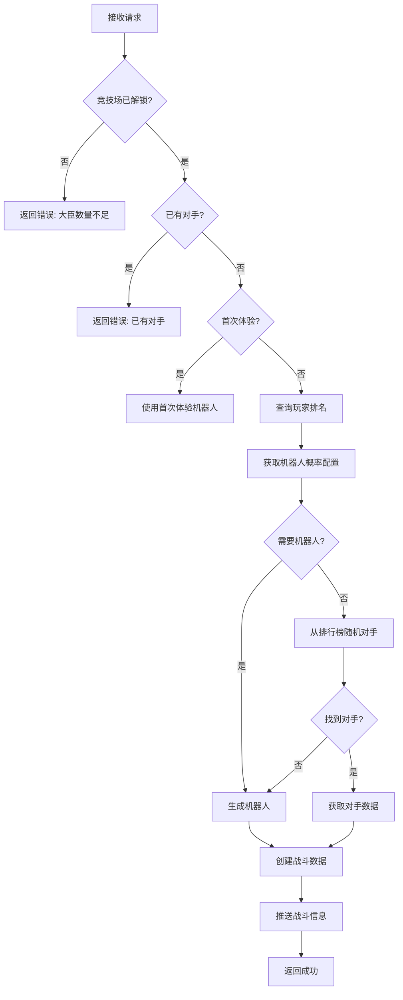
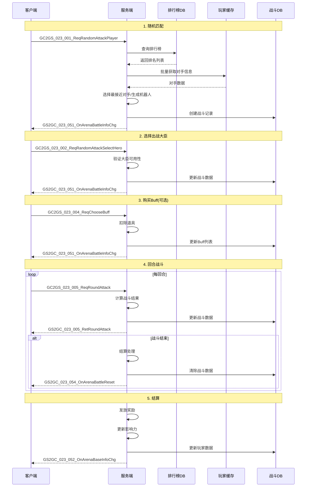
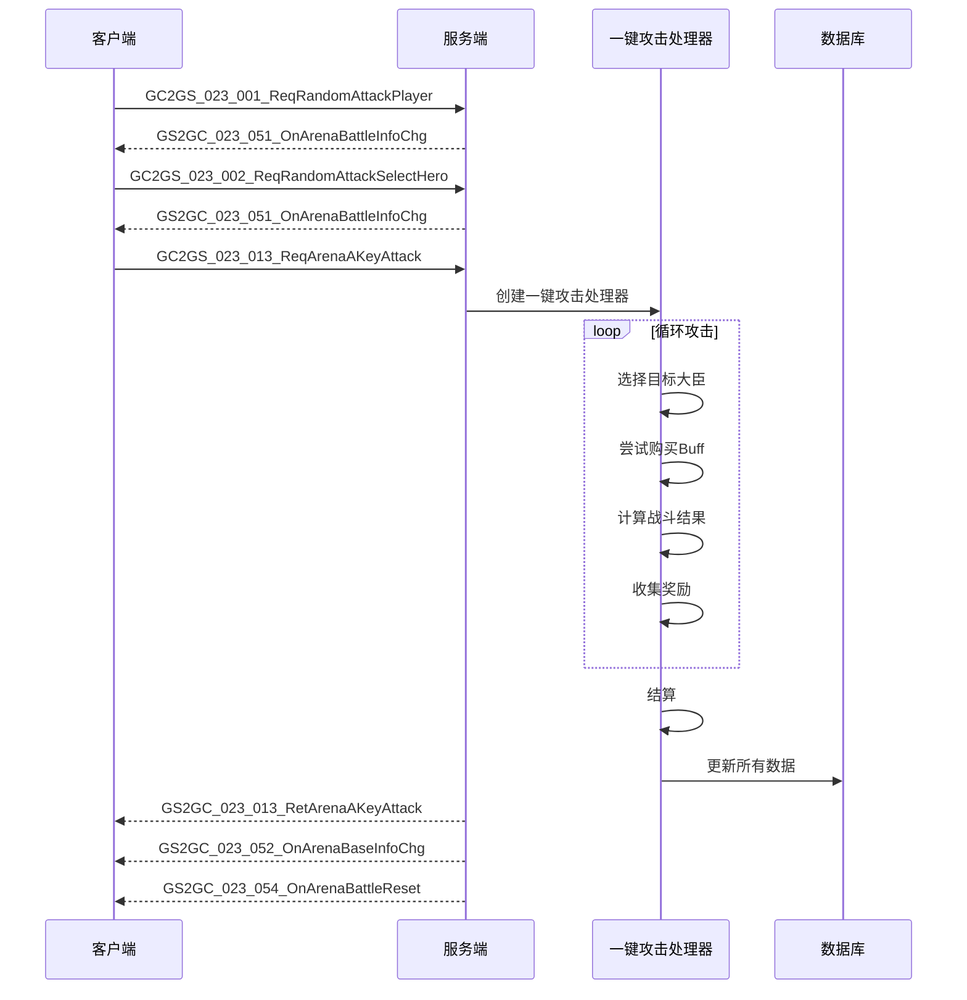
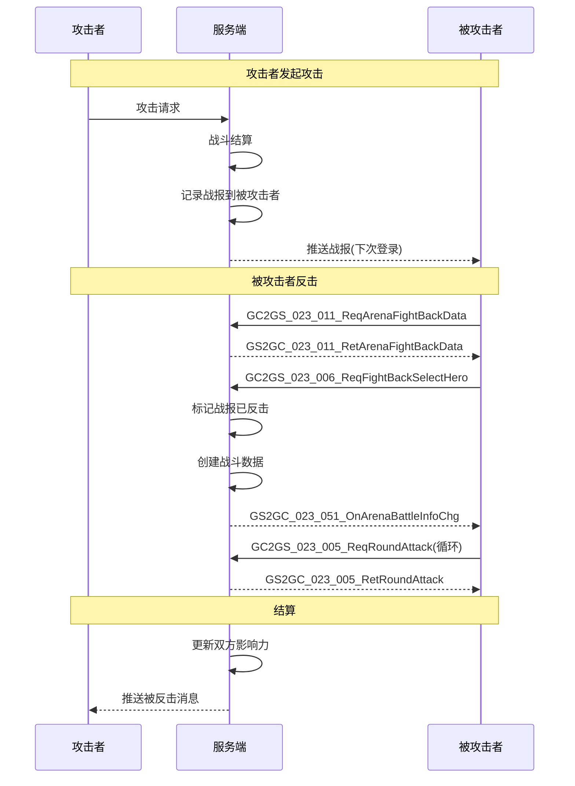
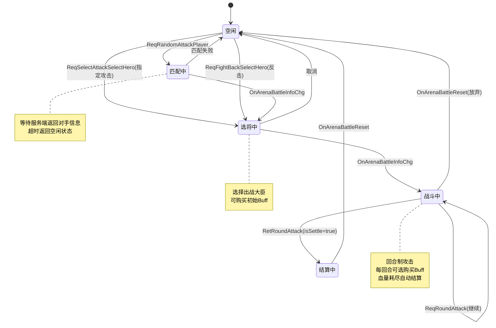
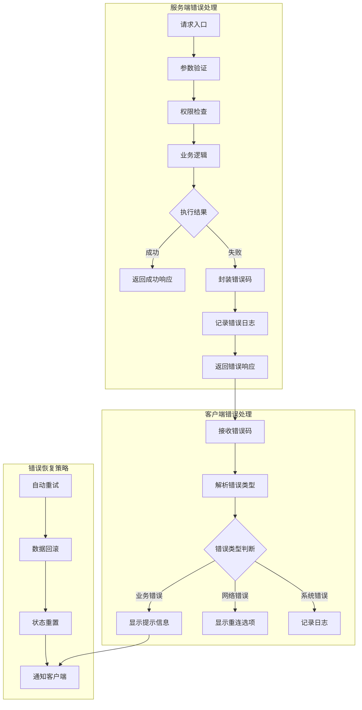
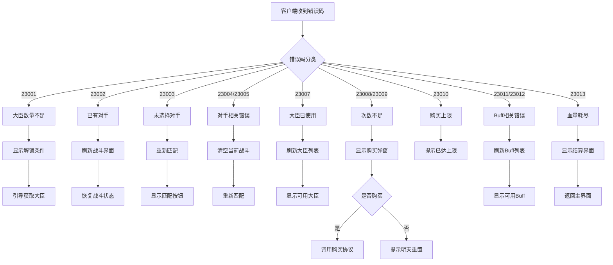
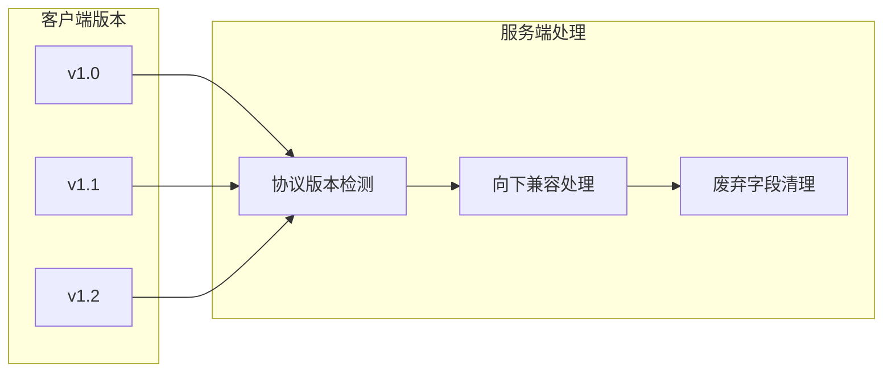
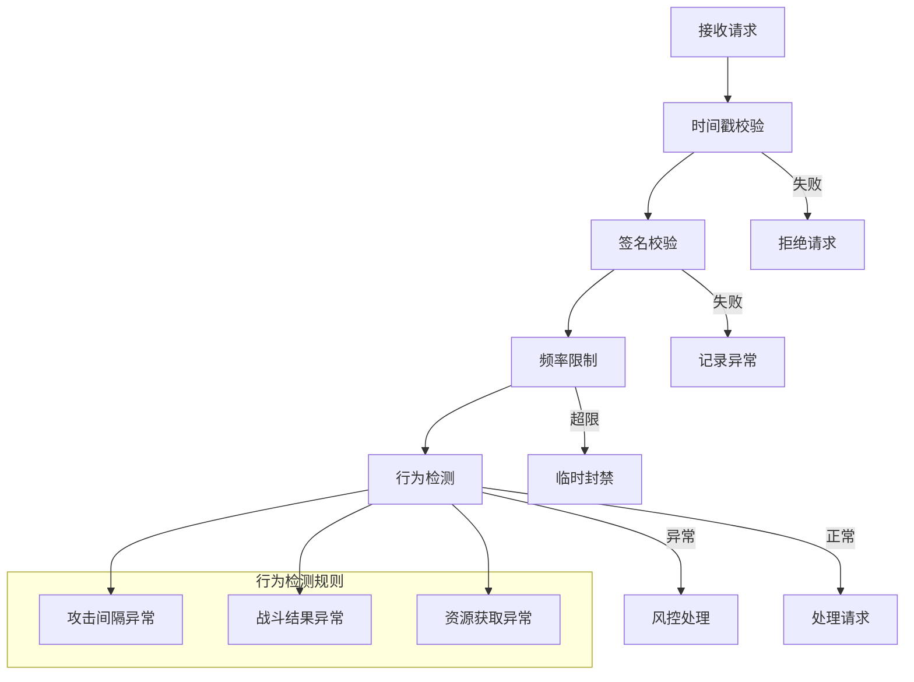

# 竞技场系统 - 协议文档

## 协议编号

模块编号：p023 (ArenaOp)

---

## 协议总览

```mermaid
graph TB
    subgraph 客户端请求 GC2GS
        R001[001_ReqRandomAttackPlayer<br/>随机攻击]
        R002[002_ReqRandomAttackSelectHero<br/>选将]
        R003[003_ReqSelectAttackSelectHero<br/>指定攻击选将]
        R004[004_ReqChooseBuff<br/>选Buff]
        R005[005_ReqRoundAttack<br/>回合攻击]
        R006[006_ReqFightBackSelectHero<br/>反击选将]
        R007[007_ReqCelebrityRank<br/>名人榜]
        R008[008_ReqArenaStationUpgrade<br/>驻守升级]
        R009[009_ReqArenaStationCollect<br/>驻守收集]
        R010[010_ReqArenaBattleReport<br/>战报]
        R011[011_ReqArenaFightBackData<br/>反击数据]
        R012[012_ReqArenaBuyRandomAttack<br/>购买次数]
        R013[013_ReqArenaAKeyAttack<br/>一键攻击]
    end

    subgraph 服务端响应 GS2GC
        S001[001_RetRandomAttackPlayer]
        S002[002_RetRandomAttackSelectHero]
        S003[003_RetSelectAttackSelectHero]
        S004[004_RetChooseBuff]
        S005[005_RetRoundAttack]
        S006[006_RetFightBackSelectHero]
        S007[007_RetCelebrityRank]
        S008[008_RetArenaStationUpgrade]
        S009[009_RetArenaStationCollect]
        S010[010_RetArenaBattleReport]
        S011[011_RetArenaFightBackData]
        S012[012_RetArenaBuyRandomAttack]
        S013[013_RetArenaAKeyAttack]
    end

    subgraph 服务端推送 GS2GC
        P051[051_OnArenaBattleInfoChg<br/>战斗信息变化]
        P052[052_OnArenaBaseInfoChg<br/>基础信息变化]
        P054[054_OnArenaBattleReset<br/>战斗重置]
    end

    R001 --> S001
    R002 --> S002
    R003 --> S003
    R004 --> S004
    R005 --> S005
    R006 --> S006
    R007 --> S007
    R008 --> S008
    R009 --> S009
    R010 --> S010
    R011 --> S011
    R012 --> S012
    R013 --> S013

    S001 -.-> P051
    S002 -.-> P051
    S005 -.-> P051
    S005 -.-> P052
    S005 -.-> P054
```



---

## 客户端请求协议 (GC2GS)

### GC2GS_023_001_ReqRandomAttackPlayer

**说明**：请求随机攻击玩家

**触发场景**：玩家点击"随机匹配"按钮

**请求参数**：无

```protobuf
message GC2GS_023_001_ReqRandomAttackPlayer
{
    // 无参数
}
```

**响应**：GS2GC_023_001_RetRandomAttackPlayer

**服务端处理流程**：



**代码实现**：

```java
public void randomOpponent(_ICallBackT<Result> _callback)
{
    _lock();
    try
    {
        // 1. 检查解锁状态
        if (!hadUnlockArena()) {
            _callback.onRunOver(ArenaErr.HERO_NUM_NOT_ENOUGH_TO_ENTER_ARENA);
            return;
        }

        // 2. 检查是否已有对手
        if (_m_battleInfo != null) {
            _callback.onRunOver(ArenaErr.OPPONENT_HAD_SELECTED);
            return;
        }

        // 3. 异步处理匹配
        SerialPromise promise = new SerialPromise(getUserData().getUserLock());

        // 3.1 检查是否需要机器人
        promise.then(p -> {
            _needRandomRobot((result, pair) -> {
                if (!result.isSucc()) {
                    _callback.onRunOver(result);
                    promise.breakOut();
                    return;
                }
                needRobot.set(pair.first);
                botTemplate.set(pair.second);
                promise.commit();
            });
        });

        // 3.2 从排行榜随机对手
        promise.then(p -> {
            if (needRobot.get()) {
                promise.commit();
                return;
            }
            _randomOpponentFromRank((result, opponentCid) -> {
                if (result.isSucc()) {
                    this.opponentCid.set(opponentCid);
                }
                promise.commit();
            });
        });

        // 3.3 选择对手或生成机器人
        promise.then(p -> {
            if (needRobot.get() || opponentCid.get() == 0) {
                selectRobot(botTemplate.get(), _callback);
            } else {
                selectOpponent(opponentCid.get(), EArenaAttackType.RANDOM, _callback);
            }
        });
    } finally {
        _unlock();
    }
}
```

---

### GC2GS_023_002_ReqRandomAttackSelectHero

**说明**：请求随机攻击选择出战大臣

**触发场景**：玩家选择大臣后点击确认

**请求参数**：

| 字段名 | 类型 | 必填 | 说明 | 示例 |
|-------|------|------|------|------|
| heroId | long | 是 | 大臣ID | 10001 |
| opponentBotName | string | 否 | 机器人对手名称(机器人时填写) | "挑战者" |
| buffId | long | 否 | 选择的Buff ID(0不购买) | 1001 |

```protobuf
message GC2GS_023_002_ReqRandomAttackSelectHero
{
    required int64 heroId = 1;               // 大臣ID
    optional string opponentBotName = 2;     // 机器人名称
    optional int64 buffId = 3 [default = 0]; // Buff ID
}
```

**响应**：GS2GC_023_002_RetRandomAttackSelectHero

**服务端处理**：

```java
public Result selectBattleHero(long _heroId, String _opponentBotName,
    boolean _isRandom, long _itemId, long _buffId, NPPlayerContext _context)
{
    _lock();
    try
    {
        // 1. 检查战斗状态
        if (_m_battleInfo == null)
            return ArenaErr.OPPONENT_NOT_SELECTED;

        // 2. 检查大臣是否可用
        if (_isRandom) {
            if (_m_hadRandomAttackHeroList.getValueList().contains(_heroId))
                return ArenaErr.HERO_HAD_SELECTED;
        } else {
            if (_m_hadSelectAttackHeroList.getValueList().contains(_heroId))
                return ArenaErr.HERO_HAD_SELECTED;
        }

        // 3. 获取大臣数据
        HeroComponent heroComp = getUserData().getHeroComponent();
        HeroInfo heroInfo = heroComp.getHeroInfo(_heroId);
        if (heroInfo == null)
            return HeroErr.HERO_NOT_FOUND;

        // 4. 检查攻击次数
        if (_isRandom) {
            if (_m_bo.getHadRandomAttackNum() >= getFreeAttackLimit())
                return ArenaErr.RANDOM_ATTACK_NUM_OVER_LIMIT;
        } else {
            if (_m_bo.getHadSelectAttackNum() >= getSelectAttackLimit())
                return ArenaErr.SELECT_ATTACK_NUM_OVER_LIMIT;
        }

        // 5. 创建战斗信息
        _m_battleInfo = new ArenaBattleInfo(this);
        _m_battleInfo.selectBattleHero(heroInfo, _opponentBotName, _itemId, _buffId);

        // 6. 更新使用记录
        if (_isRandom) {
            _m_hadRandomAttackHeroList.getValueList().add(_heroId);
            _m_bo.setHadRandomAttackNum(getUSServer().getBM(),
                _m_bo.getHadRandomAttackNum() + 1);
        } else {
            _m_hadSelectAttackHeroList.getValueList().add(_heroId);
            _m_bo.setHadSelectAttackNum(getUSServer().getBM(),
                _m_bo.getHadSelectAttackNum() + 1);
        }

        return Result.SUCC;
    } finally {
        _unlock();
    }
}
```

---

### GC2GS_023_003_ReqSelectAttackSelectHero

**说明**：请求指定攻击选择出战大臣（名人榜/反击）

**触发场景**：从名人榜或反击列表选择对手后确认

**请求参数**：

| 字段名 | 类型 | 必填 | 说明 | 示例 |
|-------|------|------|------|------|
| opponentCid | long | 是 | 对手CID | 12345678 |
| itemId | long | 否 | 攻击道具ID(0不使用) | 1 |
| heroId | long | 是 | 大臣ID | 10001 |
| buffId | long | 否 | 选择的Buff ID | 1001 |

```protobuf
message GC2GS_023_003_ReqSelectAttackSelectHero
{
    required int64 opponentCid = 1;          // 对手CID
    optional int64 itemId = 2 [default = 0]; // 攻击道具ID
    required int64 heroId = 3;               // 大臣ID
    optional int64 buffId = 4 [default = 0]; // Buff ID
}
```

**响应**：GS2GC_023_003_RetSelectAttackSelectHero

---

### GC2GS_023_004_ReqChooseBuff

**说明**：请求选择Buff增益

**触发场景**：回合开始前购买Buff

**请求参数**：

| 字段名 | 类型 | 必填 | 说明 | 示例 |
|-------|------|------|------|------|
| buffId | long | 是 | Buff ID | 1001 |

```protobuf
message GC2GS_023_004_ReqChooseBuff
{
    required int64 buffId = 1;  // Buff ID
}
```

**响应**：GS2GC_023_004_RetChooseBuff

**服务端处理**：

```java
public Result chooseBuff(long _buffId, NPPlayerContext _context)
{
    _lock();
    try
    {
        // 1. 检查战斗状态
        if (_m_battleInfo == null)
            return ArenaErr.OPPONENT_NOT_SELECTED;

        // 2. 检查是否已购买
        if (_m_battleInfo.getBo().getHadBuyBuff())
            return ArenaErr.HAD_BUY_ROUND_BUFF;

        // 3. 获取Buff配置
        RefArenaBuff refBuff = RefArenaBuff.getMgr().get(_buffId);
        if (refBuff == null)
            return CommErr.REF_NOT_FOUND;

        // 4. 检查回合限制
        int round = _m_battleInfo.getRound();
        List<Long> availableBuffList = (round == 0)
            ? RefGeneral.Ref().arena_initial_choose_buff_list
            : RefGeneral.Ref().arena_choose_buff_list;

        if (!availableBuffList.contains(_buffId))
            return ArenaErr.CANT_BUY_ROUND_BUFF;

        // 5. 消耗道具
        if (!getUserData().spendItem(refBuff.cost, _context))
            return CommErr.ITEM_NOT_ENOUGH;

        // 6. 添加Buff
        _m_battleInfo.addBuff(_buffId);

        return Result.SUCC;
    } finally {
        _unlock();
    }
}
```

---

### GC2GS_023_005_ReqRoundAttack

**说明**：请求回合进攻

**触发场景**：玩家选择对手大臣后攻击

**请求参数**：

| 字段名 | 类型 | 必填 | 说明 | 示例 |
|-------|------|------|------|------|
| opponentHeroId | long | 是 | 对手大臣ID | 20001 |

```protobuf
message GC2GS_023_005_ReqRoundAttack
{
    required int64 opponentHeroId = 1;  // 对手大臣ID
}
```

**响应**：GS2GC_023_005_RetRoundAttack

**响应数据结构**：

| 字段名 | 类型 | 说明 |
|-------|------|------|
| roundResult | Arena_RoundResult | 回合结果 |
| battleResult | Arena_BattleResult | 战斗结果 |
| roundReward | Arena_RoundReward | 回合奖励 |

---

### GC2GS_023_006_ReqFightBackSelectHero

**说明**：请求反击选择出战大臣

**触发场景**：从战报复仇列表选择对手

**请求参数**：

| 字段名 | 类型 | 必填 | 说明 | 示例 |
|-------|------|------|------|------|
| dbId | long | 是 | 战报数据库ID | 1001 |
| itemId | long | 否 | 攻击道具ID | 1 |
| heroId | long | 是 | 大臣ID | 10001 |
| buffId | long | 否 | 选择的Buff ID | 1001 |

```protobuf
message GC2GS_023_006_ReqFightBackSelectHero
{
    required int64 dbId = 1;               // 战报ID
    optional int64 itemId = 2 [default = 0]; // 攻击道具ID
    required int64 heroId = 3;             // 大臣ID
    optional int64 buffId = 4 [default = 0]; // Buff ID
}
```

**响应**：GS2GC_023_006_RetFightBackSelectHero

---

### GC2GS_023_007_ReqCelebrityRank

**说明**：请求名人榜排行

**触发场景**：打开名人榜界面

**请求参数**：

| 字段名 | 类型 | 必填 | 说明 | 示例 |
|-------|------|------|------|------|
| dbId | long | 是 | 起始ID(用于分页，0从头开始) | 0 |

```protobuf
message GC2GS_023_007_ReqCelebrityRank
{
    required int64 dbId = 1 [default = 0];  // 起始ID(分页)
}
```

**响应**：GS2GC_023_007_RetCelebrityRank

---

### GC2GS_023_008_ReqArenaStationUpgrade

**说明**：请求竞技场驻守升级

**触发场景**：点击驻守升级按钮

**请求参数**：无

```protobuf
message GC2GS_023_008_ReqArenaStationUpgrade
{
    // 无参数
}
```

**响应**：GS2GC_023_008_RetArenaStationUpgrade

---

### GC2GS_023_009_ReqArenaStationCollect

**说明**：请求竞技场驻守收集

**触发场景**：点击收取驻守奖励

**请求参数**：无

```protobuf
message GC2GS_023_009_ReqArenaStationCollect
{
    // 无参数
}
```

**响应**：GS2GC_023_009_RetArenaStationCollect

---

### GC2GS_023_010_ReqArenaBattleReport

**说明**：请求竞技场战报

**触发场景**：打开战报界面

**请求参数**：无

```protobuf
message GC2GS_023_010_ReqArenaBattleReport
{
    // 无参数
}
```

**响应**：GS2GC_023_010_RetArenaBattleReport

**响应数据结构**：

| 字段名 | 类型 | 说明 |
|-------|------|------|
| reportList | List&lt;Arena_BattleReport&gt; | 战报列表 |

---

### GC2GS_023_011_ReqArenaFightBackData

**说明**：请求竞技场反击数据

**触发场景**：打开反击列表界面

**请求参数**：无

```protobuf
message GC2GS_023_011_ReqArenaFightBackData
{
    // 无参数
}
```

**响应**：GS2GC_023_011_RetArenaFightBackData

**响应数据结构**：

| 字段名 | 类型 | 说明 |
|-------|------|------|
| fightBackList | List&lt;Arena_FightBackInfo&gt; | 反击列表 |

---

### GC2GS_023_012_ReqArenaBuyRandomAttack

**说明**：请求购买随机攻击次数

**触发场景**：攻击次数不足时购买

**请求参数**：

| 字段名 | 类型 | 必填 | 说明 | 示例 |
|-------|------|------|------|------|
| num | int | 是 | 购买数量 | 5 |

```protobuf
message GC2GS_023_012_ReqArenaBuyRandomAttack
{
    required int32 num = 1;  // 购买数量
}
```

**响应**：GS2GC_023_012_RetArenaBuyRandomAttack

**服务端处理**：

```java
public Result buyRandomAttackNum(int _value, NPPlayerContext _context)
{
    _lock();
    try
    {
        // 1. 计算购买上限
        int heroNum = getUserData().getHeroComponent().getHeroNum();
        int maxByHero = heroNum / RefGeneral.Ref().arena_random_attack_crystal_buy_ratio;
        int maxLimit = RefGeneral.Ref().arena_random_attack_crystal_buy_limit;
        int maxBuyNum = Math.min(maxByHero, maxLimit);

        // 2. 检查是否超限
        if (_m_bo.getHadBuyRandomAttackNum() + _value > maxBuyNum)
            return ArenaErr.BUY_RANDOM_ATTACK_NUM_OVER_LIMIT;

        // 3. 计算消耗
        int totalCost = 0;
        int currentBuy = _m_bo.getHadBuyRandomAttackNum();
        for (int i = 0; i < _value; i++) {
            int priceIndex = Math.min(currentBuy + i,
                RefGeneral.Ref().arena_random_attack_crystal_buy_time_price_id.size() - 1);
            totalCost += RefGeneral.Ref().arena_random_attack_crystal_buy_time_price_id.get(priceIndex);
        }

        // 4. 消耗钻石
        NPCommonCostItem cost = new NPCommonCostItem(
            ENPItemType.CURRENCY, ECurrency.DIAMOND, totalCost);
        if (!getUserData().spendItem(cost, _context))
            return CommErr.ITEM_NOT_ENOUGH;

        // 5. 增加次数
        _m_bo.setHadBuyRandomAttackNum(getUSServer().getBM(),
            _m_bo.getHadBuyRandomAttackNum() + _value);

        return Result.SUCC;
    } finally {
        _unlock();
    }
}
```

---

### GC2GS_023_013_ReqArenaAKeyAttack

**说明**：请求一键攻击

**触发场景**：点击一键攻击按钮

**请求参数**：

| 字段名 | 类型 | 必填 | 说明 | 示例 |
|-------|------|------|------|------|
| buffType | EArenaBuffType | 是 | 优先选择的Buff类型 | ATTACK |

```protobuf
message GC2GS_023_013_ReqArenaAKeyAttack
{
    required EArenaBuffType buffType = 1;  // Buff偏好类型
}
```

**响应**：GS2GC_023_013_RetArenaAKeyAttack

---

## 服务端响应/推送协议 (GS2GC)

### GS2GC_023_051_OnArenaBattleInfoChg

**说明**：通知竞技场战斗信息变化

**触发时机**：
- 随机匹配成功
- 选择大臣成功
- 购买Buff成功
- 回合战斗结束

**推送数据**：

| 字段名 | 类型 | 必填 | 说明 |
|-------|------|------|------|
| battleInfo | Arena_BattleInfo | 是 | 战斗信息 |

```protobuf
message GS2GC_023_051_OnArenaBattleInfoChg
{
    required Arena_BattleInfo battleInfo = 1;
}
```

**服务端构造**：

```java
public Arena_BattleInfo makeProto()
{
    Arena_BattleInfo proto = new Arena_BattleInfo();

    // 基础信息
    proto.setOpponentCid(getBo().getOpponentCid());
    proto.setHadDefeatNum(_m_defeatHeroList.getValueList().size());
    proto.setOpponentHeroNum(_m_opponentHeroList.getHeroList().size());
    proto.setOpponentPower(getBo().getOpponentPower());

    // 可攻击英雄列表
    for (Hero_ArenaShowInfo hero : _m_opponentHeroList.getHeroList()) {
        if (_m_canAttackHeroList.getValueList().contains(hero.getHeroId())) {
            proto.addCanAttackHeroList(hero);
        }
    }

    // Buff信息
    proto.setHadBuyBuff(getBo().getHadBuyBuff());
    proto.getBuffList().addAll(_m_buffList.getBuffList());

    // 我方信息
    proto.setHeroId(getBo().getHeroId());
    proto.setDeductedHp(getBo().getDeductedHp());
    proto.setBasePower(getBo().getBasePower());

    // 对手信息
    proto.setIsNpc(getBo().getIsBot());
    proto.setNpcName(getBo().getBotName());

    return proto;
}
```

---

### GS2GC_023_052_OnArenaBaseInfoChg

**说明**：通知竞技场基础信息变化

**触发时机**：
- 攻击次数变化
- 每日重置
- 购买攻击次数

**推送数据**：

| 字段名 | 类型 | 必填 | 说明 |
|-------|------|------|------|
| baseInfo | Arena_BaseInfo | 是 | 基础信息 |

```protobuf
message GS2GC_023_052_OnArenaBaseInfoChg
{
    required Arena_BaseInfo baseInfo = 1;
}
```

**服务端构造**：

```java
public Arena_BaseInfo makeBaseInfo()
{
    Arena_BaseInfo proto = new Arena_BaseInfo();

    proto.setHadSelectAttackNum(_m_bo.getHadSelectAttackNum());
    proto.setHadRandomAttackNum(_m_bo.getHadRandomAttackNum());
    proto.setHadBuyRandomAttackNum(_m_bo.getHadBuyRandomAttackNum());
    proto.setLastResetTimeMs(_m_bo.getLastResetTimeMs());

    proto.getHadSelectAttackHeroList().addAll(_m_hadSelectAttackHeroList.getValueList());
    proto.getHadRandomAttackHeroList().addAll(_m_hadRandomAttackHeroList.getValueList());

    return proto;
}
```

---

### GS2GC_023_054_OnArenaBattleReset

**说明**：通知竞技场战斗重置

**触发时机**：
- 战斗结算完成
- 主动放弃战斗
- 跨天重置清理过期战斗

```protobuf
message GS2GC_023_054_OnArenaBattleReset
{
    // 无参数，客户端清除战斗数据
}
```

---

## 数据结构定义

### Arena_BaseInfo (竞技场基础信息)

```protobuf
message Arena_BaseInfo
{
    required int32 hadSelectAttackNum = 1;      // 已指定攻击次数
    required int32 hadRandomAttackNum = 2;      // 已随机攻击次数
    required int32 hadBuyRandomAttackNum = 3;   // 已购买随机攻击次数
    required int64 lastResetTimeMs = 4;         // 上次重置时间
    repeated int64 hadSelectAttackHeroList = 5; // 已指定攻击大臣ID列表
    repeated int64 hadRandomAttackHeroList = 6; // 已随机攻击大臣ID列表
}
```

| 字段名 | 类型 | 说明 |
|-------|------|------|
| hadSelectAttackNum | int32 | 已使用指定攻击次数 |
| hadRandomAttackNum | int32 | 已使用随机攻击次数 |
| hadBuyRandomAttackNum | int32 | 已购买额外攻击次数 |
| lastResetTimeMs | int64 | 上次重置时间戳(毫秒) |
| hadSelectAttackHeroList | repeated int64 | 今日已用于指定攻击的大臣ID |
| hadRandomAttackHeroList | repeated int64 | 今日已用于随机攻击的大臣ID |

---

### Arena_BattleInfo (竞技场战斗信息)

```protobuf
message Arena_BattleInfo
{
    required int64 opponentCid = 1;                // 对手CID
    required int32 hadDefeatNum = 2;               // 已击败数量
    required int32 opponentHeroNum = 3;            // 对手大臣数量
    required int64 opponentPower = 4;              // 对手战力
    repeated Hero_ArenaShowInfo canAttackHeroList = 5; // 可攻击英雄列表
    required bool hadBuyBuff = 6;                  // 是否已购买Buff
    repeated Arena_SingleBuffInfo buffList = 7;    // Buff列表
    required int64 heroId = 8;                     // 我方大臣ID
    required int64 deductedHp = 9;                 // 已扣除血量
    required int64 basePower = 10;                 // 基础战力
    required bool isNpc = 11;                      // 是否NPC
    optional string npcName = 12;                  // NPC名称
}
```

| 字段名 | 类型 | 说明 |
|-------|------|------|
| opponentCid | int64 | 对手CID(0为机器人) |
| hadDefeatNum | int32 | 已击败对手大臣数量 |
| opponentHeroNum | int32 | 对手大臣总数 |
| opponentPower | int64 | 对手总战力 |
| canAttackHeroList | repeated Hero_ArenaShowInfo | 本回合可选择的攻击目标 |
| hadBuyBuff | bool | 本回合是否已购买Buff |
| buffList | repeated Arena_SingleBuffInfo | 当前生效的Buff列表 |
| heroId | int64 | 我方出战大臣ID |
| deductedHp | int64 | 我方已扣除的血量 |
| basePower | int64 | 我方基础战力 |
| isNpc | bool | 对手是否为NPC/机器人 |
| npcName | string | NPC名称(机器人时有效) |

---

### Arena_RoundResult (回合结果)

```protobuf
message Arena_RoundResult
{
    required int32 round = 1;              // 回合数
    required bool isDefeat = 2;            // 是否击败
    required int32 opponentDeductinfluence = 3; // 对手扣除影响力
    required int32 gainCoin = 4;           // 获得金币
    required int32 gainInfluence = 5;      // 获得影响力
    required int64 myHp = 6;               // 我方剩余血量
    required int64 opponentHp = 7;         // 对手剩余血量
    required int64 myDeductHp = 8;         // 我方本回合扣除血量
}
```

| 字段名 | 类型 | 说明 |
|-------|------|------|
| round | int32 | 当前回合数 |
| isDefeat | bool | 是否成功击败对手大臣 |
| opponentDeductinfluence | int32 | 对手被扣除的影响力 |
| gainCoin | int32 | 本回合获得竞技币 |
| gainInfluence | int32 | 本回合获得影响力 |
| myHp | int64 | 我方当前剩余血量 |
| opponentHp | int64 | 对手大臣当前血量 |
| myDeductHp | int64 | 我方本回合扣除的血量 |

---

### Arena_BattleResult (战斗结果)

```protobuf
message Arena_BattleResult
{
    required int32 hadDefeatNum = 1;           // 已击败数量
    required int32 opponentHeroNum = 2;        // 对手大臣数量
    required int32 opponentDeductinfluence = 3; // 对手扣除影响力
    required int32 gainInfluence = 4;          // 获得影响力
    optional int64 selectAttackItemId = 5;     // 选择攻击道具ID
    required bool isSettle = 6;                // 是否结算
    optional int64 addPower = 7;               // 增加战力
    repeated NPCommonCostItem gainItem = 8;    // 获得道具列表
    required int32 totalRound = 9;             // 总回合数
    optional string buffDetail = 10;           // 增益明细(JSON)
}
```

| 字段名 | 类型 | 说明 |
|-------|------|------|
| hadDefeatNum | int32 | 总共击败大臣数量 |
| opponentHeroNum | int32 | 对手大臣总数 |
| opponentDeductinfluence | int32 | 对手被扣除的总影响力 |
| gainInfluence | int32 | 我方获得的总影响力 |
| selectAttackItemId | int64 | 使用的攻击道具ID |
| isSettle | bool | 是否已结算(用于判断战斗是否结束) |
| addPower | int64 | 战斗增加的战力 |
| gainItem | repeated NPCommonCostItem | 获得的道具列表 |
| totalRound | int32 | 总回合数 |
| buffDetail | string | Buff使用明细(JSON格式) |

---

### Arena_SingleBuffInfo (单个Buff信息)

```protobuf
message Arena_SingleBuffInfo
{
    required int64 buffId = 1;  // Buff ID
    required int32 num = 2;     // 数量(叠加次数)
}
```

| 字段名 | 类型 | 说明 |
|-------|------|------|
| buffId | int64 | Buff配置ID |
| num | int32 | 叠加次数 |

---

### Hero_ArenaShowInfo (竞技场英雄展示信息)

```protobuf
message Hero_ArenaShowInfo
{
    required int64 heroId = 1;  // 英雄ID
    required int64 power = 2;   // 战力
    required int32 level = 3;   // 等级
    optional int32 star = 4;    // 星级
    optional int32 quality = 5; // 品质
}
```

| 字段名 | 类型 | 说明 |
|-------|------|------|
| heroId | int64 | 大臣/英雄ID |
| power | int64 | 当前战力 |
| level | int32 | 等级 |
| star | int32 | 星级(可选) |
| quality | int32 | 品质(可选) |

---

### Arena_BattleReport (战报信息)

```protobuf
message Arena_BattleReport
{
    required int64 dbId = 1;                    // 数据库ID
    required Arena_BattleReportShow showInfo = 2; // 战报展示信息
}
```

---

### Arena_BattleReportShow (战报展示信息)

```protobuf
message Arena_BattleReportShow
{
    required int64 opponentCid = 1;     // 对手CID
    required string opponentName = 2;   // 对手名称
    required int32 defeatHeroNum = 3;   // 击败数量
    required int32 deductinfluence = 4; // 扣除影响力
    required int64 timestamp = 5;       // 时间戳
    optional int32 opponentLevel = 6;   // 对手等级
    optional int64 opponentPower = 7;   // 对手战力
}
```

---

### Arena_FightBackInfo (反击信息)

```protobuf
message Arena_FightBackInfo
{
    required int64 dbId = 1;                    // 数据库ID
    required Arena_BattleReportShow showInfo = 2; // 战报展示信息
    required bool hadFightBack = 3;             // 是否已反击
}
```

---

### Arena_CelebrityRankInfo (名人榜信息)

```protobuf
message Arena_CelebrityRankInfo
{
    required int64 dbId = 1;             // 数据库ID
    required int64 attackerCid = 2;      // 攻击者CID
    required string attackerName = 3;    // 攻击者名称
    required string defenderName = 4;    // 防守者名称
    required int32 defeatHeroNum = 5;    // 击败数量
    required bool isSelectAttack = 6;    // 是否指定攻击
    required int64 timeMs = 7;           // 时间戳
    optional int32 attackerLevel = 8;    // 攻击者等级
    optional int64 attackerPower = 9;    // 攻击者战力
}
```

---

## 协议流程图

### 完整战斗流程



### 一键攻击流程



### 反击流程



---

## 协议状态转换图



---

## 错误码定义

| 错误码 | 错误名称 | 协议 | 说明 |
|-------|---------|------|------|
| 23001 | HERO_NUM_NOT_ENOUGH_TO_ENTER_ARENA | 001 | 大臣数量不足，无法进入竞技场 |
| 23002 | OPPONENT_HAD_SELECTED | 001 | 已有对手，无需重复选择 |
| 23003 | OPPONENT_NOT_SELECTED | 002/004/005 | 尚未选择对手 |
| 23004 | OPPONENT_NOT_FOUND | 001 | 未找到对手 |
| 23005 | OPPONENT_DATA_LOAD_FAIL | 001 | 加载对手数据失败 |
| 23006 | OPPONENT_HERO_NOT_FOUND | 005 | 对手大臣不存在 |
| 23007 | HERO_HAD_SELECTED | 002/003/006 | 该大臣今日已使用 |
| 23008 | SELECT_ATTACK_NUM_OVER_LIMIT | 003 | 指定攻击次数已用完 |
| 23009 | RANDOM_ATTACK_NUM_OVER_LIMIT | 002 | 随机攻击次数已用完 |
| 23010 | BUY_RANDOM_ATTACK_NUM_OVER_LIMIT | 012 | 购买次数已达上限 |
| 23011 | HAD_BUY_ROUND_BUFF | 004 | 本回合已购买Buff |
| 23012 | CANT_BUY_ROUND_BUFF | 004 | 当前回合不可购买此Buff |
| 23013 | HP_EMPTY | 005 | 血量已耗尽 |

---

## 协议版本历史

| 版本 | 日期 | 变更内容 |
|-----|------|---------|
| 1.0.0 | 2024-01-01 | 初始版本 |
| 1.1.0 | 2024-03-01 | 新增一键攻击协议(013) |
| 1.2.0 | 2024-06-01 | 新增驻守系统协议(008/009) |
| 1.3.0 | 2024-09-01 | 新增爬塔系统协议(021-026) |

---

## 错误处理流程详解

### 错误处理架构图



### 错误码详细处理流程



### 服务端错误恢复机制

```java
/**
 * 竞技场错误恢复处理器
 */
public class ArenaErrorRecovery
{
    /**
     * 处理战斗数据异常
     */
    public static void recoverBattleData(NPUSUserData userData)
    {
        ArenaComponent arenaComp = userData.getArenaComponent();
        ArenaBattleInfo battleInfo = arenaComp.getBattleInfo();

        if (battleInfo == null)
            return;

        // 1. 检查战斗是否过期
        long battleCreateTime = battleInfo.getCreateTime();
        long expireTime = RefGeneral.Ref().arena_battle_expire_time_ms;

        if (System.currentTimeMillis() - battleCreateTime > expireTime)
        {
            // 战斗已过期，清理数据
            battleInfo.discard();
            arenaComp.setBattleInfo(null);

            // 记录日志
            MJEventLog.logArenaBattleExpired(userData, battleCreateTime);
            return;
        }

        // 2. 检查战斗数据完整性
        if (!validateBattleData(battleInfo))
        {
            // 数据不完整，尝试修复
            if (!repairBattleData(battleInfo))
            {
                // 修复失败，清理数据
                battleInfo.discard();
                arenaComp.setBattleInfo(null);
            }
        }
    }

    /**
     * 验证战斗数据完整性
     */
    private static boolean validateBattleData(ArenaBattleInfo battleInfo)
    {
        // 检查必要字段
        if (battleInfo.getHeroId() <= 0)
            return false;

        if (battleInfo.getBasePower() <= 0)
            return false;

        if (battleInfo.getOpponentHeroList() == null ||
            battleInfo.getOpponentHeroList().isEmpty())
            return false;

        return true;
    }

    /**
     * 尝试修复战斗数据
     */
    private static boolean repairBattleData(ArenaBattleInfo battleInfo)
    {
        try
        {
            // 尝试重新加载对手数据
            if (battleInfo.getOpponentCid() > 0 && !battleInfo.isBot())
            {
                // 真实玩家，从缓存重新加载
                // ... 加载逻辑
                return true;
            }
            else if (battleInfo.isBot())
            {
                // 机器人，重新生成
                // ... 生成逻辑
                return true;
            }
            return false;
        }
        catch (Exception e)
        {
            MJLog.error("repairBattleData failed", e);
            return false;
        }
    }
}
```

---

## 协议兼容性管理

### 版本兼容策略



### 协议版本对照表

| 协议版本 | 客户端版本 | 新增协议 | 废弃协议 | 兼容处理 |
|---------|-----------|----------|----------|----------|
| 1.0.0 | v1.0 | 基础协议 | - | - |
| 1.1.0 | v1.1 | 013_一键攻击 | - | 旧版本引导升级 |
| 1.2.0 | v1.2 | 008/009_驻守 | - | 旧版本隐藏入口 |
| 1.3.0 | v1.3 | 021-026_爬塔 | - | 旧版本隐藏入口 |

### 字段兼容处理示例

```protobuf
// 协议字段版本兼容示例
message Arena_BattleInfo
{
    // v1.0 基础字段
    required int64 opponentCid = 1;
    required int32 hadDefeatNum = 2;

    // v1.1 新增字段 (使用optional保持兼容)
    optional int64 selectAttackItemId = 5 [default = 0];

    // v1.2 新增字段
    optional int32 stationLevel = 11 [default = 1];

    // v1.3 新增爬塔字段
    optional int32 towerLevel = 12 [default = 0];

    // 废弃字段 (保留字段号，不再使用)
    // reserved 6, 7;
}
```

### 服务端版本适配代码

```java
/**
 * 协议版本适配器
 */
public class ArenaProtocolAdapter
{
    /**
     * 根据客户端版本适配响应
     */
    public static void adaptResponse(GS2GC_023_051_OnArenaBattleInfoChg response,
                                      int clientVersion)
    {
        // v1.0 客户端不识别 stationLevel 字段
        if (clientVersion < 10200)
        {
            response.clearStationLevel();
        }

        // v1.1 之前客户端不识别一键攻击结果
        if (clientVersion < 10100)
        {
            // 隐藏一键攻击相关字段
            response.clearAKeyAttackResult();
        }
    }

    /**
     * 检查协议是否支持
     */
    public static boolean isProtocolSupported(int protocolId, int clientVersion)
    {
        switch (protocolId)
        {
            case 013: // 一键攻击
                return clientVersion >= 10100;

            case 008: // 驻守升级
            case 009: // 驻守收集
                return clientVersion >= 10200;

            case 021: // 爬塔相关
            case 022:
            case 023:
            case 024:
            case 025:
            case 026:
                return clientVersion >= 10300;

            default:
                return true;
        }
    }
}
```

---

## 协议安全校验

### 请求参数校验规则

```java
/**
 * 协议参数校验器
 */
public class ArenaProtocolValidator
{
    /**
     * 校验选择大臣请求
     */
    public static Result validateSelectHero(GC2GS_023_002_ReqRandomAttackSelectHero req,
                                             NPUSUserData userData)
    {
        // 1. 大臣ID校验
        if (req.getHeroId() <= 0)
            return Result.fail(CommErr.PARAM_ERROR, "大臣ID无效");

        // 2. 大臣存在性校验
        HeroInfo heroInfo = userData.getHeroComponent().getHeroInfo(req.getHeroId());
        if (heroInfo == null)
            return Result.fail(HeroErr.HERO_NOT_FOUND);

        // 3. Buff ID校验 (如果指定了Buff)
        if (req.getBuffId() > 0)
        {
            RefArenaBuff refBuff = RefArenaBuff.getMgr().get(req.getBuffId());
            if (refBuff == null)
                return Result.fail(CommErr.REF_NOT_FOUND, "Buff配置不存在");

            // 检查Buff是否在首回合可用
            List<Long> initialBuffList = RefGeneral.Ref().arena_initial_choose_buff_list;
            if (!initialBuffList.contains(req.getBuffId()))
                return Result.fail(ArenaErr.CANT_BUY_ROUND_BUFF);
        }

        // 4. 机器人名称校验
        if (req.getOpponentBotName() != null && req.getOpponentBotName().length() > 50)
            return Result.fail(CommErr.PARAM_ERROR, "机器人名称过长");

        return Result.SUCC;
    }

    /**
     * 校验回合攻击请求
     */
    public static Result validateRoundAttack(GC2GS_023_005_ReqRoundAttack req,
                                              ArenaBattleInfo battleInfo)
    {
        // 1. 对手大臣ID校验
        if (req.getOpponentHeroId() <= 0)
            return Result.fail(CommErr.PARAM_ERROR, "对手大臣ID无效");

        // 2. 目标是否在可攻击列表中
        List<Long> canAttackList = battleInfo.getCanAttackHeroList();
        if (!canAttackList.contains(req.getOpponentHeroId()))
            return Result.fail(ArenaErr.OPPONENT_HERO_NOT_FOUND);

        // 3. 血量检查
        if (battleInfo.curHp() <= 0)
            return Result.fail(ArenaErr.HP_EMPTY);

        return Result.SUCC;
    }
}
```

### 防作弊校验



```java
/**
 * 防作弊检测器
 */
public class ArenaAntiCheat
{
    // 攻击最小间隔(毫秒)
    private static final long MIN_ATTACK_INTERVAL = 500;

    // 单场战斗最大回合数
    private static final int MAX_ROUNDS = 100;

    /**
     * 检测攻击频率
     */
    public static boolean checkAttackFrequency(NPUSUserData userData)
    {
        ArenaComponent arenaComp = userData.getArenaComponent();
        ArenaBattleInfo battleInfo = arenaComp.getBattleInfo();

        if (battleInfo == null)
            return true;

        // 检查攻击间隔
        long lastAttackTime = battleInfo.getLastAttackTime();
        long now = System.currentTimeMillis();

        if (now - lastAttackTime < MIN_ATTACK_INTERVAL)
        {
            MJLog.warn("Attack too frequent", userData.getCid(),
                       "interval", now - lastAttackTime);
            return false;
        }

        return true;
    }

    /**
     * 检测战斗结果合理性
     */
    public static boolean checkBattleResult(int defeatNum, int totalRounds,
                                             long totalPower, long opponentPower)
    {
        // 回合数不能超过上限
        if (totalRounds > MAX_ROUNDS)
            return false;

        // 击败数不能超过对手大臣总数
        int maxDefeat = RefGeneral.Ref().arena_bot_hero_list.size();
        if (defeatNum > maxDefeat)
            return false;

        // 战力差距合理性检测 (简化版)
        double powerRatio = (double) totalPower / opponentPower;
        if (defeatNum > 0 && powerRatio < 0.1)
        {
            // 战力差距过大但击败了很多，可能有问题
            MJLog.warn("Suspicious battle result", "defeatNum", defeatNum,
                       "powerRatio", powerRatio);
        }

        return true;
    }
}
```

---

## 协议测试用例

### 单元测试示例

```java
/**
 * 竞技场协议测试类
 */
public class ArenaProtocolTest
{
    @Test
    public void testRandomAttack_Success()
    {
        // 准备数据
        NPUSUserData userData = createTestUser();
        userData.getHeroComponent().addHero(createTestHero(10001));
        userData.getHeroComponent().addHero(createTestHero(10002));
        userData.getHeroComponent().addHero(createTestHero(10003));

        // 发送请求
        GC2GS_023_001_ReqRandomAttackPlayer req = new GC2GS_023_001_ReqRandomAttackPlayer();
        GS2GC_023_001_RetRandomAttackPlayer resp = sendRequest(req, userData);

        // 验证结果
        assertTrue(resp.getResult().isSucc());
        assertNotNull(resp.getBattleInfo());
        assertTrue(resp.getBattleInfo().getOpponentHeroNum() > 0);
    }

    @Test
    public void testRandomAttack_HeroNotEnough()
    {
        // 准备数据 (大臣数量不足)
        NPUSUserData userData = createTestUser();
        userData.getHeroComponent().addHero(createTestHero(10001)); // 只有1个

        // 发送请求
        GC2GS_023_001_ReqRandomAttackPlayer req = new GC2GS_023_001_ReqRandomAttackPlayer();
        GS2GC_023_001_RetRandomAttackPlayer resp = sendRequest(req, userData);

        // 验证结果
        assertEquals(ArenaErr.HERO_NUM_NOT_ENOUGH_TO_ENTER_ARENA.getCode(),
                     resp.getResult().getCode());
    }

    @Test
    public void testRoundAttack_Success()
    {
        // 准备战斗数据
        NPUSUserData userData = createTestUserWithBattle();
        ArenaBattleInfo battleInfo = userData.getArenaComponent().getBattleInfo();
        long targetHeroId = battleInfo.getCanAttackHeroList().get(0);

        // 发送攻击请求
        GC2GS_023_005_ReqRoundAttack req = new GC2GS_023_005_ReqRoundAttack(targetHeroId);
        GS2GC_023_005_RetRoundAttack resp = sendRequest(req, userData);

        // 验证结果
        assertTrue(resp.getResult().isSucc());
        assertNotNull(resp.getRoundResult());
    }

    @Test
    public void testBuyAttackNum_Success()
    {
        NPUSUserData userData = createTestUser();
        userData.addDiamond(1000);

        // 发送购买请求
        GC2GS_023_012_ReqArenaBuyRandomAttack req = new GC2GS_023_012_ReqArenaBuyRandomAttack(5);
        GS2GC_023_012_RetArenaBuyRandomAttack resp = sendRequest(req, userData);

        // 验证结果
        assertTrue(resp.getResult().isSucc());
        assertEquals(5, userData.getArenaComponent().getBo().getHadBuyRandomAttackNum());
    }

    @Test
    public void testProtocolVersionCompatibility()
    {
        // 测试不同版本客户端
        int[] clientVersions = {10000, 10100, 10200, 10300};

        for (int version : clientVersions)
        {
            GS2GC_023_051_OnArenaBattleInfoChg resp = createTestBattleInfo();

            // 适配响应
            ArenaProtocolAdapter.adaptResponse(resp, version);

            // 验证字段可见性
            if (version < 10200)
            {
                assertFalse(resp.hasStationLevel());
            }
            if (version >= 10100)
            {
                assertTrue(resp.hasAKeyAttackResult() || true); // 可能没有该字段
            }
        }
    }
}
```

### 压力测试场景

```java
/**
 * 竞技场压力测试
 */
public class ArenaStressTest
{
    /**
     * 模拟1000并发随机匹配
     */
    @Test
    public void stressTestRandomMatch()
    {
        int concurrentUsers = 1000;
        CountDownLatch latch = new CountDownLatch(concurrentUsers);
        AtomicInteger successCount = new AtomicInteger(0);
        AtomicInteger failCount = new AtomicInteger(0);

        for (int i = 0; i < concurrentUsers; i++)
        {
            final int userId = i;
            executor.submit(() -> {
                try
                {
                    NPUSUserData userData = createTestUser(userId);
                    GC2GS_023_001_ReqRandomAttackPlayer req =
                        new GC2GS_023_001_ReqRandomAttackPlayer();

                    long startTime = System.currentTimeMillis();
                    GS2GC_023_001_RetRandomAttackPlayer resp = sendRequest(req, userData);
                    long latency = System.currentTimeMillis() - startTime;

                    if (resp.getResult().isSucc() && latency < 2000)
                    {
                        successCount.incrementAndGet();
                    }
                    else
                    {
                        failCount.incrementAndGet();
                    }
                }
                finally
                {
                    latch.countDown();
                }
            });
        }

        latch.await(30, TimeUnit.SECONDS);

        System.out.println("Success: " + successCount.get());
        System.out.println("Fail: " + failCount.get());
        System.out.println("Success rate: " +
            (successCount.get() * 100.0 / concurrentUsers) + "%");
    }
}
```

---

## 协议调试工具

### 日志记录格式

```java
/**
 * 协议日志记录器
 */
public class ArenaProtocolLogger
{
    private static final Logger logger = LoggerFactory.getLogger("ArenaProtocol");

    /**
     * 记录请求日志
     */
    public static void logRequest(NPUSUserData userData, Object request)
    {
        JSONObject logData = new JSONObject();
        logData.put("type", "request");
        logData.put("cid", userData.getCid());
        logData.put("protocol", request.getClass().getSimpleName());
        logData.put("data", JSON.toJSONString(request));
        logData.put("timestamp", System.currentTimeMillis());

        logger.info(logData.toJSONString());
    }

    /**
     * 记录响应日志
     */
    public static void logResponse(NPUSUserData userData, Object response, long costMs)
    {
        JSONObject logData = new JSONObject();
        logData.put("type", "response");
        logData.put("cid", userData.getCid());
        logData.put("protocol", response.getClass().getSimpleName());
        logData.put("cost_ms", costMs);

        if (response instanceof GS2GC_023_001_RetRandomAttackPlayer)
        {
            GS2GC_023_001_RetRandomAttackPlayer resp =
                (GS2GC_023_001_RetRandomAttackPlayer) response;
            logData.put("result_code", resp.getResult().getCode());
            logData.put("is_bot", resp.getBattleInfo().getIsNpc());
        }

        logger.info(logData.toJSONString());
    }
}
```

### GM命令调试

```java
/**
 * 竞技场GM命令
 */
public class ArenaGMCommand
{
    /**
     * 重置竞技场数据
     * 用法: /arena reset
     */
    @GMCommand("arena reset")
    public static String resetArena(NPUSUserData userData, String[] args)
    {
        ArenaComponent arenaComp = userData.getArenaComponent();
        arenaComp.resetDailyData();
        return "Arena data reset successfully";
    }

    /**
     * 添加攻击次数
     * 用法: /arena addattack 10
     */
    @GMCommand("arena addattack")
    public static String addAttackCount(NPUSUserData userData, String[] args)
    {
        if (args.length < 1)
            return "Usage: /arena addattack <count>";

        int count = Integer.parseInt(args[0]);
        ArenaComponent arenaComp = userData.getArenaComponent();
        arenaComp.getBo().setHadBuyRandomAttackNum(
            arenaComp.getBo().getHadBuyRandomAttackNum() + count);

        return "Added " + count + " attack count";
    }

    /**
     * 指定机器人模板
     * 用法: /arena bot 1
     */
    @GMCommand("arena bot")
    public static String setBotTemplate(NPUSUserData userData, String[] args)
    {
        if (args.length < 1)
            return "Usage: /arena bot <template_id>";

        long templateId = Long.parseLong(args[0]);
        RefArenaBotTemplate template = RefArenaBotTemplate.getMgr().get(templateId);

        if (template == null)
            return "Template not found: " + templateId;

        // 设置下次匹配使用指定模板
        userData.getArenaComponent().setDebugBotTemplate(templateId);
        return "Bot template set to: " + templateId;
    }

    /**
     * 查看竞技场状态
     * 用法: /arena status
     */
    @GMCommand("arena status")
    public static String getArenaStatus(NPUSUserData userData, String[] args)
    {
        ArenaComponent arenaComp = userData.getArenaComponent();
        StringBuilder sb = new StringBuilder();

        sb.append("=== Arena Status ===\n");
        sb.append("Unlocked: ").append(arenaComp.hadUnlockArena()).append("\n");
        sb.append("Random Attack Used: ").append(arenaComp.getBo().getHadRandomAttackNum()).append("\n");
        sb.append("Select Attack Used: ").append(arenaComp.getBo().getHadSelectAttackNum()).append("\n");
        sb.append("Buy Attack Count: ").append(arenaComp.getBo().getHadBuyRandomAttackNum()).append("\n");

        if (arenaComp.getBattleInfo() != null)
        {
            ArenaBattleInfo battleInfo = arenaComp.getBattleInfo();
            sb.append("\n=== Current Battle ===\n");
            sb.append("Round: ").append(battleInfo.getRound()).append("\n");
            sb.append("Hero ID: ").append(battleInfo.getHeroId()).append("\n");
            sb.append("HP: ").append(battleInfo.curHp()).append("/").append(battleInfo.getBasePower()).append("\n");
            sb.append("Defeated: ").append(battleInfo.getHadDefeatNum()).append("\n");
            sb.append("Is Bot: ").append(battleInfo.isBot()).append("\n");
        }

        return sb.toString();
    }
}
```

---

## 协议性能优化建议

### 消息压缩

```java
/**
 * 协议压缩处理器
 */
public class ArenaProtocolCompressor
{
    // 压缩阈值(字节)
    private static final int COMPRESS_THRESHOLD = 1024;

    /**
     * 压缩大消息
     */
    public static byte[] compressIfNeeded(byte[] data)
    {
        if (data.length < COMPRESS_THRESHOLD)
            return data;

        try
        {
            ByteArrayOutputStream baos = new ByteArrayOutputStream();
            GZIPOutputStream gzip = new GZIPOutputStream(baos);
            gzip.write(data);
            gzip.close();

            byte[] compressed = baos.toByteArray();

            // 只有压缩后变小才使用
            if (compressed.length < data.length * 0.8)
            {
                return compressed;
            }
            return data;
        }
        catch (Exception e)
        {
            return data;
        }
    }
}
```

### 批量消息合并

```java
/**
 * 消息合并发送器
 */
public class ArenaMessageBatcher
{
    private List<ISendable> pendingMessages = new ArrayList<>();
    private long lastSendTime = 0;
    private static final long BATCH_INTERVAL_MS = 50;

    /**
     * 添加消息到批量队列
     */
    public void addMessage(ISendable message)
    {
        pendingMessages.add(message);

        // 检查是否需要立即发送
        long now = System.currentTimeMillis();
        if (now - lastSendTime >= BATCH_INTERVAL_MS || pendingMessages.size() >= 10)
        {
            flush();
        }
    }

    /**
     * 立即发送所有消息
     */
    public void flush()
    {
        if (pendingMessages.isEmpty())
            return;

        // 合并消息发送
        sendBatch(pendingMessages);
        pendingMessages.clear();
        lastSendTime = System.currentTimeMillis();
    }
}
```

---

*文档生成时间: 2026-04-11*
