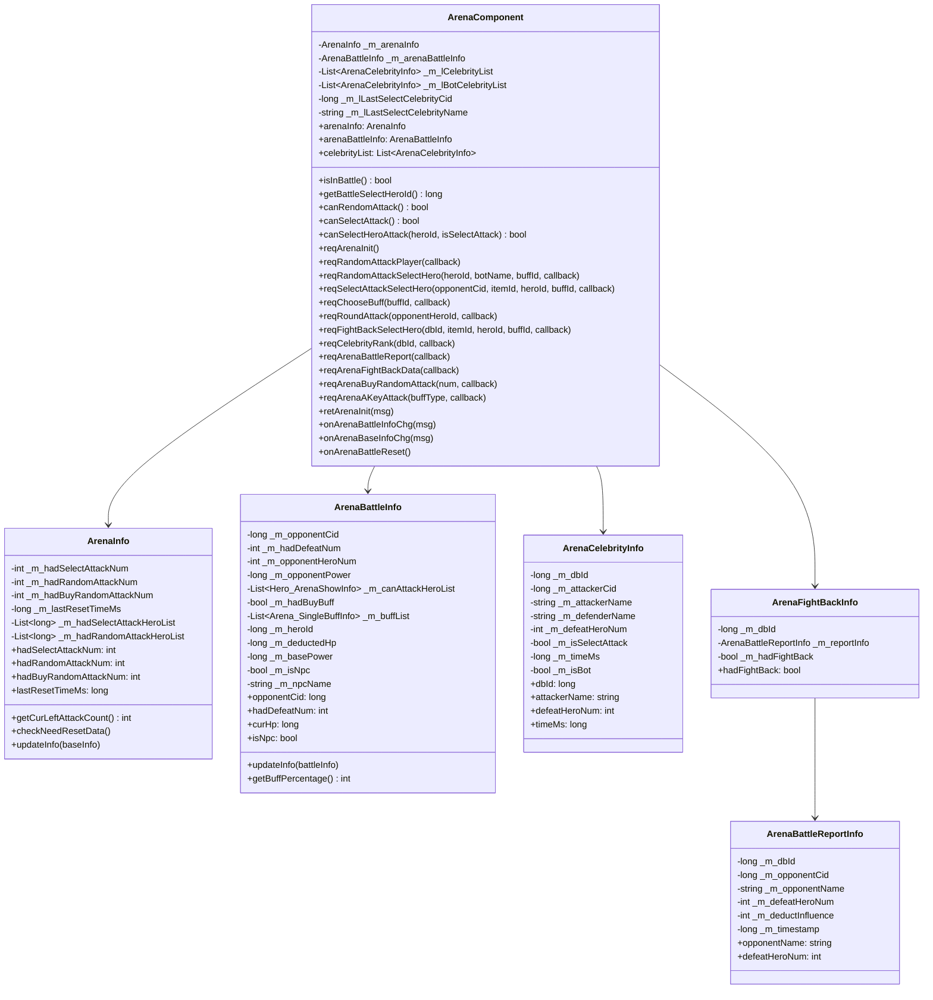
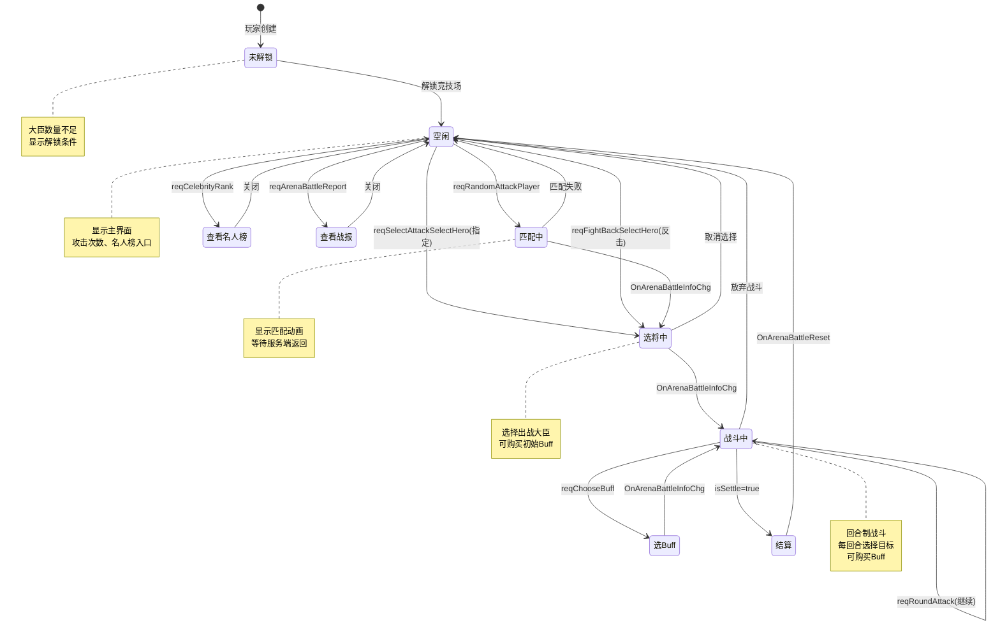
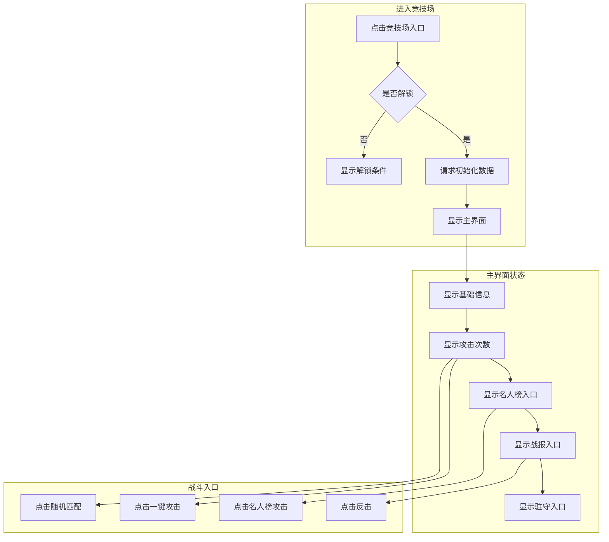
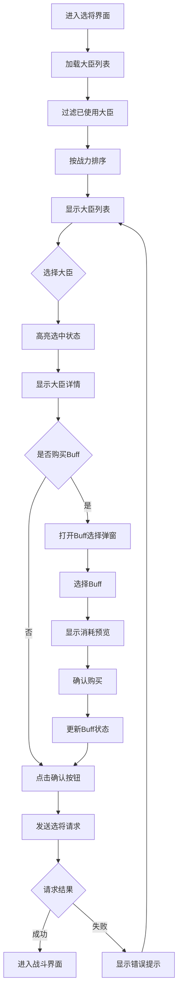
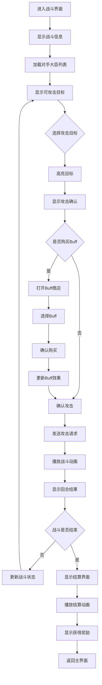
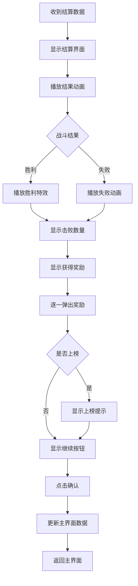
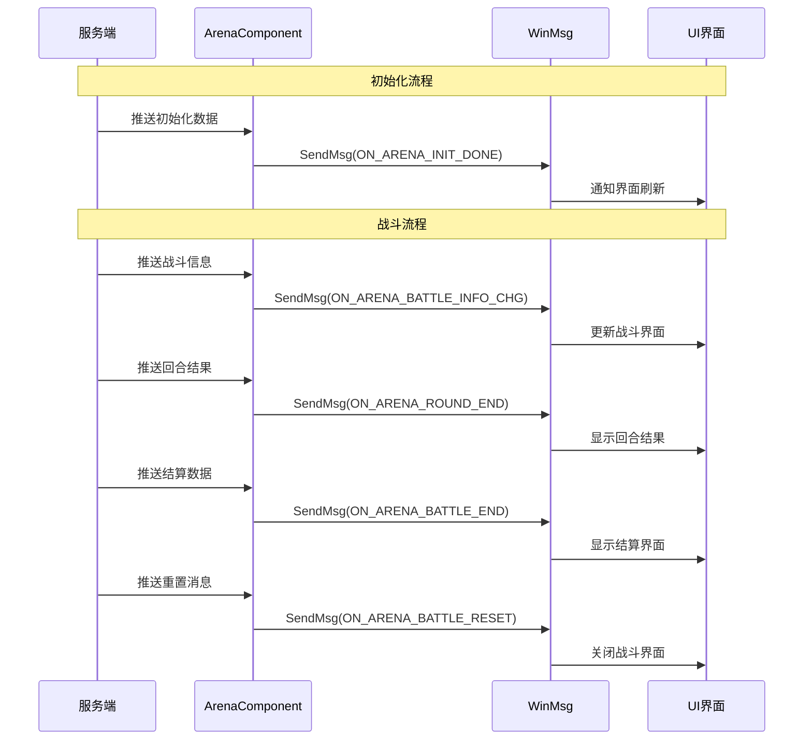
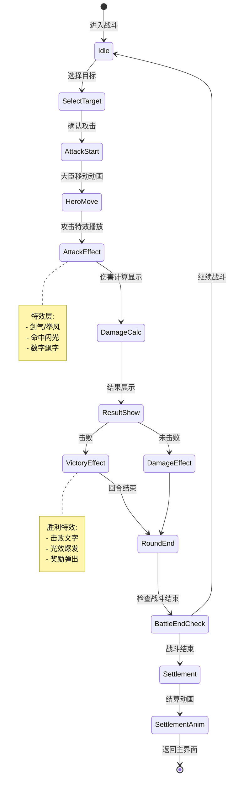

# 竞技场系统 - 客户端开发

## 组件结构

```
game_client/Assets/Scripts/LogicScripts/GameComponent/Arena/
├── ArenaComponent.cs            # 竞技场组件主类
├── Info/
│   ├── ArenaInfo.cs             # 竞技场基础信息
│   ├── ArenaBattleInfo.cs       # 战斗信息
│   ├── ArenaBattleReportInfo.cs # 战报信息
│   ├── ArenaCelebrityInfo.cs    # 名人榜信息
│   └── ArenaFightBackInfo.cs    # 反击信息
├── UI/
│   ├── ArenaMainWindow.cs       # 竞技场主界面
│   ├── ArenaSelectHeroWindow.cs # 选将界面
│   ├── ArenaBattleWindow.cs     # 战斗界面
│   ├── ArenaBuffWindow.cs       # Buff选择界面
│   ├── ArenaCelebrityWindow.cs  # 名人榜界面
│   ├── ArenaReportWindow.cs     # 战报界面
│   └── ArenaFightBackWindow.cs  # 反击界面
└── Enum/
    └── EArenaState.cs           # 竞技场状态枚举
```

---

## 类图



---

## ArenaComponent 核心实现

### 类定义

```csharp
namespace GOE
{
    /// <summary>
    /// 竞技场组件 - 管理竞技场所有数据和交互
    /// </summary>
    public class ArenaComponent : _ANPBasicPlayerComponent
    {
        #region 私有字段

        // 竞技场基础信息
        private ArenaInfo _m_arenaInfo;

        // 竞技场战斗信息
        private ArenaBattleInfo _m_arenaBattleInfo;

        // 名人榜信息列表
        private List<ArenaCelebrityInfo> _m_lCelebrityList;

        // 名人榜机器人信息列表（引导用）
        private List<ArenaCelebrityInfo> _m_lBotCelebrityList;

        // 上次选择谈判的名人榜玩家CID
        private long _m_lLastSelectCelebrityCid;

        // 上次选择谈判的名人榜玩家名字
        private string _m_lLastSelectCelebrityName;

        #endregion

        #region 属性

        public override bool isMustInit { get { return true; } }
        public override ENPPlayerCompType compType { get { return ENPPlayerCompType.ARENA; } }
        public override bool canPreInit { get { return true; } }

        /// <summary>竞技场基础信息</summary>
        public ArenaInfo arenaInfo { get { return _m_arenaInfo; } }

        /// <summary>竞技场战斗信息</summary>
        public ArenaBattleInfo arenaBattleInfo { get { return _m_arenaBattleInfo; } }

        /// <summary>名人榜信息列表</summary>
        public List<ArenaCelebrityInfo> celebrityList { get { return _m_lCelebrityList; } }

        /// <summary>上次选择谈判的名人榜玩家CID</summary>
        public long lastSelectCelebrityCid
        {
            get { return _m_lLastSelectCelebrityCid; }
            set { _m_lLastSelectCelebrityCid = value; }
        }

        /// <summary>上次选择谈判的名人榜玩家名字</summary>
        public string lastSelectCelebrityName
        {
            get { return _m_lLastSelectCelebrityName; }
            set { _m_lLastSelectCelebrityName = value; }
        }

        #endregion

        #region 生命周期

        protected override void _onInitDone()
        {
            // 监听跨天事件
            WinMsg.RegisterMsgAct(WinMsgType.ON_CROSS_DAY, _onCrossDay);
        }

        public override void release()
        {
            WinMsg.UnregisterMsgAct(WinMsgType.ON_CROSS_DAY, _onCrossDay);
            base.release();
        }

        #endregion
    }
}
```

---

## 核心属性与方法

### 战斗状态检查

```csharp
/// <summary>
/// 是否正在战斗中
/// </summary>
public bool isInBattle()
{
    return _m_arenaBattleInfo != null &&
           (_m_arenaBattleInfo.opponentCid > 0 ||
            (_m_arenaBattleInfo.opponentCid <= 0 && _m_arenaBattleInfo.isNpc));
}

/// <summary>
/// 获取战斗中选择的伙伴id
/// </summary>
public long getBattleSelectHeroId()
{
    if (!isInBattle())
        return 0;
    return _m_arenaBattleInfo.heroId;
}

/// <summary>
/// 获取当前剩余血量百分比
/// </summary>
public float getCurHpPercent()
{
    if (_m_arenaBattleInfo == null || _m_arenaBattleInfo.basePower <= 0)
        return 0f;
    return (float)(_m_arenaBattleInfo.basePower - _m_arenaBattleInfo.deductedHp) /
           _m_arenaBattleInfo.basePower;
}

/// <summary>
/// 获取当前剩余血量
/// </summary>
public long getCurHp()
{
    if (_m_arenaBattleInfo == null)
        return 0;
    return Math.Max(0, _m_arenaBattleInfo.basePower - _m_arenaBattleInfo.deductedHp);
}
```

### 攻击次数检查

```csharp
/// <summary>
/// 是否可以随机战斗
/// </summary>
public bool canRendomAttack()
{
    return _m_arenaInfo != null && _m_arenaInfo.getCurLeftAttackCount() > 0;
}

/// <summary>
/// 是否可以指定战斗
/// </summary>
public bool canSelectAttack()
{
    return _m_arenaInfo != null &&
           _m_arenaInfo.hadSelectAttackNum < GRefdataCoreMgr.instance.npGeneral.arena_select_attack_daily_limit;
}

/// <summary>
/// 获取剩余随机攻击次数
/// </summary>
public int getLeftRandomAttackCount()
{
    if (_m_arenaInfo == null)
        return 0;

    int freeLimit = GRefdataCoreMgr.instance.npGeneral.arena_random_attack_free_limit;
    return Math.Max(0, freeLimit - _m_arenaInfo.hadRandomAttackNum + _m_arenaInfo.hadBuyRandomAttackNum);
}

/// <summary>
/// 获取剩余指定攻击次数
/// </summary>
public int getLeftSelectAttackCount()
{
    if (_m_arenaInfo == null)
        return 0;

    int dailyLimit = GRefdataCoreMgr.instance.npGeneral.arena_select_attack_daily_limit;
    return Math.Max(0, dailyLimit - _m_arenaInfo.hadSelectAttackNum);
}

/// <summary>
/// 选中的伙伴是否可以派遣进行战斗
/// </summary>
public bool canSelectHeroAttack(long _heroId, bool _isSelectAttack)
{
    if (_m_arenaInfo == null)
        return false;

    if (_isSelectAttack)
        return !_m_arenaInfo.hadSelectAttackHeroList.Contains(_heroId);
    else
        return !_m_arenaInfo.hadRandomAttackHeroList.Contains(_heroId);
}

/// <summary>
/// 获取今日已使用的伙伴列表
/// </summary>
public List<long> getUsedHeroList(bool isSelectAttack)
{
    if (_m_arenaInfo == null)
        return new List<long>();

    return isSelectAttack
        ? _m_arenaInfo.hadSelectAttackHeroList
        : _m_arenaInfo.hadRandomAttackHeroList;
}
```

---

## 网络请求方法

### 初始化

```csharp
/// <summary>
/// 发送初始化协议提前申请内容
/// </summary>
public override void presendInitProtocol()
{
    reqArenaInit();
}

/// <summary>
/// 请求竞技场初始化
/// </summary>
public void reqArenaInit()
{
    NPGSClientListener.sendMsgByLog(GSWriter_002_InitOp.make_025_ReqArenaInit());
}
```

### 随机攻击

```csharp
/// <summary>
/// 请求随机攻击
/// </summary>
/// <param name="_callback">回调</param>
public void reqRandomAttackPlayer(Action<bool> _callback = null)
{
    NPGSClientListener.sendRequestByLog(
        new GC2GS_023_001_ReqRandomAttackPlayer(),
        new CommonRequestSucFailSameCallbackProtocolDealer<GS2GC_023_001_RetRandomAttackPlayer>((_isSuc, _msg) =>
        {
            // 清空机器人信息
            AccountSettingMgr.instance.accountSetting.setArenaFightBotName("");
            AccountSettingMgr.instance.accountSetting.setArenaFightBotLevel(0);
            _callback?.Invoke(_isSuc);
        }));
}
```

### 选择出战大臣

```csharp
/// <summary>
/// 请求随机攻击选择出战大臣
/// </summary>
public void reqRandomAttackSelectHero(
    long _heroId,
    string _opponentBotName,
    long _buffId,
    Action<bool> _callback = null)
{
    NPGSClientListener.sendRequestByLog(
        new GC2GS_023_002_ReqRandomAttackSelectHero(_heroId, _opponentBotName, _buffId),
        new CommonRequestSucFailSameCallbackProtocolDealer<GS2GC_023_002_RetRandomAttackSelectHero>(
            (_isSuc, _msg) => _callback?.Invoke(_isSuc)));
}

/// <summary>
/// 请求指定攻击选择出战大臣
/// </summary>
public void reqSelectAttackSelectHero(
    long _opponentCid,
    long _itemId,
    long _heroId,
    long _buffId,
    Action<bool> _callback = null)
{
    NPGSClientListener.sendRequestByLog(
        new GC2GS_023_003_ReqSelectAttackSelectHero(_opponentCid, _itemId, _heroId, _buffId),
        new CommonRequestSucFailSameCallbackProtocolDealer<GS2GC_023_003_RetSelectAttackSelectHero>(
            (_isSuc, _msg) => _callback?.Invoke(_isSuc)));
}
```

### 选择Buff

```csharp
/// <summary>
/// 请求选择临时增益
/// </summary>
public void reqChooseBuff(long _buffId, Action<bool> _callback = null)
{
    NPGSClientListener.sendRequestByLog(
        new GC2GS_023_004_ReqChooseBuff(_buffId),
        new CommonRequestSucFailSameCallbackProtocolDealer<GS2GC_023_004_RetChooseBuff>(
            (_isSuc, _msg) => _callback?.Invoke(_isSuc)));
}
```

### 回合战斗

```csharp
/// <summary>
/// 请求回合进攻
/// </summary>
public void reqRoundAttack(
    long _opponentHeroId,
    Action<bool, GS2GC_023_005_RetRoundAttack> _callback = null)
{
    NPGSClientListener.sendRequestByLog(
        new GC2GS_023_005_ReqRoundAttack(_opponentHeroId),
        new CommonRequestSucFailSameCallbackProtocolDealer<GS2GC_023_005_RetRoundAttack>(
            (_isSuc, _msg) => _callback?.Invoke(_isSuc, _msg)));
}
```

### 反击

```csharp
/// <summary>
/// 请求反击选择出战大臣
/// </summary>
public void reqFightBackSelectHero(
    long _dbId,
    long _itemId,
    long _heroId,
    long _buffId,
    Action<bool> _callback = null)
{
    NPGSClientListener.sendRequestByLog(
        new GC2GS_023_006_ReqFightBackSelectHero(_dbId, _itemId, _heroId, _buffId),
        new CommonRequestSucFailSameCallbackProtocolDealer<GS2GC_023_006_RetFightBackSelectHero>(
            (_isSuc, _msg) => _callback?.Invoke(_isSuc)));
}
```

### 名人榜

```csharp
/// <summary>
/// 请求名人榜排行
/// </summary>
public void reqCelebrityRank(long _dbId, Action<List<ArenaCelebrityInfo>> _callback = null)
{
    // 如果有机器人列表，直接返回机器人列表
    if (_m_lBotCelebrityList != null && _m_lBotCelebrityList.Count > 0)
    {
        _callback?.Invoke(_m_lBotCelebrityList);
        return;
    }

    NPGSClientListener.sendRequestByLog(
        new GC2GS_023_007_ReqCelebrityRank(_dbId),
        new CommonRequestSucFailSameCallbackProtocolDealer<GS2GC_023_007_RetCelebrityRank>((_isSuc, _msg) =>
        {
            if (_msg == null) return;

            if (_m_lCelebrityList == null)
                _m_lCelebrityList = new List<ArenaCelebrityInfo>();
            else
                _m_lCelebrityList.Clear();

            for (int i = 0; i < _msg.getRankList().Count; i++)
            {
                _m_lCelebrityList.Add(new ArenaCelebrityInfo(_msg.getRankList()[i]));
            }

            // 按时间倒序排序
            _m_lCelebrityList?.Sort((_a, _b) => -(_a.timeMs.CompareTo(_b.timeMs)));

            _callback?.Invoke(_m_lCelebrityList);
            WinMsg.SendMsg(WinMsgType.ON_GET_ARENA_CELEBRITY_LIST);
        }));
}
```

### 战报

```csharp
/// <summary>
/// 请求竞技场战报
/// </summary>
public void reqArenaBattleReport(Action<List<Arena_BattleReport>> _callback = null)
{
    NPGSClientListener.sendRequestByLog(
        new GC2GS_023_010_ReqArenaBattleReport(),
        new CommonRequestSucFailSameCallbackProtocolDealer<GS2GC_023_010_RetArenaBattleReport>(
            (_isSuc, _msg) => _callback?.Invoke(_msg?.getReportList())));
}

/// <summary>
/// 请求竞技场反击数据
/// </summary>
public void reqArenaFightBackData(Action<List<Arena_FightBackInfo>> _callback = null)
{
    NPGSClientListener.sendRequestByLog(
        new GC2GS_023_011_ReqArenaFightBackData(),
        new CommonRequestSucFailSameCallbackProtocolDealer<GS2GC_023_011_RetArenaFightBackData>(
            (_isSuc, _msg) => _callback?.Invoke(_msg?.getFightBackList())));
}
```

### 购买攻击次数

```csharp
/// <summary>
/// 请求竞技场购买随机攻击次数
/// </summary>
public void reqArenaBuyRandomAttack(int _num, Action<bool> _callback = null)
{
    NPGSClientListener.sendRequestByLog(
        new GC2GS_023_012_ReqArenaBuyRandomAttack(_num),
        new CommonRequestSucFailSameCallbackProtocolDealer<GS2GC_023_012_RetArenaBuyRandomAttack>(
            (_isSuc, _msg) => _callback?.Invoke(_isSuc)));
}

/// <summary>
/// 计算购买攻击次数所需钻石
/// </summary>
public int calculateBuyCost(int num)
{
    int totalCost = 0;
    int currentBuy = _m_arenaInfo?.hadBuyRandomAttackNum ?? 0;
    var priceList = GRefdataCoreMgr.instance.npGeneral.arena_random_attack_crystal_buy_time_price_id;

    for (int i = 0; i < num; i++)
    {
        int priceIndex = Math.Min(currentBuy + i, priceList.Count - 1);
        totalCost += priceList[priceIndex];
    }
    return totalCost;
}
```

### 一键攻击

```csharp
/// <summary>
/// 请求一键攻击
/// </summary>
public void reqArenaAKeyAttack(
    EArenaBuffType _buffType,
    Action<bool, GS2GC_023_013_RetArenaAKeyAttack> _callback = null)
{
    NPGSClientListener.sendRequestByLog(
        new GC2GS_023_013_ReqArenaAKeyAttack(_buffType),
        new CommonRequestSucFailSameCallbackProtocolDealer<GS2GC_023_013_RetArenaAKeyAttack>(
            (_isSuc, _msg) => _callback?.Invoke(_isSuc, _msg)));
}
```

---

## 服务端消息处理

### 消息注册

```csharp
// 在组件初始化时注册消息处理
protected override void _registerServerMsg()
{
    NPGSClientListener.registerServerMsg(GS2GC_002_025_RetArenaInit.M_ID, retArenaInit);
    NPGSClientListener.registerServerMsg(GS2GC_023_051_OnArenaBattleInfoChg.M_ID, onArenaBattleInfoChg);
    NPGSClientListener.registerServerMsg(GS2GC_023_052_OnArenaBaseInfoChg.M_ID, onArenaBaseInfoChg);
    NPGSClientListener.registerServerMsg(GS2GC_023_054_OnArenaBattleReset.M_ID, onArenaBattleReset);
}
```

### 初始化响应

```csharp
/// <summary>
/// 竞技场初始化
/// </summary>
public void retArenaInit(GS2GC_002_025_RetArenaInit _msg)
{
    if (_msg == null || _msg.getInfo() == null)
        return;

    // 创建数据对象
    _m_arenaInfo = new ArenaInfo(_msg.getInfo().getBaseInfo());
    _m_arenaBattleInfo = new ArenaBattleInfo(_msg.getInfo().getBattleInfo());

    // 检查是否需要重置数据
    _m_arenaInfo.checkNeedResetData();

    // 刷新次数红点
    _refreshCountRedTip();

    setInitDone();
}
```

### 战斗信息变化

```csharp
/// <summary>
/// 竞技场战斗信息变化
/// </summary>
public void onArenaBattleInfoChg(GS2GC_023_051_OnArenaBattleInfoChg _msg)
{
    if (_msg == null)
        return;

    if (_m_arenaBattleInfo == null)
        _m_arenaBattleInfo = new ArenaBattleInfo(_msg.getBattleInfo());
    else
        _m_arenaBattleInfo.updateInfo(_msg.getBattleInfo());

    // 发送战斗信息变更消息
    WinMsg.SendMsg(WinMsgType.ON_ARENA_BATTLE_INFO_CHG);
}
```

### 基础信息变化

```csharp
/// <summary>
/// 竞技场基础数据变更
/// </summary>
public void onArenaBaseInfoChg(GS2GC_023_052_OnArenaBaseInfoChg _msg)
{
    if (_msg == null)
        return;

    if (_m_arenaInfo == null)
        _m_arenaInfo = new ArenaInfo(_msg.getBaseInfo());
    else
        _m_arenaInfo.updateInfo(_msg.getBaseInfo());

    // 刷新次数红点
    _refreshCountRedTip();

    // 发送基础信息变更消息
    WinMsg.SendMsg(WinMsgType.ON_ARENA_BASE_INFO_CHG);
}
```

### 战斗结束

```csharp
/// <summary>
/// 竞技场战斗结束
/// </summary>
public void onArenaBattleReset(GS2GC_023_054_OnArenaBattleReset _msg)
{
    _m_arenaBattleInfo = null;

    // 发送战斗重置消息
    WinMsg.SendMsg(WinMsgType.ON_ARENA_BATTLE_RESET);
}
```

---

## 事件处理

### 跨天处理

```csharp
// 发生跨天时的处理
private void _onCrossDay()
{
    // 发生跨天时，竞技场数据检查是否需要重置
    _m_arenaInfo?.checkNeedResetData();
    _refreshCountRedTip();
}

// 刷新次数红点
private void _refreshCountRedTip()
{
    if (_m_arenaInfo == null)
    {
        RedTipMgr.instance.setCountByRefRedTipId(RedTipConst.RED_ARENA_FIGHT_COUNT, 0);
        return;
    }

    // 设置竞技场次数红点
    RedTipMgr.instance.setCountByRefRedTipId(
        RedTipConst.RED_ARENA_FIGHT_COUNT,
        _m_arenaInfo.getCurLeftAttackCount());
}
```

### 引导机器人处理

```csharp
/// <summary>
/// 设置名人榜机器人信息
/// </summary>
public void setCelebrityOneBot()
{
    // 记录机器人名称
    string botName = AccountSettingMgr.instance.accountSetting.arenaFightBotName;
    if (string.IsNullOrEmpty(botName))
    {
        botName = GRefdataCoreMgr.instance.getRandomInitName();
        AccountSettingMgr.instance.accountSetting.setArenaFightBotName(botName);
    }

    // 构造机器人信息
    Arena_CelebrityRankInfo botInfo = new Arena_CelebrityRankInfo();
    botInfo.setDbId(0);
    botInfo.setAttackerCid(0);
    botInfo.setAttackerName(botName);
    botInfo.setDefenderName(GRefdataCoreMgr.instance.getRandomInitName());
    botInfo.setDefeatHeroNum(10);
    botInfo.setIsSelectAttack(false);
    botInfo.setTimeMs(FpsAndPingMgr.instance.serverTimeTag - 3600000); // 前一小时

    ArenaCelebrityInfo info = new ArenaCelebrityInfo(botInfo, true);

    if (_m_lBotCelebrityList == null)
        _m_lBotCelebrityList = new List<ArenaCelebrityInfo>();
    _m_lBotCelebrityList.Clear();
    _m_lBotCelebrityList.Add(info);
}

/// <summary>
/// 清空名人榜机器人信息
/// </summary>
public void clearCelebrityBot()
{
    _m_lBotCelebrityList?.Clear();
    _m_lBotCelebrityList = null;
}
```

---

## ArenaInfo 数据类

```csharp
/// <summary>
/// 竞技场基础信息
/// </summary>
public class ArenaInfo
{
    private int _m_hadSelectAttackNum;
    private int _m_hadRandomAttackNum;
    private int _m_hadBuyRandomAttackNum;
    private long _m_lastResetTimeMs;
    private List<long> _m_hadSelectAttackHeroList = new List<long>();
    private List<long> _m_hadRandomAttackHeroList = new List<long>();

    public int hadSelectAttackNum => _m_hadSelectAttackNum;
    public int hadRandomAttackNum => _m_hadRandomAttackNum;
    public int hadBuyRandomAttackNum => _m_hadBuyRandomAttackNum;
    public long lastResetTimeMs => _m_lastResetTimeMs;
    public List<long> hadSelectAttackHeroList => _m_hadSelectAttackHeroList;
    public List<long> hadRandomAttackHeroList => _m_hadRandomAttackHeroList;

    public ArenaInfo(Arena_BaseInfo _proto)
    {
        if (_proto == null) return;
        updateInfo(_proto);
    }

    public void updateInfo(Arena_BaseInfo _proto)
    {
        _m_hadSelectAttackNum = _proto.getHadSelectAttackNum();
        _m_hadRandomAttackNum = _proto.getHadRandomAttackNum();
        _m_hadBuyRandomAttackNum = _proto.getHadBuyRandomAttackNum();
        _m_lastResetTimeMs = _proto.getLastResetTimeMs();

        _m_hadSelectAttackHeroList.Clear();
        foreach (var heroId in _proto.getHadSelectAttackHeroList())
            _m_hadSelectAttackHeroList.Add(heroId);

        _m_hadRandomAttackHeroList.Clear();
        foreach (var heroId in _proto.getHadRandomAttackHeroList())
            _m_hadRandomAttackHeroList.Add(heroId);
    }

    /// <summary>
    /// 获取当前剩余攻击次数
    /// </summary>
    public int getCurLeftAttackCount()
    {
        int freeLimit = GRefdataCoreMgr.instance.npGeneral.arena_random_attack_free_limit;
        return Math.Max(0, freeLimit - _m_hadRandomAttackNum + _m_hadBuyRandomAttackNum);
    }

    /// <summary>
    /// 检查是否需要重置数据
    /// </summary>
    public void checkNeedResetData()
    {
        long todayZero = CommonFunc.getTodayZeroClockMS(0);
        if (_m_lastResetTimeMs < todayZero)
        {
            // 需要重置
            _m_hadSelectAttackNum = 0;
            _m_hadRandomAttackNum = 0;
            _m_hadBuyRandomAttackNum = 0;
            _m_hadSelectAttackHeroList.Clear();
            _m_hadRandomAttackHeroList.Clear();
            _m_lastResetTimeMs = todayZero;
        }
    }
}
```

---

## ArenaBattleInfo 数据类

```csharp
/// <summary>
/// 竞技场战斗信息
/// </summary>
public class ArenaBattleInfo
{
    private long _m_opponentCid;
    private int _m_hadDefeatNum;
    private int _m_opponentHeroNum;
    private long _m_opponentPower;
    private List<Hero_ArenaShowInfo> _m_canAttackHeroList = new List<Hero_ArenaShowInfo>();
    private bool _m_hadBuyBuff;
    private List<Arena_SingleBuffInfo> _m_buffList = new List<Arena_SingleBuffInfo>();
    private long _m_heroId;
    private long _m_deductedHp;
    private long _m_basePower;
    private bool _m_isNpc;
    private string _m_npcName;

    public long opponentCid => _m_opponentCid;
    public int hadDefeatNum => _m_hadDefeatNum;
    public int opponentHeroNum => _m_opponentHeroNum;
    public long opponentPower => _m_opponentPower;
    public List<Hero_ArenaShowInfo> canAttackHeroList => _m_canAttackHeroList;
    public bool hadBuyBuff => _m_hadBuyBuff;
    public List<Arena_SingleBuffInfo> buffList => _m_buffList;
    public long heroId => _m_heroId;
    public long deductedHp => _m_deductedHp;
    public long basePower => _m_basePower;
    public bool isNpc => _m_isNpc;
    public string npcName => _m_npcName;

    /// <summary>当前血量</summary>
    public long curHp => Math.Max(0, _m_basePower - _m_deductedHp);

    /// <summary>血量百分比</summary>
    public float hpPercent => _m_basePower > 0 ? (float)curHp / _m_basePower : 0f;

    public ArenaBattleInfo(Arena_BattleInfo _proto)
    {
        if (_proto == null) return;
        updateInfo(_proto);
    }

    public void updateInfo(Arena_BattleInfo _proto)
    {
        _m_opponentCid = _proto.getOpponentCid();
        _m_hadDefeatNum = _proto.getHadDefeatNum();
        _m_opponentHeroNum = _proto.getOpponentHeroNum();
        _m_opponentPower = _proto.getOpponentPower();
        _m_hadBuyBuff = _proto.getHadBuyBuff();
        _m_heroId = _proto.getHeroId();
        _m_deductedHp = _proto.getDeductedHp();
        _m_basePower = _proto.getBasePower();
        _m_isNpc = _proto.getIsNpc();
        _m_npcName = _proto.getNpcName();

        _m_canAttackHeroList.Clear();
        foreach (var hero in _proto.getCanAttackHeroList())
            _m_canAttackHeroList.Add(hero);

        _m_buffList.Clear();
        foreach (var buff in _proto.getBuffList())
            _m_buffList.Add(buff);
    }

    /// <summary>
    /// 获取Buff增益百分比
    /// </summary>
    public int getBuffPercentage()
    {
        int total = 0;
        foreach (var buff in _m_buffList)
        {
            var refBuff = GRefdataCoreMgr.instance.getRefArenaBuff(buff.buffId);
            if (refBuff != null)
                total += refBuff.value * buff.num;
        }
        return total;
    }

    /// <summary>
    /// 获取Buff加成后的战力
    /// </summary>
    public long getBuffedPower()
    {
        return (long)Math.Ceiling(_m_basePower * (10000 + getBuffPercentage()) / 10000.0);
    }
}
```

---

## UI 窗口示例

### 竞技场主界面

```csharp
public class ArenaMainWindow : BaseWindow
{
    [SerializeField] private Text _rankText;
    [SerializeField] private Text _scoreText;
    [SerializeField] private Text _attackCountText;
    [SerializeField] private Button _randomMatchBtn;
    [SerializeField] private Button _aKeyAttackBtn;
    [SerializeField] private Button _reportBtn;
    [SerializeField] private Button _celebrityBtn;
    [SerializeField] private GameObject _redDot;

    protected override void _onOpen()
    {
        _refreshUI();
        _registerEvents();
    }

    protected override void _onClose()
    {
        _unregisterEvents();
    }

    private void _registerEvents()
    {
        WinMsg.RegisterMsgAct(WinMsgType.ON_ARENA_BASE_INFO_CHG, _refreshUI);
        _randomMatchBtn.onClick.AddListener(_onClickRandomMatch);
        _aKeyAttackBtn.onClick.AddListener(_onClickAKeyAttack);
        _reportBtn.onClick.AddListener(_onClickReport);
        _celebrityBtn.onClick.AddListener(_onClickCelebrity);
    }

    private void _unregisterEvents()
    {
        WinMsg.UnregisterMsgAct(WinMsgType.ON_ARENA_BASE_INFO_CHG, _refreshUI);
    }

    private void _refreshUI()
    {
        var arenaInfo = ArenaComponent.instance.arenaInfo;
        if (arenaInfo == null) return;

        _attackCountText.text = $"剩余次数: {arenaInfo.getCurLeftAttackCount()}";
        _redDot.SetActive(arenaInfo.getCurLeftAttackCount() > 0);
    }

    // 随机匹配
    private void _onClickRandomMatch()
    {
        if (!ArenaComponent.instance.canRendomAttack())
        {
            UIManager.showTip("攻击次数不足");
            return;
        }

        ArenaComponent.instance.reqRandomAttackPlayer((_isSuc) =>
        {
            if (_isSuc)
            {
                UIManager.openWindow<ArenaSelectHeroWindow>();
            }
        });
    }

    // 一键攻击
    private void _onClickAKeyAttack()
    {
        if (!ArenaComponent.instance.canRendomAttack())
        {
            UIManager.showTip("攻击次数不足");
            return;
        }

        // 先随机匹配
        ArenaComponent.instance.reqRandomAttackPlayer((_isSuc) =>
        {
            if (_isSuc)
            {
                // 然后一键攻击
                ArenaComponent.instance.reqArenaAKeyAttack(EArenaBuffType.ATTACK, (_success, _msg) =>
                {
                    if (_success)
                    {
                        _refreshUI();
                        _showBattleResult(_msg.getBattleResult());
                    }
                });
            }
        });
    }

    // 查看战报
    private void _onClickReport()
    {
        ArenaComponent.instance.reqArenaBattleReport((reportList) =>
        {
            UIManager.openWindow<ArenaReportWindow>(reportList);
        });
    }

    // 查看名人榜
    private void _onClickCelebrity()
    {
        ArenaComponent.instance.reqCelebrityRank(0, (celebrityList) =>
        {
            UIManager.openWindow<ArenaCelebrityWindow>(celebrityList);
        });
    }

    private void _showBattleResult(Arena_BattleResult result)
    {
        // 显示战斗结果弹窗
        UIManager.openWindow<ArenaResultWindow>(result);
    }
}
```

### 竞技场战斗界面

```csharp
public class ArenaBattleWindow : BaseWindow
{
    [SerializeField] private Transform _heroListContainer;
    [SerializeField] private GameObject _heroItemPrefab;
    [SerializeField] private Slider _hpSlider;
    [SerializeField] private Text _hpText;
    [SerializeField] private Button _buyBuffBtn;
    [SerializeField] private List<Button> _opponentHeroBtns;

    private List<long> _canAttackHeroIds = new List<long>();

    protected override void _onOpen()
    {
        _registerEvents();
        _refreshBattleInfo();
    }

    private void _registerEvents()
    {
        WinMsg.RegisterMsgAct(WinMsgType.ON_ARENA_BATTLE_INFO_CHG, _refreshBattleInfo);
        WinMsg.RegisterMsgAct(WinMsgType.ON_ARENA_BATTLE_RESET, _onBattleEnd);
        _buyBuffBtn.onClick.AddListener(_onClickBuyBuff);
    }

    private void _refreshBattleInfo()
    {
        var battleInfo = ArenaComponent.instance.arenaBattleInfo;
        if (battleInfo == null) return;

        // 更新血量
        _hpSlider.value = battleInfo.hpPercent;
        _hpText.text = $"{battleInfo.curHp}/{battleInfo.basePower}";

        // 更新可攻击目标
        _canAttackHeroIds.Clear();
        for (int i = 0; i < _opponentHeroBtns.Count && i < battleInfo.canAttackHeroList.Count; i++)
        {
            var hero = battleInfo.canAttackHeroList[i];
            _canAttackHeroIds.Add(hero.heroId);
            _opponentHeroBtns[i].gameObject.SetActive(true);
            // 设置按钮显示...
        }

        // 更新Buff购买按钮
        _buyBuffBtn.interactable = !battleInfo.hadBuyBuff;
    }

    // 购买Buff
    private void _onClickBuyBuff()
    {
        UIManager.openWindow<ArenaBuffWindow>((buffId) =>
        {
            if (buffId > 0)
            {
                ArenaComponent.instance.reqChooseBuff(buffId, (_isSuc) =>
                {
                    if (_isSuc)
                    {
                        UIManager.showTip("Buff购买成功");
                    }
                });
            }
        });
    }

    // 攻击目标
    private void _onClickAttackHero(int index)
    {
        if (index < 0 || index >= _canAttackHeroIds.Count) return;

        long opponentHeroId = _canAttackHeroIds[index];
        ArenaComponent.instance.reqRoundAttack(opponentHeroId, (_isSuc, _msg) =>
        {
            if (_isSuc)
            {
                _showRoundResult(_msg.getRoundResult());

                if (_msg.getBattleResult().getIsSettle())
                {
                    // 战斗结束
                    _showBattleResult(_msg.getBattleResult());
                }
            }
        });
    }

    private void _showRoundResult(Arena_RoundResult result)
    {
        // 显示回合结果动画
    }

    private void _showBattleResult(Arena_BattleResult result)
    {
        UIManager.openWindow<ArenaResultWindow>(result);
    }

    private void _onBattleEnd()
    {
        close();
    }
}
```

---

## 状态机



---

## 注意事项

1. **每日次数限制**：竞技场有每日攻击次数限制，需要检查 `getCurLeftAttackCount()`
2. **大臣使用限制**：每个大臣每天只能使用一次，需要检查 `canSelectHeroAttack()`
3. **跨天重置**：监听 `WinMsgType.ON_CROSS_DAY` 事件处理数据重置
4. **红点刷新**：每次基础信息变化时刷新攻击次数红点
5. **引导处理**：名人榜支持机器人数据用于新手引导
6. **战斗恢复**：登录时检查 `isInBattle()` 恢复进行中的战斗
7. **一键攻击**：需要先调用随机匹配，再调用一键攻击

---

## UI交互流程详解

### 主界面交互流程



### 选将界面交互流程



### 战斗界面交互流程



### 结算界面交互流程



---

## 事件系统详解

### 事件定义

```csharp
/// <summary>
/// 竞技场相关消息类型
/// </summary>
public static class ArenaMsgType
{
    // 基础事件
    public const string ON_ARENA_INIT_DONE = "ON_ARENA_INIT_DONE";
    public const string ON_ARENA_BASE_INFO_CHG = "ON_ARENA_BASE_INFO_CHG";
    public const string ON_ARENA_BATTLE_INFO_CHG = "ON_ARENA_BATTLE_INFO_CHG";
    public const string ON_ARENA_BATTLE_RESET = "ON_ARENA_BATTLE_RESET";

    // 战斗事件
    public const string ON_ARENA_ROUND_START = "ON_ARENA_ROUND_START";
    public const string ON_ARENA_ROUND_END = "ON_ARENA_ROUND_END";
    public const string ON_ARENA_BATTLE_END = "ON_ARENA_BATTLE_END";

    // 名人榜事件
    public const string ON_GET_ARENA_CELEBRITY_LIST = "ON_GET_ARENA_CELEBRITY_LIST";
    public const string ON_ARENA_CELEBRITY_UPDATE = "ON_ARENA_CELEBRITY_UPDATE";

    // 战报事件
    public const string ON_ARENA_REPORT_UPDATE = "ON_ARENA_REPORT_UPDATE";
    public const string ON_ARENA_FIGHT_BACK_UPDATE = "ON_ARENA_FIGHT_BACK_UPDATE";

    // 驻守事件
    public const string ON_ARENA_STATION_LEVEL_UP = "ON_ARENA_STATION_LEVEL_UP";
    public const string ON_ARENA_STATION_COLLECT = "ON_ARENA_STATION_COLLECT";

    // 红点事件
    public const string ON_ARENA_RED_TIP_UPDATE = "ON_ARENA_RED_TIP_UPDATE";
}
```

### 事件流程图



### 事件数据载体

```csharp
/// <summary>
/// 竞技场事件数据
/// </summary>
public class ArenaEventData
{
    // 回合结果
    public Arena_RoundResult roundResult;

    // 战斗结果
    public Arena_BattleResult battleResult;

    // 击败的大臣ID
    public long defeatedHeroId;

    // 获得的奖励
    public List<NPCommonCostItem> rewards;

    // 是否胜利
    public bool isVictory;

    // 当前血量百分比
    public float hpPercent;
}

/// <summary>
/// 发送事件示例
/// </summary>
public class ArenaEventSender
{
    public static void SendRoundEndEvent(Arena_RoundResult result)
    {
        ArenaEventData data = new ArenaEventData();
        data.roundResult = result;
        data.defeatedHeroId = result.getDefeatedHeroId();
        data.isVictory = result.getIsDefeat();

        WinMsg.SendMsg(ArenaMsgType.ON_ARENA_ROUND_END, data);
    }

    public static void SendBattleEndEvent(Arena_BattleResult result)
    {
        ArenaEventData data = new ArenaEventData();
        data.battleResult = result;
        data.isVictory = result.getHadDefeatNum() > 0;
        data.rewards = result.getGainItemList();

        WinMsg.SendMsg(ArenaMsgType.ON_ARENA_BATTLE_END, data);
    }
}
```

---

## Prefab结构设计

### 主界面Prefab结构

```
ArenaMainWindow.prefab
├── Background                    # 背景图
├── TitleBar                      # 标题栏
│   ├── TitleText                 # 标题文字
│   ├── CloseBtn                  # 关闭按钮
│   └── HelpBtn                   # 帮助按钮
├── PlayerInfo                    # 玩家信息区
│   ├── RankText                  # 排名
│   ├── ScoreText                 # 积分
│   └── InfluenceText             # 影响力
├── AttackArea                    # 攻击区域
│   ├── RandomMatchBtn            # 随机匹配按钮
│   ├── AKeyAttackBtn             # 一键攻击按钮
│   └── AttackCountText           # 剩余次数
├── FunctionArea                  # 功能区域
│   ├── CelebrityBtn              # 名人榜按钮
│   ├── ReportBtn                 # 战报按钮
│   ├── StationBtn                # 驻守按钮
│   └── ShopBtn                   # 商店按钮
├── BottomArea                    # 底部区域
│   ├── RewardPreview             # 奖励预览
│   └── SeasonInfo                # 赛季信息
└── RedDotGroup                   # 红点组
    ├── CelebrityRedDot           # 名人榜红点
    ├── ReportRedDot              # 战报红点
    └── StationRedDot             # 驻守红点
```

### 战斗界面Prefab结构

```
ArenaBattleWindow.prefab
├── Background                    # 背景
├── TopBar                        # 顶部信息栏
│   ├── RoundText                 # 回合数
│   ├── MyHpBar                   # 我方血条
│   │   ├── HpFill                # 血量填充
│   │   └── HpText                # 血量文字
│   └── BuffIconList              # Buff图标列表
├── MiddleArea                    # 中间战斗区
│   ├── MyHeroArea                # 我方大臣区域
│   │   ├── HeroModel             # 大臣模型
│   │   └── HeroInfo              # 大臣信息
│   ├── VS_Effect                 # VS特效
│   └── OpponentArea              # 对手区域
│       ├── OpponentHeroList      # 对手大臣列表
│       │   ├── HeroItem_1        # 大臣项1
│       │   ├── HeroItem_2        # 大臣项2
│       │   └── HeroItem_3        # 大臣项3
│       └── OpponentInfo          # 对手信息
├── BottomBar                     # 底部操作栏
│   ├── BuffShopBtn               # Buff商店按钮
│   └── AttackBtn                 # 攻击按钮
├── EffectLayer                   # 特效层
│   ├── AttackEffect              # 攻击特效
│   ├── DefeatEffect              # 击败特效
│   └── BuffEffect                # Buff特效
└── ResultLayer                   # 结算层
    ├── VictoryPanel              # 胜利面板
    └── DefeatPanel               # 失败面板
```

### 选将界面Prefab结构

```
ArenaSelectHeroWindow.prefab
├── Background                    # 背景
├── TitleBar                      # 标题栏
│   ├── TitleText                 # "选择出战大臣"
│   └── CloseBtn                  # 关闭按钮
├── OpponentInfo                  # 对手信息
│   ├── OpponentName              # 对手名称
│   ├── OpponentPower             # 对手战力
│   └── OpponentHeroCount         # 对手大臣数
├── HeroListArea                  # 大臣列表区域
│   ├── ScrollView                # 滚动视图
│   │   ├── Viewport              # 视口
│   │   └── Content               # 内容容器
│   │       └── HeroItem (x N)    # 大臣项(动态生成)
│   │           ├── HeroIcon      # 大臣头像
│   │           ├── HeroLevel     # 等级
│   │           ├── HeroPower     # 战力
│   │           ├── UsedMask      # 已使用遮罩
│   │           └── SelectFrame   # 选中框
│   └── ScrollBar                 # 滚动条
├── SelectedHeroInfo              # 选中大臣信息
│   ├── HeroDetail                # 大臣详情
│   ├── AttributeList             # 属性列表
│   └── SkillList                 # 技能列表
├── BuffArea                      # Buff区域
│   ├── BuffSelection             # Buff选择
│   │   ├── BuffItem (x N)        # Buff项
│   │   └── SelectedBuff          # 已选Buff
│   └── BuffCost                  # Buff消耗
├── BottomBar                     # 底部栏
│   ├── CancelBtn                 # 取消按钮
│   └── ConfirmBtn                # 确认按钮
└── TipText                       # 提示文字
```

---

## 动画系统

### 战斗动画流程



### 动画配置

```csharp
/// <summary>
/// 竞技场动画配置
/// </summary>
public static class ArenaAnimationConfig
{
    // 动画时长(秒)
    public const float HERO_MOVE_DURATION = 0.3f;
    public const float ATTACK_EFFECT_DURATION = 0.5f;
    public const float DAMAGE_NUMBER_DURATION = 1.0f;
    public const float VICTORY_EFFECT_DURATION = 0.8f;
    public const float ROUND_END_DELAY = 0.5f;
    public const float SETTLEMENT_DURATION = 2.0f;

    // 缓动类型
    public static readonly Ease ATTACK_EASE = Ease.OutQuad;
    public static readonly Ease MOVE_EASE = Ease.InOutQuad;

    // 特效路径
    public const string ATTACK_EFFECT_PATH = "Effects/Arena/AttackEffect";
    public const string VICTORY_EFFECT_PATH = "Effects/Arena/VictoryEffect";
    public const string DEFEAT_EFFECT_PATH = "Effects/Arena/DefeatEffect";
    public const string BUFF_EFFECT_PATH = "Effects/Arena/BuffEffect";
}

/// <summary>
/// 战斗动画播放器
/// </summary>
public class ArenaBattleAnimator
{
    private GameObject _heroModel;
    private GameObject _opponentModel;
    private Transform _effectContainer;

    /// <summary>
    /// 播放攻击动画
    /// </summary>
    public async Task PlayAttackAnimation(long attackerId, long defenderId, bool isVictory)
    {
        // 1. 大臣移动
        await PlayHeroMoveAnimation();

        // 2. 攻击特效
        await PlayAttackEffectAnimation();

        // 3. 伤害数字
        PlayDamageNumber();

        // 4. 结果特效
        if (isVictory)
        {
            await PlayVictoryEffectAnimation();
        }
        else
        {
            PlayDamageEffectAnimation();
        }
    }

    private async Task PlayHeroMoveAnimation()
    {
        Vector3 startPos = _heroModel.transform.position;
        Vector3 targetPos = startPos + new Vector3(1f, 0, 0);

        await _heroModel.transform.DOMove(targetPos, ArenaAnimationConfig.HERO_MOVE_DURATION)
            .SetEase(ArenaAnimationConfig.MOVE_EASE)
            .AsyncWaitForCompletion();

        // 返回原位
        await _heroModel.transform.DOMove(startPos, ArenaAnimationConfig.HERO_MOVE_DURATION)
            .SetEase(ArenaAnimationConfig.MOVE_EASE)
            .AsyncWaitForCompletion();
    }

    private async Task PlayAttackEffectAnimation()
    {
        GameObject effect = await ResourceManager.LoadAssetAsync<GameObject>(
            ArenaAnimationConfig.ATTACK_EFFECT_PATH);

        GameObject effectInstance = GameObject.Instantiate(effect, _effectContainer);
        effectInstance.transform.position = _opponentModel.transform.position;

        await Task.Delay((int)(ArenaAnimationConfig.ATTACK_EFFECT_DURATION * 1000));

        GameObject.Destroy(effectInstance);
    }

    private void PlayDamageNumber()
    {
        // 创建飘字
        DamageNumber.Create(
            _opponentModel.transform.position,
            damageValue,
            isCritical: false
        );
    }

    private async Task PlayVictoryEffectAnimation()
    {
        GameObject effect = await ResourceManager.LoadAssetAsync<GameObject>(
            ArenaAnimationConfig.VICTORY_EFFECT_PATH);

        GameObject effectInstance = GameObject.Instantiate(effect, _effectContainer);
        effectInstance.transform.position = _opponentModel.transform.position;

        await Task.Delay((int)(ArenaAnimationConfig.VICTORY_EFFECT_DURATION * 1000));

        GameObject.Destroy(effectInstance);
    }
}
```

---

## 音效系统

### 音效配置

```csharp
/// <summary>
/// 竞技场音效配置
/// </summary>
public static class ArenaSoundConfig
{
    // 背景音乐
    public const string BGM_ARENA_MAIN = "Audio/Arena/BGM_ArenaMain";
    public const string BGM_ARENA_BATTLE = "Audio/Arena/BGM_ArenaBattle";

    // UI音效
    public const string SFX_BUTTON_CLICK = "Audio/Arena/SFX_ButtonClick";
    public const string SFX_WINDOW_OPEN = "Audio/Arena/SFX_WindowOpen";
    public const string SFX_WINDOW_CLOSE = "Audio/Arena/SFX_WindowClose";

    // 战斗音效
    public const string SFX_MATCH_SUCCESS = "Audio/Arena/SFX_MatchSuccess";
    public const string SFX_HERO_SELECT = "Audio/Arena/SFX_HeroSelect";
    public const string SFX_BUFF_BUY = "Audio/Arena/SFX_BuffBuy";
    public const string SFX_ATTACK = "Audio/Arena/SFX_Attack";
    public const string SFX_HIT = "Audio/Arena/SFX_Hit";
    public const string SFX_VICTORY = "Audio/Arena/SFX_Victory";
    public const string SFX_DEFEAT = "Audio/Arena/SFX_Defeat";

    // 奖励音效
    public const string SFX_REWARD = "Audio/Arena/SFX_Reward";
    public const string SFX_COIN = "Audio/Arena/SFX_Coin";
}

/// <summary>
/// 竞技场音效管理器
/// </summary>
public class ArenaSoundManager
{
    private static ArenaSoundManager _instance;
    public static ArenaSoundManager instance => _instance ??= new ArenaSoundManager();

    private string _currentBgm;

    /// <summary>
    /// 播放背景音乐
    /// </summary>
    public void PlayBGM(string bgmPath)
    {
        if (_currentBgm == bgmPath)
            return;

        AudioManager.StopBGM();
        AudioManager.PlayBGM(bgmPath, loop: true);
        _currentBgm = bgmPath;
    }

    /// <summary>
    /// 播放音效
    /// </summary>
    public void PlaySFX(string sfxPath)
    {
        AudioManager.PlaySFX(sfxPath);
    }

    /// <summary>
    /// 进入竞技场主界面
    /// </summary>
    public void OnEnterArenaMain()
    {
        PlayBGM(ArenaSoundConfig.BGM_ARENA_MAIN);
    }

    /// <summary>
    /// 进入战斗
    /// </summary>
    public void OnEnterBattle()
    {
        PlayBGM(ArenaSoundConfig.BGM_ARENA_BATTLE);
    }

    /// <summary>
    /// 攻击音效
    /// </summary>
    public void OnAttack()
    {
        PlaySFX(ArenaSoundConfig.SFX_ATTACK);
    }

    /// <summary>
    /// 命中音效
    /// </summary>
    public void OnHit()
    {
        PlaySFX(ArenaSoundConfig.SFX_HIT);
    }

    /// <summary>
    /// 胜利音效
    /// </summary>
    public void OnVictory()
    {
        PlaySFX(ArenaSoundConfig.SFX_VICTORY);
    }

    /// <summary>
    /// 奖励音效
    /// </summary>
    public void OnReward()
    {
        PlaySFX(ArenaSoundConfig.SFX_REWARD);
    }
}
```

---

## 本地化支持

### 多语言配置

```csharp
/// <summary>
/// 竞技场本地化Key
/// </summary>
public static class ArenaLocalizationKeys
{
    // 标题
    public const string TITLE_ARENA = "arena_title";
    public const string TITLE_SELECT_HERO = "arena_select_hero";
    public const string TITLE_BATTLE = "arena_battle";
    public const string TITLE_CELEBRITY = "arena_celebrity";
    public const string TITLE_REPORT = "arena_report";

    // 按钮文字
    public const string BTN_RANDOM_MATCH = "arena_btn_random_match";
    public const string BTN_AKEY_ATTACK = "arena_btn_akey_attack";
    public const string BTN_SELECT_HERO = "arena_btn_select_hero";
    public const string BTN_BUY_ATTACK = "arena_btn_buy_attack";

    // 提示信息
    public const string TIP_HERO_USED = "arena_tip_hero_used";
    public const string TIP_ATTACK_LIMIT = "arena_tip_attack_limit";
    public const string TIP_UNLOCK_CONDITION = "arena_tip_unlock_condition";
    public const string TIP_VICTORY = "arena_tip_victory";
    public const string TIP_DEFEAT = "arena_tip_defeat";

    // 错误信息
    public const string ERR_HERO_NOT_ENOUGH = "arena_err_hero_not_enough";
    public const string ERR_ATTACK_LIMIT = "arena_err_attack_limit";
    public const string ERR_ITEM_NOT_ENOUGH = "arena_err_item_not_enough";
}

/// <summary>
/// 竞技场本地化示例
/// </summary>
public class ArenaLocalizationExample
{
    public static string GetHeroUsedTip()
    {
        return LocalizationManager.GetText(ArenaLocalizationKeys.TIP_HERO_USED);
    }

    public static string GetUnlockCondition(int needHeroNum)
    {
        string template = LocalizationManager.GetText(ArenaLocalizationKeys.TIP_UNLOCK_CONDITION);
        return string.Format(template, needHeroNum);
    }
}
```

### 本地化配置文件示例

```json
// arena_zh_cn.json
{
    "arena_title": "竞技场",
    "arena_select_hero": "选择出战大臣",
    "arena_battle": "战斗",
    "arena_celebrity": "名人榜",
    "arena_report": "战报",

    "arena_btn_random_match": "随机匹配",
    "arena_btn_akey_attack": "一键攻击",
    "arena_btn_select_hero": "选择大臣",
    "arena_btn_buy_attack": "购买次数",

    "arena_tip_hero_used": "该大臣今日已出战",
    "arena_tip_attack_limit": "今日攻击次数已用完",
    "arena_tip_unlock_condition": "需要拥有{0}名大臣才能解锁",
    "arena_tip_victory": "恭喜获胜！",
    "arena_tip_defeat": "战斗失败",

    "arena_err_hero_not_enough": "大臣数量不足",
    "arena_err_attack_limit": "攻击次数不足",
    "arena_err_item_not_enough": "道具不足"
}
```

---

## 性能优化建议

### 资源预加载

```csharp
/// <summary>
/// 竞技场资源预加载器
/// </summary>
public class ArenaResourcePreloader
{
    /// <summary>
    /// 预加载资源列表
    /// </summary>
    private static readonly string[] PreloadPaths = new string[]
    {
        // UI预制体
        "Prefabs/Arena/ArenaMainWindow",
        "Prefabs/Arena/ArenaSelectHeroWindow",
        "Prefabs/Arena/ArenaBattleWindow",
        "Prefabs/Arena/ArenaResultWindow",

        // 特效
        "Effects/Arena/AttackEffect",
        "Effects/Arena/VictoryEffect",
        "Effects/Arena/DefeatEffect",

        // 图标
        "Icons/Arena/BuffIcons",
        "Icons/Arena/RankIcons"
    };

    /// <summary>
    /// 预加载所有资源
    /// </summary>
    public static async Task PreloadAll()
    {
        List<Task> loadTasks = new List<Task>();

        foreach (string path in PreloadPaths)
        {
            loadTasks.Add(ResourceManager.LoadAssetAsync<UnityEngine.Object>(path));
        }

        await Task.WhenAll(loadTasks);
    }

    /// <summary>
    /// 预加载必要资源
    /// </summary>
    public static void PreloadEssential()
    {
        // 同步加载核心资源
        ResourceManager.LoadAsset<GameObject>("Prefabs/Arena/ArenaMainWindow");
        ResourceManager.LoadAsset<GameObject>("Prefabs/Arena/ArenaBattleWindow");
    }
}
```

### 对象池管理

```csharp
/// <summary>
/// 竞技场对象池
/// </summary>
public class ArenaObjectPool
{
    private static Dictionary<string, ObjectPool> _pools = new Dictionary<string, ObjectPool>();

    /// <summary>
    /// 初始化对象池
    /// </summary>
    public static void Initialize()
    {
        // 大臣项对象池
        CreatePool("HeroItem", "Prefabs/Arena/HeroItem", 20);

        // Buff图标对象池
        CreatePool("BuffIcon", "Prefabs/Arena/BuffIcon", 10);

        // 伤害数字对象池
        CreatePool("DamageNumber", "Prefabs/Arena/DamageNumber", 30);

        // 战报项对象池
        CreatePool("ReportItem", "Prefabs/Arena/ReportItem", 20);
    }

    private static void CreatePool(string key, string prefabPath, int initialSize)
    {
        GameObject prefab = ResourceManager.LoadAsset<GameObject>(prefabPath);
        _pools[key] = new ObjectPool(prefab, initialSize);
    }

    /// <summary>
    /// 获取对象
    /// </summary>
    public static GameObject Get(string key, Transform parent = null)
    {
        if (_pools.TryGetValue(key, out ObjectPool pool))
        {
            return pool.Get(parent);
        }
        return null;
    }

    /// <summary>
    /// 归还对象
    /// </summary>
    public static void Return(string key, GameObject obj)
    {
        if (_pools.TryGetValue(key, out ObjectPool pool))
        {
            pool.Return(obj);
        }
        else
        {
            GameObject.Destroy(obj);
        }
    }
}
```

---

*文档生成时间: 2026-04-11*
