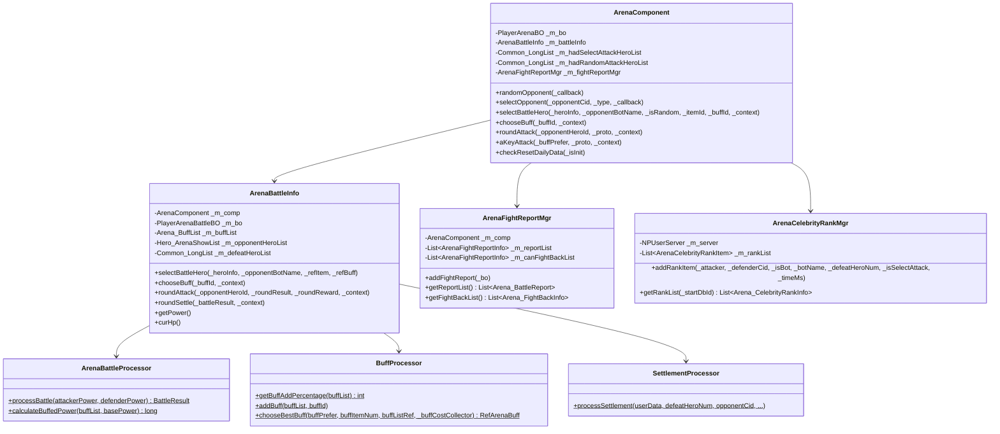
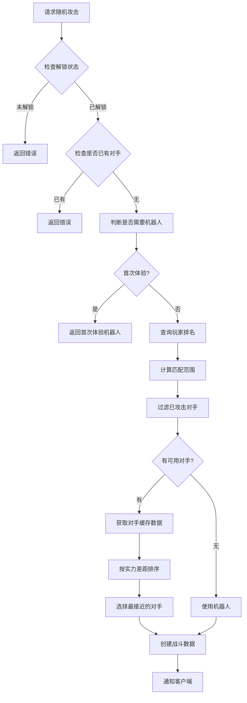
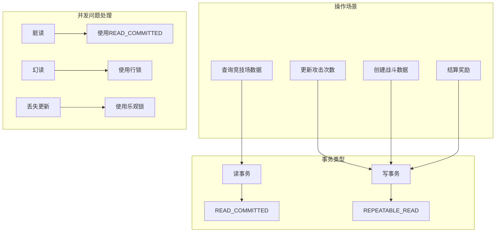

# 竞技场系统 - 服务端开发

## 模块架构

```
game_server/UserServer/src/NPUSServer/
├── NPUSUserMgr/UserComp/ArenaComp/
│   ├── ArenaComponent.java          # 竞技场组件主类
│   ├── ArenaBattleInfo.java         # 战斗信息管理
│   ├── ArenaFunc.java               # 工具函数
│   ├── ArenaAKeyAttackDealer.java   # 一键攻击处理器
│   ├── EArenaAttackType.java        # 攻击类型枚举
│   ├── Battle/
│   │   ├── ArenaBattleProcessor.java # 战斗处理器
│   │   ├── BuffProcessor.java        # Buff处理器
│   │   └── SettlementProcessor.java  # 结算处理器
│   └── FightReport/
│       ├── ArenaFightReportMgr.java  # 战报管理器
│       └── ArenaFightReportInfo.java # 战报信息
└── Arena/
    ├── ArenaCelebrityRankMgr.java    # 名人榜管理器
    └── ArenaCelebrityRankItem.java   # 名人榜条目
```

---

## 类图



---

## 核心类详解

### ArenaComponent

竞技场组件主类，负责管理玩家的竞技场数据和业务逻辑。

#### 数据成员

```java
public class ArenaComponent extends _ANPUserComponent
{
    private PlayerArenaBO _m_bo;                      // 数据库对象
    private ArenaBattleInfo _m_battleInfo;            // 当前战斗信息

    private Common_LongList _m_hadSelectAttackHeroList;  // 已指定攻击大臣列表
    private Common_LongList _m_hadRandomAttackHeroList;  // 已随机攻击大臣列表
    private Common_LongList _m_hadAttackOpponentCidList; // 已攻击对手列表(当天)

    private ArenaFightReportMgr _m_fightReportMgr;    // 战报管理器
}
```

#### 初始化流程

```java
@Override
protected void _init()
{
    ALProcess process = ALProcess.CreateProcess("ArenaComponent._init");
    // 1. 初始化竞技场基础信息
    process.addResDelegateProcess(action -> _initArenaInfo(action::dealAction), "arena_info_init", ...);
    // 2. 初始化战斗信息
    process.addResDelegateProcess(action -> _initArenaBattleInfo(action::dealAction), "arena_battle_info_init", ...);
    // 3. 初始化战报信息
    process.addResDelegateProcess(action -> _initArenaFightReport(action::dealAction), "arena_fight_report_init", ...);
    process.dealProcess(monitor);
}
```

---

## 核心业务流程

### 随机对手匹配流程



#### 代码实现

```java
public void randomOpponent(_ICallBackT<Result> _callback)
{
    _lock();
    try
    {
        if (!hadUnlockArena())
        {
            _callback.onRunOver(ArenaErr.HERO_NUM_NOT_ENOUGH_TO_ENTER_ARENA);
            return;
        }

        if (_m_battleInfo != null)
        {
            _callback.onRunOver(ArenaErr.OPPONENT_HAD_SELECTED);
            return;
        }

        SerialPromise promise = new SerialPromise(getUserData().getUserLock());
        RefWrap<Long> opponentCid = new RefWrap<>(0L);
        AtomicBoolean needRandomRobot = new AtomicBoolean(false);
        RefWrap<RefArenaBotTemplate> refBotTemplate = new RefWrap<>(null);

        // 1. 检查是否需要随机机器人
        promise.then(p -> {
            _needRandomRobot((_result, pair) -> {
                if (!_result.isSucc()) {
                    _callback.onRunOver(_result);
                    promise.breakOut();
                    return;
                }
                if (pair != null) {
                    needRandomRobot.set(pair.first);
                    refBotTemplate.set(pair.second);
                }
                promise.commit();
            });
        });

        // 2. 从排行榜随机对手
        promise.then(p -> {
            if (needRandomRobot.get()) {
                promise.commit();
                return;
            }
            _randomOpponentFromRank((_result, _opponentCid) -> {
                if (_result.getCode() == ArenaErr.OPPONENT_NOT_FOUND.getCode()) {
                    promise.commit();
                    return;
                }
                if (!_result.isSucc()) {
                    _callback.onRunOver(_result);
                    promise.breakOut();
                    return;
                }
                opponentCid.set(_opponentCid);
                promise.commit();
            });
        });

        // 3. 选择对手
        promise.then(p -> {
            if (needRandomRobot.get() || opponentCid.get() == 0) {
                selectRobot(refBotTemplate.get(), _callback);
            } else {
                selectOpponent(opponentCid.get(), EArenaAttackType.RANDOM, (result) -> {
                    if (!result.isSucc()) {
                        selectRobot(refBotTemplate.get(), _callback);
                        return;
                    }
                    _callback.onRunOver(Result.SUCC);
                });
            }
        });
    } finally {
        _unlock();
    }
}
```

### 对手实力匹配算法

```java
private void _randomOpponentFromRank(_ICallBackResultT<Long> _callback)
{
    // 1. 获取排行榜
    rankFixedInfo.makeRankBaseList(false, 0, (_result, _rankBaseList) -> {
        // 2. 找到玩家自己的排名
        int selfRank = -1;
        for (Rank_BaseItem rankItem : _rankBaseList) {
            if (rankItem.getKey() == getUserData().getCid()) {
                selfRank = rankItem.getRank() - 1;
                break;
            }
        }

        // 3. 计算匹配范围
        WCGPairInt randomRange = RefGeneral.Ref().arena_random_attack_match_interval;
        int minRank = Math.max(0, selfRank + randomRange.first());
        int maxRank = Math.min(_rankBaseList.size() - 1, selfRank + randomRange.second());

        // 4. 过滤已攻击对手
        List<Rank_BaseItem> availableList = filterAvailableOpponents(rangeList);

        // 5. 批量获取对手实力
        final long finalSelfMaxPower = getUserData().getPlayerComponent()
            .getParamV(ENPPlayerParam.POWER_MAX_RECORD);
        List<OpponentPowerInfo> opponentPowerList = Collections.synchronizedList(new ArrayList<>());

        for (Rank_BaseItem rankItem : availableList) {
            // 异步获取对手缓存
            getUSServer().getPlayerCacheGetter().getDealer(PlayerInfo_CommonShow.class)
                .getInfo(opponentCid, (_isSucc, _opponentCache) -> {
                    if (_isSucc && _opponentCache != null) {
                        long opponentMaxPower = _opponentCache.getMaxPower();
                        long powerDiff = Math.abs(finalSelfMaxPower - opponentMaxPower);
                        opponentPowerList.add(new OpponentPowerInfo(opponentCid, opponentMaxPower, powerDiff));
                    }
                    // 检查是否所有查询完成
                    if (loadCounter.decrementAndGet() == 0) {
                        // 按实力差距排序，选择最接近的对手
                        opponentPowerList.sort(Comparator.comparingLong(o -> o.powerDiff));
                        _callback.onRunOver(Result.SUCC, opponentPowerList.get(0).cid);
                    }
                });
        }
    });
}
```

### 战斗处理流程

```java
public Result roundAttack(long _opponentHeroId, GS2GC_023_005_RetRoundAttack _proto, NPPlayerContext _context)
{
    _lock();
    try
    {
        if (_m_battleInfo == null)
            return ArenaErr.OPPONENT_NOT_SELECTED;

        // 1. 执行回合攻击
        Result attackResult = _m_battleInfo.roundAttack(_opponentHeroId,
            _proto.getRoundResult(), _proto.getRoundReward(), _context);
        if (!attackResult.isSucc())
            return attackResult;

        // 2. 触发事件
        Event_P_ARENA_OP evt = new Event_P_ARENA_OP(_context, 1);
        getUserData().onLogicEvent(evt);

        // 3. 检查是否需要结算
        if (_m_battleInfo.roundSettle(_proto.getBattleResult(), _context))
        {
            // 清除数据
            _m_battleInfo.discard();
            _m_battleInfo = null;
        }

        return Result.SUCC;
    } finally {
        _unlock();
    }
}
```

---

## 战斗计算

### ArenaBattleProcessor

```java
public class ArenaBattleProcessor
{
    /**
     * 执行战斗计算
     * @param attackerPower 攻击者战力
     * @param defenderPower 防御者战力
     * @return 战斗结果
     */
    public static BattleResult processBattle(long attackerPower, long defenderPower)
    {
        long attackerHp = attackerPower;
        long defenderHp = defenderPower;
        long deductHp = 0;

        // 战斗计算 - 双方互扣血量
        while (attackerHp > 0 && defenderHp > 0)
        {
            long attackerDamage = attackerHp;
            long defenderDamage = defenderHp;

            attackerHp -= defenderDamage;
            deductHp += defenderDamage;
            defenderHp -= attackerDamage;
        }

        return new BattleResult(attackerHp, defenderHp, deductHp, defenderHp <= 0);
    }

    /**
     * 计算Buff加成
     */
    public static long calculateBuffedPower(List<Arena_SingleBuffInfo> buffList, long basePower)
    {
        return (long) Math.ceil((basePower * (10000d + BuffProcessor.getBuffAddPercentage(buffList))) / 10000);
    }
}
```

### BuffProcessor

```java
public class BuffProcessor
{
    /**
     * 获取buff增益百分比
     */
    public static int getBuffAddPercentage(List<Arena_SingleBuffInfo> buffList)
    {
        int addPer = 0;
        for (Arena_SingleBuffInfo buffInfo : buffList)
        {
            RefArenaBuff refArenaBuff = RefArenaBuff.getMgr().get(buffInfo.getBuffId());
            if (refArenaBuff == null)
                continue;
            addPer += refArenaBuff.value * buffInfo.getNum();
        }
        return addPer;
    }

    /**
     * 添加buff
     */
    public static void addBuff(List<Arena_SingleBuffInfo> buffList, long buffId)
    {
        for (Arena_SingleBuffInfo buffInfo : buffList)
        {
            if (buffInfo.getBuffId() == buffId)
            {
                buffInfo.setNum(buffInfo.getNum() + 1);
                return;
            }
        }
        buffList.add(new Arena_SingleBuffInfo(buffId, 1));
    }

    /**
     * 选择最佳Buff
     */
    public static RefArenaBuff chooseBestBuff(EArenaBuffType buffPrefer, ItemKeyList buffItemNum,
        RefArenaBuff[] buffListRef, NPItemCostCollector_nosafe _buffCostCollector)
    {
        if (buffPrefer == EArenaBuffType.NONE)
            return null;

        // 从偏好buff开始按顺序寻找可购买的buff
        for (int i = buffPrefer.ordinal(); i < buffListRef.length; i++)
        {
            RefArenaBuff refArenaBuff = buffListRef[i];
            if (refArenaBuff == null)
                continue;

            if (buffItemNum.consumeItem(refArenaBuff.cost.getItemType(),
                refArenaBuff.cost.getItemId(), refArenaBuff.cost.getCount()))
            {
                _buffCostCollector.addItem(refArenaBuff.cost);
                return refArenaBuff;
            }
        }
        return null;
    }
}
```

---

## 结算处理

### SettlementProcessor

```java
public class SettlementProcessor
{
    public static void processSettlement(
            NPUSUserData userData,
            int defeatHeroNum,
            long opponentCid,
            int _opponentHeroNum,
            boolean isBot,
            String botName,
            long heroId,
            int attackType,
            long selectAttackItemId,
            Arena_BattleResult battleResult,
            NPPlayerContext context,
            long opponentTotalHp,
            long initialHp,
            long finalHp,
            String buffDetail)
    {
        // 1. 计算倍率
        int ratio = 1;
        RefArenaSelectAttackConsume refItem = null;
        if (selectAttackItemId != 0) {
            refItem = RefArenaSelectAttackConsume.getMgr().get(selectAttackItemId);
            if (refItem != null)
                ratio = Math.max(1, refItem.ratio);
        }

        // 2. 设置战斗结果
        int opponentDeductInfluence = defeatHeroNum *
            RefGeneral.Ref().arena_deduct_influence_for_each_hero_defeated;
        int gainInfluence = defeatHeroNum *
            RefGeneral.Ref().arena_gain_influence_for_defeating_each_hero * ratio;

        battleResult.setHadDefeatNum(defeatHeroNum);
        battleResult.setOpponentHeroNum(_opponentHeroNum);
        battleResult.setOpponentDeductinfluence(opponentDeductInfluence);
        battleResult.setGainInfluence(gainInfluence);
        battleResult.setIsSettle(true);

        // 3. 发放最终奖励
        RefArenaFinalReward refReward = RefArenaFinalReward.getMgr().getRefByDefeatNum(defeatHeroNum);
        if (refReward != null)
            userData.gainItemList(CommonFunc.itemMultiple(refReward.reward_item_list, ratio), context);

        // 4. 名人榜处理
        if (defeatHeroNum >= RefGeneral.Ref().arena_celebrity_rank_up_need_defeat_hero)
            userData.getUSServer().getArenaCelebrityRankMgr().addRankItem(
                userData, opponentCid, isBot, botName, defeatHeroNum,
                attackType != EArenaAttackType.RANDOM.ordinal(), nowTimeMS);

        // 5. 触发事件
        userData.onLogicEvent(new Event_P_ARENA_INFLUENCE_CHG(context, gainInfluence));
        userData.onLogicEvent(new Event_P_ARENA_DEFEAT_HERO(context, defeatHeroNum));

        // 6. 对手处理(非机器人)
        if (!isBot) {
            // 对手扣除影响力
            Event_P_ARENA_INFLUENCE_CHG opponentEvent =
                new Event_P_ARENA_INFLUENCE_CHG(context, -opponentDeductInfluence);
            userData.getUSServer().getGlobalEventHandlerMgr()
                .handle(opponentEvent, new NPGlobalUserEventObj(opponentCid));

            // 发送战报/反击消息
            if (attackType == EArenaAttackType.CELEBRITY_RANK.ordinal()) {
                ArenaFunc.addFightBackMsg(opponentCid, userData, defeatHeroNum, opponentDeductInfluence, nowTimeMS);
            } else if (attackType == EArenaAttackType.RANDOM.ordinal()) {
                ArenaFunc.addFightReportMsg(opponentCid, userData, defeatHeroNum, opponentDeductInfluence, nowTimeMS);
            }
        }
    }
}
```

---

## 一键攻击处理

### ArenaAKeyAttackDealer

```java
public class ArenaAKeyAttackDealer
{
    private NPUSUserData _m_userData;
    private EArenaBuffType _m_buffPrefer;
    private ArenaBattleInfo _m_battleInfo;

    private int _m_round;
    private long _m_heroId;
    private long _m_basePower;
    private long _m_deductedHp;
    private List<Arena_SingleBuffInfo> _m_buffList = new ArrayList<>();

    private long _m_opponentCid;
    private boolean _m_opponentIsBot;
    private List<Long> _m_hadDefeatHeroIdList = new ArrayList<>();
    private Hero_ArenaShowList _m_opponentHeroList;

    private NPItemCostCollector_nosafe _m_itemCostCollector = new NPItemCostCollector_nosafe();
    private NPItemCostCollector_nosafe _m_buffCostCollector = new NPItemCostCollector_nosafe();

    /**
     * 一键攻击
     */
    public void aKeyAttack(NPPlayerContext _context)
    {
        int ratio = 1;
        if (_m_selectAttackItemId != 0) {
            RefArenaSelectAttackConsume refItem = RefArenaSelectAttackConsume.getMgr().get(_m_selectAttackItemId);
            if (refItem != null)
                ratio = Math.max(1, refItem.ratio);
        }

        while (curHp() > 0)
        {
            // 1. 选择对手大臣
            Hero_ArenaShowInfo opponentHero = aKeyChooseOpponentHero();
            if (opponentHero == null)
                break;

            // 2. 尝试选择buff
            _tryChooseBuff();

            // 3. 计算战斗结果
            ArenaBattleProcessor.BattleResult battleResult =
                ArenaBattleProcessor.processBattle(curHp(), opponentHero.getPower());

            // 4. 更新状态
            if (battleResult.isVictory())
                _m_hadDefeatHeroIdList.add(opponentHero.getHeroId());

            _m_round++;
            _m_deductedHp += battleResult.getDeductedHp();
            _m_hadBuyBuff = false;

            // 5. 收集奖励
            if (battleResult.isVictory()) {
                // 连胜奖励
                RefArenaRoundReward refArenaRoundReward = RefArenaRoundReward.getMgr().get(_m_round);
                if (refArenaRoundReward != null) {
                    RewardObj rewardObj = RewardMgr.getInstance().lookupReward(refArenaRoundReward.reward_id);
                    if (rewardObj != null)
                        _m_itemCostCollector.addItemList(rewardObj.makeNewItemList(ratio));
                }
                // 竞技场币
                _m_itemCostCollector.addItem(ENPItemType.CURRENCY, ECurrency.ARENA_COIN.ordinal(),
                    RefGeneral.Ref().arena_gain_coin_for_defeating_each_hero * ratio);
            }
        }
    }

    /**
     * 结算
     */
    public Result settle(Arena_BattleResult _battleResult, NPPlayerContext _context)
    {
        // 扣除buff消耗
        if (!_m_userData.hasCostItemList(_m_buffCostCollector.getItemList()))
            return CommErr.ITEM_NOT_ENOUGH;
        if (!_m_userData.spendItem(_m_buffCostCollector.getItemList(), _context))
            return CommErr.CONSUME_FAIL;

        // 获得过程奖励
        if (!_m_itemCostCollector.isEmpty())
            _m_userData.gainItemList(_m_itemCostCollector.getItemList(), _context);

        // 使用统一的结算处理器
        SettlementProcessor.processSettlement(
            _m_userData,
            _m_hadDefeatHeroIdList.size(),
            _m_opponentCid,
            _m_opponentHeroList.getHeroList().size(),
            _m_opponentIsBot,
            _m_botName,
            _m_heroId,
            _m_attackType,
            _m_selectAttackItemId,
            _battleResult,
            _context,
            calculateTotalPower(_m_opponentHeroList),
            _m_basePower,
            Math.max(0, _m_basePower - _m_deductedHp),
            convertBuffListToJson(_m_buffList)
        );

        return Result.SUCC;
    }
}
```

---

## 每日重置

```java
public void checkResetDailyData(boolean _isInit)
{
    _lock();
    try
    {
        long todayZeroClockMS = CommonFunc.getTodayZeroClockMS(0);
        if (_m_bo.getLastResetTimeMs() >= todayZeroClockMS)
            return;

        // 重置数据
        _m_hadSelectAttackHeroList.getValueList().clear();
        _m_hadRandomAttackHeroList.getValueList().clear();
        _m_hadAttackOpponentCidList.getValueList().clear();

        BM bmObj = getUSServer().getBM();
        _m_bo.setHadSelectAttackNum(bmObj, 0);
        _m_bo.setHadRandomAttackNum(bmObj, 0);
        _m_bo.setHadBuyRandomAttackNum(bmObj, 0);
        _m_bo.setLastResetTimeMs(bmObj, todayZeroClockMS);
        _m_bo.saveAllMarked(bmObj);

        // 初始化时清除过期战斗数据
        if (_isInit && _m_battleInfo != null)
        {
            _m_battleInfo.discard();
            _m_battleInfo = null;
        }

        if (!_isInit)
            getUserData().sendMsgToGC(US2GCWriter_023_ArenaOp.make_052_OnArenaBaseInfoChg(makeBaseInfo()));
    } finally {
        _unlock();
    }
}
```

---

## 注意事项

1. **线程安全**：所有公开方法都需要加锁 `_lock()` / `_unlock()`
2. **每日重置**：检查 `last_reset_time_ms` 是否跨天
3. **对手匹配优化**：优先匹配实力相近的对手，避免当天重复匹配
4. **机器人处理**：首次体验和匹配失败时使用机器人
5. **异步查询**：对手信息使用缓存异步获取

---

## 性能优化策略

### 数据库优化

#### 查询优化

```java
/**
 * 竞技场数据访问优化
 */
public class ArenaDataAccess
{
    /**
     * 批量加载玩家竞技场数据
     * 避免N+1查询问题
     */
    public static Map<Long, PlayerArenaBO> batchLoadArenaData(List<Long> cidList)
    {
        if (cidList == null || cidList.isEmpty())
            return Collections.emptyMap();

        String sql = "SELECT * FROM player_arena WHERE cid IN (" +
            String.join(",", cidList.stream().map(String::valueOf).collect(Collectors.toList())) + ")";

        List<PlayerArenaBO> boList = DBManager.queryList(sql, PlayerArenaBO.class);

        return boList.stream().collect(Collectors.toMap(PlayerArenaBO::getCid, bo -> bo));
    }

    /**
     * 批量加载战斗数据
     */
    public static Map<Long, PlayerArenaBattleBO> batchLoadBattleData(List<Long> cidList)
    {
        if (cidList == null || cidList.isEmpty())
            return Collections.emptyMap();

        String sql = "SELECT * FROM player_arena_battle WHERE cid IN (" +
            String.join(",", cidList.stream().map(String::valueOf).collect(Collectors.toList())) + ")";

        List<PlayerArenaBattleBO> boList = DBManager.queryList(sql, PlayerArenaBattleBO.class);

        return boList.stream().collect(Collectors.toMap(PlayerArenaBattleBO::getCid, bo -> bo));
    }

    /**
     * 分页加载战报数据
     */
    public static List<PlayerArenaFightReportBO> loadFightReportPaged(long cid, int page, int pageSize)
    {
        int offset = page * pageSize;

        String sql = "SELECT * FROM player_arena_fight_report " +
            "WHERE cid = ? ORDER BY timestamp DESC LIMIT ?, ?";

        return DBManager.queryList(sql, PlayerArenaFightReportBO.class, cid, offset, pageSize);
    }

    /**
     * 使用索引优化名人榜查询
     */
    public static List<ArenaCelebrityRankBO> loadCelebrityRankPaged(long startDbId, int limit)
    {
        String sql;

        if (startDbId <= 0)
        {
            // 首页查询
            sql = "SELECT * FROM arena_celebrity_rank " +
                "ORDER BY defeat_hero_num DESC, time_ms DESC LIMIT ?";
            return DBManager.queryList(sql, ArenaCelebrityRankBO.class, limit);
        }
        else
        {
            // 分页查询
            sql = "SELECT * FROM arena_celebrity_rank " +
                "WHERE id < ? ORDER BY defeat_hero_num DESC, time_ms DESC LIMIT ?";
            return DBManager.queryList(sql, ArenaCelebrityRankBO.class, startDbId, limit);
        }
    }
}
```

#### 写入优化

```java
/**
 * 批量写入优化
 */
public class ArenaBatchWriter
{
    // 批量写入队列
    private static final Queue<PlayerArenaFightReportBO> reportQueue =
        new ConcurrentLinkedQueue<>();

    // 批量写入阈值
    private static final int BATCH_SIZE = 100;
    private static final long FLUSH_INTERVAL_MS = 5000;

    static
    {
        // 启动定时刷新线程
        ScheduledExecutorService scheduler = Executors.newSingleThreadScheduledExecutor();
        scheduler.scheduleAtFixedRate(ArenaBatchWriter::flush,
            FLUSH_INTERVAL_MS, FLUSH_INTERVAL_MS, TimeUnit.MILLISECONDS);
    }

    /**
     * 添加战报到批量队列
     */
    public static void addReport(PlayerArenaFightReportBO report)
    {
        reportQueue.offer(report);

        if (reportQueue.size() >= BATCH_SIZE)
        {
            flush();
        }
    }

    /**
     * 批量写入数据库
     */
    public static void flush()
    {
        if (reportQueue.isEmpty())
            return;

        List<PlayerArenaFightReportBO> batchList = new ArrayList<>();
        while (!reportQueue.isEmpty() && batchList.size() < BATCH_SIZE)
        {
            PlayerArenaFightReportBO report = reportQueue.poll();
            if (report != null)
                batchList.add(report);
        }

        if (batchList.isEmpty())
            return;

        // 批量插入SQL
        StringBuilder sql = new StringBuilder();
        sql.append("INSERT INTO player_arena_fight_report ");
        sql.append("(cid, opponent_cid, defeat_hero_num, deduct_influence, timestamp, ");
        sql.append("from_celebrity_rand, had_fight_back) VALUES ");

        List<Object> params = new ArrayList<>();
        for (int i = 0; i < batchList.size(); i++)
        {
            if (i > 0) sql.append(", ");
            sql.append("(?, ?, ?, ?, ?, ?, ?)");

            PlayerArenaFightReportBO bo = batchList.get(i);
            params.add(bo.getCid());
            params.add(bo.getOpponentCid());
            params.add(bo.getDefeatHeroNum());
            params.add(bo.getDeductInfluence());
            params.add(bo.getTimestamp());
            params.add(bo.getFromCelebrityRand());
            params.add(bo.getHadFightBack());
        }

        DBManager.executeUpdate(sql.toString(), params.toArray());
    }
}
```

### 缓存策略

```java
/**
 * 竞技场缓存管理器
 */
public class ArenaCacheManager
{
    // 玩家竞技场数据缓存
    private static final Cache<Long, PlayerArenaBO> arenaCache =
        CacheBuilder.newBuilder()
            .maximumSize(10000)
            .expireAfterAccess(30, TimeUnit.MINUTES)
            .build();

    // 战斗数据缓存
    private static final Cache<Long, PlayerArenaBattleBO> battleCache =
        CacheBuilder.newBuilder()
            .maximumSize(5000)
            .expireAfterAccess(10, TimeUnit.MINUTES)
            .build();

    // 名人榜缓存
    private static final Cache<String, List<ArenaCelebrityRankBO>> celebrityCache =
        CacheBuilder.newBuilder()
            .maximumSize(10)
            .expireAfterWrite(5, TimeUnit.MINUTES)
            .build();

    /**
     * 获取玩家竞技场数据
     */
    public static PlayerArenaBO getArenaData(long cid)
    {
        try
        {
            return arenaCache.get(cid, () -> {
                return DBManager.queryOne(
                    "SELECT * FROM player_arena WHERE cid = ?",
                    PlayerArenaBO.class, cid);
            });
        }
        catch (ExecutionException e)
        {
            return null;
        }
    }

    /**
     * 更新缓存
     */
    public static void updateArenaCache(PlayerArenaBO bo)
    {
        arenaCache.put(bo.getCid(), bo);
    }

    /**
     * 使缓存失效
     */
    public static void invalidateArenaCache(long cid)
    {
        arenaCache.invalidate(cid);
    }

    /**
     * 获取战斗数据
     */
    public static PlayerArenaBattleBO getBattleData(long cid)
    {
        try
        {
            return battleCache.get(cid, () -> {
                return DBManager.queryOne(
                    "SELECT * FROM player_arena_battle WHERE cid = ?",
                    PlayerArenaBattleBO.class, cid);
            });
        }
        catch (ExecutionException e)
        {
            return null;
        }
    }

    /**
     * 清除战斗数据缓存
     */
    public static void invalidateBattleCache(long cid)
    {
        battleCache.invalidate(cid);
    }

    /**
     * 获取名人榜数据
     */
    public static List<ArenaCelebrityRankBO> getCelebrityRank(long startDbId)
    {
        String cacheKey = "celebrity_" + startDbId;
        try
        {
            return celebrityCache.get(cacheKey, () -> {
                return ArenaDataAccess.loadCelebrityRankPaged(startDbId, 50);
            });
        }
        catch (ExecutionException e)
        {
            return Collections.emptyList();
        }
    }

    /**
     * 刷新名人榜缓存
     */
    public static void refreshCelebrityCache()
    {
        celebrityCache.invalidateAll();
    }
}
```

### 并发控制

```java
/**
 * 竞技场并发控制
 */
public class ArenaConcurrencyControl
{
    // 玩家锁管理
    private static final Striped<Lock> playerLocks = Striped.lock(1024);

    /**
     * 执行带锁的操作
     */
    public static <T> T executeWithLock(long cid, Supplier<T> action)
    {
        Lock lock = playerLocks.get(cid);
        lock.lock();
        try
        {
            return action.get();
        }
        finally
        {
            lock.unlock();
        }
    }

    /**
     * 执行带锁的操作(无返回值)
     */
    public static void executeWithLock(long cid, Runnable action)
    {
        Lock lock = playerLocks.get(cid);
        lock.lock();
        try
        {
            action.run();
        }
        finally
        {
            lock.unlock();
        }
    }

    /**
     * 尝试获取锁并执行
     */
    public static <T> T tryExecuteWithLock(long cid, long timeoutMs, Supplier<T> action)
    {
        Lock lock = playerLocks.get(cid);
        try
        {
            if (lock.tryLock(timeoutMs, TimeUnit.MILLISECONDS))
            {
                try
                {
                    return action.get();
                }
                finally
                {
                    lock.unlock();
                }
            }
        }
        catch (InterruptedException e)
        {
            Thread.currentThread().interrupt();
        }
        return null;
    }
}
```

---

## 事务处理详解

### 事务隔离级别



### 事务模板

```java
/**
 * 竞技场事务模板
 */
public class ArenaTransactionTemplate
{
    /**
     * 执行事务
     */
    public static <T> T execute(TransactionCallback<T> action)
    {
        return DBManager.executeTransaction(action);
    }

    /**
     * 创建战斗数据事务
     */
    public static Result createBattleTransaction(NPUSUserData userData,
        long opponentCid, EArenaAttackType attackType)
    {
        return execute(status -> {
            try
            {
                // 1. 检查玩家状态
                PlayerArenaBO arenaBo = ArenaCacheManager.getArenaData(userData.getCid());
                if (arenaBo == null)
                    return Result.fail(CommErr.DATA_NOT_FOUND);

                // 2. 检查攻击次数
                if (attackType == EArenaAttackType.RANDOM)
                {
                    int freeLimit = RefGeneral.Ref().arena_random_attack_free_limit;
                    if (arenaBo.getHadRandomAttackNum() >= freeLimit)
                        return Result.fail(ArenaErr.RANDOM_ATTACK_NUM_OVER_LIMIT);
                }
                else
                {
                    int selectLimit = RefGeneral.Ref().arena_select_attack_daily_limit;
                    if (arenaBo.getHadSelectAttackNum() >= selectLimit)
                        return Result.fail(ArenaErr.SELECT_ATTACK_NUM_OVER_LIMIT);
                }

                // 3. 检查是否有进行中的战斗
                PlayerArenaBattleBO existingBattle = ArenaCacheManager.getBattleData(userData.getCid());
                if (existingBattle != null)
                    return Result.fail(ArenaErr.OPPONENT_HAD_SELECTED);

                // 4. 创建战斗数据
                PlayerArenaBattleBO battleBo = new PlayerArenaBattleBO();
                battleBo.setCid(userData.getCid());
                battleBo.setOpponentCid(opponentCid);
                battleBo.setAttackType(attackType.ordinal());
                // ... 设置其他字段

                // 5. 更新攻击次数
                if (attackType == EArenaAttackType.RANDOM)
                {
                    arenaBo.setHadRandomAttackNum(arenaBo.getHadRandomAttackNum() + 1);
                }
                else
                {
                    arenaBo.setHadSelectAttackNum(arenaBo.getHadSelectAttackNum() + 1);
                }

                // 6. 保存到数据库
                DBManager.insert(battleBo);
                DBManager.update(arenaBo);

                // 7. 更新缓存
                ArenaCacheManager.updateArenaCache(arenaBo);
                ArenaCacheManager.invalidateBattleCache(userData.getCid());

                return Result.SUCC;
            }
            catch (Exception e)
            {
                status.setRollbackOnly();
                MJLog.error("createBattleTransaction failed", e);
                return Result.fail(CommErr.DB_ERROR);
            }
        });
    }

    /**
     * 结算事务
     */
    public static Result settleBattleTransaction(NPUSUserData userData,
        int defeatHeroNum, long opponentCid, boolean isBot)
    {
        return execute(status -> {
            try
            {
                // 1. 计算奖励
                int gainInfluence = defeatHeroNum *
                    RefGeneral.Ref().arena_gain_influence_for_defeating_each_hero;
                int opponentDeductInfluence = defeatHeroNum *
                    RefGeneral.Ref().arena_deduct_influence_for_each_hero_defeated;

                // 2. 更新玩家影响力
                userData.getPlayerComponent().addInfluence(gainInfluence);

                // 3. 如果不是机器人，更新对手影响力
                if (!isBot && opponentCid > 0)
                {
                    updateOpponentInfluence(opponentCid, -opponentDeductInfluence);
                }

                // 4. 删除战斗数据
                DBManager.executeUpdate(
                    "DELETE FROM player_arena_battle WHERE cid = ?",
                    userData.getCid());

                // 5. 添加战报(如果不是机器人)
                if (!isBot)
                {
                    PlayerArenaFightReportBO report = new PlayerArenaFightReportBO();
                    report.setCid(opponentCid);
                    report.setOpponentCid(userData.getCid());
                    report.setDefeatHeroNum(defeatHeroNum);
                    report.setDeductInfluence(opponentDeductInfluence);
                    report.setTimestamp(System.currentTimeMillis());

                    ArenaBatchWriter.addReport(report);
                }

                // 6. 检查名人榜
                if (defeatHeroNum >= RefGeneral.Ref().arena_celebrity_rank_up_need_defeat_hero)
                {
                    addCelebrityRank(userData, opponentCid, isBot, defeatHeroNum);
                }

                // 7. 清除缓存
                ArenaCacheManager.invalidateBattleCache(userData.getCid());

                return Result.SUCC;
            }
            catch (Exception e)
            {
                status.setRollbackOnly();
                MJLog.error("settleBattleTransaction failed", e);
                return Result.fail(CommErr.DB_ERROR);
            }
        });
    }

    /**
     * 更新对手影响力(异步)
     */
    private static void updateOpponentInfluence(long opponentCid, int changeInfluence)
    {
        // 通过事件系统异步处理
        Event_P_ARENA_INFLUENCE_CHG event = new Event_P_ARENA_INFLUENCE_CHG(null, changeInfluence);
        GlobalEventMgr.handle(event, new NPGlobalUserEventObj(opponentCid));
    }

    /**
     * 添加名人榜记录
     */
    private static void addCelebrityRank(NPUSUserData userData, long opponentCid,
        boolean isBot, int defeatHeroNum)
    {
        ArenaCelebrityRankBO rankBo = new ArenaCelebrityRankBO();
        rankBo.setAttackerCid(userData.getCid());
        rankBo.setAttackerName(userData.getPlayerComponent().getName());
        rankBo.setDefenderCid(opponentCid);
        rankBo.setDefeatHeroNum(defeatHeroNum);
        rankBo.setTimeMs(System.currentTimeMillis());
        rankBo.setIsBot(isBot);

        DBManager.insert(rankBo);

        // 刷新名人榜缓存
        ArenaCacheManager.refreshCelebrityCache();
    }
}
```

### 分布式锁处理

```java
/**
 * 分布式锁管理器
 */
public class ArenaDistributedLock
{
    private static final String LOCK_PREFIX = "arena:lock:";

    // Redis客户端
    private static final JedisPool jedisPool = RedisManager.getPool();

    /**
     * 获取玩家锁
     */
    public static boolean tryLock(long cid, long timeoutMs)
    {
        String lockKey = LOCK_PREFIX + cid;
        String lockValue = UUID.randomUUID().toString();

        try (Jedis jedis = jedisPool.getResource())
        {
            String result = jedis.set(lockKey, lockValue, "NX", "PX", timeoutMs);
            return "OK".equals(result);
        }
    }

    /**
     * 释放玩家锁
     */
    public static void unlock(long cid, String lockValue)
    {
        String lockKey = LOCK_PREFIX + cid;

        try (Jedis jedis = jedisPool.getResource())
        {
            // 使用Lua脚本保证原子性
            String script =
                "if redis.call('get', KEYS[1]) == ARGV[1] then " +
                "    return redis.call('del', KEYS[1]) " +
                "else " +
                "    return 0 " +
                "end";

            jedis.eval(script, 1, lockKey, lockValue);
        }
    }

    /**
     * 执行带分布式锁的操作
     */
    public static <T> T executeWithDistributedLock(long cid, long timeoutMs, Supplier<T> action)
    {
        String lockValue = UUID.randomUUID().toString();

        if (!tryLock(cid, timeoutMs))
        {
            throw new RuntimeException("Failed to acquire lock for cid: " + cid);
        }

        try
        {
            return action.get();
        }
        finally
        {
            unlock(cid, lockValue);
        }
    }
}
```

---

## 监控与告警

### 性能监控指标

```java
/**
 * 竞技场性能监控
 */
public class ArenaMetrics
{
    // 请求计数器
    private static final Counter requestCounter = Metrics.counter("arena_request_count");

    // 请求延迟
    private static final Histogram latencyHistogram = Metrics.histogram("arena_request_latency_ms");

    // 活跃战斗数
    private static final Gauge activeBattleGauge = Metrics.gauge("arena_active_battles");

    // 匹配成功率
    private static final Counter matchSuccessCounter = Metrics.counter("arena_match_success");
    private static final Counter matchFailCounter = Metrics.counter("arena_match_fail");

    /**
     * 记录请求
     */
    public static void recordRequest(String action, long latencyMs, boolean success)
    {
        requestCounter.increment();
        latencyHistogram.record(latencyMs);

        if (action.equals("random_match"))
        {
            if (success)
                matchSuccessCounter.increment();
            else
                matchFailCounter.increment();
        }
    }

    /**
     * 更新活跃战斗数
     */
    public static void updateActiveBattles(int count)
    {
        activeBattleGauge.set(count);
    }

    /**
     * 获取性能报告
     */
    public static String getPerformanceReport()
    {
        StringBuilder sb = new StringBuilder();
        sb.append("=== Arena Performance Report ===\n");
        sb.append("Total Requests: ").append(requestCounter.getCount()).append("\n");
        sb.append("Avg Latency: ").append(latencyHistogram.getMean()).append("ms\n");
        sb.append("P99 Latency: ").append(latencyHistogram.getSnapshot().get99thPercentile()).append("ms\n");
        sb.append("Active Battles: ").append(activeBattleGauge.get()).append("\n");
        sb.append("Match Success Rate: ")
            .append(matchSuccessCounter.getCount() * 100.0 /
                (matchSuccessCounter.getCount() + matchFailCounter.getCount()))
            .append("%\n");
        return sb.toString();
    }
}
```

### 告警规则配置

```java
/**
 * 竞技场告警配置
 */
public class ArenaAlertConfig
{
    // 告警阈值
    public static final long LATENCY_WARNING_MS = 1000;      // 延迟警告阈值
    public static final long LATENCY_CRITICAL_MS = 3000;     // 延迟严重阈值
    public static final double ERROR_RATE_WARNING = 0.01;    // 错误率警告阈值
    public static final double ERROR_RATE_CRITICAL = 0.05;   // 错误率严重阈值
    public static final int QUEUE_SIZE_WARNING = 100;        // 队列大小警告阈值

    /**
     * 检查告警
     */
    public static void checkAlerts()
    {
        // 检查延迟
        double avgLatency = ArenaMetrics.latencyHistogram.getMean();
        if (avgLatency > LATENCY_CRITICAL_MS)
        {
            AlertManager.sendCritical("Arena latency critical: " + avgLatency + "ms");
        }
        else if (avgLatency > LATENCY_WARNING_MS)
        {
            AlertManager.sendWarning("Arena latency warning: " + avgLatency + "ms");
        }

        // 检查错误率
        long totalRequests = ArenaMetrics.matchSuccessCounter.getCount() +
            ArenaMetrics.matchFailCounter.getCount();
        if (totalRequests > 0)
        {
            double errorRate = ArenaMetrics.matchFailCounter.getCount() * 1.0 / totalRequests;
            if (errorRate > ERROR_RATE_CRITICAL)
            {
                AlertManager.sendCritical("Arena error rate critical: " + (errorRate * 100) + "%");
            }
            else if (errorRate > ERROR_RATE_WARNING)
            {
                AlertManager.sendWarning("Arena error rate warning: " + (errorRate * 100) + "%");
            }
        }
    }
}
```

---

## 日志系统

### 结构化日志

```java
/**
 * 竞技场结构化日志
 */
public class ArenaLogHelper
{
    private static final Logger logger = LoggerFactory.getLogger("ArenaBusiness");

    /**
     * 记录战斗日志
     */
    public static void logBattle(NPUSUserData userData, ArenaBattleContext context)
    {
        JSONObject logData = new JSONObject(true);
        logData.put("log_type", "arena_battle");
        logData.put("cid", userData.getCid());
        logData.put("hero_id", context.getHeroId());
        logData.put("opponent_cid", context.getOpponentCid());
        logData.put("is_bot", context.isBot());
        logData.put("attack_type", context.getAttackType().name());
        logData.put("defeat_num", context.getDefeatHeroNum());
        logData.put("total_rounds", context.getTotalRounds());
        logData.put("initial_hp", context.getInitialHp());
        logData.put("final_hp", context.getFinalHp());
        logData.put("buff_list", context.getBuffList().toString());
        logData.put("gain_influence", context.getGainInfluence());
        logData.put("duration_ms", context.getDurationMs());
        logData.put("timestamp", System.currentTimeMillis());

        logger.info(logData.toJSONString());
    }

    /**
     * 记录匹配日志
     */
    public static void logMatch(NPUSUserData userData, MatchResult result)
    {
        JSONObject logData = new JSONObject(true);
        logData.put("log_type", "arena_match");
        logData.put("cid", userData.getCid());
        logData.put("self_rank", result.getSelfRank());
        logData.put("match_range", result.getMatchRange().toString());
        logData.put("opponent_cid", result.getOpponentCid());
        logData.put("is_bot", result.isBot());
        logData.put("match_time_ms", result.getMatchTimeMs());
        logData.put("timestamp", System.currentTimeMillis());

        logger.info(logData.toJSONString());
    }

    /**
     * 记录错误日志
     */
    public static void logError(NPUSUserData userData, String action, Result error)
    {
        JSONObject logData = new JSONObject(true);
        logData.put("log_type", "arena_error");
        logData.put("cid", userData.getCid());
        logData.put("action", action);
        logData.put("error_code", error.getCode());
        logData.put("error_msg", error.getMsg());
        logData.put("timestamp", System.currentTimeMillis());

        logger.error(logData.toJSONString());
    }
}
```

---

## 定时任务

### 定时任务配置

```java
/**
 * 竞技场定时任务
 */
public class ArenaScheduledTasks
{
    private static final ScheduledExecutorService scheduler =
        Executors.newScheduledThreadPool(2);

    /**
     * 启动所有定时任务
     */
    public static void start()
    {
        // 每分钟刷新名人榜缓存
        scheduler.scheduleAtFixedRate(ArenaScheduledTasks::refreshCelebrityCache,
            1, 1, TimeUnit.MINUTES);

        // 每小时清理过期战斗数据
        scheduler.scheduleAtFixedRate(ArenaScheduledTasks::cleanExpiredBattles,
            1, 1, TimeUnit.HOURS);

        // 每天凌晨重置数据
        scheduler.scheduleAtFixedRate(ArenaScheduledTasks::dailyReset,
            calculateNextResetDelay(), 24 * 60, TimeUnit.MINUTES);

        // 每5分钟检查告警
        scheduler.scheduleAtFixedRate(ArenaScheduledTasks::checkAlerts,
            5, 5, TimeUnit.MINUTES);
    }

    /**
     * 刷新名人榜缓存
     */
    private static void refreshCelebrityCache()
    {
        try
        {
            ArenaCacheManager.refreshCelebrityCache();
            MJLog.info("Celebrity cache refreshed");
        }
        catch (Exception e)
        {
            MJLog.error("Failed to refresh celebrity cache", e);
        }
    }

    /**
     * 清理过期战斗数据
     */
    private static void cleanExpiredBattles()
    {
        try
        {
            long expireTime = System.currentTimeMillis() -
                RefGeneral.Ref().arena_battle_expire_time_ms;

            String sql = "DELETE FROM player_arena_battle WHERE create_time < ?";
            int deleted = DBManager.executeUpdate(sql, new Timestamp(expireTime));

            MJLog.info("Cleaned expired battles: " + deleted);
        }
        catch (Exception e)
        {
            MJLog.error("Failed to clean expired battles", e);
        }
    }

    /**
     * 每日重置
     */
    private static void dailyReset()
    {
        try
        {
            long todayZero = CommonFunc.getTodayZeroClockMS(0);

            String sql = "UPDATE player_arena SET " +
                "had_select_attack_num = 0, " +
                "had_random_attack_num = 0, " +
                "had_buy_random_attack_num = 0, " +
                "last_reset_time_ms = ? " +
                "WHERE last_reset_time_ms < ?";

            int updated = DBManager.executeUpdate(sql, todayZero, todayZero);

            MJLog.info("Daily reset completed, updated rows: " + updated);
        }
        catch (Exception e)
        {
            MJLog.error("Failed to daily reset", e);
        }
    }

    /**
     * 检查告警
     */
    private static void checkAlerts()
    {
        try
        {
            ArenaAlertConfig.checkAlerts();
        }
        catch (Exception e)
        {
            MJLog.error("Failed to check alerts", e);
        }
    }

    /**
     * 计算下次重置延迟
     */
    private static long calculateNextResetDelay()
    {
        LocalDateTime now = LocalDateTime.now();
        LocalDateTime nextReset = now.toLocalDate().plusDays(1).atTime(0, 0);
        return Duration.between(now, nextReset).toMinutes();
    }
}
```

---

*文档生成时间: 2026-04-11*