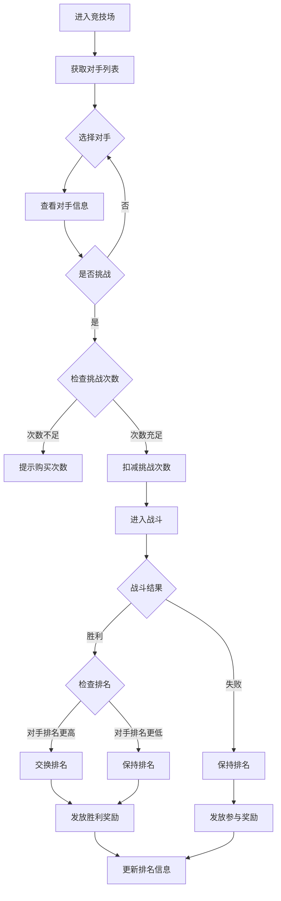
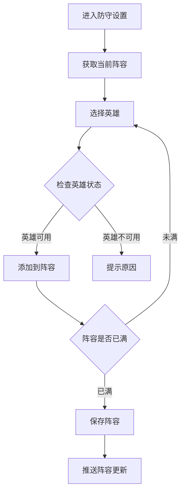
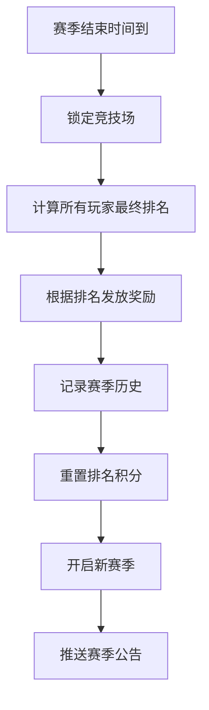

# 竞技场模块完整说明

## 一、模块概述

### 1.1 业务背景

竞技场模块是 K2C 游戏的核心 PVP（玩家对战）系统。玩家可以在此挑战其他玩家，争夺排名和荣誉。竞技场排名是展示玩家实力的重要途径，同时提供丰富的排名奖励和赛季机制。

### 1.2 目标用户

- **竞技型玩家**：追求排名和 PVP 成就
- **策略型玩家**：研究阵容搭配和克制关系
- **收集型玩家**：获取竞技场专属奖励

### 1.3 核心价值

1. **竞技乐趣**：提供公平的玩家对战体验
2. **荣誉展示**：排名系统展示玩家实力
3. **资源产出**：竞技场奖励是重要资源来源
4. **长期目标**：赛季机制提供持续追求

---

## 二、功能清单

### 2.1 竞技匹配功能

| 功能名称 | 功能描述 | 用户价值 |
|---------|---------|---------|
| 对手刷新 | 刷新可挑战的对手列表 | 选择合适对手 |
| 挑战发起 | 发起对指定玩家的挑战 | 进行战斗 |
| 战斗加速 | 消耗资源跳过战斗过程 | 快速完成 |

### 2.2 排名系统功能

| 功能名称 | 功能描述 | 用户价值 |
|---------|---------|---------|
| 实时排名 | 显示当前排名和积分 | 了解竞争地位 |
| 排名奖励 | 根据排名发放奖励 | 获取排名收益 |
| 历史最高 | 记录历史最高排名 | 追踪进步 |

### 2.3 赛季系统功能

| 功能名称 | 功能描述 | 用户价值 |
|---------|---------|---------|
| 赛季周期 | 定期重置排名 | 保持竞争活力 |
| 赛季奖励 | 赛季结束时发放奖励 | 阶段性目标 |
| 段位系统 | 根据积分划分段位 | 直观展示实力 |

### 2.4 防守阵容功能

| 功能名称 | 功能描述 | 用户价值 |
|---------|---------|---------|
| 设置防守 | 设置防守阵容英雄 | 保护排名 |
| 查看战报 | 查看被挑战的记录 | 了解防守效果 |
| 调整策略 | 根据战报优化阵容 | 提升防守胜率 |

---

## 三、业务流程详解

### 3.1 竞技场挑战流程



**详细步骤说明**：

1. **对手获取**
   - 根据当前排名获取附近排名的玩家
   - 提供刷新功能更换对手列表
   - 显示对手的战力和阵容预览

2. **挑战条件**
   - 每日免费挑战次数（如5次）
   - 可消耗钻石购买额外次数
   - 挑战冷却时间（如10分钟）

3. **战斗执行**
   - 自动战斗，展示战斗过程
   - 可消耗资源跳过战斗动画
   - 根据双方实力计算胜负

4. **排名更新**
   - 胜利后若对手排名更高，交换排名
   - 失败则保持原排名
   - 更新双方竞技场信息

### 3.2 防守阵容设置流程



### 3.3 赛季结算流程



---

## 四、关键规则

### 4.1 挑战规则

1. **挑战次数**：每日5次免费，可购买最多10次
2. **挑战冷却**：每次挑战后10分钟冷却
3. **排名范围**：只能挑战比自己排名高的玩家
4. **对手刷新**：免费刷新3次，之后消耗钻石

### 4.2 排名规则

1. **初始排名**：新玩家从最低排名开始
2. **排名交换**：战胜高排名玩家后交换位置
3. **排名保护**：刚进入竞技场有24小时保护期
4. **排名奖励**：每晚21点根据当前排名发放

### 4.3 赛季规则

1. **赛季周期**：每14天一个赛季
2. **段位划分**：青铜、白银、黄金、铂金、钻石、大师、王者
3. **赛季重置**：新赛季开始后排名部分重置
4. **历史记录**：保留历史最高排名记录

### 4.4 战斗规则

1. **自动战斗**：双方阵容自动对战
2. **回合限制**：最多30回合，超时判进攻方负
3. **技能释放**：按预设策略自动释放
4. **属性加成**：竞技场内可能有特殊加成

---

## 五、用户故事

### 5.1 竞技玩家故事

> 作为一名热衷竞技的玩家，我每天都会打完所有竞技场次数。我精心搭配防守阵容，研究对手的弱点。今天我终于打进了前100名，获得了钻石奖励。赛季即将结束，我正在为冲击更高段位做最后冲刺。

### 5.2 休闲玩家故事

> 作为一名休闲玩家，我每天只打几次竞技场获取日常奖励。我设置了自动防守阵容，虽然胜率不高，但也能获得一些资源。赛季结束时，我获得了白银段位的奖励，对我来说已经足够了。

### 5.3 策略玩家故事

> 作为一名喜欢研究策略的玩家，我经常查看防守战报，分析对手的进攻套路。我发现某些英雄组合特别克制当前流行的阵容，于是调整了我的防守策略。防守胜率明显提升了。

---

## 六、示例

### 6.1 挑战示例

**初始状态**：
```
玩家排名：1000
玩家战力：50,000
挑战次数：3/5
```

**挑战操作**：
- 选择排名950的对手（战力48,000）
- 消耗1次挑战次数
- 战斗胜利

**结果状态**：
```
玩家排名：950（+50）
对手排名：1000
挑战次数：2/5
获得奖励：银两×500、竞技币×10
```

### 6.2 排名奖励示例

**排名档位奖励**：
```
第1名：钻石×500、竞技币×500、专属头像框
第2-10名：钻石×300、竞技币×300
第11-50名：钻石×200、竞技币×200
第51-100名：钻石×100、竞技币×100
第101-500名：钻石×50、竞技币×50
第501-1000名：钻石×30、竞技币×30
```

### 6.3 赛季奖励示例

**段位奖励**：
```
王者段位：钻石×1000、传说英雄碎片×50
大师段位：钻石×500、史诗英雄碎片×30
钻石段位：钻石×300、稀有英雄碎片×20
铂金段位：钻石×200、稀有英雄碎片×10
黄金段位：钻石×100、精英英雄碎片×10
白银段位：钻石×50
青铜段位：钻石×20
```

---

*文档生成时间: 2026-04-06*
