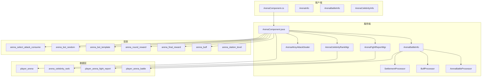
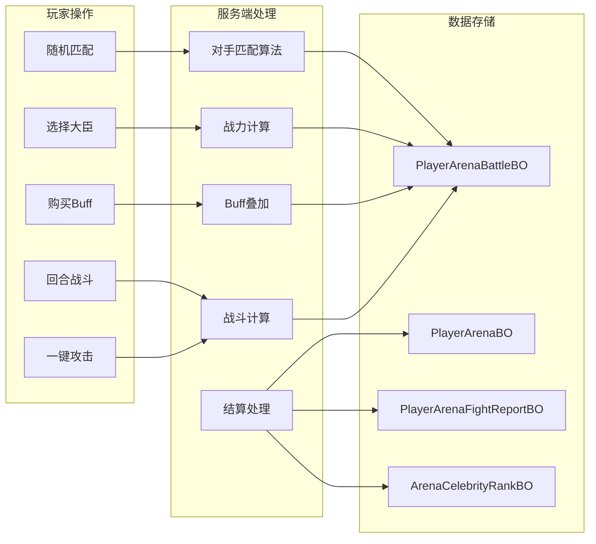
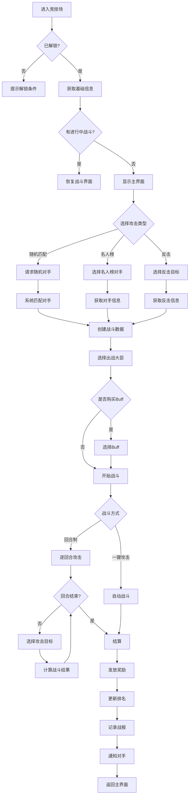
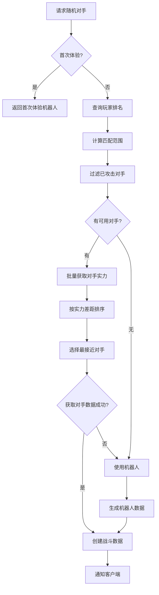
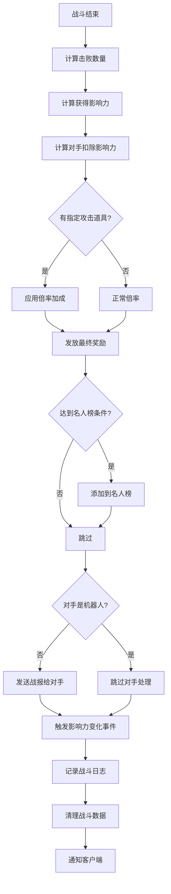

# 竞技场模块完整说明

## 一、模块概述

### 1.1 业务背景

竞技场模块是 K2C 游戏的核心 PVP（玩家对战）系统。玩家可以在此挑战其他玩家或机器人对手，通过击败对方大臣获得竞技场积分和奖励。竞技场排名是展示玩家实力的重要途径，同时提供丰富的排名奖励和名人榜展示机制。

### 1.2 目标用户

- **竞技型玩家**：追求排名和 PVP 成就
- **策略型玩家**：研究阵容搭配、Buff选择策略
- **收集型玩家**：获取竞技场专属奖励和竞技币

### 1.3 核心价值

1. **竞技乐趣**：提供公平的玩家对战体验
2. **荣誉展示**：名人榜系统展示玩家战绩
3. **资源产出**：竞技场奖励是重要资源来源
4. **社交互动**：反击机制增加玩家间互动

---

## 二、功能清单

### 2.1 攻击模式

| 功能名称 | 功能描述 | 用户价值 |
|---------|---------|---------|
| 随机匹配 | 系统自动匹配实力相近的对手 | 公平竞技 |
| 指定攻击 | 选择特定玩家进行攻击 | 复仇/挑战 |
| 名人榜攻击 | 从名人榜选择对手攻击 | 高收益挑战 |
| 反击 | 对攻击者进行反击 | 扳回损失 |
| 一键攻击 | 自动完成整个战斗过程 | 快速完成 |

### 2.2 战斗系统

| 功能名称 | 功能描述 | 用户价值 |
|---------|---------|---------|
| 选择出战大臣 | 选择一个大臣进行战斗 | 策略选择 |
| Buff增益 | 购买临时属性加成 | 增强战力 |
| 回合制战斗 | 逐个击败对手大臣 | 逐步推进 |
| 战斗结算 | 根据击败数量发放奖励 | 即时反馈 |

### 2.3 社交功能

| 功能名称 | 功能描述 | 用户价值 |
|---------|---------|---------|
| 名人榜 | 展示击败数量最多的战绩 | 荣誉展示 |
| 战报系统 | 记录被攻击和反击信息 | 了解战况 |
| 反击系统 | 对攻击者进行反击 | 扳回损失 |

### 2.4 驻守功能

| 功能名称 | 功能描述 | 用户价值 |
|---------|---------|---------|
| 驻守升级 | 提升驻守等级 | 增加收益 |
| 驻守收集 | 收集驻守奖励 | 被动收益 |

---

## 三、系统架构

### 3.1 模块架构图



### 3.2 数据流程图



---

## 四、业务流程详解

### 4.1 竞技场挑战流程



### 4.2 对手匹配流程



### 4.3 战斗计算流程

```mermaid
flowchart TD
    A[开始战斗] --> B[获取双方战力]
    B --> C[应用Buff加成]

    C --> D[计算实际战力]
    D --> E[我方战力 = 基础战力 * (1 + Buff百分比)]

    E --> F[开始回合]
    F --> G{我方血量 > 0 且 有可攻击目标?}

    G -->|是| H[选择攻击目标]
    H --> I[计算战斗结果]
    I --> J{能否击败?}

    J -->|是| K[击败目标]
    K --> L[记录击败数量]
    L --> M[发放回合奖励]

    J -->|否| N[记录扣除血量]

    M --> O[更新战斗状态]
    N --> O
    O --> G

    G -->|否| P[战斗结束]
    P --> Q[结算处理]
```

### 4.4 结算流程



---

## 五、关键规则

### 5.1 挑战规则

| 规则名称 | 规则内容 | 配置项 |
|---------|---------|-------|
| 每日免费次数 | 每日免费随机攻击次数 | arena_random_attack_free_limit |
| 指定攻击限制 | 每日指定攻击次数上限 | arena_select_attack_daily_limit |
| 购买次数上限 | 可购买额外攻击次数上限 | arena_random_attack_crystal_buy_limit |
| 购买价格 | 购买攻击次数消耗 | arena_random_attack_crystal_buy_time_price_id |

### 5.2 匹配规则

| 规则名称 | 规则内容 | 配置项 |
|---------|---------|-------|
| 匹配范围 | 按排名范围匹配对手 | arena_random_attack_match_interval |
| 机器人概率 | 根据排名决定是否使用机器人 | arena_bot_random |
| 机器人模板 | 机器人的战力配置 | arena_bot_template |
| 首次体验 | 首次体验使用特定机器人 | arena_first_experience_bot_template_id |

### 5.3 战斗规则

| 规则名称 | 规则内容 |
|---------|---------|
| 战力计算 | 实际战力 = 基础战力 * (1 + Buff百分比) |
| 回合机制 | 每回合选择一个对手大臣攻击 |
| 血量扣除 | 双方互扣血量，血量先到0者失败 |
| 可攻击目标 | 每回合随机3个对手大臣可选 |

### 5.4 奖励规则

| 奖励类型 | 规则内容 | 配置项 |
|---------|---------|-------|
| 回合奖励 | 每击败一个大臣获得奖励 | arena_round_reward |
| 最终奖励 | 根据击败数量获得奖励 | arena_final_reward |
| 竞技场币 | 每击败一个大臣获得竞技币 | arena_gain_coin_for_defeating_each_hero |
| 影响力 | 获得竞技场影响力 | arena_gain_influence_for_defeating_each_hero |

### 5.5 名人榜规则

| 规则名称 | 规则内容 |
|---------|---------|
| 上榜条件 | 击败数量 >= arena_celebrity_rank_up_need_defeat_hero |
| 展示数量 | 最多展示 arena_celebrity_rank_limit_num 条 |
| 排序方式 | 按时间倒序排列 |

---

## 六、用户故事

### 6.1 竞技玩家故事

> 作为一名热衷竞技的玩家，我每天都会打完所有竞技场次数。我精心选择出战大臣，根据对手阵容购买合适的Buff。今天我终于击败了10个大臣，成功登上名人榜，获得了大量影响力奖励。

### 6.2 休闲玩家故事

> 作为一名休闲玩家，我每天使用一键攻击快速完成竞技场挑战。虽然不能上榜，但也能获得竞技币和影响力奖励，用来兑换商店的道具。

### 6.3 反击玩家故事

> 作为一名经常被攻击的玩家，我每天查看战报复仇。发现有玩家在名人榜上展示击败我的战绩，我立即发起反击，成功扳回了损失的影响力。

---

## 七、配置参数汇总

### 7.1 RefGeneral 相关配置

| 配置名称 | 说明 |
|---------|------|
| arena_random_attack_free_limit | 每日免费随机攻击次数 |
| arena_select_attack_daily_limit | 每日指定攻击次数上限 |
| arena_random_attack_crystal_buy_limit | 购买攻击次数上限 |
| arena_random_attack_crystal_buy_ratio | 购买次数与大臣数量比例 |
| arena_random_attack_match_interval | 匹配排名区间 |
| arena_celebrity_rank_up_need_defeat_hero | 名人榜上榜所需击败数 |
| arena_celebrity_rank_limit_num | 名人榜最大显示数量 |
| arena_battle_report_limit | 战报保存数量上限 |
| arena_fight_back_limit | 反击列表保存数量上限 |
| arena_gain_coin_for_defeating_each_hero | 每击败一个大将获得的竞技币 |
| arena_gain_influence_for_defeating_each_hero | 每击败一个大将获得的影响力 |
| arena_deduct_influence_for_each_hero_defeated | 每被击败一个大将扣除的影响力 |
| arena_initial_influence | 解锁竞技场时获得的影响力 |
| unlock_arena_when_hero_num_equals | 解锁竞技场所需大臣数量 |
| arena_initial_choose_buff_list | 首回合可选Buff列表 |
| arena_choose_buff_list | 后续回合可选Buff列表 |

---

## 八、错误码定义

| 错误码 | 错误名称 | 说明 |
|-------|---------|------|
| 23001 | HERO_NUM_NOT_ENOUGH_TO_ENTER_ARENA | 大臣数量不足，无法进入竞技场 |
| 23002 | OPPONENT_HAD_SELECTED | 已有对手，无需重复选择 |
| 23003 | OPPONENT_NOT_SELECTED | 尚未选择对手 |
| 23004 | OPPONENT_NOT_FOUND | 未找到对手 |
| 23005 | OPPONENT_DATA_LOAD_FAIL | 加载对手数据失败 |
| 23006 | OPPONENT_HERO_NOT_FOUND | 对手大臣不存在 |
| 23007 | HERO_HAD_SELECTED | 该大臣今日已使用 |
| 23008 | SELECT_ATTACK_NUM_OVER_LIMIT | 指定攻击次数已用完 |
| 23009 | RANDOM_ATTACK_NUM_OVER_LIMIT | 随机攻击次数已用完 |
| 23010 | BUY_RANDOM_ATTACK_NUM_OVER_LIMIT | 购买次数已达上限 |
| 23011 | HAD_BUY_ROUND_BUFF | 本回合已购买Buff |
| 23012 | CANT_BUY_ROUND_BUFF | 当前回合不可购买此Buff |
| 23013 | HP_EMPTY | 血量已耗尽 |

---

*文档生成时间: 2026-04-11*