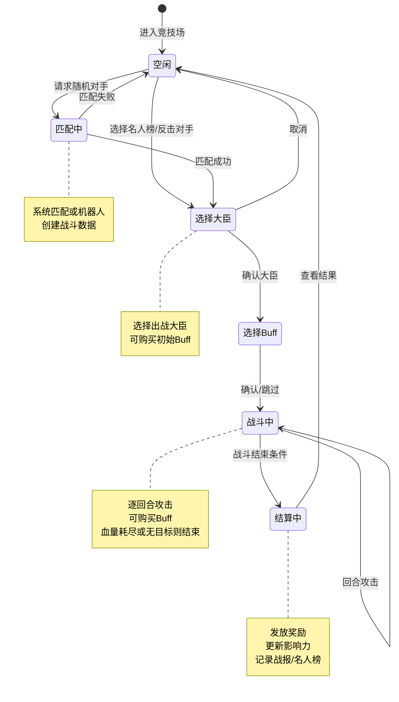
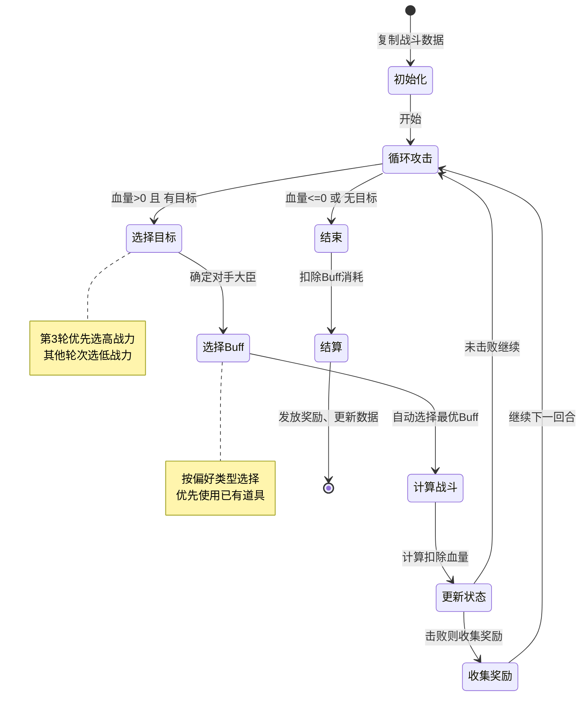
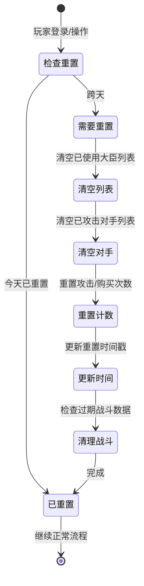

# 竞技场模块实现细节

## 一、计算公式

### 1.1 战力计算

```
实际战力 = 基础战力 * (10000 + Buff增益百分比) / 10000
```

**代码实现**：
```java
public static long calculateBuffedPower(List<Arena_SingleBuffInfo> buffList, long basePower)
{
    return (long) Math.ceil((basePower * (10000d + BuffProcessor.getBuffAddPercentage(buffList))) / 10000);
}
```

**示例**：
```
基础战力：100,000
Buff增益：攻击+20%(2000) + 防御+30%(3000) = 50%(5000)
实际战力 = 100,000 * (10000 + 5000) / 10000 = 150,000
```

### 1.2 Buff增益计算

```
总增益百分比 = Σ(单个Buff增益值 * 叠加次数)
```

**代码实现**：
```java
public static int getBuffAddPercentage(List<Arena_SingleBuffInfo> buffList)
{
    int addPer = 0;
    for (Arena_SingleBuffInfo buffInfo : buffList)
    {
        RefArenaBuff refArenaBuff = RefArenaBuff.getMgr().get(buffInfo.getBuffId());
        if (refArenaBuff == null)
            continue;
        addPer += refArenaBuff.value * buffInfo.getNum();
    }
    return addPer;
}
```

### 1.3 战斗计算

```
双方互扣血量，直到一方血量归零
攻击者伤害 = 攻击者当前血量
防御者伤害 = 防御者当前血量
攻击者剩余血量 = 攻击者血量 - 防御者伤害
防御者剩余血量 = 防御者血量 - 攻击者伤害
```

**代码实现**：
```java
public static BattleResult processBattle(long attackerPower, long defenderPower)
{
    long attackerHp = attackerPower;
    long defenderHp = defenderPower;
    long deductHp = 0;

    while (attackerHp > 0 && defenderHp > 0)
    {
        long attackerDamage = attackerHp;
        long defenderDamage = defenderHp;

        attackerHp -= defenderDamage;
        deductHp += defenderDamage;
        defenderHp -= attackerDamage;
    }

    return new BattleResult(attackerHp, defenderHp, deductHp, defenderHp <= 0);
}
```

**示例**：
```
攻击者战力(血量)：150,000
防御者战力(血量)：100,000

第1轮：
  攻击者伤害 = 150,000
  防御者伤害 = 100,000
  攻击者剩余 = 150,000 - 100,000 = 50,000
  防御者剩余 = 100,000 - 150,000 = -50,000 (死亡)

结果：攻击者胜利，扣除血量100,000
```

### 1.4 影响力计算

```
获得影响力 = 击败大臣数 * 每大臣影响力 * 倍率 * (1 + 万分比加成)
扣除影响力 = 被击败大臣数 * 每大臣扣除影响力
```

---

## 二、状态机定义

### 2.1 竞技场战斗状态机



### 2.2 一键攻击流程



### 2.3 每日重置状态机



---

## 三、关键算法

### 3.1 对手匹配算法

**目标**：匹配实力相近的对手，避免当天重复匹配

```java
private void _randomOpponentFromRank(_ICallBackResultT<Long> _callback)
{
    // 1. 获取排行榜数据
    rankFixedInfo.makeRankBaseList(false, 0, (_result, _rankBaseList) -> {

        // 2. 找到玩家排名
        int selfRank = findSelfRank(_rankBaseList);

        // 3. 计算匹配范围
        WCGPairInt randomRange = RefGeneral.Ref().arena_random_attack_match_interval;
        int minRank = Math.max(0, selfRank + randomRange.first());  // 向下范围
        int maxRank = Math.min(_rankBaseList.size() - 1, selfRank + randomRange.second());  // 向上范围

        // 4. 截取范围列表
        List<Rank_BaseItem> rangeList = _rankBaseList.subList(minRank, maxRank + 1);

        // 5. 过滤已攻击对手
        List<Rank_BaseItem> availableList = filterAvailableOpponents(rangeList);

        // 6. 如果都攻击过了，降级随机
        if (availableList.isEmpty()) {
            Rank_BaseItem opponent = rangeList.get(randomInt(0, rangeList.size() - 1));
            _callback.onRunOver(Result.SUCC, opponent.getKey());
            return;
        }

        // 7. 获取自己的历史最高实力
        final long selfMaxPower = getUserData().getPlayerComponent()
            .getParamV(ENPPlayerParam.POWER_MAX_RECORD);

        // 8. 异步获取对手实力
        List<OpponentPowerInfo> opponentPowerList = new ArrayList<>();
        AtomicInteger loadCounter = new AtomicInteger(availableList.size());

        for (Rank_BaseItem rankItem : availableList) {
            getPlayerCacheGetter().getInfo(PlayerInfo_CommonShow.class, opponentCid, (_isSuc, _cache) -> {
                if (_isSuc && _cache != null && _cache.getMaxPower() > 0) {
                    long powerDiff = Math.abs(selfMaxPower - _cache.getMaxPower());
                    opponentPowerList.add(new OpponentPowerInfo(opponentCid, _cache.getMaxPower(), powerDiff));
                }

                // 9. 所有查询完成后选择
                if (loadCounter.decrementAndGet() == 0) {
                    if (opponentPowerList.isEmpty()) {
                        // 降级随机
                        _callback.onRunOver(Result.SUCC, availableList.get(randomInt(0, availableList.size() - 1)).getKey());
                    } else {
                        // 按实力差距排序，选择最接近的
                        opponentPowerList.sort(Comparator.comparingLong(o -> o.powerDiff));
                        _callback.onRunOver(Result.SUCC, opponentPowerList.get(0).cid);
                    }
                }
            });
        }
    });
}
```

### 3.2 对手大臣选择算法

**目标**：第3轮选择高战力，其他轮次选择低战力

```java
private List<Long> _randomOpponentRoundHero()
{
    List<Hero_ArenaShowInfo> allHeroes = _m_opponentHeroList.getHeroList();
    int total = allHeroes.size();

    // 计算分界索引 (30%高战力, 70%低战力)
    int divideIndex = Math.max(0, (int) Math.ceil(total * 0.3));

    List<Long> heroIdList = new ArrayList<>();
    boolean isHighRound = ((getRound() + 1) % 3) == 0;  // 每3轮选高战力

    int start = isHighRound ? 0 : divideIndex;
    int end = isHighRound ? divideIndex : total;

    // 首轮筛选
    for (int i = start; i < end; i++) {
        Hero_ArenaShowInfo hero = allHeroes.get(i);
        if (!_m_defeatHeroList.getValueList().contains(hero.getHeroId()))
            heroIdList.add(hero.getHeroId());
    }

    // 交叉补充（不足3个时）
    if (heroIdList.size() < 3) {
        int need = 3 - heroIdList.size();
        int altStart = isHighRound ? divideIndex : 0;
        int altEnd = isHighRound ? total : divideIndex;

        for (int i = altStart; i < altEnd && need > 0; i++) {
            Hero_ArenaShowInfo hero = allHeroes.get(i);
            if (!_m_defeatHeroList.getValueList().contains(hero.getHeroId())) {
                heroIdList.add(hero.getHeroId());
                need--;
            }
        }
    }

    // 打乱顺序
    Collections.shuffle(heroIdList);

    return heroIdList.size() > 3 ? heroIdList.subList(0, 3) : heroIdList;
}
```

### 3.3 一键攻击大臣选择算法

```java
public Hero_ArenaShowInfo aKeyChooseOpponentHero()
{
    // 每3轮选高战力，其他选低战力
    if ((_m_round + 1) % 3 != 0) {
        // 倒序选择低战力
        for (int i = _m_opponentHeroList.getHeroList().size() - 1; i >= 0; i--) {
            if (!_m_hadDefeatHeroIdList.contains(_m_opponentHeroList.getHeroList().get(i).getHeroId()))
                return _m_opponentHeroList.getHeroList().get(i);
        }
    } else {
        // 正序选择高战力
        for (int i = 0; i < _m_opponentHeroList.getHeroList().size(); i++) {
            if (!_m_hadDefeatHeroIdList.contains(_m_opponentHeroList.getHeroList().get(i).getHeroId()))
                return _m_opponentHeroList.getHeroList().get(i);
        }
    }
    return null;
}
```

### 3.4 机器人生成算法

```java
private void selectRobot(RefArenaBotTemplate _refArenaBotTemplate, _ICallBackT<Result> _callback)
{
    // 1. 获取玩家数据
    long totalPower = getUserData().getHeroComponent().getTotalPower();
    int avgLevel = (int) (getUserData().getHeroComponent().getTotalHeroLevel() /
                          getUserData().getHeroComponent().getHeroNum());

    // 2. 计算机器人战力
    long robotPower = (long) (Math.ceil(totalPower * _refArenaBotTemplate.power_per / 10000d));

    // 3. 计算机器人大臣数量
    int robotHeroNum = (int) Math.ceil(
        getUserData().getHeroComponent().getHeroNum() * _refArenaBotTemplate.hero_num_per / 10000d);
    robotHeroNum = Math.min(robotHeroNum, RefGeneral.Ref().arena_bot_hero_list.size());

    // 4. 随机大臣列表
    List<Long> heroIdList = CommonFunc.getRndCount(RefGeneral.Ref().arena_bot_hero_list, robotHeroNum);
    Collections.shuffle(heroIdList);

    // 5. 分组：高战力(30%)和低战力(70%)
    int highHeroNum = (int) Math.ceil(heroIdList.size() * 0.3);
    List<Long> highHeroList = heroIdList.subList(0, highHeroNum);
    List<Long> lowHeroList = heroIdList.subList(highHeroNum, heroIdList.size());

    // 6. 生成大臣数据
    Hero_ArenaShowList allHeroList = new Hero_ArenaShowList();
    long opponentPower = 0;

    // 高战力大臣
    if (!highHeroList.isEmpty()) {
        long highTotalPower = (long) (Math.ceil(robotPower * _refArenaBotTemplate.power_per_pair.first() / 10000d));
        long highAvgPower = (long) Math.ceil((double) highTotalPower / highHeroNum);
        int highHeroLevel = (int) (Math.ceil(avgLevel * _refArenaBotTemplate.level_per_pair.first() / 10000d));

        for (Long heroId : highHeroList) {
            Hero_ArenaShowInfo heroInfo = new Hero_ArenaShowInfo();
            heroInfo.setHeroId(heroId);
            heroInfo.setPower(highAvgPower);
            heroInfo.setLevel(highHeroLevel);
            allHeroList.addHeroList(heroInfo);
        }
        opponentPower += highAvgPower * highHeroNum;
    }

    // 低战力大臣
    if (!lowHeroList.isEmpty()) {
        long lowTotalPower = (long) (Math.ceil(robotPower * _refArenaBotTemplate.power_per_pair.second() / 10000d));
        long lowAvgPower = (long) Math.ceil((double) lowTotalPower / lowHeroList.size());
        int lowHeroLevel = (int) (Math.ceil(avgLevel * _refArenaBotTemplate.level_per_pair.second() / 10000d));

        for (Long heroId : lowHeroList) {
            Hero_ArenaShowInfo heroInfo = new Hero_ArenaShowInfo();
            heroInfo.setHeroId(heroId);
            heroInfo.setPower(lowAvgPower);
            heroInfo.setLevel(lowHeroLevel);
            allHeroList.addHeroList(heroInfo);
        }
        opponentPower += lowAvgPower * lowHeroList.size();
    }

    // 7. 创建战斗数据
    PlayerArenaBattleBO bo = new PlayerArenaBattleBO();
    bo.setOpponentCid(getUSServer().getBM(), 0);
    bo.setOpponentHeroList(getUSServer().getBM(), allHeroList.makePackage().array());
    bo.setOpponentPower(getUSServer().getBM(), opponentPower);
    bo.setIsBot(getUSServer().getBM(), true);
    // ...
}
```

---

## 四、数据约束

### 4.1 竞技场玩家数据约束

| 字段名 | 数据类型 | 取值范围 | 必填 | 说明 |
|--------|----------|----------|------|------|
| cid | long | > 0 | 是 | 玩家CID |
| last_reset_time_ms | long | >= 0 | 是 | 上次重置时间 |
| had_select_attack_num | int | >= 0 | 是 | 已指定攻击次数 |
| had_random_attack_num | int | >= 0 | 是 | 已随机攻击次数 |
| had_buy_random_attack_num | int | >= 0 | 是 | 已购买次数 |
| had_unlock_arena | boolean | - | 是 | 是否解锁 |

### 4.2 战斗数据约束

| 字段名 | 数据类型 | 取值范围 | 必填 | 说明 |
|--------|----------|----------|------|------|
| round | int | >= 0 | 是 | 当前回合数 |
| had_buy_buff | boolean | - | 是 | 本轮是否已购买buff |
| hero_id | long | > 0 | 是 | 出战大臣ID |
| base_power | long | > 0 | 是 | 基础战力 |
| deducted_hp | long | >= 0 | 是 | 已扣除血量 |
| attack_type | int | 0-2 | 是 | 攻击类型 |
| opponent_cid | long | >= 0 | 是 | 对手CID(0为机器人) |
| is_bot | boolean | - | 是 | 是否机器人 |

### 4.3 战报数据约束

| 字段名 | 数据类型 | 取值范围 | 必填 | 说明 |
|--------|----------|----------|------|------|
| cid | long | > 0 | 是 | 玩家CID |
| opponent_cid | long | > 0 | 是 | 对手CID |
| defeat_hero_num | int | >= 0 | 是 | 击败数量 |
| deduct_influence | int | >= 0 | 是 | 扣除影响力 |
| timestamp | long | > 0 | 是 | 时间戳 |
| from_celebrity_rand | boolean | - | 是 | 是否来自名人榜 |

---

## 五、错误处理策略

### 5.1 竞技场模块错误码

| 错误码 | 错误信息 | 处理策略 | 用户提示 |
|--------|----------|----------|----------|
| 23001 | 大臣数量不足 | 检查解锁条件 | "大臣数量不足，无法进入竞技场" |
| 23002 | 已有对手 | 检查战斗状态 | "已有进行中的战斗" |
| 23003 | 尚未选择对手 | 引导匹配 | "请先选择对手" |
| 23004 | 未找到对手 | 重新匹配 | "匹配失败，请重试" |
| 23005 | 加载对手数据失败 | 重新匹配 | "获取对手信息失败" |
| 23006 | 对手大臣不存在 | 刷新数据 | "对手大臣信息异常" |
| 23007 | 大臣已使用 | 选择其他大臣 | "该大臣今日已使用" |
| 23008 | 指定攻击次数已用完 | 引导购买或明天再战 | "今日指定攻击次数已用完" |
| 23009 | 随机攻击次数已用完 | 引导购买或明天再战 | "今日随机攻击次数已用完" |
| 23010 | 购买次数已达上限 | 提示明天重置 | "购买次数已达上限" |
| 23011 | 本回合已购买Buff | 等待下回合 | "本回合已购买Buff" |
| 23012 | 当前回合不可购买此Buff | 查看可用Buff | "当前回合不可购买此Buff" |
| 23013 | 血量已耗尽 | 结束战斗 | "血量已耗尽，战斗结束" |

### 5.2 异常场景处理

| 异常场景 | 处理方式 | 用户影响 |
|----------|----------|----------|
| 战斗数据过期 | 重置战斗状态 | 需要重新匹配 |
| 对手下线 | 正常战斗，使用缓存数据 | 无影响 |
| 网络中断 | 保存战斗进度 | 恢复后可继续 |
| 跨天重置 | 自动清理过期数据 | 可能丢失进行中的战斗 |

---

## 六、性能优化建议

### 6.1 缓存策略

1. **对手缓存**：使用 `PlayerCacheGetter` 异步获取对手数据
2. **排行榜缓存**：排行榜数据内存缓存，定时更新
3. **战报缓存**：登录时加载，内存中限制数量

### 6.2 数据库优化

1. **索引**：
   - `player_arena`: cid 索引
   - `player_arena_battle`: cid 索引
   - `player_arena_fight_report`: cid 索引
   - `arena_celebrity_rank`: 无需索引（全表扫描）

2. **分表**：战报数据可按时间分表

3. **归档**：历史赛季数据归档存储

### 6.3 异步处理

1. **对手匹配**：异步查询排行榜和对手缓存
2. **战报发送**：异步发送战报给被攻击者
3. **名人榜更新**：异步更新名人榜数据

### 6.4 代码优化

```java
// 批量获取对手实力（并发查询）
List<OpponentPowerInfo> opponentPowerList = Collections.synchronizedList(new ArrayList<>());
AtomicInteger loadCounter = new AtomicInteger(availableList.size());

for (Rank_BaseItem rankItem : availableList) {
    getUSServer().getPlayerCacheGetter().getDealer(PlayerInfo_CommonShow.class)
        .getInfo(opponentCid, (_isSucc, _opponentCache) -> {
            // 并发处理
            if (loadCounter.decrementAndGet() == 0) {
                // 所有查询完成后统一处理
                processResults(opponentPowerList);
            }
        });
}
```

---

## 七、日志记录

### 7.1 战斗日志

```java
MJEventLog.logArenaBattle(
    userData,
    heroId,                    // 伙伴id
    opponentCid,               // 对手cid
    opponentTotalHp,           // 对手总血量
    defeatHeroNum,             // 击败对手伙伴数量
    initialHp,                 // 起始血量
    finalHp,                   // 剩余血量
    buffDetail,                // 增益明细
    gainInfluence              // 变更积分
);
```

### 7.2 解锁日志

```java
LogArenaUnlockBO logBo = new LogArenaUnlockBO();
logBo.setCid(getCid());
logBo.setLevel((int) getUserData().getParam(ENPPlayerParam.LEVEL));
logBo.setEarnings(getUserData().getPlayerComponent().getEarnings());
logBo.setPower(getUserData().getHeroComponent().getTotalPower());
CommLogDB.log(getUSServer().getBM(), logBo, _context);
```

---

*文档生成时间: 2026-04-11*