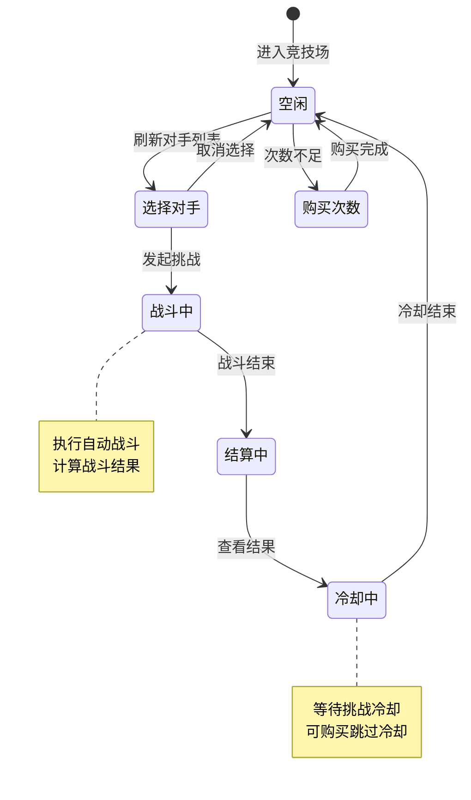
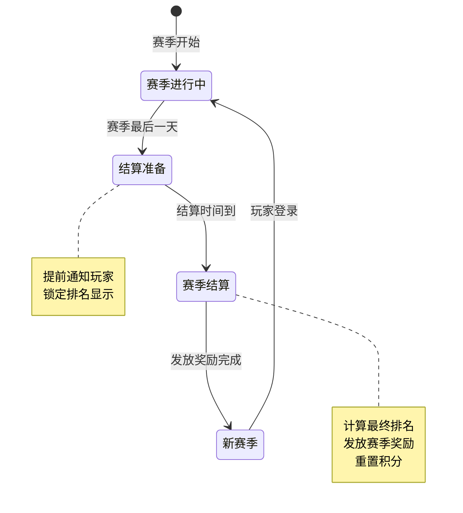
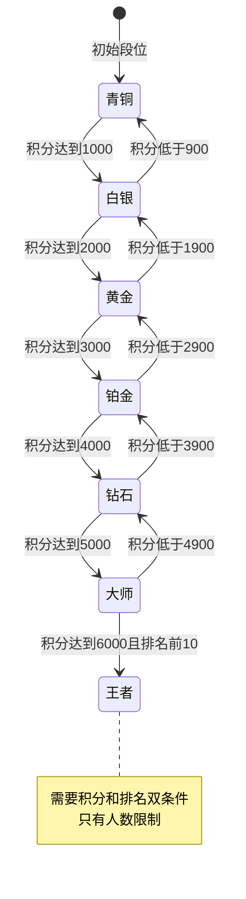

# 竞技场模块实现细节

## 一、计算公式

### 1.1 匹配范围计算

```
匹配范围 = [当前排名 - 向下范围, 当前排名 + 向上范围]
向下范围 = min(排名 × 0.2, 500)
向上范围 = min(排名 × 0.1, 200)
```

**示例**：
```
当前排名：1000
向下范围：min(1000 × 0.2, 500) = 200
向上范围：min(1000 × 0.1, 200) = 100
匹配范围：[800, 1100]
```

### 1.2 战斗胜率计算

```
基础胜率 = 50%
战力差加成 = (己方战力 - 敌方战力) / 敌方战力 × 50%
阵容克制加成 = 克制关系系数 × 10%
最终胜率 = clamp(基础胜率 + 战力差加成 + 阵容克制加成, 5%, 95%)
```

**示例**：
```
己方战力：60,000
敌方战力：50,000
克制关系：有利克制（系数+1）

战力差加成 = (60000 - 50000) / 50000 × 50% = 10%
阵容克制加成 = 1 × 10% = 10%
最终胜率 = 50% + 10% + 10% = 70%
```

### 1.3 排名积分计算

```
胜利积分 = 基础积分 + 排名差加成
排名差加成 = min((对手排名 - 己方排名) × 0.1, 50)
失败积分损失 = 基础扣分
```

**示例**：
```
己方排名：100
对手排名：50
胜利积分 = 10 + min((100 - 50) × 0.1, 50) = 10 + 5 = 15分
```

### 1.4 赛季重置公式

```
新赛季初始积分 = 旧赛季最终积分 × 重置系数 + 保底积分
重置系数 = 0.5（保留一半积分）
保底积分 = 1000
```

**示例**：
```
旧赛季最终积分：3000
新赛季初始积分 = 3000 × 0.5 + 1000 = 2500
```

---

## 二、状态机定义

### 2.1 竞技场挑战状态机



### 2.2 赛季状态机



### 2.3 段位状态机



---

## 三、数据约束

### 3.1 竞技场玩家数据约束

| 字段名 | 数据类型 | 取值范围 | 必填 | 说明 |
|--------|----------|----------|------|------|
| playerId | long | > 0 | 是 | 玩家ID |
| rank | int | >= 1 | 是 | 当前排名 |
| score | int | >= 0 | 是 | 竞技积分 |
| tier | int | 1-7 | 是 | 段位等级 |
| winCount | int | >= 0 | 是 | 胜利次数 |
| loseCount | int | >= 0 | 是 | 失败次数 |
| todayChallenge | int | 0-15 | 是 | 今日挑战次数 |
| lastChallengeTime | datetime | - | 否 | 上次挑战时间 |

### 3.2 防守阵容数据约束

| 字段名 | 数据类型 | 取值范围 | 必填 | 说明 |
|--------|----------|----------|------|------|
| playerId | long | > 0 | 是 | 玩家ID |
| heroIds | array | 长度3-6 | 是 | 防守英雄ID列表 |
| updateTime | datetime | - | 是 | 更新时间 |

### 3.3 战报数据约束

| 字段名 | 数据类型 | 取值范围 | 必填 | 说明 |
|--------|----------|----------|------|------|
| reportId | long | > 0 | 是 | 战报ID |
| attackerId | long | > 0 | 是 | 进攻方ID |
| defenderId | long | > 0 | 是 | 防守方ID |
| result | int | 0-1 | 是 | 结果：0防守胜,1进攻胜 |
| rankChange | int | - | 是 | 排名变化 |
| battleTime | datetime | - | 是 | 战斗时间 |

---

## 四、错误处理策略

### 4.1 竞技场模块错误码

| 错误码 | 错误信息 | 处理策略 | 用户提示 |
|--------|----------|----------|----------|
| 23001 | 竞技场未解锁 | 检查解锁条件 | "竞技场功能尚未解锁" |
| 23002 | 挑战次数不足 | 引导购买次数 | "挑战次数不足，是否购买？" |
| 23003 | 挑战冷却中 | 显示剩余时间 | "请等待X分钟后再次挑战" |
| 23004 | 对手不存在 | 刷新对手列表 | "对手信息异常，请刷新列表" |
| 23005 | 不能挑战自己 | 自动过滤 | "不能挑战自己" |
| 23006 | 对手排名变化 | 刷新对手列表 | "对手排名已变化，请刷新" |
| 23007 | 防守阵容为空 | 引导设置阵容 | "请先设置防守阵容" |
| 23008 | 赛季结算中 | 显示结算进度 | "赛季正在结算中，请稍后" |

### 4.2 战斗异常处理

| 异常场景 | 处理方式 | 用户影响 |
|----------|----------|----------|
| 战斗超时 | 判进攻方失败 | 需要重新挑战 |
| 数据不同步 | 重新加载数据 | 可能丢失进度 |
| 网络中断 | 保存战斗状态 | 恢复后可继续 |

---

## 五、关键代码示例

### 5.1 获取对手列表伪代码

```csharp
public List<ArenaOpponent> GetOpponents(long playerId)
{
    ArenaPlayerInfo player = arenaService.GetPlayerInfo(playerId);

    // 计算匹配范围
    int lowerBound = Math.Max(1, player.rank - (int)(player.rank * 0.2));
    int upperBound = player.rank + (int)(player.rank * 0.1);

    // 随机选择对手
    List<ArenaPlayerInfo> candidates = arenaService.GetPlayersByRankRange(
        lowerBound, upperBound, excludePlayerId: playerId);

    // 随机抽取3个对手
    List<ArenaOpponent> opponents = new List<ArenaOpponent>();
    var selected = candidates.OrderBy(x => Guid.NewGuid()).Take(3);

    foreach (var candidate in selected)
    {
        opponents.Add(new ArenaOpponent {
            playerId = candidate.playerId,
            nickname = playerService.GetNickname(candidate.playerId),
            rank = candidate.rank,
            power = CalculateTeamPower(candidate.playerId),
            heroes = GetDefenseHeroes(candidate.playerId)
        });
    }

    return opponents;
}
```

### 5.2 执行挑战伪代码

```csharp
public Result ExecuteChallenge(long attackerId, long defenderId)
{
    // 1. 检查挑战条件
    ArenaPlayerInfo attacker = arenaService.GetPlayerInfo(attackerId);
    if (attacker.todayChallenge >= GetMaxChallengeCount(attackerId))
        return Result.Error(23002, "挑战次数不足");

    if (IsInCooldown(attackerId))
        return Result.Error(23003, "挑战冷却中");

    // 2. 获取双方数据
    ArenaPlayerInfo defender = arenaService.GetPlayerInfo(defenderId);
    if (defender == null)
        return Result.Error(23004, "对手不存在");

    // 3. 获取战斗阵容
    List<HeroInfo> attackTeam = GetAttackTeam(attackerId);
    List<HeroInfo> defenseTeam = GetDefenseTeam(defenderId);

    // 4. 执行战斗计算
    BattleResult battleResult = battleService.Calculate(attackTeam, defenseTeam);

    // 5. 更新挑战次数
    attacker.todayChallenge++;
    attacker.lastChallengeTime = DateTime.Now;

    // 6. 处理排名变化
    bool rankChanged = false;
    if (battleResult.isWin && attacker.rank > defender.rank)
    {
        // 交换排名
        int tempRank = attacker.rank;
        attacker.rank = defender.rank;
        defender.rank = tempRank;
        rankChanged = true;
        arenaService.UpdatePlayerInfo(defender);
    }

    // 7. 更新统计数据
    if (battleResult.isWin)
        attacker.winCount++;
    else
        attacker.loseCount++;

    arenaService.UpdatePlayerInfo(attacker);

    // 8. 发放奖励
    List<RewardItem> rewards = CalculateChallengeReward(battleResult.isWin);
    bagService.AddItems(attackerId, rewards);

    // 9. 记录战报
    arenaService.CreateBattleReport(new BattleReport {
        attackerId = attackerId,
        defenderId = defenderId,
        result = battleResult.isWin ? 1 : 0,
        rankChange = rankChanged ? Math.Abs(attacker.rank - defender.rank) : 0,
        battleTime = DateTime.Now
    });

    // 10. 推送结果
    PushChallengeResult(attackerId, battleResult, rewards, rankChanged);

    return Result.Success(new { battleResult, rewards, rankChanged });
}
```

### 5.3 赛季结算伪代码

```csharp
public void SeasonSettlement()
{
    // 1. 锁定竞技场
    arenaService.LockArena();

    // 2. 获取所有玩家排名
    List<ArenaRankInfo> allRanks = arenaService.GetAllRankings();

    // 3. 按排名发放奖励
    foreach (var rankInfo in allRanks)
    {
        // 计算赛季奖励
        List<RewardItem> rewards = CalculateSeasonReward(rankInfo.rank, rankInfo.tier);
        bagService.AddItems(rankInfo.playerId, rewards);

        // 发送赛季结算邮件
        mailService.SendMail(rankInfo.playerId, new MailInfo {
            title = "赛季结算奖励",
            content = $"恭喜您在第{currentSeason}赛季获得第{rankInfo.rank}名！",
            attachments = rewards
        });

        // 重置积分
        rankInfo.score = (int)(rankInfo.score * 0.5) + 1000;
        arenaService.UpdatePlayerInfo(rankInfo);
    }

    // 4. 记录赛季历史
    seasonService.SaveSeasonHistory(currentSeason, allRanks);

    // 5. 开启新赛季
    currentSeason++;
    arenaService.UnlockArena();

    // 6. 推送赛季公告
    PushSeasonAnnouncement(currentSeason);
}
```

---

## 六、性能优化建议

### 6.1 排名缓存

1. **实时排名缓存**：Redis Sorted Set 存储实时排名
2. **批量更新**：排名变化批量写入数据库
3. **预计算**：定时预计算排名奖励

### 6.2 战斗计算优化

1. **战斗缓存**：相同阵容的战斗结果缓存
2. **异步计算**：战斗计算异步执行
3. **模拟简化**：简化战斗计算逻辑

### 6.3 数据库优化

1. **分表**：战报数据按时间分表
2. **索引**：playerId、rank 字段索引
3. **归档**：历史赛季数据归档存储

---

*文档生成时间: 2026-04-06*
