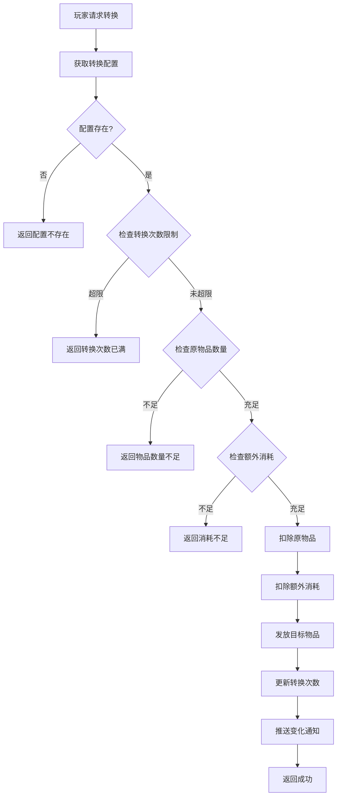
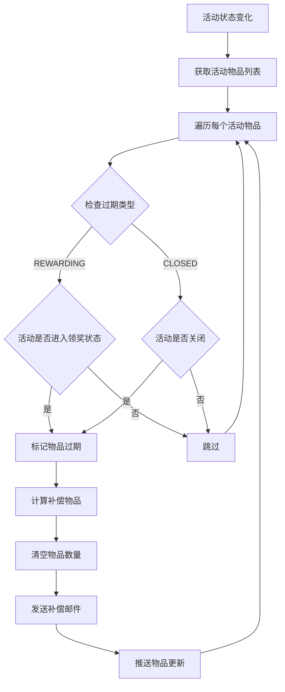
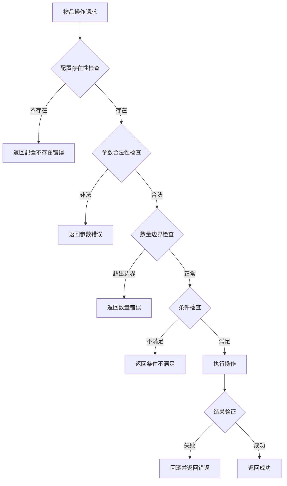
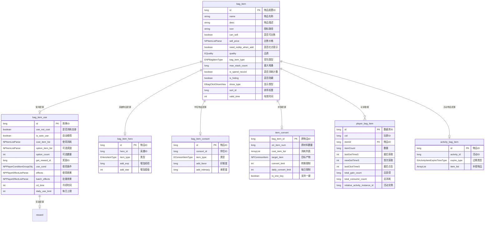
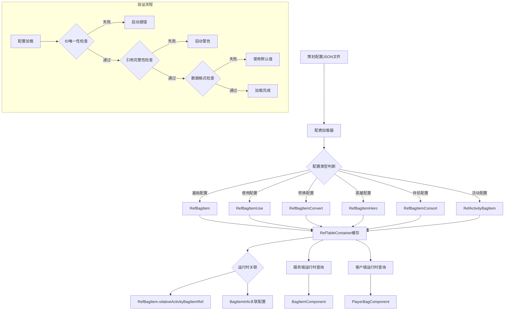
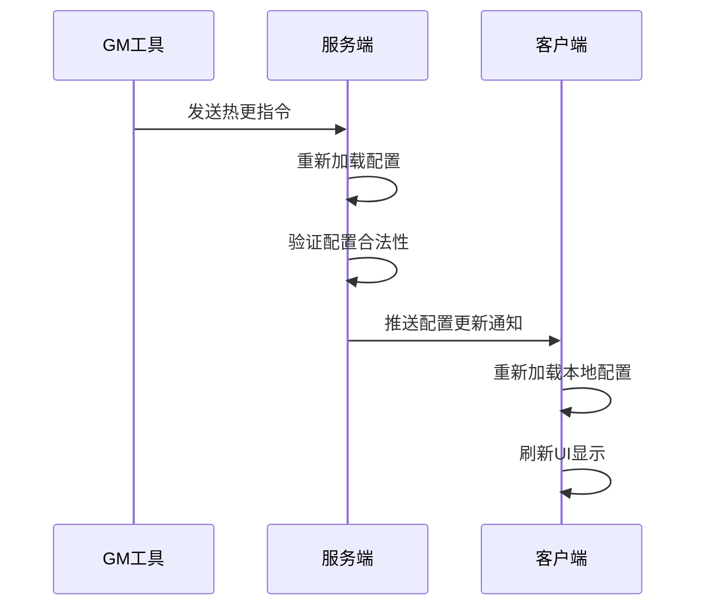

# 背包模块数据配表文档

## 配表说明

背包模块相关的配置数据主要存储在以下配表中。所有配表采用 JSON 格式定义，通过 `RefTable` 注解关联数据库表名。

---

## 一、物品基础配表

### RefBagItem - 物品配置

**文件**: `bag_item` (数据库表名)

**路径**: `game_server/GameRes/src/NPGameRes/Refs/BagItem/RefBagItem.java`

#### 1.1 完整字段列表

| 字段名 | 类型 | 必填 | 默认值 | 说明 | 示例值 |
|--------|------|------|--------|------|--------|
| id | long | 是 | - | 物品配置ID (主键) | 10001 |
| name | String | 是 | - | 物品名称 | 初级体力药水 |
| desc | String | 否 | "" | 物品描述 | 恢复20点体力 |
| icon | String | 是 | - | 图标资源路径 | item/item_10001 |
| can_sell | boolean | 是 | false | 是否可出售 | true |
| sell_price | NPItemListParse | 否 | [] | 出售价格列表 | [{"itemType":1,"itemId":1001,"count":100}] |
| need_redtip_when_add | boolean | 是 | false | 数量累加时是否需要小红点提示 | true |
| quality | EQuality | 是 | NONE | 品质枚举 | EQuality.BLUE |
| bag_item_type | ENPBagItemType | 是 | NONE | 背包物品类型 | ENPBagItemType.RES |
| max_stack_count | long | 是 | 99 | 最大堆叠数量 | 99 |
| is_spend_record | boolean | 是 | false | 是否花费进入累计计数 | false |
| is_hiding | boolean | 是 | false | 是否隐藏(不在背包显示) | false |
| show_type | EBagClickShowView | 是 | NONE | 点击显示类型 | EBagClickShowView.USE |
| sort_id | long | 是 | 0 | 排序权重 | 1000 |
| valid_time | int | 否 | 0 | 有效时间(秒,0表示永久) | 86400 |
| relativeActivityBagItemRef | RefActivityBagItem | 否 | null | 关联活动物品配置 (运行时填充) | - |

#### 1.2 品质枚举 EQuality

**路径**: `game_server/ClientProtocol/NPEnum/EQuality.cs`

| 枚举值 | 数值 | 说明 | 颜色 | HEX值 |
|--------|------|------|------|-------|
| NONE | 0 | 无品质 | - | - |
| WHITE | 1 | 普通 | 白色 | #FFFFFF |
| GREEN | 2 | 优秀 | 绿色 | #00FF00 |
| BLUE | 3 | 精良 | 蓝色 | #0080FF |
| PURPLE | 4 | 史诗 | 紫色 | #A020F0 |
| ORANGE | 5 | 传说 | 橙色 | #FF8000 |
| RED | 6 | 神话 | 红色 | #FF0000 |

```csharp
public enum EQuality {
    NONE = 0,     // 无品质
    WHITE = 1,    // 普通 - 白色
    GREEN = 2,    // 优秀 - 绿色
    BLUE = 3,     // 精良 - 蓝色
    PURPLE = 4,   // 史诗 - 紫色
    ORANGE = 5,   // 传说 - 橙色
    RED = 6,      // 神话 - 红色
}
```

#### 1.3 点击显示类型 EBagClickShowView

**路径**: `game_server/ClientProtocol/NPEnum/EBagClickShowView.cs`

| 枚举值 | 数值 | 说明 |
|--------|------|------|
| NONE | 0 | 无操作 |
| USE | 1 | 显示使用界面 |
| CONVERT | 2 | 显示转换界面 |
| USE_AND_CONVERT | 3 | 显示使用和转换界面 |
| DETAIL | 4 | 仅显示详情 |

```csharp
public enum EBagClickShowView {
    NONE = 0,           // 无操作
    USE = 1,            // 使用界面
    CONVERT = 2,        // 转换界面
    USE_AND_CONVERT = 3, // 使用+转换界面
    DETAIL = 4,         // 仅详情
}
```

#### 1.4 配置示例

**示例1: 基础消耗品**
```json
{
  "id": 10001,
  "name": "初级体力药水",
  "desc": "恢复20点体力",
  "icon": "item/item_10001",
  "can_sell": true,
  "sell_price": [{"itemType": 1, "itemId": 1001, "count": 100}],
  "need_redtip_when_add": true,
  "quality": "WHITE",
  "bag_item_type": "RES",
  "max_stack_count": 99,
  "is_spend_record": false,
  "is_hiding": false,
  "show_type": "USE",
  "sort_id": 1000
}
```

**示例2: 高级礼包**
```json
{
  "id": 20001,
  "name": "新手豪华礼包",
  "desc": "包含丰厚奖励的新手礼包",
  "icon": "item/item_20001",
  "can_sell": false,
  "sell_price": [],
  "need_redtip_when_add": true,
  "quality": "BLUE",
  "bag_item_type": "FUNCTION",
  "max_stack_count": 1,
  "is_spend_record": false,
  "is_hiding": false,
  "show_type": "USE",
  "sort_id": 2000
}
```

**示例3: 英雄碎片**
```json
{
  "id": 30001,
  "name": "骑士·亚瑟碎片",
  "desc": "集齐50个可召唤骑士亚瑟",
  "icon": "item/item_30001",
  "can_sell": true,
  "sell_price": [{"itemType": 1, "itemId": 1001, "count": 50}],
  "need_redtip_when_add": true,
  "quality": "PURPLE",
  "bag_item_type": "HERO",
  "max_stack_count": 999,
  "is_spend_record": true,
  "is_hiding": false,
  "show_type": "CONVERT",
  "sort_id": 3000
}
```

**示例4: 活动限定物品**
```json
{
  "id": 40001,
  "name": "春节红包",
  "desc": "春节期间限时获得的红包",
  "icon": "item/item_40001",
  "can_sell": false,
  "sell_price": [],
  "need_redtip_when_add": true,
  "quality": "ORANGE",
  "bag_item_type": "FUNCTION",
  "max_stack_count": 99,
  "is_spend_record": false,
  "is_hiding": false,
  "show_type": "USE",
  "sort_id": 4000,
  "valid_time": 2592000
}
```

**示例5: 隐藏物品(系统内部使用)**
```json
{
  "id": 50001,
  "name": "系统测试道具",
  "desc": "仅供系统测试使用",
  "icon": "item/item_50001",
  "can_sell": false,
  "sell_price": [],
  "need_redtip_when_add": false,
  "quality": "NONE",
  "bag_item_type": "OTHER",
  "max_stack_count": 9999,
  "is_spend_record": false,
  "is_hiding": true,
  "show_type": "NONE",
  "sort_id": 0
}
```

---

## 二、物品使用效果配表

### RefBagItemUse - 物品使用配置

**文件**: `bag_item_use` (数据库表名)

**路径**: `game_server/GameRes/src/NPGameRes/Refs/BagItem/RefBagItemUse.java`

#### 2.1 完整字段列表

| 字段名 | 类型 | 必填 | 默认值 | 说明 | 示例值 |
|--------|------|------|--------|------|--------|
| id | long | 是 | - | 效果ID (对应物品ID) | 10001 |
| use_not_cost | boolean | 是 | false | 使用时是否不消耗自身 | false |
| is_auto_use | boolean | 是 | false | 获得时是否自动使用 | false |
| cost_item_list | NPItemListParse | 否 | [] | 使用消耗列表 | [{"itemType":1,"itemId":1001,"count":10}] |
| option_item_list | NPItemListParse | 否 | [] | 可选奖励列表 | [] |
| option_count | int | 是 | 0 | 可选数量 | 1 |
| get_reward_id | long | 否 | 0 | 使用获得的reward_id | 10001 |
| is_pre_high_pri | boolean | 是 | false | 前置效果是否更高优先级 | false |
| pre_use_cond | NPPlayerConditionGroupObj | 否 | null | 前置使用效果的使用条件 | - |
| pre_effects | NPPlayerEffectListParse | 否 | [] | 前置使用效果 | - |
| use_cond | NPPlayerConditionGroupObj | 是 | - | 使用条件 | - |
| effects | NPPlayerEffectListParse | 否 | [] | 使用效果 | - |
| batch_effects | NPPlayerEffectListParse | 否 | [] | 批量使用效果 | - |
| cd_time | int | 是 | 0 | 冷却时间(秒) | 60 |
| daily_use_limit | int | 是 | 0 | 每日使用上限(0表示无限) | 3 |
| total_use_limit | int | 是 | 0 | 总使用上限(0表示无限) | 0 |
| tip_reward | ENpRewardShowType | 是 | NONE | 是否使用tip样式展示奖励 | NONE |
| tip_reward_multiple | ENpRewardShowType | 是 | NONE | 多个使用表现tip样式展示 | NONE |
| use_broadcast | String | 否 | "" | 使用后广播消息模板 | "玩家使用了{item_name}" |

#### 2.2 使用条件类型

**NPPlayerConditionGroupObj 条件类型**:

| 条件类型 | 参数说明 | 示例 |
|----------|----------|------|
| LEVEL | 等级限制 | {"type": "LEVEL", "min": 10, "max": 100} |
| VIP_LEVEL | VIP等级限制 | {"type": "VIP_LEVEL", "min": 1} |
| SCENE | 场景限制 | {"type": "SCENE", "sceneIds": [1, 2, 3]} |
| TIME_RANGE | 时间范围限制 | {"type": "TIME_RANGE", "start": "09:00", "end": "22:00"} |
| SERVER_OPEN_DAY | 开服天数限制 | {"type": "SERVER_OPEN_DAY", "min": 1, "max": 7} |

#### 2.3 使用效果类型

**NPPlayerEffectListParse 效果类型**:

| 效果类型 | 参数说明 | 示例 |
|----------|----------|------|
| ADD_ITEM | 增加物品 | {"type": "ADD_ITEM", "itemType": 1, "itemId": 1001, "count": 100} |
| ADD_RESOURCE | 增加资源 | {"type": "ADD_RESOURCE", "resourceType": "GOLD", "count": 1000} |
| ADD_EXP | 增加经验 | {"type": "ADD_EXP", "count": 1000} |
| ADD_HERO_EXP | 增加英雄经验 | {"type": "ADD_HERO_EXP", "heroId": 1001, "count": 500} |
| RANDOM_ITEM | 随机物品 | {"type": "RANDOM_ITEM", "poolId": 10001, "count": 1} |
| TRIGGER_EVENT | 触发事件 | {"type": "TRIGGER_EVENT", "eventId": "ITEM_USE_10001"} |

#### 2.4 配置示例

**示例1: 普通消耗品使用配置**
```json
{
  "id": 10001,
  "use_not_cost": false,
  "is_auto_use": false,
  "cost_item_list": [],
  "option_item_list": [],
  "option_count": 0,
  "get_reward_id": 10001,
  "is_pre_high_pri": false,
  "use_cond": {
    "conditions": [
      {"type": "LEVEL", "min": 1}
    ]
  },
  "effects": [
    {"type": "ADD_RESOURCE", "resourceType": "STAMINA", "count": 20}
  ],
  "batch_effects": [
    {"type": "ADD_RESOURCE", "resourceType": "STAMINA", "count": 20}
  ],
  "cd_time": 0,
  "daily_use_limit": 0,
  "tip_reward": "TIP"
}
```

**示例2: 礼包使用配置(可选奖励)**
```json
{
  "id": 20001,
  "use_not_cost": false,
  "is_auto_use": false,
  "cost_item_list": [],
  "option_item_list": [
    {"itemType": 2, "itemId": 1001, "count": 1},
    {"itemType": 2, "itemId": 1002, "count": 1},
    {"itemType": 2, "itemId": 1003, "count": 1}
  ],
  "option_count": 1,
  "get_reward_id": 0,
  "use_cond": {"conditions": []},
  "effects": [
    {"type": "ADD_ITEM", "itemType": 1, "itemId": 1001, "count": 1000},
    {"type": "ADD_ITEM", "itemType": 1, "itemId": 1002, "count": 500}
  ],
  "tip_reward": "TIP"
}
```

**示例3: 自动使用物品配置**
```json
{
  "id": 30001,
  "use_not_cost": false,
  "is_auto_use": true,
  "cost_item_list": [],
  "option_item_list": [],
  "option_count": 0,
  "get_reward_id": 0,
  "use_cond": {"conditions": []},
  "effects": [
    {"type": "ADD_RESOURCE", "resourceType": "GOLD", "count": 100}
  ],
  "tip_reward": "NONE"
}
```

**示例4: 有冷却时间的物品配置**
```json
{
  "id": 40001,
  "use_not_cost": false,
  "is_auto_use": false,
  "cost_item_list": [],
  "option_item_list": [],
  "option_count": 0,
  "get_reward_id": 40001,
  "use_cond": {
    "conditions": [
      {"type": "LEVEL", "min": 30},
      {"type": "VIP_LEVEL", "min": 3}
    ]
  },
  "effects": [
    {"type": "ADD_RESOURCE", "resourceType": "STAMINA", "count": 100}
  ],
  "cd_time": 3600,
  "daily_use_limit": 3,
  "tip_reward": "TIP"
}
```

**示例5: 前置效果配置**
```json
{
  "id": 50001,
  "use_not_cost": false,
  "is_auto_use": false,
  "cost_item_list": [],
  "option_item_list": [],
  "option_count": 0,
  "get_reward_id": 50001,
  "is_pre_high_pri": true,
  "pre_use_cond": {
    "conditions": [
      {"type": "LEVEL", "min": 50}
    ]
  },
  "pre_effects": [
    {"type": "ADD_RESOURCE", "resourceType": "GOLD", "count": 10000}
  ],
  "use_cond": {"conditions": []},
  "effects": [
    {"type": "ADD_ITEM", "itemType": 2, "itemId": 5001, "count": 1}
  ],
  "tip_reward": "TIP"
}
```

---

## 三、物品转换配表

### RefBagItemConvert - 物品转换配置

**文件**: `item_convert` (数据库表名)

**路径**: `game_server/GameRes/src/NPGameRes/Refs/BagItem/RefBagItemConvert.java`

#### 3.1 完整字段列表

| 字段名 | 类型 | 必填 | 默认值 | 说明 | 示例值 |
|--------|------|------|--------|------|--------|
| bag_item_id | long | 是 | - | 原物品ID (主键) | 10001 |
| ori_item_num | long | 是 | - | 原材料数量 | 5 |
| cost_item_list | ArrayList\<NPCommonCostItem\> | 否 | [] | 消耗列表 | [{"itemType":1,"itemId":1001,"count":100}] |
| target_item | NPCommonItem | 是 | - | 目标产物 | {"itemType":2,"itemId":2001,"count":1} |
| convert_limit | int | 是 | 0 | 转换次数限制(0表示无限) | 10 |
| daily_convert_limit | int | 是 | 0 | 每日转换限制(0表示无限) | 3 |
| is_one_key | boolean | 是 | true | 是否支持一键转换 | true |

#### 3.2 配置示例

**示例1: 基础转换(碎片合成)**
```json
{
  "bag_item_id": 30001,
  "ori_item_num": 50,
  "cost_item_list": [
    {"itemType": 1, "itemId": 1001, "count": 10000}
  ],
  "target_item": {"itemType": 3, "itemId": 1001, "count": 1},
  "convert_limit": 0,
  "daily_convert_limit": 0,
  "is_one_key": true
}
```

**示例2: 材料转换**
```json
{
  "bag_item_id": 10001,
  "ori_item_num": 5,
  "cost_item_list": [
    {"itemType": 1, "itemId": 1001, "count": 100}
  ],
  "target_item": {"itemType": 2, "itemId": 2001, "count": 1},
  "convert_limit": 0,
  "daily_convert_limit": 0,
  "is_one_key": true
}
```

**示例3: 限制次数转换**
```json
{
  "bag_item_id": 50001,
  "ori_item_num": 10,
  "cost_item_list": [],
  "target_item": {"itemType": 2, "itemId": 5001, "count": 1},
  "convert_limit": 5,
  "daily_convert_limit": 1,
  "is_one_key": false
}
```

#### 3.3 转换计算公式

```
总消耗 = 原道具数量 + 消耗列表
转换产出数量 = floor(原道具数量 / ori_item_num) × target_item.count
```

#### 3.4 服务端计算方法

```java
/**
 * 计算总消耗(包括原道具)
 * @param _count 转换次数
 * @return 消耗列表
 */
public List<NPCommonCostItem> calConvertTotalConsume(int _count)
{
    List<NPCommonCostItem> items = new ArrayList<>();
    items.add(new NPCommonCostItem(ENPItemType.BAG_ITEM, bag_item_id, ori_item_num));
    for (NPCommonCostItem costItem : cost_item_list)
    {
        items.add(new NPCommonCostItem(costItem.getItemType(), costItem.getItemId(), costItem.getCount()));
    }
    return CommonFunc.itemMultiple(items, _count);
}

/**
 * 计算转换消耗(手续费)
 * @param _count 转换次数
 */
public List<NPCommonCostItem> calConvertConsume(int _count)
{
    List<NPCommonCostItem> items = new ArrayList<>();
    for (NPCommonCostItem costItem : cost_item_list)
    {
        items.add(new NPCommonCostItem(costItem.getItemType(), costItem.getItemId(), costItem.getCount()));
    }
    return CommonFunc.itemMultiple(items, _count);
}

/**
 * 计算可转换的最大次数
 * @param _oriItemCount 原道具拥有数量
 * @return 最大转换次数
 */
public int calMaxConvertCount(long _oriItemCount)
{
    if (ori_item_num <= 0) return 0;
    return (int)(_oriItemCount / ori_item_num);
}
```

#### 3.5 转换流程图



---

## 四、扩展物品配表

### 4.1 RefBagItemHero - 英雄相关物品配置

**文件**: `bag_item_hero` (数据库表名)

**路径**: `game_server/GameRes/src/NPGameRes/Refs/BagItem/RefBagItemHero.java`

#### 完整字段列表

| 字段名 | 类型 | 必填 | 默认值 | 说明 | 示例值 |
|--------|------|------|--------|------|--------|
| id | long | 是 | - | 物品ID (对应物品配置ID) | 30001 |
| hero_id | long | 是 | - | 关联英雄ID | 1001 |
| item_type | EHeroItemType | 是 | - | 英雄物品类型 | FRAGMENT |
| add_exp | long | 否 | 0 | 增加的经验值 | 1000 |
| add_star | int | 否 | 0 | 增加的星级 | 1 |
| quality | EQuality | 是 | NONE | 物品品质 | PURPLE |

#### 英雄物品类型枚举

| 枚举值 | 数值 | 说明 |
|--------|------|------|
| FRAGMENT | 1 | 英雄碎片 |
| EXP_BOOK | 2 | 经验书 |
| STAR_STONE | 3 | 升星石 |
| SKILL_BOOK | 4 | 技能书 |

#### 配置示例

**英雄碎片配置**:
```json
{
  "id": 30001,
  "hero_id": 1001,
  "item_type": "FRAGMENT",
  "add_exp": 0,
  "add_star": 0,
  "quality": "PURPLE"
}
```

**经验书配置**:
```json
{
  "id": 30101,
  "hero_id": 0,
  "item_type": "EXP_BOOK",
  "add_exp": 1000,
  "add_star": 0,
  "quality": "BLUE"
}
```

---

### 4.2 RefBagItemConsort - 伴侣相关物品配置

**文件**: `bag_item_consort` (数据库表名)

**路径**: `game_server/GameRes/src/NPGameRes/Refs/BagItem/RefBagItemConsort.java`

#### 完整字段列表

| 字段名 | 类型 | 必填 | 默认值 | 说明 | 示例值 |
|--------|------|------|--------|------|--------|
| id | long | 是 | - | 物品ID (对应物品配置ID) | 40001 |
| consort_id | long | 否 | 0 | 关联伴侣ID (0表示通用) | 1001 |
| item_type | EConsortItemType | 是 | - | 伴侣物品类型 | GIFT |
| add_favor | long | 是 | 0 | 增加好感度 | 100 |
| add_intimacy | long | 否 | 0 | 增加亲密度 | 50 |
| quality | EQuality | 是 | NONE | 物品品质 | ORANGE |

#### 伴侣物品类型枚举

| 枚举值 | 数值 | 说明 |
|--------|------|------|
| GIFT | 1 | 礼物 |
| FAVOR_ITEM | 2 | 好感度道具 |
| INTIMACY_ITEM | 3 | 亲密度道具 |

#### 配置示例

**礼物配置**:
```json
{
  "id": 40001,
  "consort_id": 0,
  "item_type": "GIFT",
  "add_favor": 100,
  "add_intimacy": 0,
  "quality": "ORANGE"
}
```

---

### 4.3 RefActivityBagItem - 活动物品配置

**文件**: `activity_bag_item` (数据库表名)

**路径**: `game_server/GameRes/src/NPGameRes/Refs/Activity/RefActivityBagItem.java`

#### 完整字段列表

| 字段名 | 类型 | 必填 | 默认值 | 说明 | 示例值 |
|--------|------|------|--------|------|--------|
| id | long | 是 | - | 物品ID (对应物品配置ID) | 50001 |
| activity_id | long | 是 | - | 关联活动ID | 1001 |
| expire_type | EActivityItemExpireTimeType | 是 | - | 过期类型 | CLOSED |
| item_list | ArrayList\<NPCommonItem\> | 是 | [] | 过期补偿物品列表 | [] |

#### 过期类型枚举

| 枚举值 | 数值 | 说明 |
|--------|------|------|
| REWARDING | 1 | 活动进入领奖状态时过期 |
| CLOSED | 2 | 活动关闭时过期 |

#### 配置示例

```json
{
  "id": 50001,
  "activity_id": 1001,
  "expire_type": "CLOSED",
  "item_list": [
    {"itemType": 1, "itemId": 1001, "count": 1000}
  ]
}
```

#### 活动物品过期流程



---

## 五、背包物品类型枚举

### ENPBagItemType - 背包物品类型

**路径**: `game_server/ClientProtocol/NPEnum/ENPBagItemType.cs`

| 枚举值 | 数值 | 说明 | 用途 |
|--------|------|------|------|
| NONE | 0 | 无 | 默认值 |
| RES | 1 | 资源 | 资源类物品 (体力药水、银两道具等) |
| HERO | 2 | 骑士 | 英雄相关物品 (碎片、经验书等) |
| FUNCTION | 3 | 功能 | 功能性物品 (礼包、宝箱等) |
| OTHER | 4 | 其他 | 其他类型物品 |

**枚举定义**:
```csharp
public enum ENPBagItemType {
    NONE,       // 0 - 无
    RES,        // 1 - 资源
    HERO,       // 2 - 骑士
    FUNCTION,   // 3 - 功能
    OTHER,      // 4 - 其他
}
```

---

## 六、数据库表结构

### 6.1 player_bag_item - 玩家背包物品表

**BO路径**: `game_server/UserServer/src/USDB/Bo/PlayerBagItemBO.java`

**表名**: `player_bag_item`

#### 字段列表

| 字段名 | 数据类型 | 必填 | 默认值 | 说明 | 索引 |
|--------|----------|------|--------|------|------|
| id | BIGINT(20) | 是 | AUTO_INCREMENT | 自增主键 | PRIMARY |
| cid | BIGINT(20) | 是 | 0 | 玩家账号ID | KEY |
| itemId | BIGINT(20) | 是 | 0 | 物品ID | - |
| itemCount | BIGINT(20) | 是 | 0 | 物品数量 | - |
| lastGetTimeS | INT(11) | 是 | 0 | 最后一次获取时间(秒) | - |
| newGetTimeS | INT(11) | 是 | 0 | 首次获取时间(秒) | - |
| lastClickTimeS | INT(11) | 是 | 0 | 最后一次点击时间(秒) | - |
| total_gain_count | BIGINT(20) | 是 | 0 | 总获得数量 | - |
| total_consume_count | BIGINT(20) | 是 | 0 | 总消耗数量 | - |
| relative_activity_instance_id | BIGINT(20) | 是 | 0 | 关联的活动实例ID | - |

#### 字段约束

| 字段名 | 约束条件 | 说明 |
|--------|----------|------|
| id | > 0 | 主键，自增 |
| cid | > 0 | 关联玩家 |
| itemId | > 0 | 关联物品配置 |
| itemCount | >= 0 | 为0时仍保留记录 |
| lastGetTimeS | >= 0 | Unix时间戳 |
| newGetTimeS | >= 0 | Unix时间戳 |
| lastClickTimeS | >= 0 | Unix时间戳，初始为0表示未点击 |
| total_gain_count | >= 0 | 累计获得总数 |
| total_consume_count | >= 0 | 累计消耗总数 |
| relative_activity_instance_id | >= 0 | 0表示普通物品 |

#### 索引设计

- PRIMARY KEY: `id` - 主键索引
- KEY: `cid` - 玩家ID索引，用于快速查询玩家所有物品

#### 建表SQL

```sql
CREATE TABLE IF NOT EXISTS `player_bag_item` (
    `id` bigint(20) NOT NULL AUTO_INCREMENT COMMENT '自增主键',
    `cid` bigint(20) NOT NULL DEFAULT '0' COMMENT '玩家账号ID',
    `itemId` bigint(20) NOT NULL DEFAULT '0' COMMENT '物品ID',
    `itemCount` bigint(20) NOT NULL DEFAULT '0' COMMENT '物品数量',
    `lastGetTimeS` int(11) NOT NULL DEFAULT '0' COMMENT '最后一次获取时间',
    `newGetTimeS` int(11) NOT NULL DEFAULT '0' COMMENT '首次获取时间',
    `lastClickTimeS` int(11) NOT NULL DEFAULT '0' COMMENT '最后一次点击时间',
    `total_gain_count` bigint(20) NOT NULL DEFAULT '0' COMMENT '总获得数量',
    `total_consume_count` bigint(20) NOT NULL DEFAULT '0' COMMENT '总消耗数量',
    `relative_activity_instance_id` bigint(20) NOT NULL DEFAULT '0' COMMENT '关联的活动实例ID',
    KEY `cid` (`cid`),
    PRIMARY KEY (`id`)
) COMMENT='User Bag Item Info 玩家背包物品信息表'
ENGINE=MyISAM DEFAULT CHARSET=utf8mb4 COLLATE utf8mb4_general_ci AUTO_INCREMENT=1;
```

---

### 6.2 log_bag_item - 背包物品日志表

**BO路径**: `game_server/UserServer/src/USDB/Bo/LogBagItemBO.java`

**表名**: `log_bag_item`

#### 字段列表

| 字段名 | 数据类型 | 说明 |
|--------|----------|------|
| id | BIGINT(20) | 自增主键 |
| cid | BIGINT(20) | 玩家ID |
| logType | INT | 日志类型 |
| subId | BIGINT(20) | 物品ID |
| originValue | BIGINT(20) | 原始数量 |
| finalValue | BIGINT(20) | 最终数量 |
| chgValue | BIGINT(20) | 变化数量 |
| time | DATETIME | 日志时间 |
| contextId | String | 上下文ID |

#### 日志类型

| 类型值 | 说明 |
|--------|------|
| 1 | 获得物品 |
| 2 | 消耗物品 |
| 3 | 丢失物品(活动不存在) |
| 4 | 过期物品 |
| 5 | 设置物品(GM) |

---

## 七、数据验证规则

### 7.1 配置数据验证

| 验证项 | 规则 | 错误处理 |
|--------|------|----------|
| 物品ID | 必须唯一且 > 0 | 启动报错 |
| 物品名称 | 非空字符串 | 启动警告 |
| 品质 | 必须为有效枚举值 | 默认NONE |
| 出售价格 | 必须为有效物品列表 | 空列表 |
| 使用配置ID | 必须对应存在的物品 | 启动警告 |
| 转换配置 | 目标物品必须存在 | 启动报错 |

### 7.2 运行时数据验证



### 7.3 数值边界约束

| 参数 | 最小值 | 最大值 | 说明 |
|------|--------|--------|------|
| 物品数量 | 0 | LONG_MAX | 为0时记录保留 |
| 堆叠数量 | 1 | 9999 | 配置限制 |
| 出售价格 | 0 | LONG_MAX | 0表示不可出售 |
| 转换数量 | 1 | INT_MAX | 单次转换上限 |
| 冷却时间 | 0 | INT_MAX | 秒 |

---

## 八、配表加载方式

### 8.1 服务端加载

```java
// 获取物品配置
RefBagItem itemRef = RefBagItem.getMgr().get(itemId);

// 获取物品使用配置
RefBagItemUse useRef = RefBagItemUse.getMgr().get(itemId);

// 获取转换配置
RefBagItemConvert convertRef = RefBagItemConvert.getMgr().get(bagItemId);

// 获取英雄物品配置
RefBagItemHero heroRef = RefBagItemHero.getMgr().get(itemId);

// 获取伴侣物品配置
RefBagItemConsort consortRef = RefBagItemConsort.getMgr().get(itemId);

// 判断配置是否存在
if (itemRef == null) {
    USLog.error("Can not find bagitem ref[" + itemId + "]!!!");
    return;
}
```

### 8.2 客户端加载

```csharp
// 获取物品配置
BagItemRefObj itemRef = GRefdataCoreMgr.instance.bagItemCore.getRef(itemId);

// 获取物品使用配置
BagItemUseRefObj useRef = GRefdataCoreMgr.instance.bagItemUseCore.getRef(itemId);

// 获取物品基础数据
UniformItemObj baseItem = UniformItemSqliteAssistant.getUnifromItem(ENPItemType.BAG_ITEM, itemId);

// 获取品质数据
NPQualityRefObj qualityRef = GRefdataCoreMgr.instance.getQuality(ENPQualityClass.BAG_ITEM, quality);

// 获取奖励配置
NPSORewardRefObj rewardRef = GRefdataCoreMgr.instance.rewardMap.getRef(useRef.get_reward_id);

// 获取英雄物品配置
BagItemHeroRefObj heroRef = GRefdataCoreMgr.instance.bagItemHeroCore.getRef(itemId);

// 获取伴侣物品配置
BagItemConsortRefObj consortRef = GRefdataCoreMgr.instance.bagItemConsortCore.getRef(itemId);
```

---

## 九、配表关系图



---

## 十、配置数据流程



---

## 十一、配置热更新支持

### 11.1 支持热更新的配置

| 配置类型 | 支持热更 | 说明 |
|----------|----------|------|
| RefBagItem | 是 | 物品基础配置 |
| RefBagItemUse | 是 | 物品使用配置 |
| RefBagItemConvert | 是 | 物品转换配置 |
| RefBagItemHero | 是 | 英雄物品配置 |
| RefBagItemConsort | 是 | 伴侣物品配置 |
| RefActivityBagItem | 是 | 活动物品配置 |

### 11.2 热更新流程



---

*文档生成时间: 2026-04-11*
