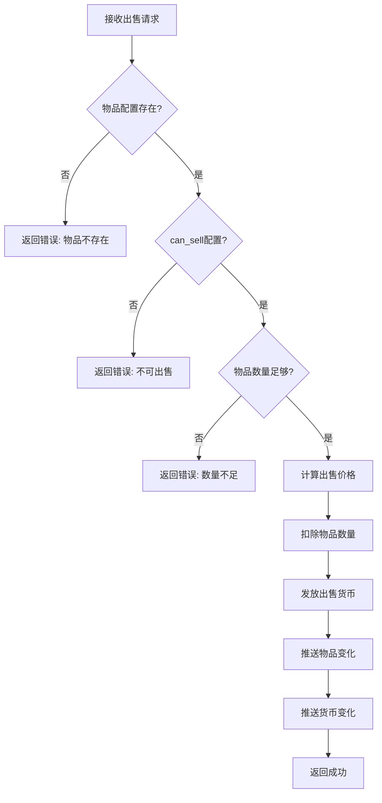
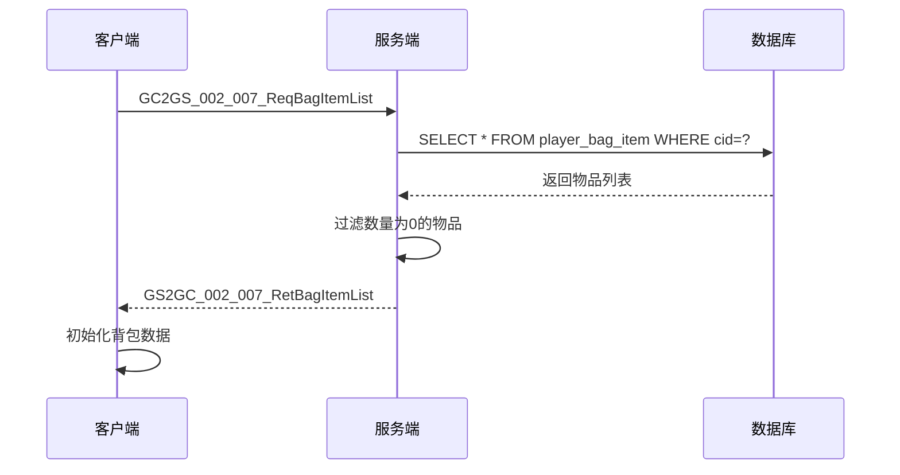
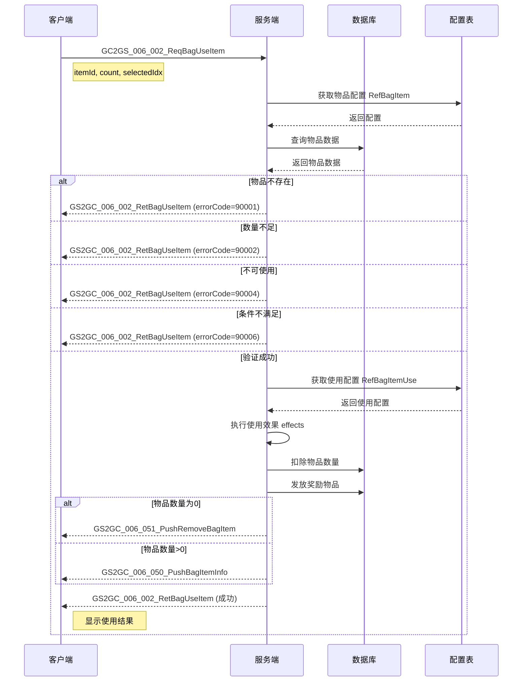
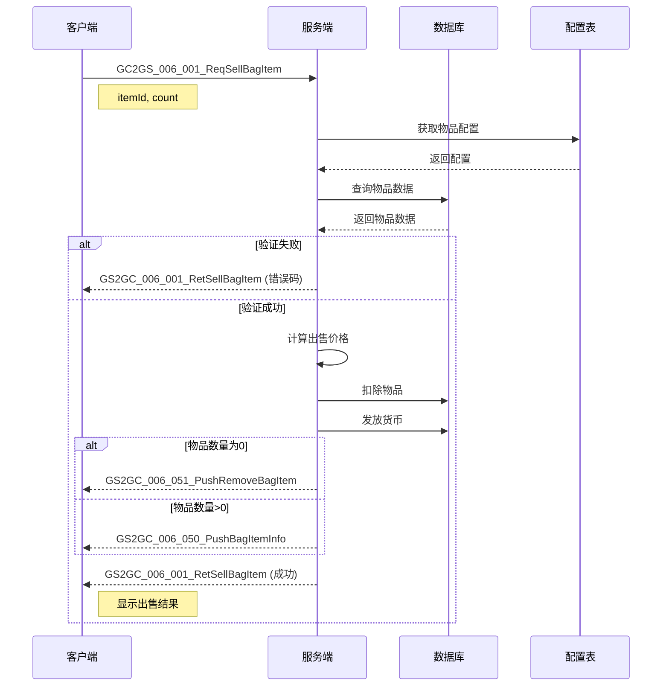
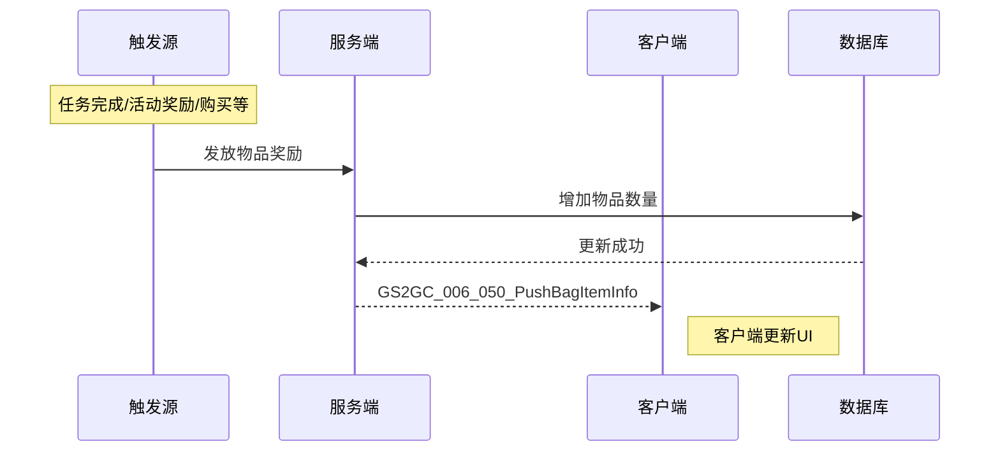
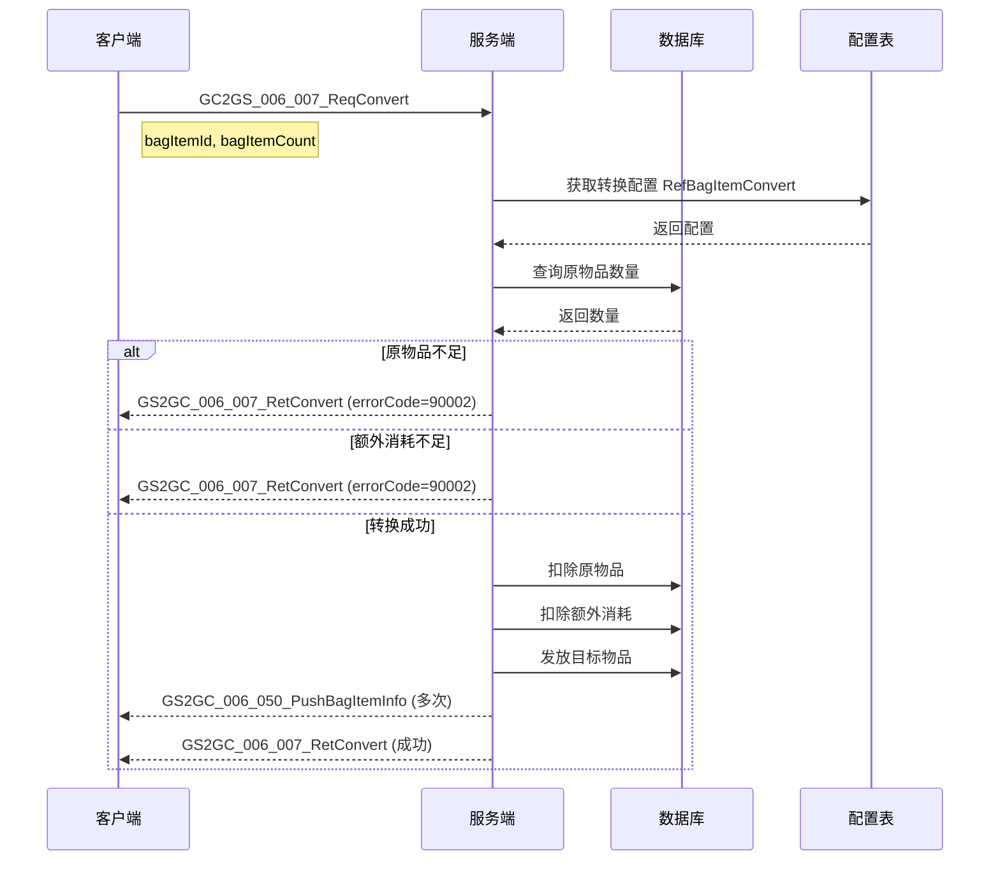
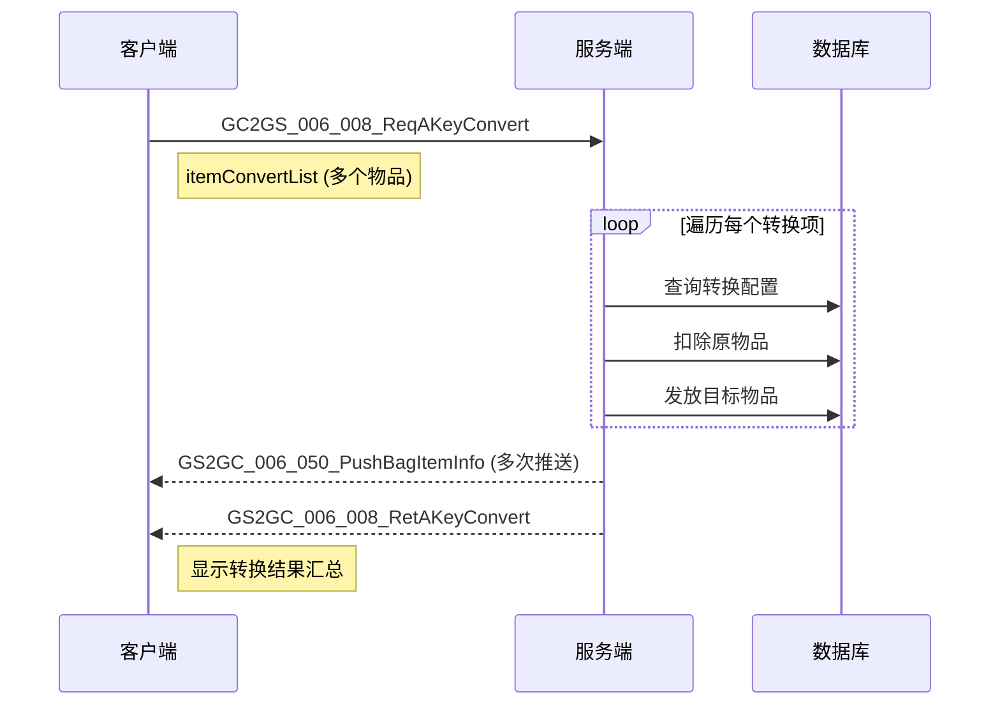
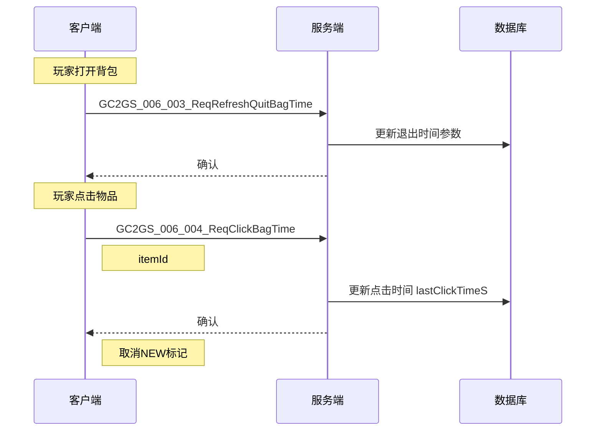
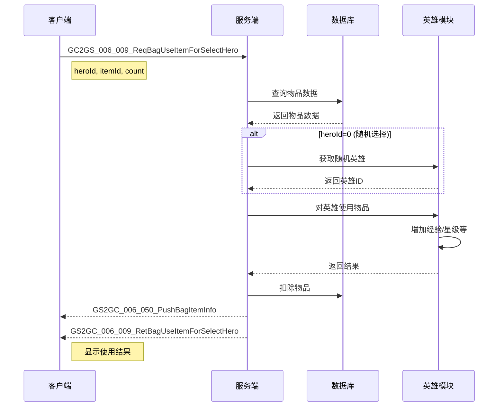
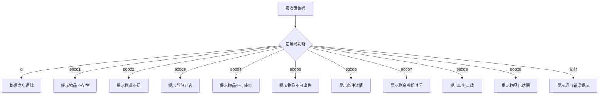

# 背包模块协议文档

## 协议模块编号: p006

主序号: `6`

---

## 一、公共数据结构

### 1.1 NPCommon_BagItemInfo - 背包物品信息

**路径**: `game_server/ClientProtocol/NPCommon/NPCommon_BagItemInfo.cs`

#### 完整字段列表

| 字段名 | 类型 | 必填 | 默认值 | 说明 | 示例值 |
|--------|------|------|--------|------|--------|
| itemId | long | 是 | 0 | 物品配置ID | 10001 |
| itemCount | long | 是 | 0 | 物品数量 | 10 |
| lastGetTimeS | int | 是 | 0 | 最后一次获得时间戳(秒) | 1712800000 |
| newItemTimeS | int | 是 | 0 | 首次获得本物品的时间戳 | 1712700000 |
| clickItemTimeS | int | 是 | 0 | 最后一次点击本物品的时间戳 | 1712801000 |

#### 协议结构

```csharp
public class NPCommon_BagItemInfo {
    private long itemId;        // 物品配置ID
    private long itemCount;     // 物品数量
    private int lastGetTimeS;   // 最后获得时间
    private int newItemTimeS;   // 首次获得时间
    private int clickItemTimeS; // 最后点击时间

    // Getter方法
    public long getItemId() { return itemId; }
    public long getItemCount() { return itemCount; }
    public int getLastGetTimeS() { return lastGetTimeS; }
    public int getNewItemTimeS() { return newItemTimeS; }
    public int getClickItemTimeS() { return clickItemTimeS; }

    // Setter方法
    public void setItemId(long val) { itemId = val; }
    public void setItemCount(long val) { itemCount = val; }
    public void setLastGetTimeS(int val) { lastGetTimeS = val; }
    public void setNewItemTimeS(int val) { newItemTimeS = val; }
    public void setClickItemTimeS(int val) { clickItemTimeS = val; }
}
```

#### 字段用途说明

| 字段 | 用途 | 判断逻辑 |
|------|------|----------|
| itemId | 物品的配置ID，对应 RefBagItem.id | 直接使用 |
| itemCount | 当前背包中该物品的数量 | itemCount > 0 表示拥有该物品 |
| lastGetTimeS | 用于判断是否是新增加的物品 | lastGetTimeS > 离开背包时间 且 lastGetTimeS > clickItemTimeS |
| newItemTimeS | 用于判断是否是新获得的物品 | clickItemTimeS < newItemTimeS 表示为新物品 |
| clickItemTimeS | 用于判断玩家是否点击查看过该物品 | clickItemTimeS > 0 表示已点击过 |

---

### 1.2 NPCommon_SingleItemConvert - 单个物品转换信息

**路径**: `game_server/ClientProtocol/NPCommon/NPCommon_SingleItemConvert.cs`

#### 完整字段列表

| 字段名 | 类型 | 必填 | 默认值 | 说明 | 示例值 |
|--------|------|------|--------|------|--------|
| bagItemId | long | 是 | 0 | 原道具ID | 10001 |
| bagItemCount | long | 是 | 0 | 目标道具数量 | 5 |

#### 协议结构

```csharp
public class NPCommon_SingleItemConvert {
    private long bagItemId;     // 原道具ID
    private long bagItemCount;  // 目标道具数量

    public NPCommon_SingleItemConvert() {}

    public NPCommon_SingleItemConvert(long _bagItemId, long _bagItemCount) {
        bagItemId = _bagItemId;
        bagItemCount = _bagItemCount;
    }

    public long getBagItemId() { return bagItemId; }
    public long getBagItemCount() { return bagItemCount; }
    public void setBagItemId(long val) { bagItemId = val; }
    public void setBagItemCount(long val) { bagItemCount = val; }
}
```

---

### 1.3 NPCommon_ItemInfo - 物品信息(使用结果)

**路径**: `game_server/ClientProtocol/NPCommon/NPCommon_ItemInfo.cs`

#### 完整字段列表

| 字段名 | 类型 | 必填 | 默认值 | 说明 | 示例值 |
|--------|------|------|--------|------|--------|
| itemType | ENPItemType | 是 | NONE | 物品类型 | BAG_ITEM |
| itemId | long | 是 | 0 | 物品ID | 10001 |
| count | long | 是 | 0 | 物品数量 | 100 |

#### 协议结构

```csharp
public class NPCommon_ItemInfo {
    private ENPItemType itemType;  // 物品类型
    private long itemId;           // 物品ID
    private long count;            // 物品数量

    public ENPItemType getItemType() { return itemType; }
    public long getItemId() { return itemId; }
    public long getCount() { return count; }
}
```

---

## 二、请求协议 (GC2GS)

### 2.1 GC2GS_006_001_ReqSellBagItem - 出售背包物品

**路径**: `game_server/ClientProtocol/GC2GS/p006_BagItemOp/GC2GS_006_001_ReqSellBagItem.cs`

| 序号 | 主序号 | 子序号 |
|------|--------|--------|
| 6-1 | 6 | 1 |

#### 完整字段列表

| 字段名 | 类型 | 必填 | 默认值 | 说明 | 约束条件 |
|--------|------|------|--------|------|----------|
| itemId | long | 是 | 0 | 物品配置ID | > 0 |
| count | int | 是 | 0 | 出售数量 | > 0 |

#### 协议结构

```csharp
public class GC2GS_006_001_ReqSellBagItem {
    private long itemId;  // 物品配置ID
    private int count;    // 出售数量

    public long getItemId() { return itemId; }
    public int getCount() { return count; }
    public void setItemId(long val) { itemId = val; }
    public void setCount(int val) { count = val; }
}
```

#### 请求示例

```csharp
// 示例1: 出售10个ID为10001的物品
var req = new GC2GS_006_001_ReqSellBagItem();
req.setItemId(10001);
req.setCount(10);
NPGSClientListener.sendMsg(req);

// 示例2: 封装方法
public void sellItem(long itemId, int count)
{
    var req = new GC2GS_006_001_ReqSellBagItem();
    req.setItemId(itemId);
    req.setCount(count);
    NPGSClientListener.sendMsg(req);
}
```

#### 服务端处理流程



---

### 2.2 GC2GS_006_002_ReqBagUseItem - 使用背包物品

**路径**: `game_server/ClientProtocol/GC2GS/p006_BagItemOp/GC2GS_006_002_ReqBagUseItem.cs`

| 序号 | 主序号 | 子序号 |
|------|--------|--------|
| 6-2 | 6 | 2 |

#### 完整字段列表

| 字段名 | 类型 | 必填 | 默认值 | 说明 | 约束条件 |
|--------|------|------|--------|------|----------|
| itemId | long | 是 | 0 | 物品配置ID | > 0 |
| count | long | 是 | 0 | 使用数量 | > 0 |
| selectedIdx | List\<int\> | 否 | [] | 选中索引列表(可选奖励) | 长度 = option_count |

#### 协议结构

```csharp
public class GC2GS_006_002_ReqBagUseItem {
    private long itemId;              // 物品配置ID
    private long count;               // 使用数量
    private List<int> selectedIdx;    // 选中索引列表

    public long getItemId() { return itemId; }
    public long getCount() { return count; }
    public List<int> getSelectedIdx() { return selectedIdx; }

    public void setItemId(long val) { itemId = val; }
    public void setCount(long val) { count = val; }
    public void addSelectedIdx(int idx) {
        if (selectedIdx == null) selectedIdx = new List<int>();
        selectedIdx.Add(idx);
    }
}
```

#### selectedIdx 说明

- 当物品使用配置中有 `option_item_list` 时，需要选择奖励
- `selectedIdx` 是选择的奖励索引列表
- 选择数量必须等于 `option_count` 配置值
- 索引从 0 开始，对应 `option_item_list` 中的位置

#### 请求示例

```csharp
// 示例1: 普通使用
var req = new GC2GS_006_002_ReqBagUseItem();
req.setItemId(10001);
req.setCount(1);
NPGSClientListener.sendMsg(req);

// 示例2: 批量使用
var req = new GC2GS_006_002_ReqBagUseItem();
req.setItemId(10001);
req.setCount(10);  // 使用10个
NPGSClientListener.sendMsg(req);

// 示例3: 选择奖励使用
var req = new GC2GS_006_002_ReqBagUseItem();
req.setItemId(20001);
req.setCount(1);
req.addSelectedIdx(0);  // 选择第一个奖励
req.addSelectedIdx(2);  // 选择第三个奖励(如果option_count=2)
NPGSClientListener.sendMsg(req);

// 示例4: 封装方法
public void useItem(long itemId, long count, List<int> selectedIdx = null)
{
    var req = new GC2GS_006_002_ReqBagUseItem();
    req.setItemId(itemId);
    req.setCount(count);
    if (selectedIdx != null)
    {
        foreach (int idx in selectedIdx)
            req.addSelectedIdx(idx);
    }
    NPGSClientListener.sendMsg(req);
}
```

---

### 2.3 GC2GS_006_003_ReqRefreshQuitBagTime - 刷新退出背包时间

**路径**: `game_server/ClientProtocol/GC2GS/p006_BagItemOp/GC2GS_006_003_ReqRefreshQuitBagTime.cs`

| 序号 | 主序号 | 子序号 |
|------|--------|--------|
| 6-3 | 6 | 3 |

#### 完整字段列表

| 字段名 | 类型 | 必填 | 默认值 | 说明 |
|--------|------|------|--------|------|
| - | - | - | - | 无参数 |

#### 协议结构

```csharp
public class GC2GS_006_003_ReqRefreshQuitBagTime {
    // 无参数
}
```

#### 用途说明

- 记录玩家离开背包界面的时间
- 用于判断物品是否为"新增"状态
- 离开背包时自动调用
- 服务端会更新 `LAST_LEFT_BAG_TIME` 参数

#### 请求示例

```csharp
// 离开背包界面时调用
public void onLeaveBagWindow()
{
    var req = new GC2GS_006_003_ReqRefreshQuitBagTime();
    NPGSClientListener.sendMsg(req);
}
```

---

### 2.4 GC2GS_006_004_ReqClickBagTime - 点击背包物品时间

**路径**: `game_server/ClientProtocol/GC2GS/p006_BagItemOp/GC2GS_006_004_ReqClickBagTime.cs`

| 序号 | 主序号 | 子序号 |
|------|--------|--------|
| 6-4 | 6 | 4 |

#### 完整字段列表

| 字段名 | 类型 | 必填 | 默认值 | 说明 | 约束条件 |
|--------|------|------|--------|------|----------|
| itemId | long | 是 | 0 | 物品配置ID | > 0 |

#### 协议结构

```csharp
public class GC2GS_006_004_ReqClickBagTime {
    private long itemId;  // 物品配置ID

    public long getItemId() { return itemId; }
    public void setItemId(long val) { itemId = val; }
}
```

#### 用途说明

- 记录玩家点击查看物品的时间
- 用于取消物品的 NEW 标记
- 点击物品时自动调用
- 服务端更新 `lastClickTimeS` 字段

#### 请求示例

```csharp
// 点击物品时调用，用于标记已查看
public void onClickBagItem(long itemId)
{
    var req = new GC2GS_006_004_ReqClickBagTime();
    req.setItemId(itemId);
    NPGSClientListener.sendMsg(req);
}
```

---

### 2.5 GC2GS_006_007_ReqConvert - 转换物品

**路径**: `game_server/ClientProtocol/GC2GS/p006_BagItemOp/GC2GS_006_007_ReqConvert.cs`

| 序号 | 主序号 | 子序号 |
|------|--------|--------|
| 6-7 | 6 | 7 |

#### 完整字段列表

| 字段名 | 类型 | 必填 | 默认值 | 说明 | 约束条件 |
|--------|------|------|--------|------|----------|
| bagItemId | long | 是 | 0 | 原道具ID | > 0 |
| bagItemCount | long | 是 | 0 | 想要转换获得的目标道具数量 | > 0 |

#### 协议结构

```csharp
public class GC2GS_006_007_ReqConvert {
    private long bagItemId;     // 原道具ID
    private long bagItemCount;  // 想要获得的目标道具数量

    public long getBagItemId() { return bagItemId; }
    public long getBagItemCount() { return bagItemCount; }
    public void setBagItemId(long val) { bagItemId = val; }
    public void setBagItemCount(long val) { bagItemCount = val; }
}
```

#### 计算说明

```
需要消耗原物品数量 = bagItemCount × ori_item_num
需要额外消耗 = bagItemCount × cost_item_list
```

#### 请求示例

```csharp
// 示例1: 转换物品，获得目标道具数量
var req = new GC2GS_006_007_ReqConvert();
req.setBagItemId(10001);      // 原物品ID
req.setBagItemCount(5);       // 想要获得的目标数量
NPGSClientListener.sendMsg(req);

// 示例2: 封装方法
public void convertItem(long bagItemId, long targetCount)
{
    var req = new GC2GS_006_007_ReqConvert();
    req.setBagItemId(bagItemId);
    req.setBagItemCount(targetCount);
    NPGSClientListener.sendMsg(req);
}
```

---

### 2.6 GC2GS_006_008_ReqAKeyConvert - 一键转换

**路径**: `game_server/ClientProtocol/GC2GS/p006_BagItemOp/GC2GS_006_008_ReqAKeyConvert.cs`

| 序号 | 主序号 | 子序号 |
|------|--------|--------|
| 6-8 | 6 | 8 |

#### 完整字段列表

| 字段名 | 类型 | 必填 | 默认值 | 说明 | 约束条件 |
|--------|------|------|--------|------|----------|
| itemConvertList | List\<NPCommon_SingleItemConvert\> | 是 | [] | 道具合成列表 | 长度 > 0 |

#### 协议结构

```csharp
public class GC2GS_006_008_ReqAKeyConvert {
    private List<NPCommon_SingleItemConvert> itemConvertList;

    public List<NPCommon_SingleItemConvert> getItemConvertList() {
        return itemConvertList;
    }

    public void addItemConvertList(NPCommon_SingleItemConvert item) {
        if (itemConvertList == null) itemConvertList = new List<NPCommon_SingleItemConvert>();
        itemConvertList.Add(item);
    }
}
```

#### 请求示例

```csharp
// 示例1: 一键转换多个物品
var req = new GC2GS_006_008_ReqAKeyConvert();
req.addItemConvertList(new NPCommon_SingleItemConvert(10001, 5));
req.addItemConvertList(new NPCommon_SingleItemConvert(10002, 3));
NPGSClientListener.sendMsg(req);

// 示例2: 封装方法
public void oneKeyConvert(List<NPCommon_SingleItemConvert> convertList)
{
    var req = new GC2GS_006_008_ReqAKeyConvert();
    foreach (var item in convertList)
        req.addItemConvertList(item);
    NPGSClientListener.sendMsg(req);
}

// 示例3: 根据品质一键转换
public void oneKeyConvertByQuality(EQuality quality)
{
    var convertList = new List<NPCommon_SingleItemConvert>();

    // 遍历背包物品
    NPPlayer.instance.bagComp.dealAllItem((item) => {
        if (item.quality == quality && item.itemRefObj.show_type == EBagClickShowView.CONVERT)
        {
            // 计算可转换数量
            long maxConvert = item.count;
            convertList.Add(new NPCommon_SingleItemConvert(item.itemId, maxConvert));
        }
    });

    if (convertList.Count > 0)
    {
        var req = new GC2GS_006_008_ReqAKeyConvert();
        foreach (var item in convertList)
            req.addItemConvertList(item);
        NPGSClientListener.sendMsg(req);
    }
}
```

---

### 2.7 GC2GS_006_009_ReqBagUseItemForSelectHero - 选择英雄使用物品

**路径**: `game_server/ClientProtocol/GC2GS/p006_BagItemOp/GC2GS_006_009_ReqBagUseItemForSelectHero.cs`

| 序号 | 主序号 | 子序号 |
|------|--------|--------|
| 6-9 | 6 | 9 |

#### 完整字段列表

| 字段名 | 类型 | 必填 | 默认值 | 说明 | 约束条件 |
|--------|------|------|--------|------|----------|
| heroId | long | 是 | 0 | 英雄ID (0表示随机选择) | >= 0 |
| itemId | long | 是 | 0 | 物品配置ID | > 0 |
| count | long | 是 | 0 | 使用数量 | > 0 |

#### 协议结构

```csharp
public class GC2GS_006_009_ReqBagUseItemForSelectHero {
    private long heroId;   // 英雄ID
    private long itemId;   // 物品配置ID
    private long count;    // 使用数量

    public long getHeroId() { return heroId; }
    public long getItemId() { return itemId; }
    public long getCount() { return count; }

    public void setHeroId(long val) { heroId = val; }
    public void setItemId(long val) { itemId = val; }
    public void setCount(long val) { count = val; }
}
```

#### 请求示例

```csharp
// 示例1: 对指定英雄使用物品
var req = new GC2GS_006_009_ReqBagUseItemForSelectHero();
req.setHeroId(1001);    // 英雄ID
req.setItemId(30101);   // 经验书物品ID
req.setCount(1);        // 使用数量
NPGSClientListener.sendMsg(req);

// 示例2: 随机选择英雄使用
var req = new GC2GS_006_009_ReqBagUseItemForSelectHero();
req.setHeroId(0);       // heroId为0表示随机
req.setItemId(30101);
req.setCount(1);
NPGSClientListener.sendMsg(req);

// 示例3: 封装方法
public void useItemForHero(long heroId, long itemId, long count)
{
    var req = new GC2GS_006_009_ReqBagUseItemForSelectHero();
    req.setHeroId(heroId);
    req.setItemId(itemId);
    req.setCount(count);
    NPGSClientListener.sendMsg(req);
}
```

---

### 2.8 GC2GS_006_010_ReqBagUseItemForSelectConsort - 选择伴侣使用物品

**路径**: `game_server/ClientProtocol/GC2GS/p006_BagItemOp/GC2GS_006_010_ReqBagUseItemForSelectConsort.cs`

| 序号 | 主序号 | 子序号 |
|------|--------|--------|
| 6-10 | 6 | 10 |

#### 完整字段列表

| 字段名 | 类型 | 必填 | 默认值 | 说明 | 约束条件 |
|--------|------|------|--------|------|----------|
| consortId | long | 是 | 0 | 伴侣ID | > 0 |
| itemId | long | 是 | 0 | 物品配置ID | > 0 |
| count | int | 是 | 0 | 使用数量 | > 0 |

#### 协议结构

```csharp
public class GC2GS_006_010_ReqBagUseItemForSelectConsort {
    private long consortId;  // 伴侣ID
    private long itemId;     // 物品配置ID
    private int count;       // 使用数量

    public long getConsortId() { return consortId; }
    public long getItemId() { return itemId; }
    public int getCount() { return count; }

    public void setConsortId(long val) { consortId = val; }
    public void setItemId(long val) { itemId = val; }
    public void setCount(int val) { count = val; }
}
```

#### 请求示例

```csharp
// 示例1: 对伴侣使用物品
var req = new GC2GS_006_010_ReqBagUseItemForSelectConsort();
req.setConsortId(1001);
req.setItemId(40001);  // 礼物物品ID
req.setCount(1);
NPGSClientListener.sendMsg(req);

// 示例2: 封装方法
public void useItemForConsort(long consortId, long itemId, int count)
{
    var req = new GC2GS_006_010_ReqBagUseItemForSelectConsort();
    req.setConsortId(consortId);
    req.setItemId(itemId);
    req.setCount(count);
    NPGSClientListener.sendMsg(req);
}
```

---

## 三、响应协议 (GS2GC)

### 3.1 GS2GC_006_001_RetSellBagItem - 出售结果

**路径**: `game_server/ClientProtocol/GS2GC/p006_BagItemOp/GS2GC_006_001_RetSellBagItem.cs`

| 序号 | 主序号 | 子序号 |
|------|--------|--------|
| 6-1 | 6 | 1 |

#### 完整字段列表

| 字段名 | 类型 | 说明 |
|--------|------|------|
| errorCode | int | 错误码 (0表示成功) |
| itemId | long | 出售的物品ID |
| sellCount | int | 出售数量 |
| gainItems | List\<NPCommon_ItemInfo\> | 获得的物品列表 |

#### 协议结构

```csharp
public class GS2GC_006_001_RetSellBagItem {
    private int errorCode;      // 错误码
    private long itemId;        // 物品ID
    private int sellCount;      // 出售数量
    private List<NPCommon_ItemInfo> gainItems;  // 获得的物品

    public int getErrorCode() { return errorCode; }
    public long getItemId() { return itemId; }
    public int getSellCount() { return sellCount; }
    public List<NPCommon_ItemInfo> getGainItems() { return gainItems; }
}
```

#### 响应示例

```csharp
// 处理出售结果
void OnSellItemResult(GS2GC_006_001_RetSellBagItem msg)
{
    if (msg.getErrorCode() != 0)
    {
        Debug.Log($"出售失败，错误码: {msg.getErrorCode()}");
        return;
    }

    Debug.Log($"成功出售物品 {msg.getItemId()} x {msg.getSellCount()}");

    foreach (var item in msg.getGainItems())
    {
        Debug.Log($"获得: {item.itemType} {item.itemId} x {item.count}");
    }
}
```

---

### 3.2 GS2GC_006_002_RetBagUseItem - 使用结果

**路径**: `game_server/ClientProtocol/GS2GC/p006_BagItemOp/GS2GC_006_002_RetBagUseItem.cs`

| 序号 | 主序号 | 子序号 |
|------|--------|--------|
| 6-2 | 6 | 2 |

#### 完整字段列表

| 字段名 | 类型 | 说明 |
|--------|------|------|
| errorCode | int | 错误码 (0表示成功) |
| itemId | long | 使用的物品ID |
| count | long | 使用的数量 |
| itemList | List\<NPCommon_ItemInfo\> | 获得的物品列表 |

#### 协议结构

```csharp
public class GS2GC_006_002_RetBagUseItem {
    private int errorCode;      // 错误码
    private long itemId;        // 使用的物品ID
    private long count;         // 使用的数量
    private List<NPCommon_ItemInfo> itemList;  // 获得的物品列表

    public int getErrorCode() { return errorCode; }
    public long getItemId() { return itemId; }
    public long getCount() { return count; }
    public List<NPCommon_ItemInfo> getItemList() { return itemList; }
}
```

#### 响应示例

```csharp
// 处理使用结果
void OnUseItemResult(GS2GC_006_002_RetBagUseItem msg)
{
    if (msg.getErrorCode() != 0)
    {
        Debug.Log($"使用失败，错误码: {msg.getErrorCode()}");
        return;
    }

    Debug.Log($"成功使用物品 {msg.getItemId()} x {msg.getCount()}");

    foreach (var item in msg.getItemList())
    {
        Debug.Log($"获得: type={item.itemType}, id={item.itemId}, count={item.count}");
    }
}
```

---

### 3.3 GS2GC_006_007_RetConvert - 转换结果

**路径**: `game_server/ClientProtocol/GS2GC/p006_BagItemOp/GS2GC_006_007_RetConvert.cs`

| 序号 | 主序号 | 子序号 |
|------|--------|--------|
| 6-7 | 6 | 7 |

#### 完整字段列表

| 字段名 | 类型 | 说明 |
|--------|------|------|
| errorCode | int | 错误码 (0表示成功) |
| bagItemId | long | 原物品ID |
| targetItemId | long | 目标物品ID |
| targetCount | long | 获得的目标物品数量 |

#### 协议结构

```csharp
public class GS2GC_006_007_RetConvert {
    private int errorCode;      // 错误码
    private long bagItemId;     // 原物品ID
    private long targetItemId;  // 目标物品ID
    private long targetCount;   // 获得数量

    public int getErrorCode() { return errorCode; }
    public long getBagItemId() { return bagItemId; }
    public long getTargetItemId() { return targetItemId; }
    public long getTargetCount() { return targetCount; }
}
```

---

### 3.4 GS2GC_006_008_RetAKeyConvert - 一键转换结果

**路径**: `game_server/ClientProtocol/GS2GC/p006_BagItemOp/GS2GC_006_008_RetAKeyConvert.cs`

| 序号 | 主序号 | 子序号 |
|------|--------|--------|
| 6-8 | 6 | 8 |

#### 完整字段列表

| 字段名 | 类型 | 说明 |
|--------|------|------|
| errorCode | int | 错误码 (0表示成功) |
| successCount | int | 成功转换的物品数量 |
| gainItems | List\<NPCommon_ItemInfo\> | 获得的物品列表 |

#### 协议结构

```csharp
public class GS2GC_006_008_RetAKeyConvert {
    private int errorCode;      // 错误码
    private int successCount;   // 成功转换数量
    private List<NPCommon_ItemInfo> gainItems;  // 获得的物品

    public int getErrorCode() { return errorCode; }
    public int getSuccessCount() { return successCount; }
    public List<NPCommon_ItemInfo> getGainItems() { return gainItems; }
}
```

---

### 3.5 GS2GC_006_009_RetBagUseItemForSelectHero - 选择英雄使用结果

**路径**: `game_server/ClientProtocol/GS2GC/p006_BagItemOp/GS2GC_006_009_RetBagUseItemForSelectHero.cs`

| 序号 | 主序号 | 子序号 |
|------|--------|--------|
| 6-9 | 6 | 9 |

#### 完整字段列表

| 字段名 | 类型 | 说明 |
|--------|------|------|
| errorCode | int | 错误码 (0表示成功) |
| heroId | long | 英雄ID |
| itemId | long | 物品ID |
| count | long | 使用数量 |
| addExp | long | 增加的经验值 |

#### 协议结构

```csharp
public class GS2GC_006_009_RetBagUseItemForSelectHero {
    private int errorCode;   // 错误码
    private long heroId;     // 英雄ID
    private long itemId;     // 物品ID
    private long count;      // 使用数量
    private long addExp;     // 增加的经验

    public int getErrorCode() { return errorCode; }
    public long getHeroId() { return heroId; }
    public long getItemId() { return itemId; }
    public long getCount() { return count; }
    public long getAddExp() { return addExp; }
}
```

---

### 3.6 GS2GC_006_010_RetBagUseItemForSelectConsort - 选择伴侣使用结果

**路径**: `game_server/ClientProtocol/GS2GC/p006_BagItemOp/GS2GC_006_010_RetBagUseItemForSelectConsort.cs`

| 序号 | 主序号 | 子序号 |
|------|--------|--------|
| 6-10 | 6 | 10 |

#### 完整字段列表

| 字段名 | 类型 | 说明 |
|--------|------|------|
| errorCode | int | 错误码 (0表示成功) |
| consortId | long | 伴侣ID |
| itemId | long | 物品ID |
| count | int | 使用数量 |
| addFavor | long | 增加的好感度 |

#### 协议结构

```csharp
public class GS2GC_006_010_RetBagUseItemForSelectConsort {
    private int errorCode;    // 错误码
    private long consortId;   // 伴侣ID
    private long itemId;      // 物品ID
    private int count;        // 使用数量
    private long addFavor;    // 增加的好感度

    public int getErrorCode() { return errorCode; }
    public long getConsortId() { return consortId; }
    public long getItemId() { return itemId; }
    public int getCount() { return count; }
    public long getAddFavor() { return addFavor; }
}
```

---

## 四、推送协议 (GS2GC)

### 4.1 GS2GC_006_050_PushBagItemInfo - 推送物品信息

**路径**: `game_server/ClientProtocol/GS2GC/p006_BagItemOp/GS2GC_006_050_PushBagItemInfo.cs`

| 序号 | 主序号 | 子序号 |
|------|--------|--------|
| 6-50 | 6 | 50 |

#### 完整字段列表

| 字段名 | 类型 | 说明 |
|--------|------|------|
| bagItemInfo | NPCommon_BagItemInfo | 物品信息 |

#### 协议结构

```csharp
public class GS2GC_006_050_PushBagItemInfo {
    private NPCommon_BagItemInfo bagItemInfo;  // 物品信息

    public NPCommon_BagItemInfo getBagItemInfo() { return bagItemInfo; }
}
```

#### 推送时机

| 场景 | 说明 |
|------|------|
| 玩家获得新物品 | 新增物品记录 |
| 物品数量增加 | 如获得奖励、购买物品等 |
| 物品数量减少但未清空 | 如使用部分物品 |
| 物品数据更新 | 如活动物品过期后数量变更 |
| GM修改物品 | GM命令修改物品数量 |

#### 客户端处理

```csharp
// 注册推送监听
NPGSClientListener.registerPushHandler<GS2GC_006_050_PushBagItemInfo>(OnPushBagItemInfo);

void OnPushBagItemInfo(GS2GC_006_050_PushBagItemInfo msg)
{
    NPCommon_BagItemInfo info = msg.getBagItemInfo();
    NPPlayer.instance.bagComp.updateItem(info);
}
```

---

### 4.2 GS2GC_006_051_PushRemoveBagItem - 推送移除物品

**路径**: `game_server/ClientProtocol/GS2GC/p006_BagItemOp/GS2GC_006_051_PushRemoveBagItem.cs`

| 序号 | 主序号 | 子序号 |
|------|--------|--------|
| 6-51 | 6 | 51 |

#### 完整字段列表

| 字段名 | 类型 | 说明 |
|--------|------|------|
| itemId | long | 物品配置ID |

#### 协议结构

```csharp
public class GS2GC_006_051_PushRemoveBagItem {
    private long itemId;  // 物品配置ID

    public long getItemId() { return itemId; }
}
```

#### 推送时机

| 场景 | 说明 |
|------|------|
| 物品使用完毕 | 使用后数量减为0 |
| 物品出售完毕 | 出售后数量减为0 |
| 物品转换完毕 | 转换后原物品数量减为0 |
| GM删除物品 | GM命令删除物品 |
| 活动物品过期 | 过期后数量被清空 |

#### 客户端处理

```csharp
// 注册推送监听
NPGSClientListener.registerPushHandler<GS2GC_006_051_PushRemoveBagItem>(OnPushRemoveBagItem);

void OnPushRemoveBagItem(GS2GC_006_051_PushRemoveBagItem msg)
{
    NPPlayer.instance.bagComp.removeItem(msg.getItemId());
}
```

---

## 五、初始化协议 (p002)

### 5.1 GS2GC_002_007_RetBagItemList - 返回背包物品列表

**路径**: `game_server/ClientProtocol/GS2GC/p002_InitOp/GS2GC_002_007_RetBagItemList.cs`

#### 完整字段列表

| 字段名 | 类型 | 说明 |
|--------|------|------|
| bagItemList | List\<NPCommon_BagItemInfo\> | 背包物品列表 |

#### 协议结构

```csharp
public class GS2GC_002_007_RetBagItemList {
    private List<NPCommon_BagItemInfo> bagItemList;

    public List<NPCommon_BagItemInfo> getBagItemList() { return bagItemList; }
}
```

#### 触发流程



---

## 六、协议交互流程图

### 6.1 物品使用完整流程



### 6.2 物品出售完整流程



### 6.3 物品获取流程



### 6.4 物品转换流程



### 6.5 一键转换流程



### 6.6 物品红点状态同步流程



### 6.7 对英雄使用物品流程



---

## 七、协议汇总表

### 7.1 请求协议汇总

| 协议名 | 主序号 | 子序号 | 说明 | 触发时机 | 参数 |
|--------|--------|--------|------|----------|------|
| GC2GS_006_001_ReqSellBagItem | 6 | 1 | 出售背包物品 | 玩家出售物品 | itemId, count |
| GC2GS_006_002_ReqBagUseItem | 6 | 2 | 使用背包物品 | 玩家使用物品 | itemId, count, selectedIdx |
| GC2GS_006_003_ReqRefreshQuitBagTime | 6 | 3 | 刷新退出背包时间 | 玩家离开背包 | 无 |
| GC2GS_006_004_ReqClickBagTime | 6 | 4 | 点击背包时间 | 玩家点击物品 | itemId |
| GC2GS_006_007_ReqConvert | 6 | 7 | 转换物品 | 玩家转换物品 | bagItemId, bagItemCount |
| GC2GS_006_008_ReqAKeyConvert | 6 | 8 | 一键转换 | 玩家一键转换 | itemConvertList |
| GC2GS_006_009_ReqBagUseItemForSelectHero | 6 | 9 | 选择英雄使用物品 | 对英雄使用 | heroId, itemId, count |
| GC2GS_006_010_ReqBagUseItemForSelectConsort | 6 | 10 | 选择伴侣使用物品 | 对伴侣使用 | consortId, itemId, count |

### 7.2 响应/推送协议汇总

| 协议名 | 主序号 | 子序号 | 说明 | 触发时机 |
|--------|--------|--------|------|----------|
| GS2GC_006_001_RetSellBagItem | 6 | 1 | 出售结果 | 出售后返回 |
| GS2GC_006_002_RetBagUseItem | 6 | 2 | 使用结果 | 使用后返回 |
| GS2GC_006_007_RetConvert | 6 | 7 | 转换结果 | 转换后返回 |
| GS2GC_006_008_RetAKeyConvert | 6 | 8 | 一键转换结果 | 批量转换后返回 |
| GS2GC_006_009_RetBagUseItemForSelectHero | 6 | 9 | 选择英雄使用结果 | 英雄使用后返回 |
| GS2GC_006_010_RetBagUseItemForSelectConsort | 6 | 10 | 选择伴侣使用结果 | 伴侣使用后返回 |
| GS2GC_006_050_PushBagItemInfo | 6 | 50 | 推送物品信息 | 物品变动时 |
| GS2GC_006_051_PushRemoveBagItem | 6 | 51 | 推送移除物品 | 物品清空时 |

---

## 八、错误码定义

### 8.1 错误码列表

| 错误码 | 说明 | 处理建议 | 用户提示 |
|--------|------|----------|----------|
| 0 | 成功 | - | - |
| 90001 | 物品不存在 | 检查物品ID有效性 | "物品不存在" |
| 90002 | 物品数量不足 | 检查物品数量 | "物品数量不足" |
| 90003 | 背包已满 | 提示玩家清理背包 | "背包已满，请整理" |
| 90004 | 物品不可使用 | 检查物品类型配置 | "该物品无法使用" |
| 90005 | 物品不可出售 | 检查 can_sell 配置 | "该物品无法出售" |
| 90006 | 使用条件不满足 | 检查 use_cond 配置 | "使用条件不满足" |
| 90007 | 冷却时间未结束 | 等待冷却时间结束 | "冷却中，请稍后再试" |
| 90008 | 目标无效 | 检查选择目标有效性 | "目标无效" |
| 90009 | 活动物品已过期 | 物品因活动结束而过期 | "活动已结束，物品已过期" |
| 90010 | 每日使用次数已达上限 | 等待次日重置 | "今日使用次数已达上限" |
| 90011 | 转换配置不存在 | 检查转换配置 | "该物品无法转换" |
| 90012 | 转换次数已达上限 | 检查转换限制 | "转换次数已达上限" |
| 90013 | 可选奖励选择数量错误 | 检查 option_count | "请选择正确的奖励数量" |
| 90014 | 英雄不存在 | 检查英雄ID | "英雄不存在" |
| 90015 | 伴侣不存在 | 检查伴侣ID | "伴侣不存在" |

### 8.2 错误处理流程



---

## 九、协议版本兼容

### 9.1 版本兼容策略

| 场景 | 处理方式 |
|------|----------|
| 新增字段 | 老版本忽略新字段，新版本正常解析 |
| 删除字段 | 老版本使用默认值，新版本不读取 |
| 字段类型变更 | 需要版本号判断，分别处理 |
| 协议废弃 | 标记废弃，但保留解析逻辑 |

### 9.2 协议扩展建议

1. **新增协议**: 使用新的子序号
2. **新增字段**: 添加到协议末尾
3. **废弃协议**: 标记但不删除
4. **类型变更**: 新增字段替代旧字段

---

*文档生成时间: 2026-04-11*
