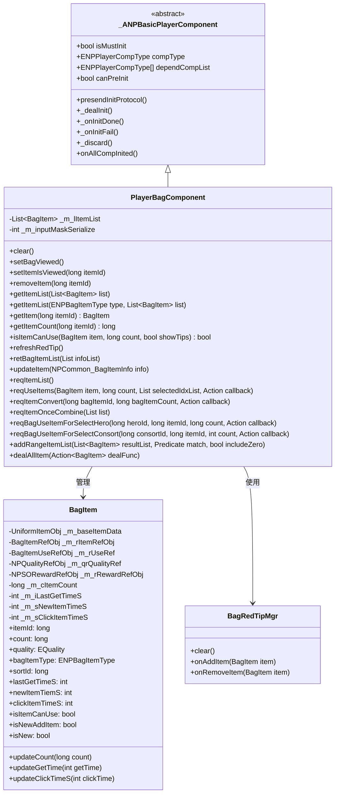
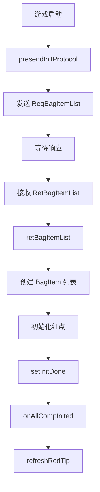
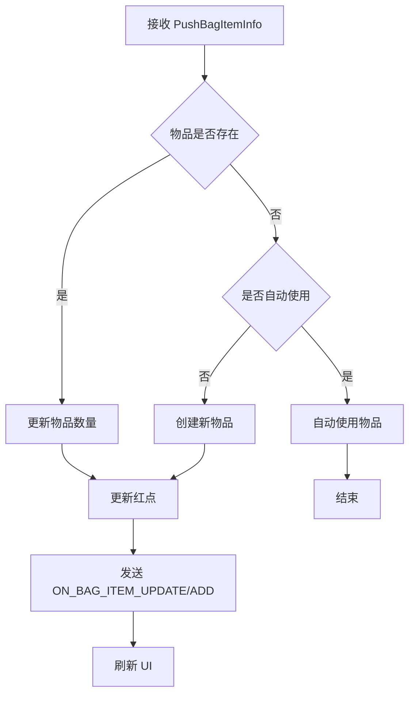
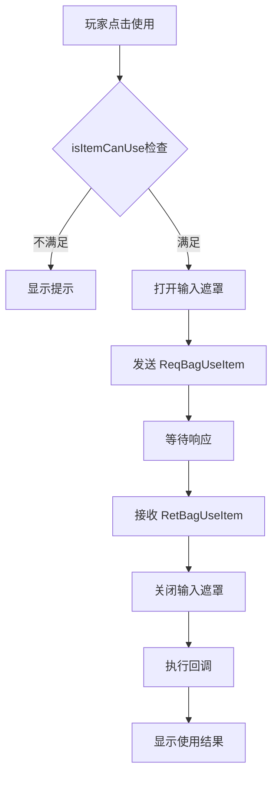

# 背包模块客户端开发文档

## 一、组件架构

### 1.1 核心类图



---

## 二、核心组件类

### 2.1 PlayerBagComponent

**路径**: `game_client/Assets/Scripts/LogicScripts/GameComponent/NPBag/PlayerBagComponent.cs`

**继承关系**: `PlayerBagComponent : _ANPBasicPlayerComponent`

**协议模块**: `p006_BagItemOp`

**组件类型**: `ENPPlayerCompType.BAG`

**主要属性**:

| 属性名 | 类型 | 说明 |
|--------|------|------|
| isMustInit | bool | 是否必须初始化 (true) |
| compType | ENPPlayerCompType | 组件类型 (BAG) |
| dependCompList | ENPPlayerCompType[] | 依赖组件列表 (null, 无依赖) |
| canPreInit | bool | 是否允许提前初始化 (true) |

**主要方法**:

| 方法名 | 参数 | 返回值 | 说明 |
|--------|------|--------|------|
| clear | - | void | 清空背包数据 |
| setBagViewed | - | void | 设置背包已查看，同步服务器 |
| setItemIsViewed | itemId: long | void | 设置物品已查看，同步服务器 |
| removeItem | itemId: long | void | 移除物品 |
| getItemList | list: List\<BagItem\> | void | 获取背包数据 |
| getItemList | type: ENPBagItemType, list: List\<BagItem\> | void | 获取指定类型数据 |
| getItem | itemId: long | BagItem | 获取指定物品 |
| getItemCount | itemId: long | long | 获取物品数量 |
| isItemCanUse | item: BagItem, count: long, showTips: bool | bool | 判断能否使用 |
| refreshRedTip | - | void | 刷新红点 |
| reqItemList | - | void | 请求物品列表 |
| reqUseItems | item: BagItem, count: long, selectedIdxList: List\<int\>, callback: Action | void | 请求使用物品 |
| reqItemConvert | bagItemId: long, bagItemCount: long, callback: Action | void | 请求转换物品 |
| reqItemOnceCombine | list: List\<BagOnceCombineItem\> | void | 请求一键转换 |
| addRangeItemList | resultList: List\<BagItem\>, match: Predicate\<BagItem\>, includeZero: bool | void | 条件筛选物品 |
| dealAllItem | dealFunc: Action\<BagItem\> | void | 遍历所有物品 |

**完整方法签名**:
```csharp
// 清空背包数据
public void clear()

// 设置背包已查看
public void setBagViewed()

// 设置物品已查看
public void setItemIsViewed(long _itemId)

// 移除物品
public void removeItem(long _itemId)

// 获取所有物品
public void getItemList(List<BagItem> _getList)

// 获取指定类型物品
public void getItemList(ENPBagItemType _type, List<BagItem> _getList)

// 获取指定物品
public BagItem getItem(long _itemId)

// 获取物品数量
public long getItemCount(long _itemId)

// 判断物品是否可使用
public bool isItemCanUse(BagItem _item, long _useCount, bool showTips = true)

// 刷新红点
public void refreshRedTip()

// 请求物品列表
public void reqItemList()

// 请求使用物品
public void reqUseItems(BagItem _item, long _count, List<int> _selectedIdxList = null,
    Action<GS2GC_006_002_RetBagUseItem> _sucAction = null)

// 请求转换物品
public void reqItemConvert(long _bagItemId, long _bagItemCount, Action _sucAction)

// 请求一键转换
public void reqItemOnceCombine(List<BagOnceCombineItem> _list)

// 请求对英雄使用物品
public void reqBagUseItemForSelectHero(long _heroId, long _itemId, long _count,
    Action<GS2GC_006_009_RetBagUseItemForSelectHero> _callback)

// 请求对伴侣使用物品
public void reqBagUseItemForSelectConsort(long _consortId, long _itemId, int _count,
    Action<GS2GC_006_010_RetBagUseItemForSelectConsort> _callback)

// 条件筛选物品
public void addRangeItemList(List<BagItem> _resultList, Predicate<BagItem> _match, bool _includeZero = false)

// 遍历所有物品
public void dealAllItem(Action<BagItem> _dealFunc)

// 判断物品是否可合成
public bool judgeItemCanCombineMaxCount(BagItem _item)
```

---

### 2.2 BagItem

**路径**: `game_client/Assets/Scripts/LogicScripts/GameComponent/NPBag/BagItem.cs`

**功能**: 单个物品的数据信息

**主要属性**:

| 属性名 | 类型 | 说明 |
|--------|------|------|
| baseItemData | UniformItemObj | 物品基础数据 |
| itemRefObj | BagItemRefObj | 物品配置数据 |
| itemUseRefObj | BagItemUseRefObj | 物品使用配置 (可能为null) |
| itemRewardRefObj | NPSORewardRefObj | 物品奖励配置 (可能为null) |
| itemId | long | 物品配置ID |
| itemType | ENPItemType | 物品类型 |
| count | long | 物品数量 |
| quality | EQuality | 品质 |
| bagItemType | ENPBagItemType | 背包物品类型 |
| sortId | long | 排序ID |
| lastGetTimeS | int | 最后获得时间戳 |
| newItemTiemS | int | 首次获得时间戳 |
| clickItemTimeS | int | 最后点击时间戳 |
| isItemCanUse | bool | 是否可使用 |
| isNewAddItem | bool | 是否为新增物品 |
| isNew | bool | 是否为新物品 |

**isNewAddItem 判断逻辑**:
```csharp
/// <summary>
/// 是否为新增加的物品
/// </summary>
public bool isNewAddItem
{
    get
    {
        // 获得的时候比查看背包的时间
        bool isCheckBagTime = _m_iLastGetTimeS - NPPlayer.instance.playerInfo[NPEnum.ENPPlayerParam.LAST_LEFT_BAG_TIME] > 0;

        // 获得的时间比点击的时间
        bool isClickTime = _m_iLastGetTimeS - _m_sClickItemTimeS > 0;

        return isCheckBagTime && isClickTime;
    }
}
```

**isNew 判断逻辑**:
```csharp
/// <summary>
/// 是否为新物品
/// </summary>
public bool isNew
{
    get
    {
        // 新物品必须要点击才表示查看过
        // 如果最后一次点击物品时间大于首次获取时间，则不是新物品
        if (_m_sClickItemTimeS - _m_sNewItemTimeS > 0)
            return false;
        return true;
    }
}
```

**isItemCanUse 判断逻辑**:
```csharp
public bool isItemCanUse
{
    get
    {
        if (null == itemUseRefObj)
            return false;
        if (_m_cItemCount == 0)
            return false;
        return _m_rUseRef.use_cond.IsEnable(null);
    }
}
```

---

### 2.3 BagRedTipMgr

**路径**: `game_client/Assets/Scripts/LogicScripts/GameComponent/NPBag/BagRedTipMgr.cs`

**功能**: 背包红点管理

**主要方法**:

| 方法名 | 参数 | 返回值 | 说明 |
|--------|------|--------|------|
| clear | - | void | 清空红点数据 |
| onAddItem | item: BagItem | void | 物品新增时调用 |
| onRemoveItem | item: BagItem | void | 物品移除时调用 |

---

## 三、协议接口

### 3.1 请求协议

| 协议名 | 说明 | 调用方法 |
|--------|------|----------|
| GC2GS_002_007_ReqBagItemList | 请求物品列表 | reqItemList() |
| GC2GS_006_001_ReqSellBagItem | 请求出售物品 | - |
| GC2GS_006_002_ReqBagUseItem | 请求使用物品 | reqUseItems() |
| GC2GS_006_003_ReqRefreshQuitBagTime | 刷新退出背包时间 | setBagViewed() |
| GC2GS_006_004_ReqClickBagTime | 点击物品时间同步 | setItemIsViewed() |
| GC2GS_006_007_ReqConvert | 请求转换物品 | reqItemConvert() |
| GC2GS_006_008_ReqAKeyConvert | 请求一键转换 | reqItemOnceCombine() |
| GC2GS_006_009_ReqBagUseItemForSelectHero | 选择英雄使用物品 | reqBagUseItemForSelectHero() |
| GC2GS_006_010_ReqBagUseItemForSelectConsort | 选择伴侣使用物品 | reqBagUseItemForSelectConsort() |

### 3.2 响应/推送协议

| 协议名 | 说明 | 处理方法 |
|--------|------|----------|
| GS2GC_002_007_RetBagItemList | 物品列表返回 | retBagItemList() |
| GS2GC_006_050_PushBagItemInfo | 物品更新推送 | updateItem() |
| GS2GC_006_051_PushRemoveBagItem | 物品移除推送 | removeItem() |

---

## 四、UI窗口

### 4.1 窗口目录结构

```
game_client/Assets/Scripts/LogicScripts/GameWndGui/GGui/Bag/
├── GGUIWndBagMain.cs              # 背包主界面
├── GGUIWndBagPage.cs              # 背包页签
├── GGUIWndBagItemGrid.cs          # 物品网格
├── GGUIWndBagGridItem.cs          # 物品网格项
├── GGUIWndBagFirstTab.cs          # 首页标签
├── GGUIWndBagConvertPage.cs       # 转换页签
├── GGUIWndBagConvertItemGrid.cs   # 转换物品网格
├── BagItemTypeBar/                # 类型标签栏
│   ├── BagItemTypeBarController.cs
│   └── GGUIWndBagItemTypeBar.cs
├── BagBarController/              # 底部栏控制器
│   ├── _ABasicBagItemBar.cs
│   ├── BagItemDetailBar.cs
│   ├── BagItemUseAndConvertBar.cs
│   ├── BagItemUseBar.cs
│   └── BagItemConvertBar.cs
├── Use/                           # 使用相关窗口
│   ├── _AGGUIWndBagItemUse.cs     # 使用基类
│   ├── GGUIWndBagItemUse.cs       # 使用窗口
│   ├── GGUIWndBagItemUseSelect.cs # 选择奖励
│   ├── GGUIWndBagItemUseHero.cs   # 英雄使用
│   ├── GGUIWndBagItemUseConsort.cs# 伴侣使用
│   ├── GGUIWndBagItemConvert.cs   # 物品转换
│   └── GGUIWndBagItemOnceCombine.cs # 一键合成
├── SelectItemDetail/              # 物品详情弹窗
│   ├── GGUIWndBagPopItemDetailSimple.cs
│   ├── GGUIWndBagPopItemUseSimple.cs
│   ├── GGUIWndBagPopItemUseAndConvertSimple.cs
│   └── GGUIWndBagPopItemConvertSimple.cs
└── CommonMono/                    # 公共组件
    └── GGUIWndBagPopCounter.cs    # 数量选择器
```

### 4.2 主要窗口类

| 类名 | 说明 |
|------|------|
| GGUIWndBagMain | 背包主界面，管理所有子页面 |
| GGUIWndBagPage | 背包页签，展示物品列表 |
| GGUIWndBagItemGrid | 物品网格容器 |
| GGUIWndBagGridItem | 单个物品展示项 |
| GGUIWndBagConvertPage | 物品转换页签 |
| GGUIWndBagItemUse | 物品使用弹窗 |
| GGUIWndBagItemConvert | 物品转换弹窗 |

---

## 五、消息事件

### 5.1 消息类型

**路径**: `game_client/Assets/Scripts/ClientEnum/WinMsgType.cs`

| 消息类型 | 说明 | 参数 |
|----------|------|------|
| ON_BAG_ITEM_ADD | 物品新增 | BagItem |
| ON_BAG_ITEM_REMOVE | 物品移除 | BagItem |
| ON_BAG_ITEM_UPDATE | 物品更新 | BagItem |
| ON_BAG_ITEM_COUNT_ADD | 物品数量增加 | BagItem |

### 5.2 事件监听示例

```csharp
// 监听物品新增
WinMsg.Register(WinMsgType.ON_BAG_ITEM_ADD, this, (BagItem item) => {
    Debug.Log($"获得新物品: {item.itemId}, 数量: {item.count}");
});

// 监听物品更新
WinMsg.Register(WinMsgType.ON_BAG_ITEM_UPDATE, this, (BagItem item) => {
    Debug.Log($"物品更新: {item.itemId}, 当前数量: {item.count}");
});

// 监听物品移除
WinMsg.Register(WinMsgType.ON_BAG_ITEM_REMOVE, this, (BagItem item) => {
    Debug.Log($"物品移除: {item.itemId}");
});

// 监听物品数量增加
WinMsg.Register(WinMsgType.ON_BAG_ITEM_COUNT_ADD, this, (BagItem item) => {
    Debug.Log($"物品数量增加: {item.itemId}");
});
```

---

## 六、访问方式

### 6.1 获取背包组件

```csharp
// 获取背包组件
PlayerBagComponent bagComp = NPPlayer.instance.bagComp;
```

### 6.2 获取物品信息

```csharp
// 获取指定物品
BagItem item = bagComp.getItem(itemId);
if (item != null)
{
    Debug.Log($"物品ID: {item.itemId}, 数量: {item.count}, 品质: {item.quality}");
}

// 获取物品数量
long count = bagComp.getItemCount(itemId);
```

### 6.3 获取物品列表

```csharp
// 获取所有物品
List<BagItem> allItems = new List<BagItem>();
bagComp.getItemList(allItems);

// 获取指定类型物品
List<BagItem> resItems = new List<BagItem>();
bagComp.getItemList(ENPBagItemType.RES, resItems);

// 条件筛选
List<BagItem> filteredItems = new List<BagItem>();
bagComp.addRangeItemList(filteredItems, (item) => {
    return item.quality == EQuality.BLUE && item.count > 0;
});
```

### 6.4 遍历所有物品

```csharp
// 遍历处理
bagComp.dealAllItem((item) => {
    if (item.isItemCanUse)
    {
        Debug.Log($"可使用物品: {item.itemId}");
    }
});
```

### 6.5 使用物品

```csharp
// 检查是否可使用
BagItem item = bagComp.getItem(itemId);
if (bagComp.isItemCanUse(item, 1))
{
    // 请求使用物品
    bagComp.reqUseItems(item, 1, null, (msg) => {
        Debug.Log($"使用结果: {msg}");
    });
}

// 批量使用物品
bagComp.reqUseItems(item, 10, null, (msg) => {
    Debug.Log($"批量使用结果: {msg}");
});
```

### 6.6 转换物品

```csharp
// 请求转换物品
bagComp.reqItemConvert(bagItemId, targetCount, () => {
    Debug.Log("转换成功");
});

// 一键转换
List<BagOnceCombineItem> list = new List<BagOnceCombineItem>();
list.Add(new BagOnceCombineItem(itemId1, count1));
list.Add(new BagOnceCombineItem(itemId2, count2));
bagComp.reqItemOnceCombine(list);
```

---

## 七、红点系统

### 7.1 红点刷新

```csharp
// 刷新红点
bagComp.refreshRedTip();

// 设置红点数量
RedTipMgr.instance.setCountByRefRedTipId(RedTipConst.RED_ITEM_CAN_USE_PAGE, count);
```

### 7.2 红点类型

| 红点ID | 说明 |
|--------|------|
| RED_ITEM_CAN_USE_PAGE | 可使用物品页签 |
| RED_ITEM_PAGE | 道具页签 |
| RED_ITEM_CONVERT_PAGE | 转换页签 |

### 7.3 红点逻辑

```csharp
// 刷新红点逻辑
public void refreshRedTip()
{
    long count = 0;

    // 检查可转换物品
    GRefdataCoreMgr.instance.itemConvertCore.dealAllRef(_ref =>
    {
        if (_ref != null && _ref.target_item != null &&
            _ref.target_item.itemType == ENPItemType.BAG_ITEM &&
            GCommon.isItemCanBeCombine(_ref.target_item.itemType, _ref.target_item.itemId))
        {
            BagItem bagItem = getItem(_ref.bag_item_id);
            if(bagItem != null && (bagItem.isNew || bagItem.isNewAddItem) &&
               bagItem.itemRefObj != null && !bagItem.itemRefObj.is_hiding)
                count++;
        }
    });
    RedTipMgr.instance.setCountByRefRedTipId(RedTipConst.RED_ITEM_CONVERT_PAGE, count);

    // 检查可使用页签
    count = 0;
    for (int i = 0; i < _m_lItemList.Count; i++)
    {
        if(_m_lItemList[i]?.itemRefObj?.show_type == EBagClickShowView.USE &&
           !_m_lItemList[i].itemRefObj.is_hiding &&
           (_m_lItemList[i].isNew || _m_lItemList[i].isNewAddItem))
        {
            count++;
        }
    }
    RedTipMgr.instance.setCountByRefRedTipId(RedTipConst.RED_ITEM_CAN_USE_PAGE, count);
}
```

---

## 八、客户端处理流程

### 8.1 初始化流程



### 8.2 物品更新流程



### 8.3 物品使用流程



---

## 九、注意事项

1. **线程安全**: 所有操作都在主线程执行，无需考虑多线程问题

2. **物品引用**: 获取的 BagItem 引用在物品移除后仍然存在，但 count 会更新为 0

3. **红点同步**: 新增/更新物品时需要调用 `refreshRedTip()` 更新红点状态

4. **自动使用**: 部分物品配置为 `is_auto_use` 时，获得后会自动使用

5. **物品缓存**: 物品列表在 `clear()` 前会一直缓存，切换账号时需要调用

6. **条件检查**: 使用物品前需调用 `isItemCanUse()` 检查是否满足条件

7. **遮罩处理**: 使用物品时会打开输入遮罩，防止重复请求

8. **事件监听**: 监听消息事件时需要在合适的时机取消注册

---

*文档生成时间: 2026-04-11*