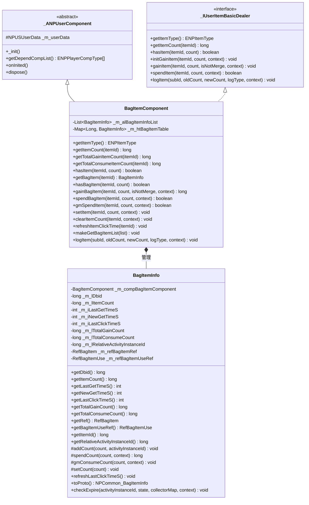
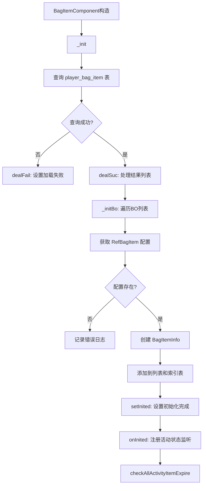
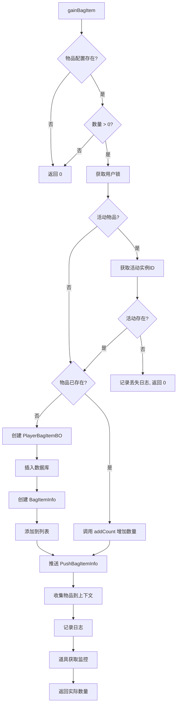
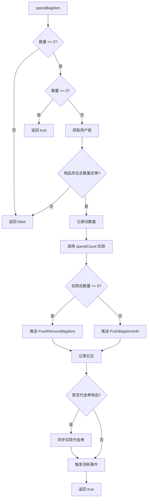

# 背包模块服务端开发文档

## 一、模块架构

### 1.1 模块概述

背包模块（Bag Module）负责管理玩家物品存储，包括：
- 物品存储与管理
- 物品使用与消耗
- 物品出售与转换
- 礼包开启
- 活动物品过期处理

### 1.2 模块编号

协议模块编号: `p006`

主序号: `6`

---

## 二、核心类图



---

## 三、核心数据结构

### 3.1 BagItemComponent - 背包组件

**路径**: `game_server/UserServer/src/NPUSServer/NPUSUserMgr/UserComp/BagItemComp/BagItemComponent.java`

**继承关系**: `BagItemComponent extends _ANPUserComponent implements _IUserItemBasicDealer`

**组件类型**: `ENPPlayerCompType.BAG_ITEM`

**主要属性**:

| 属性名 | 类型 | 说明 |
|--------|------|------|
| _m_alBagItemInfoList | List\<BagItemInfo\> | 背包物品信息存储队列 |
| _m_htBagItemTable | Map\<Long, BagItemInfo\> | 物品ID索引表 |

**主要方法**:

| 方法名 | 参数 | 返回值 | 说明 |
|--------|------|--------|------|
| getItemType | - | ENPItemType | 返回 BAG_ITEM |
| getItemCount | itemId: long | long | 获取物品数量 |
| getTotalGainItemCount | itemId: long | long | 获取物品总获取数量 |
| getTotalConsumeItemCount | itemId: long | long | 获取物品总消耗数量 |
| hasItem | itemId: long, count: long | boolean | 检查物品是否足够 |
| getBagItem | itemId: long | BagItemInfo | 获取物品对象 |
| hasBagItem | itemId: long, count: long | boolean | 检查物品存在 |
| gainBagItem | itemId: long, count: long, isNotMerge: boolean, context: NPPlayerContext | long | 增加物品 |
| spendBagItem | itemId: long, count: long, context: NPPlayerContext | boolean | 扣除物品 |
| gmSpendItem | itemId: long, count: long, context: NPPlayerContext | boolean | GM强制扣除 |
| setItem | itemId: long, count: int, context: NPPlayerContext | void | 设置物品数量 |
| clearItemCount | itemId: long, context: NPPlayerContext | void | 清除物品 |
| refreshItemClickTime | itemId: long | void | 刷新点击时间 |
| makeGetBagItemList | list: ArrayList\<NPCommon_BagItemInfo\> | void | 构建物品列表协议 |
| logItem | subId: long, oldCount: long, newCount: long, logType: ELogItem_Type, context: _IContext | void | 记录日志 |

**完整方法签名**:
```java
// 获取物品类型
public ENPItemType getItemType()

// 获取物品数量
public long getItemCount(long _itemId)

// 获取物品总获取数量
public long getTotalGainItemCount(long _itemId)

// 获取物品总消耗数量
public long getTotalConsumeItemCount(long _itemId)

// 检查物品是否足够
public boolean hasItem(long _itemId, long _count)

// 初始化获取物品
public void initGainItem(long _itemId, long _count, NPPlayerContext _context)

// 获取物品
public void gainItem(long _itemId, long _count, boolean _isNotMerge, NPPlayerContext _context)

// 消耗物品
public boolean spendItem(long _itemId, long _count, NPPlayerContext _context)

// 获取物品对象
public BagItemInfo getBagItem(long _itemId)

// 检查物品存在
public boolean hasBagItem(long _itemId, long _itemCount)

// 增加背包物品
public long gainBagItem(long _itemId, long _itemCount, boolean _isNotMerge, NPPlayerContext _context)

// 扣除物品
public boolean spendBagItem(long _itemId, long _itemCount, NPPlayerContext _context)

// GM强制扣除
public boolean gmSpendItem(long _itemId, long _itemCount, NPPlayerContext _context)

// 设置物品数量
public void setItem(long _itemId, int _itemCount, NPPlayerContext _context)

// 清除物品
public void clearItemCount(long _itemId, NPPlayerContext _context)

// 刷新点击时间
public void refreshItemClickTime(long _itemId)

// 构建物品列表
public void makeGetBagItemList(ArrayList<NPCommon_BagItemInfo> _list)

// 记录日志
public void logItem(long _subId, long _oldCount, long _newCount, ELogItem_Type _logType, _IContext _context)
```

---

### 3.2 BagItemInfo - 物品信息

**路径**: `game_server/UserServer/src/NPUSServer/NPUSUserMgr/UserComp/BagItemComp/BagItemInfo.java`

**主要属性**:

| 属性名 | 类型 | 说明 |
|--------|------|------|
| _m_compBagItemComponent | BagItemComponent | 所属组件 |
| _m_lDbid | long | 数据库ID |
| _m_lItemCount | long | 物品数量 |
| _m_iLastGetTimeS | int | 最后获取时间(秒) |
| _m_iNewGetTimeS | int | 首次获取时间(秒) |
| _m_iLastClickTimeS | int | 最后点击时间(秒) |
| _m_lTotalGainCount | long | 总获取数量 |
| _m_lTotalConsumeCount | long | 总消耗数量 |
| _m_lRelativeActivityInstanceId | long | 关联活动实例ID |
| _m_refBagItemRef | RefBagItem | 物品配置引用 |
| _m_refBagItemUseRef | RefBagItemUse | 物品使用配置引用 |

**主要方法**:

| 方法名 | 说明 |
|--------|------|
| getDbid() | 获取数据库ID |
| getItemCount() | 获取物品数量 |
| getLastGetTimeS() | 获取最后获取时间 |
| getNewGetTimeS() | 获取首次获取时间 |
| getLastClickTimeS() | 获取最后点击时间 |
| getTotalGainCount() | 获取总获取数量 |
| getTotalConsumeCount() | 获取总消耗数量 |
| getRef() | 获取物品配置 |
| getBagItemUseRef() | 获取物品使用配置 |
| getItemId() | 获取物品ID |
| getRelativeActivityInstanceId() | 获取关联活动实例ID |
| addCount(count, activityInstanceId) | 增加数量 (protected) |
| spendCount(count, context) | 扣除数量 (protected) |
| gmConsumeCount(count, context) | GM强制扣除 (protected) |
| setCount(count) | 设置数量 (protected) |
| refreshLastClickTimeS() | 刷新点击时间 |
| toProto() | 转换为协议对象 |
| checkExpire(...) | 检查过期 |

---

## 四、协议处理

### 4.1 请求协议 (GC2GS)

| 协议名 | 主序号 | 子序号 | 说明 |
|--------|--------|--------|------|
| GC2GS_006_001_ReqSellBagItem | 6 | 1 | 出售背包物品 |
| GC2GS_006_002_ReqBagUseItem | 6 | 2 | 使用背包物品 |
| GC2GS_006_003_ReqRefreshQuitBagTime | 6 | 3 | 刷新退出背包时间 |
| GC2GS_006_004_ReqClickBagTime | 6 | 4 | 点击背包时间 |
| GC2GS_006_007_ReqConvert | 6 | 7 | 转换物品 |
| GC2GS_006_008_ReqAKeyConvert | 6 | 8 | 一键转换 |
| GC2GS_006_009_ReqBagUseItemForSelectHero | 6 | 9 | 选择英雄使用物品 |
| GC2GS_006_010_ReqBagUseItemForSelectConsort | 6 | 10 | 选择伴侣使用物品 |

---

## 五、核心逻辑流程

### 5.1 组件初始化流程



### 5.2 获得物品流程 (gainBagItem)



### 5.3 消耗物品流程 (spendBagItem)



### 5.4 使用物品流程

```
客户端                          服务端
   |                               |
   |--- ReqBagUseItem ------------>|
   |                               | 1. 获取物品对象
   |                               | 2. 验证物品数量
   |                               | 3. 获取物品使用配置
   |                               | 4. 检查使用条件
   |                               | 5. 检查前置效果
   |                               | 6. 执行使用效果
   |                               | 7. 扣除物品 (如需)
   |                               | 8. 发放奖励
   |<-- RetBagUseItem -------------|
   |<-- PushBagItemInfo ----------| (推送物品变化)
   |                               |
```

### 5.5 出售物品流程

```
客户端                          服务端
   |                               |
   |--- ReqSellBagItem ----------->|
   |                               | 1. 验证物品是否存在
   |                               | 2. 验证物品是否可出售
   |                               | 3. 验证物品数量
   |                               | 4. 计算出售价格
   |                               | 5. 扣除物品数量
   |                               | 6. 发放出售货币
   |<-- RetSellBagItem ------------|
   |<-- PushBagItemInfo ----------| (推送物品变化)
   |                               |
```

---

## 六、数据库设计

### 6.1 背包数据表 (player_bag_item)

| 字段名 | 类型 | 说明 |
|--------|------|------|
| id | BIGINT | 主键 (自增) |
| cid | BIGINT | 玩家ID |
| itemId | BIGINT | 物品配置ID |
| itemCount | BIGINT | 物品数量 |
| lastGetTimeS | INT | 最后获取时间 |
| newGetTimeS | INT | 首次获取时间 |
| lastClickTimeS | INT | 最后点击时间 |
| total_gain_count | BIGINT | 总获取数量 |
| total_consume_count | BIGINT | 总消耗数量 |
| relative_activity_instance_id | BIGINT | 关联活动实例ID |

**索引**:
- PRIMARY KEY: `id`
- KEY: `cid`

---

## 七、服务配置

### 7.1 协议注册

```java
// 协议主序号
public const byte BAG_MODULE_ORDER = 6;

// 协议处理器注册
protocolHandler.Register<GC2GS_006_001_ReqSellBagItem>(OnSellBagItem);
protocolHandler.Register<GC2GS_006_002_ReqBagUseItem>(OnBagUseItem);
protocolHandler.Register<GC2GS_006_003_ReqRefreshQuitBagTime>(OnRefreshQuitBagTime);
protocolHandler.Register<GC2GS_006_004_ReqClickBagTime>(OnClickBagTime);
protocolHandler.Register<GC2GS_006_007_ReqConvert>(OnConvert);
protocolHandler.Register<GC2GS_006_008_ReqAKeyConvert>(OnAKeyConvert);
protocolHandler.Register<GC2GS_006_009_ReqBagUseItemForSelectHero>(OnBagUseItemForSelectHero);
protocolHandler.Register<GC2GS_006_010_ReqBagUseItemForSelectConsort>(OnBagUseItemForSelectConsort);
```

### 7.2 服务依赖

背包模块依赖以下服务：

| 服务名称 | 说明 |
|----------|------|
| PlayerDataService | 玩家数据服务 |
| ResourceService | 资源服务 |
| RefdataService | 配置数据服务 |
| PushService | 推送服务 |
| HeroService | 英雄服务 (英雄相关物品) |
| MailService | 邮件服务 (过期物品补偿) |
| ActivityService | 活动服务 (活动物品) |

---

## 八、关键代码示例

### 8.1 获得物品

```java
/**
 * 增加背包物品
 * @param _itemId 物品配置ID
 * @param _itemCount 增加数量
 * @param _isNotMerge 是否不合并
 * @param _context 上下文
 * @return 实际增加数量
 */
public long gainBagItem(long _itemId, long _itemCount, boolean _isNotMerge, NPPlayerContext _context)
{
    RefBagItem refBagItem = RefBagItem.getMgr().get(_itemId);
    if (refBagItem == null || _itemCount <= 0)
        return 0L;

    getUserData().lockUser();
    try
    {
        long oldCount = 0;
        long activityInstanceId = 0L;

        // 检查活动物品配置
        RefActivityBagItem refActivityBagItem = refBagItem.relativeActivityBagItemRef;
        if (refActivityBagItem != null)
        {
            _AActivityBase activity = getUSServer().getCommActivityMgr()
                .lookupOneActivityByActivityId(refActivityBagItem.activity_id);
            if (activity != null)
            {
                activityInstanceId = activity.getInstanceId();
            }
            else
            {
                // 记录无效丢失日志
                MJLog.logItemChg(getUserData(), ENPItemType.BAG_ITEM, _itemId, 3,
                        0L, _itemCount, 0L, _context.getContextId());
                return 0L;
            }
        }

        BagItemInfo info = getBagItem(_itemId);
        if (null == info)
        {
            // 创建新物品记录
            BM bmObj = getUSServer().getBM();

            PlayerBagItemBO bo = new PlayerBagItemBO();
            bo.setCid(bmObj, getUserData().getCid());
            bo.setItemId(bmObj, _itemId);
            bo.setItemCount(bmObj, _itemCount);
            bo.setLastGetTimeS(bmObj, CommonFunc.getNowTimeSec());
            bo.setNewGetTimeS(bmObj, CommonFunc.getNowTimeSec());
            bo.setRelativeActivityInstanceId(bmObj, activityInstanceId);
            bo.insert(bmObj);

            info = new BagItemInfo(this, bo, refBagItem);
            _m_alBagItemInfoList.add(info);
            _m_htBagItemTable.put(_itemId, info);
        }
        else
        {
            oldCount = info.getItemCount();
            info.addCount(_itemCount, activityInstanceId);
        }

        // 推送协议
        getUserData().pushMsgToGC(US2GCWriter_006_BagItemOp.make_050_PushBagItemInfo(info));

        // 收集物品到上下文
        _context.collectItem(getItemType(), _itemId, _itemCount, _isNotMerge);

        // 记录日志
        logItem(_itemId, oldCount, info.getItemCount(), ELogItem_Type.GAIN, _context);
        MJLog.logItemChg(getUserData(), ENPItemType.BAG_ITEM, _itemId, 1,
                oldCount, _itemCount, info.getItemCount(), _context.getContextId());

        // 道具获取途径监控
        ItemAcquisitionMonitor.checkVoucherItemGain(_itemId, _itemCount, info.getItemCount(),
                _context, getUserData(), getUSServer().getDDAlert());

        return _itemCount;
    }
    finally
    {
        getUserData().unlockUser();
    }
}
```

### 8.2 消耗物品

```java
/**
 * 扣除物品
 * @param _itemId 物品配置ID
 * @param _itemCount 扣除数量
 * @param _context 上下文
 * @return 是否成功
 */
public boolean spendBagItem(long _itemId, long _itemCount, NPPlayerContext _context)
{
    if (_itemCount < 0)
        return false;
    if (_itemCount == 0)
        return true;

    getUserData().lockUser();
    try
    {
        BagItemInfo info = getBagItem(_itemId);
        if (null == info || info.getItemCount() < _itemCount)
            return false;

        long oldCount = info.getItemCount();
        info.spendCount(_itemCount, _context);

        // 推送协议
        if (0 == info.getItemCount())
            getUserData().pushMsgToGC(US2GCWriter_006_BagItemOp.make_051_PushRemoveBagItem(_itemId));
        else
            getUserData().pushMsgToGC(US2GCWriter_006_BagItemOp.make_050_PushBagItemInfo(info));

        // 记录日志
        logItem(_itemId, oldCount, info.getItemCount(), ELogItem_Type.CONSUME, _context);
        MJLog.logItemChg(getUserData(), ENPItemType.BAG_ITEM, _itemId, 2,
                oldCount, _itemCount, info.getItemCount(), _context.getContextId());

        // 代金券同步
        if (RefGeneral.Ref().voucher_item_bag_item_id == _itemId)
        {
            SpecialItemDealer_PaidVoucher dealer =
                    getUserData().getSpecialItemComponent().getDealer(ESpecialItemType.PAID_VOUCHER, SpecialItemDealer_PaidVoucher.class);
            if (dealer != null)
            {
                dealer.spendItem(_itemCount, _context);
            }
        }

        // 触发消耗事件
        getUserData().onLogicEvent(new Event_P_CONSUME_BAG_ITEM(_context, _itemId, _itemCount));

        return true;
    }
    finally
    {
        getUserData().unlockUser();
    }
}
```

### 8.3 活动物品过期处理

```java
/**
 * 检查所有活动物品过期
 */
private void checkAllActivityItemExpire()
{
    getUserData().lockUser();
    try
    {
        Map<Long, NPItemCostCollector_nosafe> collectorMap = new HashMap<>();
        NPPlayerContext context = NPPlayerContext.createNew(ENPGameEvent.ACTIVITY_ITEM_EXPIRED);

        for (BagItemInfo bagItemInfo : _m_alBagItemInfoList)
        {
            if (bagItemInfo == null || bagItemInfo.getRelativeActivityInstanceId() == 0)
                continue;

            EActivityState state = EActivityState.CAN_DISCARD;
            _AActivityBase activity = getUSServer().getCommActivityMgr()
                .lookupActivity(bagItemInfo.getRelativeActivityInstanceId());
            if (activity != null)
                state = activity.getMachine().getCurState().getStateType();

            // 过期处理
            bagItemInfo.checkExpire(bagItemInfo.getRelativeActivityInstanceId(), state, collectorMap, context);
        }

        if (collectorMap.isEmpty())
            return;

        // 发送过期补偿邮件
        _sendExpiredActivityItemMail(collectorMap, context);
    }
    finally
    {
        getUserData().unlockUser();
    }
}
```

---

## 九、跨模块依赖

### 9.1 依赖模块

| 模块名称 | 依赖方式 | 依赖说明 |
|----------|----------|----------|
| Player | 数据读取 | 获取玩家等级、VIP等 |
| Resource | 功能调用 | 扣除/发放货币 |
| Mail | 功能调用 | 背包满时转邮件 |
| Hero | 功能调用 | 英雄相关物品使用 |
| Activity | 事件监听 | 活动状态变化处理 |

### 9.2 被依赖情况

| 模块名称 | 依赖方式 | 依赖说明 |
|----------|----------|----------|
| Activity | 功能调用 | 发放活动奖励 |
| Quest | 功能调用 | 发放任务奖励 |
| Shop | 功能调用 | 发放购买物品 |
| Dungeon | 功能调用 | 发放副本奖励 |

---

## 十、注意事项

1. **线程安全**: 所有操作都需要先获取用户锁 (`getUserData().lockUser()`)

2. **活动物品**: 关联活动的物品会在活动结束时自动过期并发送补偿邮件

3. **日志记录**: 物品变动都会记录日志，便于追踪和补偿

4. **代金券同步**: 扣除代金券物品时需要同步扣除代金券余额

5. **GM命令**: `gmSpendItem` 支持扣到负数，仅用于GM命令

6. **数量为0**: 初始化下发时会过滤数量为0的物品，但数据库中保留记录

---

*文档生成时间: 2026-04-11*