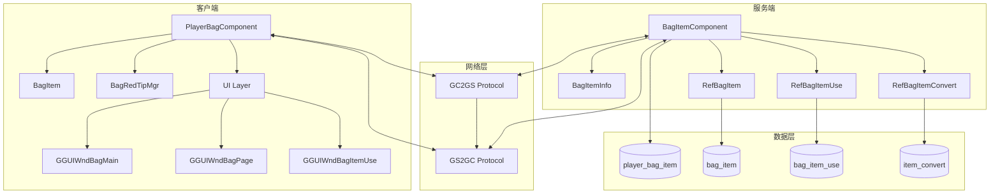
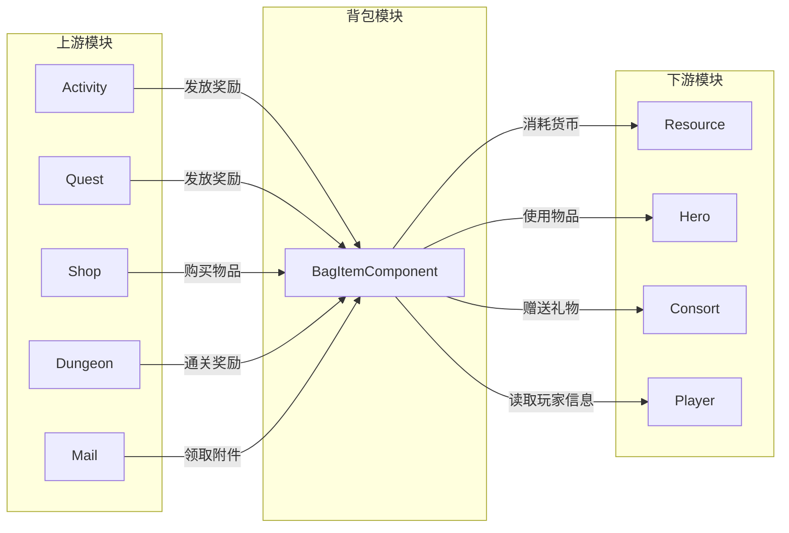
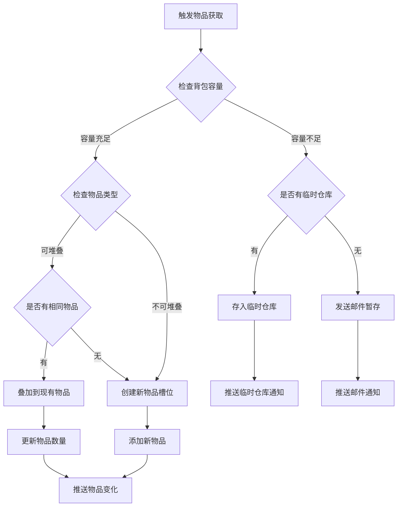
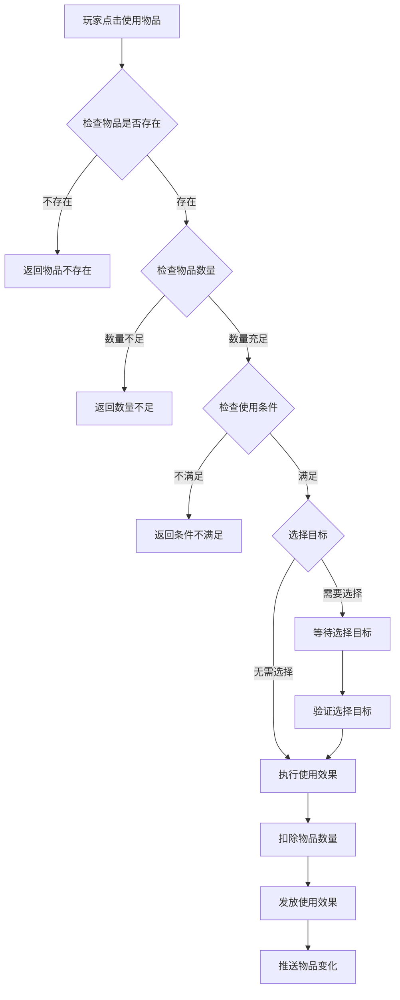
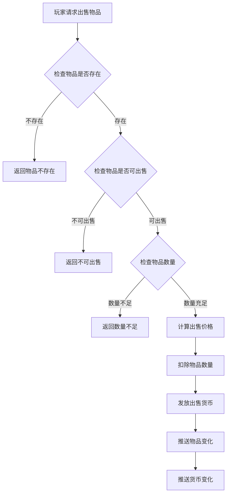
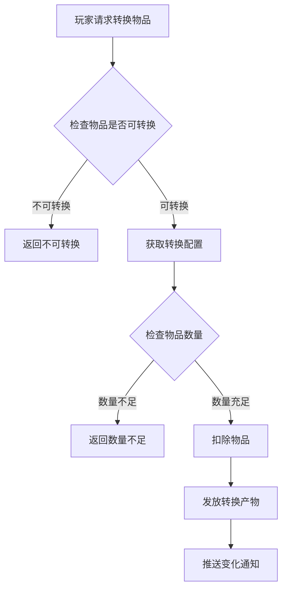
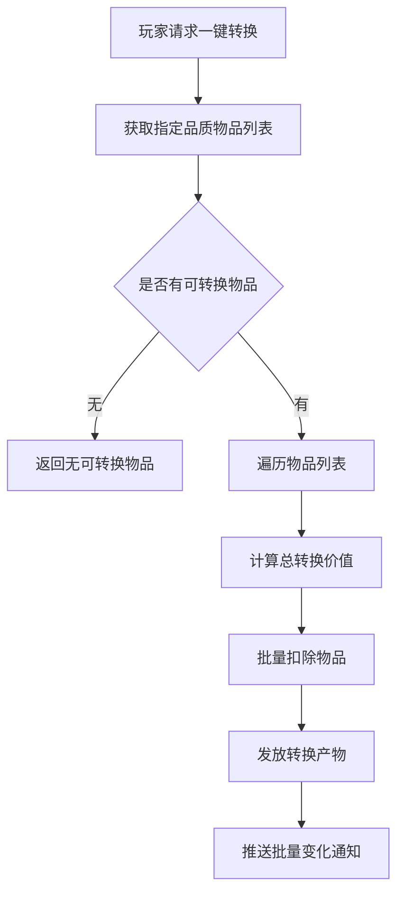
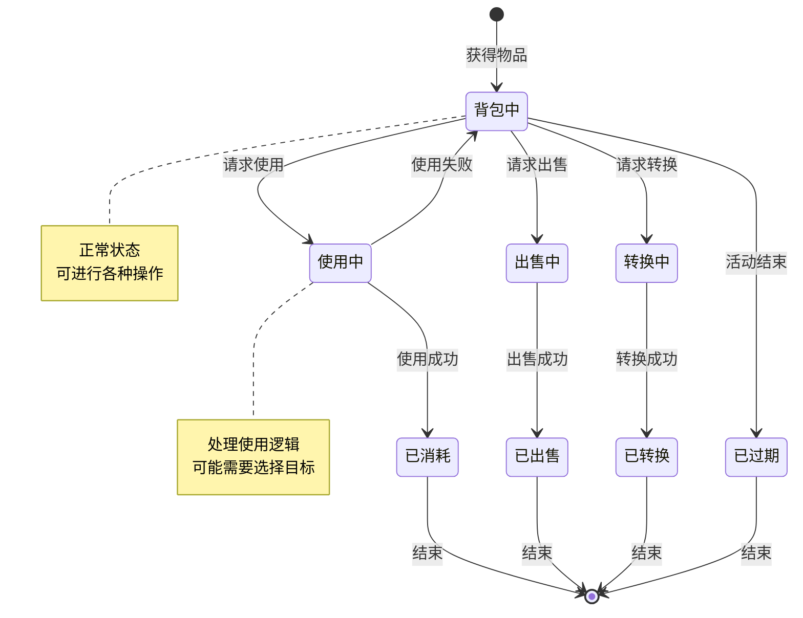
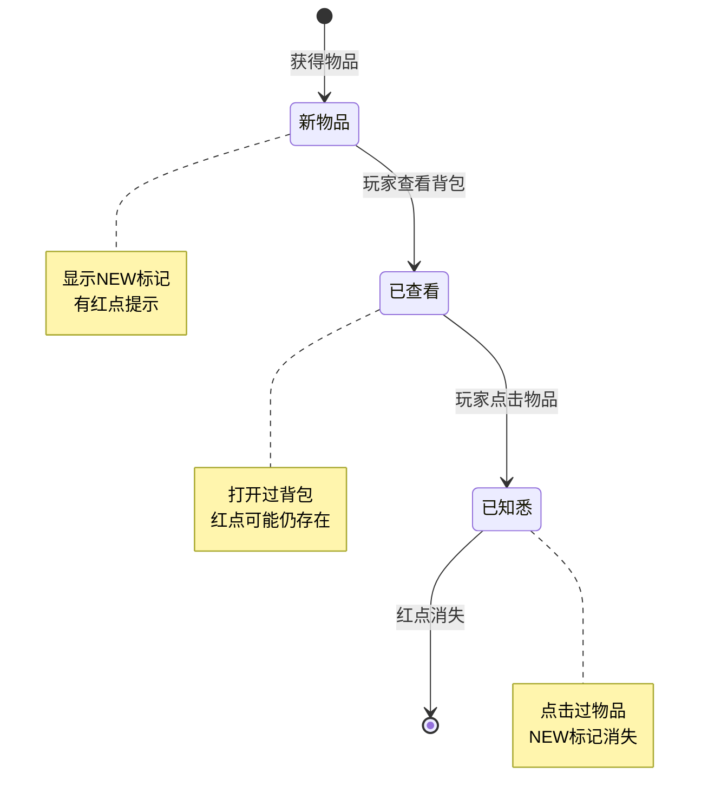
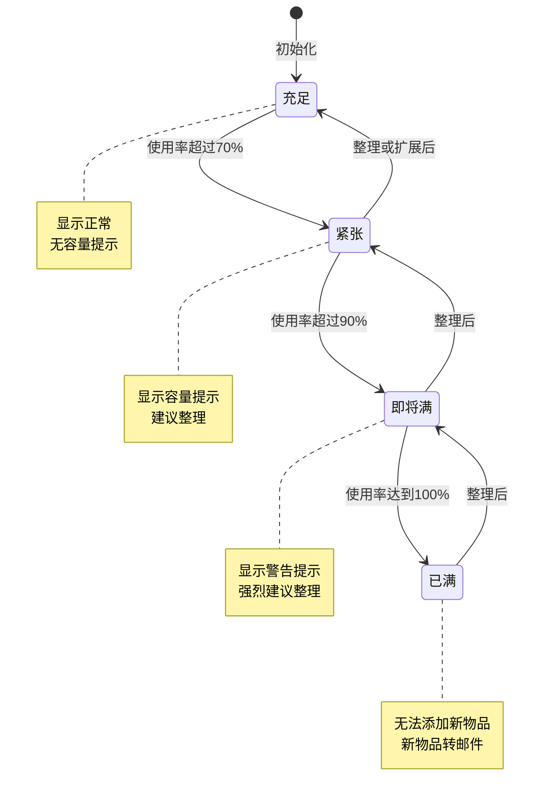

# 背包模块完整说明

## 一、模块概述

### 1.1 业务背景

背包模块是游戏的核心基础模块，管理玩家获得的所有物品。玩家通过各种途径获得的道具、材料、礼包等都会存放在背包中。背包为玩家提供物品存储、查看、使用、出售等功能。

### 1.2 目标用户

- **所有游戏玩家**：每个玩家都使用背包管理物品
- **收集型玩家**：关注物品收集和整理
- **交易型玩家**：频繁使用物品和出售物品

### 1.3 核心价值

1. **物品存储**：统一管理玩家所有物品
2. **物品使用**：提供物品使用功能
3. **物品整理**：支持物品分类和排序
4. **资源转换**：通过出售/转换实现价值流转

---

## 二、模块架构图

### 2.1 整体架构



### 2.2 组件依赖关系



---

## 三、功能清单

### 3.1 物品管理功能

| 功能名称 | 功能描述 | 用户价值 |
|---------|---------|---------|
| 物品列表 | 显示背包中所有物品 | 了解物品情况 |
| 物品详情 | 查看物品详细信息 | 了解物品用途 |
| 物品排序 | 按类型、品质、时间排序 | 方便查找物品 |
| 物品筛选 | 按类型筛选物品 | 快速定位物品 |
| 物品搜索 | 搜索指定名称物品 | 精确查找物品 |

### 3.2 物品操作功能

| 功能名称 | 功能描述 | 用户价值 |
|---------|---------|---------|
| 使用物品 | 使用消耗品、礼包等 | 获得物品效果 |
| 出售物品 | 出售不需要的物品 | 获得货币收益 |
| 转换物品 | 将物品转换为其他资源 | 资源回收利用 |
| 一键转换 | 批量转换指定品质物品 | 快速清理背包 |

### 3.3 物品类型功能

| 功能名称 | 功能描述 | 用户价值 |
|---------|---------|---------|
| 消耗品使用 | 使用消耗品获得效果 | 获得即时效果 |
| 礼包开启 | 开启礼包获得奖励 | 获得礼包内容 |
| 碎片合成 | 集齐碎片合成道具 | 完整道具获取 |
| 材料查看 | 查看材料用途信息 | 了解材料价值 |

### 3.4 背包扩展功能

| 功能名称 | 功能描述 | 用户价值 |
|---------|---------|---------|
| 扩展容量 | 增加背包格子数量 | 存储更多物品 |
| 容量提示 | 提示背包容量状态 | 防止物品丢失 |
| 临时仓库 | 超出容量的临时存储 | 避免立即丢失 |

---

## 四、业务流程详解

### 4.1 物品获取流程



**详细步骤说明**：

1. **容量检查**
   - 检查背包当前容量
   - 检查是否有空余格子
   - 如有临时仓库检查临时仓库容量

2. **物品处理**
   - 可堆叠物品尝试叠加
   - 不可堆叠物品创建新槽位
   - 更新物品数据

3. **通知推送**
   - 推送物品变化通知
   - 如发送邮件推送邮件通知

### 4.2 物品使用流程



**详细步骤说明**：

1. **条件校验**
   - 验证物品是否存在
   - 验证物品数量是否充足
   - 验证使用条件（等级、VIP等）

2. **目标选择**
   - 部分物品需要选择目标
   - 如选择英雄使用物品
   - 验证目标有效性

3. **效果执行**
   - 扣除物品数量
   - 执行物品效果（发放奖励、增加属性等）
   - 推送变化通知

### 4.3 物品出售流程



### 4.4 物品转换流程



### 4.5 一键转换流程



---

## 五、关键规则

### 5.1 物品堆叠规则

1. **可堆叠物品**
   - 相同配置ID的物品可堆叠
   - 堆叠上限由配置决定
   - 超过上限创建新槽位

2. **不可堆叠物品**
   - 每个物品独立槽位
   - 如装备、已绑定物品等

### 5.2 物品品质规则

1. **品质等级**

| 枚举值 | 数值 | 说明 | 颜色 |
|--------|------|------|------|
| NONE | 0 | 无品质 | - |
| WHITE | 1 | 普通 | 白色 |
| GREEN | 2 | 优秀 | 绿色 |
| BLUE | 3 | 精良 | 蓝色 |
| PURPLE | 4 | 史诗 | 紫色 |
| ORANGE | 5 | 传说 | 橙色 |
| RED | 6 | 神话 | 红色 |

2. **品质影响**
   - 出售价格
   - 转换价值
   - 物品特效

### 5.3 物品使用规则

1. **使用条件**
   - 等级限制
   - VIP限制
   - 场景限制
   - 冷却时间

2. **使用次数**
   - 部分物品有使用次数限制
   - 每日使用上限
   - 终身使用上限

### 5.4 背包容量规则

1. **容量配置**
   - 初始容量：由配置决定
   - 最大容量：由配置决定
   - 扩展消耗钻石

2. **容量不足处理**
   - 新增物品发送邮件
   - 临时仓库暂存（如有）

---

## 六、物品状态机

### 6.1 物品生命周期



### 6.2 新物品状态



### 6.3 背包容量状态机



---

## 七、用户故事

### 7.1 新玩家故事

> 作为一名新玩家，我完成了新手任务获得了一些奖励物品。打开背包后看到物品整齐排列，我点击查看了一个礼包的详情，了解了可以获得的奖励后使用了它，获得了一些银两和材料，开始我的冒险旅程。

### 7.2 收集玩家故事

> 作为一名收集型玩家，我经常整理背包。通过筛选功能，我可以快速查看所有材料类物品。我会把不需要的低品质物品一键转换成通用材料，保持背包整洁有序。

### 7.3 战斗玩家故事

> 作为一名战斗玩家，我经常在副本中使用体力药水和增益道具。背包的快速使用功能让我可以方便地使用物品。战斗结束后，我会出售不需要的装备，换取银两强化我的英雄。

---

## 八、示例

### 8.1 物品信息示例

**物品配置**：
```
物品ID: 10001
物品名称: 初级体力药水
类型: 消耗品
品质: 普通（白）
最大堆叠: 99
描述: 恢复20点体力
出售价格: 银两×100
```

**背包数据**：
```
数据库ID: 10000001
玩家ID: 12345
物品ID: 10001
数量: 5
获得时间: 2026-04-11 10:00:00
是否新物品: 是
```

### 8.2 物品使用示例

**使用前**：
```
物品: 初级体力药水 × 5
玩家体力: 80/100
```

**操作**：使用1个体力药水

**使用后**：
```
物品: 初级体力药水 × 4
玩家体力: 100/100 (恢复20点，达到上限)
```

### 8.3 物品出售示例

**出售配置**：
```
物品: 破旧的装备碎片
品质: 普通
出售价格: 银两×50/个
```

**操作**：出售10个碎片

**结果**：
```
物品变化: 破旧的装备碎片 -10
货币变化: 银两 +500
```

### 8.4 一键转换示例

**转换配置**：
```
品质: 普通、优秀
转换产物: 强化石
转换比例: 5个物品 → 1个强化石
```

**操作**：一键转换普通和优秀品质物品

**背包状态**：
```
转换前:
  - 普通物品 × 30
  - 优秀物品 × 20

转换后:
  - 普通物品 × 0
  - 优秀物品 × 0
  - 强化石 × 10 (50/5=10)
```

---

## 九、接口调用示例

### 9.1 服务端调用

```java
// 获取背包组件
BagItemComponent bagComp = userData.getBagItemComponent();

// 增加物品
NPPlayerContext context = NPPlayerContext.createNew(ENPGameEvent.GM_COMMAND);
bagComp.gainBagItem(10001, 10, false, context);

// 检查物品数量
long count = bagComp.getItemCount(10001);

// 扣除物品
bagComp.spendBagItem(10001, 5, context);

// 设置物品数量 (GM)
bagComp.setItem(10001, 100, context);

// GM强制扣除 (支持扣到负数)
bagComp.gmSpendItem(10001, 1000, context);

// 清除物品
bagComp.clearItemCount(10001, context);

// 清除所有物品
bagComp.clearItemCount(0, context);
```

### 9.2 客户端调用

```csharp
// 获取背包组件
PlayerBagComponent bagComp = NPPlayer.instance.bagComp;

// 获取物品数量
long count = bagComp.getItemCount(10001);

// 获取指定物品
BagItem item = bagComp.getItem(10001);

// 请求使用物品
bagComp.reqUseItems(item, 1, null, (msg) => {
    Debug.Log("使用结果: " + msg);
});

// 遍历所有物品
bagComp.dealAllItem((item) => {
    Debug.Log($"物品: {item.itemId}, 数量: {item.count}");
});

// 条件筛选物品
List<BagItem> items = new List<BagItem>();
bagComp.addRangeItemList(items, (item) => {
    return item.quality == EQuality.BLUE && item.count > 0;
});

// 转换物品
bagComp.reqItemConvert(bagItemId, targetCount, () => {
    Debug.Log("转换成功");
});

// 对英雄使用物品
bagComp.reqBagUseItemForSelectHero(heroId, itemId, count, (msg) => {
    Debug.Log("使用结果: " + msg);
});
```

---

## 十、错误处理

### 10.1 常见错误

| 错误码 | 说明 | 处理方式 |
|--------|------|----------|
| 90001 | 物品不存在 | 检查物品ID有效性 |
| 90002 | 物品数量不足 | 检查物品数量 |
| 90003 | 背包已满 | 提示玩家清理背包 |
| 90004 | 物品不可使用 | 检查物品类型配置 |
| 90005 | 物品不可出售 | 检查 can_sell 配置 |
| 90006 | 使用条件不满足 | 检查 use_cond 配置 |
| 90007 | 冷却时间未结束 | 等待冷却时间结束 |
| 90008 | 目标无效 | 检查选择目标有效性 |
| 90009 | 活动物品已过期 | 物品因活动结束而过期 |

### 10.2 异常场景处理

| 场景 | 处理策略 |
|------|----------|
| 活动物品活动不存在 | 记录丢失日志，不发放物品 |
| 背包满时获得物品 | 转邮件发送 |
| 活动物品过期 | 发送补偿邮件 |
| 配置缺失 | 记录错误日志，跳过处理 |

---

*文档生成时间: 2026-04-11*