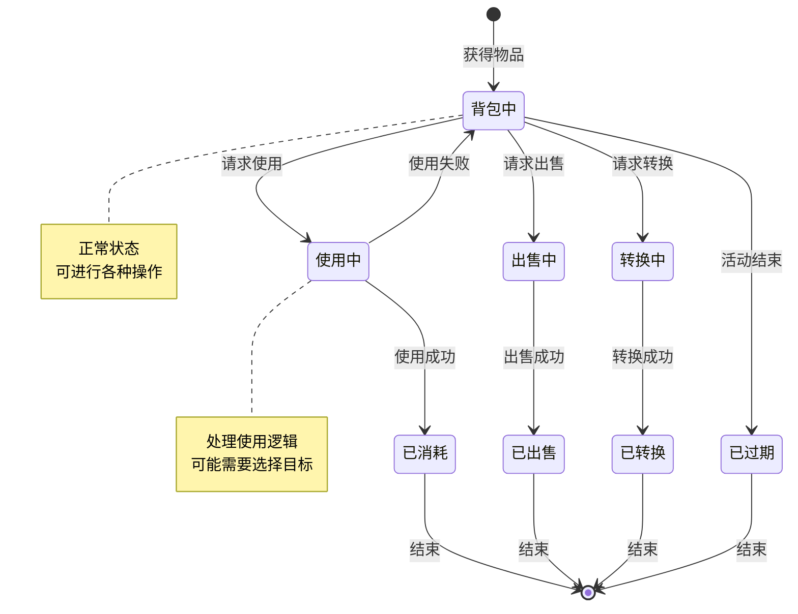
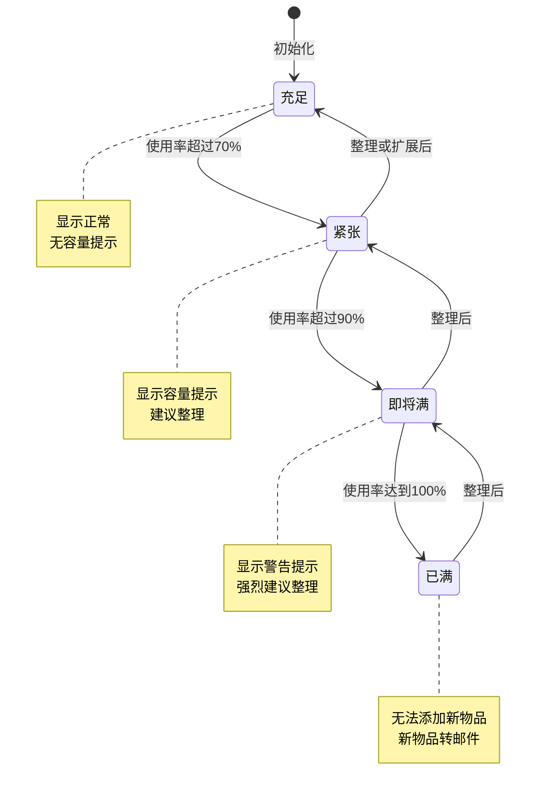
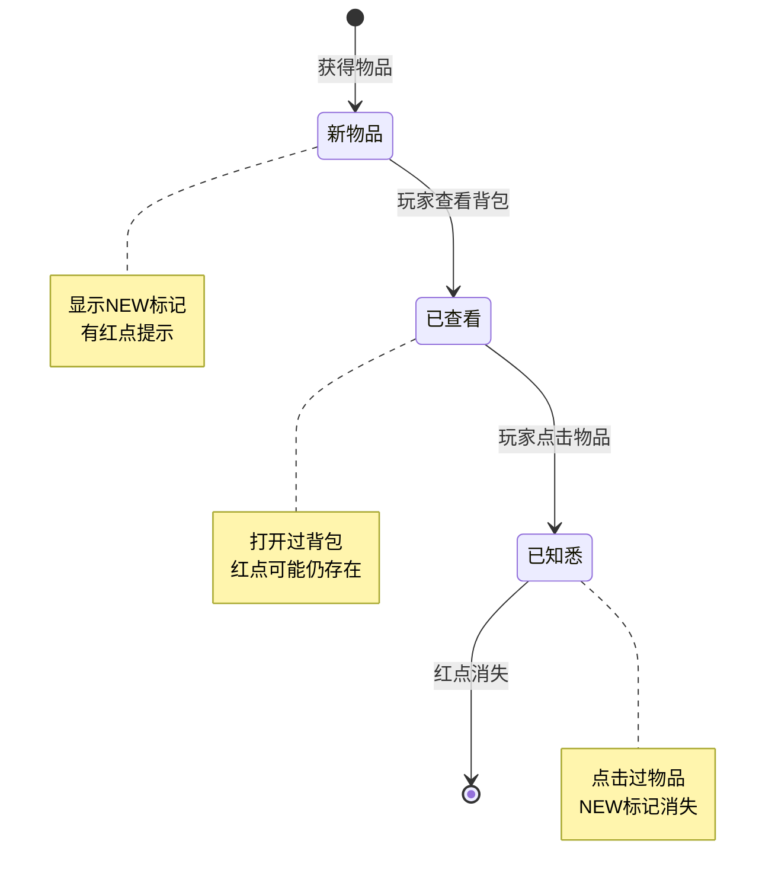
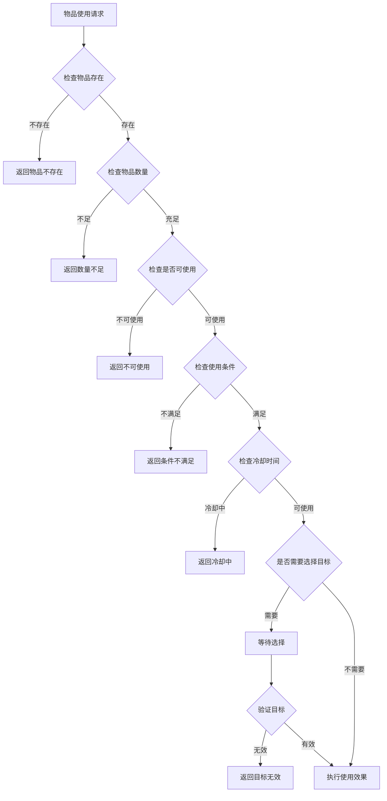
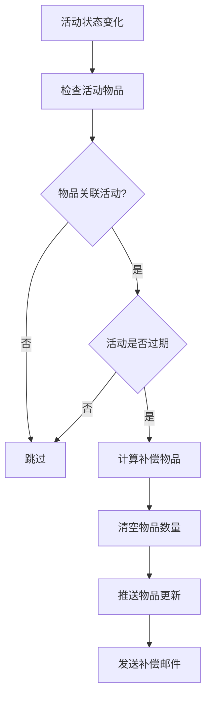
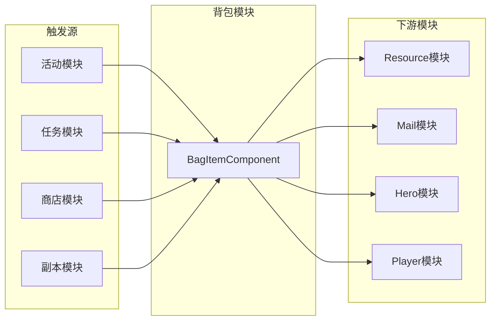

# 背包模块实现细节

## 一、计算公式

### 1.1 物品堆叠计算公式

```
可堆叠数量 = min(剩余堆叠空间, 新增数量)
剩余堆叠空间 = 最大堆叠数 - 当前数量
需要新槽位数 = ceil((新增数量 - 可堆叠数量) / 最大堆叠数)
```

**示例计算**：
```
最大堆叠数: 99
槽位1当前数量: 80
新增数量: 50

剩余堆叠空间 = 99 - 80 = 19
可堆叠数量 = min(19, 50) = 19
槽位1更新后数量 = 80 + 19 = 99

剩余新增 = 50 - 19 = 31
需要新槽位数 = ceil(31 / 99) = 1

最终结果:
  - 槽位1: 99个
  - 新槽位: 31个
```

### 1.2 出售价格计算公式

```
实际出售价格 = 基础价格 × 数量 × 价格系数
价格系数 = 1 + VIP加成
```

**示例计算**：
```
基础价格: 100银两
数量: 10
VIP加成: 10%

实际出售价格 = 100 × 10 × (1 + 0.1) = 1100银两
```

### 1.3 背包容量计算公式

```
已用容量 = 非空槽位数量
剩余容量 = 总容量 - 已用容量
容量使用率 = 已用容量 / 总容量 × 100%
```

### 1.4 物品转换计算公式

```
转换产出数量 = floor(输入物品数量 / 转换比例)
剩余物品数量 = 输入物品数量 % 转换比例
```

**示例计算**：
```
输入物品数量: 23
转换比例: 5个输入 → 1个产出

转换产出数量 = floor(23 / 5) = 4
剩余物品数量 = 23 % 5 = 3

结果: 获得4个产出，消耗20个输入，剩余3个输入
```

### 1.5 总消耗计算公式

```java
/**
 * 计算总消耗(包括原道具)
 */
public List<NPCommonCostItem> calConvertTotalConsume(int _count)
{
    List<NPCommonCostItem> items = new ArrayList<>();
    items.add(new NPCommonCostItem(ENPItemType.BAG_ITEM, bag_item_id, ori_item_num));
    for (NPCommonCostItem costItem : cost_item_list)
    {
        items.add(new NPCommonCostItem(costItem.getItemType(), costItem.getItemId(), costItem.getCount()));
    }
    return CommonFunc.itemMultiple(items, _count);
}
```

---

## 二、状态机定义

### 2.1 物品状态机



### 2.2 背包容量状态机



### 2.3 物品新状态机



---

## 三、数据约束

### 3.1 物品数据约束

| 字段名 | 数据类型 | 取值范围 | 必填 | 说明 |
|--------|----------|----------|------|------|
| id | BIGINT | > 0 | 是 | 主键 |
| cid | BIGINT | > 0 | 是 | 玩家ID |
| itemId | BIGINT | > 0 | 是 | 物品配置ID |
| itemCount | BIGINT | >= 0 | 是 | 数量 |
| lastGetTimeS | INT | >= 0 | 是 | 最后获取时间 |
| newGetTimeS | INT | >= 0 | 是 | 首次获取时间 |
| lastClickTimeS | INT | >= 0 | 是 | 最后点击时间 |
| total_gain_count | BIGINT | >= 0 | 是 | 总获取数量 |
| total_consume_count | BIGINT | >= 0 | 是 | 总消耗数量 |
| relative_activity_instance_id | BIGINT | >= 0 | 是 | 活动实例ID |

### 3.2 物品配置约束

| 字段名 | 数据类型 | 取值范围 | 必填 | 说明 |
|--------|----------|----------|------|------|
| id | long | > 0 | 是 | 物品配置ID |
| can_sell | boolean | - | 是 | 是否可出售 |
| need_redtip_when_add | boolean | - | 是 | 是否红点提示 |
| quality | EQuality | 0-6 | 是 | 品质 |
| is_spend_record | boolean | - | 是 | 是否消耗计数 |

### 3.3 物品使用配置约束

| 字段名 | 数据类型 | 取值范围 | 必填 | 说明 |
|--------|----------|----------|------|------|
| id | long | > 0 | 是 | 效果ID |
| use_not_cost | boolean | - | 是 | 是否消耗自身 |
| cost_item_list | List | - | 否 | 使用消耗 |
| option_item_list | List | - | 否 | 可选奖励 |
| option_count | int | >= 0 | 是 | 可选数量 |
| get_reward_id | long | >= 0 | 否 | 奖励ID |
| use_cond | Condition | - | 否 | 使用条件 |
| effects | List | - | 否 | 使用效果 |

### 3.4 物品转换配置约束

| 字段名 | 数据类型 | 取值范围 | 必填 | 说明 |
|--------|----------|----------|------|------|
| bag_item_id | long | > 0 | 是 | 原物品ID |
| ori_item_num | long | > 0 | 是 | 原材料数量 |
| cost_item_list | List | - | 否 | 消耗列表 |
| target_item | Item | - | 是 | 目标产物 |

---

## 四、错误处理策略

### 4.1 背包模块错误码

| 错误码 | 错误信息 | 处理策略 | 用户提示 |
|--------|----------|----------|----------|
| 90001 | 物品不存在 | 检查物品ID有效性 | "物品不存在" |
| 90002 | 物品数量不足 | 检查物品数量 | "物品数量不足" |
| 90003 | 背包已满 | 检查背包容量 | "背包已满，请整理" |
| 90004 | 物品不可使用 | 检查物品类型 | "该物品无法使用" |
| 90005 | 物品不可出售 | 检查物品配置 | "该物品无法出售" |
| 90006 | 使用条件不满足 | 检查使用条件 | "使用条件不满足" |
| 90007 | 冷却时间未结束 | 检查冷却状态 | "冷却中，请稍后再试" |
| 90008 | 目标无效 | 检查选择目标 | "目标无效" |
| 90009 | 活动物品已过期 | 物品因活动结束而过期 | "活动已结束，物品已过期" |

### 4.2 物品使用错误处理流程



### 4.3 背包容量错误处理

| 错误场景 | 处理策略 | 后续操作 |
|----------|----------|----------|
| 背包已满 | 转邮件发送 | 提示查看邮件 |
| 临时仓库满 | 拒绝获取 | 提示清理仓库 |
| 物品获取失败 | 记录日志 | 人工补偿 |

### 4.4 活动物品过期处理



---

## 五、关键代码示例

### 5.1 服务端 - 物品添加

```java
/**
 * 增加背包物品
 */
public long gainBagItem(long _itemId, long _itemCount, boolean _isNotMerge, NPPlayerContext _context)
{
    // 参数校验
    RefBagItem refBagItem = RefBagItem.getMgr().get(_itemId);
    if (refBagItem == null || _itemCount <= 0)
        return 0L;

    getUserData().lockUser();

    try
    {
        long oldCount = 0;
        long activityInstanceId = 0L;

        // 检查活动物品配置
        RefActivityBagItem refActivityBagItem = refBagItem.relativeActivityBagItemRef;
        if (refActivityBagItem != null)
        {
            _AActivityBase activity = getUSServer().getCommActivityMgr()
                .lookupOneActivityByActivityId(refActivityBagItem.activity_id);
            if (activity != null)
            {
                activityInstanceId = activity.getInstanceId();
            }
            else
            {
                // 记录无效丢失日志
                MJLog.logItemChg(getUserData(), ENPItemType.BAG_ITEM, _itemId, 3,
                        0L, _itemCount, 0L, _context.getContextId());
                return 0L;
            }
        }

        BagItemInfo info = getBagItem(_itemId);
        if (null == info)
        {
            // 创建新物品记录
            BM bmObj = getUSServer().getBM();

            PlayerBagItemBO bo = new PlayerBagItemBO();
            bo.setCid(bmObj, getUserData().getCid());
            bo.setItemId(bmObj, _itemId);
            bo.setItemCount(bmObj, _itemCount);
            bo.setLastGetTimeS(bmObj, CommonFunc.getNowTimeSec());
            bo.setLastClickTimeS(bmObj, 0);
            bo.setNewGetTimeS(bmObj, CommonFunc.getNowTimeSec());
            bo.setRelativeActivityInstanceId(bmObj, activityInstanceId);
            bo.insert(bmObj);

            info = new BagItemInfo(this, bo, refBagItem);

            _m_alBagItemInfoList.add(info);
            _m_htBagItemTable.put(_itemId, info);
        }
        else
        {
            oldCount = info.getItemCount();
            info.addCount(_itemCount, activityInstanceId);
        }

        // 推送协议
        getUserData().pushMsgToGC(US2GCWriter_006_BagItemOp.make_050_PushBagItemInfo(info));

        // 收集物品到上下文
        _context.collectItem(getItemType(), _itemId, _itemCount, _isNotMerge);

        // 记录日志
        logItem(_itemId, oldCount, info.getItemCount(), ELogItem_Type.GAIN, _context);
        MJLog.logItemChg(getUserData(), ENPItemType.BAG_ITEM, _itemId, 1,
                oldCount, _itemCount, info.getItemCount(), _context.getContextId());

        // 道具获取途径监控
        ItemAcquisitionMonitor.checkVoucherItemGain(_itemId, _itemCount, info.getItemCount(),
                _context, getUserData(), getUSServer().getDDAlert());

        return _itemCount;
    }
    finally
    {
        getUserData().unlockUser();
    }
}
```

### 5.2 服务端 - 物品消耗

```java
/**
 * 扣除物品
 */
public boolean spendBagItem(long _itemId, long _itemCount, NPPlayerContext _context)
{
    if (_itemCount < 0)
        return false;

    if (_itemCount == 0)
        return true;

    getUserData().lockUser();

    try
    {
        BagItemInfo info = getBagItem(_itemId);
        if (null == info || info.getItemCount() < _itemCount)
            return false;

        long oldCount = info.getItemCount();

        info.spendCount(_itemCount, _context);

        // 推送协议
        if (0 == info.getItemCount())
            getUserData().pushMsgToGC(US2GCWriter_006_BagItemOp.make_051_PushRemoveBagItem(_itemId));
        else
            getUserData().pushMsgToGC(US2GCWriter_006_BagItemOp.make_050_PushBagItemInfo(info));

        // 日志
        logItem(_itemId, oldCount, info.getItemCount(), ELogItem_Type.CONSUME, _context);
        MJLog.logItemChg(getUserData(), ENPItemType.BAG_ITEM, _itemId, 2,
                oldCount, _itemCount, info.getItemCount(), _context.getContextId());

        // 代金券同步
        if (RefGeneral.Ref().voucher_item_bag_item_id == _itemId)
        {
            SpecialItemDealer_PaidVoucher dealer =
                    getUserData().getSpecialItemComponent().getDealer(ESpecialItemType.PAID_VOUCHER, SpecialItemDealer_PaidVoucher.class);
            if (dealer != null)
            {
                dealer.spendItem(_itemCount, _context);
            }
        }

        // 触发消耗事件
        getUserData().onLogicEvent(new Event_P_CONSUME_BAG_ITEM(_context, _itemId, _itemCount));

        return true;
    }
    finally
    {
        getUserData().unlockUser();
    }
}
```

### 5.3 服务端 - 物品过期检查

```java
/**
 * 检查物品是否过期
 */
public void checkExpire(Long _activityInstanceId, EActivityState _state,
        Map<Long, NPItemCostCollector_nosafe> _collectorMap, NPPlayerContext _context)
{
    // 检查是否是匹配的活动实例
    if (_m_lRelativeActivityInstanceId != _activityInstanceId)
        return;

    RefActivityBagItem refActivityBagItem = RefActivityBagItem.getMgr().get(getItemId());
    if (refActivityBagItem == null)
    {
        USLog.warn("BagItemInfo.checkExpire: RefActivityBagItem not found for cid:{} itemId:{} count:{}",
                _m_compBagItemComponent.getUserData().getCid(), getItemId(), _m_lItemCount);
        return;
    }

    // 判断活动当前状态是否满足过期状态
    boolean shouldExpire = false;
    if (refActivityBagItem.expire_type == EActivityItemExpireTimeType.REWARDING)
    {
        shouldExpire = (_state == EActivityState.REWARDING || _AActivityBase.CLOSE_STATE.contains(_state));
    }
    else if (refActivityBagItem.expire_type == EActivityItemExpireTimeType.CLOSED)
    {
        shouldExpire = (_AActivityBase.CLOSE_STATE.contains(_state));
    }
    if (!shouldExpire)
        return;

    // 只有数量大于0才需要补发
    if(_m_lItemCount != 0)
        _collectorMap.computeIfAbsent(refActivityBagItem.activity_id, k -> new NPItemCostCollector_nosafe())
             .addItemList(CommonFunc.itemMultiple(refActivityBagItem.item_list, _m_lItemCount));

    // 记录过期日志
    long expiredCount = _m_lItemCount;
    MJLog.logItemChg(getComp().getUserData(), ENPItemType.BAG_ITEM, getItemId(), 4,
            expiredCount, expiredCount, 0L, _context.getContextId());

    _m_lItemCount = 0;
    _m_lRelativeActivityInstanceId = 0;

    ALMySqlUpdateValue updateValue = new ALMySqlUpdateValue();
    updateValue.addValueObj("itemCount", _m_lItemCount);
    updateValue.addValueObj("relative_activity_instance_id", _m_lRelativeActivityInstanceId);
    getComp().getUSServer().getBM().getBM(PlayerBagItemBO.class).update("id", _m_lDbid, updateValue);

    // 推送协议
    _m_compBagItemComponent.getUserData().sendMsgToGC(US2GCWriter_006_BagItemOp.make_050_PushBagItemInfo(this));

    // 记录物品日志
    _m_compBagItemComponent.logItem(getItemId(), expiredCount, 0, ELogItem_Type.CONSUME, _context);
}
```

### 5.4 客户端 - 物品更新处理

```csharp
/// <summary>
/// 更新物品 (包括:新增物品、更新物品)
/// </summary>
public void updateItem(NPCommon.NPCommon_BagItemInfo _info)
{
    BagItem target = getItem(_info.getItemId());

    // 若此物品存在,则视为更新物品
    if (target != null)
    {
        bool addCount = _info.getItemCount() - target.count > 0;

        // 更新数量
        target.updateCount(_info.getItemCount());

        // 物品数量增加且需要红点
        if (addCount && target.itemRefObj.need_redtip_when_add)
        {
            // 更新物品获取的时间
            target.updateGetTime(_info.getLastGetTimeS());
            // 管理器增加红点
            BagRedTipMgr.instance.onAddItem(target);
        }

        // 刷新红点
        refreshRedTip();
        // 记录窗口红点状态
        AccountSettingMgr.instance.bagItemWndRedTipSaver?.recordItem(target);

        if (addCount)
            WinMsg.SendMsg(WinMsgType.ON_BAG_ITEM_COUNT_ADD, target);
        // 事件广播
        WinMsg.SendMsg(WinMsgType.ON_BAG_ITEM_UPDATE, target);

        // 发送消息刷新自定义加载prefab
        GCommon.reloadCustomLoadPrefab();
    }
    // 否则视为新增物品
    else
    {
        target = new BagItem(_info);

        if (target.itemRefObj == null)
            return;

        // 如果该物品是自动使用
        if (null != target.itemUseRefObj && target.itemUseRefObj.is_auto_use)
        {
            reqUseItems(target, target.count, null, _msg =>
            {
                GCommon.showUseItemResult(_msg, false);
            });
            return;
        }

        _m_lItemList.Add(target);

        // 管理器添加小红点
        BagRedTipMgr.instance.onAddItem(target);

        // 刷新红点
        refreshRedTip();
        // 记录窗口红点状态
        AccountSettingMgr.instance.bagItemWndRedTipSaver?.recordItem(target);

        WinMsg.SendMsg(WinMsgType.ON_BAG_ITEM_COUNT_ADD, target);
        // 事件广播
        WinMsg.SendMsg(WinMsgType.ON_BAG_ITEM_ADD, target);

        // 发送消息刷新自定义加载prefab
        GCommon.reloadCustomLoadPrefab();
    }
}
```

### 5.5 客户端 - 使用物品请求

```csharp
/// <summary>
/// 请求使用物品
/// </summary>
public void reqUseItems(BagItem _item, long _count, List<int> _selectedIdxList = null,
    Action<GS2GC_006_002_RetBagUseItem> _sucAction = null)
{
    if (null == _item || _count <= 0 || !isItemCanUse(_item, _count))
        return;

    // 避免多次请求，先打开遮罩
    _m_inputMaskSerialize = MainCameraMono.selfInstance.openAllInputMask();

    // 发送使用请求
    NPGSClientListener.sendRequestByLog(
        NPGSWriter_006_BagItemOp.make_002_ReqBagUseItem(_item.itemId, (int)_count, _selectedIdxList),
        new CommonRequestSucFailSameCallbackProtocolDealer<GS2GC_006_002_RetBagUseItem>(
            (_isSuc, _msg) =>
            {
                MainCameraMono.selfInstance.closeAllInputMask(_m_inputMaskSerialize);

                if (_isSuc)
                    _sucAction?.Invoke(_msg);
            }));
}
```

---

## 六、性能优化

### 6.1 数据结构优化

1. **双重索引**: 使用 List 存储物品列表，Map 存储物品ID索引，兼顾遍历和查询效率

```java
// 遍历效率: O(n)
private List<BagItemInfo> _m_alBagItemInfoList;

// 查询效率: O(1)
private Map<Long, BagItemInfo> _m_htBagItemTable;
```

### 6.2 数据库优化

1. **索引设计**:
   - 主键索引: `id`
   - 玩家索引: `cid`

2. **批量操作**: 使用 `ALMySqlUpdateValue` 批量更新字段

### 6.3 协议优化

1. **增量推送**: 只推送变化的物品数据，不推送完整列表

2. **协议压缩**: 使用 protobuf 进行协议序列化

### 6.4 客户端优化

1. **事件驱动**: 使用事件机制更新UI，避免轮询

2. **懒加载**: 物品详情按需加载

3. **对象池**: 物品UI项使用对象池复用

---

## 七、跨模块依赖

### 7.1 依赖模块

| 模块名称 | 依赖方式 | 依赖说明 |
|----------|----------|----------|
| Player | 数据读取 | 获取玩家等级、VIP等 |
| Resource | 功能调用 | 扣除/发放货币 |
| Mail | 功能调用 | 背包满时转邮件 |
| Hero | 功能调用 | 英雄相关物品使用 |
| Activity | 事件监听 | 活动状态变化处理 |

### 7.2 被依赖情况

| 模块名称 | 依赖方式 | 依赖说明 |
|----------|----------|----------|
| Activity | 功能调用 | 发放活动奖励 |
| Quest | 功能调用 | 发放任务奖励 |
| Shop | 功能调用 | 发放购买物品 |
| Dungeon | 功能调用 | 发放副本奖励 |

### 7.3 接口依赖图



---

## 八、日志记录

### 8.1 日志类型

| 类型 | 枚举值 | 说明 |
|------|--------|------|
| GAIN | 1 | 获得物品 |
| CONSUME | 2 | 消耗物品 |
| LOST | 3 | 丢失物品 (活动不存在) |
| EXPIRE | 4 | 过期物品 |
| SET | 5 | 设置物品 (GM命令) |

### 8.2 日志记录方法

```java
public void logItem(long _subId, long _oldCount, long _newCount, ELogItem_Type _logType, _IContext _context)
{
    BM bmObj = getUSServer().getBM();

    LogBagItemBO bo = new LogBagItemBO();
    bo.setCid(bmObj, getUserData().getCid());
    bo.setLogType(bmObj, _logType.ordinal());
    bo.setOriginValue(bmObj, _oldCount);
    bo.setFinalValue(bmObj, _newCount);
    bo.setChgValue(bmObj, _newCount - _oldCount);
    bo.setSubId(bmObj, _subId);
    CommLogDB.log(bmObj, bo, _context);
}
```

### 8.3 MJLog记录

```java
// 物品获取 (action=1)
MJLog.logItemChg(getUserData(), ENPItemType.BAG_ITEM, _itemId, 1,
        oldCount, _itemCount, info.getItemCount(), _context.getContextId());

// 物品消耗 (action=2)
MJLog.logItemChg(getUserData(), ENPItemType.BAG_ITEM, _itemId, 2,
        oldCount, _itemCount, info.getItemCount(), _context.getContextId());

// 物品丢失 (action=3)
MJLog.logItemChg(getUserData(), ENPItemType.BAG_ITEM, _itemId, 3,
        0L, _itemCount, 0L, _context.getContextId());

// 物品过期 (action=4)
MJLog.logItemChg(getUserData(), ENPItemType.BAG_ITEM, _itemId, 4,
        expiredCount, expiredCount, 0L, _context.getContextId());
```

---

## 九、线程安全

### 9.1 锁机制

所有物品操作都需要先获取用户锁：

```java
getUserData().lockUser();
try
{
    // 物品操作代码
}
finally
{
    getUserData().unlockUser();
}
```

### 9.2 并发场景处理

| 场景 | 处理方式 |
|------|----------|
| 同时获取多个物品 | 串行处理，确保数据一致性 |
| 同时使用和扣除 | 通过锁机制保证原子性 |
| 活动状态变化时物品操作 | 在锁内检查活动状态 |

---

*文档生成时间: 2026-04-11*