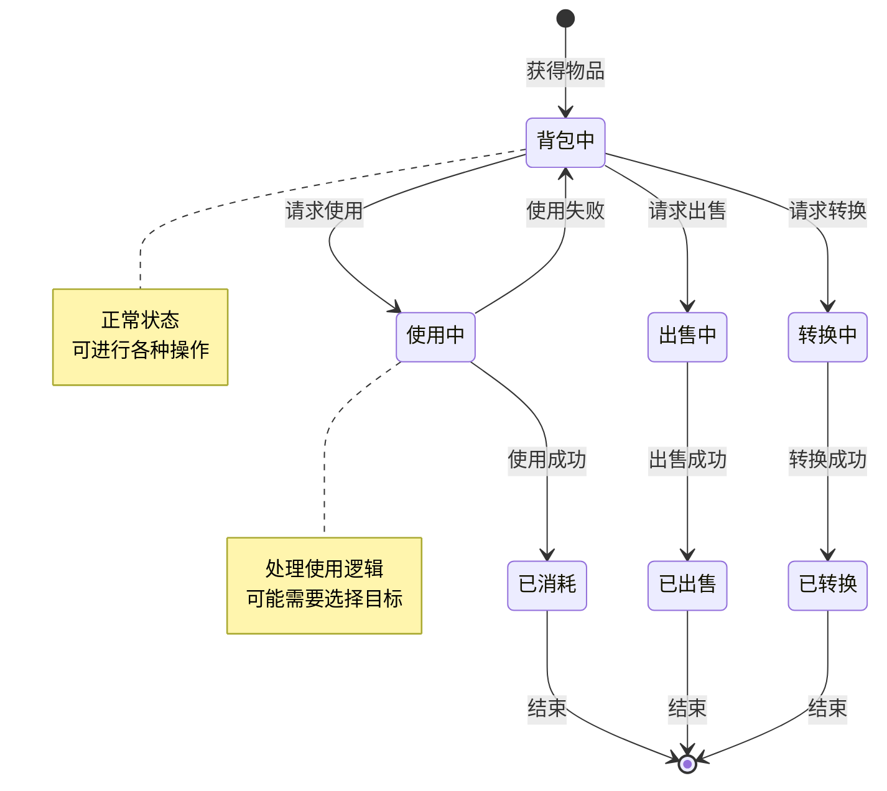
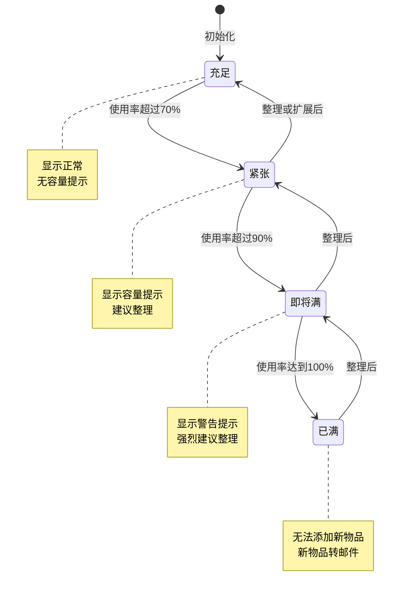
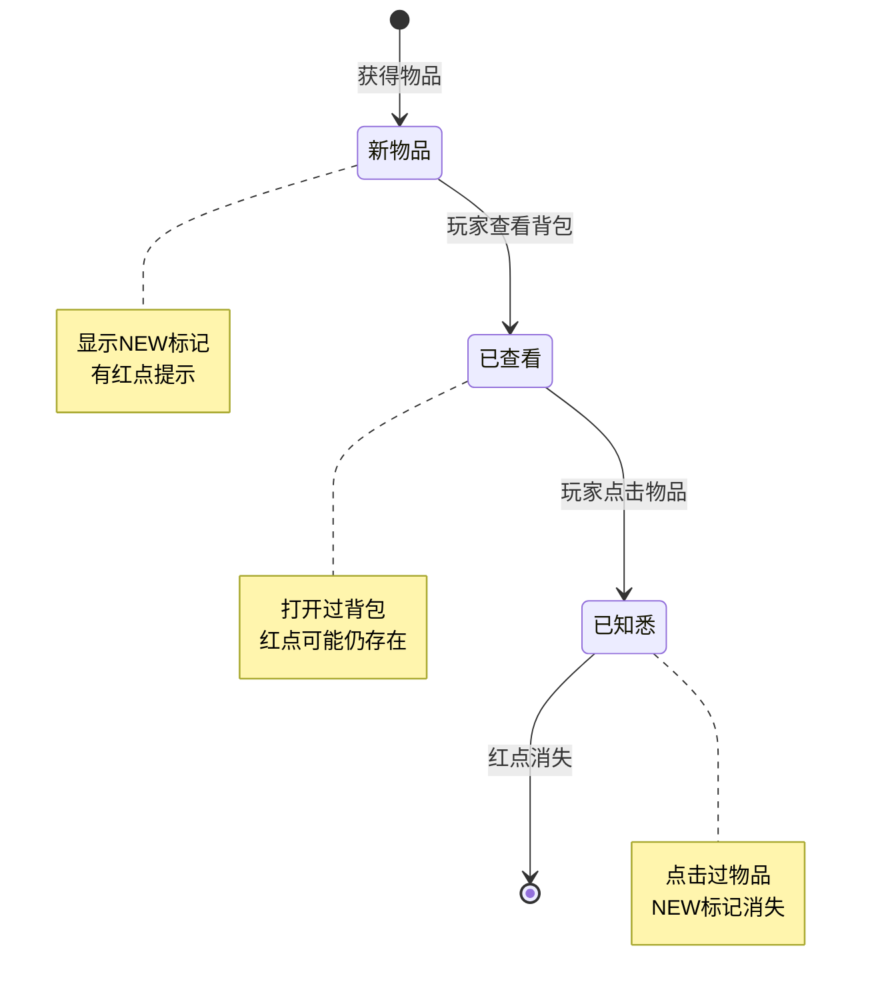
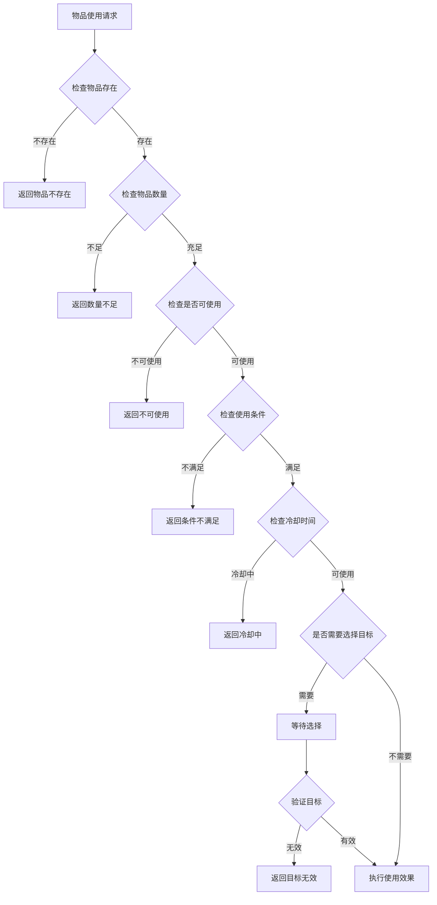
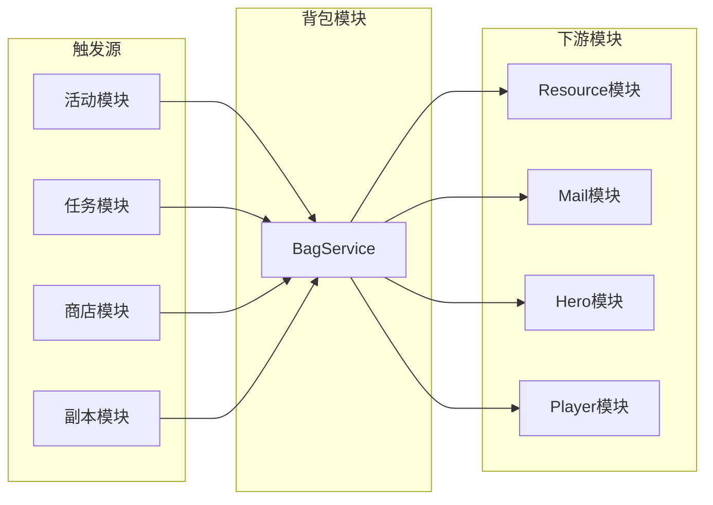

# 背包模块实现细节

## 一、计算公式

### 1.1 物品堆叠计算公式

```
可堆叠数量 = min(剩余堆叠空间, 新增数量)
剩余堆叠空间 = 最大堆叠数 - 当前数量
需要新槽位数 = ceil((新增数量 - 可堆叠数量) / 最大堆叠数)
```

**示例计算**：
```
最大堆叠数: 99
槽位1当前数量: 80
新增数量: 50

剩余堆叠空间 = 99 - 80 = 19
可堆叠数量 = min(19, 50) = 19
槽位1更新后数量 = 80 + 19 = 99

剩余新增 = 50 - 19 = 31
需要新槽位数 = ceil(31 / 99) = 1

最终结果:
  - 槽位1: 99个
  - 新槽位: 31个
```

### 1.2 出售价格计算公式

```
实际出售价格 = 基础价格 × 数量 × 价格系数
价格系数 = 1 + VIP加成
```

**示例计算**：
```
基础价格: 100银两
数量: 10
VIP加成: 10%

实际出售价格 = 100 × 10 × (1 + 0.1) = 1100银两
```

### 1.3 背包容量计算公式

```
已用容量 = 非空槽位数量
剩余容量 = 总容量 - 已用容量
容量使用率 = 已用容量 / 总容量 × 100%
```

### 1.4 物品转换计算公式

```
转换产出数量 = floor(输入物品数量 / 转换比例)
剩余物品数量 = 输入物品数量 % 转换比例
```

**示例计算**：
```
输入物品数量: 23
转换比例: 5个输入 → 1个产出

转换产出数量 = floor(23 / 5) = 4
剩余物品数量 = 23 % 5 = 3

结果: 获得4个产出，消耗20个输入，剩余3个输入
```

---

## 二、状态机定义

### 2.1 物品状态机



### 2.2 背包容量状态机



### 2.3 物品新状态机



---

## 三、数据约束

### 3.1 物品数据约束

| 字段名 | 数据类型 | 取值范围 | 必填 | 说明 |
|--------|----------|----------|------|------|
| id | BIGINT | > 0 | 是 | 主键 |
| player_id | BIGINT | > 0 | 是 | 玩家ID |
| item_id | BIGINT | > 0 | 是 | 物品唯一ID |
| ref_id | BIGINT | > 0 | 是 | 物品配置ID |
| count | BIGINT | >= 1 | 是 | 数量 |
| create_time | DATETIME | - | 是 | 创建时间 |
| update_time | DATETIME | - | 是 | 更新时间 |

### 3.2 物品配置约束

| 字段名 | 数据类型 | 取值范围 | 必填 | 说明 |
|--------|----------|----------|------|------|
| id | long | > 0 | 是 | 物品配置ID |
| type | int | 1-5 | 是 | 物品类型 |
| quality | int | 1-6 | 是 | 品质 |
| max_stack | int | 1-999 | 是 | 最大堆叠数 |
| can_sell | bool | - | 是 | 是否可出售 |
| can_use | bool | - | 是 | 是否可使用 |

### 3.3 背包扩展约束

| 字段名 | 数据类型 | 取值范围 | 必填 | 说明 |
|--------|----------|----------|------|------|
| player_id | BIGINT | > 0 | 是 | 玩家ID |
| capacity | INT | 100-500 | 是 | 当前容量 |
| extend_times | INT | >= 0 | 是 | 扩展次数 |

---

## 四、错误处理策略

### 4.1 背包模块错误码

| 错误码 | 错误信息 | 处理策略 | 用户提示 |
|--------|----------|----------|----------|
| 90001 | 物品不存在 | 检查物品ID有效性 | "物品不存在" |
| 90002 | 物品数量不足 | 检查物品数量 | "物品数量不足" |
| 90003 | 背包已满 | 检查背包容量 | "背包已满，请整理" |
| 90004 | 物品不可使用 | 检查物品类型 | "该物品无法使用" |
| 90005 | 物品不可出售 | 检查物品配置 | "该物品无法出售" |
| 90006 | 使用条件不满足 | 检查使用条件 | "使用条件不满足" |
| 90007 | 冷却时间未结束 | 检查冷却状态 | "冷却中，请稍后再试" |
| 90008 | 目标无效 | 检查选择目标 | "目标无效" |

### 4.2 物品使用错误处理流程



### 4.3 背包容量错误处理

| 错误场景 | 处理策略 | 后续操作 |
|----------|----------|----------|
| 背包已满 | 转邮件发送 | 提示查看邮件 |
| 临时仓库满 | 拒绝获取 | 提示清理仓库 |
| 物品获取失败 | 记录日志 | 人工补偿 |

---

## 五、关键代码示例

### 5.1 物品添加伪代码

```csharp
public Result AddItem(long playerId, long refId, long count)
{
    // 获取物品配置
    ItemRefObj itemRef = itemRefDao.getById(refId);
    if (itemRef == null)
    {
        return Result.Error(90001, "物品配置不存在");
    }

    // 检查背包容量
    int usedSlots = bagDao.getUsedSlotCount(playerId);
    int totalCapacity = bagDao.getCapacity(playerId);

    // 计算需要的槽位数
    int neededSlots = CalculateNeededSlots(playerId, refId, count, itemRef.max_stack);
    int availableSlots = totalCapacity - usedSlots;

    if (neededSlots > availableSlots)
    {
        // 背包空间不足，转邮件
        mailService.SendItemMail(playerId, refId, count, "背包已满，物品已发送至邮件");
        return Result.Error(90003, "背包已满，物品已发送至邮件");
    }

    // 处理可堆叠物品
    if (itemRef.max_stack > 1)
    {
        List<BagItem> existingItems = bagDao.getByRefId(playerId, refId);
        foreach (var item in existingItems)
        {
            if (item.count >= itemRef.max_stack) continue;

            long canAdd = Math.Min(count, itemRef.max_stack - item.count);
            item.count += canAdd;
            count -= canAdd;
            bagDao.updateItem(item);

            if (count <= 0) break;
        }
    }

    // 创建新槽位
    while (count > 0)
    {
        long addCount = Math.Min(count, itemRef.max_stack);
        BagItem newItem = new BagItem {
            player_id = playerId,
            item_id = idGenerator.NextId(),
            ref_id = refId,
            count = addCount,
            create_time = DateTime.Now,
            is_new = true
        };
        bagDao.insertItem(newItem);
        count -= addCount;
    }

    // 推送物品变化
    PushItemChange(playerId, refId);

    return Result.Success();
}
```

### 5.2 物品使用伪代码

```csharp
public Result UseItem(long playerId, long itemId, long count, List<int> selectedIdx)
{
    // 获取物品
    BagItem item = bagDao.getItem(playerId, itemId);
    if (item == null)
    {
        return Result.Error(90001, "物品不存在");
    }

    if (item.count < count)
    {
        return Result.Error(90002, "物品数量不足");
    }

    // 获取物品配置
    ItemRefObj itemRef = itemRefDao.getById(item.ref_id);
    if (!itemRef.can_use)
    {
        return Result.Error(90004, "物品不可使用");
    }

    // 检查使用条件
    Result conditionCheck = CheckUseCondition(playerId, itemRef);
    if (!conditionCheck.isSuccess())
    {
        return conditionCheck;
    }

    // 检查冷却时间
    if (IsOnCooldown(playerId, itemRef))
    {
        return Result.Error(90007, "冷却时间未结束");
    }

    // 获取使用效果配置
    ItemUseEffectRefObj useEffect = useEffectDao.getByItemId(itemRef.id);

    // 扣除物品
    item.count -= count;
    if (item.count <= 0)
    {
        bagDao.deleteItem(itemId);
    }
    else
    {
        bagDao.updateItem(item);
    }

    // 执行使用效果
    ExecuteUseEffect(playerId, useEffect, count, selectedIdx);

    // 设置冷却时间
    if (useEffect.cooldown > 0)
    {
        SetCooldown(playerId, itemRef.id, useEffect.cooldown);
    }

    // 推送变化
    PushItemChange(playerId, item.ref_id);

    return Result.Success();
}
```

### 5.3 物品出售伪代码

```csharp
public Result SellItem(long playerId, long itemId, long count)
{
    // 获取物品
    BagItem item = bagDao.getItem(playerId, itemId);
    if (item == null)
    {
        return Result.Error(90001, "物品不存在");
    }

    if (item.count < count)
    {
        return Result.Error(90002, "物品数量不足");
    }

    // 获取物品配置
    ItemRefObj itemRef = itemRefDao.getById(item.ref_id);
    if (!itemRef.can_sell)
    {
        return Result.Error(90005, "物品不可出售");
    }

    // 计算出售价格
    long sellPrice = CalculateSellPrice(playerId, itemRef, count);

    // 扣除物品
    item.count -= count;
    if (item.count <= 0)
    {
        bagDao.deleteItem(itemId);
    }
    else
    {
        bagDao.updateItem(item);
    }

    // 发放货币
    resourceService.AddResource(playerId, ResourceType.SILVER, sellPrice, "出售物品");

    // 推送变化
    PushItemChange(playerId, item.ref_id);

    return Result.Success(new { sellPrice = sellPrice });
}

private long CalculateSellPrice(long playerId, ItemRefObj itemRef, long count)
{
    long basePrice = itemRef.sell_price;
    float vipBonus = playerService.GetVipSellBonus(playerId);
    return (long)(basePrice * count * (1 + vipBonus));
}
```

### 5.4 一键转换伪代码

```csharp
public Result OneKeyConvert(long playerId, List<int> qualityList)
{
    // 获取指定品质的物品列表
    List<BagItem> items = bagDao.getItemsByQualities(playerId, qualityList);

    if (items.Count == 0)
    {
        return Result.Error(90001, "没有可转换的物品");
    }

    // 获取转换配置
    ConvertConfig convertConfig = convertConfigDao.getDefaultConfig();

    // 计算转换产出
    int totalInput = 0;
    foreach (var item in items)
    {
        totalInput += (int)item.count;
        bagDao.deleteItem(item.item_id);
    }

    int outputCount = totalInput / convertConfig.ratio;
    int remainder = totalInput % convertConfig.ratio;

    // 发放转换产出
    if (outputCount > 0)
    {
        bagService.AddItem(playerId, convertConfig.output_id, outputCount);
    }

    // 返还余量
    if (remainder > 0)
    {
        // 找一个物品返还
        var firstItem = items[0];
        bagService.AddItem(playerId, firstItem.ref_id, remainder);
    }

    // 推送批量变化
    PushBagRefresh(playerId);

    return Result.Success(new { outputCount = outputCount, remainder = remainder });
}
```

### 5.5 背包扩展伪代码

```csharp
public Result ExtendBag(long playerId)
{
    // 获取当前背包信息
    PlayerBagInfo bagInfo = bagDao.getBagInfo(playerId);
    if (bagInfo.capacity >= MAX_CAPACITY)
    {
        return Result.Error(90003, "已达到最大容量");
    }

    // 计算扩展费用
    int extendCost = CalculateExtendCost(bagInfo.extend_times);

    // 检查并扣除钻石
    if (!resourceService.CostResource(playerId, ResourceType.DIAMOND, extendCost, "扩展背包"))
    {
        return Result.Error(90002, "钻石不足");
    }

    // 扩展容量
    bagInfo.capacity += EXTEND_SIZE;
    bagInfo.extend_times++;
    bagDao.updateBagInfo(bagInfo);

    // 推送更新
    PushBagCapacityChange(playerId, bagInfo.capacity);

    return Result.Success(new { newCapacity = bagInfo.capacity });
}

private int CalculateExtendCost(int extendTimes)
{
    // 每次扩展费用递增
    return BASE_EXTEND_COST + extendTimes * EXTEND_COST_INCREMENT;
}
```

---

## 六、跨模块依赖

### 6.1 依赖模块

| 模块名称 | 依赖方式 | 依赖说明 |
|----------|----------|----------|
| Player | 数据读取 | 获取玩家等级、VIP等 |
| Resource | 功能调用 | 扣除/发放货币 |
| Mail | 功能调用 | 背包满时转邮件 |
| Hero | 功能调用 | 英雄相关物品使用 |

### 6.2 被依赖情况

| 模块名称 | 依赖方式 | 依赖说明 |
|----------|----------|----------|
| Activity | 功能调用 | 发放活动奖励 |
| Quest | 功能调用 | 发放任务奖励 |
| Shop | 功能调用 | 发放购买物品 |
| Dungeon | 功能调用 | 发放副本奖励 |

### 6.3 接口依赖图



---

*文档生成时间: 2026-04-07*
