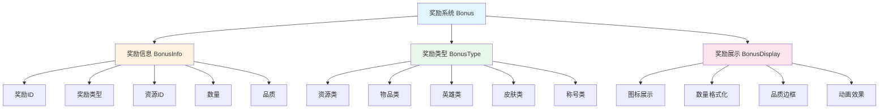
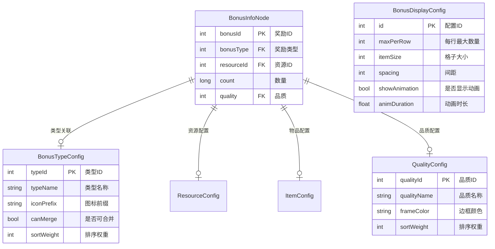
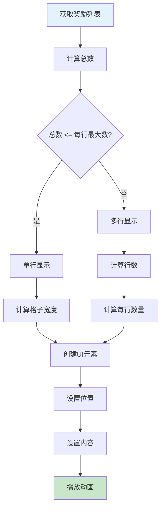
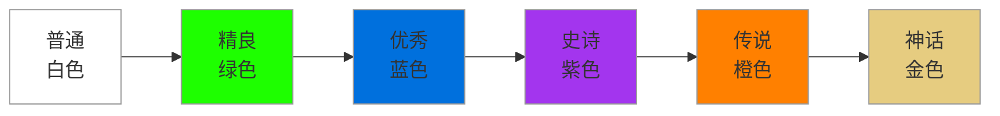
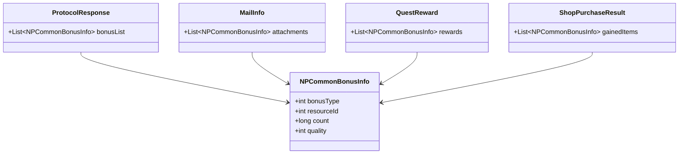
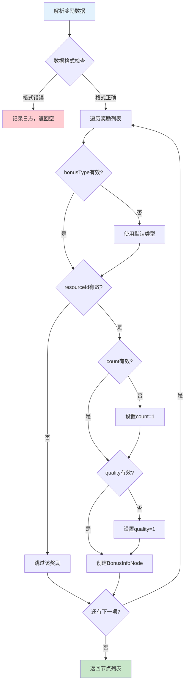
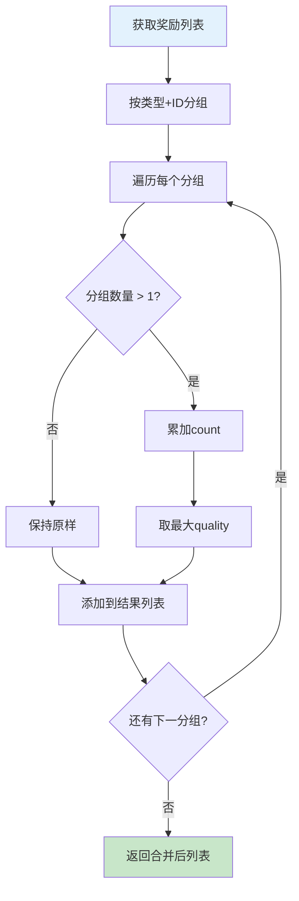
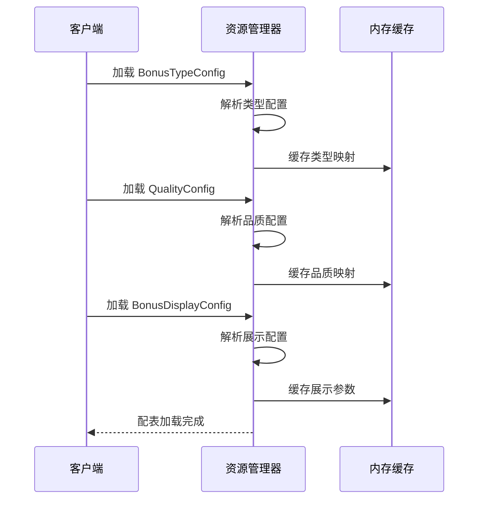

# Bonus 奖励系统模块 - 数据配表文档

## 模块概述

**模块名称**: Bonus (奖励系统)
**模块类型**: 客户端独立组件
**主要功能**: 提供奖励展示、奖励计算、奖励合并等通用奖励处理功能

---

## 核心概念



---

## 配表文件列表

| 配表名称 | 文件路径 | 说明 |
|---------|---------|------|
| BonusTypeConfig | game_server/GameRes/src/NPGameRes/Refs/Bonus/BonusTypeConfig.java | 奖励类型配置 |
| BonusDisplayConfig | game_server/GameRes/src/NPGameRes/Refs/Bonus/BonusDisplayConfig.java | 奖励展示配置 |
| QualityConfig | game_server/GameRes/src/NPGameRes/Refs/Common/QualityConfig.java | 品质配置 |
| ResourceConfig | game_server/GameRes/src/NPGameRes/Refs/Resource/ResourceConfig.java | 资源配置 |
| ItemConfig | game_server/GameRes/src/NPGameRes/Refs/Item/ItemConfig.java | 物品配置 |

---

## 配表关系图



---

## 1. 奖励信息节点 (BonusInfoNode)

### 完整字段列表

| 字段名 | 类型 | 必填 | 默认值 | 说明 | 约束条件 |
|--------|------|------|--------|------|----------|
| bonusId | int | 是 | - | 奖励ID，唯一标识 | 唯一，> 0 |
| bonusType | int | 是 | - | 奖励类型 | 1-5，对应枚举 |
| resourceId | int | 是 | - | 资源ID，关联具体奖励 | > 0，关联有效配置 |
| count | long | 是 | 1 | 奖励数量 | >= 1 |
| quality | int | 是 | 1 | 品质等级 | 1-6，关联品质配置 |

### 字段详细说明

#### bonusType 奖励类型

| 类型ID | 类型名称 | 枚举值 | 说明 | 图标格式 |
|--------|----------|--------|------|----------|
| 1 | RESOURCE | RESOURCE | 资源类奖励（货币、体力等） | res_{id} |
| 2 | ITEM | ITEM | 物品类奖励（道具、材料等） | item_{id} |
| 3 | HERO | HERO | 英雄类奖励（英雄、碎片等） | hero_{id} |
| 4 | SKIN | SKIN | 皮肤类奖励 | skin_{id} |
| 5 | TITLE | TITLE | 称号类奖励 | title_{id} |

#### quality 品质等级

| 品质ID | 品质名称 | 颜色代码 | 排序权重 |
|--------|----------|----------|----------|
| 1 | 普通 | #FFFFFF | 100 |
| 2 | 精良 | #1EFF00 | 200 |
| 3 | 优秀 | #0070DD | 300 |
| 4 | 史诗 | #A335EE | 400 |
| 5 | 传说 | #FF8000 | 500 |
| 6 | 神话 | #E6CC80 | 600 |

### 数据结构示例

```json
{
    "bonusId": 10001,
    "bonusType": 2,
    "resourceId": 50001,
    "count": 100,
    "quality": 3
}
```

### 完整数据示例（多奖励）

```json
[
    {
        "bonusId": 10001,
        "bonusType": 1,
        "resourceId": 1,
        "count": 1000,
        "quality": 1
    },
    {
        "bonusId": 10002,
        "bonusType": 1,
        "resourceId": 2,
        "count": 100,
        "quality": 4
    },
    {
        "bonusId": 10003,
        "bonusType": 2,
        "resourceId": 50001,
        "count": 5,
        "quality": 2
    },
    {
        "bonusId": 10004,
        "bonusType": 3,
        "resourceId": 1001,
        "count": 1,
        "quality": 5
    },
    {
        "bonusId": 10005,
        "bonusType": 5,
        "resourceId": 2001,
        "count": 1,
        "quality": 6
    }
]
```

---

## 2. 奖励类型配置 (BonusTypeConfig)

**配表名**: `bonus_type`

### 完整字段列表

| 字段名 | 类型 | 必填 | 默认值 | 说明 | 约束条件 |
|--------|------|------|--------|------|----------|
| typeId | int | 是 | - | 类型ID（主键） | 唯一，1-5 |
| typeName | string | 是 | - | 类型名称 | 最大长度50 |
| iconPrefix | string | 是 | - | 图标资源前缀 | 非空 |
| canMerge | bool | 是 | true | 是否可合并 | - |
| sortWeight | int | 是 | 0 | 排序权重 | 0-1000 |
| desc | string | 否 | "" | 类型描述 | 最大长度200 |

### 类型配置示例

```json
[
    {
        "typeId": 1,
        "typeName": "RESOURCE",
        "iconPrefix": "res_",
        "canMerge": true,
        "sortWeight": 100,
        "desc": "资源类奖励，包含货币、体力等"
    },
    {
        "typeId": 2,
        "typeName": "ITEM",
        "iconPrefix": "item_",
        "canMerge": true,
        "sortWeight": 200,
        "desc": "物品类奖励，包含道具、材料等"
    },
    {
        "typeId": 3,
        "typeName": "HERO",
        "iconPrefix": "hero_",
        "canMerge": false,
        "sortWeight": 300,
        "desc": "英雄类奖励，包含英雄、英雄碎片等"
    },
    {
        "typeId": 4,
        "typeName": "SKIN",
        "iconPrefix": "skin_",
        "canMerge": false,
        "sortWeight": 400,
        "desc": "皮肤类奖励"
    },
    {
        "typeId": 5,
        "typeName": "TITLE",
        "iconPrefix": "title_",
        "canMerge": false,
        "sortWeight": 500,
        "desc": "称号类奖励"
    }
]
```

### 类型配置流程图

```mermaid
flowchart TD
    A[解析奖励数据] --> B{获取bonusType}
    B -->|1| C[加载资源配置]
    B -->|2| D[加载物品配置]
    B -->|3| E[加载英雄配置]
    B -->|4| F[加载皮肤配置]
    B -->|5| G[加载称号配置]

    C --> H[获取图标: res_{id}]
    D --> I[获取图标: item_{id}]
    E --> J[获取图标: hero_{id}]
    F --> K[获取图标: skin_{id}]
    G --> L[获取图标: title_{id}]

    H --> M[创建BonusInfoNode]
    I --> M
    J --> M
    K --> M
    L --> M

    style A fill:#e3f2fd
    style M fill:#c8e6c9
```

---

## 3. 奖励展示配置 (BonusDisplayConfig)

**配表名**: `bonus_display`

### 完整字段列表

| 字段名 | 类型 | 必填 | 默认值 | 说明 | 约束条件 |
|--------|------|------|--------|------|----------|
| id | int | 是 | - | 配置ID（主键） | 唯一，> 0 |
| maxPerRow | int | 是 | 5 | 每行最大显示数量 | 3-8 |
| itemSize | int | 是 | 80 | 格子大小（像素） | 50-150 |
| spacing | int | 是 | 10 | 格子间距（像素） | 5-20 |
| showAnimation | bool | 是 | true | 是否显示动画 | - |
| animDuration | float | 是 | 0.2 | 动画时长（秒） | 0.1-1.0 |
| animDelay | float | 是 | 0.05 | 动画间隔（秒） | 0.01-0.2 |
| autoClose | bool | 是 | true | 是否自动关闭 | - |
| autoCloseDelay | float | 是 | 3.0 | 自动关闭延迟（秒） | 0-10 |

### 展示配置示例

```json
{
    "id": 1,
    "maxPerRow": 5,
    "itemSize": 80,
    "spacing": 10,
    "showAnimation": true,
    "animDuration": 0.2,
    "animDelay": 0.05,
    "autoClose": false,
    "autoCloseDelay": 0
}
```

### 布局计算流程图



---

## 4. 品质配置 (QualityConfig)

**配表名**: `quality`

### 完整字段列表

| 字段名 | 类型 | 必填 | 默认值 | 说明 | 约束条件 |
|--------|------|------|--------|------|----------|
| qualityId | int | 是 | - | 品质ID（主键） | 唯一，1-6 |
| qualityName | string | 是 | - | 品质名称 | 最大长度20 |
| colorHex | string | 是 | - | 颜色代码 | #RRGGBB格式 |
| frameSprite | string | 是 | - | 边框精灵名称 | 非空 |
| bgSprite | string | 是 | - | 背景精灵名称 | 非空 |
| sortWeight | int | 是 | 0 | 排序权重 | 0-1000 |

### 品质配置示例

```json
[
    {
        "qualityId": 1,
        "qualityName": "普通",
        "colorHex": "#FFFFFF",
        "frameSprite": "frame_white",
        "bgSprite": "bg_white",
        "sortWeight": 100
    },
    {
        "qualityId": 2,
        "qualityName": "精良",
        "colorHex": "#1EFF00",
        "frameSprite": "frame_green",
        "bgSprite": "bg_green",
        "sortWeight": 200
    },
    {
        "qualityId": 3,
        "qualityName": "优秀",
        "colorHex": "#0070DD",
        "frameSprite": "frame_blue",
        "bgSprite": "bg_blue",
        "sortWeight": 300
    },
    {
        "qualityId": 4,
        "qualityName": "史诗",
        "colorHex": "#A335EE",
        "frameSprite": "frame_purple",
        "bgSprite": "bg_purple",
        "sortWeight": 400
    },
    {
        "qualityId": 5,
        "qualityName": "传说",
        "colorHex": "#FF8000",
        "frameSprite": "frame_orange",
        "bgSprite": "bg_orange",
        "sortWeight": 500
    },
    {
        "qualityId": 6,
        "qualityName": "神话",
        "colorHex": "#E6CC80",
        "frameSprite": "frame_gold",
        "bgSprite": "bg_gold",
        "sortWeight": 600
    }
]
```

### 品质展示效果



---

## 数据库表结构

### 注意事项

> 本模块为客户端独立组件，无独立数据库表。奖励数据由各业务模块在协议中携带。

### 协议中的奖励数据结构



---

## 枚举定义

### EBonusType (奖励类型枚举)

| 枚举值 | 数值 | 说明 | 图标前缀 | 可合并 |
|--------|------|------|----------|--------|
| RESOURCE | 1 | 资源类奖励 | res_ | 是 |
| ITEM | 2 | 物品类奖励 | item_ | 是 |
| HERO | 3 | 英雄类奖励 | hero_ | 否 |
| SKIN | 4 | 皮肤类奖励 | skin_ | 否 |
| TITLE | 5 | 称号类奖励 | title_ | 否 |

```csharp
/// <summary>
/// 奖励类型枚举
/// </summary>
public enum EBonusType
{
    /// <summary>资源类奖励（货币、体力等）</summary>
    RESOURCE = 1,

    /// <summary>物品类奖励（道具、材料等）</summary>
    ITEM = 2,

    /// <summary>英雄类奖励（英雄、碎片等）</summary>
    HERO = 3,

    /// <summary>皮肤类奖励</summary>
    SKIN = 4,

    /// <summary>称号类奖励</summary>
    TITLE = 5,
}
```

### EQuality (品质枚举)

| 枚举值 | 数值 | 说明 | 颜色代码 |
|--------|------|------|----------|
| COMMON | 1 | 普通 | #FFFFFF |
| GOOD | 2 | 精良 | #1EFF00 |
| EXCELLENT | 3 | 优秀 | #0070DD |
| EPIC | 4 | 史诗 | #A335EE |
| LEGENDARY | 5 | 传说 | #FF8000 |
| MYTHIC | 6 | 神话 | #E6CC80 |

```csharp
/// <summary>
/// 品质枚举
/// </summary>
public enum EQuality
{
    /// <summary>普通（白色）</summary>
    COMMON = 1,

    /// <summary>精良（绿色）</summary>
    GOOD = 2,

    /// <summary>优秀（蓝色）</summary>
    EXCELLENT = 3,

    /// <summary>史诗（紫色）</summary>
    EPIC = 4,

    /// <summary>传说（橙色）</summary>
    LEGENDARY = 5,

    /// <summary>神话（金色）</summary>
    MYTHIC = 6,
}
```

### EBonusShowType (展示类型枚举)

| 枚举值 | 数值 | 说明 | 使用场景 |
|--------|------|------|----------|
| NORMAL | 1 | 普通展示 | 任务奖励等 |
| PREVIEW | 2 | 预览展示 | 抽奖预览等 |
| DETAIL | 3 | 详情展示 | 点击查看详情 |

```csharp
/// <summary>
/// 展示类型枚举
/// </summary>
public enum EBonusShowType
{
    /// <summary>普通展示</summary>
    NORMAL = 1,

    /// <summary>预览展示</summary>
    PREVIEW = 2,

    /// <summary>详情展示</summary>
    DETAIL = 3,
}
```

---

## 配表校验规则

### 奖励信息节点校验

| 字段名 | 校验规则 | 异常处理 | 校验时机 |
|--------|----------|----------|----------|
| bonusId | 必须唯一，范围 > 0 | 解析时跳过重复项 | 解析时 |
| bonusType | 范围 1-5 | 使用默认类型1 | 解析时 |
| resourceId | 必须关联有效配置 | 跳过无效奖励 | 解析时 |
| count | 必须 >= 1 | 设置为1 | 解析时 |
| quality | 范围 1-6 | 设置为1 | 解析时 |

### 校验流程图



### 校验代码示例

```csharp
/// <summary>
/// 校验奖励信息节点
/// </summary>
public bool ValidateBonusInfoNode(BonusInfoNode node)
{
    if (node == null) return false;

    // 校验bonusId
    if (node.bonusId <= 0)
    {
        Debug.LogWarning($"无效的bonusId: {node.bonusId}");
        return false;
    }

    // 校验bonusType
    if (node.bonusType < 1 || node.bonusType > 5)
    {
        Debug.LogWarning($"无效的bonusType: {node.bonusType}, 使用默认值1");
        node.bonusType = 1;
    }

    // 校验resourceId
    if (node.resourceId <= 0)
    {
        Debug.LogWarning($"无效的resourceId: {node.resourceId}");
        return false;
    }

    // 校验count
    if (node.count < 1)
    {
        Debug.LogWarning($"无效的count: {node.count}, 设置为1");
        node.count = 1;
    }

    // 校验quality
    if (node.quality < 1 || node.quality > 6)
    {
        Debug.LogWarning($"无效的quality: {node.quality}, 设置为1");
        node.quality = 1;
    }

    return true;
}
```

---

## 代码示例

### 服务端配置读取

```java
// 获取奖励类型配置
public BonusTypeConfig getBonusTypeConfig(int typeId) {
    return BonusTypeConfig.Ref().getRef(typeId);
}

// 判断是否可合并
public boolean canMerge(int bonusType) {
    BonusTypeConfig config = getBonusTypeConfig(bonusType);
    return config != null && config.canMerge;
}

// 获取图标前缀
public String getIconPrefix(int bonusType) {
    BonusTypeConfig config = getBonusTypeConfig(bonusType);
    return config != null ? config.iconPrefix : "item_";
}

// 获取品质配置
public QualityConfig getQualityConfig(int quality) {
    return QualityConfig.Ref().getRef(quality);
}

// 获取品质颜色
public String getQualityColor(int quality) {
    QualityConfig config = getQualityConfig(quality);
    return config != null ? config.colorHex : "#FFFFFF";
}
```

### 客户端配置读取

```csharp
/// <summary>
/// 获取奖励图标路径
/// </summary>
public string GetIconPath(int bonusType, int resourceId)
{
    string prefix = GetIconPrefix(bonusType);
    return $"UI/Icons/{prefix}{resourceId}";
}

/// <summary>
/// 获取图标前缀
/// </summary>
private string GetIconPrefix(int bonusType)
{
    var config = GRefdataCoreMgr.instance.getBonusTypeConfig(bonusType);
    return config != null ? config.iconPrefix : "item_";
}

/// <summary>
/// 获取品质颜色
/// </summary>
public Color GetQualityColor(int quality)
{
    var config = GRefdataCoreMgr.instance.getQualityConfig(quality);
    if (config != null && ColorUtility.TryParseHtmlString(config.colorHex, out Color color))
    {
        return color;
    }
    return Color.white;
}

/// <summary>
/// 获取品质边框精灵
/// </summary>
public Sprite GetQualityFrame(int quality)
{
    var config = GRefdataCoreMgr.instance.getQualityConfig(quality);
    if (config != null)
    {
        return Resources.Load<Sprite>($"UI/Quality/{config.frameSprite}");
    }
    return null;
}
```

---

## 配置文件位置

```
game_client/Assets/Scripts/LogicScripts/GameComponent/Bonus/
├── BonusInfoNode.cs              # 奖励信息节点
└── BonusType.cs                  # 奖励类型枚举

game_client/Assets/Scripts/ResScripts/NPResCommon/UnionBonus/
├── BonusReaderMgr.cs             # 奖励读取管理器
├── BonusMerger.cs                # 奖励合并器
└── BonusDisplayConfig.cs         # 展示配置

game_client/Assets/Scripts/ResScripts/NPSO/GSO/Bonus/
├── BonusTypeRefObj.cs            # 类型配置对象
├── QualityRefObj.cs              # 品质配置对象
└── BonusDisplayRefObj.cs         # 展示配置对象
```

---

## 奖励合并计算公式

### 合并条件判断

```
可合并 = (类型相同) AND (资源ID相同) AND (配置允许合并)
```

### 合并后属性计算

```
合并后数量 = Σ(相同ID奖励的数量)
合并后品质 = max(相同ID奖励的品质)
```

### 合并示例计算

```
原始列表:
  - bonusType=2, resourceId=10001, count=5, quality=2
  - bonusType=2, resourceId=10001, count=3, quality=3
  - bonusType=2, resourceId=10001, count=2, quality=1

合并后:
  - bonusType=2, resourceId=10001, count=10, quality=3
```

### 合并流程图



---

## 数据字典

### 奖励类型映射

| 类型值 | 类型名 | 图标目录 | 可合并 | 常见物品 |
|--------|--------|----------|--------|----------|
| 1 | RESOURCE | Icons/Resource/ | 是 | 银两、钻石、体力 |
| 2 | ITEM | Icons/Item/ | 是 | 道具、材料、碎片 |
| 3 | HERO | Icons/Hero/ | 否 | 英雄、英雄碎片 |
| 4 | SKIN | Icons/Skin/ | 否 | 英雄皮肤 |
| 5 | TITLE | Icons/Title/ | 否 | 玩家称号 |

### 品质颜色映射

| 品质值 | 品质名 | 颜色 | RGB值 | 用途 |
|--------|--------|------|-------|------|
| 1 | 普通 | 白色 | (255,255,255) | 普通道具 |
| 2 | 精良 | 绿色 | (30,255,0) | 精良道具 |
| 3 | 优秀 | 蓝色 | (0,112,221) | 优秀道具 |
| 4 | 史诗 | 紫色 | (163,53,238) | 史诗道具 |
| 5 | 传说 | 橙色 | (255,128,0) | 传说道具 |
| 6 | 神话 | 金色 | (230,204,128) | 神话道具 |

---

## 配置加载流程



---

*文档生成时间: 2026-04-12*
*文档版本: v2.0.0*
