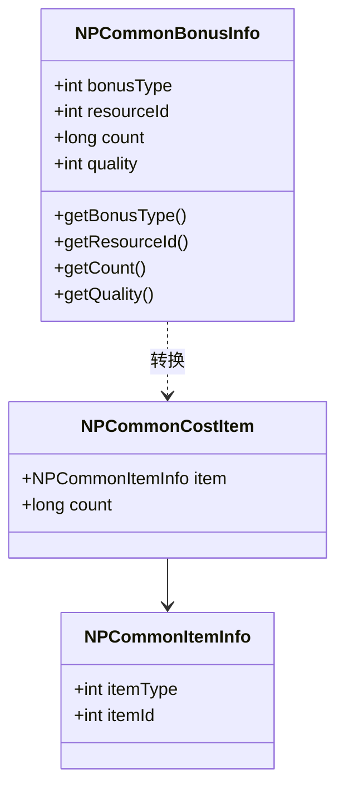
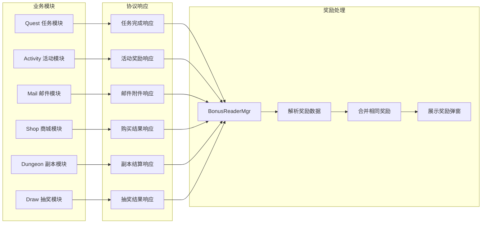
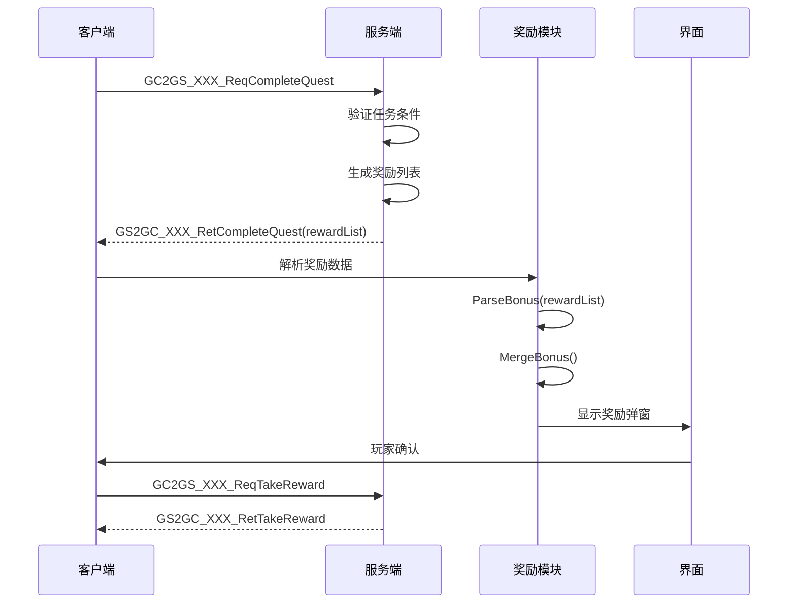
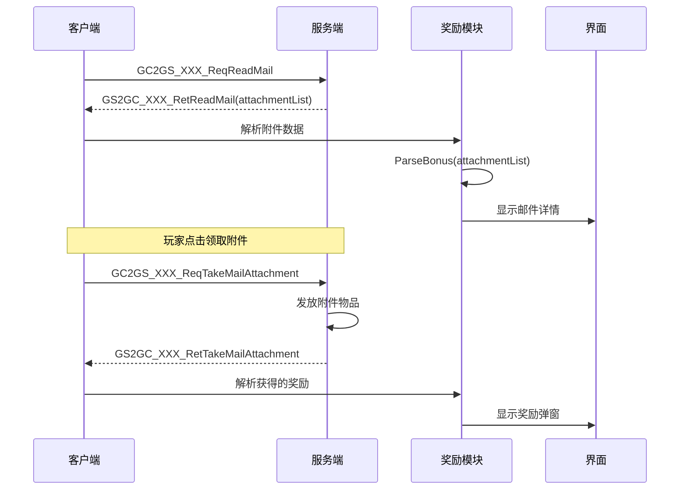
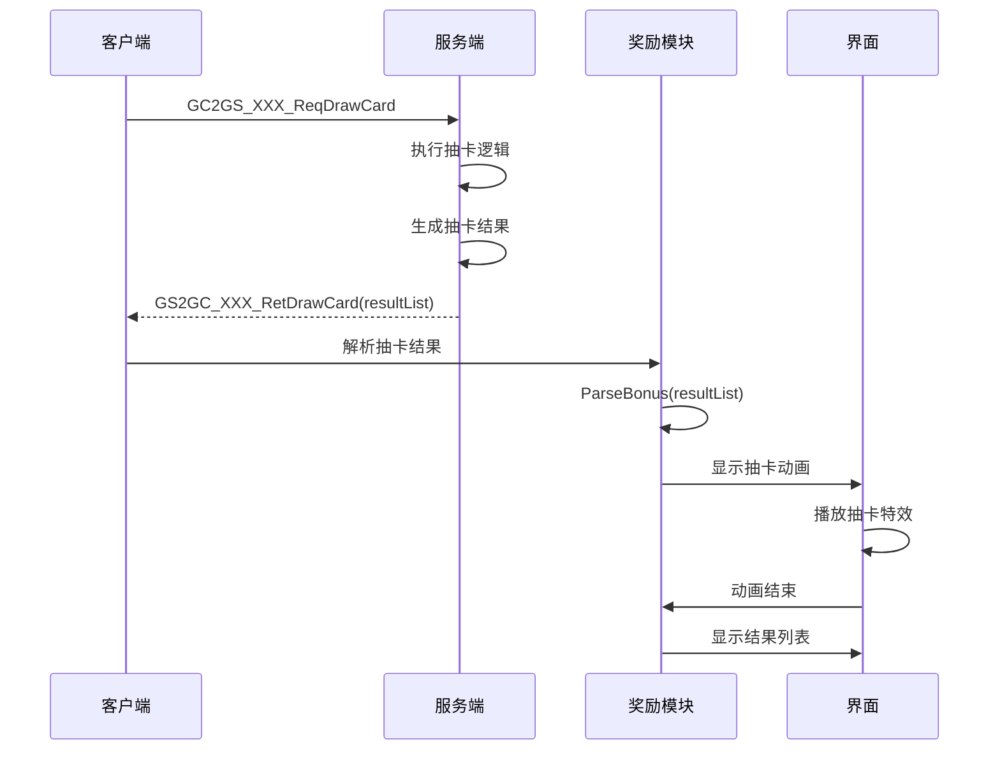
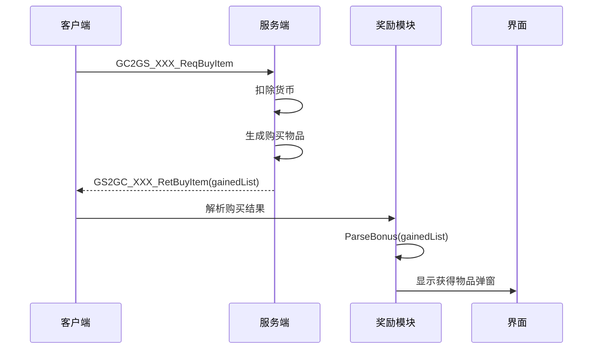
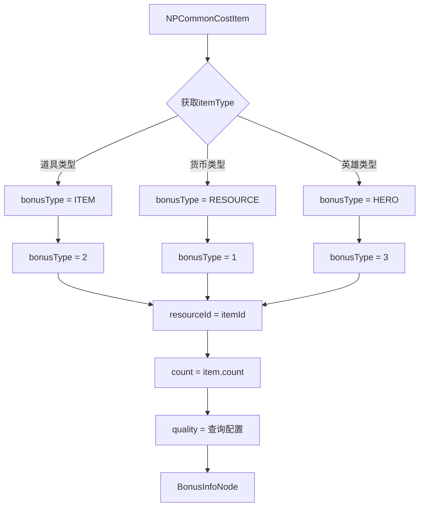
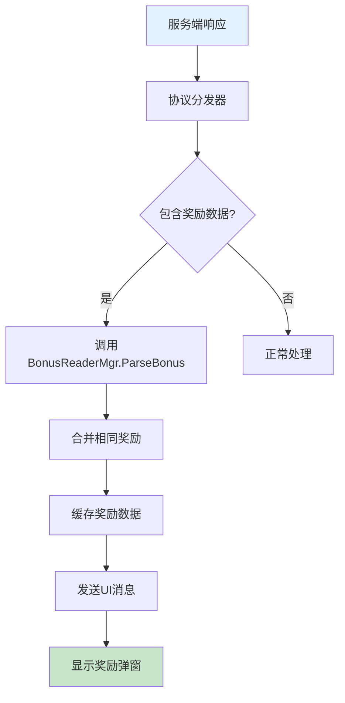
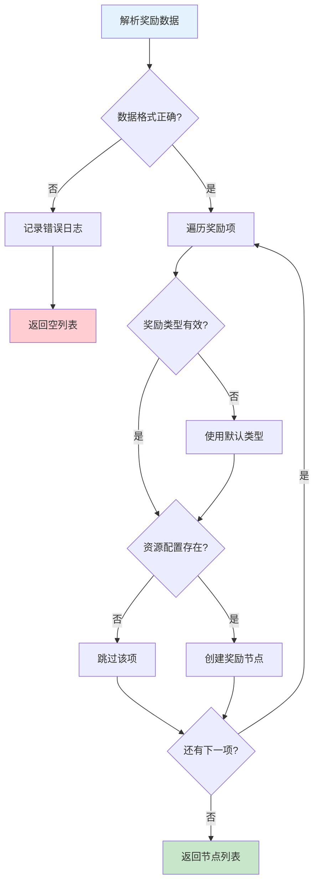

# Bonus 奖励系统模块 - 协议文档

## 模块说明

**模块类型**: 客户端独立组件

本模块不直接涉及服务端协议通信，奖励数据通过各业务模块的协议携带，客户端统一解析展示。

---

## 一、协议数据结构

### 奖励信息协议结构



### NPCommonBonusInfo - 奖励信息

**用途**: 通用奖励信息结构，用于协议传输

**路径**: `ClientProtocol/Common/NPCommonBonusInfo.cs`

| 字段名 | 类型 | 必填 | 说明 | 约束条件 |
|--------|------|------|------|----------|
| bonusType | int | 是 | 奖励类型 | 1-5 |
| resourceId | int | 是 | 资源ID | > 0 |
| count | long | 是 | 数量 | >= 1 |
| quality | int | 是 | 品质 | 1-6 |

**协议定义**:

```csharp
public class NPCommonBonusInfo : _IALProtocolStructure
{
    private int bonusType;      // 奖励类型
    private int resourceId;     // 资源ID
    private long count;         // 数量
    private int quality;        // 品质

    public int getBonusType() { return bonusType; }
    public int getResourceId() { return resourceId; }
    public long getCount() { return count; }
    public int getQuality() { return quality; }
}
```

**Java服务端定义**:

```java
public class NPCommonBonusInfo extends _ALProtocolStructure
{
    private int bonusType;      // 奖励类型
    private int resourceId;     // 资源ID
    private long count;         // 数量
    private int quality;        // 品质

    public int getBonusType() { return bonusType; }
    public int getResourceId() { return resourceId; }
    public long getCount() { return count; }
    public int getQuality() { return quality; }
}
```

---

## 二、关联协议汇总

### 奖励数据来源协议



### 协议携带奖励列表

| 模块 | 协议名称 | 奖励字段 | 触发时机 |
|------|----------|----------|----------|
| Quest | GS2GC_XXX_RetCompleteQuest | rewardList | 完成任务 |
| Activity | GS2GC_XXX_RetGetActivityReward | rewardList | 领取活动奖励 |
| Mail | GS2GC_XXX_RetReadMail | attachmentList | 读取邮件 |
| Mail | GS2GC_XXX_RetTakeMailAttachment | attachmentList | 领取附件 |
| Shop | GS2GC_XXX_RetBuyItem | gainedList | 购买商品 |
| Dungeon | GS2GC_XXX_RetFinishDungeon | rewardList | 副本结算 |
| Draw | GS2GC_XXX_RetDrawCard | resultList | 抽卡结果 |
| Sign | GS2GC_XXX_RetSignIn | rewardList | 签到奖励 |
| FirstRecharge | GS2GC_XXX_RetGetFirstRecharge | rewardList | 首充奖励 |
| LevelUp | GS2GC_XXX_OnLevelUp | rewardList | 等级奖励 |

---

## 三、协议交互流程图

### 3.1 任务奖励流程



### 3.2 邮件附件流程



### 3.3 抽卡结果流程



### 3.4 商城购买流程



---

## 四、协议数据转换

### NPCommonCostItem 转 BonusInfoNode

**转换场景**: 服务端常用 `NPCommonCostItem` 结构，客户端需转换为 `BonusInfoNode`



### 转换代码示例

```csharp
/// <summary>
/// 将 NPCommonCostItem 转换为 BonusInfoNode
/// </summary>
public BonusInfoNode ConvertToBonusNode(NPCommonCostItem costItem)
{
    if (costItem == null || costItem.item == null)
        return null;

    BonusInfoNode node = new BonusInfoNode();

    // 根据 itemType 确定 bonusType
    node.bonusType = ConvertItemTypeToBonusType(costItem.item.itemType);
    node.resourceId = costItem.item.itemId;
    node.count = costItem.count;

    // 从配置获取品质
    node.quality = GetQualityFromConfig(node.bonusType, node.resourceId);

    return node;
}

/// <summary>
/// 转换物品类型到奖励类型
/// </summary>
private int ConvertItemTypeToBonusType(int itemType)
{
    switch (itemType)
    {
        case 1: return (int)EBonusType.ITEM;      // 道具
        case 2: return (int)EBonusType.HERO;      // 英雄
        case 3: return (int)EBonusType.RESOURCE;  // 货币
        case 4: return (int)EBonusType.SKIN;      // 皮肤
        case 5: return (int)EBonusType.TITLE;     // 称号
        default: return (int)EBonusType.ITEM;
    }
}

/// <summary>
/// 从配置获取品质
/// </summary>
private int GetQualityFromConfig(int bonusType, int resourceId)
{
    switch (bonusType)
    {
        case (int)EBonusType.ITEM:
            var itemConfig = GRefdataCoreMgr.instance.getItemConfig(resourceId);
            return itemConfig != null ? itemConfig.quality : 1;

        case (int)EBonusType.HERO:
            var heroConfig = GRefdataCoreMgr.instance.getHeroConfig(resourceId);
            return heroConfig != null ? heroConfig.quality : 1;

        case (int)EBonusType.RESOURCE:
            return 1; // 资源默认普通品质

        default:
            return 1;
    }
}
```

### 批量转换代码

```csharp
/// <summary>
/// 批量转换奖励列表
/// </summary>
public List<BonusInfoNode> ConvertToBonusList(List<NPCommonCostItem> costItems)
{
    List<BonusInfoNode> result = new List<BonusInfoNode>();

    if (costItems == null || costItems.Count == 0)
        return result;

    foreach (var item in costItems)
    {
        BonusInfoNode node = ConvertToBonusNode(item);
        if (node != null)
        {
            result.Add(node);
        }
    }

    return result;
}
```

---

## 五、协议数据解析

### JSON 格式解析

**数据格式**:

```json
{
    "rewards": [
        { "type": 1, "id": 1, "count": 1000, "quality": 1 },
        { "type": 1, "id": 2, "count": 100, "quality": 4 },
        { "type": 2, "id": 50001, "count": 5, "quality": 2 }
    ]
}
```

**解析代码**:

```csharp
/// <summary>
/// 从 JSON 解析奖励列表
/// </summary>
public List<BonusInfoNode> ParseFromJson(JsonData jsonData)
{
    List<BonusInfoNode> result = new List<BonusInfoNode>();

    if (jsonData == null || !jsonData.ContainsKey("rewards"))
        return result;

    foreach (JsonData reward in jsonData["rewards"])
    {
        BonusInfoNode node = new BonusInfoNode
        {
            bonusType = (int)reward["type"],
            resourceId = (int)reward["id"],
            count = (long)reward["count"],
            quality = reward.ContainsKey("quality") ? (int)reward["quality"] : 1
        };

        if (ValidateBonusInfoNode(node))
        {
            result.Add(node);
        }
    }

    return result;
}
```

### 协议对象解析

```csharp
/// <summary>
/// 从协议对象解析奖励列表
/// </summary>
public List<BonusInfoNode> ParseFromProtocol(List<NPCommonBonusInfo> bonusList)
{
    List<BonusInfoNode> result = new List<BonusInfoNode>();

    if (bonusList == null || bonusList.Count == 0)
        return result;

    foreach (var bonus in bonusList)
    {
        BonusInfoNode node = new BonusInfoNode
        {
            bonusType = bonus.getBonusType(),
            resourceId = bonus.getResourceId(),
            count = bonus.getCount(),
            quality = bonus.getQuality()
        };

        result.Add(node);
    }

    return result;
}
```

### 配置ID解析

```csharp
/// <summary>
/// 从配置ID解析奖励列表
/// </summary>
public List<BonusInfoNode> ParseFromConfig(long configId)
{
    List<BonusInfoNode> result = new List<BonusInfoNode>();

    var config = GRefdataCoreMgr.instance.getBonusConfig(configId);
    if (config == null || config.rewardList == null)
        return result;

    foreach (var reward in config.rewardList)
    {
        BonusInfoNode node = ConvertToBonusNode(reward);
        if (node != null)
        {
            result.Add(node);
        }
    }

    return result;
}
```

---

## 六、协议监听注册

### 监听器注册机制



### 通用监听器代码

```csharp
/// <summary>
/// 通用奖励协议监听基类
/// </summary>
public abstract class BonusProtocolListenerBase<T> : _ANPGSSubDealer where T : _IALProtocolStructure
{
    protected abstract List<NPCommonBonusInfo> GetBonusList(T msg);

    public override void dealMessage(T msg)
    {
        List<NPCommonBonusInfo> bonusList = GetBonusList(msg);
        if (bonusList != null && bonusList.Count > 0)
        {
            // 解析并缓存奖励数据
            List<BonusInfoNode> nodes = BonusReaderMgr.Instance.ParseFromProtocol(bonusList);

            // 发送奖励消息
            WinMsg.SendMsg(WinMsgType.SHOW_BONUS_REWARD, nodes);
        }
    }
}

/// <summary>
/// 任务奖励监听器示例
/// </summary>
public class QuestRewardListener : BonusProtocolListenerBase<GS2GC_XXX_RetCompleteQuest>
{
    protected override List<NPCommonBonusInfo> GetBonusList(GS2GC_XXX_RetCompleteQuest msg)
    {
        return msg.getRewardList();
    }
}

/// <summary>
/// 邮件附件监听器示例
/// </summary>
public class MailAttachmentListener : BonusProtocolListenerBase<GS2GC_XXX_RetReadMail>
{
    protected override List<NPCommonBonusInfo> GetBonusList(GS2GC_XXX_RetReadMail msg)
    {
        return msg.getAttachmentList();
    }
}
```

---

## 七、协议数据校验

### 服务端数据校验

```java
/// <summary>
/// 校验奖励数据
/// </summary>
public boolean validateBonusInfo(NPCommonBonusInfo bonus)
{
    if (bonus == null) return false;

    // 校验类型
    if (bonus.getBonusType() < 1 || bonus.getBonusType() > 5)
    {
        return false;
    }

    // 校验资源ID
    if (bonus.getResourceId() <= 0)
    {
        return false;
    }

    // 校验数量
    if (bonus.getCount() <= 0)
    {
        return false;
    }

    // 校验品质
    if (bonus.getQuality() < 1 || bonus.getQuality() > 6)
    {
        return false;
    }

    return true;
}

/// <summary>
/// 过滤无效奖励
/// </summary>
public List<NPCommonBonusInfo> filterInvalidBonus(List<NPCommonBonusInfo> bonusList)
{
    List<NPCommonBonusInfo> result = new ArrayList<>();

    for (NPCommonBonusInfo bonus : bonusList)
    {
        if (validateBonusInfo(bonus))
        {
            result.add(bonus);
        }
        else
        {
            log.warn("无效的奖励数据: type={}, id={}, count={}",
                bonus.getBonusType(), bonus.getResourceId(), bonus.getCount());
        }
    }

    return result;
}
```

### 客户端数据校验

```csharp
/// <summary>
/// 校验奖励信息节点
/// </summary>
public bool ValidateBonusInfoNode(BonusInfoNode node)
{
    if (node == null) return false;

    // 校验bonusType
    if (node.bonusType < 1 || node.bonusType > 5)
    {
        Debug.LogWarning($"Invalid bonusType: {node.bonusType}");
        return false;
    }

    // 校验resourceId
    if (node.resourceId <= 0)
    {
        Debug.LogWarning($"Invalid resourceId: {node.resourceId}");
        return false;
    }

    // 校验count
    if (node.count < 1)
    {
        Debug.LogWarning($"Invalid count: {node.count}");
        return false;
    }

    // 校验quality
    if (node.quality < 1 || node.quality > 6)
    {
        Debug.LogWarning($"Invalid quality: {node.quality}");
        return false;
    }

    return true;
}
```

---

## 八、协议错误处理

### 错误处理流程



### 错误码定义

| 错误码 | 错误信息 | 处理策略 |
|--------|----------|----------|
| 100001 | 奖励类型无效 | 使用默认类型1 |
| 100002 | 奖励配置缺失 | 跳过该奖励 |
| 100003 | 图标资源缺失 | 使用占位图 |
| 100004 | 数据解析失败 | 记录日志 |

### 错误处理代码

```csharp
/// <summary>
/// 处理奖励解析错误
/// </summary>
private void HandleParseError(int errorCode, string detail)
{
    switch (errorCode)
    {
        case 100001:
            Debug.LogWarning($"奖励类型无效: {detail}, 使用默认类型");
            break;

        case 100002:
            Debug.LogWarning($"奖励配置缺失: {detail}, 跳过该奖励");
            break;

        case 100003:
            Debug.LogWarning($"图标资源缺失: {detail}, 使用占位图");
            break;

        case 100004:
            Debug.LogError($"数据解析失败: {detail}");
            break;
    }
}
```

---

## 九、协议文件位置

| 类型 | 路径 |
|------|------|
| 公共数据结构 | `game_client/Assets/Scripts/ClientProtocol/Common/NPCommonBonusInfo.cs` |
| 奖励解析器 | `game_client/Assets/Scripts/ResScripts/NPResCommon/UnionBonus/BonusReaderMgr.cs` |
| 协议监听器 | `game_client/Assets/Scripts/LogicScripts/NPGSClientListener/SubDealer/` |

---

## 十、协议测试用例

### 测试用例列表

| 用例编号 | 测试场景 | 输入数据 | 预期结果 |
|----------|----------|----------|----------|
| TC_001 | 正常解析奖励列表 | 有效的bonusList | 返回正确的节点列表 |
| TC_002 | 空奖励列表 | null或空列表 | 返回空列表 |
| TC_003 | 类型无效 | bonusType=99 | 使用默认类型1 |
| TC_004 | 资源ID无效 | resourceId=-1 | 跳过该奖励 |
| TC_005 | 数量为0 | count=0 | 设置为1 |
| TC_006 | 品质无效 | quality=99 | 设置为1 |
| TC_007 | 合并相同奖励 | 两个相同ID的奖励 | 数量合并，品质取最大 |

### 单元测试代码

```csharp
[Test]
public void TestParseBonusList()
{
    List<NPCommonBonusInfo> bonusList = new List<NPCommonBonusInfo>
    {
        new NPCommonBonusInfo { bonusType = 1, resourceId = 1, count = 100, quality = 1 },
        new NPCommonBonusInfo { bonusType = 2, resourceId = 50001, count = 5, quality = 3 }
    };

    List<BonusInfoNode> nodes = BonusReaderMgr.Instance.ParseFromProtocol(bonusList);

    Assert.AreEqual(2, nodes.Count);
    Assert.AreEqual(1, nodes[0].bonusType);
    Assert.AreEqual(100, nodes[0].count);
}

[Test]
public void TestMergeBonus()
{
    List<BonusInfoNode> bonusList = new List<BonusInfoNode>
    {
        new BonusInfoNode { bonusType = 2, resourceId = 10001, count = 5, quality = 2 },
        new BonusInfoNode { bonusType = 2, resourceId = 10001, count = 3, quality = 3 }
    };

    List<BonusInfoNode> merged = BonusReaderMgr.Instance.MergeBonus(bonusList);

    Assert.AreEqual(1, merged.Count);
    Assert.AreEqual(8, merged[0].count);
    Assert.AreEqual(3, merged[0].quality);
}

[Test]
public void TestEmptyBonusList()
{
    List<BonusInfoNode> result = BonusReaderMgr.Instance.ParseFromProtocol(null);
    Assert.AreEqual(0, result.Count);

    result = BonusReaderMgr.Instance.ParseFromProtocol(new List<NPCommonBonusInfo>());
    Assert.AreEqual(0, result.Count);
}
```

---

*文档生成时间: 2026-04-12*
*文档版本: v2.0.0*
