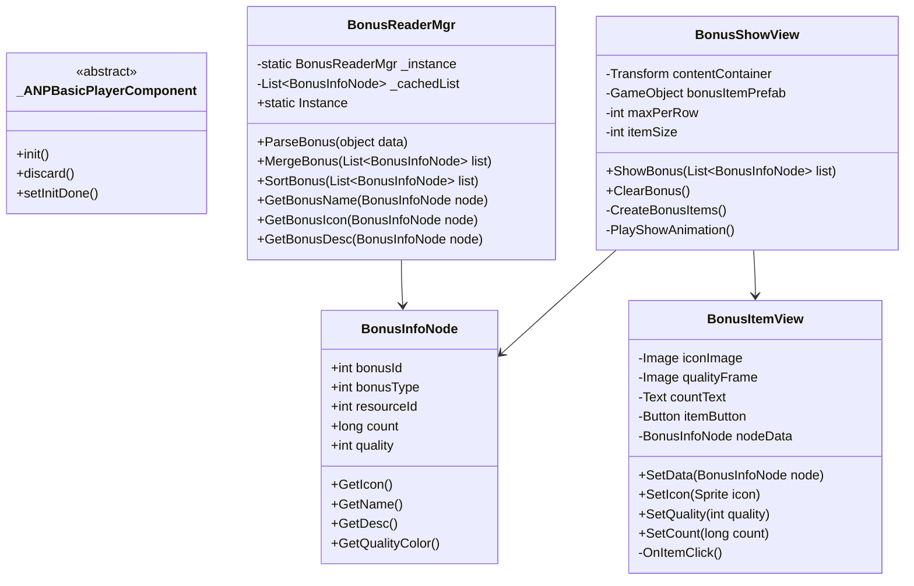
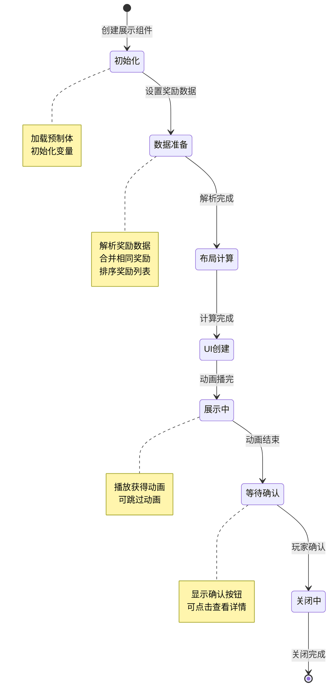

# Bonus 奖励系统模块 - 客户端开发文档

## 概述

本文档描述奖励系统（Bonus）的客户端开发实现，包括组件结构、核心类设计、协议交互、UI展示等内容。

---

## 一、组件架构

### 1.1 组件结构图



### 1.2 目录结构

```
game_client/Assets/Scripts/LogicScripts/GameComponent/Bonus/
├── BonusInfoNode.cs                 # 奖励信息节点
├── BonusType.cs                     # 奖励类型枚举
└── QualityType.cs                   # 品质类型枚举

game_client/Assets/Scripts/ResScripts/NPResCommon/UnionBonus/
├── BonusReaderMgr.cs                # 奖励读取管理器
├── BonusMerger.cs                   # 奖励合并器
├── BonusSorter.cs                   # 奖励排序器
└── BonusFormatter.cs                # 奖励格式化器

game_client/Assets/Scripts/LogicScripts/GameWndGui/GGui/Bonus/
├── BonusShowWnd.cs                  # 奖励展示窗口
├── BonusItemView.cs                 # 奖励项视图
└── BonusPreviewWnd.cs               # 奖励预览窗口
```

---

## 二、核心类详解

### 2.1 BonusInfoNode - 奖励信息节点

**用途**: 存储单个奖励的完整信息

**核心属性**:

| 属性名 | 类型 | 说明 | 默认值 |
|--------|------|------|--------|
| bonusId | int | 奖励ID | 0 |
| bonusType | int | 奖励类型 | 1 |
| resourceId | int | 资源ID | 0 |
| count | long | 数量 | 1 |
| quality | int | 品质 | 1 |

**完整代码**:

```csharp
/// <summary>
/// 奖励信息节点
/// </summary>
public class BonusInfoNode
{
    /// <summary>奖励ID</summary>
    public int bonusId;

    /// <summary>奖励类型 (1:资源, 2:物品, 3:英雄, 4:皮肤, 5:称号)</summary>
    public int bonusType;

    /// <summary>资源ID</summary>
    public int resourceId;

    /// <summary>数量</summary>
    public long count;

    /// <summary>品质 (1-6)</summary>
    public int quality;

    /// <summary>
    /// 获取奖励图标
    /// </summary>
    public Sprite GetIcon()
    {
        string iconPath = GetIconPath();
        if (!string.IsNullOrEmpty(iconPath))
        {
            return Resources.Load<Sprite>(iconPath);
        }
        return GetDefaultIcon();
    }

    /// <summary>
    /// 获取奖励名称
    /// </summary>
    public string GetName()
    {
        switch ((EBonusType)bonusType)
        {
            case EBonusType.RESOURCE:
                var resConfig = GRefdataCoreMgr.instance.getResourceConfig(resourceId);
                return resConfig != null ? resConfig.name : "未知资源";

            case EBonusType.ITEM:
                var itemConfig = GRefdataCoreMgr.instance.getItemConfig(resourceId);
                return itemConfig != null ? itemConfig.name : "未知物品";

            case EBonusType.HERO:
                var heroConfig = GRefdataCoreMgr.instance.getHeroConfig(resourceId);
                return heroConfig != null ? heroConfig.name : "未知英雄";

            case EBonusType.SKIN:
                var skinConfig = GRefdataCoreMgr.instance.getSkinConfig(resourceId);
                return skinConfig != null ? skinConfig.name : "未知皮肤";

            case EBonusType.TITLE:
                var titleConfig = GRefdataCoreMgr.instance.getTitleConfig(resourceId);
                return titleConfig != null ? titleConfig.name : "未知称号";

            default:
                return "未知奖励";
        }
    }

    /// <summary>
    /// 获取奖励描述
    /// </summary>
    public string GetDesc()
    {
        switch ((EBonusType)bonusType)
        {
            case EBonusType.RESOURCE:
                var resConfig = GRefdataCoreMgr.instance.getResourceConfig(resourceId);
                return resConfig != null ? resConfig.desc : "";

            case EBonusType.ITEM:
                var itemConfig = GRefdataCoreMgr.instance.getItemConfig(resourceId);
                return itemConfig != null ? itemConfig.desc : "";

            default:
                return "";
        }
    }

    /// <summary>
    /// 获取品质颜色
    /// </summary>
    public Color GetQualityColor()
    {
        return BonusReaderMgr.Instance.GetQualityColor(quality);
    }

    /// <summary>
    /// 获取图标路径
    /// </summary>
    private string GetIconPath()
    {
        string prefix = BonusReaderMgr.Instance.GetIconPrefix(bonusType);
        return $"UI/Icons/{prefix}{resourceId}";
    }

    /// <summary>
    /// 获取默认图标
    /// </summary>
    private Sprite GetDefaultIcon()
    {
        return Resources.Load<Sprite>("UI/Icons/default_icon");
    }
}
```

### 2.2 BonusReaderMgr - 奖励读取管理器

**用途**: 单例管理器，负责奖励数据的解析、合并、排序

**核心方法**:

| 方法名 | 参数 | 返回值 | 说明 |
|--------|------|--------|------|
| ParseBonus | object data | List\<BonusInfoNode\> | 解析奖励数据 |
| MergeBonus | List\<BonusInfoNode\> list | List\<BonusInfoNode\> | 合并相同奖励 |
| SortBonus | List\<BonusInfoNode\> list | List\<BonusInfoNode\> | 排序奖励列表 |
| GetIconPrefix | int bonusType | string | 获取图标前缀 |
| GetQualityColor | int quality | Color | 获取品质颜色 |

**完整代码**:

```csharp
/// <summary>
/// 奖励读取管理器
/// </summary>
public class BonusReaderMgr : MonoBehaviour
{
    private static BonusReaderMgr _instance;
    public static BonusReaderMgr Instance
    {
        get
        {
            if (_instance == null)
            {
                GameObject go = new GameObject("BonusReaderMgr");
                _instance = go.AddComponent<BonusReaderMgr>();
                DontDestroyOnLoad(go);
            }
            return _instance;
        }
    }

    /// <summary>
    /// 解析奖励数据（多格式支持）
    /// </summary>
    public List<BonusInfoNode> ParseBonus(object bonusData)
    {
        List<BonusInfoNode> result = new List<BonusInfoNode>();

        if (bonusData == null)
        {
            return result;
        }

        // 根据数据类型解析
        if (bonusData is JsonData jsonData)
        {
            result = ParseFromJson(jsonData);
        }
        else if (bonusData is List<NPCommonBonusInfo> protocolList)
        {
            result = ParseFromProtocol(protocolList);
        }
        else if (bonusData is List<NPCommonCostItem> costList)
        {
            result = ParseFromCostItems(costList);
        }
        else if (bonusData is long configId)
        {
            result = ParseFromConfig(configId);
        }

        return result;
    }

    /// <summary>
    /// 从协议解析奖励列表
    /// </summary>
    public List<BonusInfoNode> ParseFromProtocol(List<NPCommonBonusInfo> bonusList)
    {
        List<BonusInfoNode> result = new List<BonusInfoNode>();

        if (bonusList == null || bonusList.Count == 0)
            return result;

        foreach (var bonus in bonusList)
        {
            BonusInfoNode node = new BonusInfoNode
            {
                bonusType = bonus.getBonusType(),
                resourceId = bonus.getResourceId(),
                count = bonus.getCount(),
                quality = bonus.getQuality()
            };

            if (ValidateBonusNode(node))
            {
                result.Add(node);
            }
        }

        return result;
    }

    /// <summary>
    /// 合并相同类型的奖励
    /// </summary>
    public List<BonusInfoNode> MergeBonus(List<BonusInfoNode> bonusList)
    {
        if (bonusList == null || bonusList.Count == 0)
        {
            return new List<BonusInfoNode>();
        }

        // 按类型和ID分组
        Dictionary<string, BonusInfoNode> mergedDict = new Dictionary<string, BonusInfoNode>();

        foreach (var node in bonusList)
        {
            // 检查该类型是否可合并
            if (!CanMerge(node.bonusType))
            {
                continue;
            }

            string key = $"{node.bonusType}_{node.resourceId}";

            if (mergedDict.ContainsKey(key))
            {
                // 合并数量
                mergedDict[key].count += node.count;
                // 取最高品质
                mergedDict[key].quality = Math.Max(mergedDict[key].quality, node.quality);
            }
            else
            {
                // 创建新节点
                mergedDict[key] = new BonusInfoNode
                {
                    bonusId = node.bonusId,
                    bonusType = node.bonusType,
                    resourceId = node.resourceId,
                    count = node.count,
                    quality = node.quality
                };
            }
        }

        // 添加不可合并的奖励
        foreach (var node in bonusList)
        {
            if (!CanMerge(node.bonusType))
            {
                mergedDict[$"{node.bonusType}_{node.resourceId}_{node.bonusId}"] = node;
            }
        }

        return mergedDict.Values.ToList();
    }

    /// <summary>
    /// 排序奖励列表
    /// </summary>
    public List<BonusInfoNode> SortBonus(List<BonusInfoNode> bonusList)
    {
        if (bonusList == null || bonusList.Count == 0)
        {
            return new List<BonusInfoNode>();
        }

        return bonusList
            .OrderByDescending(node => CalculateSortWeight(node))
            .ToList();
    }

    /// <summary>
    /// 计算排序权重
    /// </summary>
    private int CalculateSortWeight(BonusInfoNode node)
    {
        // 品质权重最高，然后是类型，最后是ID
        return node.quality * 10000 + node.bonusType * 100 + (int)(node.resourceId % 100);
    }

    /// <summary>
    /// 判断是否可合并
    /// </summary>
    private bool CanMerge(int bonusType)
    {
        var config = GRefdataCoreMgr.instance.getBonusTypeConfig(bonusType);
        return config != null && config.canMerge;
    }

    /// <summary>
    /// 获取图标前缀
    /// </summary>
    public string GetIconPrefix(int bonusType)
    {
        var config = GRefdataCoreMgr.instance.getBonusTypeConfig(bonusType);
        return config != null ? config.iconPrefix : "item_";
    }

    /// <summary>
    /// 获取品质颜色
    /// </summary>
    public Color GetQualityColor(int quality)
    {
        var config = GRefdataCoreMgr.instance.getQualityConfig(quality);
        if (config != null && ColorUtility.TryParseHtmlString(config.colorHex, out Color color))
        {
            return color;
        }
        return Color.white;
    }

    /// <summary>
    /// 校验奖励节点
    /// </summary>
    private bool ValidateBonusNode(BonusInfoNode node)
    {
        if (node.bonusType < 1 || node.bonusType > 5)
        {
            Debug.LogWarning($"无效的bonusType: {node.bonusType}");
            return false;
        }

        if (node.resourceId <= 0)
        {
            Debug.LogWarning($"无效的resourceId: {node.resourceId}");
            return false;
        }

        if (node.count < 1)
        {
            node.count = 1;
        }

        if (node.quality < 1 || node.quality > 6)
        {
            node.quality = 1;
        }

        return true;
    }
}
```

---

## 三、UI展示组件

### 3.1 BonusShowView - 奖励展示视图

```csharp
/// <summary>
/// 奖励展示视图
/// </summary>
public class BonusShowView : MonoBehaviour
{
    [Header("UI组件")]
    [SerializeField] private Transform contentContainer;
    [SerializeField] private GameObject bonusItemPrefab;
    [SerializeField] private Button confirmButton;

    [Header("布局配置")]
    [SerializeField] private int maxPerRow = 5;
    [SerializeField] private int itemSize = 80;
    [SerializeField] private int spacing = 10;

    [Header("动画配置")]
    [SerializeField] private float animDuration = 0.2f;
    [SerializeField] private float animDelay = 0.05f;

    private List<BonusInfoNode> _bonusList;

    private void Awake()
    {
        confirmButton.onClick.AddListener(OnConfirmClick);
    }

    /// <summary>
    /// 显示奖励
    /// </summary>
    public void ShowBonus(List<BonusInfoNode> bonusList)
    {
        _bonusList = bonusList;

        // 清空容器
        ClearBonus();

        if (bonusList == null || bonusList.Count == 0)
        {
            gameObject.SetActive(false);
            return;
        }

        // 合并并排序
        var mergedList = BonusReaderMgr.Instance.MergeBonus(bonusList);
        var sortedList = BonusReaderMgr.Instance.SortBonus(mergedList);

        // 创建奖励项
        CreateBonusItems(sortedList);

        // 播放动画
        StartCoroutine(PlayShowAnimation());

        // 显示窗口
        gameObject.SetActive(true);
    }

    /// <summary>
    /// 清空奖励
    /// </summary>
    public void ClearBonus()
    {
        foreach (Transform child in contentContainer)
        {
            Destroy(child.gameObject);
        }
    }

    /// <summary>
    /// 创建奖励项
    /// </summary>
    private void CreateBonusItems(List<BonusInfoNode> bonusList)
    {
        int totalCount = bonusList.Count;

        for (int i = 0; i < totalCount; i++)
        {
            BonusInfoNode node = bonusList[i];
            GameObject itemObj = Instantiate(bonusItemPrefab, contentContainer);

            // 设置位置
            int row = i / maxPerRow;
            int col = i % maxPerRow;
            RectTransform rect = itemObj.GetComponent<RectTransform>();
            rect.anchoredPosition = new Vector2(
                col * (itemSize + spacing),
                -row * (itemSize + spacing)
            );

            // 设置内容
            BonusItemView itemView = itemObj.GetComponent<BonusItemView>();
            itemView.SetData(node);
        }

        // 调整容器大小
        int rowCount = Mathf.CeilToInt((float)totalCount / maxPerRow);
        AdjustContainerSize(rowCount);
    }

    /// <summary>
    /// 调整容器大小
    /// </summary>
    private void AdjustContainerSize(int rowCount)
    {
        float height = rowCount * (itemSize + spacing) + spacing;
        contentContainer.GetComponent<RectTransform>().sizeDelta = new Vector2(0, height);
    }

    /// <summary>
    /// 播放展示动画
    /// </summary>
    private IEnumerator PlayShowAnimation()
    {
        // 先隐藏所有项
        foreach (Transform child in contentContainer)
        {
            child.localScale = Vector3.zero;
        }

        // 逐个显示
        foreach (Transform child in contentContainer)
        {
            child.DOScale(1f, animDuration).SetEase(Ease.OutBack);
            yield return new WaitForSeconds(animDelay);
        }
    }

    /// <summary>
    /// 确认按钮点击
    /// </summary>
    private void OnConfirmClick()
    {
        gameObject.SetActive(false);
    }
}
```

### 3.2 BonusItemView - 奖励项视图

```csharp
/// <summary>
/// 奖励项视图
/// </summary>
public class BonusItemView : MonoBehaviour
{
    [Header("UI组件")]
    [SerializeField] private Image iconImage;
    [SerializeField] private Image qualityFrame;
    [SerializeField] private Text nameText;
    [SerializeField] private Text countText;
    [SerializeField] private Button itemButton;

    private BonusInfoNode _nodeData;

    private void Awake()
    {
        itemButton.onClick.AddListener(OnItemClick);
    }

    /// <summary>
    /// 设置数据
    /// </summary>
    public void SetData(BonusInfoNode node)
    {
        _nodeData = node;

        // 设置图标
        SetIcon(node.GetIcon());

        // 设置品质边框
        SetQuality(node.quality);

        // 设置名称
        if (nameText != null)
        {
            nameText.text = node.GetName();
        }

        // 设置数量
        SetCount(node.count);
    }

    /// <summary>
    /// 设置图标
    /// </summary>
    public void SetIcon(Sprite icon)
    {
        if (iconImage != null)
        {
            iconImage.sprite = icon ?? GetDefaultIcon();
        }
    }

    /// <summary>
    /// 设置品质
    /// </summary>
    public void SetQuality(int quality)
    {
        if (qualityFrame != null)
        {
            Sprite frame = GetQualityFrame(quality);
            qualityFrame.sprite = frame;
        }
    }

    /// <summary>
    /// 设置数量
    /// </summary>
    public void SetCount(long count)
    {
        if (countText != null)
        {
            if (count > 1)
            {
                countText.text = FormatCount(count);
                countText.gameObject.SetActive(true);
            }
            else
            {
                countText.gameObject.SetActive(false);
            }
        }
    }

    /// <summary>
    /// 获取品质边框
    /// </summary>
    private Sprite GetQualityFrame(int quality)
    {
        string frameName = $"UI/Quality/frame_{GetQualityName(quality)}";
        return Resources.Load<Sprite>(frameName);
    }

    /// <summary>
    /// 获取品质名称
    /// </summary>
    private string GetQualityName(int quality)
    {
        switch (quality)
        {
            case 1: return "white";
            case 2: return "green";
            case 3: return "blue";
            case 4: return "purple";
            case 5: return "orange";
            case 6: return "gold";
            default: return "white";
        }
    }

    /// <summary>
    /// 格式化数量显示
    /// </summary>
    private string FormatCount(long count)
    {
        if (count >= 1000000)
        {
            return $"{count / 1000000f:F1}M";
        }
        else if (count >= 1000)
        {
            return $"{count / 1000f:F1}K";
        }
        return count.ToString();
    }

    /// <summary>
    /// 获取默认图标
    /// </summary>
    private Sprite GetDefaultIcon()
    {
        return Resources.Load<Sprite>("UI/Icons/default_icon");
    }

    /// <summary>
    /// 点击事件
    /// </summary>
    private void OnItemClick()
    {
        if (_nodeData != null)
        {
            // 显示详细信息弹窗
            UIManager.Instance.ShowBonusDetail(_nodeData);
        }
    }
}
```

---

## 四、使用示例

### 4.1 解析并展示奖励

```csharp
/// <summary>
/// 解析并展示奖励示例
/// </summary>
public void ShowRewardExample()
{
    // 假设从协议获取的奖励列表
    List<NPCommonBonusInfo> protocolBonusList = GetBonusFromProtocol();

    // 1. 解析奖励数据
    List<BonusInfoNode> bonusList = BonusReaderMgr.Instance.ParseFromProtocol(protocolBonusList);

    // 2. 合并相同奖励
    List<BonusInfoNode> mergedList = BonusReaderMgr.Instance.MergeBonus(bonusList);

    // 3. 排序奖励
    List<BonusInfoNode> sortedList = BonusReaderMgr.Instance.SortBonus(mergedList);

    // 4. 展示奖励
    UIManager.Instance.ShowBonusReward(sortedList);
}
```

### 4.2 监听协议并展示奖励

```csharp
/// <summary>
/// 任务完成监听器
/// </summary>
public class QuestCompleteListener : _ANPGSSubDealer
{
    public override void dealMessage(GS2GC_XXX_RetCompleteQuest msg)
    {
        if (msg == null) return;

        // 获取奖励列表
        List<NPCommonBonusInfo> bonusList = msg.getRewardList();

        if (bonusList != null && bonusList.Count > 0)
        {
            // 解析并展示奖励
            List<BonusInfoNode> nodes = BonusReaderMgr.Instance.ParseFromProtocol(bonusList);
            UIManager.Instance.ShowBonusReward(nodes);
        }
    }
}
```

### 4.3 预览奖励

```csharp
/// <summary>
/// 预览奖励示例
/// </summary>
public void PreviewRewardExample(long configId)
{
    // 从配置ID获取奖励预览
    var config = GRefdataCoreMgr.instance.getBonusConfig(configId);
    if (config != null && config.rewardList != null)
    {
        List<BonusInfoNode> bonusList = BonusReaderMgr.Instance.ParseFromCostItems(config.rewardList);
        UIManager.Instance.ShowBonusPreview(bonusList);
    }
}
```

---

## 五、UI交互流程

### 5.1 奖励展示状态机



### 5.2 UI消息定义

| 消息类型 | 说明 | 参数 |
|----------|------|------|
| WinMsgType.SHOW_BONUS_REWARD | 显示奖励弹窗 | List\<BonusInfoNode\> |
| WinMsgType.SHOW_BONUS_PREVIEW | 显示奖励预览 | List\<BonusInfoNode\> |
| WinMsgType.SHOW_BONUS_DETAIL | 显示奖励详情 | BonusInfoNode |
| WinMsgType.CLOSE_BONUS | 关闭奖励弹窗 | 无 |

---

## 六、性能优化建议

### 6.1 对象池优化

```csharp
/// <summary>
/// 奖励项对象池
/// </summary>
public class BonusItemPool
{
    private Queue<GameObject> _pool = new Queue<GameObject>();
    private GameObject _prefab;
    private Transform _parent;

    public BonusItemPool(GameObject prefab, Transform parent, int initialSize = 10)
    {
        _prefab = prefab;
        _parent = parent;

        for (int i = 0; i < initialSize; i++)
        {
            GameObject obj = Instantiate(prefab, parent);
            obj.SetActive(false);
            _pool.Enqueue(obj);
        }
    }

    public GameObject Get()
    {
        if (_pool.Count > 0)
        {
            GameObject obj = _pool.Dequeue();
            obj.SetActive(true);
            return obj;
        }
        return Instantiate(_prefab, _parent);
    }

    public void Return(GameObject obj)
    {
        obj.SetActive(false);
        _pool.Enqueue(obj);
    }
}
```

### 6.2 图标异步加载

```csharp
/// <summary>
/// 异步加载图标
/// </summary>
public async Task<Sprite> LoadIconAsync(int bonusType, int resourceId)
{
    string iconPath = GetIconPath(bonusType, resourceId);

    // 检查缓存
    if (_iconCache.TryGetValue(iconPath, out Sprite cachedSprite))
    {
        return cachedSprite;
    }

    // 异步加载
    ResourceRequest request = Resources.LoadAsync<Sprite>(iconPath);
    await Task.Yield();

    while (!request.isDone)
    {
        await Task.Yield();
    }

    Sprite sprite = request.asset as Sprite;

    // 缓存结果
    if (sprite != null)
    {
        _iconCache[iconPath] = sprite;
    }

    return sprite;
}
```

---

## 七、调试技巧

### 7.1 日志输出

```csharp
// 关键日志点
Debug.Log($"[Bonus] 解析奖励: type={bonusType}, id={resourceId}, count={count}");
Debug.Log($"[Bonus] 合并奖励: 合并了 {mergedCount} 个相同奖励");
Debug.Log($"[Bonus] 排序奖励: 按 {sortType} 排序完成");
```

### 7.2 GM命令调试

```csharp
// 测试奖励展示
// GM: bonus test [count]
public void GMTestBonus(int count)
{
    List<BonusInfoNode> testList = new List<BonusInfoNode>();

    for (int i = 0; i < count; i++)
    {
        testList.Add(new BonusInfoNode
        {
            bonusType = Random.Range(1, 6),
            resourceId = Random.Range(1, 1000),
            count = Random.Range(1, 100),
            quality = Random.Range(1, 7)
        });
    }

    UIManager.Instance.ShowBonusReward(testList);
}
```

---

## 八、文件位置

| 类型 | 路径 |
|------|------|
| 组件类 | `game_client/Assets/Scripts/LogicScripts/GameComponent/Bonus/` |
| 管理器 | `game_client/Assets/Scripts/ResScripts/NPResCommon/UnionBonus/` |
| UI界面 | `game_client/Assets/Scripts/LogicScripts/GameWndGui/GGui/Bonus/` |
| 预制体 | `game_client/Assets/Resources/Prefabs/UI/Bonus/` |

---

*文档生成时间: 2026-04-12*
*文档版本: v2.0.0*
